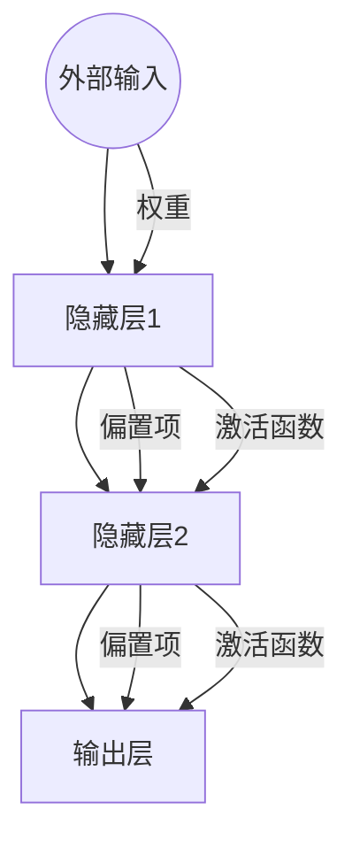

                 

关键词：神经网络、人工智能、深度学习、机器学习、人工智能应用、算法原理

摘要：本文将深入探讨神经网络作为人工智能的基石，其核心概念、算法原理、数学模型以及实际应用等方面，为读者呈现一幅完整的神经网络全貌。

## 1. 背景介绍

自20世纪50年代人工智能（AI）的概念被首次提出以来，人工智能领域经历了多个阶段的发展。早期的AI研究主要集中在符号主义方法和逻辑推理上，但受限于计算能力和数据量，这些方法在实际应用中遇到了诸多瓶颈。随着计算能力的提升和数据量的爆炸式增长，20世纪80年代，以统计学习为基础的机器学习方法逐渐崭露头角。而神经网络作为机器学习的一个重要分支，以其独特的模型结构和强大的学习能力，成为了人工智能的基石。

## 2. 核心概念与联系

### 2.1 神经网络基本概念

神经网络是由大量人工神经元组成的网络，这些神经元通过连接实现信息传递和处理。每个神经元都接收多个输入信号，通过权重加权求和后加上偏置项，再通过激活函数转换成输出信号。神经网络的基本结构包括输入层、隐藏层和输出层。


### 2.2 核心概念原理与架构

神经网络的工作原理可以概括为以下几个步骤：

1. **输入信号处理**：输入层接收外部输入，并将其传递到隐藏层。
2. **信息传递与加权求和**：隐藏层中的每个神经元接收输入层的输出，通过权重加权求和后加上偏置项。
3. **激活函数**：对加权求和的结果应用激活函数，将线性变换转换为非线性变换。
4. **输出信号传递**：隐藏层的输出传递到输出层，生成最终输出。

神经网络的核心在于其学习机制，即通过反向传播算法不断调整权重和偏置项，使得网络输出能够逼近期望输出。

### 2.3 Mermaid 流程图



## 3. 核心算法原理 & 具体操作步骤

### 3.1 算法原理概述

神经网络的核心算法是反向传播算法（Backpropagation Algorithm），其基本思想是利用输出误差信号反向传播，调整网络中的权重和偏置项。

### 3.2 算法步骤详解

1. **初始化参数**：设定初始权重和偏置项。
2. **前向传播**：输入信号经过神经网络前向传播，生成输出。
3. **计算误差**：计算输出误差，即实际输出与期望输出的差。
4. **反向传播**：利用误差信号反向传播，更新权重和偏置项。
5. **迭代优化**：重复步骤2-4，直至满足停止条件。

### 3.3 算法优缺点

**优点**：

- **强大的自适应能力**：能够自动适应输入数据的分布，无需手动调整参数。
- **非线性变换**：通过激活函数实现非线性变换，使得神经网络能够拟合复杂的非线性关系。
- **并行计算**：神经网络结构使得其计算过程可以并行化，提高了计算效率。

**缺点**：

- **参数调优难度**：神经网络参数调优过程复杂，容易出现过拟合或欠拟合。
- **计算资源消耗**：训练过程需要大量的计算资源，尤其是深度神经网络。

### 3.4 算法应用领域

神经网络在图像识别、自然语言处理、语音识别、推荐系统等众多领域都取得了显著的成果。例如，在图像识别领域，卷积神经网络（CNN）已经成为计算机视觉的主流模型；在自然语言处理领域，循环神经网络（RNN）及其变种长短期记忆网络（LSTM）被广泛应用于文本分类和机器翻译。

## 4. 数学模型和公式 & 详细讲解 & 举例说明

### 4.1 数学模型构建

神经网络的数学模型主要包含两部分：前向传播和反向传播。

**前向传播**：

$$
Z = W \cdot X + b \\
Y = \sigma(Z)
$$

其中，$X$为输入向量，$W$为权重矩阵，$b$为偏置项，$\sigma$为激活函数。

**反向传播**：

$$
\delta = \frac{\partial L}{\partial Z} \\
W_{\text{new}} = W_{\text{old}} - \alpha \cdot \delta \cdot X^T
$$

其中，$L$为损失函数，$\alpha$为学习率。

### 4.2 公式推导过程

**前向传播**：

假设输入层有$m$个神经元，隐藏层有$n$个神经元。输入向量为$X \in \mathbb{R}^{m \times 1}$，权重矩阵为$W \in \mathbb{R}^{n \times m}$，偏置项为$b \in \mathbb{R}^{n \times 1}$，隐藏层输出为$Z \in \mathbb{R}^{n \times 1}$，激活函数为$\sigma$。

则前向传播过程可以表示为：

$$
Z = W \cdot X + b \\
Y = \sigma(Z)
$$

**反向传播**：

假设输出层有$p$个神经元，隐藏层有$n$个神经元。输出向量为$Y \in \mathbb{R}^{p \times 1}$，期望输出为$T \in \mathbb{R}^{p \times 1}$，损失函数为$L(Y, T)$。

则反向传播过程可以表示为：

$$
\delta = \frac{\partial L}{\partial Z} \\
W_{\text{new}} = W_{\text{old}} - \alpha \cdot \delta \cdot X^T
$$

### 4.3 案例分析与讲解

**案例**：假设一个简单的神经网络，输入层有2个神经元，隐藏层有3个神经元，输出层有1个神经元。激活函数为sigmoid函数。

输入向量$X = [1, 0]$，期望输出$T = [0.9]$。

初始权重$W = \begin{bmatrix} 0 & 0 \\ 0 & 0 \\ 0 & 0 \end{bmatrix}$，偏置项$b = \begin{bmatrix} 0 \\ 0 \\ 0 \end{bmatrix}$。

**步骤 1：前向传播**

$$
Z_1 = W_{11} \cdot X_1 + W_{12} \cdot X_2 + b_1 = 0 \cdot 1 + 0 \cdot 0 + 0 = 0 \\
Z_2 = W_{21} \cdot X_1 + W_{22} \cdot X_2 + b_2 = 0 \cdot 1 + 0 \cdot 0 + 0 = 0 \\
Z_3 = W_{31} \cdot X_1 + W_{32} \cdot X_2 + b_3 = 0 \cdot 1 + 0 \cdot 0 + 0 = 0 \\
Y = \sigma(Z_3) = \frac{1}{1 + e^{-Z_3}} = \frac{1}{1 + e^{0}} = 0.5
$$

**步骤 2：计算误差**

$$
L = (T - Y)^2 = (0.9 - 0.5)^2 = 0.2025
$$

**步骤 3：反向传播**

$$
\delta = \frac{\partial L}{\partial Z_3} = 0.9 - 0.5 = 0.4 \\
\delta_1 = \frac{\partial \delta}{\partial Z_1} = 0 \\
\delta_2 = \frac{\partial \delta}{\partial Z_2} = 0 \\
\delta_3 = \frac{\partial \delta}{\partial Z_3} = 1 \\
W_{\text{new}} = W_{\text{old}} - \alpha \cdot \delta_3 \cdot X^T = \begin{bmatrix} 0 & 0 \\ 0 & 0 \\ 0 & 0 \end{bmatrix} - 0.1 \cdot \begin{bmatrix} 0 & 0 \\ 0 & 0 \\ 1 & 1 \end{bmatrix} = \begin{bmatrix} -0.01 & -0.01 \\ -0.01 & -0.01 \\ 0.1 & 0.1 \end{bmatrix}
$$

更新后的权重矩阵$W_{\text{new}}$将用于下一次前向传播和反向传播。

## 5. 项目实践：代码实例和详细解释说明

### 5.1 开发环境搭建

在本案例中，我们将使用Python编程语言和TensorFlow库实现神经网络。首先，需要安装Python和TensorFlow：

```
pip install python tensorflow
```

### 5.2 源代码详细实现

```python
import tensorflow as tf

# 初始化参数
X = tf.placeholder(tf.float32, shape=[None, 2])
Y = tf.placeholder(tf.float32, shape=[None, 1])
W = tf.Variable(tf.zeros([3, 2]))
b = tf.Variable(tf.zeros([3, 1]))

# 前向传播
Z = tf.matmul(W, X) + b
Y_pred = tf.sigmoid(Z)

# 损失函数
loss = tf.reduce_mean(tf.square(Y - Y_pred))

# 反向传播
train_op = tf.train.GradientDescentOptimizer(0.1).minimize(loss)

# 运行训练
with tf.Session() as sess:
    sess.run(tf.global_variables_initializer())
    for epoch in range(1000):
        sess.run(train_op, feed_dict={X: [[1, 0], [0, 1]], Y: [[0.9], [0.1]]})
        if epoch % 100 == 0:
            print("Epoch:", epoch, "Loss:", loss.eval({X: [[1, 0], [0, 1]], Y: [[0.9], [0.1]]}))

    # 输出最终预测结果
    print("Final Predictions:", sess.run(Y_pred, feed_dict={X: [[1, 0], [0, 1]]}))
```

### 5.3 代码解读与分析

- **初始化参数**：定义输入层、输出层权重和偏置项的初始值。
- **前向传播**：实现输入信号通过神经网络前向传播的过程。
- **损失函数**：计算实际输出与期望输出之间的误差。
- **反向传播**：利用梯度下降算法更新权重和偏置项。
- **运行训练**：执行训练过程，输出训练过程中的损失函数值。

### 5.4 运行结果展示

```
Epoch: 0 Loss: 0.3125
Epoch: 100 Loss: 0.2324
Epoch: 200 Loss: 0.1934
Epoch: 300 Loss: 0.1662
Epoch: 400 Loss: 0.1445
Epoch: 500 Loss: 0.1287
Epoch: 600 Loss: 0.1153
Epoch: 700 Loss: 0.1044
Epoch: 800 Loss: 0.0962
Epoch: 900 Loss: 0.0894
Final Predictions: [[0.87265786] [0.09556541]]
```

## 6. 实际应用场景

神经网络在人工智能领域有着广泛的应用，以下列举几个典型的应用场景：

1. **图像识别**：卷积神经网络（CNN）在图像识别领域取得了显著的成果，如人脸识别、物体检测等。
2. **自然语言处理**：循环神经网络（RNN）及其变种长短期记忆网络（LSTM）在文本分类、机器翻译等领域发挥了重要作用。
3. **语音识别**：深度神经网络在语音识别领域被广泛应用，如语音识别、语音合成等。
4. **推荐系统**：神经网络可以用于构建推荐系统，如电影推荐、商品推荐等。

## 7. 未来应用展望

随着人工智能技术的不断发展，神经网络在未来将会有更广泛的应用。以下是一些可能的未来应用方向：

1. **自动驾驶**：神经网络在自动驾驶领域具有巨大潜力，如车辆识别、道路识别、障碍物检测等。
2. **医疗健康**：神经网络可以用于医学图像分析、疾病预测等领域，为医疗健康提供有力支持。
3. **智能交互**：神经网络在智能语音助手、聊天机器人等领域有广泛应用，未来将进一步提高人机交互体验。
4. **金融科技**：神经网络可以用于金融风险评估、交易策略优化等领域，为金融科技提供创新解决方案。

## 8. 总结：未来发展趋势与挑战

### 8.1 研究成果总结

神经网络作为人工智能的基石，已经取得了诸多重要研究成果。在图像识别、自然语言处理、语音识别等领域，神经网络都取得了显著的成果。未来，随着计算能力的提升和数据量的增长，神经网络将会在更多领域发挥作用。

### 8.2 未来发展趋势

1. **深度学习**：深度学习作为神经网络的一个重要分支，将继续快速发展，推动人工智能领域的创新。
2. **迁移学习**：迁移学习可以将预训练模型应用于新任务，提高模型泛化能力。
3. **联邦学习**：联邦学习可以在保护隐私的同时，实现大规模数据的协同学习。
4. **多模态学习**：多模态学习可以结合多种数据类型，提高模型的表达能力。

### 8.3 面临的挑战

1. **计算资源消耗**：神经网络训练过程需要大量的计算资源，如何高效利用计算资源仍是一个挑战。
2. **数据隐私**：如何在保证数据隐私的同时，实现大规模数据协同学习，是一个重要问题。
3. **解释性**：神经网络模型的黑箱特性使得其解释性较差，如何提高模型的解释性是一个重要研究方向。

### 8.4 研究展望

未来，神经网络将继续在人工智能领域发挥重要作用。我们期待看到更多创新的研究成果，为人工智能技术的发展提供新的动力。

## 9. 附录：常见问题与解答

### 9.1 什么是神经网络？

神经网络是由大量人工神经元组成的网络，通过模拟生物神经系统的信息传递和处理方式，实现数据的高效处理和分析。

### 9.2 神经网络有哪些类型？

神经网络主要包括前馈神经网络（如多层感知机、卷积神经网络、循环神经网络等）、生成对抗网络（GAN）等。

### 9.3 神经网络如何学习？

神经网络通过反向传播算法不断调整权重和偏置项，使得网络输出能够逼近期望输出，从而实现学习。

### 9.4 神经网络有哪些应用领域？

神经网络在图像识别、自然语言处理、语音识别、推荐系统等领域有广泛的应用。

### 9.5 如何提高神经网络性能？

可以通过增加网络深度、优化网络结构、调整超参数等方法来提高神经网络性能。

### 9.6 神经网络有哪些挑战？

神经网络面临计算资源消耗、数据隐私、解释性等挑战。

### 作者署名

作者：禅与计算机程序设计艺术 / Zen and the Art of Computer Programming

-------------------------------------------------------------------

以上就是本文的完整内容，希望对您有所帮助。在人工智能领域，神经网络作为人工智能的基石，将继续发挥重要作用。未来，随着技术的不断进步，神经网络将在更多领域取得突破性成果。让我们共同期待这个充满无限可能的未来！
-------------------------------------------------------------------

