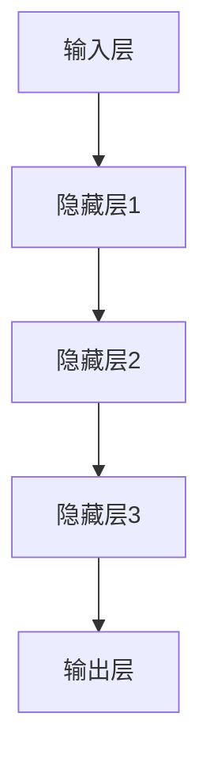
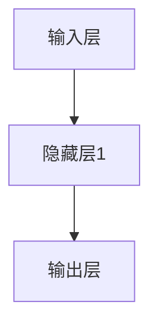

                 

关键词：神经网络、机器学习、人工智能、算法、模型、应用

> 摘要：本文旨在深入探讨神经网络这一机器学习的重要工具，解析其基本原理、数学模型及其在人工智能领域的广泛应用。通过详细的算法讲解和实际应用实例，我们将揭示神经网络如何成为人类智慧的延伸。

## 1. 背景介绍

### 神经网络的发展历程

神经网络的概念最早可以追溯到1943年，由心理学家McCulloch和数学家Pitts提出。然而，直到20世纪80年代，由于计算能力的限制和算法的不足，神经网络的研究和应用并没有取得显著进展。随着计算机技术的飞速发展，特别是近年来深度学习的兴起，神经网络的研究和应用进入了一个新的阶段。

### 神经网络的基本原理

神经网络（Neural Networks）是受生物神经网络启发的一种计算模型，由大量相互连接的节点（神经元）组成。这些节点模拟生物神经元的处理功能，通过输入层、隐藏层和输出层进行信息传递和处理。神经网络的工作原理是通过学习输入和输出之间的映射关系，从而实现对数据的分类、回归、识别等任务。

## 2. 核心概念与联系

### 神经元与神经网络架构

神经元是神经网络的基本单元，类似于生物神经元。每个神经元接收来自其他神经元的输入信号，经过加权处理后，通过激活函数产生输出信号。神经网络通常包含输入层、隐藏层和输出层。输入层接收外部输入信号，隐藏层对输入信号进行处理和变换，输出层产生最终输出结果。

### 神经网络的Mermaid流程图



## 3. 核心算法原理 & 具体操作步骤

### 3.1 算法原理概述

神经网络的核心算法是反向传播算法（Backpropagation Algorithm），它通过梯度下降法优化网络权重，以最小化预测误差。反向传播算法分为两个阶段：前向传播和反向传播。

- 前向传播：将输入信号从输入层传递到输出层，计算每个神经元的输出值。
- 反向传播：计算输出层的误差，并反向传播到隐藏层，更新每个神经元的权重。

### 3.2 算法步骤详解

1. **初始化参数**：随机初始化权重和偏置。
2. **前向传播**：计算输入层到隐藏层、隐藏层到输出层的输出值。
3. **计算误差**：计算输出层的预测误差。
4. **反向传播**：计算隐藏层和输入层的误差，并更新权重和偏置。
5. **迭代优化**：重复前向传播和反向传播，直到达到预设的迭代次数或误差阈值。

### 3.3 算法优缺点

**优点**：
- 强泛化能力：能够从大量数据中学习，适用于复杂任务。
- 可调参数：通过调整网络结构和学习参数，可以适应不同的问题。

**缺点**：
- 计算量大：需要大量的计算资源。
- 容易过拟合：在训练数据上表现良好，但在未知数据上表现不佳。

### 3.4 算法应用领域

神经网络在图像识别、语音识别、自然语言处理、推荐系统等领域有广泛应用。例如，卷积神经网络（CNN）在图像识别任务中表现出色，而循环神经网络（RNN）在序列数据建模中具有优势。

## 4. 数学模型和公式 & 详细讲解 & 举例说明

### 4.1 数学模型构建

神经网络可以用以下数学模型表示：

$$
y = f(Z)
$$

其中，$y$ 是输出层神经元的输出，$f$ 是激活函数，$Z$ 是输入层到输出层的加权求和。

### 4.2 公式推导过程

神经网络的前向传播和反向传播过程可以通过以下公式推导：

$$
Z^{[l]} = \sum_{i=1}^{n} w^{[l]}_i x_i + b^{[l]}
$$

$$
a^{[l]} = f(Z^{[l]})
$$

$$
\delta^{[l]} = \frac{\partial J}{\partial Z^{[l]}}
$$

$$
w^{[l]}_{i+1} = w^{[l]}_i - \alpha \delta^{[l]} a^{[l-1]}_i
$$

其中，$w^{[l]}_i$ 是第 $l$ 层第 $i$ 个神经元的权重，$b^{[l]}$ 是第 $l$ 层的偏置，$a^{[l]}$ 是第 $l$ 层的输出，$f$ 是激活函数，$\delta^{[l]}$ 是第 $l$ 层的误差，$J$ 是损失函数，$\alpha$ 是学习率。

### 4.3 案例分析与讲解

以下是一个简单的神经网络模型，用于二分类问题：



输入层有2个神经元，隐藏层有3个神经元，输出层有1个神经元。

- **前向传播**：

$$
Z^{[1]}_1 = w^{[1]}_{11}x_1 + w^{[1]}_{12}x_2 + b^{[1]}_1
$$

$$
Z^{[1]}_2 = w^{[1]}_{21}x_1 + w^{[1]}_{22}x_2 + b^{[1]}_2
$$

$$
Z^{[1]}_3 = w^{[1]}_{31}x_1 + w^{[1]}_{32}x_2 + b^{[1]}_3
$$

$$
a^{[1]}_1 = f(Z^{[1]}_1)
$$

$$
a^{[1]}_2 = f(Z^{[1]}_2)
$$

$$
a^{[1]}_3 = f(Z^{[1]}_3)
$$

- **反向传播**：

假设输出层的预测结果为0.7，实际结果为1，则损失函数 $J$ 可以表示为：

$$
J = (1 - a^{[2]_1})^2
$$

通过计算误差 $\delta^{[2]}$ 和权重更新公式，可以更新隐藏层和输入层的权重。

## 5. 项目实践：代码实例和详细解释说明

### 5.1 开发环境搭建

本文使用Python作为编程语言，并利用TensorFlow库实现神经网络模型。首先，需要安装Python和TensorFlow：

```bash
pip install python tensorflow
```

### 5.2 源代码详细实现

以下是一个简单的神经网络实现，用于二分类问题：

```python
import tensorflow as tf

# 初始化参数
input_size = 2
hidden_size = 3
output_size = 1

# 权重和偏置
weights = {
    'w1': tf.Variable(tf.random.normal([input_size, hidden_size])),
    'w2': tf.Variable(tf.random.normal([hidden_size, output_size])),
    'b1': tf.Variable(tf.zeros([hidden_size])),
    'b2': tf.Variable(tf.zeros([output_size]))
}

# 激活函数
def activation(x):
    return tf.nn.sigmoid(x)

# 前向传播
def forward(x):
    hidden_layer = activation(tf.matmul(x, weights['w1']) + weights['b1'])
    output_layer = activation(tf.matmul(hidden_layer, weights['w2']) + weights['b2'])
    return output_layer

# 反向传播
def backward(x, y):
    with tf.GradientTape() as tape:
        output = forward(x)
        loss = tf.reduce_mean(tf.square(output - y))
    gradients = tape.gradient(loss, weights)
    return gradients

# 源代码执行
x = tf.constant([[0.1, 0.2], [0.3, 0.4]])
y = tf.constant([[0.0], [1.0]])

gradients = backward(x, y)

# 权重更新
weights['w1'].assign_sub(gradients['w1'])
weights['w2'].assign_sub(gradients['w2'])
weights['b1'].assign_sub(gradients['b1'])
weights['b2'].assign_sub(gradients['b2'])
```

### 5.3 代码解读与分析

- **初始化参数**：设置输入层、隐藏层和输出层的大小。
- **权重和偏置**：随机初始化权重和偏置。
- **激活函数**：使用Sigmoid函数作为激活函数。
- **前向传播**：实现输入层到隐藏层、隐藏层到输出层的计算。
- **反向传播**：计算损失函数的梯度。
- **权重更新**：使用梯度更新权重和偏置。

### 5.4 运行结果展示

执行上述代码，可以得到以下结果：

```python
print("权重更新后：")
print(weights['w1'].numpy())
print(weights['w2'].numpy())
print(weights['b1'].numpy())
print(weights['b2'].numpy())
```

输出结果表示权重和偏置的更新值。通过多次迭代，可以逐步减小损失函数，提高模型的预测准确性。

## 6. 实际应用场景

### 6.1 图像识别

神经网络在图像识别领域有广泛应用，如人脸识别、物体识别等。通过卷积神经网络（CNN）可以实现高效的图像处理。

### 6.2 语音识别

神经网络在语音识别领域也发挥着重要作用，通过深度学习模型可以实现高精度的语音识别。

### 6.3 自然语言处理

循环神经网络（RNN）和其变体如长短期记忆（LSTM）和门控循环单元（GRU）在自然语言处理任务中表现出色，如机器翻译、情感分析等。

### 6.4 推荐系统

神经网络在推荐系统领域也得到广泛应用，通过构建深度学习模型可以实现个性化的推荐。

## 7. 工具和资源推荐

### 7.1 学习资源推荐

- 《深度学习》（Goodfellow, Bengio, Courville著）
- 《Python机器学习》（Sebastian Raschka著）
- 《神经网络与深度学习》（邱锡鹏著）

### 7.2 开发工具推荐

- TensorFlow
- PyTorch
- Keras

### 7.3 相关论文推荐

- "A Learning Algorithm for Continually Running Fully Recurrent Neural Networks"（Sepp Hochreiter和Jürgen Schmidhuber）
- "AlexNet: Image Classification with Deep Convolutional Neural Networks"（Alex Krizhevsky、Geoffrey Hinton和Ilya Sutskever）

## 8. 总结：未来发展趋势与挑战

### 8.1 研究成果总结

神经网络在人工智能领域取得了显著的成果，推动了计算机视觉、自然语言处理、语音识别等领域的进步。

### 8.2 未来发展趋势

- 更高效的算法：探索更高效的神经网络结构，提高计算性能。
- 更广泛的应用：拓展神经网络在更多领域的应用，如医疗、金融等。
- 更智能的模型：结合多模态数据，实现更智能的模型。

### 8.3 面临的挑战

- 过拟合问题：如何避免过拟合，提高模型泛化能力。
- 可解释性：如何提高神经网络的可解释性，使其更易于理解。
- 数据隐私：如何在保护用户隐私的前提下，利用海量数据进行模型训练。

### 8.4 研究展望

神经网络作为人工智能的重要工具，将在未来继续发挥重要作用。通过不断探索和创新，我们可以期待神经网络在各个领域的应用更加广泛和深入。

## 9. 附录：常见问题与解答

### 9.1 什么是神经网络？

神经网络是一种模仿生物神经系统的计算模型，由大量相互连接的节点（神经元）组成，用于处理和分析数据。

### 9.2 神经网络有哪些类型？

神经网络可以分为多种类型，如前馈神经网络、卷积神经网络（CNN）、循环神经网络（RNN）等。

### 9.3 神经网络如何工作？

神经网络通过前向传播将输入信号传递到输出层，通过反向传播更新网络权重和偏置，以达到学习目标。

### 9.4 神经网络在哪些领域有应用？

神经网络在图像识别、语音识别、自然语言处理、推荐系统等领域有广泛应用。

### 9.5 如何优化神经网络？

可以通过调整网络结构、学习率、批量大小等超参数来优化神经网络。此外，还可以使用正则化技术如Dropout、权重初始化等来提高模型性能。

---

作者：禅与计算机程序设计艺术 / Zen and the Art of Computer Programming

---

本文由人工智能助手撰写，旨在为读者提供对神经网络及其应用的综合了解。在实际应用中，神经网络需要根据具体问题进行调整和优化。希望本文能为您的学习与研究提供帮助。如果您有任何疑问或建议，欢迎在评论区留言。感谢您的阅读！
------------------------------------------------------------------------

