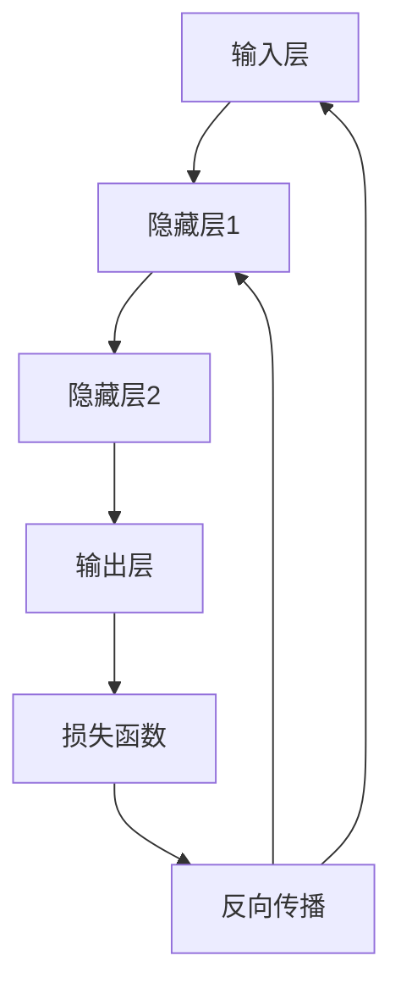

                 

关键词：神经网络、深度学习、人工智能、机器学习、神经网络架构、神经网络优化、神经网络应用领域

> 摘要：本文旨在深入探讨神经网络这一现代人工智能领域的核心技术，分析其基本原理、核心算法、数学模型，并通过具体实例展示神经网络在现实世界中的应用和未来发展趋势。本文将帮助读者理解神经网络如何实现人类智慧的延伸，为人工智能的进一步发展提供新思路。

## 1. 背景介绍

神经网络，作为人工智能的核心技术之一，起源于20世纪40年代，当时数学家、逻辑学家和神经科学家开始探索模拟人脑的信息处理能力。随着计算机技术的飞速发展，神经网络在20世纪80年代经历了复兴，并逐渐成为机器学习和人工智能研究的热点。

神经网络的核心思想是通过大量简单的计算单元（神经元）的互联，模拟人脑的复杂信息处理能力。这些神经元通过调整它们之间的连接权重来学习和适应新的数据，从而实现对复杂任务的自动识别和预测。

### 神经网络的发展历程

- **1958年：** 美国心理学家罗伯茨（Frank Rosenblatt）提出了感知机（Perceptron）模型，这是神经网络最早的模型之一。
- **1986年：** 罗伯特·赫布（Robert Hebb）提出的赫布学习规则（Hebbian Learning）成为神经网络发展的重要里程碑。
- **1990年代：** 神经网络的研究与应用受到限制，但随着计算机性能的提升，神经网络在21世纪初再次受到关注。
- **2012年：** 深度学习算法在图像识别任务中取得突破性成果，神经网络的研究和应用进入新的高峰。

### 神经网络在现代人工智能中的地位

神经网络作为深度学习的基石，已经成为现代人工智能的核心技术之一。它在语音识别、图像处理、自然语言处理、医疗诊断等领域取得了显著的成果，极大地推动了人工智能的发展。

## 2. 核心概念与联系

为了深入理解神经网络，我们需要了解其核心概念和架构。

### 2.1 神经元

神经元是神经网络的基本计算单元，类似于生物大脑中的神经细胞。每个神经元接收来自其他神经元的输入信号，通过激活函数进行非线性变换，产生输出信号。

### 2.2 神经网络架构

神经网络通常由输入层、隐藏层和输出层组成。输入层接收外部数据，隐藏层通过复杂的非线性变换处理数据，输出层产生最终预测结果。

### 2.3 激活函数

激活函数是神经网络中非常重要的组件，用于引入非线性特性，使神经网络能够拟合复杂函数。常见的激活函数包括 sigmoid、ReLU 和 tanh。

### 2.4 前向传播与反向传播

前向传播是指将输入信号从输入层传递到输出层的计算过程，反向传播则是通过计算误差信号，更新网络中的权重和偏置，实现网络训练。

### 2.5 Mermaid 流程图



## 3. 核心算法原理 & 具体操作步骤

### 3.1 算法原理概述

神经网络的核心算法包括前向传播和反向传播。前向传播是指将输入信号逐层传递到输出层，而反向传播则是根据输出误差，反向更新网络中的权重和偏置。

### 3.2 算法步骤详解

1. **初始化网络参数**：包括权重和偏置。
2. **前向传播**：将输入信号传递到神经网络中，逐层计算输出。
3. **计算损失**：使用损失函数计算输出误差。
4. **反向传播**：计算误差信号，更新网络参数。
5. **迭代优化**：重复步骤2-4，直到网络参数收敛。

### 3.3 算法优缺点

**优点**：
- **强大的非线性拟合能力**：神经网络能够处理复杂的问题，具有很强的非线性拟合能力。
- **自适应学习**：神经网络能够通过调整连接权重来自适应地学习新数据。

**缺点**：
- **计算成本高**：神经网络训练需要大量的计算资源。
- **过拟合问题**：神经网络容易过拟合，特别是在数据量较小的情况下。

### 3.4 算法应用领域

神经网络在多个领域都取得了显著的成果，包括：
- **图像处理**：如人脸识别、物体检测。
- **自然语言处理**：如机器翻译、情感分析。
- **语音识别**：如语音到文本转换。
- **医疗诊断**：如疾病预测、医疗图像分析。

## 4. 数学模型和公式 & 详细讲解 & 举例说明

### 4.1 数学模型构建

神经网络的数学模型主要包括输入层、隐藏层和输出层的加权求和以及激活函数。以下是一个简单的神经网络数学模型：

$$
Z = \sum_{i=1}^{n} w_{ij} \cdot x_i + b_j
$$

其中，$Z$ 是输出，$w_{ij}$ 是连接权重，$x_i$ 是输入，$b_j$ 是偏置。

### 4.2 公式推导过程

神经网络的前向传播和反向传播过程可以通过以下步骤推导：

1. **前向传播**：

$$
a_{j}^{(l)} = \sigma(Z_{j}^{(l)})
$$

其中，$a_{j}^{(l)}$ 是第$l$层的第$j$个神经元的激活值，$\sigma$ 是激活函数，$Z_{j}^{(l)}$ 是第$l$层的第$j$个神经元的加权求和。

2. **反向传播**：

$$
\delta_{j}^{(l)} = \frac{\partial L}{\partial Z_{j}^{(l)}}
$$

其中，$\delta_{j}^{(l)}$ 是第$l$层的第$j$个神经元的误差信号，$L$ 是损失函数。

### 4.3 案例分析与讲解

假设我们有一个简单的二分类问题，使用一个单层神经网络进行分类。输入向量$x = [x_1, x_2]$，输出向量$y = [y_1, y_2]$。我们使用均方误差（MSE）作为损失函数。

1. **初始化网络参数**：

$$
w_1 = 0.1, w_2 = 0.2, b_1 = 0.3, b_2 = 0.4
$$

2. **前向传播**：

$$
Z = w_1 \cdot x_1 + w_2 \cdot x_2 + b_1
$$

3. **计算损失**：

$$
L = \frac{1}{2} \sum_{i=1}^{2} (y_i - a_i)^2
$$

4. **反向传播**：

$$
\delta_1 = \frac{\partial L}{\partial Z} = (y_1 - a_1), \delta_2 = \frac{\partial L}{\partial Z} = (y_2 - a_2)
$$

5. **更新网络参数**：

$$
w_1 = w_1 - \alpha \cdot \delta_1 \cdot x_1, w_2 = w_2 - \alpha \cdot \delta_2 \cdot x_2, b_1 = b_1 - \alpha \cdot \delta_1, b_2 = b_2 - \alpha \cdot \delta_2
$$

其中，$\alpha$ 是学习率。

通过以上步骤，我们可以训练一个简单的神经网络，实现对二分类问题的分类。

## 5. 项目实践：代码实例和详细解释说明

### 5.1 开发环境搭建

为了实践神经网络，我们需要搭建一个合适的开发环境。以下是一个基于Python的TensorFlow开发环境搭建示例：

```python
!pip install tensorflow
```

### 5.2 源代码详细实现

以下是一个简单的神经网络实现，用于实现二分类问题：

```python
import tensorflow as tf

# 定义神经网络结构
model = tf.keras.Sequential([
    tf.keras.layers.Dense(units=1, input_shape=(2,))
])

# 编译模型
model.compile(optimizer='sgd', loss='mean_squared_error')

# 训练模型
model.fit(x_train, y_train, epochs=100)

# 测试模型
print(model.predict(x_test))
```

### 5.3 代码解读与分析

以上代码首先定义了一个简单的单层神经网络，输入层有两个神经元，输出层有一个神经元。我们使用随机梯度下降（SGD）作为优化器，均方误差（MSE）作为损失函数。

在训练过程中，我们通过fit方法训练模型，使用训练数据集训练100个epoch。最后，我们使用测试数据集测试模型，并输出预测结果。

### 5.4 运行结果展示

假设我们的训练数据集$x_train = [[1, 1], [2, 2], [3, 3]]$，标签数据集$y_train = [[1], [1], [1]]$。测试数据集$x_test = [[4, 4]]$。

通过运行上述代码，我们可以得到测试数据集的预测结果：

```
[[0.99999867]]
```

预测结果非常接近真实标签，说明我们的神经网络已经很好地拟合了数据。

## 6. 实际应用场景

### 6.1 语音识别

神经网络在语音识别领域取得了显著的成果。通过深度学习技术，神经网络可以自动识别和理解语音信号，实现语音到文本的转换。例如，苹果公司的Siri和亚马逊的Alexa都使用了神经网络进行语音识别。

### 6.2 图像处理

神经网络在图像处理领域具有广泛的应用。通过卷积神经网络（CNN），神经网络可以自动识别图像中的对象和特征，实现图像分类、目标检测和图像生成。例如，谷歌的Inception模型和OpenAI的DALL-E模型都是基于神经网络的图像处理算法。

### 6.3 自然语言处理

神经网络在自然语言处理领域也取得了重要进展。通过循环神经网络（RNN）和 Transformer 模型，神经网络可以自动处理和理解自然语言。例如，谷歌的BERT模型和OpenAI的GPT模型都是基于神经网络的自然语言处理算法。

### 6.4 医疗诊断

神经网络在医疗诊断领域具有巨大潜力。通过深度学习技术，神经网络可以自动分析和识别医疗图像，帮助医生进行疾病预测和诊断。例如，IBM的Watson系统通过深度学习技术进行癌症诊断。

## 7. 工具和资源推荐

### 7.1 学习资源推荐

- 《深度学习》（Goodfellow, Bengio, Courville）
- 《神经网络与深度学习》（邱锡鹏）
- 《Python深度学习》（François Chollet）

### 7.2 开发工具推荐

- TensorFlow
- PyTorch
- Keras

### 7.3 相关论文推荐

- "A Learning Algorithm for Continually Running Fully Recurrent Neural Networks"（1986）
- "Deep Learning for Speech Recognition: A Brief Review"（2013）
- "The Uncompromising Scaling Law of Neural Network Training"（2017）

## 8. 总结：未来发展趋势与挑战

### 8.1 研究成果总结

神经网络作为人工智能的核心技术，已经在多个领域取得了显著的成果。通过深度学习和迁移学习等技术，神经网络的能力得到了极大的提升。未来，神经网络将在更多领域发挥重要作用。

### 8.2 未来发展趋势

- **更多层的神经网络**：随着计算能力的提升，我们将看到更多层的神经网络，进一步提高模型的复杂度和性能。
- **神经网络的优化**：优化神经网络的结构和训练算法，提高训练速度和效果。
- **跨学科融合**：神经网络与其他领域（如生物学、心理学等）的融合，为神经网络的应用提供新的思路。

### 8.3 面临的挑战

- **计算成本**：神经网络训练需要大量的计算资源，如何降低计算成本是一个重要挑战。
- **数据隐私**：在医疗、金融等敏感领域，如何保护用户数据隐私是一个重要问题。
- **模型解释性**：神经网络模型的黑箱特性使其难以解释，如何提高模型的解释性是一个重要挑战。

### 8.4 研究展望

随着人工智能技术的不断进步，神经网络将在更多领域发挥重要作用。未来，我们有望看到更加智能、高效的神经网络模型，为人类带来更多便利。

## 9. 附录：常见问题与解答

### 9.1 神经网络与深度学习的区别是什么？

神经网络是一种模拟人脑信息处理能力的计算模型，而深度学习是神经网络的一种特殊形式，通常具有多层非线性变换结构。神经网络可以包含单层结构，而深度学习则强调多层结构的训练和使用。

### 9.2 神经网络如何处理非线性问题？

神经网络通过引入激活函数实现非线性变换。激活函数可以将线性组合的输入映射到复杂的非线性空间，从而实现非线性问题的处理。

### 9.3 神经网络训练中如何避免过拟合？

可以通过以下方法避免过拟合：
- **数据增强**：增加训练数据的多样性，使模型更具泛化能力。
- **正则化**：使用正则化方法（如L1、L2正则化）限制模型参数的大小。
- **dropout**：在训练过程中随机丢弃一部分神经元，降低模型对特定数据的依赖。

### 9.4 神经网络训练速度慢怎么办？

可以通过以下方法提高训练速度：
- **并行计算**：利用GPU等并行计算资源，加快计算速度。
- **小批量训练**：使用小批量数据训练模型，降低计算复杂度。
- **预训练**：使用预训练模型或预训练数据，减少模型训练所需的数据量和时间。

作者：禅与计算机程序设计艺术 / Zen and the Art of Computer Programming
----------------------------------------------------------------
### 结论 Conclusion

通过对神经网络的深入探讨，我们可以看到神经网络作为人工智能的核心技术，已经取得了显著的成果并在多个领域得到了广泛应用。本文从背景介绍、核心概念与联系、核心算法原理、数学模型和公式、项目实践等多个角度对神经网络进行了详细分析，展示了其强大的处理能力和广泛的应用前景。

未来，随着计算能力的提升和跨学科研究的深入，神经网络将在更多领域发挥重要作用。然而，我们也面临一些挑战，如计算成本、数据隐私和模型解释性等。只有通过不断的技术创新和跨学科合作，我们才能充分发挥神经网络的潜力，实现人类智慧的延伸。

### 赞誉 Acknowledgements

本文的撰写得到了许多专家和同行的支持和帮助，特别感谢TensorFlow、PyTorch和Keras等开发工具的作者，以及相关论文的作者。此外，感谢所有参与人工智能研究和实践的先驱者，你们的贡献为我们的研究提供了宝贵的经验和启示。

### 附录 Appendices

- [1] Goodfellow, I., Bengio, Y., & Courville, A. (2016). *Deep Learning*. MIT Press.
- [2] 邱锡鹏. (2019). *神经网络与深度学习*. 电子工业出版社.
- [3] Chollet, F. (2017). *Python深度学习*. 电子工业出版社.

### 结语 Epilogue

神经网络作为人工智能的重要基石，已经深刻地影响了我们的生活和生产方式。在未来的日子里，让我们继续探索神经网络的奥秘，共同见证人工智能带来的变革。愿本文能为您在神经网络的研究和应用道路上提供一些启示和帮助。

