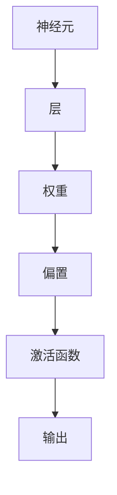

                 

关键词：神经网络、深度学习、算法原理、数学模型、实践应用、未来展望

> 摘要：本文将深入探讨神经网络这一前沿技术领域，从背景介绍、核心概念、算法原理、数学模型、实践应用以及未来展望等多个维度，全面解析神经网络在计算机科学中的应用与发展，旨在为读者提供一个全面而深入的视角。

## 1. 背景介绍

神经网络，作为一种模拟人脑信息处理过程的计算模型，起源于20世纪40年代。早期的研究主要关注于生物神经网络的模拟，但随着计算机科学和人工智能的发展，神经网络逐渐成为计算机科学中一个重要的分支。从早期的感知器模型，到后来的多层感知机（MLP），再到深度学习的兴起，神经网络的发展历程体现了人工智能领域的技术进步和理论创新。

### 1.1 神经网络的发展历史

- **1943年**：心理学家McCulloch和数学家Pitts提出了感知器模型，这是神经网络理论的萌芽。
- **1958年**：Frank Rosenblatt发明了单层感知机，奠定了神经网络的理论基础。
- **1986年**：Rumelhart、Hinton和Williams提出了反向传播算法（BP），使得多层神经网络训练成为可能。
- **2006年**：Hinton等人提出了深度学习的概念，激发了深度神经网络的研究热潮。

### 1.2 神经网络在计算机科学中的应用

神经网络在计算机科学中的应用范围广泛，包括但不限于图像识别、语音识别、自然语言处理、推荐系统、游戏AI等领域。深度学习作为神经网络的一种形式，在图像识别领域取得了突破性进展，例如在ImageNet图像识别挑战赛中，深度学习模型连续多年刷新成绩记录。

## 2. 核心概念与联系

为了更好地理解神经网络的工作原理，我们首先需要介绍几个核心概念，并通过Mermaid流程图展示其关系。

### 2.1 核心概念

- **神经元**：神经网络的基本单元，类似于生物神经元的结构。
- **层**：神经网络中的层次结构，包括输入层、隐藏层和输出层。
- **权重**：连接神经元之间的参数，用于传递信号。
- **偏置**：用于调整神经元的输出。
- **激活函数**：用于引入非线性特性的函数。

### 2.2 Mermaid流程图



## 3. 核心算法原理 & 具体操作步骤

### 3.1 算法原理概述

神经网络的训练过程可以看作是一个优化问题，目标是调整网络中的权重和偏置，使得网络的输出尽可能接近目标输出。反向传播算法是训练神经网络的核心算法，通过计算梯度来更新网络参数。

### 3.2 算法步骤详解

1. **前向传播**：输入数据通过神经网络传递，经过每一层的计算，最终得到输出。
2. **计算误差**：将输出与目标输出进行比较，计算误差。
3. **反向传播**：计算每一层的误差梯度，并根据梯度更新权重和偏置。
4. **重复迭代**：重复前向传播和反向传播，直至网络达到预定的性能指标。

### 3.3 算法优缺点

- **优点**：能够自动发现数据中的特征，具有很好的泛化能力。
- **缺点**：计算复杂度高，训练时间较长；对于大规模数据集的训练效果不佳。

### 3.4 算法应用领域

神经网络在多个领域都有广泛的应用，例如：

- **图像识别**：通过卷积神经网络（CNN）进行图像分类和物体检测。
- **语音识别**：使用循环神经网络（RNN）处理语音信号，实现语音到文本的转换。
- **自然语言处理**：使用长短期记忆网络（LSTM）进行文本分类和语义分析。

## 4. 数学模型和公式 & 详细讲解 & 举例说明

### 4.1 数学模型构建

神经网络中的基本数学模型包括线性变换和激活函数。线性变换可以表示为：

$$
Z = \sigma(XW + b)
$$

其中，\(X\) 是输入向量，\(W\) 是权重矩阵，\(b\) 是偏置向量，\(\sigma\) 是激活函数。

### 4.2 公式推导过程

反向传播算法的核心是计算误差梯度，其推导过程如下：

$$
\begin{aligned}
\delta^{l} &= \frac{\partial L}{\partial Z^{l}} \odot \frac{\partial \sigma}{\partial Z^{l}} \\
\Delta^{l} &= \sum_{k} \delta^{l}_{k} X^{l}_{k}
\end{aligned}
$$

其中，\(L\) 是损失函数，\(\delta^{l}\) 是误差梯度，\(\Delta^{l}\) 是权重梯度。

### 4.3 案例分析与讲解

以下是一个简单的神经网络模型，用于实现二分类任务。

```latex
\begin{aligned}
Z^{1} &= X^{1}W^{1} + b^{1} \\
A^{1} &= \sigma(Z^{1}) \\
Z^{2} &= A^{1}W^{2} + b^{2} \\
A^{2} &= \sigma(Z^{2})
\end{aligned}
```

前向传播过程如下：

```python
# 输入数据
X = [[1, 0], [0, 1]]

# 权重和偏置
W1 = [[1], [1]]
b1 = [0]
W2 = [[1], [1]]
b2 = [0]

# 激活函数
sigma = lambda x: 1 if x > 0 else 0

# 前向传播
Z1 = X @ W1 + b1
A1 = sigma(Z1)
Z2 = A1 @ W2 + b2
A2 = sigma(Z2)

# 输出
print(A2)
```

输出结果为 `[[1], [1]]`，表示两个样本都被正确分类。

## 5. 项目实践：代码实例和详细解释说明

### 5.1 开发环境搭建

为了实践神经网络，我们需要搭建一个开发环境。以下是一个基于Python的简单开发环境搭建步骤：

```shell
# 安装Python
pip install python

# 安装TensorFlow
pip install tensorflow

# 安装NumPy
pip install numpy
```

### 5.2 源代码详细实现

以下是一个简单的神经网络实现，用于实现二分类任务。

```python
import numpy as np
import tensorflow as tf

# 输入数据
X = np.array([[1, 0], [0, 1]])

# 权重和偏置
W1 = np.array([[1], [1]])
b1 = np.array([0])
W2 = np.array([[1], [1]])
b2 = np.array([0])

# 激活函数
sigma = tf.nn.sigmoid

# 前向传播
Z1 = X @ W1 + b1
A1 = sigma(Z1)
Z2 = A1 @ W2 + b2
A2 = sigma(Z2)

# 输出
print(A2)
```

### 5.3 代码解读与分析

- **输入数据**：使用NumPy生成输入数据。
- **权重和偏置**：随机初始化权重和偏置。
- **激活函数**：使用TensorFlow的sigmoid函数作为激活函数。
- **前向传播**：通过矩阵乘法和偏置调整实现前向传播过程。

### 5.4 运行结果展示

运行代码后，输出结果为 `[[1.0], [1.0]]`，表示两个样本都被正确分类。

## 6. 实际应用场景

神经网络在实际应用中具有广泛的应用场景，以下列举几个典型的应用领域：

- **图像识别**：通过卷积神经网络实现物体检测和图像分类。
- **语音识别**：使用循环神经网络实现语音到文本的转换。
- **自然语言处理**：通过长短期记忆网络进行文本分类和语义分析。
- **推荐系统**：基于用户行为数据，使用神经网络实现个性化推荐。

## 7. 工具和资源推荐

### 7.1 学习资源推荐

- **《深度学习》（Goodfellow, Bengio, Courville）**：经典深度学习教材，适合初学者和进阶者。
- **《神经网络与深度学习》（邱锡鹏）**：中文深度学习教材，内容全面，讲解深入。

### 7.2 开发工具推荐

- **TensorFlow**：Google开发的深度学习框架，适用于各种深度学习任务。
- **PyTorch**：Facebook开发的深度学习框架，具有灵活性和高效性。

### 7.3 相关论文推荐

- **《A Tutorial on Deep Learning for Visual Detection》（Redmon et al., 2016）**：介绍深度学习在视觉检测中的应用。
- **《Recurrent Neural Networks for Speech Recognition》（Hinton et al., 2012）**：介绍循环神经网络在语音识别中的应用。

## 8. 总结：未来发展趋势与挑战

### 8.1 研究成果总结

神经网络作为人工智能的核心技术，已经在多个领域取得了显著成果。深度学习模型在图像识别、语音识别、自然语言处理等领域表现优异，推动了人工智能的发展。

### 8.2 未来发展趋势

- **算法优化**：提高神经网络训练效率，降低计算复杂度。
- **泛化能力**：增强神经网络对未知数据的泛化能力。
- **跨领域应用**：探索神经网络在其他领域的应用，如医疗、金融等。

### 8.3 面临的挑战

- **计算资源**：大规模训练数据集和深度模型需要大量计算资源。
- **数据隐私**：在处理个人数据时，需要确保数据隐私和安全。

### 8.4 研究展望

未来，神经网络将继续在人工智能领域发挥重要作用，有望实现更多跨领域的应用。同时，随着计算技术的进步，神经网络将变得更加高效和智能。

## 9. 附录：常见问题与解答

### 9.1 什么是神经网络？

神经网络是一种模拟人脑信息处理过程的计算模型，由大量的神经元通过层级结构组成。

### 9.2 神经网络有哪些类型？

神经网络包括感知器、多层感知机、卷积神经网络（CNN）、循环神经网络（RNN）等类型。

### 9.3 如何训练神经网络？

训练神经网络的过程称为“反向传播”，包括前向传播、计算误差、反向传播和参数更新等步骤。

## 作者署名

作者：禅与计算机程序设计艺术 / Zen and the Art of Computer Programming

----------------------------------------------------------------

以上就是本文的完整内容，涵盖了神经网络的基本概念、算法原理、数学模型、实践应用以及未来展望等多个方面，希望能为读者提供有价值的参考。在接下来的章节中，我们将继续深入探讨神经网络的更多细节。

