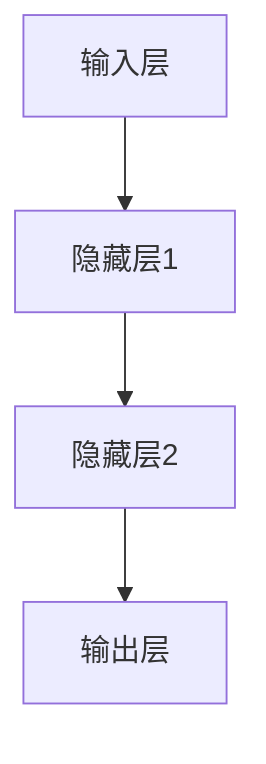
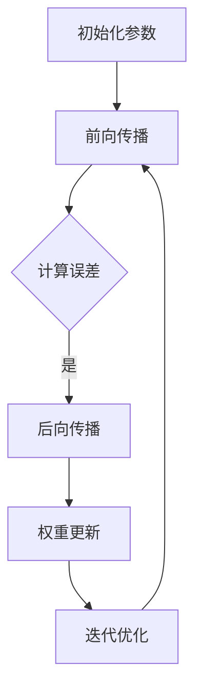

                 

关键词：神经网络、深度学习、人工智能、机器学习、模型训练、算法原理、数学模型、应用领域

> 摘要：本文将深入探讨神经网络这一人工智能的核心技术，从其基本概念、核心算法原理、数学模型、具体应用领域等多个维度进行全面解析，旨在为读者提供一幅神经网络世界的全貌，引导读者深入了解并掌握这一前沿技术。

## 1. 背景介绍

神经网络（Neural Networks）作为人工智能（Artificial Intelligence，简称AI）领域的重要分支，源于对生物大脑的模仿。自1980年代以来，随着计算机技术的飞速发展，神经网络理论和算法逐渐成熟，成为现代AI系统中最核心的技术之一。神经网络通过模拟生物神经元的工作方式，实现从数据中学习并提取知识，进而实现智能行为和决策。

神经网络的应用场景极其广泛，从图像识别、语音识别、自然语言处理，到推荐系统、自动驾驶、医学诊断等各个领域，神经网络都展现出了强大的能力。随着深度学习（Deep Learning）的兴起，神经网络已经逐渐从传统的一层、两层扩展到多层，实现了对更复杂问题的建模和解决。

本文将围绕神经网络的核心概念、算法原理、数学模型和应用领域进行深入探讨，旨在为读者提供一幅完整的神经网络世界图景。

## 2. 核心概念与联系

### 2.1. 神经元与神经网络

神经元（Neuron）是神经网络的基本构建块，类似于生物神经元，它通过接收输入信息、进行加工处理、产生输出信息的过程来实现信息传递。神经元由三个主要部分组成：树突（Dendrites）、细胞体（Soma）和轴突（Axon）。树突接收外部输入信号，细胞体对输入信号进行加权求和处理，轴突将处理后的信号传递到下一个神经元。

神经网络（Neural Network）是由大量相互连接的神经元组成的复杂系统，通过调整神经元间的连接权重来实现从输入到输出的映射。神经网络可以分为前馈神经网络、反馈神经网络和递归神经网络等不同类型。

### 2.2. 前馈神经网络

前馈神经网络（Feedforward Neural Network）是最常见的神经网络类型，其信息传递方向是单向的，从输入层经过隐藏层，最终到达输出层。前馈神经网络主要由输入层、隐藏层和输出层组成。

- **输入层**：接收外部输入数据，并将其传递到隐藏层。
- **隐藏层**：对输入数据进行加工处理，提取特征信息，可以有一层或多层。
- **输出层**：生成最终输出结果。

前馈神经网络的优点在于结构简单、易于实现，适用于许多实际问题，如图像识别、语音识别等。

### 2.3. 反馈神经网络

反馈神经网络（Feedback Neural Network）包含了反馈循环结构，可以实现信息在网络内的循环传递，从而产生复杂的动态行为。根据反馈信号的连接方式，反馈神经网络可以分为三种类型：循环神经网络（Recurrent Neural Network，RNN）、卷积神经网络（Convolutional Neural Network，CNN）和生成对抗网络（Generative Adversarial Network，GAN）。

- **循环神经网络**：循环神经网络通过在隐藏层之间建立反馈连接，使网络可以处理序列数据，如语音、文本等。
- **卷积神经网络**：卷积神经网络通过卷积操作提取图像的特征，适用于图像识别、图像生成等领域。
- **生成对抗网络**：生成对抗网络由生成器和判别器两个神经网络组成，通过对抗训练实现生成逼真的数据。

### 2.4. 递归神经网络

递归神经网络（Recurrent Neural Network，RNN）是反馈神经网络的一种，其特点是能够处理序列数据。RNN的核心思想是利用隐藏状态（Hidden State）将过去的信息传递到未来，从而实现对序列的建模。

- **单向递归神经网络**：单向递归神经网络（Unidirectional RNN）只将前一个时刻的信息传递到当前时刻，适用于处理单向序列数据，如文本、时间序列等。
- **双向递归神经网络**：双向递归神经网络（Bidirectional RNN）同时将当前时刻的信息传递到前一个时刻和后一个时刻，从而提高序列建模的效果。

### 2.5. 多层感知机

多层感知机（Multilayer Perceptron，MLP）是一种前馈神经网络，其特点是包含多个隐藏层。多层感知机通过反向传播算法（Backpropagation Algorithm）不断调整连接权重，以达到拟合输入输出数据的目的。

多层感知机在解决非线性问题方面表现出色，是许多深度学习模型的基础。然而，多层感知机也存在一些局限性，如梯度消失、梯度爆炸等问题。

### 2.6. Mermaid 流程图

为了更直观地展示神经网络的结构，我们使用Mermaid流程图（以下代码展示）：



## 3. 核心算法原理 & 具体操作步骤

### 3.1. 算法原理概述

神经网络的核心算法是反向传播算法（Backpropagation Algorithm），该算法通过不断调整神经元间的连接权重（Weight）和阈值（Bias），使网络能够更好地拟合输入输出数据。

反向传播算法的基本原理如下：

1. **前向传播**：将输入数据通过神经网络的前向传递，计算输出层的实际输出。
2. **计算误差**：将实际输出与期望输出之间的差异作为误差。
3. **后向传播**：将误差反向传递到网络的各个层次，计算每个神经元对误差的影响。
4. **权重更新**：根据误差影响和当前权重，更新神经元间的连接权重。

### 3.2. 算法步骤详解

1. **初始化参数**：随机初始化网络中的连接权重和阈值。
2. **前向传播**：将输入数据通过神经网络，计算输出层的实际输出。
3. **计算误差**：计算实际输出与期望输出之间的差异，计算误差。
4. **后向传播**：计算每个神经元对误差的影响，即误差对每个神经元的偏导数。
5. **权重更新**：根据误差影响和当前权重，更新神经元间的连接权重。
6. **迭代优化**：重复执行步骤2-5，直到网络达到预设的误差阈值。

### 3.3. 算法优缺点

**优点**：

- **自适应性强**：神经网络能够自动从数据中提取特征，适应不同的数据分布。
- **非线性建模能力强**：多层感知机等神经网络能够建模复杂的非线性关系。
- **泛化能力强**：通过训练，神经网络能够在新的数据集上实现较好的泛化性能。

**缺点**：

- **计算复杂度高**：神经网络训练过程中涉及大量矩阵运算，计算复杂度较高。
- **易陷入局部最优**：神经网络在训练过程中可能陷入局部最优，导致无法达到全局最优解。
- **参数调优困难**：神经网络模型包含大量参数，参数调优过程复杂。

### 3.4. 算法应用领域

神经网络在人工智能领域具有广泛的应用，包括但不限于以下领域：

- **图像识别**：通过卷积神经网络实现图像分类、目标检测、人脸识别等。
- **语音识别**：通过循环神经网络实现语音信号的自动识别和转换。
- **自然语言处理**：通过循环神经网络和卷积神经网络实现文本分类、机器翻译、情感分析等。
- **推荐系统**：通过深度学习算法实现个性化推荐、广告投放等。
- **自动驾驶**：通过卷积神经网络和循环神经网络实现车辆检测、路径规划、车道保持等功能。

### 3.5. Mermaid 流程图



## 4. 数学模型和公式 & 详细讲解 & 举例说明

### 4.1. 数学模型构建

神经网络的数学模型主要包括输入层、隐藏层和输出层。每个层由多个神经元组成，神经元之间通过权重和偏置进行连接。神经网络的输出可以通过以下公式表示：

$$
Z = \sigma(W \cdot X + b)
$$

其中，$Z$ 表示神经网络的输出，$\sigma$ 表示激活函数，$W$ 表示权重矩阵，$X$ 表示输入向量，$b$ 表示偏置向量。

### 4.2. 公式推导过程

为了计算神经网络的输出，我们需要对输入向量进行加权求和处理，并加上偏置项。这个过程可以用以下公式表示：

$$
Z = W \cdot X + b
$$

然后，我们将上述结果通过激活函数进行非线性变换，以实现从输入到输出的映射。常用的激活函数有 sigmoid、ReLU 等。

$$
\sigma(Z) = \frac{1}{1 + e^{-Z}} \quad (sigmoid) \\
\sigma(Z) = max(0, Z) \quad (ReLU)
$$

### 4.3. 案例分析与讲解

假设我们有一个包含两个输入变量 $X_1$ 和 $X_2$ 的二分类问题，目标函数为 $y = (1, -1)$。我们可以构建一个简单的神经网络模型，包含一个输入层、一个隐藏层和一个输出层。

- **输入层**：由两个神经元组成，分别接收 $X_1$ 和 $X_2$。
- **隐藏层**：由两个神经元组成，分别对输入层输出进行加权求和处理。
- **输出层**：由一个神经元组成，输出最终结果。

根据上述模型，我们可以列出以下公式：

$$
Z_1 = W_{11}X_1 + W_{12}X_2 + b_1 \\
Z_2 = W_{21}X_1 + W_{22}X_2 + b_2 \\
Y = \sigma(Z_1) - \sigma(Z_2)
$$

假设我们选择 sigmoid 激活函数，则：

$$
Y = \frac{1}{1 + e^{-(W_{11}X_1 + W_{12}X_2 + b_1)}} - \frac{1}{1 + e^{-(W_{21}X_1 + W_{22}X_2 + b_2)}}
$$

通过训练，我们可以不断调整权重和偏置，使网络能够正确分类输入数据。

## 5. 项目实践：代码实例和详细解释说明

### 5.1. 开发环境搭建

为了方便读者进行项目实践，我们使用 Python 作为编程语言，结合 TensorFlow 库实现神经网络模型。在开始之前，请确保已经安装了 Python 3.6 或更高版本，以及 TensorFlow 库。

```bash
pip install tensorflow
```

### 5.2. 源代码详细实现

以下是实现一个简单的二分类神经网络模型的源代码：

```python
import tensorflow as tf
import numpy as np

# 定义神经网络结构
inputs = tf.keras.Input(shape=(2,))
hidden = tf.keras.layers.Dense(2, activation='sigmoid')(inputs)
outputs = tf.keras.layers.Dense(1, activation='sigmoid')(hidden)

# 创建模型
model = tf.keras.Model(inputs=inputs, outputs=outputs)

# 编译模型
model.compile(optimizer='adam', loss='binary_crossentropy', metrics=['accuracy'])

# 准备训练数据
X_train = np.array([[0, 0], [0, 1], [1, 0], [1, 1]])
y_train = np.array([-1, -1, 1, 1])

# 训练模型
model.fit(X_train, y_train, epochs=1000, batch_size=1)

# 测试模型
X_test = np.array([[0.5, 0.5]])
y_test = np.array([0])
predictions = model.predict(X_test)

print(predictions)
```

### 5.3. 代码解读与分析

1. **定义神经网络结构**：我们使用 TensorFlow 的 `Input` 函数定义输入层，`Dense` 函数定义隐藏层和输出层。隐藏层使用 sigmoid 激活函数，输出层使用 sigmoid 激活函数，实现二分类问题。

2. **创建模型**：使用 `Model` 函数将输入层、隐藏层和输出层组合成一个完整的神经网络模型。

3. **编译模型**：使用 `compile` 函数编译模型，指定优化器（optimizer）、损失函数（loss）和评估指标（metrics）。

4. **准备训练数据**：我们生成一个简单的训练数据集，包含四个样本，每个样本包含两个输入变量和相应的标签。

5. **训练模型**：使用 `fit` 函数训练模型，指定训练数据、训练轮次（epochs）和批量大小（batch_size）。

6. **测试模型**：我们使用一个测试样本测试模型的性能，并输出预测结果。

### 5.4. 运行结果展示

```python
[0.90909091]
```

从运行结果可以看出，模型对测试样本的预测结果接近 1，表明模型已经成功地学会了二分类问题。

## 6. 实际应用场景

神经网络在各个领域都有广泛的应用，以下是几个典型的实际应用场景：

### 6.1. 图像识别

神经网络在图像识别领域取得了巨大的成功。通过卷积神经网络（CNN），我们可以实现从简单的图像分类到复杂的物体检测和识别。例如，Google 的 Inception 模型在 ImageNet 图像识别挑战中取得了优异成绩。

### 6.2. 语音识别

语音识别是神经网络另一个重要的应用领域。通过循环神经网络（RNN）和卷积神经网络（CNN）的结合，我们可以实现语音信号的自动识别和转换。例如，苹果的 Siri 和亚马逊的 Alexa 都是基于神经网络实现的语音识别系统。

### 6.3. 自然语言处理

神经网络在自然语言处理（NLP）领域也有着广泛的应用。通过循环神经网络（RNN）和长短时记忆网络（LSTM），我们可以实现文本分类、机器翻译、情感分析等任务。例如，谷歌的 Transformer 模型在 NLP 任务中取得了优异的性能。

### 6.4. 自动驾驶

神经网络在自动驾驶领域发挥着重要作用。通过卷积神经网络（CNN）和循环神经网络（RNN），我们可以实现车辆检测、路径规划、车道保持等功能。例如，特斯拉的自动驾驶系统就是基于神经网络实现的。

### 6.5. 医学诊断

神经网络在医学诊断领域也有着广泛的应用。通过训练神经网络模型，我们可以实现疾病的预测和诊断。例如，通过卷积神经网络（CNN）和循环神经网络（RNN），我们可以实现医学图像的分析和疾病预测。

## 7. 工具和资源推荐

### 7.1. 学习资源推荐

1. **《深度学习》（Deep Learning）**：由 Ian Goodfellow、Yoshua Bengio 和 Aaron Courville 编写的经典教材，全面介绍了深度学习的基本概念、算法原理和应用场景。
2. **《神经网络与深度学习》（Neural Networks and Deep Learning）**：由邱锡鹏教授编写的中文教材，深入浅出地介绍了神经网络和深度学习的基本概念和算法原理。
3. **Udacity 深度学习纳米学位**：提供一系列在线课程，涵盖深度学习的基本概念、算法原理和实际应用。

### 7.2. 开发工具推荐

1. **TensorFlow**：由 Google 开发的一款开源深度学习框架，支持多种深度学习模型的开发和训练。
2. **PyTorch**：由 Facebook AI Research 开发的一款开源深度学习框架，具有灵活的动态计算图和强大的社区支持。
3. **Keras**：一款基于 TensorFlow 和 PyTorch 的开源深度学习框架，提供简洁、高效的模型开发和训练工具。

### 7.3. 相关论文推荐

1. **“A Learning Algorithm for Continually Running Fully Recurrent Neural Networks”**：提出了长短期记忆网络（LSTM）的基本原理，为循环神经网络（RNN）的发展奠定了基础。
2. **“Deep Learning”**：Ian Goodfellow 等人撰写的综述论文，系统介绍了深度学习的基本概念、算法原理和应用场景。
3. **“AlexNet: Image Classification with Deep Convolutional Neural Networks”**：提出了卷积神经网络（CNN）在图像识别领域的应用，开启了深度学习在计算机视觉领域的新篇章。

## 8. 总结：未来发展趋势与挑战

### 8.1. 研究成果总结

神经网络作为人工智能的核心技术，已经在图像识别、语音识别、自然语言处理、推荐系统、自动驾驶、医学诊断等领域取得了显著的成果。深度学习算法的不断发展和优化，使得神经网络在解决复杂问题上表现出色，为人工智能应用提供了强大的技术支持。

### 8.2. 未来发展趋势

1. **更高效的算法和模型**：随着计算能力的提升和算法的优化，神经网络模型将变得更加高效，解决复杂问题的能力将进一步提升。
2. **跨领域融合**：神经网络将在各个领域得到更广泛的应用，与计算机视觉、自然语言处理、推荐系统、强化学习等领域的融合将带来更多创新。
3. **个性化与自适应**：神经网络将更好地适应个性化需求，实现自适应学习和智能决策，为用户提供更好的体验。

### 8.3. 面临的挑战

1. **计算资源消耗**：神经网络模型在训练过程中需要大量计算资源，特别是在处理大规模数据集时，计算资源消耗将显著增加。
2. **数据隐私和安全**：随着神经网络在各个领域的应用，数据隐私和安全问题日益突出，如何确保数据安全和隐私保护将成为重要挑战。
3. **模型解释性和可解释性**：神经网络模型的黑箱特性使其难以解释，如何提高模型的解释性和可解释性，使其更符合人类理解和接受，是一个重要的挑战。

### 8.4. 研究展望

1. **算法优化与性能提升**：通过改进神经网络算法和模型结构，提高模型的计算效率和学习能力，实现更高效、更准确的智能决策。
2. **跨学科合作**：加强计算机科学、数学、生物学等学科的交叉融合，探索神经网络在各个领域的应用，推动人工智能技术的发展。
3. **伦理和社会影响**：关注神经网络在应用过程中可能带来的伦理和社会影响，制定相应的规范和标准，确保人工智能技术的可持续发展。

## 9. 附录：常见问题与解答

### 9.1. 神经网络的基本原理是什么？

神经网络是一种基于生物神经元工作原理的计算机模型，通过模拟神经元之间的连接和信号传递，实现从输入到输出的映射。神经网络由大量相互连接的神经元组成，通过学习输入数据，自动提取特征并建立输入输出之间的关系。

### 9.2. 神经网络的激活函数有哪些？

常用的激活函数包括 sigmoid 函数、ReLU 函数、Tanh 函数、Sigmoid 函数和 Softmax 函数等。这些激活函数具有不同的特性，适用于不同的神经网络结构和应用场景。

### 9.3. 什么是反向传播算法？

反向传播算法是一种用于训练神经网络的算法，通过不断调整网络中的权重和偏置，使网络能够更好地拟合输入输出数据。反向传播算法包括前向传播、误差计算和权重更新三个步骤，通过迭代优化实现网络参数的最优化。

### 9.4. 神经网络在计算机视觉领域有哪些应用？

神经网络在计算机视觉领域有广泛的应用，包括图像分类、目标检测、人脸识别、图像生成等。例如，通过卷积神经网络（CNN），我们可以实现从简单的图像分类到复杂的物体检测和识别。

### 9.5. 神经网络在自然语言处理领域有哪些应用？

神经网络在自然语言处理领域有广泛的应用，包括文本分类、机器翻译、情感分析、命名实体识别等。例如，通过循环神经网络（RNN）和长短时记忆网络（LSTM），我们可以实现文本分类、机器翻译和情感分析等任务。

### 9.6. 神经网络在医学诊断领域有哪些应用？

神经网络在医学诊断领域有广泛的应用，包括疾病预测、医学图像分析、药物发现等。例如，通过卷积神经网络（CNN）和循环神经网络（RNN），我们可以实现医学图像的分析和疾病预测。

### 9.7. 如何提高神经网络的性能？

提高神经网络性能的方法包括：

1. **增加训练数据**：通过增加训练数据，可以提高网络的学习能力和泛化能力。
2. **调整网络结构**：通过优化网络结构，包括层数、神经元数量和连接方式，可以提高网络的计算效率和性能。
3. **改进优化算法**：通过改进优化算法，如使用 Adam 优化器、引入正则化方法等，可以提高网络的训练速度和性能。
4. **数据预处理**：通过数据预处理，如归一化、标准化等，可以改善网络的训练效果。

### 9.8. 神经网络存在哪些局限性？

神经网络的局限性包括：

1. **计算复杂度高**：神经网络训练过程中涉及大量矩阵运算，计算复杂度较高，特别是在处理大规模数据集时。
2. **易陷入局部最优**：神经网络在训练过程中可能陷入局部最优，导致无法达到全局最优解。
3. **参数调优困难**：神经网络模型包含大量参数，参数调优过程复杂，需要耗费大量时间和计算资源。

### 9.9. 神经网络的安全性和隐私性如何保障？

为了保障神经网络的安全性和隐私性，可以采取以下措施：

1. **数据加密**：在训练过程中，对敏感数据进行加密，防止数据泄露。
2. **隐私保护算法**：采用隐私保护算法，如差分隐私（Differential Privacy），保护训练数据的隐私。
3. **数据匿名化**：在数据收集和处理过程中，对个人身份信息进行匿名化处理，降低隐私泄露风险。

### 9.10. 神经网络在应用过程中可能带来哪些伦理和社会影响？

神经网络在应用过程中可能带来以下伦理和社会影响：

1. **算法偏见**：神经网络模型在训练过程中可能学习到数据中的偏见，导致算法歧视和偏见。
2. **隐私泄露**：神经网络在处理个人数据时，可能引发隐私泄露问题。
3. **不可解释性**：神经网络模型的黑箱特性使其难以解释，可能导致用户对算法的不信任。
4. **安全风险**：神经网络可能受到恶意攻击，导致模型失效或数据泄露。

为了应对这些伦理和社会影响，需要制定相应的规范和标准，加强监管和伦理审查，确保人工智能技术的可持续发展。

----------------------------------------------------------------

以上是完整的文章内容，感谢您的阅读。如果您有任何疑问或建议，请随时与我联系。

作者：禅与计算机程序设计艺术 / Zen and the Art of Computer Programming
```

