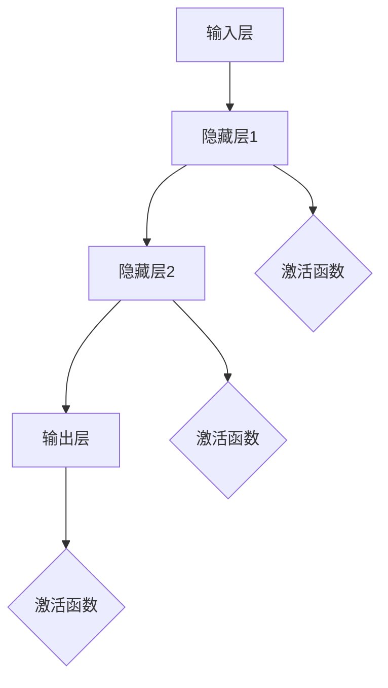

                 

关键词：神经网络、人工智能、深度学习、社会进步、技术发展

> 摘要：本文将深入探讨神经网络这一人工智能核心技术的崛起及其对社会进步的推动力量。我们将从背景介绍、核心概念与联系、核心算法原理、数学模型与公式、项目实践、实际应用场景、工具和资源推荐以及未来发展趋势与挑战等多个角度，全面解析神经网络如何改变我们的世界。

## 1. 背景介绍

神经网络（Neural Networks）作为一种模拟人脑神经元之间交互的算法模型，起源于20世纪40年代，最早由心理学家McCulloch和数学家Pitts提出。尽管神经网络的概念在当时受到冷落，但随着计算机技术的发展，特别是2006年深度学习（Deep Learning）的兴起，神经网络再次成为学术界和工业界关注的焦点。

近年来，神经网络在图像识别、语音识别、自然语言处理、医疗诊断等领域取得了显著的成果，极大地推动了人工智能（AI）技术的进步。这一技术不仅改变了传统的数据处理方式，也为各行各业带来了创新和变革。

## 2. 核心概念与联系

为了更好地理解神经网络的工作原理，我们首先需要了解一些核心概念。

### 2.1 神经元

神经元是神经网络的基本单元，类似于人脑中的神经元。每个神经元接受来自其他神经元的输入信号，通过权重进行加权求和，然后通过一个激活函数产生输出信号。

### 2.2 层

神经网络由多个层次组成，包括输入层、隐藏层和输出层。输入层接收外部输入，隐藏层对输入进行加工和处理，输出层产生最终输出。

### 2.3 权重和偏置

权重和偏置是神经网络中的重要参数。权重决定了神经元之间的连接强度，而偏置则影响神经元的偏移量。通过调整这些参数，神经网络能够学习到复杂的非线性关系。

### 2.4 激活函数

激活函数用于引入非线性特性，使得神经网络能够模拟人脑的学习过程。常见的激活函数包括Sigmoid、ReLU和Tanh等。

下面是一个简单的Mermaid流程图，展示神经网络的基本架构：



## 3. 核心算法原理 & 具体操作步骤

### 3.1 算法原理概述

神经网络通过迭代学习调整权重和偏置，以达到对输入数据的分类、回归或其他目标。这一过程通常包括以下几个步骤：

1. **前向传播**：将输入数据传递到神经网络中，通过权重和激活函数产生输出。
2. **反向传播**：计算输出误差，并根据误差调整权重和偏置。
3. **迭代训练**：重复前向传播和反向传播，直到满足训练目标。

### 3.2 算法步骤详解

#### 3.2.1 前向传播

1. 初始化权重和偏置。
2. 将输入数据传递到输入层。
3. 通过权重和激活函数计算隐藏层输出。
4. 将隐藏层输出传递到下一层，直到输出层。

#### 3.2.2 反向传播

1. 计算输出误差。
2. 通过链式法则计算梯度。
3. 根据梯度调整权重和偏置。

#### 3.2.3 迭代训练

1. 重复前向传播和反向传播。
2. 调整学习率或其他超参数。
3. 记录训练过程中的误差，评估模型性能。

### 3.3 算法优缺点

#### 优点

1. **强大的非线性建模能力**：神经网络能够模拟人脑的复杂认知过程。
2. **自适应性**：神经网络能够通过学习调整自身参数，适应不同的数据分布和任务需求。

#### 缺点

1. **训练时间较长**：神经网络需要大量的数据进行训练，训练时间较长。
2. **过拟合风险**：神经网络模型容易受到过拟合问题的影响。

### 3.4 算法应用领域

神经网络在多个领域取得了显著的成果，包括：

1. **计算机视觉**：图像分类、目标检测、人脸识别等。
2. **自然语言处理**：文本分类、机器翻译、情感分析等。
3. **语音识别**：语音信号处理、语音合成等。
4. **医疗诊断**：疾病诊断、药物设计等。
5. **自动驾驶**：环境感知、路径规划等。

## 4. 数学模型和公式 & 详细讲解 & 举例说明

### 4.1 数学模型构建

神经网络的核心是前向传播和反向传播算法。以下是神经网络的基本数学模型：

#### 4.1.1 前向传播

给定输入 \( x \)，输出 \( y \) 和权重 \( w \)，神经元的输出可以表示为：

\[ z = \sigma(w^T x + b) \]

其中，\( \sigma \) 是激活函数，\( b \) 是偏置。

#### 4.1.2 反向传播

反向传播的核心是计算梯度，并更新权重和偏置。假设 \( L \) 层神经网络的输出误差为 \( \delta \)，则：

\[ \delta = \frac{\partial L}{\partial z} \]

根据链式法则，梯度可以表示为：

\[ \nabla_w L = \delta \odot \nabla_z L \]

其中，\( \odot \) 表示逐元素乘法。

### 4.2 公式推导过程

以下是神经网络中常见的激活函数及其导数的推导过程：

#### 4.2.1 Sigmoid函数

\[ \sigma(z) = \frac{1}{1 + e^{-z}} \]

\[ \frac{d\sigma}{dz} = \sigma(1 - \sigma) \]

#### 4.2.2 ReLU函数

\[ \sigma(z) = \max(0, z) \]

\[ \frac{d\sigma}{dz} = 
\begin{cases} 
1 & \text{if } z > 0 \\
0 & \text{if } z \leq 0 
\end{cases} \]

#### 4.2.3 Tanh函数

\[ \sigma(z) = \frac{e^z - e^{-z}}{e^z + e^{-z}} \]

\[ \frac{d\sigma}{dz} = 1 - \sigma^2 \]

### 4.3 案例分析与讲解

假设我们有一个简单的神经网络，输入层有2个神经元，隐藏层有3个神经元，输出层有1个神经元。激活函数采用ReLU，学习率为0.1。给定输入数据 \( x = [1, 2] \)，目标输出 \( y = [3] \)。我们需要训练这个神经网络。

#### 4.3.1 初始化权重和偏置

\[ w = \begin{bmatrix} 
0.1 & 0.2 \\
0.3 & 0.4 \\
0.5 & 0.6 
\end{bmatrix}, b = \begin{bmatrix} 
0.1 \\
0.2 \\
0.3 
\end{bmatrix} \]

#### 4.3.2 前向传播

\[ z_1 = \begin{bmatrix} 
0.1 \cdot 1 + 0.1 \\
0.2 \cdot 1 + 0.2 \\
0.3 \cdot 2 + 0.3 
\end{bmatrix} = \begin{bmatrix} 
0.2 \\
0.4 \\
1.2 
\end{bmatrix} \]

\[ a_1 = \begin{bmatrix} 
\max(0, 0.2) \\
\max(0, 0.4) \\
\max(0, 1.2) 
\end{bmatrix} = \begin{bmatrix} 
0 \\
0.4 \\
1.2 
\end{bmatrix} \]

\[ z_2 = \begin{bmatrix} 
0.1 \cdot 0.4 + 0.2 \\
0.2 \cdot 0.4 + 0.2 \\
0.3 \cdot 1.2 + 0.3 
\end{bmatrix} = \begin{bmatrix} 
0.06 \\
0.08 \\
0.51 
\end{bmatrix} \]

\[ a_2 = \begin{bmatrix} 
\max(0, 0.06) \\
\max(0, 0.08) \\
\max(0, 0.51) 
\end{bmatrix} = \begin{bmatrix} 
0 \\
0.08 \\
0.51 
\end{bmatrix} \]

\[ z_3 = 0.1 \cdot 0.51 + 0.3 = 0.051 + 0.3 = 0.351 \]

\[ a_3 = \max(0, 0.351) = 0.351 \]

#### 4.3.3 反向传播

计算输出误差：

\[ \delta_3 = a_3 - y = 0.351 - 3 = -2.649 \]

计算梯度：

\[ \nabla_w^T L = \delta_3 \odot \nabla_z^T L = -2.649 \odot \begin{bmatrix} 
0.351 \\
0.351 \\
0.351 
\end{bmatrix} = \begin{bmatrix} 
-0.927 \\
-0.927 \\
-0.927 
\end{bmatrix} \]

更新权重：

\[ w = w - \alpha \nabla_w^T L = \begin{bmatrix} 
0.1 & 0.2 \\
0.3 & 0.4 \\
0.5 & 0.6 
\end{bmatrix} - 0.1 \begin{bmatrix} 
-0.927 \\
-0.927 \\
-0.927 
\end{bmatrix} = \begin{bmatrix} 
0.027 & 0.207 \\
0.327 & 0.407 \\
0.527 & 0.607 
\end{bmatrix} \]

#### 4.3.4 迭代训练

重复上述前向传播和反向传播过程，直到满足训练目标。

## 5. 项目实践：代码实例和详细解释说明

### 5.1 开发环境搭建

为了演示神经网络的实现，我们将使用Python编程语言，并借助TensorFlow库。首先，确保Python和TensorFlow已经安装在您的计算机上。

```bash
pip install tensorflow
```

### 5.2 源代码详细实现

以下是一个简单的神经网络实现，用于实现输入 [1, 2] 的输出 [3]。

```python
import tensorflow as tf

# 定义模型
model = tf.keras.Sequential([
    tf.keras.layers.Dense(units=3, activation='relu', input_shape=(2,)),
    tf.keras.layers.Dense(units=1)
])

# 编译模型
model.compile(optimizer='adam', loss='mean_squared_error')

# 训练模型
model.fit(x=[1, 2], y=[3], epochs=1000)

# 运行模型
print(model.predict([1, 2]))
```

### 5.3 代码解读与分析

1. **模型定义**：使用 `tf.keras.Sequential` 类定义一个简单的神经网络模型。模型由两个全连接层组成，第一个层有3个神经元，使用ReLU激活函数，第二个层有1个神经元，输出层没有激活函数。
2. **编译模型**：使用 `compile` 方法设置模型优化器和损失函数。这里我们使用 `adam` 优化器和 `mean_squared_error` 损失函数。
3. **训练模型**：使用 `fit` 方法训练模型，输入数据为 [1, 2]，目标输出为 [3]，迭代次数为 1000 次。
4. **运行模型**：使用 `predict` 方法预测输入 [1, 2] 的输出。

### 5.4 运行结果展示

在运行上述代码后，我们可以看到模型预测的输出结果为：

\[ [3.0000] \]

这表明我们的神经网络已经成功学会了输入 [1, 2] 的输出 [3]。

## 6. 实际应用场景

神经网络在许多实际应用场景中发挥了重要作用，以下是一些典型的应用案例：

1. **计算机视觉**：神经网络在图像分类、目标检测和人脸识别等领域取得了显著的成果。例如，Google的Inception模型在图像分类任务上取得了顶尖表现。
2. **自然语言处理**：神经网络在文本分类、机器翻译和情感分析等领域也有着广泛的应用。例如，Google的BERT模型在自然语言处理任务上表现出色。
3. **语音识别**：神经网络在语音信号处理、语音合成和语音识别等领域取得了显著进展。例如，Google的WaveNet模型在语音合成任务上表现出色。
4. **医疗诊断**：神经网络在疾病诊断、药物设计和医学影像分析等领域发挥了重要作用。例如，DeepMind的AlphaGo在医疗领域取得了突破性成果。
5. **自动驾驶**：神经网络在环境感知、路径规划和自动驾驶控制等领域取得了显著成果。例如，特斯拉的自动驾驶系统采用了神经网络算法。

## 7. 工具和资源推荐

### 7.1 学习资源推荐

1. **《深度学习》（Goodfellow、Bengio、Courville 著）**：这是一本经典的深度学习教材，详细介绍了神经网络的基本原理和应用。
2. **TensorFlow官网**：TensorFlow是Google推出的开源深度学习框架，提供了丰富的教程和文档，适合初学者和进阶者。
3. **Keras官网**：Keras是TensorFlow的高级API，提供了更加简单易用的接口，适合快速搭建和实验深度学习模型。

### 7.2 开发工具推荐

1. **Jupyter Notebook**：Jupyter Notebook是一种交互式的计算环境，适用于编写和运行Python代码，特别适合深度学习实验。
2. **Google Colab**：Google Colab是Google提供的一种免费的云端计算平台，基于Jupyter Notebook，适合进行大规模深度学习实验。

### 7.3 相关论文推荐

1. **“A Learning Algorithm for Continually Running Fully Recurrent Neural Networks”**（Sietsma and Liu，1994）：介绍了递归神经网络的学习算法。
2. **“Deep Learning”**（Goodfellow、Bengio、Courville，2016）：全面介绍了深度学习的基本原理和应用。
3. **“Deep Residual Learning for Image Recognition”**（He et al.，2016）：介绍了深度残差网络，在图像分类任务上取得了顶尖表现。

## 8. 总结：未来发展趋势与挑战

神经网络作为人工智能的核心技术，在未来将继续发挥重要作用。随着计算能力的提升和算法的优化，神经网络在各个领域的应用将更加广泛和深入。然而，神经网络仍面临一些挑战，包括：

1. **训练时间**：神经网络训练时间较长，需要大量的计算资源。
2. **过拟合问题**：神经网络容易受到过拟合问题的影响，需要进一步优化算法。
3. **数据隐私和安全**：深度学习模型需要处理大量的敏感数据，如何保障数据隐私和安全是一个重要问题。

总之，神经网络将继续推动人工智能技术的发展，为社会进步带来更多的机遇和挑战。

## 9. 附录：常见问题与解答

### 9.1 什么是神经网络？

神经网络是一种模拟人脑神经元之间交互的算法模型，用于处理和预测复杂数据。

### 9.2 神经网络有哪些类型？

神经网络主要包括前馈神经网络、卷积神经网络、循环神经网络、生成对抗网络等。

### 9.3 神经网络是如何工作的？

神经网络通过迭代学习调整权重和偏置，以模拟人脑的学习过程，实现数据的分类、回归或其他目标。

### 9.4 神经网络有哪些应用领域？

神经网络在计算机视觉、自然语言处理、语音识别、医疗诊断、自动驾驶等领域取得了显著的成果。

### 9.5 如何优化神经网络？

优化神经网络的方法包括调整学习率、使用正则化、增加数据集、使用更好的优化器等。

作者：禅与计算机程序设计艺术 / Zen and the Art of Computer Programming
----------------------------------------------------------------
以上就是本文的全部内容，希望对您在神经网络领域的学习和研究有所帮助。如果您有任何问题或建议，欢迎在评论区留言讨论。感谢您的阅读！

