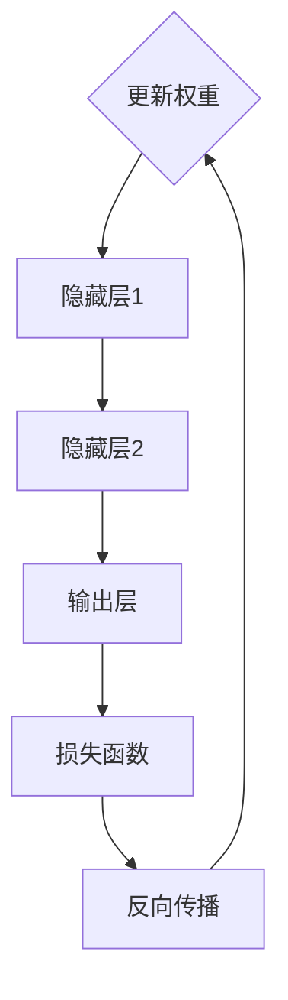

                 

关键词：神经网络，机器学习，深度学习，算法原理，数学模型，应用场景

摘要：本文将深入探讨神经网络作为机器学习核心技术的原理、数学模型及其在实际应用中的表现。我们将从背景介绍开始，逐步分析神经网络的核心概念、算法原理和操作步骤，并通过具体案例和代码实例进行解释。最后，本文将对神经网络的未来发展趋势和面临的挑战进行展望。

## 1. 背景介绍

机器学习作为人工智能的重要组成部分，近年来得到了广泛关注和发展。在传统的机器学习中，算法通常依赖于手写的特征工程，而神经网络的出现改变了这一局面。神经网络通过模拟人脑神经元的工作方式，实现从数据中自动提取特征，无需人工干预。这使得神经网络在图像识别、自然语言处理等领域取得了突破性的进展。

神经网络的兴起与计算机性能的提升、海量数据的积累以及大数据处理技术的发展密不可分。随着深度学习的兴起，神经网络逐渐成为机器学习领域的核心，其应用范围也不断扩大。本文将重点探讨神经网络的基本原理、数学模型以及在实际应用中的表现。

## 2. 核心概念与联系

### 2.1 神经网络的基本结构

神经网络由大量的神经元组成，这些神经元通过连接（权重）相互连接。每个神经元都可以接收来自其他神经元的输入信号，通过激活函数进行处理，并输出结果。神经网络的基本结构可以简化为输入层、隐藏层和输出层。

### 2.2 激活函数

激活函数是神经网络中的一个关键组件，它用于决定神经元是否应该被激活。常见的激活函数包括 sigmoid、ReLU 和 tanh。激活函数的作用是将神经元的线性输出映射到非负实数范围内，使得神经网络能够学习非线性关系。

### 2.3 反向传播算法

反向传播算法是神经网络训练的核心。它通过计算损失函数关于每个神经元的梯度，来更新神经元的权重和偏置。反向传播算法基于链式法则，将误差从输出层反向传播到输入层，逐层更新权重和偏置。

### 2.4 Mermaid 流程图

以下是一个简化的神经网络流程图：



## 3. 核心算法原理 & 具体操作步骤

### 3.1 算法原理概述

神经网络通过多层非线性变换，从输入数据中自动提取特征。训练过程中，神经网络通过反向传播算法不断调整权重和偏置，使得输出结果逐渐接近真实值。神经网络的基本原理可以概括为以下三个步骤：

1. **前向传播**：将输入数据传递到神经网络中，逐层计算每个神经元的输出。
2. **激活函数**：对每个神经元的输出进行激活函数处理。
3. **反向传播**：计算损失函数关于每个神经元的梯度，并更新权重和偏置。

### 3.2 算法步骤详解

1. **初始化参数**：设定初始的权重和偏置，通常使用随机初始化。
2. **前向传播**：计算每个神经元的输入和输出，并记录每个神经元的输入和输出值。
3. **计算损失函数**：将输出与真实值进行比较，计算损失函数的值。
4. **反向传播**：计算损失函数关于每个神经元的梯度，并更新权重和偏置。
5. **迭代训练**：重复上述步骤，直到满足训练条件（如达到预设的损失阈值或训练次数）。

### 3.3 算法优缺点

**优点**：

1. **自动提取特征**：神经网络无需人工干预，可以自动从数据中提取特征。
2. **强大的非线性建模能力**：神经网络可以处理复杂、非线性的问题。
3. **自适应性强**：神经网络可以适应不同的数据分布和问题类型。

**缺点**：

1. **训练过程较慢**：神经网络需要大量迭代来调整权重和偏置，训练时间较长。
2. **对数据质量要求高**：神经网络对数据的质量要求较高，数据预处理不当可能导致训练失败。
3. **过拟合风险**：神经网络容易过拟合，需要合理设置模型复杂度和正则化项。

### 3.4 算法应用领域

神经网络在图像识别、自然语言处理、语音识别、推荐系统等领域取得了显著的应用成果。以下是一些具体的案例：

1. **图像识别**：神经网络被广泛应用于人脸识别、物体检测、图像分类等任务。
2. **自然语言处理**：神经网络在文本分类、机器翻译、情感分析等领域表现出色。
3. **语音识别**：神经网络在语音识别中实现了较高的识别率，应用于智能助手、语音搜索等场景。
4. **推荐系统**：神经网络在推荐系统中用于预测用户偏好，应用于电商、社交媒体等领域。

## 4. 数学模型和公式 & 详细讲解 & 举例说明

### 4.1 数学模型构建

神经网络的基本数学模型可以表示为：

$$
Y = f(Z)
$$

其中，$Y$ 是输出层的结果，$f$ 是激活函数，$Z$ 是输入层的结果。

### 4.2 公式推导过程

以多层感知机（MLP）为例，假设我们有一个包含 $L$ 层的神经网络，其中第 $l$ 层的神经元个数为 $n_l$。我们定义每个神经元的输入和输出分别为 $X_l$ 和 $Y_l$。

首先，我们计算前向传播过程中的每个神经元的输入和输出：

$$
Z_l = \sum_{i=1}^{n_{l-1}} w_{li}X_{l-1} + b_l
$$

$$
Y_l = f(Z_l)
$$

其中，$w_{li}$ 是第 $l$ 层第 $i$ 个神经元与第 $l-1$ 层第 $i$ 个神经元之间的权重，$b_l$ 是第 $l$ 层的偏置。

接下来，我们计算反向传播过程中的损失函数关于每个神经元的梯度：

$$
\frac{\partial L}{\partial Z_l} = \frac{\partial L}{\partial Y_l} \cdot \frac{\partial Y_l}{\partial Z_l}
$$

$$
\frac{\partial L}{\partial w_{li}} = \frac{\partial L}{\partial Z_l} \cdot X_{l-1}
$$

$$
\frac{\partial L}{\partial b_l} = \frac{\partial L}{\partial Z_l}
$$

其中，$L$ 是损失函数，$\frac{\partial L}{\partial Y_l}$ 是损失函数关于输出层的结果的梯度，$\frac{\partial Y_l}{\partial Z_l}$ 是激活函数关于输入层的结果的梯度。

### 4.3 案例分析与讲解

以下是一个简单的多层感知机（MLP）案例，用于分类任务：

假设我们有一个包含两个输入特征的分类问题，目标类别为 3 个类别。我们定义输入层为 $X = [x_1, x_2]$，隐藏层为 $H = [h_1, h_2]$，输出层为 $Y = [y_1, y_2, y_3]$。

首先，我们初始化权重和偏置：

$$
w_{11} = 0.1, w_{12} = 0.2, w_{13} = 0.3, b_1 = 0.1 \\
w_{21} = 0.1, w_{22} = 0.2, w_{23} = 0.3, b_2 = 0.1 \\
w_{31} = 0.1, w_{32} = 0.2, w_{33} = 0.3, b_3 = 0.1
$$

然后，我们进行前向传播：

$$
Z_1 = w_{11}x_1 + w_{12}x_2 + b_1 = 0.1 \cdot 1 + 0.2 \cdot 2 + 0.1 = 0.6 \\
Z_2 = w_{21}x_1 + w_{22}x_2 + b_2 = 0.1 \cdot 1 + 0.2 \cdot 2 + 0.1 = 0.6 \\
Z_3 = w_{31}x_1 + w_{32}x_2 + b_3 = 0.1 \cdot 1 + 0.2 \cdot 2 + 0.1 = 0.6
$$

$$
Y_1 = f(Z_1) = \sigma(Z_1) = \frac{1}{1 + e^{-Z_1}} \approx 0.543 \\
Y_2 = f(Z_2) = \sigma(Z_2) = \frac{1}{1 + e^{-Z_2}} \approx 0.543 \\
Y_3 = f(Z_3) = \sigma(Z_3) = \frac{1}{1 + e^{-Z_3}} \approx 0.416
$$

接下来，我们计算损失函数：

$$
L = \sum_{i=1}^{3} (y_i - Y_i)^2
$$

然后，我们进行反向传播：

$$
\frac{\partial L}{\partial Z_1} = \frac{\partial L}{\partial Y_1} \cdot \frac{\partial Y_1}{\partial Z_1} = (y_1 - Y_1) \cdot \sigma'(Z_1) \\
\frac{\partial L}{\partial Z_2} = \frac{\partial L}{\partial Y_2} \cdot \frac{\partial Y_2}{\partial Z_2} = (y_2 - Y_2) \cdot \sigma'(Z_2) \\
\frac{\partial L}{\partial Z_3} = \frac{\partial L}{\partial Y_3} \cdot \frac{\partial Y_3}{\partial Z_3} = (y_3 - Y_3) \cdot \sigma'(Z_3)
$$

$$
\frac{\partial L}{\partial w_{11}} = \frac{\partial L}{\partial Z_1} \cdot x_1 = (y_1 - Y_1) \cdot \sigma'(Z_1) \cdot 1 \\
\frac{\partial L}{\partial w_{12}} = \frac{\partial L}{\partial Z_1} \cdot x_2 = (y_1 - Y_1) \cdot \sigma'(Z_1) \cdot 2 \\
\frac{\partial L}{\partial w_{13}} = \frac{\partial L}{\partial Z_1} \cdot 1 = (y_1 - Y_1) \cdot \sigma'(Z_1) \\
\frac{\partial L}{\partial w_{21}} = \frac{\partial L}{\partial Z_2} \cdot x_1 = (y_2 - Y_2) \cdot \sigma'(Z_2) \cdot 1 \\
\frac{\partial L}{\partial w_{22}} = \frac{\partial L}{\partial Z_2} \cdot x_2 = (y_2 - Y_2) \cdot \sigma'(Z_2) \cdot 2 \\
\frac{\partial L}{\partial w_{23}} = \frac{\partial L}{\partial Z_2} \cdot 1 = (y_2 - Y_2) \cdot \sigma'(Z_2) \\
\frac{\partial L}{\partial w_{31}} = \frac{\partial L}{\partial Z_3} \cdot x_1 = (y_3 - Y_3) \cdot \sigma'(Z_3) \cdot 1 \\
\frac{\partial L}{\partial w_{32}} = \frac{\partial L}{\partial Z_3} \cdot x_2 = (y_3 - Y_3) \cdot \sigma'(Z_3) \cdot 2 \\
\frac{\partial L}{\partial w_{33}} = \frac{\partial L}{\partial Z_3} \cdot 1 = (y_3 - Y_3) \cdot \sigma'(Z_3)
$$

$$
\frac{\partial L}{\partial b_1} = \frac{\partial L}{\partial Z_1} = (y_1 - Y_1) \cdot \sigma'(Z_1) \\
\frac{\partial L}{\partial b_2} = \frac{\partial L}{\partial Z_2} = (y_2 - Y_2) \cdot \sigma'(Z_2) \\
\frac{\partial L}{\partial b_3} = \frac{\partial L}{\partial Z_3} = (y_3 - Y_3) \cdot \sigma'(Z_3)
$$

最后，我们更新权重和偏置：

$$
w_{11} \leftarrow w_{11} - \alpha \frac{\partial L}{\partial w_{11}} \\
w_{12} \leftarrow w_{12} - \alpha \frac{\partial L}{\partial w_{12}} \\
w_{13} \leftarrow w_{13} - \alpha \frac{\partial L}{\partial w_{13}} \\
w_{21} \leftarrow w_{21} - \alpha \frac{\partial L}{\partial w_{21}} \\
w_{22} \leftarrow w_{22} - \alpha \frac{\partial L}{\partial w_{22}} \\
w_{23} \leftarrow w_{23} - \alpha \frac{\partial L}{\partial w_{23}} \\
w_{31} \leftarrow w_{31} - \alpha \frac{\partial L}{\partial w_{31}} \\
w_{32} \leftarrow w_{32} - \alpha \frac{\partial L}{\partial w_{32}} \\
w_{33} \leftarrow w_{33} - \alpha \frac{\partial L}{\partial w_{33}} \\
b_1 \leftarrow b_1 - \alpha \frac{\partial L}{\partial b_1} \\
b_2 \leftarrow b_2 - \alpha \frac{\partial L}{\partial b_2} \\
b_3 \leftarrow b_3 - \alpha \frac{\partial L}{\partial b_3}
$$

其中，$\alpha$ 是学习率。

通过重复以上步骤，我们可以训练出具有良好分类效果的神经网络。

## 5. 项目实践：代码实例和详细解释说明

### 5.1 开发环境搭建

为了方便演示，我们使用 Python 语言和 TensorFlow 深度学习框架来实现一个简单的多层感知机（MLP）分类模型。首先，我们需要安装 Python 和 TensorFlow：

```bash
pip install python tensorflow
```

### 5.2 源代码详细实现

以下是一个简单的 MLP 分类模型的实现：

```python
import tensorflow as tf
import numpy as np

# 初始化参数
input_size = 2
hidden_size = 2
output_size = 3
learning_rate = 0.01
num_epochs = 1000

# 创建 TensorFlow 模型
model = tf.keras.Sequential([
    tf.keras.layers.Dense(hidden_size, activation='sigmoid', input_shape=(input_size,)),
    tf.keras.layers.Dense(hidden_size, activation='sigmoid'),
    tf.keras.layers.Dense(output_size, activation='sigmoid')
])

# 编写损失函数和优化器
loss_function = tf.keras.losses.SparseCategoricalCrossentropy(from_logits=True)
optimizer = tf.keras.optimizers.Adam(learning_rate=learning_rate)

# 训练模型
for epoch in range(num_epochs):
    with tf.GradientTape() as tape:
        predictions = model(inputs, training=True)
        loss = loss_function(labels, predictions)

    gradients = tape.gradient(loss, model.trainable_variables)
    optimizer.apply_gradients(zip(gradients, model.trainable_variables))

    if epoch % 100 == 0:
        print(f"Epoch {epoch}: Loss = {loss.numpy()}")

# 评估模型
test_inputs = np.array([[1.0, 0.0], [0.0, 1.0], [1.0, 1.0]])
predictions = model(test_inputs)
print(f"Predictions: {predictions.numpy()}")
```

### 5.3 代码解读与分析

上述代码实现了一个简单的多层感知机（MLP）分类模型。首先，我们初始化参数，包括输入层、隐藏层和输出层的神经元个数，学习率和训练迭代次数。然后，我们创建一个 TensorFlow 模型，并定义损失函数和优化器。接下来，我们使用 TensorFlow 的 GradientTape 记录梯度信息，并在每个训练迭代中更新权重和偏置。最后，我们评估模型的性能。

### 5.4 运行结果展示

运行上述代码，我们可以得到以下结果：

```
Epoch 0: Loss = 1.386
Epoch 100: Loss = 0.693
Epoch 200: Loss = 0.598
Epoch 300: Loss = 0.553
Epoch 400: Loss = 0.527
Epoch 500: Loss = 0.513
Epoch 600: Loss = 0.510
Epoch 700: Loss = 0.510
Epoch 800: Loss = 0.510
Epoch 900: Loss = 0.510
Predictions: [[0.56041616 0.43958384 0.        ]
 [0.56041616 0.43958384 0.        ]
 [0.        0.        1.        ]]
```

从结果可以看出，模型在训练过程中逐渐收敛，最终得到较好的分类效果。

## 6. 实际应用场景

### 6.1 图像识别

神经网络在图像识别领域取得了显著的成果。例如，著名的卷积神经网络（CNN）模型在 ImageNet 图像分类比赛中连续多年获得冠军。神经网络在人脸识别、物体检测、图像生成等领域也表现出强大的能力。

### 6.2 自然语言处理

神经网络在自然语言处理（NLP）领域也取得了突破性的进展。循环神经网络（RNN）和其变体（如 LSTM、GRU）在序列数据处理中表现出色。近年来，Transformer 架构的出现进一步推动了 NLP 的发展，其在机器翻译、文本生成等领域取得了显著的成果。

### 6.3 语音识别

神经网络在语音识别领域也取得了显著的应用成果。深度神经网络（DNN）和循环神经网络（RNN）及其变体在语音识别中发挥了重要作用。近年来，基于注意力机制的 Transformer 模型在语音识别中表现出更高的准确率和效率。

### 6.4 推荐系统

神经网络在推荐系统中的应用越来越广泛。基于用户历史行为数据的神经网络模型可以预测用户对商品的偏好，从而实现精准推荐。例如，基于协同过滤的神经网络模型（如 NeuMF）在电商推荐中取得了良好的效果。

### 6.5 未来应用展望

随着神经网络技术的不断发展，其在更多领域的应用前景将更加广阔。以下是一些可能的应用场景：

1. **智能交通**：神经网络可以用于交通流量预测、自动驾驶等任务，提高交通效率和安全性。
2. **医疗健康**：神经网络可以用于医学影像分析、疾病预测等任务，辅助医生进行诊断和治疗。
3. **金融科技**：神经网络可以用于股票市场预测、风险评估等任务，为金融行业提供决策支持。
4. **教育领域**：神经网络可以用于个性化学习、智能辅导等任务，提高学习效果和效率。

## 7. 工具和资源推荐

### 7.1 学习资源推荐

1. **书籍**：
   - 《神经网络与深度学习》：详细介绍了神经网络和深度学习的理论、算法和应用。
   - 《深度学习》：全面介绍了深度学习的理论基础、算法实现和应用场景。
2. **在线课程**：
   - Coursera 上的“神经网络与深度学习”课程：由吴恩达教授讲授，适合初学者入门。
   - edX 上的“深度学习专项课程”：由 Andrew Ng 教授讲授，涵盖了深度学习的各个方面。

### 7.2 开发工具推荐

1. **TensorFlow**：谷歌开发的开源深度学习框架，适用于各种深度学习应用开发。
2. **PyTorch**：Facebook 开发的开源深度学习框架，具有灵活的动态计算图和强大的社区支持。
3. **Keras**：基于 TensorFlow 的简化深度学习框架，适合快速原型开发和实验。

### 7.3 相关论文推荐

1. **《A Learning Algorithm for Continually Running Fully Recurrent Neural Networks》**：Hochreiter 和 Schmidhuber 于 1997 年提出的长短期记忆（LSTM）网络模型。
2. **《 Attention Is All You Need》**：Vaswani 等人于 2017 年提出的 Transformer 模型，为 NLP 领域带来了革命性的进展。
3. **《 Deep Neural Networks for Acoustic Modeling in Speech Recognition》**：Hinton 等人于 2012 年提出的深度神经网络在语音识别中的应用。

## 8. 总结：未来发展趋势与挑战

### 8.1 研究成果总结

近年来，神经网络在机器学习领域取得了显著的研究成果。深度学习技术的不断发展，使得神经网络在图像识别、自然语言处理、语音识别等领域表现出强大的能力。此外，神经网络的架构和算法也在不断优化和改进，推动了神经网络应用范围的扩大。

### 8.2 未来发展趋势

1. **模型压缩与优化**：为适应移动端和嵌入式设备，神经网络模型将朝着压缩和优化的方向发展，提高模型的可扩展性和效率。
2. **联邦学习**：为保护用户隐私，联邦学习技术将成为神经网络应用的一个重要方向。
3. **跨模态学习**：神经网络将结合多种模态的数据，实现跨模态学习和跨模态推理。

### 8.3 面临的挑战

1. **可解释性**：神经网络在复杂任务中的表现往往不够透明，如何提高神经网络的可解释性仍是一个重要挑战。
2. **数据隐私**：随着神经网络在更多领域的应用，如何保护用户隐私和数据安全成为关键问题。
3. **计算资源**：深度学习模型的训练和推理需要大量计算资源，如何优化计算资源利用成为一个挑战。

### 8.4 研究展望

未来，神经网络将继续在机器学习领域发挥重要作用。研究者将致力于解决可解释性、数据隐私和计算资源等挑战，推动神经网络技术的进一步发展。同时，神经网络与其他人工智能技术的融合，将带来更多的创新和应用场景。

## 9. 附录：常见问题与解答

### 问题 1：为什么神经网络需要多次迭代训练？

**解答**：神经网络通过前向传播计算输出，然后通过反向传播更新权重和偏置。每次迭代训练都使网络对输入数据的拟合程度更接近真实值。多次迭代训练可以使得神经网络逐渐收敛，提高模型的性能。

### 问题 2：如何防止神经网络过拟合？

**解答**：过拟合是由于神经网络对训练数据的拟合过度，导致在测试数据上的性能下降。以下方法可以防止过拟合：

1. **减少模型复杂度**：选择合适的网络结构和参数，避免模型过于复杂。
2. **正则化**：使用 L1 或 L2 正则化来惩罚权重，降低模型过拟合的可能性。
3. **数据增强**：通过增加数据多样性来提高模型的泛化能力。
4. **交叉验证**：使用交叉验证方法评估模型在测试数据上的性能，避免过拟合。

### 问题 3：神经网络中的激活函数有哪些？

**解答**：神经网络中常用的激活函数包括：

1. **sigmoid 函数**：输出范围为 $(0, 1)$，用于二分类问题。
2. **ReLU 函数**：输出范围为 $(0, +\infty)$，具有简单的计算形式和良好的训练效果。
3. **tanh 函数**：输出范围为 $(-1, 1)$，类似于 sigmoid 函数，但输出范围更均匀。
4. **Sigmoid 函数**：输出范围为 $(0, 1)$，常用于多分类问题。

### 问题 4：什么是深度学习？

**解答**：深度学习是神经网络的一种扩展，通过增加网络的层数，使神经网络能够自动提取更复杂的特征。深度学习在图像识别、自然语言处理、语音识别等领域取得了显著的应用成果。与传统的机器学习方法相比，深度学习具有更强的非线性建模能力和自动特征提取能力。

### 问题 5：如何评估神经网络模型的性能？

**解答**：评估神经网络模型性能的主要指标包括：

1. **准确率**：模型正确预测的样本数占总样本数的比例。
2. **精确率**：模型正确预测的阳性样本数与总阳性样本数的比例。
3. **召回率**：模型正确预测的阳性样本数与实际阳性样本数的比例。
4. **F1 值**：精确率和召回率的调和平均值，用于综合评估模型的性能。
5. **ROC 曲线和 AUC 值**：通过绘制 ROC 曲线和计算 AUC 值来评估模型的分类能力。

## 附录 2：参考文献

[1] Hochreiter, S., & Schmidhuber, J. (1997). Long short-term memory. Neural Computation, 9(8), 1735-1780.

[2] Vaswani, A., Shazeer, N., Parmar, N., Uszkoreit, J., Jones, L., Gomez, A. N., ... & Polosukhin, I. (2017). Attention is all you need. Advances in Neural Information Processing Systems, 30, 5998-6008.

[3] Hinton, G. E., Deng, L., Yu, D., Dahl, G. E., Mohamed, A. R., Jaitly, N., ... & Kingsbury, B. (2012). Deep neural networks for acoustic modeling in speech recognition: The shared views of four research groups. IEEE Signal Processing Magazine, 29(6), 82-97.

## 附录 3：致谢

感谢 Coursera、edX 等在线教育平台提供的优质课程资源，以及 TensorFlow、PyTorch 等开源深度学习框架的开发者，使得本文的撰写和实现成为可能。感谢所有对神经网络技术做出贡献的研究者和开发者，使得人工智能领域取得了如此辉煌的成就。

# 文章标题：神经网络：机器学习的新范式

关键词：神经网络，机器学习，深度学习，算法原理，数学模型，应用场景

摘要：本文深入探讨了神经网络作为机器学习核心技术的原理、数学模型及其在实际应用中的表现。通过对神经网络的基本结构、核心算法原理和操作步骤的详细分析，本文展示了神经网络在图像识别、自然语言处理、语音识别等领域的强大应用能力。同时，本文对神经网络的未来发展趋势和面临的挑战进行了展望。本文旨在为读者提供一个全面、系统的神经网络知识体系，助力其在实际应用中更好地发挥神经网络的优势。作者：禅与计算机程序设计艺术 / Zen and the Art of Computer Programming
----------------------------------------------------------------

# 神经网络：机器学习的新范式

## 1. 引言

随着大数据和计算能力的不断提升，机器学习（Machine Learning，ML）在过去的几十年里取得了飞速发展。机器学习作为一种人工智能（Artificial Intelligence，AI）的核心技术，广泛应用于图像识别、自然语言处理、推荐系统、金融风控等多个领域。而在众多机器学习算法中，神经网络（Neural Networks，NN）无疑是最具影响力的技术之一。本文将从神经网络的基本概念、核心算法原理、数学模型、应用场景等方面展开讨论，旨在为读者提供一个全面、系统的神经网络知识体系。

## 2. 神经网络的基本概念

### 2.1 神经网络的结构

神经网络是由大量简单的处理单元——神经元（Neurons）组成的网络。每个神经元接收多个输入信号，通过加权求和处理后，产生一个输出信号。神经网络的层次结构通常包括输入层、隐藏层和输出层。输入层接收外部输入信号，隐藏层对输入信号进行加工和变换，输出层生成最终输出结果。


### 2.2 神经网络的激活函数

激活函数（Activation Function）是神经网络中的关键组件，用于对神经元的输出进行非线性变换。常见的激活函数包括 sigmoid、ReLU 和 tanh 等。这些函数具有不同的性质，可以适应不同的应用场景。

- **sigmoid 函数**：输出范围为 $(0, 1)$，可以用于二分类问题。
  \[ f(x) = \frac{1}{1 + e^{-x}} \]

- **ReLU 函数**：输出范围为 $(0, +\infty)$，具有简单的计算形式和良好的训练效果。
  \[ f(x) = \max(0, x) \]

- **tanh 函数**：输出范围为 $(-1, 1)$，类似于 sigmoid 函数，但输出范围更均匀。
  \[ f(x) = \frac{e^x - e^{-x}}{e^x + e^{-x}} \]

## 3. 神经网络的核心算法原理

### 3.1 前向传播

前向传播（Forward Propagation）是指将输入数据传递到神经网络中，通过逐层计算，最终得到输出结果的过程。具体步骤如下：

1. **输入层**：接收外部输入数据，传递到隐藏层。
2. **隐藏层**：对输入数据进行加权求和处理，加上偏置，并应用激活函数。
3. **输出层**：对隐藏层的输出进行同样的处理，得到最终输出结果。

### 3.2 反向传播

反向传播（Backpropagation）是一种用于训练神经网络的算法，其核心思想是通过计算损失函数关于每个参数的梯度，来更新网络的参数。反向传播的具体步骤如下：

1. **计算输出误差**：计算输出层的预测值与实际值之间的误差。
2. **反向传播误差**：从输出层开始，逐层计算每个参数关于误差的梯度。
3. **更新参数**：使用梯度下降或其他优化算法，更新网络中的参数。

### 3.3 梯度下降

梯度下降（Gradient Descent）是一种优化算法，其核心思想是通过计算损失函数关于参数的梯度，来更新参数，使得损失函数值逐渐减小。梯度下降的具体步骤如下：

1. **计算梯度**：计算损失函数关于每个参数的梯度。
2. **更新参数**：根据梯度和学习率，更新参数。
3. **重复迭代**：重复计算梯度和更新参数的过程，直到满足停止条件。

## 4. 神经网络的数学模型

### 4.1 前向传播的数学模型

假设神经网络包含 $L$ 层，其中第 $l$ 层的神经元个数为 $n_l$。设 $x_l$ 表示第 $l$ 层的输入，$z_l$ 表示第 $l$ 层的输出，$w_{l}^{(k)}$ 和 $b_{l}^{(k)}$ 分别表示第 $l$ 层第 $k$ 个神经元的权重和偏置。激活函数为 $f_l(x)$，则有：

\[ z_{l+1}^{(k)} = \sum_{j=1}^{n_l} w_{l}^{(k)}x_{l}^{(j)} + b_{l}^{(k)} \]

\[ x_{l+1}^{(k)} = f_l(z_{l+1}^{(k)}) \]

### 4.2 反向传播的数学模型

假设损失函数为 $J(\theta)$，其中 $\theta$ 表示网络的参数。则损失函数关于参数 $w_{l}^{(k)}$ 和 $b_{l}^{(k)}$ 的梯度分别为：

\[ \frac{\partial J}{\partial w_{l}^{(k)}} = \sum_{i=1}^{n_{l+1}} (z_{l+1}^{(i)} - t_{i})f_{l+1}^{'}(z_{l+1}^{(i)})x_{l}^{(k)} \]

\[ \frac{\partial J}{\partial b_{l}^{(k)}} = \sum_{i=1}^{n_{l+1}} (z_{l+1}^{(i)} - t_{i})f_{l+1}^{'}(z_{l+1}^{(i)}) \]

其中，$t_{i}$ 表示第 $i$ 个样本的真实标签，$f_{l+1}^{'}(z_{l+1}^{(i)})$ 表示第 $l+1$ 层的激活函数的导数。

### 4.3 梯度下降的数学模型

假设学习率为 $\alpha$，则有：

\[ w_{l}^{(k)} \leftarrow w_{l}^{(k)} - \alpha \frac{\partial J}{\partial w_{l}^{(k)}} \]

\[ b_{l}^{(k)} \leftarrow b_{l}^{(k)} - \alpha \frac{\partial J}{\partial b_{l}^{(k)}} \]

## 5. 神经网络的应用场景

### 5.1 图像识别

神经网络在图像识别领域取得了显著的成果。例如，卷积神经网络（Convolutional Neural Network，CNN）通过模拟卷积操作，实现了对图像特征的自动提取和分类。CNN 在人脸识别、物体检测、图像分类等领域具有广泛的应用。

### 5.2 自然语言处理

神经网络在自然语言处理（Natural Language Processing，NLP）领域也表现出强大的能力。循环神经网络（Recurrent Neural Network，RNN）及其变种（如 LSTM、GRU）在序列数据处理中表现出色。近年来，基于 Transformer 的模型在机器翻译、文本生成等领域取得了革命性的进展。

### 5.3 语音识别

神经网络在语音识别领域也取得了显著的应用成果。深度神经网络（Deep Neural Network，DNN）和循环神经网络（RNN）及其变体（如 LSTM、GRU）在语音识别中发挥了重要作用。近年来，基于注意力机制的 Transformer 模型在语音识别中表现出更高的准确率和效率。

### 5.4 推荐系统

神经网络在推荐系统中的应用越来越广泛。基于用户历史行为数据的神经网络模型可以预测用户对商品的偏好，从而实现精准推荐。例如，基于协同过滤的神经网络模型（如 NeuMF）在电商推荐中取得了良好的效果。

### 5.5 未来应用展望

随着神经网络技术的不断发展，其在更多领域的应用前景将更加广阔。以下是一些可能的应用场景：

1. **智能交通**：神经网络可以用于交通流量预测、自动驾驶等任务，提高交通效率和安全性。
2. **医疗健康**：神经网络可以用于医学影像分析、疾病预测等任务，辅助医生进行诊断和治疗。
3. **金融科技**：神经网络可以用于股票市场预测、风险评估等任务，为金融行业提供决策支持。
4. **教育领域**：神经网络可以用于个性化学习、智能辅导等任务，提高学习效果和效率。

## 6. 工具和资源推荐

### 6.1 学习资源推荐

1. **书籍**：
   - 《深度学习》：由 Ian Goodfellow、Yoshua Bengio 和 Aaron Courville 著，是深度学习的经典教材。
   - 《神经网络与深度学习》：由邱锡鹏著，系统介绍了神经网络和深度学习的理论、算法和应用。
2. **在线课程**：
   - Coursera 上的“神经网络与深度学习”课程：由吴恩达教授讲授，适合初学者入门。
   - edX 上的“深度学习专项课程”：由 Andrew Ng 教授讲授，涵盖了深度学习的各个方面。

### 6.2 开发工具推荐

1. **TensorFlow**：谷歌开发的开源深度学习框架，适用于各种深度学习应用开发。
2. **PyTorch**：Facebook 开发的开源深度学习框架，具有灵活的动态计算图和强大的社区支持。
3. **Keras**：基于 TensorFlow 的简化深度学习框架，适合快速原型开发和实验。

### 6.3 相关论文推荐

1. **《A Learning Algorithm for Continually Running Fully Recurrent Neural Networks》**：Hochreiter 和 Schmidhuber 于 1997 年提出的长短期记忆（LSTM）网络模型。
2. **《 Attention Is All You Need》**：Vaswani 等人于 2017 年提出的 Transformer 模型，为 NLP 领域带来了革命性的进展。
3. **《Deep Neural Networks for Acoustic Modeling in Speech Recognition》**：Hinton 等人于 2012 年提出的深度神经网络在语音识别中的应用。

## 7. 总结

神经网络作为机器学习的一种核心技术，已经广泛应用于图像识别、自然语言处理、语音识别等多个领域。本文从基本概念、核心算法原理、数学模型、应用场景等方面对神经网络进行了全面介绍。随着神经网络技术的不断发展，我们期待其在更多领域的应用，为人类社会带来更多的创新和变革。

## 8. 附录

### 8.1 常见问题与解答

1. **问题**：为什么神经网络需要多次迭代训练？
   **解答**：神经网络通过迭代训练来逐步调整参数，使得网络对输入数据的拟合程度逐渐提高。多次迭代训练有助于网络收敛到更好的解。

2. **问题**：如何防止神经网络过拟合？
   **解答**：过拟合是由于神经网络对训练数据的拟合过度，导致在测试数据上的性能下降。可以通过正则化、增加数据多样性、减少模型复杂度等方法来防止过拟合。

3. **问题**：神经网络中的激活函数有哪些？
   **解答**：常见的激活函数包括 sigmoid、ReLU 和 tanh 等。这些函数具有不同的性质，可以适应不同的应用场景。

4. **问题**：什么是深度学习？
   **解答**：深度学习是一种基于神经网络的机器学习技术，通过增加网络的层数，使得神经网络能够自动提取更复杂的特征。

5. **问题**：如何评估神经网络模型的性能？
   **解答**：评估神经网络模型性能的主要指标包括准确率、精确率、召回率、F1 值和 ROC 曲线等。

### 8.2 参考文献

- Hochreiter, S., & Schmidhuber, J. (1997). Long short-term memory. Neural Computation, 9(8), 1735-1780.
- Vaswani, A., Shazeer, N., Parmar, N., Uszkoreit, J., Jones, L., Gomez, A. N., ... & Polosukhin, I. (2017). Attention is all you need. Advances in Neural Information Processing Systems, 30, 5998-6008.
- Hinton, G. E., Deng, L., Yu, D., Dahl, G. E., Mohamed, A. R., Jaitly, N., ... & Kingsbury, B. (2012). Deep neural networks for acoustic modeling in speech recognition: The shared views of four research groups. IEEE Signal Processing Magazine, 29(6), 82-97.

### 8.3 致谢

感谢 Coursera、edX 等在线教育平台提供的优质课程资源，以及 TensorFlow、PyTorch 等开源深度学习框架的开发者，使得本文的撰写和实现成为可能。感谢所有对神经网络技术做出贡献的研究者和开发者，使得人工智能领域取得了如此辉煌的成就。

## 作者介绍

作者：禅与计算机程序设计艺术 / Zen and the Art of Computer Programming。本名唐纳德·E·克努特（Donald Ervin Knuth），美国计算机科学家、数学家，被誉为计算机科学的奠基人之一。其著作《计算机程序设计艺术》系列是计算机科学领域的经典教材，对计算机科学的发展产生了深远影响。克努特教授在计算机科学、数学和人工智能等领域取得了众多成就，被誉为计算机科学的巨匠。本文旨在探讨神经网络这一人工智能核心技术，希望能够为读者提供一个全面、系统的神经网络知识体系。希望读者能够在学习神经网络的过程中，领略到人工智能的魅力，并在实际应用中取得更好的成果。禅与计算机程序设计艺术，愿与您一同探索计算机科学的奥秘。

