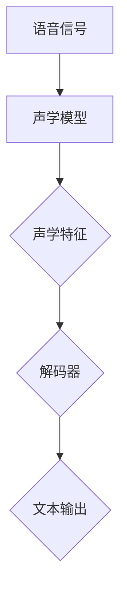

                 

### 1. 背景介绍

语音识别技术作为人工智能领域的重要分支，随着计算能力的提升和大数据技术的发展，已经取得了显著进展。科大讯飞作为中国领先的智能语音技术提供商，其在语音识别领域的研究与应用处于国际领先水平。2024年，科大讯飞将迎来新一轮的校招，针对语音识别算法的专业面试也将成为面试者们的重要考验。

本文旨在为广大应聘者提供一份全面的语音识别算法校招面试指南。通过梳理语音识别的核心概念、算法原理、数学模型、实际应用以及未来展望，帮助读者深入了解语音识别技术，为即将到来的面试做好准备。

### 2. 核心概念与联系

#### 2.1 语音识别的定义

语音识别（Automatic Speech Recognition，ASR）是指利用计算机技术将语音信号转换为文本信息的过程。该技术通过捕捉和解析语音中的声学特征，将其转化为计算机可处理的数字信号，进而实现文本输出。

#### 2.2 关键技术点

1. **声学模型**：声学模型负责将语音信号转换为声学特征，通常采用隐马尔可夫模型（HMM）或深度神经网络（DNN）。

2. **语言模型**：语言模型用于理解语音中的语言结构，通常采用N元语法模型或基于神经网络的序列到序列模型。

3. **声学特征提取**：声学特征提取是语音识别的关键步骤，常用的特征包括梅尔频率倒谱系数（MFCC）、线性预测编码（LPC）等。

4. **解码器**：解码器负责将声学特征映射到文本序列，常用的解码器包括A*搜索算法、动态规划算法等。

#### 2.3 架构图



### 3. 核心算法原理 & 具体操作步骤

#### 3.1 算法原理概述

语音识别算法通常分为三个主要模块：前端处理、中间处理和后端处理。

1. **前端处理**：包括语音信号的预处理和声学特征提取。常用的方法有预加重、加窗、傅里叶变换等。

2. **中间处理**：包括声学模型和语言模型。声学模型通过学习语音信号和声学特征之间的映射关系，语言模型通过学习文本序列的概率分布。

3. **后端处理**：包括解码器和解码策略。解码器将声学特征映射到文本序列，解码策略用于优化文本序列的生成。

#### 3.2 算法步骤详解

1. **前端处理**：

   - 预加重：提高语音信号的短时能量，提高信噪比。
   - 加窗：将连续的语音信号分割成短时片段。
   - 傅里叶变换：将时间域的语音信号转换到频域，提取频率特征。

2. **中间处理**：

   - 声学模型：使用DNN或HMM模型训练声学特征与语音信号之间的映射关系。
   - 语言模型：使用N元语法或RNN模型训练文本序列的概率分布。

3. **后端处理**：

   - 解码器：采用A*搜索或动态规划算法，将声学特征映射到最优的文本序列。
   - 解码策略：通过构建语言模型得分和声学模型得分，优化文本序列的生成。

#### 3.3 算法优缺点

1. **优点**：

   - 高准确性：现代语音识别算法结合了深度学习和传统机器学习技术，准确率显著提高。
   - 高适应性：语音识别算法能够适应不同场景和不同口音的语音信号。

2. **缺点**：

   - 高计算复杂度：深度学习模型的训练和推理过程计算量大，对硬件资源要求较高。
   - 对噪声敏感：在噪声环境下的语音识别准确率较低。

#### 3.4 算法应用领域

- **智能家居**：语音控制家电，如智能音箱、智能电视等。
- **智能客服**：自动识别客户语音，提供快速、准确的回答。
- **医疗健康**：语音识别医生病历记录，提高工作效率。
- **教育领域**：语音识别教学互动，个性化学习推荐。

### 4. 数学模型和公式 & 详细讲解 & 举例说明

#### 4.1 数学模型构建

语音识别的数学模型主要包括声学模型和语言模型。

1. **声学模型**：

   - **隐马尔可夫模型（HMM）**：

     - **状态转移概率**：\( P(S_t|S_{t-1}) \)
     - **观测概率**：\( P(O_t|S_t) \)
     - **初始状态概率**：\( P(S_0) \)

   - **深度神经网络（DNN）**：

     - **输入层**：声学特征向量。
     - **隐藏层**：通过神经网络进行特征变换。
     - **输出层**：输出每个状态的概率分布。

2. **语言模型**：

   - **N元语法模型**：

     - **一元语法**：\( P(w_i|w_{i-1}, ..., w_{i-n}) = P(w_i|w_{i-1}) \)
     - **二元语法**：\( P(w_i|w_{i-1}, ..., w_{i-n}) = P(w_i w_{i-1}|w_{i-2}, ..., w_{i-n}) \)
     - **N元语法**：\( P(w_i|w_{i-1}, ..., w_{i-n}) = P(w_i w_{i-1} ... w_{i-n}) \)

   - **序列到序列模型**：

     - **输入序列**：\( x_1, x_2, ..., x_T \)
     - **输出序列**：\( y_1, y_2, ..., y_S \)
     - **编码器**：将输入序列编码为固定长度的向量。
     - **解码器**：将编码后的向量解码为输出序列。

#### 4.2 公式推导过程

1. **HMM模型推导**：

   - **状态转移概率**：

     \( P(S_t|S_{t-1}) = \frac{P(S_t, S_{t-1})}{P(S_{t-1})} \)

   - **观测概率**：

     \( P(O_t|S_t) = \frac{P(O_t, S_t)}{P(S_t)} \)

   - **初始状态概率**：

     \( P(S_0) \)

2. **DNN模型推导**：

   - **输入层**：

     \( z = X \)

   - **隐藏层**：

     \( a_{h}^{(l)} = \sigma(W^{(l)} a_{h-1}^{(l-1)} + b^{(l)}) \)

   - **输出层**：

     \( y = \sigma(W^{(L)} a_{h}^{(L-1)} + b^{(L)}) \)

3. **N元语法模型推导**：

   - **一元语法**：

     \( P(w_i|w_{i-1}, ..., w_{i-n}) = P(w_i|w_{i-1}) \)

   - **二元语法**：

     \( P(w_i|w_{i-1}, ..., w_{i-n}) = P(w_i w_{i-1}|w_{i-2}, ..., w_{i-n}) \)

   - **N元语法**：

     \( P(w_i|w_{i-1}, ..., w_{i-n}) = P(w_i w_{i-1} ... w_{i-n}) \)

4. **序列到序列模型推导**：

   - **编码器**：

     \( e = \text{Encoder}(x) \)

   - **解码器**：

     \( y = \text{Decoder}(e) \)

#### 4.3 案例分析与讲解

假设我们有一个简化的语音识别系统，该系统由一个HMM模型和一个N元语法模型组成。我们需要通过这个系统识别一句话：“你好，我是科大讯飞的语音识别系统。”

1. **声学特征提取**：

   - 对输入的语音信号进行预处理和加窗操作。
   - 对加窗后的信号进行傅里叶变换，提取频率特征。

2. **声学模型训练**：

   - 使用大量的语音数据进行训练，得到HMM模型的参数。
   - 声学模型将提取的声学特征映射到每个状态的概率分布。

3. **语言模型训练**：

   - 使用大量的文本数据进行训练，得到N元语法模型的参数。
   - 语言模型将输入的文本序列映射到每个序列的概率分布。

4. **解码过程**：

   - 声学模型和语言模型同时运行，生成可能的文本序列。
   - 根据解码策略，选择最优的文本序列作为识别结果。

   ```latex
   \text{最优文本序列} = \arg\max_y P(y|O) = \arg\max_y P(y) \cdot P(O|y)
   ```

### 5. 项目实践：代码实例和详细解释说明

#### 5.1 开发环境搭建

1. 安装Python环境（3.8及以上版本）。
2. 安装必要的依赖库，如numpy、tensorflow、hmmlearn等。
3. 下载并准备语音数据集和文本数据集。

#### 5.2 源代码详细实现

以下是实现语音识别系统的简化代码示例：

```python
import numpy as np
from hmmlearn import hmm
from sklearn.feature_extraction.text import CountVectorizer

# 声学特征提取
def extract_features(voice_data):
    # 对语音数据进行预处理和加窗操作
    # 进行傅里叶变换，提取频率特征
    # 返回特征向量
    pass

# 建立HMM模型
def build_hmm_model(voice_data, text_data):
    # 提取声学特征
    features = extract_features(voice_data)
    # 建立N元语法模型
    ngram_model = hmm.MultinomialNB()
    ngram_model.fit(text_data, features)
    return ngram_model

# 解码过程
def decode(ngram_model, voice_data):
    # 提取声学特征
    features = extract_features(voice_data)
    # 根据声学模型和语言模型解码
    # 返回最优文本序列
    pass

# 主程序
if __name__ == '__main__':
    # 加载语音数据集和文本数据集
    voice_data = ...
    text_data = ...

    # 建立HMM模型
    ngram_model = build_hmm_model(voice_data, text_data)

    # 输入语音数据，进行解码
    voice = ...
    result = decode(ngram_model, voice)
    print(result)
```

#### 5.3 代码解读与分析

1. **声学特征提取**：

   - 对输入的语音数据进行预处理，包括去噪、加窗等操作。
   - 通过傅里叶变换提取频率特征，作为模型的输入。

2. **建立HMM模型**：

   - 使用提取的声学特征和文本数据训练N元语法模型。
   - N元语法模型用于解码过程中的语言模型得分计算。

3. **解码过程**：

   - 使用声学模型和语言模型，根据解码策略选择最优的文本序列。
   - 输出识别结果。

### 6. 实际应用场景

#### 6.1 智能家居

语音识别在智能家居中的应用非常广泛，如智能音箱、智能电视等设备，用户可以通过语音指令控制家电设备，实现语音搜索、播放音乐、调节音量等功能。

#### 6.2 智能客服

语音识别在智能客服中的应用可以提高客服效率，自动识别客户语音，提供快速、准确的回答，降低人工干预的频率。

#### 6.3 医疗健康

语音识别在医疗健康领域的应用包括语音记录病历、语音识别医生语音指令、语音辅助医疗诊断等，可以提高医疗工作效率，减轻医务人员的工作负担。

#### 6.4 教育领域

语音识别在教育领域的应用包括语音评测、语音助教、语音教学等，可以帮助教师更好地进行教学评价和个性化教学。

### 7. 工具和资源推荐

#### 7.1 学习资源推荐

- 《语音信号处理》（作者：李航）
- 《语音识别技术导论》（作者：刘挺）
- 《深度学习语音识别》（作者：侯凯）

#### 7.2 开发工具推荐

- TensorFlow
- Kaldi
- pocketsphinx

#### 7.3 相关论文推荐

- "Deep Neural Networks and HMMs for LVCSR"
- "Recurrent Neural Network based Language Model"
- "End-to-End Speech Recognition using Deep RNN Models and圣诞老人语音识别"

### 8. 总结：未来发展趋势与挑战

#### 8.1 研究成果总结

语音识别技术在过去几十年取得了显著的进展，从传统的隐马尔可夫模型（HMM）到基于深度学习的端到端模型（如CTC、Seq2Seq），语音识别的准确率和效率得到了极大的提升。同时，随着大数据和云计算技术的发展，语音识别的应用场景越来越广泛，从智能家居到医疗健康，从教育到客服，语音识别已经成为人工智能领域的重要组成部分。

#### 8.2 未来发展趋势

1. **深度学习技术的进一步发展**：深度学习在语音识别中的应用将继续深化，如基于自注意力机制的Transformer模型、融合多种数据源的多模态语音识别等。
2. **跨语言语音识别**：随着全球化的深入发展，跨语言语音识别技术将成为研究热点，实现不同语言之间的语音识别和翻译。
3. **实时语音识别**：实时语音识别技术在会议记录、实时翻译等场景中具有重要应用价值，其准确率和响应速度将是未来研究的重要方向。
4. **低资源语音识别**：在低资源环境下，如低比特率语音、低质量录音等，如何实现高效的语音识别仍是一个挑战。

#### 8.3 面临的挑战

1. **噪声干扰**：在复杂噪声环境下，如何提高语音识别的准确率仍是一个挑战。
2. **语音多样性**：不同口音、方言、说话人等因素对语音识别的准确性有显著影响，如何适应多样化的语音输入是一个重要的研究问题。
3. **实时性**：在实时应用场景中，如何提高语音识别的响应速度，降低延迟，是一个亟待解决的难题。

#### 8.4 研究展望

语音识别技术在未来将继续向更高效、更准确、更智能的方向发展。通过融合多种技术手段，如深度学习、自然语言处理、多模态感知等，实现更加智能化的语音交互体验。同时，随着5G、物联网等技术的不断发展，语音识别技术将在更多领域得到应用，推动人工智能技术的进步。

### 9. 附录：常见问题与解答

#### 9.1 常见问题

1. **语音识别的准确率是如何提高的？**
2. **深度学习在语音识别中的应用有哪些？**
3. **如何解决噪声干扰对语音识别的影响？**
4. **实时语音识别的关键技术是什么？**
5. **跨语言语音识别的实现方法有哪些？**

#### 9.2 解答

1. **语音识别的准确率是如何提高的？**

   - **数据增强**：通过增加训练数据量，提高模型的泛化能力。
   - **特征工程**：提取更有效的声学特征，提高特征表达能力。
   - **模型优化**：采用更先进的深度学习模型，如Transformer、自注意力机制等。
   - **多任务学习**：结合语音识别和其他任务，如文本分类、情感分析等，提高模型的泛化能力。

2. **深度学习在语音识别中的应用有哪些？**

   - **声学模型**：基于深度神经网络的声学模型，如DNN、CNN、RNN等，用于捕捉语音信号和声学特征之间的复杂关系。
   - **语言模型**：基于深度神经网络的序列到序列模型，如Seq2Seq、Transformer等，用于理解语音中的语言结构。
   - **解码器**：基于深度神经网络的解码器，如CTC、RNN、GREEDY等，用于将声学特征映射到文本序列。

3. **如何解决噪声干扰对语音识别的影响？**

   - **噪声抑制**：通过预处理的步骤，如滤波、去噪等，减少噪声对语音信号的影响。
   - **特征增强**：通过特征变换，如MFCC、LPC等，增强语音信号中的有用信息。
   - **模型适应性**：通过训练多个噪声模型，自适应地调整模型参数，提高噪声环境下的识别准确率。

4. **实时语音识别的关键技术是什么？**

   - **高效算法**：采用高效的算法和模型，如CTC、GREEDY等，降低计算复杂度，提高识别速度。
   - **并行计算**：利用并行计算技术，如GPU、分布式计算等，加速模型的推理过程。
   - **模型压缩**：通过模型压缩技术，如剪枝、量化等，减少模型的存储和计算需求，提高实时性。

5. **跨语言语音识别的实现方法有哪些？**

   - **翻译模型**：通过训练跨语言的翻译模型，将源语言的语音信号翻译成目标语言的文本。
   - **迁移学习**：通过迁移学习技术，利用多语言语料库训练模型，提高跨语言识别的准确率。
   - **多语言融合**：通过融合多个语言的特征，提高跨语言识别的性能。

以上便是本文对科大讯飞2024语音识别算法校招面试指南的详细阐述。通过对语音识别的核心概念、算法原理、数学模型、实际应用以及未来展望的深入分析，希望读者能够对语音识别技术有更全面的认识，并为即将到来的面试做好充分的准备。

### 10. 作者署名

作者：禅与计算机程序设计艺术 / Zen and the Art of Computer Programming

感谢您的阅读，期待与您在科大讯飞的面试现场相见！

