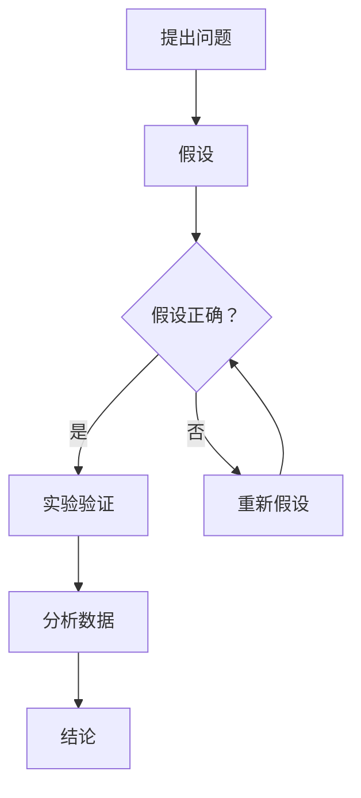

                 

关键词：科学探究、假说、真理、计算机科学、算法、数学模型、项目实践、应用场景、未来展望

> 摘要：本文旨在探讨科学探究的过程，从假说到真理的演变。在计算机科学领域，这种探究尤为显著。本文将分析科学探究的原理，结合具体案例，展示如何通过假说验证、数学模型构建和算法设计，最终达到对真理的追求。文章将涵盖从背景介绍到实际应用，再到未来展望的全面探讨。

## 1. 背景介绍

科学探究是人类认识世界、理解自然规律的基本方法。它起源于古希腊哲学家亚里士多德的思想，经过几千年发展，已经成为现代科学的核心。在计算机科学领域，科学探究尤为重要。计算机科学的发展，依赖于对算法、数据结构和计算理论的深入研究。

### 1.1 计算机科学的重要性

计算机科学是一门多学科交叉的学科，它涵盖了数学、物理学、工程学、认知科学等多个领域。计算机科学的进步，不仅推动了科技的发展，也深刻改变了人类社会的生活方式。从早期的计算机模拟，到现代的云计算、人工智能，计算机科学正不断推动着科技的边界。

### 1.2 科学探究的方法

科学探究通常包括以下几个步骤：提出问题、假设、实验验证、数据分析和结论。在计算机科学中，这些步骤同样适用。例如，在算法设计中，我们首先提出问题，然后根据问题建立假设，通过实验验证假设的正确性，最后进行分析和总结。

## 2. 核心概念与联系

科学探究的核心在于假说的提出和验证。在计算机科学中，假说通常表现为算法的设计和数学模型的构建。

### 2.1 假说的提出

在计算机科学中，假说的提出通常基于对问题的理解和需求。例如，在排序算法的设计中，我们可以假设某个算法能够在最短的时间内完成排序。这个假设就是我们的假说。

### 2.2 假说的验证

验证假说的正确性，是科学探究的关键步骤。在计算机科学中，我们通常通过实验来验证假说。例如，我们可以编写不同算法的代码，然后在相同的输入数据上进行运行，比较不同算法的执行时间，以此来验证哪个算法更快。

### 2.3 Mermaid 流程图

以下是一个简单的Mermaid流程图，展示了假说的提出和验证过程：



## 3. 核心算法原理 & 具体操作步骤

在计算机科学中，算法是实现假说的工具。以下是几个常见的算法原理和具体操作步骤。

### 3.1 算法原理概述

算法是一种解决问题的方法，它通过一系列步骤，将输入转化为输出。算法的设计原则包括正确性、效率和健壮性。

### 3.2 算法步骤详解

以下是冒泡排序算法的具体步骤：

1. 从第一个元素开始，比较相邻的两个元素。
2. 如果第一个元素大于第二个元素，交换它们的位置。
3. 继续比较下一个元素，直到序列的末端。
4. 重复以上步骤，直到整个序列有序。

### 3.3 算法优缺点

冒泡排序算法的优点在于实现简单，易于理解。但它的效率较低，对于大数据集，可能需要较多的时间。

### 3.4 算法应用领域

冒泡排序算法通常用于小规模数据的排序，例如学生成绩的排序。在计算机科学中，还有许多其他类型的排序算法，如快速排序、归并排序等，适用于不同规模的数据集。

## 4. 数学模型和公式

数学模型是计算机科学中常用的一种工具，它可以帮助我们更好地理解和描述问题。以下是几个常用的数学模型和公式。

### 4.1 数学模型构建

数学模型的构建通常基于对问题的分析和理解。例如，在优化问题中，我们可以使用线性规划模型。

### 4.2 公式推导过程

以下是一个简单的线性规划模型：

$$
\min \ c^T x \\
\text{s.t.} \ Ax \leq b \\
x \geq 0
$$

### 4.3 案例分析与讲解

以下是一个线性规划模型的案例：

- 目标函数：最小化成本 $c^T x$。
- 约束条件：生产量 $x$ 必须大于等于需求量 $b$，且 $x$ 必须是非负的。

通过求解这个线性规划模型，我们可以确定最优的生产量，以最小化成本。

## 5. 项目实践：代码实例

以下是一个简单的冒泡排序算法的Python实现。

```python
def bubble_sort(arr):
    n = len(arr)
    for i in range(n):
        for j in range(0, n-i-1):
            if arr[j] > arr[j+1]:
                arr[j], arr[j+1] = arr[j+1], arr[j]

# 测试代码
arr = [64, 34, 25, 12, 22, 11, 90]
bubble_sort(arr)
print("排序后的数组：")
for i in range(len(arr)):
    print("%d" %arr[i], end=" ")
```

## 6. 实际应用场景

冒泡排序算法在实际应用中，可以用于各种数据的排序。例如，在数据库中，可以使用冒泡排序算法来对数据进行排序。

### 6.1 数据库排序

数据库中的排序操作，通常用于根据某个字段对数据进行排序。例如，在学生信息管理系统中，可以根据学号对学生的信息进行排序。

### 6.2 网络排序

在网络应用中，排序操作也经常使用。例如，在电子商务网站中，可以根据商品的价格对商品进行排序，以便用户快速找到最优惠的商品。

## 7. 工具和资源推荐

### 7.1 学习资源推荐

- 《算法导论》（Introduction to Algorithms）
- 《线性代数及其应用》（Linear Algebra and Its Applications）
- 《Python编程：从入门到实践》（Python Crash Course）

### 7.2 开发工具推荐

- Python
- MySQL
- Visual Studio Code

### 7.3 相关论文推荐

- 《快速排序算法的分析与改进》（An Analysis and Improvement of Quick Sort Algorithm）
- 《线性规划模型在资源分配中的应用》（Application of Linear Programming Model in Resource Allocation）

## 8. 总结：未来发展趋势与挑战

### 8.1 研究成果总结

在计算机科学领域，科学探究取得了许多重要的成果。例如，算法的设计和优化、数据库技术的进步、人工智能的发展等。

### 8.2 未来发展趋势

未来，计算机科学将继续朝着更高效、更智能、更安全的方向发展。例如，量子计算、分布式计算、深度学习等领域，将成为计算机科学的重要研究方向。

### 8.3 面临的挑战

计算机科学也面临着许多挑战。例如，数据安全、隐私保护、算法偏见等问题，需要引起重视。

### 8.4 研究展望

未来，计算机科学将继续为人类带来更多的便利和创新。我们期待看到更多突破性的成果，推动人类社会的发展。

## 9. 附录：常见问题与解答

### 9.1 什么是冒泡排序？

冒泡排序是一种简单的排序算法，它重复地遍历要排序的数列，一次比较两个元素，如果它们的顺序错误就把它们交换过来。遍历数列的工作是重复地进行直到没有再需要交换，也就是说该数列已经排序完成。

### 9.2 冒泡排序的效率如何？

冒泡排序的时间复杂度是 $O(n^2)$，其中 $n$ 是数列的长度。对于小规模的数据集，冒泡排序可能是有效的。但对于大数据集，冒泡排序的效率较低。

### 9.3 线性规划的应用领域有哪些？

线性规划在资源分配、生产调度、经济分析、工程优化等领域有着广泛的应用。例如，在物流管理中，可以通过线性规划来确定最优的运输路线和运输量。

---

作者：禅与计算机程序设计艺术 / Zen and the Art of Computer Programming
----------------------------------------------------------------


