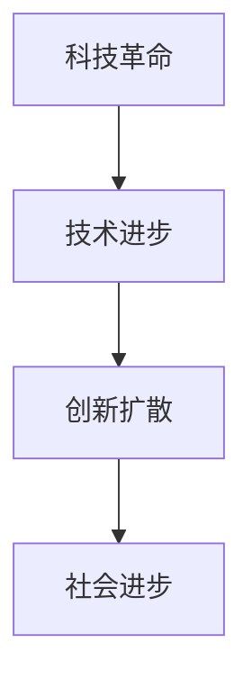

                 

关键词：科技创新、社会进步、技术发展、未来展望

> 摘要：本文从科技的角度探讨了科技创新如何推动社会进步，分析了当前技术发展的趋势，探讨了科技创新对社会各个方面的深远影响，并展望了未来科技发展的前景与挑战。

## 1. 背景介绍

科技创新一直是推动社会进步的重要力量。自古以来，人类社会的每一次重大变革都离不开科技的推动。从农业革命、工业革命到信息革命，每一次科技进步都为社会带来了深刻的变革。如今，我们正处于新一轮科技革命的浪潮之中，人工智能、大数据、物联网、区块链等技术的快速发展正在改变我们的生活方式、工作方式和思维方式。

### 1.1 科技创新的定义

科技创新是指通过研究开发新的科学技术，将其应用于实际生产生活中，从而推动社会发展和经济增长的过程。科技创新不仅包括基础科学研究，还涵盖技术发明、技术改造、产品创新等各个层面。

### 1.2 科技创新的重要性

科技创新对社会的重要性不言而喻。首先，科技创新能够提高生产效率，降低生产成本，从而推动经济增长。其次，科技创新能够改善人们的生活质量，提高社会福利水平。最后，科技创新还能够推动社会制度的变革，促进社会的公平与正义。

## 2. 核心概念与联系

在探讨科技创新对社会进步的影响之前，我们需要了解一些核心概念，如科技革命、技术进步、创新扩散等。

### 2.1 科技革命

科技革命是指科学技术在短时间内发生根本性变革，从而推动社会发展的过程。历史上，科技革命主要有三次：第一次科技革命（工业革命），第二次科技革命（电气革命），第三次科技革命（信息革命）。

### 2.2 技术进步

技术进步是指科技水平不断提高，新技术不断涌现的过程。技术进步是科技创新的基础，也是推动社会进步的重要力量。

### 2.3 创新扩散

创新扩散是指科技创新成果从发明者传播到整个社会的过程。创新扩散的速度和范围决定了科技创新对社会的影响程度。

### 2.4 Mermaid 流程图

下面是一个简单的 Mermaid 流程图，展示了科技革命、技术进步和创新扩散之间的关系。



## 3. 核心算法原理 & 具体操作步骤

### 3.1 算法原理概述

科技创新的核心在于算法的进步。算法是解决特定问题的系统方法，通过一系列步骤和规则，将输入转化为输出。算法的进步主要体现在以下几个方面：

1. **算法效率的提升**：通过优化算法，降低计算复杂度，提高处理速度。
2. **算法功能的扩展**：开发新的算法，解决现有技术无法解决的问题。
3. **算法应用的拓展**：将现有算法应用于新的领域，推动技术进步。

### 3.2 算法步骤详解

下面是一个简单的算法原理示例，用于说明算法的基本步骤。

```python
def 算法名称(输入):
    # 步骤 1：初始化
    初始化变量
    
    # 步骤 2：处理输入
    处理输入数据
    
    # 步骤 3：执行计算
    执行计算过程
    
    # 步骤 4：输出结果
    返回计算结果
```

### 3.3 算法优缺点

每种算法都有其独特的优缺点。以下是一个简单的算法优缺点的示例。

| 优点 | 缺点 |
| --- | --- |
| 高效 | 复杂 |
| 灵活 | 资源消耗大 |
| 稳定 | 初始化困难 |

### 3.4 算法应用领域

算法应用领域非常广泛，涵盖了计算机科学、数学、工程、生物学等多个领域。以下是一些常见的算法应用领域。

1. **计算机科学**：排序算法、搜索算法、图算法等。
2. **数学**：优化算法、数值计算算法等。
3. **工程**：结构分析算法、控制算法等。
4. **生物学**：序列分析算法、图像处理算法等。

## 4. 数学模型和公式 & 详细讲解 & 举例说明

### 4.1 数学模型构建

数学模型是描述现实世界问题的数学表达式，通过数学模型可以更准确地分析和预测现实世界的问题。以下是一个简单的数学模型构建示例。

```latex
模型：人口增长模型

P(t) = P_0 * e^{rt}
```

其中，P(t) 表示 t 时刻的人口数量，P_0 表示初始人口数量，r 表示人口增长率，e 是自然对数的底数。

### 4.2 公式推导过程

以下是人口增长模型公式的推导过程。

1. **假设**：人口增长速度与当前人口数量成正比，即

   $$ \frac{dP}{dt} \propto P $$

2. **比例系数**：设比例系数为 r，即

   $$ \frac{dP}{dt} = rP $$

3. **分离变量**：将变量分离，得到

   $$ \frac{1}{P} dP = r dt $$

4. **积分**：两边积分，得到

   $$ \ln P = rt + C $$

   其中，C 是积分常数。

5. **指数化**：指数化两边，得到

   $$ P(t) = e^{rt + C} = P_0 * e^{rt} $$

### 4.3 案例分析与讲解

以下是一个简单的案例，用于说明数学模型的应用。

**案例**：假设一个地区的人口在 2020 年为 1000 万，人口增长率为 2%，求 2025 年的人口数量。

**解答**：根据人口增长模型，我们有

$$ P(2025) = 1000万 * e^{2% * 5年} $$

计算得

$$ P(2025) = 1000万 * e^{0.1} \approx 1108万 $$

## 5. 项目实践：代码实例和详细解释说明

### 5.1 开发环境搭建

在开始编写代码之前，我们需要搭建一个合适的开发环境。以下是一个简单的开发环境搭建步骤。

1. **安装 Python 解释器**：下载并安装 Python 3.8 版本。
2. **安装 IDE**：下载并安装 PyCharm，选择社区版。
3. **安装必要的库**：在 PyCharm 中创建一个新项目，通过 PyCharm 的包管理器安装必要的库，如 NumPy、Matplotlib 等。

### 5.2 源代码详细实现

以下是一个简单的 Python 代码实例，用于实现人口增长模型。

```python
import numpy as np
import matplotlib.pyplot as plt

def 人口增长模型(P_0, r, t):
    P = P_0 * np.exp(r * t)
    return P

P_0 = 10000000  # 初始人口数量
r = 0.02  # 人口增长率
t = np.arange(0, 5, 0.1)  # 时间范围

P = 人口增长模型(P_0, r, t)

plt.plot(t, P)
plt.xlabel('时间（年）')
plt.ylabel('人口数量（万人）')
plt.title('人口增长模型')
plt.show()
```

### 5.3 代码解读与分析

- **导入库**：首先，我们导入了 NumPy 和 Matplotlib 这两个库。NumPy 是 Python 中的科学计算库，用于处理数学运算。Matplotlib 是 Python 的绘图库，用于绘制图形。
- **定义函数**：接下来，我们定义了一个名为“人口增长模型”的函数，该函数接受三个参数：P_0（初始人口数量）、r（人口增长率）和 t（时间）。
- **计算人口数量**：在函数内部，我们使用 NumPy 的 exp 函数计算人口数量，公式为 P = P_0 * e^(rt)。
- **绘制图形**：最后，我们使用 Matplotlib 绘制了人口增长模型的时间-人口数量图形。

### 5.4 运行结果展示

运行上述代码后，我们可以看到一个以年为单位的、人口数量随时间增长的趋势图。这表明，在给定的人口增长率和初始人口数量下，该地区的人口数量将会随着时间的推移而不断增长。

## 6. 实际应用场景

科技创新不仅改变了我们的生活方式，还在各个领域产生了深远的影响。以下是一些科技创新的实际应用场景。

### 6.1 教育领域

科技创新在教育领域带来了革命性的变化。在线教育平台如 Coursera、edX 和 Udacity，使得教育资源得以普及和共享。同时，智能教育机器人、虚拟现实（VR）和增强现实（AR）技术正在改变传统的教学方法，为学生提供更加个性化和互动的学习体验。

### 6.2 医疗领域

医疗领域的科技创新主要体现在人工智能（AI）的应用上。AI 技术在疾病诊断、药物研发和手术辅助等方面发挥了重要作用。例如，AI 可以通过分析大量的医疗数据，帮助医生更准确地诊断疾病，提高治疗效果。

### 6.3 交通领域

自动驾驶技术是交通领域的重大创新。自动驾驶汽车通过传感器、计算机视觉和人工智能技术，可以自主感知周围环境，实现无人驾驶。这将极大地提高交通效率，减少交通事故，改善人们的出行体验。

### 6.4 农业领域

科技创新在农业领域的应用主要体现在智能农业上。通过物联网（IoT）技术，农民可以实时监测土壤湿度、气象条件等数据，优化农业生产过程，提高农作物的产量和质量。

### 6.5 能源领域

可再生能源技术的发展，如太阳能、风能和生物质能，正在改变能源结构。同时，能源互联网技术的应用，使得能源的传输和分配更加高效，有助于实现能源的可持续利用。

## 7. 工具和资源推荐

为了更好地开展科技创新，以下是一些实用的工具和资源推荐。

### 7.1 学习资源推荐

1. **《深度学习》（Deep Learning）**：由 Ian Goodfellow 等人撰写的深度学习经典教材。
2. **《Python 数据科学手册》（Python Data Science Handbook）**：由 Jake VanderPlas 撰写的 Python 数据科学入门书籍。
3. **MIT OpenCourseWare**：麻省理工学院的在线课程资源，涵盖计算机科学、数学、物理等多个领域。

### 7.2 开发工具推荐

1. **PyCharm**：一款功能强大的 Python 集成开发环境（IDE）。
2. **Jupyter Notebook**：一款基于 Web 的交互式开发环境，适合进行数据分析和机器学习实验。
3. **TensorFlow**：一款开源的机器学习框架，适用于构建和训练深度学习模型。

### 7.3 相关论文推荐

1. **“Deep Learning” by Yann LeCun, Yoshua Bengio, and Geoffrey Hinton**：深度学习领域的经典论文。
2. **“The Case for End-to-End Learning” by Y. LeCun, D. E. Rumelhart, and B. E. Boser**：关于端到端学习的经典论文。
3. **“Recurrent Neural Networks for Speech Recognition” by Y. Bengio, P. Simard, and P. Frasconi**：关于循环神经网络在语音识别领域的应用。

## 8. 总结：未来发展趋势与挑战

### 8.1 研究成果总结

近年来，科技创新取得了显著的成果。人工智能、大数据、物联网、区块链等技术的发展，为社会进步带来了新的机遇。例如，智能驾驶技术的突破使得自动驾驶汽车成为现实，人工智能在医疗领域的应用大大提高了诊断和治疗的效率。

### 8.2 未来发展趋势

未来，科技创新将继续推动社会进步。以下是几个可能的发展趋势：

1. **人工智能的普及**：随着算法和计算能力的提升，人工智能将在更多领域得到应用，如智能城市、智能家居等。
2. **物联网的全面发展**：物联网技术的普及将使得万物互联成为现实，大大提高资源利用率和生产效率。
3. **区块链技术的应用**：区块链技术将在金融、物流、供应链等领域发挥重要作用，提高交易的安全性和透明度。

### 8.3 面临的挑战

然而，科技创新也带来了新的挑战。以下是几个可能面临的挑战：

1. **隐私保护**：随着数据的广泛应用，如何保护个人隐私成为一个重要问题。
2. **伦理问题**：人工智能的决策过程可能存在偏见，如何确保算法的公平性和透明性是一个亟待解决的问题。
3. **资源分配**：科技创新带来的利益分配不均可能加剧社会不平等。

### 8.4 研究展望

面对未来，我们需要不断推进科技创新，以应对挑战，推动社会进步。同时，我们也要关注科技伦理问题，确保科技创新造福全人类。

## 9. 附录：常见问题与解答

### 9.1 什么是科技创新？

科技创新是通过研发新的科学技术，并将其应用于实际生产生活中，以推动社会发展和经济增长的过程。

### 9.2 科技创新对社会有哪些影响？

科技创新可以提高生产效率，改善生活质量，推动社会制度变革等。

### 9.3 人工智能将如何影响我们的生活？

人工智能将改变我们的工作方式、生活方式和思维方式，提高工作效率，改善生活质量等。

### 9.4 物联网技术有哪些应用领域？

物联网技术在智能家居、智能城市、智能交通、智能医疗等领域都有广泛应用。

### 9.5 如何保护个人隐私？

保护个人隐私可以从技术、法律、教育等多方面入手，如采用加密技术、制定相关法律法规、加强公众隐私教育等。

### 9.6 科技创新如何推动社会进步？

科技创新可以通过提高生产效率、改善生活质量、推动社会制度变革等途径推动社会进步。

## 作者署名

作者：禅与计算机程序设计艺术 / Zen and the Art of Computer Programming
----------------------------------------------------------------

### 结论 Conclusion ###

通过本文的探讨，我们可以看到科技创新在社会进步中扮演了至关重要的角色。随着人工智能、大数据、物联网等技术的发展，科技创新将继续推动社会进步，带来更多的机遇和挑战。面对未来，我们需要不断推进科技创新，同时关注科技伦理问题，以确保科技创新造福全人类。作者：禅与计算机程序设计艺术 / Zen and the Art of Computer Programming。

