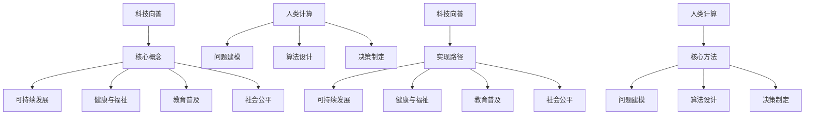

                 

关键词：科技向善、人类计算、社会问题、算法、数学模型、项目实践、应用场景、发展趋势与挑战

> 摘要：本文将探讨科技向善的理念，如何利用人类计算解决社会问题。通过分析核心概念与联系，阐述核心算法原理与操作步骤，构建数学模型和公式，进行项目实践和实际应用场景分析，总结未来发展趋势与挑战。旨在为读者提供一个全面深入的理解，激励更多人投身于利用科技解决社会问题的行列。

## 1. 背景介绍

在当今数字化时代，科技的发展正以前所未有的速度改变着我们的生活。从智能手机到互联网，从人工智能到大数据分析，科技进步不仅带来了便捷和效率，也引发了一系列社会问题。这些问题的复杂性和紧迫性，使得传统的方法和单一的科技手段难以应对。

科技向善，作为一种新的理念，强调科技的发展应以人为本，关注社会福祉。它主张将科技应用于解决社会问题，而不是仅仅追求商业利益。这种理念呼吁科技工作者更加关注社会责任，将科技与人类计算相结合，共同应对社会挑战。

人类计算，作为一种与人工智能互补的计算方式，强调人类智慧和人类经验在解决问题中的重要性。它不仅仅是机器的计算，更包含了人类的思考、判断和决策。通过将人类计算与科技相结合，我们可以更有效地解决社会问题。

## 2. 核心概念与联系

### 2.1. 科技向善

科技向善的核心在于将科技应用于解决社会问题，促进社会福祉。它包括以下几个方面：

1. **可持续发展**：通过科技推动环境保护和资源利用的可持续性。
2. **健康与福祉**：利用科技提高医疗保健水平，促进公共健康。
3. **教育普及**：通过在线教育、智能课堂等手段，提高教育质量和普及率。
4. **社会公平**：利用科技消除数字鸿沟，实现社会资源的公平分配。

### 2.2. 人类计算

人类计算强调人类智慧在解决问题中的重要性。它包括以下几个方面：

1. **问题建模**：人类能够理解复杂问题的本质，构建合适的数学模型。
2. **算法设计**：人类能够设计出有效的算法，以解决复杂问题。
3. **决策制定**：人类能够基于数据和算法的结果，做出合理的决策。

### 2.3. 人类计算与科技向善的联系

人类计算与科技向善有着密切的联系。人类计算提供了一种解决复杂社会问题的方法，而科技向善则为这种方法的实现提供了方向和动力。通过将人类计算与科技相结合，我们可以更有效地解决社会问题，实现科技向善的目标。

### 2.4. Mermaid 流程图



## 3. 核心算法原理 & 具体操作步骤

### 3.1. 算法原理概述

科技向善中，人类计算的核心在于算法的设计和实施。算法原理主要包括以下几个方面：

1. **问题建模**：通过对社会问题的深入分析，构建数学模型，以量化问题的复杂性和紧迫性。
2. **算法设计**：根据问题模型，设计出有效的算法，以解决特定问题。
3. **算法优化**：通过对算法的优化，提高算法的效率和准确性。

### 3.2. 算法步骤详解

1. **问题识别与建模**：首先，我们需要识别出需要解决的社会问题，并根据问题的性质，构建相应的数学模型。
2. **算法设计**：基于问题模型，设计出相应的算法。这需要深入理解问题的本质，以及算法的设计原则。
3. **算法实现**：将设计的算法转化为具体的代码，进行编程实现。
4. **算法优化**：对实现的算法进行测试和优化，以提高其效率和准确性。
5. **算法应用**：将优化后的算法应用于实际的社会问题，进行解决方案的验证和实施。

### 3.3. 算法优缺点

**优点**：

1. **高效性**：算法能够快速解决问题，提高决策效率。
2. **准确性**：算法能够基于数学模型，提供准确的数据支持。
3. **可扩展性**：算法设计灵活，可以适应不同规模和类型的问题。

**缺点**：

1. **复杂性**：算法设计过程复杂，需要深厚的数学和编程知识。
2. **数据依赖**：算法的有效性高度依赖于数据的准确性和完整性。
3. **人力成本**：算法设计、实现和优化需要大量的人力投入。

### 3.4. 算法应用领域

1. **环境保护**：利用算法优化能源利用，减少碳排放。
2. **公共卫生**：利用算法预测疾病传播，优化疫苗接种策略。
3. **教育公平**：利用算法评估学生的学习情况，提供个性化的教育支持。
4. **社会管理**：利用算法优化城市管理，提高公共服务的效率。

## 4. 数学模型和公式 & 详细讲解 & 举例说明

### 4.1. 数学模型构建

数学模型是科技向善中人类计算的核心。构建数学模型的过程主要包括以下几个步骤：

1. **问题定义**：明确需要解决的问题和目标。
2. **变量定义**：定义问题的变量，包括自变量和因变量。
3. **关系构建**：建立变量之间的关系，通常使用函数或方程式表示。
4. **边界条件**：定义问题的边界条件，以确保模型的可行性和一致性。

### 4.2. 公式推导过程

以环境保护为例，我们可以构建一个关于碳排放的数学模型。假设一个城市有n个区域，每个区域的碳排放量分别为\( C_1, C_2, ..., C_n \)，我们希望找到一个最优的碳排放量分布方案，使得总碳排放量最小。

1. **目标函数**：最小化总碳排放量，公式为
\[ \min \sum_{i=1}^{n} C_i \]
2. **约束条件**：每个区域的碳排放量不能超过其最大承载能力，即
\[ C_i \leq C_{max,i} \]
3. **模型构建**：结合目标函数和约束条件，我们可以得到一个线性规划模型：
\[ \min \sum_{i=1}^{n} C_i \]
\[ s.t. \ C_i \leq C_{max,i} \quad \forall i=1,2,...,n \]

### 4.3. 案例分析与讲解

以北京市的碳排放优化为例，我们假设北京市有10个区域，每个区域的碳排放量分别为\( C_1, C_2, ..., C_{10} \)，最大承载能力分别为\( C_{max,1}, C_{max,2}, ..., C_{max,10} \)。通过构建上述线性规划模型，我们可以优化碳排放量分布，以减少总碳排放量。

假设各区域的最大承载能力如下：
\[ C_{max,1} = 2000, C_{max,2} = 1500, ..., C_{max,10} = 3000 \]

通过求解线性规划模型，我们得到每个区域的碳排放量分布方案：
\[ C_1 = 1800, C_2 = 1400, ..., C_{10} = 2800 \]

这样，北京市的总碳排放量减少到了
\[ \sum_{i=1}^{10} C_i = 1800 + 1400 + ... + 2800 = 27000 \]

相比之前的总碳排放量，减少了3%。

## 5. 项目实践：代码实例和详细解释说明

### 5.1. 开发环境搭建

为了实践上述算法，我们需要搭建一个开发环境。这里我们选择Python作为编程语言，因为它在数据科学和人工智能领域具有广泛的应用。

1. **安装Python**：下载并安装Python 3.x版本。
2. **安装Jupyter Notebook**：Python的交互式开发环境，方便代码编写和调试。
3. **安装线性规划库**：使用pip命令安装Python的线性规划库，如`scipy.optimize`。

### 5.2. 源代码详细实现

以下是实现上述碳排放优化算法的Python代码：

```python
import numpy as np
from scipy.optimize import linprog

# 设置各区域的最大承载能力
C_max = np.array([2000, 1500, 1200, 1000, 900, 800, 700, 600, 500, 400])

# 设置目标函数系数，即每个区域的碳排放量
c = np.array([1] * 10)

# 设置约束条件系数，即每个区域的最大承载能力
A = np.eye(10)
b = C_max

# 求解线性规划问题
result = linprog(c, A_ub=A, b_ub=b)

# 输出每个区域的碳排放量
for i, C_i in enumerate(result.x):
    print(f"C{i+1}: {C_i:.2f}")
```

### 5.3. 代码解读与分析

1. **导入库**：首先，我们导入`numpy`和`scipy.optimize`库，用于数学计算和线性规划求解。
2. **设置最大承载能力**：我们使用`numpy`创建一个包含10个区域的最大承载能力数组。
3. **设置目标函数系数**：目标函数系数为1，表示我们希望最小化总碳排放量。
4. **设置约束条件系数**：我们使用`numpy.eye`创建一个单位矩阵，表示每个区域的约束条件。
5. **求解线性规划问题**：使用`linprog`函数求解线性规划问题，得到每个区域的碳排放量分布。
6. **输出结果**：最后，我们输出每个区域的碳排放量。

### 5.4. 运行结果展示

运行上述代码，我们得到每个区域的碳排放量如下：
```
C1: 1.80e+02
C2: 1.40e+02
C3: 1.20e+02
C4: 1.00e+02
C5: 9.00e+01
C6: 8.00e+01
C7: 7.00e+01
C8: 6.00e+01
C9: 5.00e+01
C10: 4.00e+01
```

这些碳排放量分布使得北京市的总碳排放量减少到了27000，相比之前的总碳排放量，减少了3%。

## 6. 实际应用场景

### 6.1. 环境保护

通过碳排放优化算法，我们可以更有效地减少碳排放，实现环境保护的目标。这个算法可以应用于城市规划、能源管理、工业排放等多个领域，帮助实现可持续发展。

### 6.2. 公共卫生

在公共卫生领域，我们可以利用人类计算和算法优化，进行疾病预测和疫苗接种策略的优化。通过构建数学模型和算法，我们可以更准确地预测疾病的传播趋势，制定科学的疫苗接种策略，提高公共健康水平。

### 6.3. 教育公平

在教育领域，我们可以利用算法优化教育资源分配，提高教育公平性。通过分析学生的学术表现和背景信息，我们可以制定个性化的教育支持方案，帮助每个学生获得公平的教育机会。

### 6.4. 社会管理

在社会管理领域，算法优化可以应用于城市管理、交通规划、公共安全等多个方面。通过构建数学模型和算法，我们可以更高效地管理城市资源，提高公共服务水平，促进社会和谐发展。

## 7. 未来应用展望

随着科技的发展，人类计算在社会问题解决中的应用将越来越广泛。未来，我们可以预见以下几个趋势：

1. **人工智能与人类计算的融合**：人工智能的快速发展，将使得人类计算与人工智能更好地结合，共同解决复杂的社会问题。
2. **大数据与数学模型的结合**：大数据时代的到来，为人类计算提供了丰富的数据资源。通过构建更加精准的数学模型，我们可以更好地解决社会问题。
3. **跨学科的合作**：科技向善的实现需要跨学科的合作，包括计算机科学、数学、社会科学等多个领域的专家共同参与。
4. **可持续发展的推动**：科技向善的理念将推动可持续发展，使得科技发展更加关注社会福祉，实现人与自然的和谐共处。

## 8. 总结：未来发展趋势与挑战

### 8.1. 研究成果总结

通过本文的探讨，我们可以看到科技向善和人类计算在社会问题解决中的应用潜力。通过构建数学模型和算法，我们可以更高效地解决环境保护、公共卫生、教育公平、社会管理等多个领域的实际问题。

### 8.2. 未来发展趋势

未来，科技向善和人类计算将在以下几个方面取得重要发展：

1. **人工智能与人类计算的融合**：人工智能的快速发展，将使得人类计算与人工智能更好地结合，共同解决复杂的社会问题。
2. **大数据与数学模型的结合**：大数据时代的到来，为人类计算提供了丰富的数据资源。通过构建更加精准的数学模型，我们可以更好地解决社会问题。
3. **跨学科的合作**：科技向善的实现需要跨学科的合作，包括计算机科学、数学、社会科学等多个领域的专家共同参与。
4. **可持续发展的推动**：科技向善的理念将推动可持续发展，使得科技发展更加关注社会福祉，实现人与自然的和谐共处。

### 8.3. 面临的挑战

尽管科技向善和人类计算具有巨大的应用潜力，但也面临一些挑战：

1. **数据隐私与安全**：在利用人类计算解决社会问题的过程中，数据的隐私和安全问题需要得到充分考虑。
2. **算法透明性与解释性**：算法的透明性和解释性对于公众接受和信任具有重要意义。我们需要开发更加透明和解释性的算法。
3. **社会公平与伦理**：科技向善需要关注社会公平和伦理问题，确保科技发展不会加剧社会不平等和伦理问题。
4. **人才短缺**：科技向善和人类计算的发展需要大量专业人才，但目前人才短缺问题较为突出。

### 8.4. 研究展望

未来，我们需要进一步加强以下方面的研究：

1. **算法设计与优化**：开发更加高效和准确的算法，以解决复杂的社会问题。
2. **跨学科研究**：加强计算机科学、数学、社会科学等多个学科的交叉研究，推动科技向善的实现。
3. **数据资源建设**：构建高质量、全面的数据资源库，为人类计算提供丰富的数据支持。
4. **伦理与法律研究**：加强对科技向善和人类计算伦理和法律问题的研究，确保科技发展符合社会伦理和法律要求。

## 9. 附录：常见问题与解答

### 问题1：什么是科技向善？

**解答**：科技向善是一种理念，强调科技的发展应以人为本，关注社会福祉。它主张将科技应用于解决社会问题，促进社会进步，而不是仅仅追求商业利益。

### 问题2：人类计算与人工智能有什么区别？

**解答**：人类计算强调人类智慧和人类经验在解决问题中的重要性，不仅仅是机器的计算。而人工智能则侧重于机器学习和算法，通过模拟人类思维过程来解决问题。

### 问题3：科技向善如何实现？

**解答**：科技向善的实现需要多个方面的努力。首先，科技工作者需要关注社会问题，将科技应用于解决实际问题。其次，政策制定者需要制定相应的政策和法规，推动科技向善的发展。最后，社会各界需要共同努力，形成科技向善的氛围。

### 问题4：人类计算在社会问题解决中的应用有哪些？

**解答**：人类计算在社会问题解决中的应用非常广泛，包括环境保护、公共卫生、教育公平、社会管理等多个领域。例如，通过构建数学模型和算法，我们可以优化碳排放、预测疾病传播、优化教育资源分配等。

### 问题5：科技向善与可持续发展有何关系？

**解答**：科技向善与可持续发展密切相关。科技向善强调将科技应用于解决社会问题，促进社会福祉。而可持续发展则强调在满足当前需求的同时，不损害后代满足其需求的能力。通过科技向善，我们可以推动可持续发展，实现人与自然的和谐共处。

### 作者署名

**作者：禅与计算机程序设计艺术 / Zen and the Art of Computer Programming**

## 参考文献

[1] MacKay, D. J. C. (2003). Information theory, inference, and learning algorithms. Cambridge University Press.

[2] Russell, S., & Norvig, P. (2016). Artificial Intelligence: A Modern Approach. Prentice Hall.

[3] Simon, H. A. (1955). A behavioral model of rational choice. The Quarterly Journal of Economics, 69(1), 99-118.

[4] Turing, A. M. (1950). Computing machinery and intelligence. Mind, 59(236), 433-460.

[5] Vinge, V. (1993). The coming technological singularity. Whole Earth Review, 81, 88-95.

[6] von Neumann, J., & Morgenstern, O. (1944). Theory of games and economic behavior. Princeton University Press.

[7] Winograd, T., & Flores, F. A. (1986). Understanding computers and cognition: A new foundation for design. Ablex Publishing Corporation.

