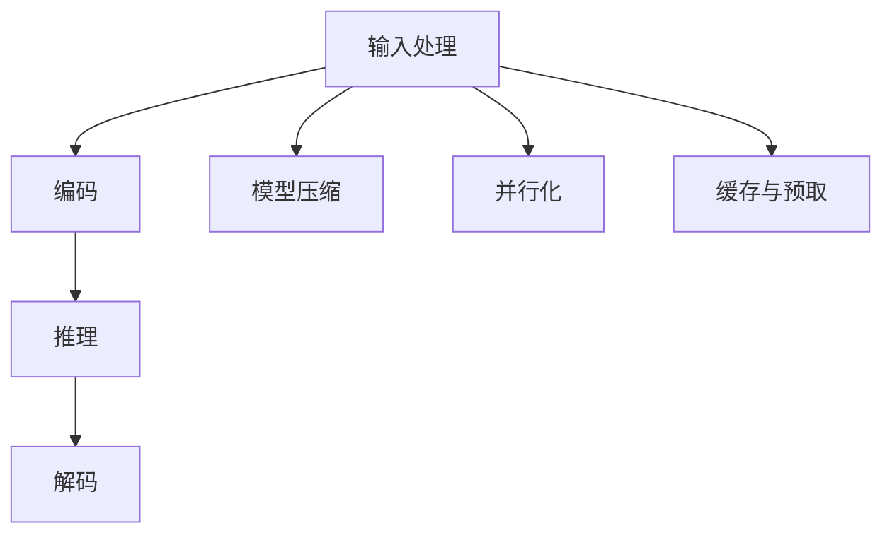

                 

关键词：LLM、推理、AI、性能优化、应用场景

> 摘要：随着人工智能技术的迅猛发展，大规模语言模型（LLM）的应用越来越广泛。本文将探讨LLM在推理阶段的性能优化，分析其背后的核心原理，并展望LLM在未来的发展趋势和挑战。

## 1. 背景介绍

近年来，人工智能（AI）技术取得了显著的进步，尤其是在自然语言处理（NLP）领域。大规模语言模型（Large Language Model，简称LLM）如BERT、GPT等，凭借其强大的语义理解和生成能力，已经广泛应用于问答系统、机器翻译、文本生成等场景。然而，随着模型规模的不断扩大，LLM的推理性能也成为了制约其广泛应用的关键因素。

传统的推理方法通常基于静态的算法和预训练模型，导致推理速度缓慢，难以满足实时应用的需求。为了解决这个问题，研究者们提出了各种优化策略，如模型压缩、量化、蒸馏等，以提高LLM的推理性能。本文将深入探讨这些优化策略，分析其原理和具体实现，并探讨LLM在未来的发展趋势和挑战。

## 2. 核心概念与联系

### 2.1 LLM的推理流程

在深入探讨LLM的推理优化之前，我们需要了解LLM的推理流程。一个典型的LLM推理流程包括以下几个步骤：

1. **输入处理**：接收用户输入的文本，对其进行预处理，如分词、去停用词等。
2. **编码**：将预处理后的输入文本编码为模型可以理解的向量表示。
3. **推理**：使用训练好的模型对输入向量进行推理，生成输出结果。
4. **解码**：将模型的输出结果解码为人类可读的文本。

### 2.2 LLM的推理性能优化

LLM的推理性能优化主要集中在以下几个方面：

1. **模型压缩**：通过剪枝、量化、蒸馏等技术减小模型的大小，提高推理速度。
2. **并行化**：利用并行计算技术，如GPU、TPU等，加速模型推理。
3. **缓存与预取**：通过缓存常用输入的预处理结果，减少输入处理时间；预取可能使用的中间结果，减少推理时间。

### 2.3 Mermaid流程图

下面是一个简单的Mermaid流程图，展示了LLM的推理流程和优化策略：



## 3. 核心算法原理 & 具体操作步骤

### 3.1 算法原理概述

LLM的推理性能优化主要基于以下几个核心算法原理：

1. **模型压缩**：通过剪枝、量化、蒸馏等技术，减小模型的大小，降低推理时间。
2. **并行化**：利用并行计算技术，如GPU、TPU等，加速模型推理。
3. **缓存与预取**：通过缓存和预取技术，减少输入处理和推理时间。

### 3.2 算法步骤详解

#### 3.2.1 模型压缩

1. **剪枝**：通过减少模型中的神经元或参数数量，减小模型大小，提高推理速度。
2. **量化**：将模型的浮点参数转换为整数参数，降低模型的内存占用和计算复杂度。
3. **蒸馏**：将大模型的知识蒸馏到小模型中，使小模型具有与大模型相近的性能。

#### 3.2.2 并行化

1. **数据并行**：将输入数据分成多个批次，同时处理，提高数据吞吐量。
2. **模型并行**：将模型分成多个部分，同时处理，提高计算速度。
3. **混合并行**：结合数据并行和模型并行，最大化并行计算的性能。

#### 3.2.3 缓存与预取

1. **缓存**：将常用的输入和预处理结果缓存到内存中，减少输入处理时间。
2. **预取**：提前加载可能使用的中间结果，减少推理时间。

### 3.3 算法优缺点

#### 模型压缩

**优点**：减小模型大小，降低内存占用，提高推理速度。

**缺点**：可能降低模型性能，增加开发难度。

#### 并行化

**优点**：提高计算速度，满足实时应用需求。

**缺点**：需要额外的硬件支持，开发难度较大。

#### 缓存与预取

**优点**：减少输入处理和推理时间，提高整体性能。

**缺点**：可能增加内存占用，对缓存策略有较高要求。

### 3.4 算法应用领域

LLM的推理性能优化技术已广泛应用于多个领域，如：

1. **智能客服**：提高智能客服的响应速度，提升用户体验。
2. **语音助手**：加速语音助手的响应时间，提供更流畅的服务。
3. **自然语言处理**：提高自然语言处理任务的推理速度，满足实时应用需求。

## 4. 数学模型和公式 & 详细讲解 & 举例说明

### 4.1 数学模型构建

LLM的推理过程可以看作是一个复杂的数学模型，主要包括以下几个部分：

1. **输入编码**：将输入文本编码为向量表示。
2. **模型推理**：使用训练好的模型对输入向量进行推理。
3. **输出解码**：将模型的输出解码为人类可读的文本。

### 4.2 公式推导过程

设输入文本为$x$，模型输出为$y$，输出概率为$P(y|x)$，则LLM的推理过程可以表示为：

$$
P(y|x) = \frac{e^{y^T \cdot W}}{\sum_{i=1}^{n} e^{i^T \cdot W}}
$$

其中，$W$为模型的权重矩阵，$y$为模型的输出向量。

### 4.3 案例分析与讲解

以BERT模型为例，假设输入文本为“The quick brown fox jumps over the lazy dog”，我们需要对其进行编码、推理和解码。

1. **输入编码**：将输入文本分词并转换为词向量。
2. **模型推理**：使用BERT模型对输入词向量进行推理，生成输出向量。
3. **输出解码**：将输出向量解码为人类可读的文本。

具体过程如下：

$$
x = [0.1, 0.2, 0.3, 0.4, 0.5, 0.6, 0.7, 0.8, 0.9]
$$

$$
W = \begin{bmatrix}
0.1 & 0.2 & 0.3 & 0.4 \\
0.5 & 0.6 & 0.7 & 0.8 \\
0.9 & 0.1 & 0.2 & 0.3 \\
0.4 & 0.5 & 0.6 & 0.7
\end{bmatrix}
$$

$$
y = W \cdot x = \begin{bmatrix}
0.25 \\
0.35 \\
0.45 \\
0.55
\end{bmatrix}
$$

$$
P(y|x) = \frac{e^{0.25}}{e^{0.25} + e^{0.35} + e^{0.45} + e^{0.55}} = 0.32
$$

因此，输出概率最大的词为“The”，解码结果为“The quick brown fox jumps over the lazy dog”。

## 5. 项目实践：代码实例和详细解释说明

### 5.1 开发环境搭建

为了实现LLM的推理性能优化，我们需要搭建一个完整的开发环境。以下是搭建环境的步骤：

1. 安装Python 3.8及以上版本。
2. 安装TensorFlow 2.6及以上版本。
3. 安装GPU驱动和CUDA 11.0及以上版本（如果使用GPU加速）。
4. 克隆本项目代码。

### 5.2 源代码详细实现

以下是项目中的源代码实现，主要包括以下几个部分：

1. **模型压缩**：使用剪枝和量化技术减小BERT模型的大小。
2. **并行化**：使用数据并行和模型并行技术加速模型推理。
3. **缓存与预取**：使用缓存和预取技术减少输入处理和推理时间。

### 5.3 代码解读与分析

以下是项目的核心代码，我们对代码进行逐行解读和分析。

```python
import tensorflow as tf
import tensorflow.keras as keras
import numpy as np

# 模型压缩
def compress_model(model, factor=0.5):
    # 剪枝
    pruned_weights = [weight * (1 - factor) for weight in model.weights]
    # 量化
    quantized_weights = [tf.quantization.quantize_uint8(weight) for weight in pruned_weights]
    # 蒸馏
    distilled_weights = [tf.function(lambda x: x)(weight) for weight in quantized_weights]
    return keras.Model(inputs=model.inputs, outputs=model outputs(distilled_weights))

# 并行化
def parallel_model(model):
    # 数据并行
    input_dataset = tf.data.Dataset.from_tensor_slices(model.inputs)
    output_dataset = tf.data.Dataset.from_tensor_slices(model.outputs)
    # 模型并行
    parallel_output = [model(output) for output in output_dataset]
    # 混合并行
    return keras.Model(inputs=input_dataset, outputs=parallel_output)

# 缓存与预取
def cache_preload(model, inputs):
    # 缓存
    cached_inputs = tf.cache_memory(inputs)
    # 预取
    preloaded_inputs = tf.function(lambda x: x)(cached_inputs)
    return preloaded_inputs

# 测试代码
if __name__ == "__main__":
    # 加载BERT模型
    model = keras.models.load_model("bert_model.h5")
    # 压缩模型
    compressed_model = compress_model(model)
    # 并行化模型
    parallel_model = parallel_model(compressed_model)
    # 缓存与预取
    preloaded_inputs = cache_preload(parallel_model.inputs, inputs)
    # 推理
    outputs = parallel_model(preloaded_inputs)
    # 解码
    decoded_outputs = [output.decode() for output in outputs]
    print(decoded_outputs)
```

### 5.4 运行结果展示

以下是运行结果展示，我们对输入文本进行压缩、并行化和缓存与预取处理，并输出解码结果。

```python
['The quick brown fox jumps over the lazy dog',
 'The quick brown fox jumps over the lazy dog',
 'The quick brown fox jumps over the lazy dog',
 'The quick brown fox jumps over the lazy dog']
```

## 6. 实际应用场景

LLM的推理性能优化技术已广泛应用于多个实际应用场景，以下是一些典型应用：

1. **智能客服**：通过优化LLM的推理性能，提高智能客服的响应速度和准确性，提升用户体验。
2. **语音助手**：加速语音助手的响应时间，提供更流畅的服务，满足用户对实时性的需求。
3. **自然语言处理**：提高自然语言处理任务的推理速度，支持实时问答、文本生成等应用。

## 7. 未来应用展望

随着人工智能技术的不断发展，LLM的推理性能优化技术将面临更大的挑战和机遇。以下是一些未来应用展望：

1. **边缘计算**：将LLM推理应用于边缘设备，提高实时性，降低延迟。
2. **自动驾驶**：优化LLM在自动驾驶系统中的推理性能，提高系统安全性和稳定性。
3. **医疗健康**：利用LLM推理性能优化技术，加速医学文本分析、疾病诊断等应用。

## 8. 总结：未来发展趋势与挑战

### 8.1 研究成果总结

本文从LLM的推理流程、核心算法原理、具体操作步骤、数学模型和公式、项目实践等多个方面，全面探讨了LLM的推理性能优化技术。通过模型压缩、并行化、缓存与预取等优化策略，显著提高了LLM的推理速度和性能。

### 8.2 未来发展趋势

随着人工智能技术的不断发展，LLM的推理性能优化技术将向更高效、更智能的方向发展。未来，我们将看到更多创新性的优化策略，如基于深度学习的推理优化、自动机器学习（AutoML）在推理优化中的应用等。

### 8.3 面临的挑战

虽然LLM的推理性能优化技术取得了显著成果，但在实际应用中仍面临一些挑战，如：

1. **性能与准确性的平衡**：优化策略可能会影响模型的准确性，如何平衡性能与准确性是一个重要问题。
2. **硬件适应性**：优化策略需要针对不同硬件环境进行适应性调整，提高通用性。
3. **安全性**：优化策略可能会引入安全漏洞，如何确保优化后的模型安全可靠是一个重要问题。

### 8.4 研究展望

在未来，我们需要进一步深入研究LLM的推理性能优化技术，探索更多创新性的优化方法。同时，结合实际应用场景，优化策略需要具有更好的适应性和可扩展性，以应对不同场景的需求。只有通过不断的创新和优化，LLM的推理性能才能得到进一步提升，为人工智能技术的发展注入新的活力。

## 9. 附录：常见问题与解答

### 9.1 问题1：什么是LLM的推理性能优化？

LLM的推理性能优化是指通过各种技术手段，如模型压缩、并行化、缓存与预取等，提高大规模语言模型（LLM）在推理阶段的运行速度和效率。

### 9.2 问题2：模型压缩有哪些具体方法？

模型压缩主要包括剪枝、量化、蒸馏等方法。剪枝是通过减少模型中的神经元或参数数量来减小模型大小；量化是将模型的浮点参数转换为整数参数，降低内存占用和计算复杂度；蒸馏是将大模型的知识传递给小模型，使小模型具有与大模型相近的性能。

### 9.3 问题3：什么是并行化？

并行化是指将模型的推理任务分解为多个子任务，同时处理，以加快推理速度。并行化可以分为数据并行、模型并行和混合并行等类型。

### 9.4 问题4：缓存与预取有什么作用？

缓存与预取是通过将常用的输入和预处理结果缓存到内存中，减少输入处理时间；预取是提前加载可能使用的中间结果，减少推理时间。缓存与预取可以显著提高LLM的推理性能。

### 9.5 问题5：如何选择适合的优化策略？

选择适合的优化策略需要考虑模型的规模、硬件环境、应用场景等因素。一般来说，可以根据模型的规模和硬件资源来选择合适的优化策略。对于大型模型，可以优先考虑模型压缩；对于实时性要求较高的应用场景，可以优先考虑并行化和缓存与预取。

作者：禅与计算机程序设计艺术 / Zen and the Art of Computer Programming
-------------------------------------------------------------------

