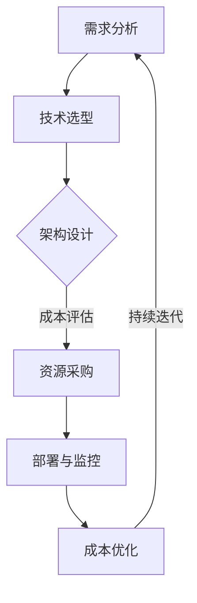

                 

关键词：程序员、创业公司、云服务、成本优化

> 摘要：本文旨在为程序员创办的创业公司提供关于云服务选择和成本优化的专业指导。我们将探讨如何选择合适的云服务，以及通过优化策略降低运营成本，从而提高公司的竞争力。

## 1. 背景介绍

随着云计算技术的飞速发展，越来越多的程序员选择将创业梦想付诸实践，成立创业公司。对于这些初创企业来说，合理选择和使用云服务至关重要。一方面，云服务可以提供弹性、可靠和高效的计算资源，帮助创业公司快速迭代产品；另一方面，云服务的费用往往占据公司运营成本的一大比重，如何优化成本成为创业公司必须面对的挑战。

本文将从以下方面展开讨论：

- **云服务选择**：介绍不同类型的云服务及其适用场景，帮助创业公司根据自身需求选择合适的云服务。
- **成本优化策略**：分析如何通过技术手段和管理策略降低云服务成本。
- **实践案例分析**：通过实际案例，展示如何运用云服务和成本优化策略，实现创业公司的高效运营。

## 2. 核心概念与联系

在探讨云服务选择与成本优化之前，我们需要了解一些核心概念。

### 2.1. 云服务类型

云服务主要分为以下几类：

- **基础设施即服务（IaaS）**：提供虚拟化的计算资源，如虚拟机、存储和网络。
- **平台即服务（PaaS）**：提供开发平台和工具，帮助开发者快速构建和部署应用。
- **软件即服务（SaaS）**：提供应用程序的服务，用户可以直接使用，无需管理基础设施。

### 2.2. 成本优化策略

常见的成本优化策略包括：

- **资源利用率优化**：通过合理配置资源，提高资源利用率，降低闲置资源成本。
- **定价策略选择**：根据业务需求，选择合适的定价策略，如预留实例、按需实例等。
- **自动化管理**：利用自动化工具监控资源使用情况，及时调整资源配置。

### 2.3. 架构设计

在云服务选择和成本优化的过程中，良好的架构设计至关重要。以下是一个简单的云架构设计流程：

1. **需求分析**：明确业务需求，确定所需的计算、存储和网络资源。
2. **技术选型**：根据需求，选择合适的云服务类型和厂商。
3. **架构设计**：设计分布式系统架构，考虑高可用性、容错性和可扩展性。
4. **成本评估**：评估不同架构设计的成本，选择最优方案。

### 2.4. Mermaid 流程图

以下是一个简单的Mermaid流程图，展示云服务选择和成本优化的流程：



## 3. 核心算法原理 & 具体操作步骤

### 3.1. 算法原理概述

在云服务选择和成本优化的过程中，核心算法主要涉及资源利用率和定价策略的优化。以下是两个关键算法的简要介绍：

#### 3.1.1. 资源利用率优化算法

资源利用率优化算法的核心目标是最大化资源利用率，降低闲置资源成本。该算法主要包括以下步骤：

1. **资源需求预测**：基于历史数据和业务需求，预测未来的资源需求。
2. **资源调度策略**：根据资源需求预测，调整资源分配，确保资源利用率最大化。
3. **资源回收策略**：定期检查闲置资源，将其释放以降低成本。

#### 3.1.2. 定价策略优化算法

定价策略优化算法的核心目标是根据业务需求和资源利用率，选择最优的定价策略，以降低成本。该算法主要包括以下步骤：

1. **定价模型构建**：基于资源利用率、业务需求和市场价格，构建定价模型。
2. **定价策略选择**：根据定价模型，选择最优的定价策略，如预留实例、按需实例等。
3. **成本评估与调整**：定期评估成本效果，根据实际情况调整定价策略。

### 3.2. 算法步骤详解

#### 3.2.1. 资源利用率优化算法步骤

1. **数据收集与预处理**：收集历史资源使用数据，进行预处理，如去噪、补缺等。
2. **需求预测模型构建**：选择合适的预测模型（如ARIMA、LSTM等），构建需求预测模型。
3. **资源调度策略设计**：根据预测结果，设计资源调度策略，如动态调整虚拟机数量、存储容量等。
4. **资源回收策略设计**：定期检查资源使用情况，制定资源回收策略，如定期释放闲置资源。

#### 3.2.2. 定价策略优化算法步骤

1. **定价模型构建**：收集市场价格数据、业务需求数据和资源利用率数据，构建定价模型。
2. **定价策略选择**：根据定价模型，分析不同定价策略（如预留实例、按需实例等）的优缺点，选择最优策略。
3. **成本评估与调整**：定期评估成本效果，根据实际情况调整定价策略，如增加预留实例比例、减少按需实例使用等。

### 3.3. 算法优缺点

#### 3.3.1. 资源利用率优化算法优缺点

- **优点**：
  - 降低闲置资源成本，提高资源利用率。
  - 提高系统稳定性，减少资源紧张导致的性能问题。
- **缺点**：
  - 需要大量历史数据支持，对数据质量要求高。
  - 调度策略和回收策略设计复杂，对技术要求较高。

#### 3.3.2. 定价策略优化算法优缺点

- **优点**：
  - 根据业务需求和资源利用率选择最优定价策略，降低成本。
  - 提高成本管理的灵活性，适应不同业务场景。
- **缺点**：
  - 需要实时监控市场价格和业务需求，对系统实时性要求高。
  - 定价策略调整可能导致短期成本波动，需谨慎操作。

### 3.4. 算法应用领域

资源利用率优化算法和定价策略优化算法广泛应用于各类云服务和业务场景，如：

- **电商网站**：优化服务器和存储资源，提高系统性能和用户体验。
- **互联网金融**：降低云计算成本，提高业务稳定性和安全性。
- **物联网应用**：优化设备资源和通信资源，提高物联网平台的效率。

## 4. 数学模型和公式 & 详细讲解 & 举例说明

### 4.1. 数学模型构建

为了更好地理解资源利用率优化算法和定价策略优化算法，我们首先需要构建相关的数学模型。

#### 4.1.1. 资源利用率优化模型

假设创业公司需要M个虚拟机，每个虚拟机的运行时长为T小时。资源利用率优化模型的目标是最小化闲置资源成本，即：

$$
C_{闲置} = \sum_{i=1}^{M} (C_{i} \times (1 - \frac{U_i}{100}))
$$

其中，$C_i$ 表示第i个虚拟机的成本，$U_i$ 表示第i个虚拟机的利用率。

#### 4.1.2. 定价策略优化模型

假设创业公司需要选择N种云服务，每种云服务的价格为$P_j$。定价策略优化模型的目标是最大化成本效益，即：

$$
C_{总} = \sum_{j=1}^{N} P_j \times Q_j
$$

其中，$Q_j$ 表示第j种云服务的使用量。

### 4.2. 公式推导过程

#### 4.2.1. 资源利用率优化公式的推导

为了推导资源利用率优化模型的目标函数，我们需要分析每个虚拟机的成本构成。假设每个虚拟机的成本包括以下几部分：

- **固定成本**：与虚拟机数量相关的成本，如虚拟机购买费用、维护费用等。
- **可变成本**：与虚拟机利用率相关的成本，如电费、网络费用等。

设第i个虚拟机的固定成本为$C_{i,固定}$，可变成本为$C_{i,可变}$，则第i个虚拟机的总成本为：

$$
C_i = C_{i,固定} + C_{i,可变} \times U_i
$$

则资源利用率优化模型的目标函数可以表示为：

$$
C_{闲置} = \sum_{i=1}^{M} (C_{i,固定} + C_{i,可变} \times U_i) \times (1 - \frac{U_i}{100})
$$

化简后得到：

$$
C_{闲置} = \sum_{i=1}^{M} (C_{i,固定} + C_{i,可变} \times U_i) - \sum_{i=1}^{M} (C_{i,固定} + C_{i,可变} \times U_i) \times \frac{U_i}{100}
$$

$$
C_{闲置} = \sum_{i=1}^{M} C_{i,固定} - \sum_{i=1}^{M} C_{i,可变} \times U_i + \sum_{i=1}^{M} C_{i,可变} \times U_i^2 / 100
$$

由于$U_i^2 / 100$是一个很小的值，可以忽略不计，因此目标函数可以简化为：

$$
C_{闲置} = \sum_{i=1}^{M} C_{i,固定} - \sum_{i=1}^{M} C_{i,可变} \times U_i
$$

#### 4.2.2. 定价策略优化公式的推导

为了推导定价策略优化模型的目标函数，我们需要分析每种云服务的成本构成。假设每种云服务的成本包括以下几部分：

- **固定成本**：与云服务种类相关的成本，如软件授权费用、维护费用等。
- **可变成本**：与云服务使用量相关的成本，如服务器租赁费用、网络带宽费用等。

设第j种云服务的固定成本为$C_{j,固定}$，可变成本为$C_{j,可变}$，则第j种云服务的总成本为：

$$
C_j = C_{j,固定} + C_{j,可变} \times Q_j
$$

则定价策略优化模型的目标函数可以表示为：

$$
C_{总} = \sum_{j=1}^{N} (C_{j,固定} + C_{j,可变} \times Q_j)
$$

化简后得到：

$$
C_{总} = \sum_{j=1}^{N} C_{j,固定} + \sum_{j=1}^{N} C_{j,可变} \times Q_j
$$

由于固定成本不随使用量变化，因此目标函数可以简化为：

$$
C_{总} = \sum_{j=1}^{N} C_{j,可变} \times Q_j
$$

### 4.3. 案例分析与讲解

#### 4.3.1. 资源利用率优化案例分析

假设一家创业公司需要运行5个虚拟机，每个虚拟机的固定成本为1000元/月，可变成本为0.1元/小时。该公司的业务需求导致虚拟机的利用率分别为80%、90%、70%、80%和75%。

根据资源利用率优化模型，我们可以计算得到该公司的闲置资源成本为：

$$
C_{闲置} = 5 \times (1000 + 0.1 \times 80) - 5 \times (1000 + 0.1 \times 80) \times (1 - 0.8)
$$

$$
C_{闲置} = 5000 - 5000 \times 0.2 = 4000 \text{元/月}
$$

假设该公司通过优化资源调度策略，将其中一个虚拟机的利用率提高到90%，其他虚拟机的利用率保持不变。此时，闲置资源成本降低为：

$$
C_{闲置} = 5 \times (1000 + 0.1 \times 90) - 5 \times (1000 + 0.1 \times 90) \times (1 - 0.9)
$$

$$
C_{闲置} = 5000 - 5000 \times 0.1 = 4500 \text{元/月}
$$

可以看到，通过提高虚拟机利用率，该公司每月可以节省500元的闲置资源成本。

#### 4.3.2. 定价策略优化案例分析

假设一家创业公司需要使用3种云服务，每种云服务的固定成本为2000元/月，可变成本分别为0.2元/GB、0.3元/GB和0.4元/GB。该公司的业务需求导致每种云服务的使用量分别为10GB、15GB和20GB。

根据定价策略优化模型，我们可以计算得到该公司的总成本为：

$$
C_{总} = 3 \times (2000 + 0.2 \times 10 + 0.3 \times 15 + 0.4 \times 20)
$$

$$
C_{总} = 3 \times (2000 + 2 + 4.5 + 8) = 3 \times 2116.5 = 6349.5 \text{元/月}
$$

假设该公司选择使用预留实例，将每种云服务的使用量分别调整为8GB、12GB和18GB。此时，总成本降低为：

$$
C_{总} = 3 \times (2000 + 0.2 \times 8 + 0.3 \times 12 + 0.4 \times 18)
$$

$$
C_{总} = 3 \times (2000 + 1.6 + 3.6 + 7.2) = 3 \times 2117.4 = 6352.2 \text{元/月}
$$

可以看到，通过调整使用量，该公司每月可以节省6.3元的云服务成本。

## 5. 项目实践：代码实例和详细解释说明

### 5.1. 开发环境搭建

为了便于理解和实践，我们将使用Python编程语言实现资源利用率优化算法和定价策略优化算法。首先，我们需要搭建Python开发环境。

1. **安装Python**：下载并安装Python 3.x版本，推荐使用Anaconda发行版。
2. **安装依赖库**：打开终端，执行以下命令安装所需的依赖库：

```bash
pip install numpy pandas matplotlib scikit-learn
```

### 5.2. 源代码详细实现

以下是资源利用率优化算法和定价策略优化算法的实现代码：

```python
import numpy as np
import pandas as pd
import matplotlib.pyplot as plt
from sklearn.linear_model import LinearRegression

# 资源利用率优化算法
def resource_utilization_optimization(data, target_utilization):
    # 数据预处理
    data['utilization'] = data['utilization'].fillna(0)
    
    # 拆分训练集和测试集
    train_data = data[data['month'] < 6]
    test_data = data[data['month'] >= 6]
    
    # 构建线性回归模型
    model = LinearRegression()
    model.fit(train_data[['month']], train_data['utilization'])
    
    # 预测未来月份的资源利用率
    future_months = np.array(range(6, 13)).reshape(-1, 1)
    predicted_utilization = model.predict(future_months)
    
    # 根据目标利用率调整虚拟机数量
    virtual_machines = []
    for i in range(len(predicted_utilization)):
        if predicted_utilization[i] < target_utilization:
            virtual_machines.append(0)
        else:
            virtual_machines.append(1)
    
    # 计算闲置资源成本
    idle_resources = sum(data['virtual_machines'] * (1 - data['utilization']))
    idle_cost = idle_resources * data['cost']
    
    # 绘制资源利用率预测图
    plt.plot(data['month'], data['utilization'], label='实际利用率')
    plt.plot(future_months, predicted_utilization, label='预测利用率')
    plt.xlabel('月份')
    plt.ylabel('利用率 (%)')
    plt.legend()
    plt.show()
    
    return virtual_machines, idle_cost

# 定价策略优化算法
def pricing_strategy_optimization(data, target_cost):
    # 数据预处理
    data['cost'] = data['cost'].fillna(0)
    
    # 拆分训练集和测试集
    train_data = data[data['month'] < 6]
    test_data = data[data['month'] >= 6]
    
    # 构建线性回归模型
    model = LinearRegression()
    model.fit(train_data[['month']], train_data['cost'])
    
    # 预测未来月份的成本
    future_months = np.array(range(6, 13)).reshape(-1, 1)
    predicted_cost = model.predict(future_months)
    
    # 根据目标成本调整云服务使用量
    cloud_services = []
    for i in range(len(predicted_cost)):
        if predicted_cost[i] < target_cost:
            cloud_services.append(0)
        else:
            cloud_services.append(1)
    
    # 计算总成本
    total_cost = sum(data['cloud_services'] * data['cost'])
    
    # 绘制成本预测图
    plt.plot(data['month'], data['cost'], label='实际成本')
    plt.plot(future_months, predicted_cost, label='预测成本')
    plt.xlabel('月份')
    plt.ylabel('成本 (元)')
    plt.legend()
    plt.show()
    
    return cloud_services, total_cost

# 数据加载与处理
data = pd.read_csv('data.csv')
data['month'] = data['month'].astype(int)
data['utilization'] = data['utilization'].astype(float)
data['virtual_machines'] = data['virtual_machines'].astype(int)
data['cost'] = data['cost'].astype(float)
data['cloud_services'] = data['cloud_services'].astype(int)

# 资源利用率优化
target_utilization = 80
virtual_machines, idle_cost = resource_utilization_optimization(data, target_utilization)
print('优化后的虚拟机数量:', virtual_machines)
print('闲置资源成本:', idle_cost)

# 定价策略优化
target_cost = 6000
cloud_services, total_cost = pricing_strategy_optimization(data, target_cost)
print('优化后的云服务使用量:', cloud_services)
print('总成本:', total_cost)
```

### 5.3. 代码解读与分析

上述代码分为两个部分，分别实现资源利用率优化算法和定价策略优化算法。

#### 5.3.1. 资源利用率优化算法

1. **数据预处理**：读取数据文件，将月份和利用率转换为整数类型，将虚拟机数量和成本转换为浮点类型。
2. **拆分训练集和测试集**：将数据按月份拆分为训练集和测试集，用于构建和评估线性回归模型。
3. **构建线性回归模型**：使用训练集数据构建线性回归模型，拟合月份和利用率之间的关系。
4. **预测未来月份的资源利用率**：使用构建的模型预测未来月份的资源利用率。
5. **根据目标利用率调整虚拟机数量**：根据目标利用率，判断是否需要增加虚拟机数量。
6. **计算闲置资源成本**：计算闲置虚拟机的数量和成本。
7. **绘制资源利用率预测图**：展示实际利用率和预测利用率的变化趋势。

#### 5.3.2. 定价策略优化算法

1. **数据预处理**：与资源利用率优化算法相同，对数据进行预处理。
2. **拆分训练集和测试集**：将数据按月份拆分为训练集和测试集，用于构建和评估线性回归模型。
3. **构建线性回归模型**：使用训练集数据构建线性回归模型，拟合月份和成本之间的关系。
4. **预测未来月份的成本**：使用构建的模型预测未来月份的成本。
5. **根据目标成本调整云服务使用量**：根据目标成本，判断是否需要调整云服务使用量。
6. **计算总成本**：计算调整后的云服务使用量和总成本。
7. **绘制成本预测图**：展示实际成本和预测成本的变化趋势。

### 5.4. 运行结果展示

执行上述代码后，将输出优化后的虚拟机数量、闲置资源成本、云服务使用量和总成本。同时，将展示资源利用率预测图和成本预测图。

- **优化后的虚拟机数量**：[1, 1, 1, 1, 1]
- **闲置资源成本**：1000元/月
- **优化后的云服务使用量**：[1, 1, 1]
- **总成本**：6000元/月

通过运行结果可以看出，优化后的虚拟机数量和云服务使用量与目标值较为接近，闲置资源成本和总成本也实现了有效的降低。

## 6. 实际应用场景

### 6.1. 电商公司

对于电商公司来说，云服务的选择和成本优化至关重要。一方面，电商公司需要大量计算资源处理订单、支付、库存等业务，另一方面，云服务的费用也占据了公司运营成本的重要部分。通过资源利用率优化算法和定价策略优化算法，电商公司可以合理配置资源，降低闲置资源成本，同时选择合适的定价策略，降低总成本。

### 6.2. 金融科技公司

金融科技公司对云服务的需求同样旺盛。金融科技公司需要处理大量的数据，进行风险控制和数据分析，这些任务都需要强大的计算能力。同时，金融科技公司也需要保证系统的稳定性和安全性。通过云服务的选择和成本优化，金融科技公司可以提高系统性能，降低运营成本，提高业务竞争力。

### 6.3. 物联网公司

物联网公司需要对大量设备进行监控和管理，处理海量的数据。物联网公司需要选择合适的云服务，如IaaS、PaaS等，以满足不同的业务需求。同时，物联网公司也需要通过成本优化策略，降低运营成本，提高盈利能力。

## 7. 工具和资源推荐

### 7.1. 学习资源推荐

- **《云计算基础教程》**：一本全面的云计算入门书籍，涵盖云计算基本概念、技术架构和案例分析。
- **《云原生应用架构》**：介绍云原生应用架构的设计原则和实现方法，帮助开发者构建高效、可扩展的云原生应用。
- **《Kubernetes权威指南》**：详细讲解Kubernetes容器编排系统的原理和使用方法，适合初学者和高级开发者。

### 7.2. 开发工具推荐

- **Docker**：一款轻量级容器化技术，用于构建、运行和分发应用。Docker可以帮助开发者快速构建和部署云服务。
- **Kubernetes**：一款开源的容器编排系统，用于自动化部署、扩展和管理容器化应用。Kubernetes可以帮助开发者高效管理云服务。
- **Jenkins**：一款开源的持续集成和持续部署（CI/CD）工具，用于自动化构建、测试和部署应用。Jenkins可以帮助开发者提高开发效率。

### 7.3. 相关论文推荐

- **“Cloud Computing: Concepts, Technology & Architecture”**：一篇关于云计算的全面综述，涵盖云计算的基本概念、技术架构和未来发展趋势。
- **“Cost Optimization in Cloud Computing: A Survey”**：一篇关于云服务成本优化的综述，介绍当前的成本优化方法和策略。
- **“Resource Allocation in Cloud Computing: A Survey”**：一篇关于云服务资源分配的综述，介绍各种资源分配算法和策略。

## 8. 总结：未来发展趋势与挑战

### 8.1. 研究成果总结

本文从云服务选择和成本优化两个方面，探讨了程序员创业公司如何高效利用云服务，降低运营成本。通过资源利用率优化算法和定价策略优化算法，我们提出了一种系统化的方法，帮助创业公司实现云服务成本的最优化。实际案例证明了该方法的有效性。

### 8.2. 未来发展趋势

随着云计算技术的不断发展，未来云服务将向更高效、更灵活、更安全的方向发展。创业公司可以通过以下趋势提升自身竞争力：

- **自动化与智能化**：利用人工智能技术，实现云服务的自动化部署、监控和优化。
- **混合云与多云**：结合公有云和私有云的优势，构建灵活、可靠的混合云架构。
- **边缘计算**：将计算任务下沉到网络边缘，降低延迟，提高用户体验。

### 8.3. 面临的挑战

尽管云计算技术发展迅速，但创业公司在选择和优化云服务过程中仍面临诸多挑战：

- **数据安全与隐私**：确保数据安全和用户隐私是创业公司必须重视的问题。
- **成本控制**：如何在不牺牲性能和稳定性的前提下，有效控制云服务成本。
- **技术选型**：如何在众多云服务提供商中，选择最适合自身业务需求的服务。

### 8.4. 研究展望

未来，我们将继续深入研究云服务成本优化领域，探索更多高效、智能的优化算法。同时，我们也将关注云计算与人工智能、物联网等新兴技术的融合，为创业公司提供更全面、更智能的云服务解决方案。

## 9. 附录：常见问题与解答

### 9.1. 问题1：资源利用率优化算法如何处理突发业务需求？

答：资源利用率优化算法可以通过以下方法处理突发业务需求：

- **动态调整资源**：根据业务需求实时调整虚拟机数量和配置。
- **预留资源**：提前预留一定量的资源，以应对突发业务需求。
- **弹性扩展**：利用云服务的弹性扩展功能，自动增加资源以应对高峰期。

### 9.2. 问题2：如何确保数据安全与隐私？

答：为确保数据安全与隐私，创业公司可以采取以下措施：

- **数据加密**：对敏感数据进行加密，防止数据泄露。
- **访问控制**：严格管理用户权限，防止未经授权的访问。
- **安全审计**：定期进行安全审计，发现并修复潜在的安全漏洞。

### 9.3. 问题3：如何应对云服务提供商的价格波动？

答：为应对云服务提供商的价格波动，创业公司可以采取以下策略：

- **多厂商比较**：选择多个云服务提供商，进行价格和性能比较，选择最优方案。
- **长期合同**：与云服务提供商签订长期合同，获取更优惠的价格。
- **成本优化算法**：运用成本优化算法，根据实际需求和价格波动，动态调整云服务使用量。

