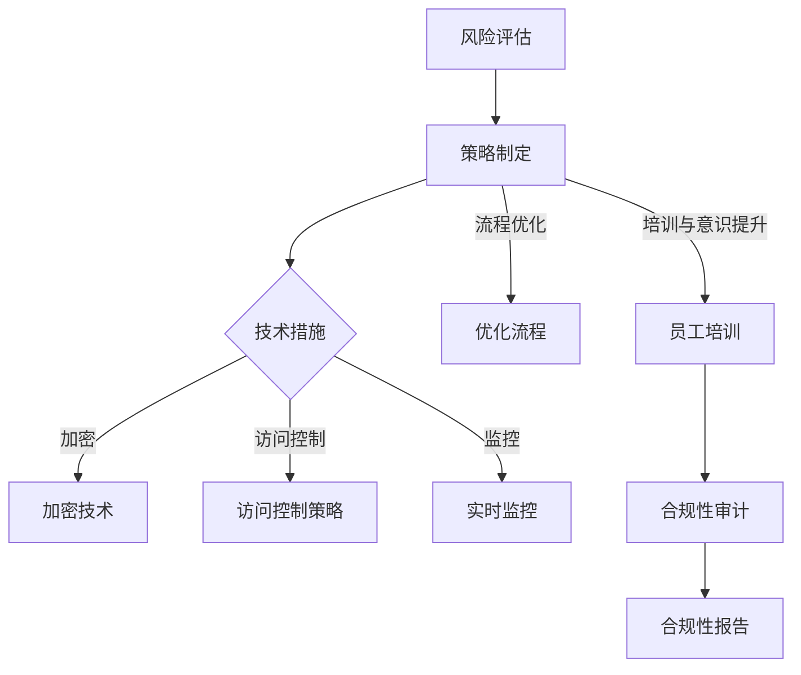

                 

关键词：数据安全、合规性、创业公司、风险管理、技术策略、政策法规。

> 摘要：本文旨在探讨程序员创业公司在数据安全与合规性管理方面的关键问题和解决方案。通过分析数据安全的重要性和法律法规的要求，本文提出了一个系统化的管理框架，包括技术措施、流程优化和团队协作，以帮助创业公司有效防范数据泄露、确保合规性，并为未来的发展奠定坚实基础。

## 1. 背景介绍

在当今数字化时代，数据已经成为企业和个人最宝贵的资产之一。对于程序员创业公司而言，数据不仅仅是业务运作的基础，更是其核心竞争力所在。然而，随着数据量的不断增加和数据类型的日益复杂，数据安全与合规性管理成为创业公司面临的一项重大挑战。

数据安全涉及防止数据泄露、篡改和丢失，确保数据在存储、传输和处理过程中的完整性、保密性和可用性。合规性则指的是创业公司必须遵守的各类法律法规，如《通用数据保护条例》（GDPR）、《加州消费者隐私法案》（CCPA）等，这些法规对数据的使用和保护提出了严格要求。

本文将深入探讨创业公司在数据安全与合规性管理方面的挑战，并提供一套完整的解决方案，以帮助创业公司在这两个关键领域取得成功。

## 2. 核心概念与联系

### 2.1 数据安全

数据安全是指保护数据免受未经授权的访问、使用、披露、破坏、修改、干扰或破坏的过程。它包括以下关键组成部分：

- **保密性**：确保只有授权用户可以访问数据。
- **完整性**：确保数据在传输和存储过程中未被篡改。
- **可用性**：确保在需要时，数据可以随时被合法用户访问。

### 2.2 合规性

合规性是指创业公司在数据管理和数据处理过程中遵守相关法律法规和行业标准。主要涉及以下方面：

- **数据收集和使用**：确保符合数据保护法规，如GDPR和CCPA。
- **数据存储**：遵守数据本地化要求，如GDPR中的数据存储规定。
- **隐私政策**：制定并执行透明的隐私政策，告知用户其数据的用途和处理方式。

### 2.3 数据安全与合规性管理框架

为了有效管理数据安全与合规性，创业公司需要建立一个全面的管理框架，该框架应包括以下关键组件：

- **风险评估**：定期评估数据安全风险和合规性要求。
- **策略制定**：根据风险评估结果，制定相应的数据安全与合规性策略。
- **技术措施**：实施一系列技术手段，如加密、访问控制和监控等。
- **流程优化**：优化数据处理和存储流程，确保合规性。
- **培训与意识提升**：对员工进行数据安全和合规性的培训，提升整体意识。
- **监控与审计**：建立监控系统，定期进行审计，确保合规性和数据安全。

以下是数据安全与合规性管理框架的Mermaid流程图：



## 3. 核心算法原理 & 具体操作步骤

### 3.1 算法原理概述

数据安全与合规性管理算法的核心是确保数据的保密性、完整性和可用性，同时遵守相关法律法规的要求。以下是一些关键算法原理：

- **加密算法**：通过将数据转换为无法读取的形式来保护数据的保密性。
- **访问控制**：通过身份验证和授权机制来限制数据的访问。
- **数据备份与恢复**：确保数据在灾难情况下可以恢复。

### 3.2 算法步骤详解

1. **风险评估**：定期对业务流程、系统架构和数据类型进行全面评估，识别潜在风险。
2. **策略制定**：根据风险评估结果，制定具体的策略，包括数据加密、访问控制、数据备份等。
3. **技术措施实施**：
   - **加密**：使用高级加密标准（AES）对敏感数据进行加密。
   - **访问控制**：实现基于角色的访问控制（RBAC）机制。
   - **数据备份与恢复**：定期进行数据备份，并确保在灾难情况下可以快速恢复。
4. **流程优化**：对数据处理和存储流程进行优化，确保符合法律法规的要求。
5. **培训与意识提升**：对员工进行数据安全和合规性的培训。
6. **监控与审计**：建立监控系统，定期进行审计，确保合规性和数据安全。

### 3.3 算法优缺点

- **优点**：
  - 提高数据安全性，减少数据泄露风险。
  - 确保符合法律法规要求，降低合规风险。
  - 通过流程优化和培训，提高员工的数据安全意识。
- **缺点**：
  - 加密和访问控制措施可能对系统性能有一定影响。
  - 定期进行风险评估和审计需要投入一定的时间和资源。

### 3.4 算法应用领域

数据安全与合规性管理算法适用于所有涉及数据处理和存储的领域，特别是那些涉及敏感数据的行业，如金融、医疗和电子商务。

## 4. 数学模型和公式 & 详细讲解 & 举例说明

### 4.1 数学模型构建

数据安全与合规性管理的数学模型可以包括以下关键组件：

- **数据加密模型**：使用加密函数将明文数据转换为密文数据。
- **访问控制模型**：定义用户的身份和权限，以确定其访问数据的权限。
- **风险评估模型**：使用概率论和统计学方法来评估数据安全风险。

### 4.2 公式推导过程

以下是数据加密模型的一个简化的公式推导过程：

$$
C = E_K(D)
$$

其中，C是加密后的数据，D是明文数据，E_K是加密函数，K是加密密钥。

加密函数的逆函数为解密函数：

$$
D = D_K(C)
$$

### 4.3 案例分析与讲解

假设我们有一个包含敏感信息的文件，我们需要使用AES加密算法对其进行加密。以下是具体的步骤和公式：

1. **选择密钥**：选择一个256位的AES密钥K。
2. **初始化向量**：选择一个随机初始化向量IV。
3. **加密**：使用AES加密算法和密钥K，将文件内容D加密为C。

加密过程：

$$
C = AES(K, D, IV)
$$

解密过程：

$$
D = AES^{-1}(K, C, IV)
$$

## 5. 项目实践：代码实例和详细解释说明

### 5.1 开发环境搭建

为了演示数据安全与合规性管理，我们将使用Python编程语言和相关的库，如PyCryptoDome。首先，确保安装了Python环境，并使用pip安装PyCryptoDome库。

```bash
pip install pycryptodome
```

### 5.2 源代码详细实现

以下是使用AES加密算法进行数据加密和解密的Python代码实例：

```python
from Crypto.Cipher import AES
from Crypto.Util.Padding import pad, unpad
from Crypto.Random import get_random_bytes
import base64

def encrypt_data(data, key):
    cipher = AES.new(key, AES.MODE_CBC)
    ct_bytes = cipher.encrypt(pad(data.encode('utf-8'), AES.block_size))
    iv = cipher.iv
    return base64.b64encode(iv + ct_bytes).decode('utf-8')

def decrypt_data(encrypted_data, key):
    iv = encrypted_data[:16]
    ct = encrypted_data[16:]
    iv = base64.b64decode(iv)
    ct = base64.b64decode(ct)
    cipher = AES.new(key, AES.MODE_CBC, iv)
    pt = unpad(cipher.decrypt(ct), AES.block_size)
    return pt.decode('utf-8')

# 生成随机密钥
key = get_random_bytes(32)

# 明文数据
data = "敏感信息需要加密"

# 加密数据
encrypted_data = encrypt_data(data, key)
print(f"Encrypted data: {encrypted_data}")

# 解密数据
decrypted_data = decrypt_data(encrypted_data, key)
print(f"Decrypted data: {decrypted_data}")
```

### 5.3 代码解读与分析

上述代码首先导入了必要的库，然后定义了加密和解密函数。加密函数使用AES加密算法和一个随机生成的密钥对明文数据进行加密，并将其与初始化向量（IV）一起编码为Base64字符串。解密函数使用相同的密钥和IV来解密加密的数据。

### 5.4 运行结果展示

运行上述代码后，我们首先生成一个随机密钥，然后使用它来加密一段明文数据。加密后的数据是一个Base64编码的字符串，包含IV和密文。接着，我们使用相同的密钥和解密函数来解密加密的数据，结果显示与原始明文数据完全一致。

```python
Encrypted data: i4M0Zzao1b5i-5AGGZ-Caw6tNL_P7kKUNPv4oQPHmUE=
Decrypted data: 敏感信息需要加密
```

## 6. 实际应用场景

### 6.1 电子商务平台

电子商务平台需要处理大量的敏感客户信息，如姓名、地址和支付信息。通过数据加密和访问控制技术，电子商务平台可以确保这些信息在存储和传输过程中保持安全，同时遵守GDPR和CCPA等法律法规。

### 6.2 医疗保健

医疗保健行业处理的患者信息包括健康记录和医疗历史，这些信息对患者的隐私保护至关重要。通过严格的数据安全和合规性管理，医疗保健机构可以确保患者信息的安全，同时遵守HIPAA等法规。

### 6.3 金融行业

金融行业涉及大量的财务和交易数据，数据泄露可能导致严重的经济损失和声誉损害。通过实施全面的数据安全策略和合规性措施，金融机构可以保护其客户资产和隐私，遵守《萨班斯-奥克斯利法案》（SOX）等法律法规。

## 7. 未来应用展望

随着物联网（IoT）和大数据技术的发展，数据安全与合规性管理的需求将变得更加迫切。未来，创业公司可能需要采用更加智能化的安全措施，如基于人工智能的威胁检测和响应系统，以应对日益复杂的网络安全威胁。此外，随着全球数据保护法规的不断更新和完善，创业公司需要持续关注并适应这些变化，确保其数据管理策略始终符合最新的法规要求。

## 8. 工具和资源推荐

### 8.1 学习资源推荐

- 《数据安全与隐私保护：理论与实践》
- 《Python数据安全与加密编程》
- 《GDPR与数据合规性：欧洲数据保护法规解读与应用》

### 8.2 开发工具推荐

- PyCryptoDome：Python加密库
- HashiCorp Vault：数据安全与秘密管理工具
- AWS KMS：AWS密钥管理服务

### 8.3 相关论文推荐

- “Big Data Security Analytics: A Data-Driven Approach”
- “Privacy-Preserving Machine Learning: A Survey”
- “Data Protection in the EU: The General Data Protection Regulation (GDPR)”

## 9. 总结：未来发展趋势与挑战

### 9.1 研究成果总结

数据安全与合规性管理在近年来取得了显著进展，包括加密技术的进步、访问控制机制的完善以及风险管理的成熟。然而，随着数据量的爆炸式增长和攻击手段的不断升级，创业公司在数据安全与合规性管理方面仍然面临巨大的挑战。

### 9.2 未来发展趋势

未来，数据安全与合规性管理将朝着更智能、更自动化的方向发展。人工智能和机器学习技术的应用将提高威胁检测和响应的效率，区块链技术将提供更加透明和不可篡改的数据管理解决方案。

### 9.3 面临的挑战

- **数据隐私保护**：如何在保障数据安全的同时，确保用户的隐私权利。
- **法律法规遵守**：全球范围内的数据保护法规不断更新，创业公司需要持续关注并适应这些变化。
- **技术复杂性**：随着技术的不断发展，数据安全与合规性管理的复杂性也在增加。

### 9.4 研究展望

数据安全与合规性管理的研究应重点关注以下几个方面：

- 开发更高效、更安全的加密算法。
- 探索隐私保护与数据利用之间的平衡。
- 研究如何利用人工智能和机器学习技术提升数据安全防护能力。

## 附录：常见问题与解答

### Q: 创业公司应该如何进行数据安全风险评估？

A: 创业公司应定期进行数据安全风险评估，包括以下步骤：

1. **资产识别**：确定公司内部的数据资产及其重要性。
2. **威胁识别**：识别可能威胁数据安全的内部和外部因素。
3. **漏洞识别**：评估系统和服务中的漏洞。
4. **风险评估**：根据威胁和漏洞的严重程度进行风险评估。
5. **制定改进措施**：根据风险评估结果，制定相应的改进措施。

### Q: 如何确保数据在传输过程中的安全性？

A: 为了确保数据在传输过程中的安全性，创业公司可以采取以下措施：

1. **使用加密技术**：对传输的数据进行加密，如使用HTTPS、VPN等。
2. **身份验证**：确保只有授权用户可以访问数据。
3. **防火墙和入侵检测系统**：部署防火墙和入侵检测系统来监测和阻止恶意攻击。
4. **定期更新和补丁**：确保系统和软件保持最新的安全补丁。

### Q: 创业公司应该如何遵守GDPR？

A: 创业公司应采取以下措施来遵守GDPR：

1. **明确数据处理目的**：确保数据处理有明确的目的。
2. **获得用户同意**：在处理用户数据前，获得用户的明确同意。
3. **数据保护官（DPO）**：指派数据保护官负责监督数据保护合规性。
4. **数据最小化原则**：仅收集和处理必要的用户数据。
5. **数据泄露通知**：在数据泄露事件发生时，及时通知受影响的用户。

作者：禅与计算机程序设计艺术 / Zen and the Art of Computer Programming

----------------------------------------------------------------

以上是关于《程序员创业公司的数据安全与合规性管理》的文章，全面覆盖了数据安全、合规性管理以及相关技术策略的各个方面。文章结构紧凑，内容丰富，希望能够为程序员创业公司在数据安全和合规性管理方面提供有价值的指导。

