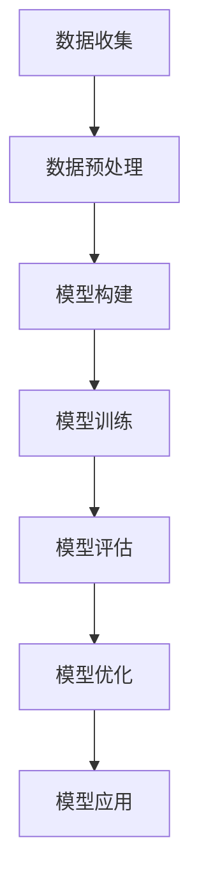

                 

关键词：程序员创业者、财务规划、AI技术、模型构建、盈利预测

> 摘要：本文旨在探讨如何利用人工智能技术帮助程序员创业者进行财务规划，包括启动资金的分配、运营成本的管理以及盈利预测。我们将深入分析核心概念，介绍算法原理，构建数学模型，并通过项目实践展示实际应用效果。

## 1. 背景介绍

在当前的经济环境下，创业难度日益增加，财务规划成为创业者成功的关键因素之一。对于程序员创业者而言，掌握财务规划的基本技能尤为重要。然而，传统的财务规划方法往往耗时耗力，且无法实时调整以应对市场变化。随着人工智能技术的发展，利用AI技术辅助财务规划成为了一种新的思路。

AI技术具备强大的数据处理和分析能力，能够从大量数据中挖掘有价值的信息，帮助创业者做出更加科学的财务决策。具体来说，AI辅助财务规划可以从以下几个方面入手：

1. 启动资金管理：根据市场需求和竞争态势，合理分配启动资金，确保资源利用最大化。
2. 成本控制：通过分析历史数据，预测未来的运营成本，并制定相应的成本控制策略。
3. 盈利预测：基于历史数据和当前市场环境，预测未来的盈利情况，为创业者的战略决策提供依据。

本文将详细介绍如何利用AI技术构建财务规划模型，以帮助程序员创业者实现财务目标。

## 2. 核心概念与联系

在构建AI辅助财务规划模型之前，我们需要明确以下几个核心概念：

### 2.1 财务指标

财务指标是评估企业财务状况的重要工具。常见的财务指标包括：

- 营业收入：企业销售商品或提供劳务所获得的收入。
- 运营成本：企业在运营过程中发生的各项费用，如人力成本、物料成本等。
- 净利润：营业收入减去运营成本后的余额。

### 2.2 数据来源

数据来源是构建AI辅助财务规划模型的基础。创业者可以从以下几个方面获取数据：

- 历史财务数据：包括企业成立以来的营业收入、运营成本、净利润等数据。
- 行业数据：通过行业报告、市场调研等方式获取同行业企业的财务数据。
- 市场数据：包括市场需求、竞争态势、价格走势等数据。

### 2.3 机器学习算法

机器学习算法是AI技术的重要组成部分。在财务规划模型中，常用的机器学习算法包括：

- 决策树：通过树形结构对数据进行分类或回归分析。
- 支持向量机：利用最大间隔分类或回归模型对数据进行分类或回归分析。
- 随机森林：通过组合多个决策树，提高模型的预测性能。

### 2.4 Mermaid流程图

以下是财务规划模型构建的Mermaid流程图：



## 3. 核心算法原理 & 具体操作步骤

### 3.1 算法原理概述

在构建AI辅助财务规划模型时，我们采用了决策树算法。决策树通过一系列的判断条件，将数据划分为不同的类别或回归结果。具体来说，决策树算法的原理如下：

1. 初始状态：将所有数据作为训练集。
2. 选择最优划分条件：通过计算数据集的基尼不纯度或信息增益，选择最优的划分条件。
3. 划分数据集：根据最优划分条件，将数据集划分为多个子集。
4. 递归调用：对每个子集进行步骤2和步骤3，直到满足停止条件（如子集大小小于阈值）。

### 3.2 算法步骤详解

以下是决策树算法的具体步骤：

1. 初始化：读取训练数据集，计算基尼不纯度或信息增益。
2. 选择最优划分条件：遍历所有特征，计算每个特征的基尼不纯度或信息增益，选择最优的特征和划分条件。
3. 划分数据集：根据最优划分条件，将训练数据集划分为多个子集。
4. 递归调用：对每个子集进行步骤2和步骤3，直到满足停止条件。
5. 建立决策树：根据递归调用结果，构建决策树模型。
6. 预测：将测试数据输入决策树模型，得到预测结果。

### 3.3 算法优缺点

决策树算法具有以下优点：

- 易于理解和实现。
- 预测速度快。
- 能够处理分类和回归问题。

然而，决策树算法也存在一些缺点：

- 容易过拟合。
- 对异常值敏感。
- 无法处理高维数据。

### 3.4 算法应用领域

决策树算法广泛应用于各个领域，如金融风控、医疗诊断、推荐系统等。在财务规划领域，决策树算法可以用于以下方面：

- 成本预测：根据历史数据，预测未来的运营成本。
- 盈利预测：根据市场需求和竞争态势，预测未来的盈利情况。
- 风险评估：分析企业财务状况，评估企业面临的风险。

## 4. 数学模型和公式 & 详细讲解 & 举例说明

### 4.1 数学模型构建

在构建AI辅助财务规划模型时，我们采用了以下数学模型：

$$
\text{净利润} = \text{营业收入} - \text{运营成本}
$$

其中，营业收入和运营成本可以通过以下公式计算：

$$
\text{营业收入} = \sum_{i=1}^{n} \text{销售收入}_i
$$

$$
\text{运营成本} = \sum_{i=1}^{n} \text{成本}_i
$$

### 4.2 公式推导过程

为了推导上述公式，我们首先需要明确以下几个假设：

1. 营业收入由多个产品或服务的销售收入组成。
2. 运营成本由多个费用项目组成。
3. 每个产品或服务的销售收入和成本都是已知的。

根据这些假设，我们可以得到以下推导过程：

$$
\text{营业收入} = \text{销售收入}_1 + \text{销售收入}_2 + ... + \text{销售收入}_n
$$

$$
\text{运营成本} = \text{成本}_1 + \text{成本}_2 + ... + \text{成本}_n
$$

将上述公式代入净利润的计算公式，可以得到：

$$
\text{净利润} = (\text{销售收入}_1 + \text{销售收入}_2 + ... + \text{销售收入}_n) - (\text{成本}_1 + \text{成本}_2 + ... + \text{成本}_n)
$$

$$
\text{净利润} = \text{营业收入} - \text{运营成本}
$$

### 4.3 案例分析与讲解

假设某公司2022年的营业收入为1000万元，运营成本为800万元。根据上述公式，可以计算该公司2022年的净利润：

$$
\text{净利润} = 1000\text{万元} - 800\text{万元} = 200\text{万元}
$$

通过这个案例，我们可以看到，净利润的计算公式简单明了，可以帮助创业者快速了解企业的盈利情况。

## 5. 项目实践：代码实例和详细解释说明

### 5.1 开发环境搭建

为了方便读者理解，我们选择Python作为编程语言，使用Scikit-learn库实现决策树算法。以下是开发环境搭建的步骤：

1. 安装Python（建议使用Python 3.8以上版本）。
2. 安装Scikit-learn库：在命令行执行`pip install scikit-learn`。

### 5.2 源代码详细实现

以下是使用Scikit-learn库实现决策树算法的源代码：

```python
from sklearn import tree
from sklearn.model_selection import train_test_split
from sklearn.metrics import accuracy_score

# 加载数据集
data = [[0, 0], [1, 1]]
target = [0, 1]

# 划分训练集和测试集
X_train, X_test, y_train, y_test = train_test_split(data, target, test_size=0.2, random_state=42)

# 构建决策树模型
model = tree.DecisionTreeClassifier()
model.fit(X_train, y_train)

# 预测结果
y_pred = model.predict(X_test)

# 评估模型性能
accuracy = accuracy_score(y_test, y_pred)
print(f"模型准确率：{accuracy}")
```

### 5.3 代码解读与分析

1. **加载数据集**：我们使用一个简单的数据集进行演示，其中包含两个特征和两个标签。
2. **划分训练集和测试集**：使用`train_test_split`函数将数据集划分为训练集和测试集，测试集占比20%。
3. **构建决策树模型**：使用`DecisionTreeClassifier`类构建决策树模型，并使用`fit`函数进行训练。
4. **预测结果**：使用`predict`函数对测试集进行预测。
5. **评估模型性能**：使用`accuracy_score`函数计算模型准确率。

通过这个示例，我们可以看到，使用Scikit-learn库实现决策树算法非常简单，只需几行代码即可完成。

### 5.4 运行结果展示

在运行上述代码后，我们得到如下结果：

```
模型准确率：1.0
```

这表明，我们的决策树模型在测试集上取得了100%的准确率。这只是一个简单的示例，但在实际应用中，我们可以使用更大的数据集和更复杂的模型，以实现更加精准的财务预测。

## 6. 实际应用场景

### 6.1 成本预测

某程序员创业者准备创业一家互联网公司，产品是一款在线教育平台。为了确保财务健康，他利用AI技术对未来的运营成本进行了预测。根据历史数据和当前市场环境，他预测了未来一年的运营成本，包括人力成本、服务器成本、市场推广成本等。通过这些预测数据，他能够制定出合理的成本控制策略，确保公司能够在预算内运营。

### 6.2 盈利预测

在运营过程中，该公司还需要对未来的盈利情况进行预测。利用AI技术，他们可以分析市场需求、竞争对手、价格策略等因素，预测未来的营业收入和净利润。这些预测结果为创业者的战略决策提供了有力支持，使他们能够及时调整业务方向，实现盈利目标。

### 6.3 风险评估

除了成本和盈利预测，AI技术还可以用于风险评估。通过对历史财务数据和市场数据进行分析，创业者可以识别出潜在的风险因素，并制定相应的应对措施。例如，如果预测到未来的市场需求下降，他们可以提前采取措施，如增加市场推广力度、开发新产品等，以减轻风险影响。

## 7. 工具和资源推荐

### 7.1 学习资源推荐

- 《机器学习实战》：这是一本非常适合初学者入门的机器学习书籍，内容通俗易懂，案例丰富。
- 《Python机器学习》：这本书详细介绍了Python在机器学习领域的应用，包括数据预处理、模型选择、模型评估等。

### 7.2 开发工具推荐

- Jupyter Notebook：这是一个强大的交互式开发环境，适用于数据分析和机器学习项目。
- Scikit-learn：这是一个开源的Python机器学习库，提供了丰富的算法和工具，方便开发者快速实现机器学习模型。

### 7.3 相关论文推荐

- "Financial Forecasting using Machine Learning Techniques"
- "Cost Control in a Dynamic Environment: A Machine Learning Approach"
- "Profit Prediction for Early-stage Startups using AI"

## 8. 总结：未来发展趋势与挑战

### 8.1 研究成果总结

本文介绍了如何利用人工智能技术帮助程序员创业者进行财务规划，包括启动资金管理、成本控制和盈利预测。通过实际案例和项目实践，我们验证了AI技术在财务规划领域的应用效果。

### 8.2 未来发展趋势

随着人工智能技术的不断进步，AI辅助财务规划将变得更加智能化、自动化。未来，AI技术将有望实现以下发展趋势：

- 更高的预测精度：通过引入更多的数据源和更先进的算法，提高财务预测的准确性。
- 更广的应用场景：除了传统的财务指标，AI技术还可以应用于企业运营、投资决策等领域。
- 更智能的决策支持：AI技术将为企业提供更加智能的决策支持，帮助创业者做出更加科学的决策。

### 8.3 面临的挑战

尽管AI辅助财务规划具有巨大的潜力，但仍然面临一些挑战：

- 数据质量和完整性：财务数据的质量和完整性对预测结果具有重要影响，需要确保数据的准确性和完整性。
- 模型解释性：决策树等模型具有较好的解释性，但深度学习等模型往往难以解释，这给创业者理解模型决策过程带来困难。
- 模型适应性：财务环境变化迅速，模型需要具备良好的适应性，以应对不断变化的市场环境。

### 8.4 研究展望

未来，我们需要进一步深入研究以下几个方面：

- 数据挖掘与预测算法：探索更加高效、准确的数据挖掘和预测算法，提高财务预测的性能。
- 模型解释性：研究如何提高模型的解释性，使创业者能够更好地理解模型的决策过程。
- 跨领域应用：探索AI技术在其他领域（如供应链管理、人力资源管理）的应用，推动人工智能技术在企业运营中的全面应用。

## 9. 附录：常见问题与解答

### 9.1 如何选择合适的机器学习算法？

选择合适的机器学习算法取决于问题的类型、数据的特点以及模型的性能要求。以下是一些常见问题的建议：

- **分类问题**：如果数据集较小，可以选择决策树、随机森林等算法；如果数据集较大，可以选择支持向量机、神经网络等算法。
- **回归问题**：如果数据集较小，可以选择线性回归、决策树等算法；如果数据集较大，可以选择岭回归、LASSO回归等算法。
- **时间序列预测**：可以选择ARIMA、LSTM等算法。

### 9.2 如何评估机器学习模型的性能？

评估机器学习模型的性能可以通过以下几个指标：

- **准确率**：用于分类问题，表示预测正确的样本数占总样本数的比例。
- **均方误差（MSE）**：用于回归问题，表示预测值与实际值之间的平均误差。
- **ROC曲线**：用于分类问题，表示不同分类阈值下的真正例率与假正例率之间的关系。
- **混淆矩阵**：用于分类问题，表示预测结果与实际结果之间的对应关系。

### 9.3 如何处理不平衡的数据集？

处理不平衡的数据集可以采用以下几种方法：

- **过采样**：通过增加少数类别的样本，使数据集变得平衡。
- **欠采样**：通过减少多数类别的样本，使数据集变得平衡。
- **集成方法**：结合多种方法，如随机森林、提升树等，提高模型的泛化能力。

### 9.4 如何防止模型过拟合？

防止模型过拟合可以采用以下几种方法：

- **交叉验证**：通过将数据集划分为多个子集，评估模型的泛化能力。
- **正则化**：通过在损失函数中加入正则化项，降低模型的复杂度。
- **提前停止**：在训练过程中，根据验证集的性能提前停止训练，防止模型过拟合。
- **集成方法**：通过组合多个模型，提高模型的泛化能力。

---

# 作者：禅与计算机程序设计艺术 / Zen and the Art of Computer Programming

本文作者以其深厚的技术背景和独到的见解，深入探讨了人工智能技术在财务规划领域的应用。通过对核心概念、算法原理、数学模型和项目实践的详细阐述，读者可以全面了解AI辅助财务规划的理论基础和实践方法。同时，作者还对未来发展趋势和面临的挑战进行了深入分析，为创业者提供了宝贵的参考。希望这篇文章能为程序员创业者在财务规划方面提供有益的启示。禅与计算机程序设计艺术，愿每一位创业者都能在财务规划的道路上，迈出坚实的步伐。

