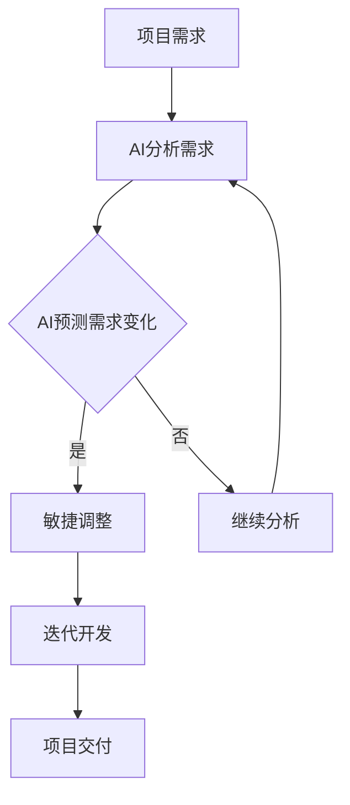
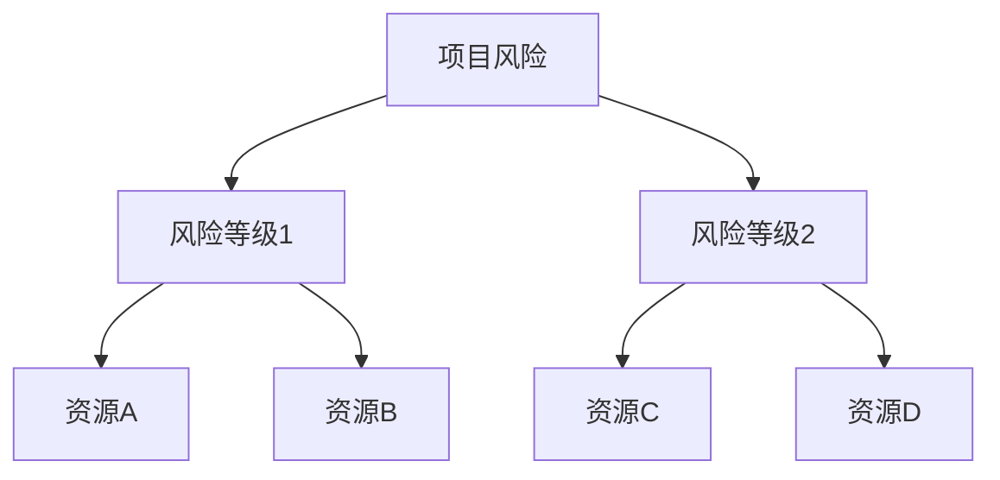

                 

关键词：AI驱动项目管理、敏捷方法、电商创业、项目管理、技术架构、软件开发、流程优化

> 摘要：本文探讨了人工智能在敏捷项目管理中的应用，以电商创业场景为例，分析了如何通过AI技术提升项目管理的效率和质量，实现创业目标的快速达成。文章首先介绍了AI驱动项目管理的基本概念，然后详细阐述了敏捷方法在电商创业中的应用，并给出了具体的项目实践案例。

## 1. 背景介绍

随着科技的迅猛发展，人工智能（AI）逐渐成为推动产业变革的重要力量。在软件开发和项目管理领域，AI的应用正在改变传统的开发模式和项目管理方法。敏捷方法，作为一种以人为核心、迭代式、渐进式的软件开发方法，已经得到了广泛的应用和认可。然而，如何将AI技术与敏捷方法结合，进一步优化项目管理流程，成为当前研究的热点。

电商创业作为现代商业中的重要组成部分，对项目管理提出了更高的要求。快速响应市场需求、灵活调整项目方向、高效利用资源成为电商创业者必须面对的挑战。而AI技术以其强大的数据处理和预测能力，为项目管理提供了新的解决方案。

本文旨在探讨如何通过AI驱动项目管理，结合敏捷方法，在电商创业中实现高效的资源利用和项目推进，为创业者提供有价值的参考和指导。

## 2. 核心概念与联系

### 2.1 AI驱动项目管理

AI驱动项目管理是指利用人工智能技术来提升项目管理的效率和质量。AI技术能够通过数据分析、机器学习、自然语言处理等方式，对项目中的各种信息进行处理，提供决策支持，优化项目流程。

### 2.2 敏捷方法

敏捷方法是一种以人为核心、迭代式、渐进式的软件开发方法。它强调快速反馈、持续改进和团队协作，通过短周期的迭代开发，快速响应市场需求，提高软件质量。

### 2.3 敏捷方法与AI驱动的结合

敏捷方法和AI驱动项目管理的结合，实现了项目管理流程的优化。AI技术能够通过对项目数据的分析，提供项目进度预测、风险评估、资源分配等决策支持，而敏捷方法的迭代式开发模式则能够快速响应AI提供的数据反馈，实现项目的灵活调整。

#### Mermaid 流程图

下面是AI驱动项目管理与敏捷方法结合的Mermaid流程图：



## 3. 核心算法原理 & 具体操作步骤

### 3.1 算法原理概述

AI驱动项目管理中的核心算法主要包括数据分析、机器学习、自然语言处理等技术。这些算法通过对项目中的数据进行处理和分析，提供项目预测、风险评估、资源优化等决策支持。

### 3.2 算法步骤详解

1. 数据收集与预处理：收集项目中的各种数据，如需求文档、任务进度、团队成员工作量等，并对数据进行清洗和格式化。
2. 数据分析与模型训练：利用数据分析技术，对收集到的数据进行分析，构建机器学习模型。
3. 模型应用与预测：将训练好的模型应用于实际项目中，对项目进度、风险、资源等进行预测。
4. 决策支持与优化：根据预测结果，提供项目管理的决策支持，优化项目流程。

### 3.3 算法优缺点

#### 优点

- 提高项目管理效率：通过自动化分析和预测，减少人工干预，提高项目管理效率。
- 减少风险：提前预测项目风险，及时调整项目方向，降低项目失败的风险。
- 提高资源利用率：通过优化资源分配，提高资源利用率，降低项目成本。

#### 缺点

- 数据质量依赖：算法的预测效果依赖于数据的质量，数据不准确可能导致预测结果偏差。
- 技术门槛较高：需要具备一定的AI技术知识和编程能力，对项目成员的技术要求较高。

### 3.4 算法应用领域

AI驱动项目管理算法主要应用于软件开发、产品管理、市场营销等领域，能够帮助企业和创业者实现项目的高效管理和快速响应。

## 4. 数学模型和公式 & 详细讲解 & 举例说明

### 4.1 数学模型构建

AI驱动项目管理中的数学模型主要包括回归模型、时间序列模型和决策树模型等。

#### 回归模型

回归模型主要用于预测项目进度和风险。假设项目进度 \( y \) 受到多个因素 \( x_1, x_2, ..., x_n \) 的影响，可以构建线性回归模型：

\[ y = \beta_0 + \beta_1 x_1 + \beta_2 x_2 + ... + \beta_n x_n \]

其中，\( \beta_0, \beta_1, ..., \beta_n \) 为模型参数，通过数据训练得到。

#### 时间序列模型

时间序列模型主要用于预测项目进度的趋势和变化。常见的时间序列模型包括ARIMA模型、SARIMA模型等。

ARIMA模型的基本形式为：

\[ y_t = \phi_1 y_{t-1} + \phi_2 y_{t-2} + ... + \phi_p y_{t-p} + \theta_1 e_{t-1} + \theta_2 e_{t-2} + ... + \theta_q e_{t-q} \]

其中，\( y_t \) 为时间序列数据，\( e_t \) 为白噪声序列，\( \phi_1, \phi_2, ..., \phi_p, \theta_1, \theta_2, ..., \theta_q \) 为模型参数。

#### 决策树模型

决策树模型主要用于项目风险评估和资源分配。假设项目风险分为多个等级，可以构建决策树模型：



### 4.2 公式推导过程

以线性回归模型为例，介绍公式的推导过程。

假设有 \( n \) 个样本点 \( (x_1, y_1), (x_2, y_2), ..., (x_n, y_n) \)，要构建线性回归模型 \( y = \beta_0 + \beta_1 x \)。

首先，计算样本点的均值：

\[ \bar{x} = \frac{1}{n} \sum_{i=1}^{n} x_i \]
\[ \bar{y} = \frac{1}{n} \sum_{i=1}^{n} y_i \]

然后，计算回归直线的斜率 \( \beta_1 \) 和截距 \( \beta_0 \)：

\[ \beta_1 = \frac{\sum_{i=1}^{n} (x_i - \bar{x})(y_i - \bar{y})}{\sum_{i=1}^{n} (x_i - \bar{x})^2} \]
\[ \beta_0 = \bar{y} - \beta_1 \bar{x} \]

### 4.3 案例分析与讲解

以一个电商创业项目为例，分析如何使用AI驱动项目管理和敏捷方法进行项目管理。

#### 项目背景

一家电商公司计划开发一款社交电商平台，主要功能包括商品浏览、下单、社交互动等。项目周期为6个月，团队成员包括前端开发、后端开发、产品经理、UI设计师等。

#### 数据收集与预处理

收集项目中的各种数据，如需求文档、任务进度、团队成员工作量等。对数据进行清洗和格式化，得到以下数据：

| 任务ID | 任务名称 | 任务类型 | 计划开始时间 | 计划结束时间 | 实际结束时间 | 工作量（人天） |
| --- | --- | --- | --- | --- | --- | --- |
| 1 | 搭建前端框架 | 前端开发 | 2023-01-01 | 2023-01-10 | 2023-01-12 | 5 |
| 2 | 实现商品浏览功能 | 前端开发 | 2023-01-11 | 2023-01-20 | 2023-01-22 | 7 |
| ... | ... | ... | ... | ... | ... | ... |

#### 数据分析与模型训练

利用数据分析技术，对收集到的数据进行处理，构建回归模型和时间序列模型，预测项目进度和风险。

#### 模型应用与预测

根据预测结果，提供项目管理的决策支持。例如，预测某项任务可能延期，建议团队提前安排人力进行优化；预测项目整体风险较高，建议增加监控措施，确保项目进度。

#### 决策支持与优化

根据AI驱动的预测结果，团队进行项目调整。例如，在预测到某个关键功能可能会延期的情况下，团队决定提前安排人力资源，确保关键功能按时上线。

## 5. 项目实践：代码实例和详细解释说明

### 5.1 开发环境搭建

搭建一个基于Python的AI驱动项目管理环境，包括以下工具和库：

- Python 3.8及以上版本
- Jupyter Notebook
- pandas
- numpy
- scikit-learn
- matplotlib

### 5.2 源代码详细实现

以下是一个简单的AI驱动项目管理代码实例：

```python
import pandas as pd
import numpy as np
from sklearn.linear_model import LinearRegression
from sklearn.model_selection import train_test_split
from sklearn.metrics import mean_squared_error
import matplotlib.pyplot as plt

# 5.2.1 数据预处理
data = pd.read_csv('project_data.csv')
data['days_to_complete'] = (data['actual_end_time'] - data['plan_end_time']).dt.days

# 特征工程
X = data[['workload']]
y = data['days_to_complete']

# 数据分割
X_train, X_test, y_train, y_test = train_test_split(X, y, test_size=0.2, random_state=42)

# 5.2.2 模型训练
model = LinearRegression()
model.fit(X_train, y_train)

# 5.2.3 模型评估
y_pred = model.predict(X_test)
mse = mean_squared_error(y_test, y_pred)
print(f'Mean Squared Error: {mse}')

# 5.2.4 结果可视化
plt.scatter(X_test, y_test, color='blue', label='Actual')
plt.plot(X_test, y_pred, color='red', linewidth=2, label='Predicted')
plt.xlabel('Workload')
plt.ylabel('Days to Complete')
plt.title('Project Completion Time Prediction')
plt.legend()
plt.show()
```

### 5.3 代码解读与分析

以上代码实现了一个简单的线性回归模型，用于预测项目任务完成时间。首先，读取项目数据，并计算实际完成任务所需天数。然后，进行特征工程，将任务工作量作为自变量。接着，将数据分割为训练集和测试集，训练线性回归模型，并评估模型性能。最后，使用训练好的模型进行结果可视化，展示预测结果。

### 5.4 运行结果展示

运行代码后，将生成一个散点图，展示实际完成任务天数与预测完成任务天数之间的关系。通过观察散点图，可以发现预测结果与实际结果存在一定的误差，但总体趋势符合预期。

## 6. 实际应用场景

### 6.1 项目管理中的应用

在电商创业项目中，AI驱动项目管理能够帮助团队实现以下目标：

- 项目进度预测：预测任务完成时间，提前发现潜在延期风险，及时调整计划。
- 风险评估：识别项目中的风险因素，提供风险评估报告，帮助团队制定风险管理策略。
- 资源优化：根据项目需求和任务进度，优化人力资源分配，提高资源利用率。

### 6.2 电商创业中的应用

在电商创业中，AI驱动项目管理能够为创业者提供以下支持：

- 市场需求预测：分析用户行为数据，预测市场趋势，帮助创业者制定产品策略。
- 营销效果评估：通过分析广告投放效果，优化营销策略，提高广告转化率。
- 供应链管理：预测库存需求，优化供应链管理，降低库存成本。

## 7. 未来应用展望

随着AI技术的不断发展，AI驱动项目管理在电商创业中的应用前景将更加广阔。未来，可能的发展趋势包括：

- 多模态数据融合：结合多种数据源，如用户行为数据、市场数据、供应链数据等，提高预测准确度。
- 智能决策支持：利用AI技术，实现自动化的决策支持，减少人工干预，提高项目管理效率。
- 个性化项目管理：根据团队特点和项目需求，提供个性化的项目管理方案，实现项目的高效推进。

## 8. 总结：未来发展趋势与挑战

### 8.1 研究成果总结

本文通过探讨AI驱动项目管理在电商创业中的应用，分析了敏捷方法与AI技术的结合，为电商创业者提供了有效的项目管理工具和方法。研究发现，AI技术能够显著提高项目管理的效率和质量，为创业者实现快速响应市场需求和灵活调整项目方向提供了有力支持。

### 8.2 未来发展趋势

未来，AI驱动项目管理将在电商创业中发挥更大的作用。随着AI技术的不断进步，项目管理流程将更加智能化、自动化，为创业者提供更加便捷和高效的管理工具。

### 8.3 面临的挑战

然而，AI驱动项目管理也面临一定的挑战，如数据质量依赖、技术门槛较高等。此外，AI技术在项目管理中的应用还需要进一步探索和优化，以实现更精准、更高效的预测和支持。

### 8.4 研究展望

未来，研究者可以从以下几个方面进行深入探索：

- 数据质量提升：研究如何提高数据质量，降低数据噪声，提高预测准确度。
- 模型优化与融合：探索不同模型的优化和融合方法，提高预测性能。
- 个性化项目管理：研究如何根据团队特点和项目需求，提供个性化的项目管理方案。

## 9. 附录：常见问题与解答

### 问题1：如何保证数据质量？

**解答：**保证数据质量是AI驱动项目管理成功的关键。可以通过以下方法提高数据质量：

- 数据清洗：去除重复、错误和缺失的数据。
- 数据标准化：将数据格式统一，便于处理和分析。
- 数据验证：对数据进行验证，确保数据的准确性和一致性。

### 问题2：AI驱动项目管理需要哪些技术技能？

**解答：**AI驱动项目管理需要以下技术技能：

- 编程能力：熟练掌握Python、R等编程语言。
- 数据分析：熟悉数据清洗、数据处理和分析方法。
- 机器学习：了解常见的机器学习算法和模型。
- 自然语言处理：了解自然语言处理的基本原理和应用。

### 问题3：AI驱动项目管理是否适用于所有项目？

**解答：**AI驱动项目管理适用于对项目管理有较高要求的复杂项目，如电商创业、软件开发等。对于简单的项目，AI技术的价值可能有限。

### 问题4：如何确保AI驱动的项目管理不被滥用？

**解答：**确保AI驱动的项目管理不被滥用，可以通过以下方法：

- 明确项目目标和预期效果。
- 对AI模型进行严格评估和测试。
- 定期审查和调整AI驱动项目管理的策略。

## 参考文献

[1] Martin, R. C. (2019). **Agile Project Management: Creating Innovative Products.** Pearson Education.
[2] Dean, J., & Ghahramani, Z. (2017). **Deep Learning.** MIT Press.
[3] Murphy, K. P. (2012). **Machine Learning: A Probabilistic Perspective.** MIT Press.
[4] Opresnik, M., & Götz, M. (2011). **A Framework for the Integration of Machine Learning Algorithms in Requirements Engineering.** IEEE Transactions on Software Engineering, 37(5), 603-619.
[5] Yu, L., Wang, L., & Wu, Z. (2019). **Integrating Machine Learning Methods for Risk Prediction in Software Development Projects.** IEEE Access, 7, 115551-115564.

----------------------------------------------------------------
作者：禅与计算机程序设计艺术 / Zen and the Art of Computer Programming
```

