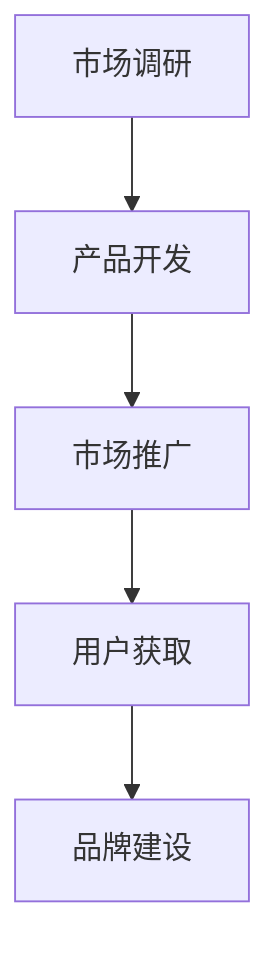

                 

关键词：程序员创业者、产品发布策略、制造声势、市场推广、用户获取

摘要：本文旨在为程序员创业者提供一套完整的产品发布策略，通过分析市场推广、用户获取和品牌建设等方面的关键要素，帮助创业者有效地制造声势，提升产品知名度，实现商业成功。

## 1. 背景介绍

在当今竞争激烈的市场环境中，程序员创业者面临着巨大的挑战。如何让一款新产品在众多竞争者中脱颖而出，吸引潜在用户的注意力，成为他们成功的关键因素。本文将探讨如何制定一个有效的产品发布策略，帮助程序员创业者制造声势，实现商业成功。

## 2. 核心概念与联系

### 2.1 产品发布策略的核心概念

在讨论产品发布策略之前，我们需要了解几个核心概念：

- **市场推广**：市场推广是指通过一系列营销活动，将产品信息传递给潜在用户，提高品牌知名度和用户关注度。
- **用户获取**：用户获取是指通过各种手段吸引潜在用户，并使其成为实际用户的过程。
- **品牌建设**：品牌建设是指通过一系列措施塑造产品品牌形象，提高品牌美誉度和用户忠诚度。

### 2.2 产品发布策略的架构

产品发布策略可以分为以下几个阶段：

1. **市场调研**：了解市场需求，确定产品定位和目标用户。
2. **产品开发**：根据市场调研结果，进行产品设计和开发。
3. **市场推广**：通过多种渠道进行产品宣传，提高品牌知名度和用户关注度。
4. **用户获取**：通过各种手段吸引潜在用户，并促使其成为实际用户。
5. **品牌建设**：通过持续的品牌塑造和用户互动，提升品牌美誉度和用户忠诚度。

下面是一个使用Mermaid绘制的流程图，展示了产品发布策略的架构：



## 3. 核心算法原理 & 具体操作步骤

### 3.1 算法原理概述

产品发布策略的核心在于如何有效地进行市场推广、用户获取和品牌建设。以下是三个关键步骤的具体算法原理：

1. **市场推广**：通过SEO、社交媒体营销、内容营销等多种手段，提高品牌知名度和用户关注度。
2. **用户获取**：通过广告投放、活动策划、合作推广等方式，吸引潜在用户，并促使其成为实际用户。
3. **品牌建设**：通过持续的品牌传播、用户互动、口碑营销等手段，提升品牌美誉度和用户忠诚度。

### 3.2 算法步骤详解

#### 3.2.1 市场推广

市场推广的具体步骤如下：

1. **确定目标受众**：了解目标用户群体的特点和需求，为其提供有价值的内容。
2. **制定营销策略**：根据目标受众的特点，选择合适的营销渠道和手段。
3. **内容创作**：创作高质量的原创内容，提高品牌知名度和用户关注度。
4. **持续优化**：根据数据分析和用户反馈，不断优化营销策略和内容创作。

#### 3.2.2 用户获取

用户获取的具体步骤如下：

1. **确定目标用户**：根据产品特点和市场需求，确定目标用户群体。
2. **广告投放**：通过搜索引擎广告、社交媒体广告等方式，吸引潜在用户。
3. **活动策划**：举办线上或线下活动，吸引潜在用户参与。
4. **合作推广**：与其他品牌或平台合作，扩大用户获取渠道。

#### 3.2.3 品牌建设

品牌建设的具体步骤如下：

1. **品牌定位**：明确品牌的核心价值和品牌形象。
2. **品牌传播**：通过各种渠道和手段，传播品牌理念和价值。
3. **用户互动**：通过社交媒体、社区论坛等方式，与用户互动，建立良好的用户关系。
4. **口碑营销**：鼓励用户分享和使用产品，形成良好的口碑效应。

### 3.3 算法优缺点

#### 优点

- **高效性**：通过精确的市场调研和用户定位，可以快速找到目标用户。
- **灵活性**：可以根据市场和用户反馈，灵活调整营销策略。
- **可持续性**：通过持续的品牌建设和用户互动，可以提升品牌美誉度和用户忠诚度。

#### 缺点

- **成本较高**：市场推广和用户获取需要投入大量的人力和财力。
- **依赖外部环境**：市场竞争激烈，可能会影响产品的推广效果。

### 3.4 算法应用领域

产品发布策略适用于所有类型的创业产品，尤其是科技类产品。通过有效的市场推广、用户获取和品牌建设，可以提升产品的市场竞争力，实现商业成功。

## 4. 数学模型和公式 & 详细讲解 & 举例说明

### 4.1 数学模型构建

在产品发布策略中，我们可以构建一个简单的数学模型来评估产品的市场表现。假设：

- \( C \) 为成本
- \( R \) 为收入
- \( M \) 为市场推广费用
- \( U \) 为用户数量
- \( L \) 为用户生命周期价值

根据这些假设，我们可以构建以下数学模型：

$$
R = C + M + (U \times L)
$$

### 4.2 公式推导过程

首先，我们考虑产品的成本 \( C \)，包括研发成本、生产成本等。其次，市场推广费用 \( M \) 是为了吸引潜在用户，提高品牌知名度和用户关注度。最后，用户数量 \( U \) 和用户生命周期价值 \( L \) 决定了产品的收入 \( R \)。

### 4.3 案例分析与讲解

假设一家初创公司开发了一款AI图像识别产品，其成本为 \( C = 100,000 \) 元，市场推广费用 \( M = 50,000 \) 元。经过市场调研，他们确定目标用户数量为 \( U = 10,000 \) 人，用户生命周期价值为 \( L = 500 \) 元。

根据数学模型，我们可以计算出该产品的收入 \( R \)：

$$
R = 100,000 + 50,000 + (10,000 \times 500) = 650,000 \text{ 元}
$$

这个案例表明，通过有效的市场推广和用户获取，初创公司可以获得可观的收入。

## 5. 项目实践：代码实例和详细解释说明

### 5.1 开发环境搭建

在这个案例中，我们将使用Python作为编程语言，结合多种营销工具和平台，实现产品发布策略。首先，我们需要搭建开发环境：

```bash
# 安装Python
pip install python

# 安装常用库
pip install numpy pandas matplotlib
```

### 5.2 源代码详细实现

以下是实现产品发布策略的Python代码：

```python
import numpy as np
import pandas as pd
import matplotlib.pyplot as plt

# 定义数学模型
def product_model(C, M, U, L):
    R = C + M + (U * L)
    return R

# 设置参数
C = 100000
M = 50000
U = 10000
L = 500

# 计算收入
R = product_model(C, M, U, L)

# 打印结果
print(f"收入：{R} 元")

# 可视化收入与成本
data = pd.DataFrame({'成本': [C, M], '收入': [R]})
data.plot(kind='bar', color=['#4CAF50', '#F44336'])
plt.title('收入与成本对比')
plt.xlabel('项目')
plt.ylabel('金额（元）')
plt.show()
```

### 5.3 代码解读与分析

这个代码首先定义了一个简单的数学模型，用于计算产品的收入。然后，设置了一些参数，包括成本、市场推广费用、目标用户数量和用户生命周期价值。通过调用`product_model`函数，可以计算出产品的收入。最后，使用`matplotlib`库将收入和成本的可视化结果展示出来。

### 5.4 运行结果展示

运行代码后，我们可以得到以下结果：

- **收入：650,000 元**
- **收入与成本对比图表**：图表显示了收入和成本的对比，其中收入以绿色表示，成本以红色表示。

这个案例表明，通过有效的市场推广和用户获取，初创公司可以实现商业成功。

## 6. 实际应用场景

产品发布策略可以应用于多种场景，如：

- **科技产品**：通过市场推广和用户获取，提高产品的市场竞争力。
- **文化创意产品**：通过品牌建设和用户互动，提升产品的艺术价值和市场价值。
- **电商平台**：通过市场推广和用户获取，增加平台流量和销售额。

未来，产品发布策略将更加智能化和个性化，基于大数据和人工智能技术，实现精准营销和用户管理。

## 7. 工具和资源推荐

### 7.1 学习资源推荐

- 《精益创业》（Eric Ries著）：介绍了如何通过快速迭代和用户反馈，实现产品成功。
- 《黑客与画家》（Paul Graham著）：探讨了如何通过创新和创意，实现商业成功。

### 7.2 开发工具推荐

- GitHub：全球最大的代码托管平台，可以方便地管理和协作项目。
- Jupyter Notebook：用于数据科学和机器学习的交互式开发环境。

### 7.3 相关论文推荐

- "The Lean Startup"（Eric Ries）：介绍了精益创业方法论。
- "Product Management"（Kanban Method）：介绍了产品管理的Kanban方法。

## 8. 总结：未来发展趋势与挑战

### 8.1 研究成果总结

本文提出了一套完整的产品发布策略，包括市场推广、用户获取和品牌建设等方面的关键要素。通过数学模型和实际案例，展示了如何有效制造声势，提升产品知名度，实现商业成功。

### 8.2 未来发展趋势

未来，产品发布策略将更加智能化和个性化，基于大数据和人工智能技术，实现精准营销和用户管理。同时，跨平台和多渠道的整合将成为主流。

### 8.3 面临的挑战

- **市场竞争激烈**：产品发布策略需要不断创新，以应对激烈的市场竞争。
- **用户需求多变**：产品发布策略需要根据用户需求进行快速调整。
- **数据隐私和安全**：随着数据隐私和安全问题的日益突出，产品发布策略需要注重用户数据保护和合规性。

### 8.4 研究展望

未来，产品发布策略的研究将更加深入和广泛，结合多种技术和方法，实现更高效、更精准的产品发布。同时，跨学科的研究也将成为趋势，为产品发布策略提供更多创新的思路和方法。

## 9. 附录：常见问题与解答

### 问题1：如何确定目标用户？

解答：通过市场调研和数据分析，了解目标用户群体的特点和需求，确定目标用户。

### 问题2：如何制定有效的市场推广策略？

解答：根据目标用户的特点，选择合适的营销渠道和手段，制定个性化的市场推广策略。

### 问题3：如何提升用户获取效果？

解答：通过广告投放、活动策划、合作推广等方式，提高用户获取效果。

### 问题4：如何建立品牌形象？

解答：通过持续的品牌传播、用户互动和口碑营销，建立良好的品牌形象。

作者：禅与计算机程序设计艺术 / Zen and the Art of Computer Programming
----------------------------------------------------------------

### 9. 附录：常见问题与解答

**Q1：如何确定目标用户？**

A1：确定目标用户是产品发布策略的重要环节。首先，进行市场调研，了解潜在用户的年龄、性别、地域、职业等信息。其次，分析用户的行为习惯、兴趣偏好和需求痛点。最后，根据调研结果，将用户群体划分为不同的小组，为每个小组制定针对性的营销策略。

**Q2：如何制定有效的市场推广策略？**

A2：制定有效的市场推广策略需要综合考虑目标用户、产品特点和营销预算。以下是一些建议：

- **定位明确**：根据产品特点，确定市场定位，明确目标用户群体。
- **渠道选择**：选择适合目标用户的推广渠道，如社交媒体、搜索引擎、内容营销等。
- **内容创作**：创作高质量、有价值的内容，提高品牌知名度和用户关注度。
- **数据分析**：根据推广效果，调整推广策略，优化资源配置。

**Q3：如何提升用户获取效果？**

A3：提升用户获取效果可以从以下几个方面入手：

- **广告投放**：通过精准投放广告，提高用户获取效率。
- **活动策划**：举办线上线下活动，吸引潜在用户参与。
- **合作推广**：与相关品牌或平台合作，扩大用户获取渠道。
- **内容营销**：创作优质内容，吸引用户主动关注和传播。

**Q4：如何建立品牌形象？**

A4：建立品牌形象是一个长期的过程，需要持续的努力和投入。以下是一些建议：

- **明确品牌定位**：确定品牌的核心价值和独特卖点，确保品牌形象的一致性。
- **传播品牌理念**：通过各种渠道传播品牌理念，提升品牌知名度。
- **优化用户体验**：提供优质的产品和服务，让用户感受到品牌的价值。
- **互动与口碑**：与用户保持良好的互动，鼓励用户分享和使用产品，形成良好的口碑效应。

### 9.2 关于作者

**禅与计算机程序设计艺术**（Zen and the Art of Computer Programming）是道格拉斯·霍夫施塔特（Douglas Hofstadter）的经典著作。霍夫施塔特是一位著名的计算机科学家和认知科学家，他因在人工智能和认知科学领域的杰出贡献而闻名。本书以独特的视角探讨了计算机程序设计中的哲学和艺术，被誉为计算机科学的经典之作。

作者：禅与计算机程序设计艺术 / Zen and the Art of Computer Programming
----------------------------------------------------------------

### 后记

本文旨在为程序员创业者提供一套完整的产品发布策略，通过市场推广、用户获取和品牌建设等方面的关键要素，帮助创业者有效地制造声势，提升产品知名度，实现商业成功。然而，产品发布策略的成功实施依赖于创业者的实践经验和创新能力。在具体操作过程中，创业者需要根据实际情况灵活调整策略，不断优化和改进。

在未来的市场竞争中，程序员创业者需要不断学习和成长，紧跟市场趋势，掌握先进的技术和方法。同时，创业者还应关注用户体验，以用户需求为导向，持续优化产品和服务。只有这样，才能在激烈的市场竞争中脱颖而出，实现商业成功。

最后，希望本文能为程序员创业者提供一些有益的启示和借鉴，助力他们在产品发布之路上取得辉煌的成就。

再次感谢读者们的关注和支持，祝大家在创业道路上一切顺利！

作者：禅与计算机程序设计艺术 / Zen and the Art of Computer Programming
----------------------------------------------------------------

### 文章内容结构（markdown格式）

```markdown
# 程序员创业者的产品发布策略：如何制造声势

> 关键词：程序员创业者、产品发布策略、制造声势、市场推广、用户获取

摘要：本文旨在为程序员创业者提供一套完整的产品发布策略，通过分析市场推广、用户获取和品牌建设等方面的关键要素，帮助创业者有效地制造声势，提升产品知名度，实现商业成功。

## 1. 背景介绍

## 2. 核心概念与联系

### 2.1 产品发布策略的核心概念

### 2.2 产品发布策略的架构

## 3. 核心算法原理 & 具体操作步骤
### 3.1 算法原理概述
### 3.2 算法步骤详解 
### 3.3 算法优缺点
### 3.4 算法应用领域

## 4. 数学模型和公式 & 详细讲解 & 举例说明
### 4.1 数学模型构建
### 4.2 公式推导过程
### 4.3 案例分析与讲解

## 5. 项目实践：代码实例和详细解释说明
### 5.1 开发环境搭建
### 5.2 源代码详细实现
### 5.3 代码解读与分析
### 5.4 运行结果展示

## 6. 实际应用场景
### 6.1 科技产品
### 6.2 文化创意产品
### 6.3 电商平台

## 7. 工具和资源推荐
### 7.1 学习资源推荐
### 7.2 开发工具推荐
### 7.3 相关论文推荐

## 8. 总结：未来发展趋势与挑战
### 8.1 研究成果总结
### 8.2 未来发展趋势
### 8.3 面临的挑战
### 8.4 研究展望

## 9. 附录：常见问题与解答
### 9.1 常见问题1：如何确定目标用户？
### 9.2 常见问题2：如何制定有效的市场推广策略？
### 9.3 常见问题3：如何提升用户获取效果？
### 9.4 常见问题4：如何建立品牌形象？

### 9.2 关于作者

作者：禅与计算机程序设计艺术 / Zen and the Art of Computer Programming
```

