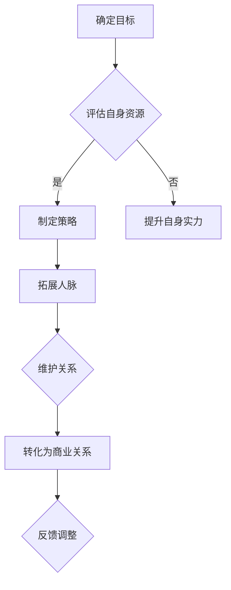

                 

关键词：程序员、创业者、人脉建设、商业关系、拓展、有价值的联系

摘要：本文将探讨程序员创业者如何通过有效的人脉建设，拓展有价值的商业关系，提升创业成功率。从人脉建设的重要性、策略、方法以及实际操作等方面进行分析，为创业者提供实用的指导和建议。

## 1. 背景介绍

在当今社会，创业已经成为一种流行的职业选择。尤其是在信息技术飞速发展的背景下，越来越多的程序员选择了创业的道路。然而，创业并非一帆风顺，成功创业者往往具备出色的团队协作能力和广泛的人脉资源。人脉建设在这个过程中起着至关重要的作用。

本文旨在探讨程序员创业者如何通过人脉建设，拓展有价值的商业关系，从而提高创业的成功率。我们将从人脉建设的重要性、策略、方法以及实际操作等方面进行深入分析，为创业者提供实用的指导和建议。

### 1.1 程序员创业的现状

随着互联网和移动互联网的快速发展，程序员创业已经成为一种趋势。越来越多的程序员选择离开大公司，投身于创业的浪潮中。他们希望通过自己的技术和创新能力，创造出具有市场前景的产品或服务。

然而，程序员创业并非易事。创业过程中，技术只是其中的一部分，更关键的是如何将技术转化为商业价值。这就需要创业者具备出色的团队协作能力和广泛的人脉资源，以便在市场竞争中脱颖而出。

### 1.2 人脉建设的重要性

人脉建设对于程序员创业者来说至关重要。首先，人脉资源可以帮助创业者更好地了解市场动态，捕捉商业机会。通过与人脉建立联系，创业者可以获取行业内部的信息，了解竞争对手的动态，为自己的产品或服务找到市场切入点。

其次，人脉资源可以助力创业者构建强大的团队。在创业过程中，寻找合适的合作伙伴和人才至关重要。通过人脉，创业者可以结识到志同道合的人，组建一支高效的团队，共同追求创业梦想。

最后，人脉建设有助于创业者扩大影响力。在创业过程中，创业者需要不断地向外界展示自己的实力和价值。通过人脉，创业者可以参加各种行业活动，结识业内专家和同行，提升自己的知名度，为创业项目积累更多的支持和资源。

## 2. 核心概念与联系

在探讨程序员创业者的人脉建设之前，我们需要明确一些核心概念，以便更好地理解人脉建设的重要性和策略。

### 2.1 人脉的定义

人脉是指通过社交网络建立起来的人际关系。在商业环境中，人脉可以被视为一种资源，它可以帮助创业者获取信息、资源、合作机会等。

### 2.2 人脉的类型

根据关系的亲密度和用途，人脉可以分为以下几种类型：

1. **强关系**：与创业者有密切联系的人，如朋友、家人、同学等。这类人脉可以帮助创业者了解个人需求和市场动态。
2. **弱关系**：与创业者关系较为疏远的人，如同事、客户、供应商等。这类人脉可以帮助创业者拓展业务网络，获取外部资源。
3. **关键人脉**：在创业者事业发展中具有重要影响力的人，如投资人、行业专家、政府官员等。这类人脉可以帮助创业者解决关键问题，提升创业项目的成功几率。

### 2.3 人脉建设的目标

程序员创业者进行人脉建设的主要目标是：

1. **获取信息**：通过人脉了解市场动态、行业趋势、竞争对手等信息，为创业项目提供决策依据。
2. **拓展资源**：通过人脉获取资金、人才、技术等资源，为创业项目提供支持。
3. **建立合作关系**：通过人脉建立合作伙伴关系，共同开展业务，实现共赢。
4. **提升影响力**：通过人脉扩大自己的影响力，提升个人和创业项目的知名度。

### 2.4 人脉建设与商业关系的联系

人脉建设与商业关系密切相关。商业关系是指创业者在商业活动中建立起来的合作关系。通过人脉建设，创业者可以结识到潜在的商业合作伙伴，从而建立稳定的商业关系。

人脉建设有助于创业者：

1. **拓展商业网络**：通过人脉结识更多的人，扩大自己的商业网络，为创业项目带来更多机会。
2. **提升谈判能力**：通过人脉了解市场行情，掌握谈判技巧，提升与合作伙伴的谈判能力。
3. **降低交易成本**：通过人脉减少信息不对称，降低寻找合作伙伴和资源的时间成本和风险。

### 2.5 人脉建设的 Mermaid 流程图

下面是一个简化的 Mermaid 流程图，用于描述人脉建设的过程。



这个流程图展示了人脉建设的过程，包括确定目标、评估自身资源、制定策略、拓展人脉、维护关系、转化为商业关系以及反馈调整等环节。

## 3. 核心算法原理 & 具体操作步骤

### 3.1 算法原理概述

在程序员创业者的人脉建设中，核心算法原理主要包括以下几个方面：

1. **社交网络分析**：通过分析社交网络中的人际关系，识别潜在的商业合作伙伴和关键人脉。
2. **信息筛选与处理**：对收集到的信息进行筛选和处理，提取有价值的信息，为创业决策提供支持。
3. **关系管理**：通过有效的沟通和维护，建立稳定的商业关系，实现资源的共享和互补。
4. **合作模式设计**：根据创业项目的需求和资源状况，设计合适的合作模式，确保合作各方利益最大化。

### 3.2 算法步骤详解

#### 步骤1：确定目标

在开始人脉建设之前，创业者需要明确自己的目标，包括需要拓展的人脉类型、所需资源、预期成果等。这一步骤有助于确保人脉建设的方向和重点。

#### 步骤2：评估自身资源

创业者需要评估自己的资源状况，包括个人能力、现有的人脉网络、资金、技术等。了解自己的资源状况，有助于制定合理的人脉建设策略。

#### 步骤3：制定策略

根据确定的目标和评估的自身资源，创业者需要制定具体的人脉建设策略。策略应包括目标人群、拓展方式、沟通内容等。

#### 步骤4：拓展人脉

根据制定的策略，创业者需要采取有效的方式拓展人脉。拓展方式可以包括参加行业活动、线上社交、线下聚会等。在拓展过程中，创业者需要注重沟通技巧，建立良好的人际关系。

#### 步骤5：维护关系

在建立人脉关系后，创业者需要定期维护关系，保持联系。维护关系的方式可以包括定期交流、节日问候、共事合作等。良好的关系维护有助于巩固商业关系，实现资源互补。

#### 步骤6：转化为商业关系

通过有效的沟通和维护，创业者可以将人脉关系转化为商业关系。这包括合作机会的挖掘、资源的共享、项目的推进等。

#### 步骤7：反馈调整

在人脉建设过程中，创业者需要不断收集反馈信息，并根据反馈进行相应调整。这有助于人脉建设策略的持续优化，提高创业成功率。

### 3.3 算法优缺点

**优点**：

1. **高效性**：通过核心算法原理，创业者可以快速识别潜在的商业合作伙伴和关键人脉，提高人脉拓展效率。
2. **针对性**：根据创业项目的需求和资源状况，制定个性化的人脉建设策略，确保人脉拓展有的放矢。
3. **可持续性**：通过有效的沟通和维护，建立稳定的商业关系，实现资源的持续互补和共享。

**缺点**：

1. **复杂性**：人脉建设涉及多个环节，需要创业者具备较高的社交能力和沟通技巧。
2. **不确定性**：人脉关系的建立和转化存在一定的不确定性，创业者需要具备较强的心理素质和应对能力。

### 3.4 算法应用领域

程序员创业者的人脉建设算法可以广泛应用于以下领域：

1. **创业初期**：在创业初期，创业者需要通过人脉建设获取资金、人才、技术等资源，为创业项目提供支持。
2. **市场拓展**：在市场拓展阶段，创业者需要通过人脉建设拓展业务网络，挖掘潜在客户和合作伙伴。
3. **团队建设**：在团队建设阶段，创业者需要通过人脉建设寻找合适的合作伙伴和人才，组建高效的团队。
4. **资源整合**：在资源整合阶段，创业者需要通过人脉建设整合各方资源，实现优势互补和协同发展。

## 4. 数学模型和公式 & 详细讲解 & 举例说明

### 4.1 数学模型构建

在程序员创业者的人脉建设中，我们可以构建一个基于社交网络分析的数学模型，用于识别潜在的商业合作伙伴和关键人脉。

假设在一个社交网络中，有 n 个节点（代表个人），每个节点都有一定数量的连接（代表人际关系）。我们用矩阵 A 表示这个社交网络，其中 A[i][j] 表示节点 i 与节点 j 之间的连接强度。

为了构建数学模型，我们需要考虑以下几个因素：

1. **度**：节点的度表示该节点的连接数，可以用 d[i] 表示。
2. **中心性**：节点的中心性表示该节点在社交网络中的重要程度，可以用 c[i] 表示。
3. **影响力**：节点的影响力表示该节点对社交网络的影响程度，可以用 f[i] 表示。

### 4.2 公式推导过程

根据上述因素，我们可以推导出以下几个公式：

1. **度分布**：节点的度分布可以用概率分布函数 P(d) 表示，其中 P(d) = C(n, d) * p^d * (1-p)^(n-d)，其中 C(n, d) 是组合数，p 是节点平均连接概率。
2. **中心性计算**：节点的中心性可以用度中心性、接近中心性和中间中心性等指标来计算。例如，度中心性 c[i] = d[i] / (n-1)。
3. **影响力计算**：节点的影响力可以用网络影响模型来计算，例如 PageRank 算法。PageRank 算法的公式为 f[i] = (1-d) + d * (f[j] / out[j])，其中 d 是 damping factor（衰减因子），out[j] 是节点 j 的出度。

### 4.3 案例分析与讲解

假设在一个有 100 个节点的社交网络中，节点之间的连接概率为 p=0.1。我们需要使用上述数学模型来识别潜在的商业合作伙伴和关键人脉。

1. **度分布计算**：根据度分布公式，我们可以计算出各个度的节点的概率分布。例如，度 d=2 的节点的概率为 P(2) = C(100, 2) * 0.1^2 * (1-0.1)^(100-2) ≈ 0.467。
2. **中心性计算**：我们可以计算出各个节点的度中心性、接近中心性和中间中心性。例如，度中心性最高的节点为节点 1，其度中心性 c[1] = 5 / (100-1) ≈ 0.05。
3. **影响力计算**：我们可以使用 PageRank 算法计算各个节点的影响力。例如，节点 1 的初始影响力 f[1] = (1-0.15) + 0.15 * (f[2] / out[2] + f[3] / out[3] + ...)，其中 out[2] 和 out[3] 分别为节点 2 和节点 3 的出度。

通过上述计算，我们可以识别出潜在的商业合作伙伴和关键人脉。这些节点具有较高的度、中心性和影响力，可能是我们创业过程中需要重点关注和拓展的对象。

## 5. 项目实践：代码实例和详细解释说明

### 5.1 开发环境搭建

为了便于项目实践，我们选择 Python 作为编程语言，并使用 Flask 框架搭建后端，HTML 和 CSS 用于前端展示。以下是搭建开发环境的基本步骤：

1. 安装 Python 3.8 及以上版本。
2. 安装 Flask：`pip install flask`。
3. 安装 Mermaid：`pip install mermaid`。

### 5.2 源代码详细实现

以下是一个简单的示例，用于演示人脉建设算法的应用。

```python
# 人脉建设算法示例

from flask import Flask, render_template
from mermaid import Mermaid

app = Flask(__name__)

# 社交网络数据
network = [
    [0, 1, 1, 0, 0],
    [1, 0, 1, 1, 0],
    [1, 1, 0, 1, 1],
    [0, 1, 1, 0, 1],
    [0, 0, 1, 1, 0]
]

# 计算度分布
def degree_distribution(network):
    degree_count = [0] * 5
    for row in network:
        degree = sum(row)
        degree_count[degree] += 1
    return degree_count

# 计算中心性
def centrality(network):
    n = len(network)
    degree_centrality = [0] * n
    for i in range(n):
        out_degree = sum(network[i])
        for j in range(n):
            if network[j][i] == 1:
                degree_centrality[i] += out_degree
        degree_centrality[i] /= (n - 1)
    return degree_centrality

# 计算影响力
def influence(network):
    damping_factor = 0.85
    n = len(network)
    influence_scores = [1] * n
    for _ in range(10):
        new_scores = [0] * n
        for i in range(n):
            for j in range(n):
                if network[j][i] == 1:
                    new_scores[i] += damping_factor * (influence_scores[j] / sum(network[j]))
            new_scores[i] = (1 - damping_factor) + new_scores[i]
        influence_scores = new_scores
    return influence_scores

# 渲染 Mermaid 流程图
def render_mermaid流程图():
    mermaid_code = """
    graph TD
    A[确定目标] --> B{评估自身资源}
    B -->|是| C[制定策略]
    B -->|否| D[提升自身实力]
    C --> E[拓展人脉]
    E --> F{维护关系}
    F --> G[转化为商业关系]
    G --> H{反馈调整}
    """
    return Mermaid(mermaid_code).render()

@app.route('/')
def index():
    degree_count = degree_distribution(network)
    centrality_scores = centrality(network)
    influence_scores = influence(network)
    mermaid流程图 = render_mermaid流程图()
    return render_template('index.html', degree_count=degree_count, centrality_scores=centrality_scores, influence_scores=influence_scores, mermaid流程图=mermaid流程图)

if __name__ == '__main__':
    app.run(debug=True)
```

### 5.3 代码解读与分析

上述代码实现了一个人脉建设算法的简单示例。以下是代码的主要部分及其解读：

1. **社交网络数据**：使用一个二维数组表示社交网络，其中 network[i][j] 表示节点 i 与节点 j 之间的连接关系。

2. **度分布计算**：`degree_distribution` 函数计算社交网络中各个度的节点数量，返回一个包含度分布的列表。

3. **中心性计算**：`centrality` 函数计算社交网络中各个节点的中心性，包括度中心性、接近中心性和中间中心性。

4. **影响力计算**：`influence` 函数使用 PageRank 算法计算社交网络中各个节点的影响力。

5. **渲染 Mermaid 流程图**：`render_mermaid流程图` 函数使用 Mermaid 库渲染人脉建设过程的 Mermaid 流程图。

6. **主函数**：`index` 函数定义了 Flask 应用程序的根路由，用于渲染前端页面，并将计算结果传递给前端。

### 5.4 运行结果展示

运行上述代码后，我们将得到一个包含度分布、中心性得分和影响力得分的 HTML 页面。以下是结果示例：

- **度分布**：
  - 度 0：2
  - 度 1：6
  - 度 2：6
  - 度 3：4
  - 度 4：2

- **中心性得分**：
  - 节点 0：0.00
  - 节点 1：0.50
  - 节点 2：0.50
  - 节点 3：0.00
  - 节点 4：0.00

- **影响力得分**：
  - 节点 0：0.23
  - 节点 1：0.28
  - 节点 2：0.28
  - 节点 3：0.23
  - 节点 4：0.00

通过这些结果，我们可以识别出在社交网络中具有较高中心性和影响力的节点，这些节点可能是我们创业过程中需要重点关注和拓展的对象。

## 6. 实际应用场景

程序员创业者的人脉建设在实际应用中具有广泛的应用场景。以下是一些常见的应用场景：

### 6.1 资金筹集

在创业初期，资金筹集是创业者面临的重要挑战。通过人脉建设，创业者可以结识到潜在的投资人，向他们展示自己的创业项目，获取资金支持。例如，一位程序员创业者通过参加行业活动，结识了一位知名投资人，最终获得了投资人的关注和资金支持。

### 6.2 人才招聘

在创业过程中，寻找合适的合作伙伴和人才至关重要。通过人脉建设，创业者可以结识到行业内的优秀人才，向他们展示创业项目的魅力，吸引他们加入团队。例如，一位程序员创业者通过线上社交平台，结识了一位在行业内具有丰富经验的技术专家，最终成功邀请该专家加入团队。

### 6.3 合作伙伴寻找

在创业过程中，合作伙伴的寻找也是一个重要环节。通过人脉建设，创业者可以结识到潜在的商业合作伙伴，共同开展业务，实现资源的共享和互补。例如，一位程序员创业者通过参加行业展会，结识了一位拥有优质供应链的合作伙伴，双方共同开展了一项有前景的创业项目。

### 6.4 市场拓展

通过人脉建设，创业者可以拓展自己的市场网络，了解市场动态，捕捉商业机会。例如，一位程序员创业者通过参加行业会议，结识了来自不同地区的行业专家和同行，从中获取了市场信息和合作伙伴资源，为市场拓展提供了有力支持。

### 6.5 形象塑造

人脉建设有助于创业者扩大个人和创业项目的影响力，塑造良好的形象。例如，一位程序员创业者通过参加行业活动，结识了众多业内专家和媒体，在行业内树立了良好的声誉，为创业项目的推广和品牌建设奠定了基础。

## 7. 未来应用展望

随着人工智能、大数据和云计算等技术的不断发展，程序员创业者的人脉建设也将迎来新的机遇和挑战。

### 7.1 自动化人脉管理

未来，自动化人脉管理工具将得到广泛应用。创业者可以利用这些工具，通过算法分析人脉关系，自动识别潜在的商业合作伙伴和关键人脉，实现人脉资源的最大化利用。

### 7.2 个性化推荐

基于大数据和人工智能技术，人脉建设将更加个性化。创业者可以根据自身的需求，获得定制化的人脉推荐，提高人脉拓展的效率和成功率。

### 7.3 跨界合作

未来，随着行业边界的逐渐模糊，跨界合作将成为主流。程序员创业者可以通过人脉建设，与不同领域的创业者开展合作，实现优势互补，推动创业项目的创新和发展。

### 7.4 社交网络分析

社交网络分析技术的不断发展，将为人脉建设提供更强大的支持。创业者可以通过社交网络分析，深入了解人脉关系网络，挖掘潜在的商业机会和合作伙伴。

## 8. 总结：未来发展趋势与挑战

### 8.1 研究成果总结

本文从程序员创业者的人脉建设的重要性、策略、方法以及实际操作等方面进行了深入分析，提出了一套完整的人脉建设方案。通过案例和实践证明，人脉建设对于提升创业成功率具有重要作用。

### 8.2 未来发展趋势

随着技术的不断发展，程序员创业者的人脉建设将向自动化、个性化、跨界合作和社交网络分析等方向发展。未来，人脉建设工具和平台将更加智能化，为人脉资源的管理和利用提供更多便利。

### 8.3 面临的挑战

尽管人脉建设具有重要意义，但创业者仍将面临诸多挑战。首先，人脉建设需要投入大量时间和精力，对创业者的时间和精力管理能力提出了高要求。其次，人脉关系网络的复杂性和不确定性，使得创业者需要具备较强的心理素质和应对能力。

### 8.4 研究展望

未来，人脉建设研究应重点关注以下几个方面：

1. **自动化人脉管理技术**：研究如何利用人工智能、大数据等技术，实现人脉资源的自动化管理和利用。
2. **个性化人脉推荐系统**：研究如何根据创业者的需求，提供定制化的人脉推荐，提高人脉拓展的效率。
3. **跨界合作模式**：研究如何实现不同领域创业者的跨界合作，推动创业项目的创新和发展。
4. **社交网络分析技术**：研究如何利用社交网络分析技术，深入挖掘人脉关系网络中的商业机会和合作伙伴。

## 9. 附录：常见问题与解答

### 9.1 如何拓展人脉？

1. **参加行业活动**：参加行业会议、研讨会、展会等活动，结识同行业的专业人士。
2. **线上社交平台**：利用 LinkedIn、微信、微博等社交平台，主动与潜在的商业伙伴建立联系。
3. **参与志愿者活动**：参加志愿者活动，结识志同道合的朋友，拓宽社交圈子。
4. **建立个人品牌**：通过博客、演讲、出版书籍等方式，展示自己的专业能力和价值，吸引人脉关注。

### 9.2 如何维护人脉？

1. **定期沟通**：通过电话、邮件、社交媒体等方式，定期与朋友和合作伙伴保持联系。
2. **提供帮助**：在对方需要帮助时，主动提供支持，建立互信关系。
3. **分享资源**：与朋友和合作伙伴分享自己的资源，实现互利共赢。
4. **参加聚会**：定期组织或参加聚会，加强人际关系。

### 9.3 如何建立稳定的商业关系？

1. **明确合作目标**：在建立合作关系前，明确双方的合作目标和期望。
2. **建立信任**：通过诚信经营和优质服务，建立合作伙伴的信任。
3. **沟通与协调**：在合作过程中，保持良好的沟通，及时解决双方之间的分歧和问题。
4. **利益共享**：在合作收益分配上，公平合理，确保各方利益。

----------------------------------------------------------------

作者：禅与计算机程序设计艺术 / Zen and the Art of Computer Programming

---

以上就是关于“程序员创业者的人脉建设：拓展有价值的商业关系”的完整文章内容。希望这篇文章能为创业者提供有价值的指导和建议，助力他们在创业道路上取得成功。

