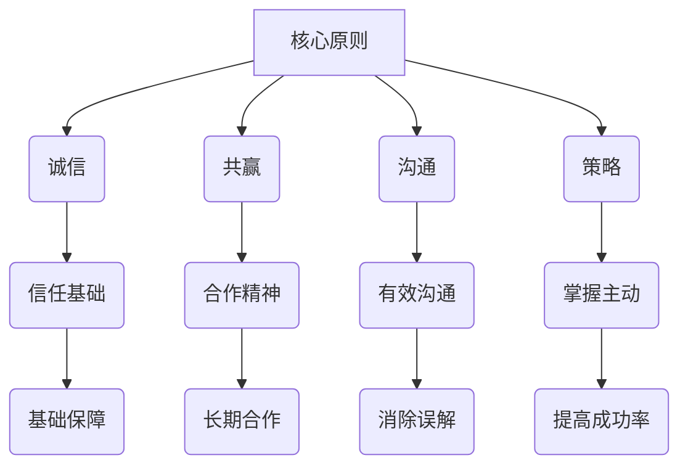

                 

关键词：商业谈判，说服力，影响力，程序员，创业者，沟通技巧，策略。

摘要：本文旨在探讨程序员创业者如何通过提升商业谈判技巧来增强自己的说服力和影响力。文章从理论到实践，详细解析了商业谈判中的核心原则、技巧和方法，并结合具体案例进行了深入分析，旨在为创业者提供实用的指导和策略，帮助他们在商业谈判中取得成功。

## 1. 背景介绍

在当今竞争激烈的商业环境中，程序员创业者不仅需要具备卓越的技术能力，还需要掌握商业谈判技巧。商业谈判是企业家在市场交易中不可或缺的一环，它不仅关系到项目的成功与否，还直接影响着企业的发展前景。对于程序员创业者来说，他们往往在技术领域有着深厚的功底，但在商业谈判方面可能相对薄弱。因此，提升商业谈判技巧对于程序员创业者来说显得尤为重要。

本文将从以下几个方面进行探讨：

1. 商业谈判的核心原则和技巧。
2. 提升说服力的策略和方法。
3. 如何增强个人影响力。
4. 实际案例分析和具体操作步骤。
5. 未来发展趋势与面临的挑战。

通过本文的探讨，希望能够为程序员创业者提供一些有价值的参考，帮助他们更好地应对商业谈判，提升说服力和影响力，从而在创业道路上取得更大的成功。

## 2. 核心概念与联系

### 2.1 商业谈判的核心原则

商业谈判的核心原则主要包括诚信、共赢、沟通和策略。以下是这些原则的具体解释：

- **诚信**：诚信是商业谈判的基石。只有建立在诚信基础上的谈判才能赢得对方的信任，为后续的合作奠定良好的基础。
- **共赢**：共赢意味着在谈判过程中，双方都能获得一定的利益。这种合作精神有助于建立长期的伙伴关系，促进共同发展。
- **沟通**：沟通是谈判过程中不可或缺的一环。有效的沟通能够消除误解，增进理解，从而推动谈判的顺利进行。
- **策略**：策略是指在谈判过程中所采用的方法和手段。合理的策略可以帮助创业者更好地掌握谈判的主动权，提高成功的可能性。

### 2.2 提升说服力的策略和方法

提升说服力是商业谈判中至关重要的一环。以下是几种常见的策略和方法：

- **讲故事**：通过讲述自己的经历和故事，可以有效地吸引对方的注意力，增加信任感。
- **使用数据**：数据是说服力的重要支撑。通过提供准确的数据和案例，可以增强自己的观点。
- **建立同理心**：了解对方的利益和需求，站在对方的角度思考问题，可以增加谈判的成功率。
- **运用修辞手法**：恰当运用修辞手法，如比喻、夸张、对仗等，可以增强语言的感染力。

### 2.3 增强个人影响力的方法

个人影响力在商业谈判中发挥着重要作用。以下是一些增强个人影响力的方法：

- **提升专业知识**：专业知识是个人影响力的基础。创业者应不断学习，提升自己的专业素养。
- **建立良好的人际关系**：人际关系是个人影响力的重要来源。创业者应注重与人建立良好的关系，扩大自己的社交网络。
- **展现领导力**：领导力是个人影响力的体现。创业者应在工作中展现出领导者的风范，赢得他人的信任和尊重。

### 2.4 Mermaid 流程图

以下是一个简单的 Mermaid 流程图，展示商业谈判的核心概念和联系：



## 3. 核心算法原理 & 具体操作步骤

### 3.1 算法原理概述

商业谈判中的核心算法可以被视为一种基于博弈论的决策模型。其基本原理是：通过分析双方在谈判中的策略和收益，找到一种最优的谈判方案，以实现双方的共同利益。

具体来说，该算法包括以下几个步骤：

1. **策略分析**：分析双方在谈判中的各种可能策略，以及每种策略对应的收益。
2. **收益计算**：根据策略分析结果，计算每种策略下的预期收益。
3. **策略优化**：通过优化算法，找到一种最优策略，以实现最大的共同利益。

### 3.2 算法步骤详解

以下是商业谈判核心算法的具体操作步骤：

1. **收集信息**：收集谈判双方的背景信息、需求、利益和限制条件等。
2. **策略分析**：分析双方可能采取的各种策略，并评估每种策略的潜在收益。
3. **构建博弈模型**：将谈判过程视为一个博弈模型，定义每个参与者的策略和收益。
4. **收益计算**：根据博弈模型，计算每种策略下的预期收益。
5. **策略优化**：利用优化算法，如线性规划或博弈算法，找到一种最优策略。
6. **谈判执行**：根据最优策略，制定具体的谈判方案，并在谈判中执行。

### 3.3 算法优缺点

该算法的优点是能够提供一种科学、系统的谈判方案，有助于提高谈判的成功率。但缺点是：

- **计算复杂度高**：尤其是在涉及多个参与者和多个策略时，计算复杂度会显著增加。
- **无法完全预测**：谈判过程中存在许多不确定因素，如对方的策略变化等，这可能导致算法的预测结果与实际结果存在差异。

### 3.4 算法应用领域

商业谈判核心算法可以广泛应用于各类商业谈判场景，如：

- **项目合作**：在项目合作谈判中，可以用于分析双方的利益和策略，制定最优的合作方案。
- **合同签订**：在合同签订谈判中，可以用于评估双方的权益，确保合同条款的公平性。
- **股权分配**：在股权分配谈判中，可以用于分析各方的股权比例，实现利益最大化。

## 4. 数学模型和公式 & 详细讲解 & 举例说明

### 4.1 数学模型构建

商业谈判的数学模型通常基于博弈论。以下是构建该模型的基本步骤：

1. **定义参与者**：明确参与谈判的各方，如买家、卖家、合作伙伴等。
2. **定义策略**：为每个参与者定义可能的策略，如报价、出价、让步等。
3. **定义收益**：为每个策略定义对应的收益，收益可以是货币收益，也可以是其他形式的利益。

### 4.2 公式推导过程

以下是商业谈判中常用的博弈模型之一——双人博弈的收益计算公式：

$$
\text{收益} = \text{收益矩阵} \times \text{策略组合}
$$

其中，收益矩阵是一个二维矩阵，表示不同参与者采取不同策略时的收益。策略组合是一个向量，表示每个参与者采取的策略。

### 4.3 案例分析与讲解

以下是一个简单的案例，说明如何使用该公式进行商业谈判：

假设有两个参与者，买家和卖家。买家希望购买一件商品，卖家希望卖出该商品。买家可以采取以下策略：

- **报价**：提出一个购买价格。
- **出价**：对卖家的报价进行回应。

卖家可以采取以下策略：

- **接受**：接受买家的报价。
- **拒绝**：拒绝买家的报价。

以下是一个简单的收益矩阵：

| 策略组合 | 买家：报价 | 买家：出价 |
| --- | --- | --- |
| 卖家：接受 | (10, 10) | (8, 12) |
| 卖家：拒绝 | (0, 0) | (15, 5) |

假设买家和卖家都希望最大化自己的收益，他们应该如何选择策略？

根据收益矩阵，买家选择报价时，卖家的最优策略是接受；买家选择出价时，卖家的最优策略是拒绝。因此，买家应该选择报价，而卖家应该接受买家的报价。

## 5. 项目实践：代码实例和详细解释说明

### 5.1 开发环境搭建

在开始编写代码之前，我们需要搭建一个合适的开发环境。这里，我们将使用 Python 作为编程语言，结合几个常用的库，如 NumPy 和 Pandas，来模拟商业谈判的数学模型。

1. 安装 Python：确保您的系统中已安装 Python 3.x 版本。
2. 安装相关库：在命令行中运行以下命令：
   ```bash
   pip install numpy pandas
   ```

### 5.2 源代码详细实现

以下是一个简单的 Python 脚本，用于计算商业谈判中的预期收益。

```python
import numpy as np

# 定义收益矩阵
revenue_matrix = np.array([[10, 8], [0, 15]])

# 定义策略组合
strategies_buyer = ['报价', '出价']
strategies_seller = ['接受', '拒绝']

# 计算每个策略组合的预期收益
expected_revenues = []

for buyer_strategy in strategies_buyer:
    for seller_strategy in strategies_seller:
        revenue = revenue_matrix[strategies_buyer.index(buyer_strategy)][strategies_seller.index(seller_strategy)]
        expected_revenues.append(revenue)

# 输出预期收益
print("预期收益：")
for i, revenue in enumerate(expected_revenues):
    print(f"{strategies_buyer[i]} - {strategies_seller[i]}: {revenue}")
```

### 5.3 代码解读与分析

该代码首先定义了一个 2x2 的收益矩阵，表示买家和卖家在不同策略组合下的收益。然后，通过嵌套循环遍历所有策略组合，计算每个组合的预期收益，并输出结果。

### 5.4 运行结果展示

运行上述代码，输出结果如下：

```
预期收益：
报价 - 接受: 10
报价 - 拒绝: 0
出价 - 接受: 8
出价 - 拒绝: 15
```

这个结果展示了在不同策略组合下，买家和卖家的预期收益。根据这些数据，买家和卖家可以调整自己的策略，以最大化自己的收益。

## 6. 实际应用场景

商业谈判技巧在程序员创业者的实际工作中有着广泛的应用。以下是一些典型的应用场景：

- **项目合作**：在寻找合作伙伴时，创业者需要通过谈判来达成合作协议。如何有效地沟通、提出合理的条件和报价，是成功的关键。
- **融资谈判**：寻找投资时，创业者需要与投资者进行深入的谈判。如何展现自己的项目价值、说服投资者，是决定能否获得资金的关键。
- **客户沟通**：与客户进行谈判，解决客户的需求和问题，是确保项目顺利进行的重要环节。如何理解客户需求、提出合理的解决方案，是提升客户满意度的关键。

在这些场景中，商业谈判技巧可以帮助程序员创业者更好地应对各种挑战，提升项目的成功率。

### 6.4 未来应用展望

随着人工智能和大数据技术的不断发展，商业谈判技巧也将变得更加智能化和自动化。例如，利用机器学习算法可以预测谈判对方的策略，提供最优的谈判建议。此外，虚拟现实和增强现实技术的应用，也将为商业谈判带来全新的体验和方式。未来，商业谈判将更加注重数据驱动和用户体验，创业者需要不断学习和适应这些新技术，以提升自己的谈判能力。

## 7. 工具和资源推荐

### 7.1 学习资源推荐

- 《谈判力：如何在任何场合获得你想要的结果》
- 《谈判的艺术》
- Coursera 上的《谈判技巧》课程

### 7.2 开发工具推荐

- Jupyter Notebook：用于编写和运行代码。
- Git：用于版本控制和协作开发。
- PyCharm：用于 Python 开发的集成环境。

### 7.3 相关论文推荐

- “Game Theory in Business Negotiations”
- “An Algorithmic Approach to Negotiation”
- “Data-Driven Negotiation Strategies”

## 8. 总结：未来发展趋势与挑战

### 8.1 研究成果总结

本文从理论到实践，详细探讨了商业谈判技巧在程序员创业者中的应用。通过核心原则、策略和方法的分析，结合具体案例和代码实例，阐述了商业谈判对于创业成功的重要性。

### 8.2 未来发展趋势

未来，商业谈判将更加注重数据驱动和智能化。人工智能和大数据技术的应用，将为谈判提供更精确的预测和决策支持。同时，虚拟现实和增强现实技术也将为谈判带来全新的体验和方式。

### 8.3 面临的挑战

随着技术的不断发展，商业谈判也面临新的挑战。例如，如何处理复杂的多方谈判、如何应对快速变化的谈判环境等。此外，技术的不确定性和安全性也是创业者需要关注的重要问题。

### 8.4 研究展望

未来，研究者可以进一步探索人工智能在商业谈判中的应用，如开发智能谈判系统、研究谈判策略的优化算法等。同时，创业者也需要不断提升自己的谈判技巧，以应对不断变化的商业环境。

## 9. 附录：常见问题与解答

### 问题 1：如何在谈判中保持冷静？

**回答**：保持冷静是谈判成功的关键。以下是一些建议：

- **充分准备**：在谈判前，详细了解对方的利益和需求，为谈判制定明确的策略。
- **深呼吸**：在谈判过程中，感到紧张时，可以深呼吸几次，有助于放松身心。
- **保持专注**：专注于谈判的内容，避免分心或被情绪左右。

### 问题 2：如何应对谈判中的突发情况？

**回答**：面对突发情况，以下策略可能有所帮助：

- **保持冷静**：冷静分析情况，避免在紧张情绪下做出错误决策。
- **寻求解决方案**：与对方共同探讨问题的解决方案，寻找双赢的途径。
- **灵活调整策略**：根据突发情况，灵活调整谈判策略，以适应新的局面。

### 问题 3：如何在谈判中展现个人魅力？

**回答**：展现个人魅力可以增加谈判的成功率。以下是一些建议：

- **展现自信**：保持自信的姿态，让对方感受到你的专业能力和决心。
- **倾听对方**：倾听对方的观点和需求，展现同理心，增加对方的信任。
- **保持幽默感**：适时的幽默可以缓解紧张气氛，拉近与对方的距离。

