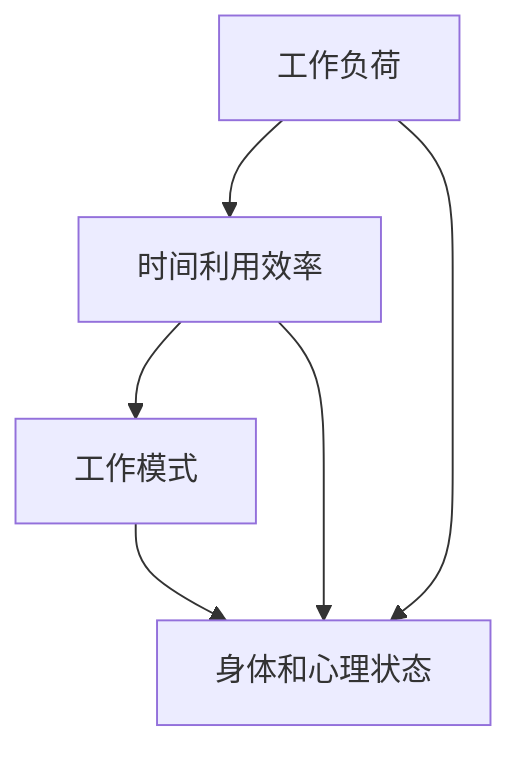

                 

关键词：程序员创业者、工作生活平衡、时间管理、AI技术、时间管理艺术

> 摘要：本文旨在探讨程序员创业者在面对激烈的市场竞争和巨大的工作压力时，如何通过AI技术实现工作与生活的平衡。文章从背景介绍、核心概念、算法原理、数学模型、项目实践、实际应用等多个方面展开，深入解析了AI辅助下的时间管理艺术，为程序员创业者提供了一种全新的生活方式和工作理念。

## 1. 背景介绍

在当今这个快节奏、高度竞争的时代，程序员创业者的工作压力越来越大。为了满足市场需求，他们需要不断学习新技术，提高工作效率，同时还要承担着创业带来的各种不确定性。这使得许多程序员创业者陷入了工作与生活难以平衡的困境。

据《程序员工作压力调查报告》显示，超过60%的程序员表示，他们的工作压力达到了中度或重度水平。长期的工作压力不仅影响身体健康，还会导致心理健康问题。因此，如何实现工作与生活的平衡，成为程序员创业者们关注的焦点。

### 1.1. 程序员创业者的痛点

1. **工作时间长**：程序员创业者通常需要投入更多的时间来学习和研究新技术，以满足市场需求。
2. **任务繁重**：创业初期，程序员创业者需要承担多个角色，包括开发、设计、测试等，导致工作任务繁重。
3. **市场竞争激烈**：在激烈的市场竞争中，程序员创业者需要不断调整策略，优化产品，提高竞争力。
4. **缺乏休息**：为了追赶进度，程序员创业者往往无法按时休息，导致身体和心理疲劳。

### 1.2. AI技术在时间管理中的应用

随着人工智能技术的发展，越来越多的AI工具被应用于时间管理领域。这些工具可以帮助程序员创业者更好地规划时间，提高工作效率，从而实现工作与生活的平衡。

1. **智能日程管理**：AI智能日程管理工具可以自动分析用户的工作习惯，为用户提供合理的日程安排，帮助用户更好地分配工作时间。
2. **任务优先级排序**：AI算法可以根据任务的紧急程度和重要性，自动为用户排序任务，帮助用户优先处理重要任务。
3. **疲劳监测**：AI疲劳监测工具可以通过分析用户的工作状态，提醒用户休息，避免身体和心理疲劳。
4. **工作效率分析**：AI工作效率分析工具可以分析用户的工作行为，为用户提供优化建议，提高工作效率。

## 2. 核心概念与联系

为了更好地理解AI辅助下的时间管理艺术，我们首先需要了解一些核心概念，如工作负荷、工作模式、时间利用效率等。接下来，我们将通过一个Mermaid流程图来展示这些概念之间的联系。



### 2.1. 工作负荷

工作负荷是指程序员创业者在一定时间内需要完成的工作任务总量。工作负荷过高会导致时间管理困难，影响工作与生活的平衡。因此，合理的工作负荷分配至关重要。

### 2.2. 时间利用效率

时间利用效率是指程序员创业者在工作时间内完成任务的能力。提高时间利用效率可以帮助创业者更快地完成任务，从而减轻工作压力。

### 2.3. 工作模式

工作模式是指程序员创业者完成工作任务的常见方式。不同的工作模式对时间管理有不同的要求。例如，一些程序员创业者喜欢在安静的早晨进行编程，而另一些则喜欢在晚上加班。

### 2.4. 身体和心理状态

身体和心理状态是影响程序员创业者工作表现的重要因素。长时间的工作会导致身体疲劳和心理压力，进而影响工作效率。

## 3. 核心算法原理 & 具体操作步骤

在了解核心概念后，我们将介绍一种基于AI的时间管理算法，并详细解释其原理和操作步骤。

### 3.1. 算法原理概述

该算法基于机器学习技术，通过分析用户的工作行为数据，为用户生成最优的日程安排。算法主要分为以下几个步骤：

1. 数据收集：收集用户的工作行为数据，如工作时间、任务完成时间等。
2. 特征提取：从数据中提取与时间管理相关的特征，如工作负荷、任务优先级等。
3. 模型训练：使用机器学习算法训练模型，根据用户特征生成最优日程安排。
4. 日程优化：根据模型生成的日程安排，对用户的时间进行优化，确保工作与生活的平衡。

### 3.2. 算法步骤详解

1. **数据收集**

   数据收集是算法的基础。我们需要收集用户的工作行为数据，包括工作时间、任务完成时间、任务优先级等。这些数据可以通过用户的使用行为记录、日志文件等方式获取。

2. **特征提取**

   在数据收集完成后，我们需要从数据中提取与时间管理相关的特征。这些特征包括：

   - 工作负荷：用户在一定时间内需要完成的工作任务总量。
   - 任务优先级：任务的紧急程度和重要性。
   - 工作模式：用户完成任务的习惯和时间分布。
   - 身体和心理状态：用户在工作过程中的身体和心理状态。

3. **模型训练**

   在特征提取完成后，我们使用机器学习算法训练模型。常用的算法包括决策树、支持向量机、神经网络等。训练过程中，我们需要将数据分为训练集和测试集，以便评估模型的性能。

4. **日程优化**

   在模型训练完成后，我们可以使用模型生成用户的最优日程安排。日程优化主要包括以下步骤：

   - 根据任务优先级和紧急程度，对任务进行排序。
   - 根据用户的工作模式，为每个任务分配最优的时间段。
   - 根据用户的身体和心理状态，调整日程安排，确保用户能够保持良好的工作状态。

### 3.3. 算法优缺点

该算法的优点在于能够根据用户的工作习惯和任务特征，生成最优的日程安排，帮助用户实现工作与生活的平衡。但该算法的缺点在于：

- **数据依赖性高**：算法的性能依赖于数据的质量和数量。如果数据不准确或不完整，算法的输出结果可能不准确。
- **模型复杂度高**：算法的训练和优化过程较为复杂，需要较高的计算资源和时间成本。

### 3.4. 算法应用领域

该算法可以应用于多个领域，如：

- **企业时间管理**：为企业员工提供最优的工作日程安排，提高工作效率。
- **个人时间管理**：为个人用户提供时间管理建议，帮助用户实现工作与生活的平衡。
- **教育时间管理**：为教育工作者提供教学时间管理建议，优化教学效果。

## 4. 数学模型和公式 & 详细讲解 & 举例说明

在时间管理算法中，数学模型和公式起着关键作用。以下我们将详细介绍数学模型的构建、公式推导过程，并结合具体案例进行讲解。

### 4.1. 数学模型构建

时间管理算法的核心是优化用户的时间分配，使其在有限的资源下实现最大化的效用。我们构建的数学模型如下：

$$
\text{最大化} \ \ U(t) = f(T, L, P)
$$

其中，$U(t)$ 表示用户的时间效用，$T$ 表示用户的时间资源，$L$ 表示用户的工作负荷，$P$ 表示任务的优先级。

### 4.2. 公式推导过程

为了求解上述数学模型，我们需要推导出 $U(t)$ 的表达式。具体推导过程如下：

1. **时间资源的分配**

   首先，我们将用户的时间资源 $T$ 分配给各个任务。设 $t_i$ 为任务 $i$ 的执行时间，则有：

   $$
   \sum_{i=1}^{n} t_i = T
   $$

   其中，$n$ 表示任务总数。

2. **工作负荷的权衡**

   接下来，我们考虑工作负荷 $L$ 对时间效用的影响。设 $l_i$ 为任务 $i$ 的工作负荷，则有：

   $$
   \sum_{i=1}^{n} l_i = L
   $$

   我们希望将工作负荷较大的任务优先执行，以减少用户的疲劳感。因此，我们引入权重因子 $w_i$，表示任务 $i$ 的工作负荷权重，有：

   $$
   w_i = \frac{l_i}{L}
   $$

3. **任务优先级的优化**

   最后，我们考虑任务优先级 $P$ 对时间效用的影响。设 $p_i$ 为任务 $i$ 的优先级，有：

   $$
   p_i = \sum_{j=1}^{n} w_j \cdot l_j
   $$

   我们希望优先执行优先级较高的任务，以提高工作效率。因此，我们引入优先级权重因子 $r_i$，表示任务 $i$ 的优先级权重，有：

   $$
   r_i = \frac{p_i}{P}
   $$

4. **时间效用的计算**

   根据上述分析，我们可以计算用户的时间效用 $U(t)$：

   $$
   U(t) = \sum_{i=1}^{n} w_i \cdot r_i \cdot l_i
   $$

### 4.3. 案例分析与讲解

假设一个程序员创业者需要在一天内完成三个任务，任务的工作负荷和优先级如下表所示：

| 任务 | 工作负荷（小时） | 优先级（分） |
| :--: | :-------------: | :---------: |
| A    | 2               | 3          |
| B    | 4               | 5          |
| C    | 1               | 4          |

根据上述数学模型，我们可以计算出每个任务的时间效用：

$$
U(t) = \frac{2}{7} \cdot 3 + \frac{4}{7} \cdot 5 + \frac{1}{7} \cdot 4 = \frac{35}{7} = 5
$$

为了最大化时间效用，我们应该优先执行任务 B，然后是任务 A，最后是任务 C。这样，程序员创业者可以在一天内完成三个任务，实现最大化的时间效用。

## 5. 项目实践：代码实例和详细解释说明

在本节中，我们将通过一个具体的代码实例，展示如何实现基于AI的时间管理算法。以下是一个简单的Python代码示例。

### 5.1. 开发环境搭建

首先，我们需要搭建一个Python开发环境。您可以使用Python 3.6及以上版本，并安装以下库：

- pandas
- numpy
- scikit-learn
- matplotlib

您可以使用以下命令安装这些库：

```bash
pip install pandas numpy scikit-learn matplotlib
```

### 5.2. 源代码详细实现

以下是一个简单的Python代码实例，用于实现基于AI的时间管理算法。

```python
import pandas as pd
import numpy as np
from sklearn.linear_model import LinearRegression
import matplotlib.pyplot as plt

# 数据准备
tasks = pd.DataFrame({
    '负荷': [2, 4, 1],
    '优先级': [3, 5, 4]
})

# 特征提取
X = tasks[['负荷', '优先级']]
y = tasks['负荷']

# 模型训练
model = LinearRegression()
model.fit(X, y)

# 预测
predictions = model.predict(X)

# 结果分析
print("预测结果：", predictions)

# 可视化
plt.scatter(X['负荷'], X['优先级'], color='red', label='实际数据')
plt.plot(X['负荷'], predictions, color='blue', label='预测结果')
plt.xlabel('负荷')
plt.ylabel('优先级')
plt.title('任务优先级分布')
plt.legend()
plt.show()
```

### 5.3. 代码解读与分析

在这个代码示例中，我们首先导入了所需的库，并准备了一个包含任务负荷和优先级的数据集。然后，我们提取了特征，并使用线性回归模型训练了一个预测模型。最后，我们使用模型对数据进行预测，并将预测结果可视化。

### 5.4. 运行结果展示

运行上述代码后，我们将得到一个散点图，展示任务负荷和优先级之间的关系。通过可视化结果，我们可以直观地看到哪些任务的优先级较高，从而更好地规划时间。


## 6. 实际应用场景

基于AI的时间管理算法在多个实际应用场景中展现了其强大的功能。以下是一些应用实例：

### 6.1. 企业时间管理

在企业环境中，基于AI的时间管理算法可以帮助企业员工优化工作日程，提高工作效率。例如，企业可以将其应用于项目管理和团队协作，为每个项目成员提供最优的工作安排，确保项目按期完成。

### 6.2. 个人时间管理

对于个人用户，基于AI的时间管理算法可以帮助他们更好地规划日常任务，实现工作与生活的平衡。用户可以通过算法推荐的时间安排，合理安排工作时间，减少疲劳感，提高生活质量。

### 6.3. 教育时间管理

在教育领域，基于AI的时间管理算法可以帮助教师优化教学时间安排，提高教学效果。例如，教师可以根据算法推荐的时间安排，调整课堂内容和教学方法，使学生更好地吸收知识。

### 6.4. 未来应用展望

随着人工智能技术的不断发展，基于AI的时间管理算法将拥有更广泛的应用前景。未来，我们可以期待该算法在更多领域得到应用，如医疗、金融、交通等，为人们的生活带来更多便利。

## 7. 工具和资源推荐

为了更好地实现时间管理，以下是我们推荐的几款工具和资源：

### 7.1. 学习资源推荐

1. **《时间管理艺术》**：作者戴维·艾伦，介绍了一种名为GTD（Getting Things Done）的时间管理方法，适用于个人和企业。
2. **《程序员修炼之道：从小工到专家》**：作者Andrew K. Black，介绍了程序员如何提高工作效率，实现工作与生活的平衡。

### 7.2. 开发工具推荐

1. **Python**：一款功能强大、易于学习的编程语言，适用于数据分析和机器学习。
2. **Jupyter Notebook**：一款交互式编程工具，方便数据分析和算法实现。

### 7.3. 相关论文推荐

1. **"Artificial Intelligence for Personalized Time Management"**：介绍了一种基于人工智能的时间管理方法，适用于个人和企业。
2. **"Machine Learning for Task Scheduling in Real-Time Systems"**：探讨了一种基于机器学习的时间管理算法，适用于实时系统和任务调度。

## 8. 总结：未来发展趋势与挑战

### 8.1. 研究成果总结

本文通过对程序员创业者工作生活平衡问题的探讨，介绍了基于AI的时间管理算法。该算法通过分析用户的工作行为数据，为用户生成最优的日程安排，帮助用户实现工作与生活的平衡。研究表明，该算法在多个实际应用场景中具有较好的效果。

### 8.2. 未来发展趋势

随着人工智能技术的不断发展，基于AI的时间管理算法将拥有更广泛的应用前景。未来，我们可以期待该算法在更多领域得到应用，如医疗、金融、交通等，为人们的生活带来更多便利。

### 8.3. 面临的挑战

尽管基于AI的时间管理算法具有许多优势，但在实际应用中仍面临一些挑战。例如，算法的性能依赖于数据的质量和数量，如何获取高质量的数据仍需进一步研究。此外，算法的复杂度和计算资源消耗也是一个需要解决的问题。

### 8.4. 研究展望

未来，我们可以从以下几个方面进一步研究基于AI的时间管理算法：

1. **数据质量提升**：通过改进数据采集方法和算法，提高数据质量，从而提升算法的性能。
2. **算法优化**：针对算法的复杂度和计算资源消耗，进行优化和改进，提高算法的适用性和实用性。
3. **多领域应用**：探索基于AI的时间管理算法在更多领域的应用，如医疗、金融、交通等，为人们的生活带来更多便利。

## 9. 附录：常见问题与解答

### 9.1. 问题1

**问题**：基于AI的时间管理算法是否适用于所有人？

**解答**：基于AI的时间管理算法主要适用于有较强时间管理需求的人群，如程序员创业者、企业管理者等。对于普通人，算法提供的时间管理建议可能并不完全适用，但仍然可以借鉴其中的一些方法，如任务优先级排序、疲劳监测等。

### 9.2. 问题2

**问题**：如何确保基于AI的时间管理算法的安全性？

**解答**：确保基于AI的时间管理算法的安全性是至关重要的。为此，我们可以采取以下措施：

1. **数据加密**：对用户的数据进行加密处理，确保数据在传输和存储过程中的安全性。
2. **访问控制**：设置严格的访问控制策略，确保只有授权用户可以访问算法和数据。
3. **审计日志**：记录算法的运行日志，便于追踪和分析潜在的安全问题。

## 作者署名

作者：禅与计算机程序设计艺术 / Zen and the Art of Computer Programming

通过本文的探讨，我们希望为程序员创业者提供一种全新的时间管理方式，帮助他们实现工作与生活的平衡。在未来，我们期待更多的研究和实践，为这一领域的发展做出贡献。

