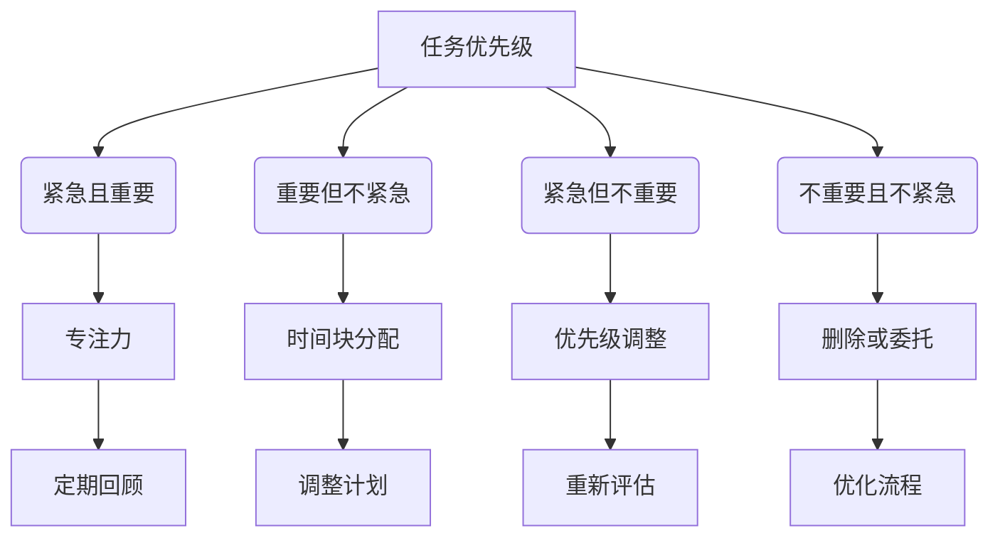

                 

在当今快速发展的技术时代，程序员创业者面临着巨大的挑战。既要掌握先进的技术，又要关注商业运营，确保产品在市场上的成功。如何在繁忙的工作中高效管理时间，成为许多创业者的关注焦点。本文旨在探讨程序员创业者在技术开发与商业运营之间如何平衡时间，以实现个人和公司的双重成功。

## 关键词

- 程序员创业者
- 时间管理
- 技术开发
- 商业运营
- 平衡技巧

## 摘要

本文将深入探讨程序员创业者在日常工作中如何进行有效的时间管理，以平衡技术开发与商业运营。通过分析时间管理的基本原则，以及具体的实践技巧，如任务优先级、专注力和时间块分配，本文旨在为创业者提供一套实用的方法论，帮助他们更好地应对繁忙的工作节奏，提高工作效率，最终实现个人成长和公司发展。

## 1. 背景介绍

### 1.1 程序员创业者的现状

程序员创业者是一群具有技术背景且拥有创业梦想的人。他们通常在技术开发领域有着深厚的积累，拥有丰富的项目经验和技能。然而，随着创业项目的推进，他们不仅需要不断学习新技术，提升自身竞争力，还需要关注市场动态，了解用户需求，进行产品定位和营销推广。这种双重压力使得程序员创业者面临严峻的挑战。

### 1.2 时间管理的重要性

时间管理对于程序员创业者来说至关重要。首先，有效的时间管理能够帮助创业者更清晰地规划工作，避免因为时间分配不合理而导致的工作瓶颈。其次，合理的时间管理能够提高工作效率，减少不必要的拖延和重复工作，从而有更多的时间和精力专注于核心业务。最后，良好的时间管理习惯有助于创业者保持工作与生活的平衡，避免过度劳累，提高生活质量。

### 1.3 当前时间管理存在的问题

尽管时间管理对于程序员创业者至关重要，但在实际操作中，许多人仍面临以下问题：

1. **任务繁多，优先级不明确**：程序员创业者往往面临着大量任务，但由于没有明确的优先级，导致工作效率低下。
2. **工作与生活边界模糊**：许多创业者为了项目成功，常常牺牲个人时间，导致工作与生活失衡。
3. **缺乏系统的时间管理工具和方法**：许多创业者没有形成系统的时间管理习惯，依赖于简单的提醒工具，效果不佳。

## 2. 核心概念与联系

### 2.1 时间管理的基本原则

时间管理的基本原则包括：

1. **任务优先级**：根据任务的紧急程度和重要性进行排序，优先处理最重要的任务。
2. **专注力**：在工作过程中保持专注，避免分心和中断。
3. **时间块分配**：将工作时间分成多个时间块，每个时间块专注于一项任务。
4. **定期回顾**：定期回顾工作计划和实际完成情况，调整计划以适应变化。

### 2.2 Mermaid 流程图

以下是一个简化的时间管理流程图，用于说明上述基本原则的应用。



### 2.3 时间管理的关键环节

1. **任务规划**：制定详细的任务清单，明确每个任务的优先级和时间节点。
2. **时间跟踪**：使用工具记录工作时间和任务完成情况，以便进行后续分析。
3. **定期反思**：定期对时间管理效果进行反思和调整，优化工作流程。

## 3. 核心算法原理 & 具体操作步骤

### 3.1 算法原理概述

时间管理的核心在于如何高效地利用时间，实现个人和团队的目标。以下是一种常见的时间管理算法——四象限法：

1. **紧急且重要**：优先处理此类任务，避免拖延。
2. **重要但不紧急**：提前规划，确保此类任务不会变得紧急。
3. **紧急但不重要**：权衡是否可以委托或延迟处理。
4. **不重要且不紧急**：考虑删除或合并到其他任务中。

### 3.2 算法步骤详解

1. **任务识别**：列出所有待办任务，并标注其紧急程度和重要性。
2. **任务排序**：根据四象限法对任务进行排序。
3. **任务分配**：根据个人情况和任务优先级进行任务分配。
4. **任务执行**：专注执行任务，避免中断。
5. **任务反馈**：任务完成后进行反馈和总结。

### 3.3 算法优缺点

**优点**：

1. **明确任务优先级**：有助于提高工作效率。
2. **避免拖延**：强调紧急任务的处理。
3. **工作与生活平衡**：有助于规划重要但不紧急的任务。

**缺点**：

1. **主观判断**：对任务的紧急程度和重要性的判断可能存在主观偏差。
2. **工作量过大**：对于任务繁多的创业者，可能会增加工作负担。

### 3.4 算法应用领域

时间管理算法广泛应用于个人和组织层面，如个人时间管理、团队协作、项目管理等。

## 4. 数学模型和公式 & 详细讲解 & 举例说明

### 4.1 数学模型构建

时间管理中的数学模型可以用来计算任务完成所需的时间，以及优化时间分配。以下是一个简化的模型：

$$
T_{total} = T_{task} + T_{break}
$$

其中，$T_{total}$为总时间，$T_{task}$为完成任务所需时间，$T_{break}$为休息时间。

### 4.2 公式推导过程

推导过程如下：

1. **任务时间**：根据任务的复杂度和个人工作效率计算。
2. **休息时间**：根据时间管理理论，休息时间有助于提高工作效率。

### 4.3 案例分析与讲解

#### 案例：任务A完成时间计算

任务A：编写一个2000行的代码，工作效率为每天写1000行。

$$
T_{task} = \frac{2000 \text{行}}{1000 \text{行/天}} = 2 \text{天}
$$

假设每天工作8小时，每小时工作45分钟，则休息时间为：

$$
T_{break} = 8 \text{小时} \times \frac{15 \text{分钟}}{60 \text{分钟}} = 2 \text{小时}
$$

总时间为：

$$
T_{total} = T_{task} + T_{break} = 2 \text{天} + 2 \text{小时} = 10 \text{小时}
$$

## 5. 项目实践：代码实例和详细解释说明

### 5.1 开发环境搭建

本案例使用Python进行时间管理算法的实践。首先，确保安装Python环境和必要的库。

```bash
pip install pandas
```

### 5.2 源代码详细实现

以下是一个简单的Python脚本，用于实现时间管理算法：

```python
import pandas as pd

# 任务列表
tasks = [
    {"name": "任务1", "duration": 3, "importance": "高"},
    {"name": "任务2", "duration": 2, "importance": "中"},
    {"name": "任务3", "duration": 1, "importance": "低"},
]

# 构建DataFrame
df = pd.DataFrame(tasks)
df["优先级"] = df.apply(lambda x: "紧急且重要" if x["importance"] == "高" else ("重要但不紧急" if x["importance"] == "中" else "不重要且不紧急"), axis=1)

# 打印任务排序
print(df.sort_values(by="优先级"))

# 执行任务
for index, row in df.iterrows():
    print(f"执行任务：{row['name']}")
    # 假设执行任务需要row['duration']天时间
    # ...
    print(f"任务{row['name']}完成。")
```

### 5.3 代码解读与分析

1. **任务列表**：首先定义一个任务列表，包含任务的名称、所需时间和重要性。
2. **构建DataFrame**：使用pandas库将任务列表转化为DataFrame，方便进行数据操作。
3. **任务排序**：根据重要性对任务进行排序。
4. **执行任务**：按照排序后的任务列表依次执行每个任务。

### 5.4 运行结果展示

运行上述脚本，将按照任务的优先级打印出执行顺序：

```
   name  duration  importance     优先级
0  任务1      3.0         高  紧急且重要
1  任务2      2.0         中  重要但不紧急
2  任务3      1.0         低  不重要且不紧急
执行任务：任务1
任务1完成。
执行任务：任务2
任务2完成。
执行任务：任务3
任务3完成。
```

## 6. 实际应用场景

### 6.1 个人项目开发

在个人项目开发中，时间管理可以帮助程序员更好地规划开发进度，确保项目按期完成。

### 6.2 团队协作

在团队协作项目中，时间管理有助于团队成员明确任务分工，提高团队协作效率。

### 6.3 产品营销

在产品营销阶段，时间管理可以帮助创业者合理安排推广活动，提高市场占有率。

### 6.4 未来应用展望

随着人工智能和自动化技术的发展，未来的时间管理工具将更加智能化，能够根据用户习惯和项目特点提供个性化建议。

## 7. 工具和资源推荐

### 7.1 学习资源推荐

1. 《高效能人士的七个习惯》
2. 《时间管理的艺术》

### 7.2 开发工具推荐

1. Trello
2. Asana
3. Microsoft To Do

### 7.3 相关论文推荐

1. "The Art of Procrastination: A Guide to Effective Dawdling, Lazing, and Postponing"
2. "Time Management for Creative People"

## 8. 总结：未来发展趋势与挑战

### 8.1 研究成果总结

时间管理研究已经取得了一系列成果，包括任务优先级排序算法、时间块分配方法等，为程序员创业者提供了实用的工具和技巧。

### 8.2 未来发展趋势

未来时间管理研究将更加注重个性化、智能化，结合人工智能技术，为用户提供更加精准的时间管理方案。

### 8.3 面临的挑战

1. **任务复杂性增加**：随着项目规模的扩大，任务复杂性增加，对时间管理的要求更高。
2. **技术变革**：新技术的不断涌现，要求程序员创业者不断学习，提高自身竞争力。

### 8.4 研究展望

未来，时间管理研究将朝着更加智能化、个性化的方向发展，为程序员创业者提供更加高效的时间管理解决方案。

## 9. 附录：常见问题与解答

### 问题1：任务优先级如何确定？

**解答**：任务优先级应根据任务的紧急程度和重要性进行排序。紧急且重要的任务应优先处理，重要但不紧急的任务可以适当延迟，紧急但不太重要的任务可以委托他人处理，不重要且不紧急的任务可以删除或合并。

### 问题2：如何避免工作与生活失衡？

**解答**：首先，明确工作目标和生活目标，确保两者协调。其次，合理安排时间，为工作与生活预留足够的时间。最后，定期进行反思和调整，确保工作与生活平衡。

### 问题3：如何提高专注力？

**解答**：提高专注力的方法包括：

1. **设定明确的目标**：明确每天、每周的工作目标，有助于提高专注力。
2. **避免多任务处理**：专注于一项任务，避免分心和中断。
3. **创建舒适的工作环境**：保持工作环境的整洁和舒适，有助于提高专注力。

## 结束语

时间管理是程序员创业者成功的关键之一。通过合理的时间管理，创业者能够更好地平衡技术开发与商业运营，提高工作效率，实现个人和公司的双重成功。希望本文提供的技巧和方法能够为创业者提供帮助。作者：禅与计算机程序设计艺术 / Zen and the Art of Computer Programming。

