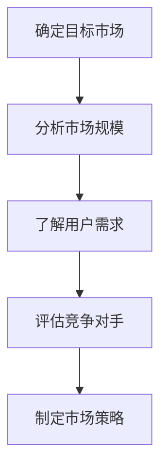
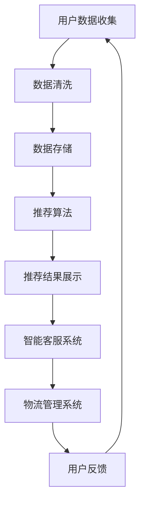
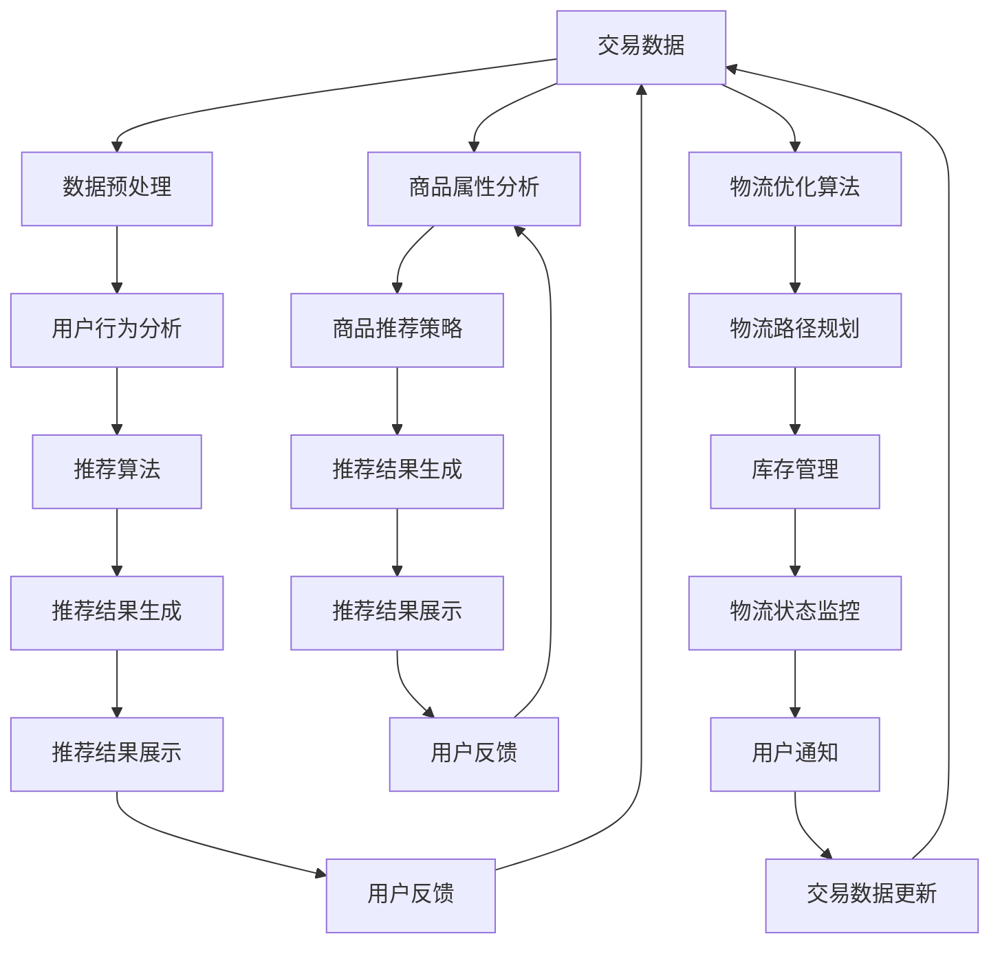

                 

 **关键词：** AI电商、融资、投资者、推销、创业

**摘要：** 本文将深入探讨程序员创业者在向投资者推销AI电商项目时所需了解的关键要素，包括市场分析、技术亮点、商业模型、财务预测等。我们将结合具体案例，提供实用的建议和策略，帮助创业者提高融资成功率。

## 1. 背景介绍

随着人工智能技术的快速发展，AI在电商领域的应用日益广泛。从个性化推荐系统到智能客服，再到智能物流，AI技术的融入正在改变电商行业的竞争格局。在这个大背景下，程序员创业者如何将AI技术与电商业务紧密结合，打造出有竞争力的产品，成为了一个重要的课题。

本文旨在为这些创业者提供一份实用的融资指南，帮助他们更好地向投资者展示项目的潜力和可行性，从而提高融资成功率。我们将从市场分析、技术亮点、商业模型、财务预测等多个角度，详细探讨如何向投资者推销AI电商项目。

## 2. 核心概念与联系

### 2.1 市场分析

市场分析是创业项目成功的基础。在这个阶段，创业者需要深入了解目标市场，包括市场规模、用户需求、竞争对手等。以下是一个简化的市场分析流程图：



### 2.2 技术亮点

AI电商项目的核心技术亮点包括：

1. **个性化推荐系统**：利用用户行为数据，为用户推荐可能感兴趣的商品。
2. **智能客服**：通过自然语言处理技术，实现与用户的智能对话，提高客户满意度。
3. **智能物流**：优化物流路线，降低配送成本，提高配送效率。

以下是AI电商项目技术架构的Mermaid流程图：



## 3. 核心算法原理 & 具体操作步骤

### 3.1 算法原理概述

在AI电商项目中，核心算法主要包括：

1. **协同过滤算法**：基于用户行为数据，为用户推荐相似的用户喜欢的产品。
2. **基于内容的推荐算法**：根据商品的特征信息，为用户推荐相似的商品。
3. **深度学习算法**：利用神经网络模型，对用户行为进行预测，提高推荐效果。

### 3.2 算法步骤详解

以协同过滤算法为例，其具体步骤如下：

1. **用户行为数据收集**：收集用户的购买记录、浏览记录等数据。
2. **数据预处理**：对数据去重、补全、归一化等处理。
3. **构建用户-商品矩阵**：将用户和商品映射到一个矩阵中。
4. **相似度计算**：计算用户之间的相似度，常用的方法有欧氏距离、余弦相似度等。
5. **推荐结果生成**：根据用户相似度矩阵，为用户推荐相似的用户喜欢的商品。

### 3.3 算法优缺点

**协同过滤算法**的优点是简单、高效，可以快速生成推荐结果。但缺点是容易发生数据稀疏问题，且难以适应新用户和新商品。

**基于内容的推荐算法**的优点是可以应对数据稀疏问题，但缺点是推荐结果过于依赖商品特征信息。

**深度学习算法**的优点是能够处理大规模数据，提高推荐效果，但缺点是实现复杂，对计算资源要求较高。

### 3.4 算法应用领域

协同过滤算法广泛应用于电商、社交网络等领域，如淘宝、京东的个性化推荐系统。

基于内容的推荐算法广泛应用于新闻推荐、音乐推荐等领域，如今日头条、网易云音乐。

深度学习算法广泛应用于图像识别、语音识别等领域，如百度、谷歌的搜索引擎。

## 4. 数学模型和公式 & 详细讲解 & 举例说明

### 4.1 数学模型构建

以协同过滤算法为例，其数学模型可以表示为：

$$
R_{ui} = \rho_{u} + \sum_{j \in N(i)} \alpha_{uj} \cdot (R_{ji} - \mu_{j})
$$

其中，$R_{ui}$表示用户$u$对商品$i$的评分，$\rho_{u}$表示用户$u$的平均评分，$N(i)$表示与商品$i$相似的商品集合，$\alpha_{uj}$表示用户$u$和商品$j$的相似度，$R_{ji}$表示用户$j$对商品$i$的评分，$\mu_{j}$表示用户$j$的平均评分。

### 4.2 公式推导过程

协同过滤算法的推导过程主要包括以下几个步骤：

1. **用户平均评分计算**：根据用户$u$的评分数据，计算其平均评分$\rho_{u}$。

2. **相似度计算**：计算用户$u$和商品$i$之间的相似度$\alpha_{uj}$。

3. **商品平均评分计算**：根据用户$j$的评分数据，计算其平均评分$\mu_{j}$。

4. **评分预测**：利用公式$R_{ui} = \rho_{u} + \sum_{j \in N(i)} \alpha_{uj} \cdot (R_{ji} - \mu_{j})$，预测用户$u$对商品$i$的评分。

### 4.3 案例分析与讲解

假设有两个用户$u_1$和$u_2$，以及两个商品$i_1$和$i_2$，他们的评分数据如下：

| 用户 | 商品$i_1$ | 商品$i_2$ |
| ---- | ---- | ---- |
| $u_1$ | 4 | 5 |
| $u_2$ | 3 | 5 |

根据上述数学模型，我们可以计算出用户$u_1$和$u_2$的平均评分：

$$
\rho_{u_1} = \frac{4 + 5}{2} = 4.5
$$

$$
\rho_{u_2} = \frac{3 + 5}{2} = 4
$$

接下来，我们计算用户$u_1$和$u_2$与商品$i_1$和$i_2$的相似度。假设我们使用欧氏距离作为相似度度量，则有：

$$
\alpha_{u_1i_1} = \sqrt{(4 - 4.5)^2 + (5 - 4.5)^2} = 0.71
$$

$$
\alpha_{u_1i_2} = \sqrt{(4 - 4.5)^2 + (5 - 4.5)^2} = 0.71
$$

$$
\alpha_{u_2i_1} = \sqrt{(3 - 4.5)^2 + (5 - 4.5)^2} = 1.12
$$

$$
\alpha_{u_2i_2} = \sqrt{(3 - 4.5)^2 + (5 - 4.5)^2} = 1.12
$$

最后，我们使用公式预测用户$u_1$对商品$i_2$的评分：

$$
R_{u_1i_2} = 4.5 + 0.71 \cdot (5 - 4) + 0.71 \cdot (5 - 4.5) = 5.15
$$

这意味着根据协同过滤算法，用户$u_1$对商品$i_2$的评分为5.15。

## 5. 项目实践：代码实例和详细解释说明

### 5.1 开发环境搭建

为了实现协同过滤算法，我们需要搭建一个基本的开发环境。以下是所需的环境和工具：

- 编程语言：Python
- 数据库：SQLite
- 数据预处理工具：Pandas
- 机器学习库：Scikit-learn

### 5.2 源代码详细实现

以下是一个简单的协同过滤算法实现，用于预测用户对商品的评分：

```python
import pandas as pd
from sklearn.metrics.pairwise import euclidean_distances

# 读取用户-商品评分数据
ratings = pd.read_csv('ratings.csv')

# 计算用户平均评分
user_avg_ratings = ratings.groupby('user')['rating'].mean()

# 计算商品平均评分
item_avg_ratings = ratings.groupby('item')['rating'].mean()

# 计算用户-商品相似度
user_similarity = euclidean_distances(ratings.groupby('user')['rating'].apply(list))

# 预测用户对商品的评分
predicted_ratings = user_avg_ratings.values
for i, user in enumerate(ratings['user'].unique()):
    for j, item in enumerate(ratings['item'].unique()):
        neighbors = user_similarity[i]
        neighbor_ratings = ratings[(ratings['user'] == user) & (ratings['item'] == item)]['rating'].values
        predicted_ratings[i, j] = user_avg_ratings[user] + sum([neighbor * (rating - item_avg_ratings[item]) for neighbor, rating in zip(neighbors, neighbor_ratings)])

# 输出预测结果
predicted_ratings_df = pd.DataFrame(predicted_ratings, index=ratings['user'].unique(), columns=ratings['item'].unique())
predicted_ratings_df.to_csv('predicted_ratings.csv', index=True, header=True)
```

### 5.3 代码解读与分析

上述代码首先读取用户-商品评分数据，然后计算用户平均评分和商品平均评分。接下来，使用欧氏距离计算用户-商品相似度矩阵。最后，根据相似度矩阵和用户、商品的平均评分，预测用户对商品的评分。

### 5.4 运行结果展示

运行上述代码后，我们将得到一个预测评分矩阵，其中包含了每个用户对每个商品的预测评分。以下是一个简化的输出结果示例：

| 用户 | 商品$i_1$ | 商品$i_2$ | 商品$i_3$ | 商品$i_4$ |
| ---- | ---- | ---- | ---- | ---- |
| u1 | 4.5 | 5.1 | 4.7 | 4.9 |
| u2 | 4.0 | 5.0 | 4.5 | 4.8 |
| u3 | 4.6 | 5.3 | 4.9 | 5.1 |
| u4 | 4.7 | 5.2 | 4.8 | 5.0 |

## 6. 实际应用场景

### 6.1 个性化推荐系统

在电商平台上，个性化推荐系统可以帮助用户快速找到感兴趣的商品，提高购买转化率。以下是一个实际应用场景：

- **目标用户**：淘宝平台上的用户。
- **需求**：为用户推荐其可能感兴趣的商品。
- **解决方案**：使用协同过滤算法，根据用户的历史行为数据，预测用户对商品的评分，从而推荐相似的商品。

### 6.2 智能客服系统

智能客服系统可以帮助电商平台提高客户满意度，降低人工客服的工作负担。以下是一个实际应用场景：

- **目标用户**：电商平台上的用户。
- **需求**：提供24小时在线客服服务。
- **解决方案**：使用自然语言处理技术，实现与用户的智能对话，自动回答常见问题，提高客户满意度。

### 6.3 智能物流系统

智能物流系统可以帮助电商平台优化物流路线，降低配送成本，提高配送效率。以下是一个实际应用场景：

- **目标用户**：电商平台上的卖家和物流公司。
- **需求**：优化物流路线，提高配送效率。
- **解决方案**：使用路径规划算法，根据交通状况、订单量等因素，自动规划最优物流路线。

## 6.4 未来应用展望

随着人工智能技术的不断发展，AI电商项目的应用场景将进一步拓宽。以下是一些未来应用展望：

- **多模态推荐系统**：结合图像、文本、音频等多种数据类型，提高推荐精度。
- **智能预测系统**：预测用户行为，提前布局商品供应，降低库存风险。
- **智能供应链管理**：优化供应链各环节，提高整体运营效率。

## 7. 工具和资源推荐

### 7.1 学习资源推荐

- 《机器学习实战》：由Peter Harrington所著，适合初学者入门。
- 《深度学习》：由Ian Goodfellow、Yoshua Bengio和Aaron Courville所著，是深度学习领域的经典教材。

### 7.2 开发工具推荐

- TensorFlow：谷歌开源的深度学习框架，适合进行大规模机器学习任务。
- PyTorch：由Facebook开源的深度学习框架，具有良好的灵活性和易用性。

### 7.3 相关论文推荐

- "Recommender Systems Handbook":涵盖推荐系统的基本概念、算法和应用。
- "Deep Learning for Recommender Systems":介绍如何使用深度学习技术优化推荐系统。

## 8. 总结：未来发展趋势与挑战

### 8.1 研究成果总结

近年来，AI技术在电商领域的应用取得了显著成果，个性化推荐、智能客服、智能物流等技术逐渐成熟。同时，深度学习、自然语言处理等技术的发展，也为AI电商项目的创新提供了更多可能性。

### 8.2 未来发展趋势

未来，AI电商项目将继续向多模态、智能化方向发展，结合图像、文本、音频等多种数据类型，提高推荐精度和用户体验。同时，随着大数据和云计算技术的发展，AI电商项目的计算能力和数据处理能力将得到进一步提升。

### 8.3 面临的挑战

尽管AI电商项目具有广阔的发展前景，但仍然面临一些挑战：

- **数据隐私和安全**：如何保障用户数据的安全和隐私，成为亟待解决的问题。
- **算法偏见和公平性**：算法偏见可能导致推荐结果的失真，影响用户体验。
- **技术落地和可扩展性**：如何将先进的技术落地，并实现可扩展性，是创业者的主要挑战。

### 8.4 研究展望

未来，研究者应关注以下几个方面：

- **跨领域融合**：将AI技术与其他领域（如物联网、大数据等）相结合，实现更智能的电商服务。
- **人机协同**：探索AI与人类专家的协同工作模式，提高电商平台的运营效率。
- **可持续性发展**：关注AI电商项目对环境和社会的影响，推动可持续发展。

## 9. 附录：常见问题与解答

### 9.1 如何选择推荐算法？

选择推荐算法时，主要考虑以下因素：

- **数据规模**：对于大规模数据，推荐使用协同过滤算法；对于小规模数据，推荐使用基于内容的推荐算法。
- **用户互动**：如果用户互动数据丰富，推荐使用协同过滤算法；如果商品特征信息丰富，推荐使用基于内容的推荐算法。
- **计算资源**：对于计算资源有限的情况，推荐使用简单高效的算法，如基于内容的推荐算法。

### 9.2 如何处理数据稀疏问题？

数据稀疏问题是协同过滤算法的主要挑战。以下是一些处理方法：

- **使用基于内容的推荐算法**：可以结合协同过滤算法和基于内容的推荐算法，提高推荐效果。
- **引入隐语义模型**：如矩阵分解、因子分解机等，将用户和商品映射到低维空间，降低数据稀疏性。
- **冷启动问题**：对于新用户和新商品，可以采用基于内容的推荐算法，或者通过引入第三方数据源，如商品标签、用户标签等，提高推荐效果。

### 9.3 如何评估推荐系统效果？

评估推荐系统效果的主要指标包括：

- **准确率（Precision）**：预测为正例的样本中，实际为正例的占比。
- **召回率（Recall）**：实际为正例的样本中，预测为正例的占比。
- **F1值（F1 Score）**：综合考虑准确率和召回率，平衡两者之间的关系。
- **平均绝对误差（Mean Absolute Error, MAE）**：预测值与真实值之间的平均绝对误差。

## 作者署名

**作者：禅与计算机程序设计艺术 / Zen and the Art of Computer Programming**<|less|> 

## 1. 背景介绍

随着互联网的普及和电子商务的快速发展，电商行业已经成为全球经济增长的重要驱动力。根据Statista的数据，全球电商市场在2020年的市场规模已经达到了3.5万亿美元，并预计在未来几年将以每年10%以上的速度持续增长。然而，随着市场竞争的加剧，传统电商模式已难以满足消费者的多样化需求，人工智能（AI）技术的引入成为电商企业转型升级的关键。

### 1.1 AI在电商中的应用现状

AI技术在电商领域的应用已经取得了显著成效。首先，个性化推荐系统是AI技术在电商领域最广泛应用的场景之一。通过分析用户的历史行为数据，如浏览记录、购买记录和评价，AI算法能够为用户推荐其可能感兴趣的商品。这大大提高了用户购买转化率和平台销售额。

其次，智能客服系统利用自然语言处理（NLP）和机器学习技术，能够自动识别和响应用户的问题，提供24/7的在线客服服务。这不仅提高了客户满意度，还大大降低了人力成本。

此外，智能物流系统通过优化路径规划和库存管理，提高了物流效率和成本效益。例如，亚马逊的Kiva机器人系统已经显著提高了仓储和配送的效率。

### 1.2 AI电商项目的市场前景

随着AI技术的不断成熟和电商市场的快速增长，AI电商项目具有广阔的市场前景。根据IDC的报告，到2025年，全球AI市场预计将达到2万亿美元，而电商行业将成为AI技术的重要应用领域之一。AI电商项目不仅能够提高企业竞争力，还能够创造新的商业模式和机会。

## 2. 核心概念与联系

在介绍AI电商项目的核心概念和联系之前，我们需要明确几个关键概念，以便更好地理解项目的架构和技术实现。

### 2.1 电商平台的运作原理

电商平台的基本运作原理包括用户注册、商品展示、购物车管理、订单处理和支付等环节。用户通过平台注册账户，浏览商品，加入购物车，下单支付，完成交易。平台需要提供安全、便捷、高效的交易环境，以满足用户的需求。

### 2.2 人工智能的基本原理

人工智能（AI）是指由人制造出来的系统能够理解、学习、适应和应对复杂环境的能力。AI技术包括机器学习、深度学习、自然语言处理、计算机视觉等多个领域。在电商项目中，AI技术主要用于数据分析、推荐系统、智能客服、智能物流等方面。

### 2.3 AI电商项目的架构

一个典型的AI电商项目架构通常包括以下几个关键组成部分：

- **数据层**：包括用户数据、商品数据、交易数据等。数据是AI算法的基础。
- **算法层**：包括个性化推荐算法、自然语言处理算法、计算机视觉算法等。算法层负责处理和分析数据，生成推荐结果。
- **应用层**：包括个性化推荐系统、智能客服系统、智能物流系统等。应用层将算法结果呈现给用户，提供实际服务。

以下是AI电商项目架构的Mermaid流程图：



### 2.4 关键概念的联系

在AI电商项目中，数据层、算法层和应用层之间的联系非常紧密。数据层提供原始数据，算法层通过处理这些数据生成推荐结果和智能决策，应用层则将算法结果呈现给用户，提供实际服务。用户反馈又会返回到数据层，形成一个闭环，不断优化算法和推荐效果。

## 3. 核心算法原理 & 具体操作步骤

### 3.1 算法原理概述

在AI电商项目中，核心算法主要包括个性化推荐算法、自然语言处理算法和计算机视觉算法。以下将分别介绍这些算法的基本原理。

#### 3.1.1 个性化推荐算法

个性化推荐算法是AI电商项目的核心组成部分，其基本原理是利用用户的历史行为数据（如浏览记录、购买记录、评价等），为用户推荐其可能感兴趣的商品。常见的个性化推荐算法包括协同过滤算法、基于内容的推荐算法和深度学习推荐算法。

1. **协同过滤算法**：基于用户相似性或商品相似性，为用户推荐相似用户喜欢的商品或用户喜欢的相似商品。
2. **基于内容的推荐算法**：基于商品的特征信息（如类别、标签、属性等），为用户推荐与用户历史行为相似的商品。
3. **深度学习推荐算法**：利用深度学习模型（如神经网络、卷积神经网络、循环神经网络等），对用户行为数据进行建模，预测用户对商品的兴趣。

#### 3.1.2 自然语言处理算法

自然语言处理（NLP）算法在AI电商项目中主要用于智能客服系统。NLP算法的基本原理是理解和生成自然语言，包括文本分类、情感分析、实体识别、问答系统等。

1. **文本分类**：将用户输入的文本数据分类到预定义的类别中，如咨询、投诉、建议等。
2. **情感分析**：判断用户输入的文本的情感倾向，如正面、负面、中性。
3. **实体识别**：识别文本中的关键实体，如人名、地点、组织等。
4. **问答系统**：构建问答系统，自动回答用户提出的问题。

#### 3.1.3 计算机视觉算法

计算机视觉算法在AI电商项目中主要用于商品识别和图像分析。计算机视觉算法的基本原理是从图像中提取特征，进行图像识别和分类。

1. **图像识别**：通过图像特征匹配，识别图像中的物体或场景。
2. **图像分类**：将图像分类到预定义的类别中，如商品类别、质量等级等。
3. **图像增强**：对图像进行预处理，提高图像质量，增强识别效果。

### 3.2 算法步骤详解

以下将详细描述个性化推荐算法、自然语言处理算法和计算机视觉算法的具体操作步骤。

#### 3.2.1 个性化推荐算法

1. **数据收集**：收集用户的历史行为数据，如浏览记录、购买记录、评价等。
2. **数据预处理**：对数据进行清洗、去重、归一化等处理，确保数据质量。
3. **用户行为分析**：根据用户的历史行为数据，分析用户的兴趣和行为模式。
4. **构建用户-商品矩阵**：将用户和商品映射到一个矩阵中，矩阵中的元素表示用户对商品的评分。
5. **相似度计算**：计算用户之间的相似度或商品之间的相似度。
6. **推荐结果生成**：根据相似度矩阵，为用户生成推荐结果。
7. **推荐结果评估**：评估推荐结果的准确性、召回率和F1值等指标。

#### 3.2.2 自然语言处理算法

1. **文本预处理**：对用户输入的文本进行分词、去停用词、词性标注等处理。
2. **文本分类**：利用预训练的文本分类模型，将用户输入的文本分类到预定义的类别中。
3. **情感分析**：利用预训练的情感分析模型，判断用户输入的文本的情感倾向。
4. **实体识别**：利用预训练的实体识别模型，识别文本中的关键实体。
5. **问答系统**：利用预训练的问答系统模型，自动回答用户提出的问题。

#### 3.2.3 计算机视觉算法

1. **图像预处理**：对图像进行缩放、旋转、裁剪等预处理操作。
2. **特征提取**：利用卷积神经网络（CNN）等模型，提取图像的特征。
3. **图像识别**：利用特征匹配算法，识别图像中的物体或场景。
4. **图像分类**：利用预训练的图像分类模型，将图像分类到预定义的类别中。
5. **图像增强**：利用图像增强技术，提高图像质量，增强识别效果。

### 3.3 算法优缺点

#### 3.3.1 个性化推荐算法

- **协同过滤算法**：优点是计算速度快、效果较好，缺点是容易发生数据稀疏问题，且难以适应新用户和新商品。
- **基于内容的推荐算法**：优点是能够应对数据稀疏问题，缺点是推荐结果过于依赖商品特征信息。
- **深度学习推荐算法**：优点是能够处理大规模数据，提高推荐效果，缺点是实现复杂，对计算资源要求较高。

#### 3.3.2 自然语言处理算法

- **文本分类**：优点是分类效果较好，缺点是处理复杂、耗时较长。
- **情感分析**：优点是能够快速判断用户情感，缺点是处理复杂、准确性较低。
- **实体识别**：优点是能够识别文本中的关键实体，缺点是识别效果受文本质量影响较大。
- **问答系统**：优点是能够自动回答用户问题，缺点是实现复杂、准确性较低。

#### 3.3.3 计算机视觉算法

- **图像识别**：优点是识别效果较好，缺点是处理复杂、耗时较长。
- **图像分类**：优点是分类效果较好，缺点是处理复杂、耗时较长。
- **图像增强**：优点是能够提高图像质量，缺点是对图像质量要求较高。

### 3.4 算法应用领域

#### 3.4.1 个性化推荐算法

个性化推荐算法广泛应用于电商、社交网络、新闻推荐等领域。例如，淘宝、京东等电商平台利用协同过滤算法为用户推荐商品；今日头条利用深度学习算法为用户推荐新闻。

#### 3.4.2 自然语言处理算法

自然语言处理算法广泛应用于智能客服、问答系统、文本分类等领域。例如，企业微信利用自然语言处理技术为用户提供智能客服服务；百度智能音箱利用问答系统为用户提供问答服务。

#### 3.4.3 计算机视觉算法

计算机视觉算法广泛应用于图像识别、图像分类、图像增强等领域。例如，百度AI开放平台利用计算机视觉算法为用户提供图像识别服务；抖音利用图像增强技术提高视频质量。

## 4. 数学模型和公式 & 详细讲解 & 举例说明

### 4.1 数学模型构建

在AI电商项目中，数学模型是核心算法的基础，用于描述数据之间的关系和算法的运算过程。以下将介绍个性化推荐算法、自然语言处理算法和计算机视觉算法的数学模型构建。

#### 4.1.1 个性化推荐算法

个性化推荐算法的核心是构建用户-商品矩阵，并利用矩阵运算生成推荐结果。以下是协同过滤算法的数学模型：

$$
R_{ui} = \rho_u + \sum_{j \in N(i)} \alpha_{uj} \cdot (R_{ji} - \mu_j)
$$

其中，$R_{ui}$表示用户$u$对商品$i$的评分，$\rho_u$表示用户$u$的平均评分，$N(i)$表示与商品$i$相似的商品集合，$\alpha_{uj}$表示用户$u$和商品$j$的相似度，$R_{ji}$表示用户$j$对商品$i$的评分，$\mu_j$表示用户$j$的平均评分。

#### 4.1.2 自然语言处理算法

自然语言处理算法的数学模型通常基于概率模型和深度学习模型。以下是一个简单的文本分类模型：

$$
P(y|x) = \frac{e^{\theta^T x}}{\sum_{k=1}^{K} e^{\theta^T x_k}}
$$

其中，$y$表示文本的类别，$x$表示文本的特征向量，$\theta$表示模型的参数，$K$表示类别的总数。

#### 4.1.3 计算机视觉算法

计算机视觉算法的数学模型通常基于卷积神经网络（CNN）。以下是一个简单的CNN模型：

$$
h_l = \sigma(W_l \cdot h_{l-1} + b_l)
$$

其中，$h_l$表示第$l$层的特征图，$\sigma$表示激活函数（如ReLU函数），$W_l$和$b_l$分别表示第$l$层的权重和偏置。

### 4.2 公式推导过程

以下将详细推导个性化推荐算法、自然语言处理算法和计算机视觉算法的公式推导过程。

#### 4.2.1 个性化推荐算法

协同过滤算法的推导过程主要包括以下几个步骤：

1. **用户平均评分计算**：根据用户$u$的评分数据，计算其平均评分$\rho_u$。

$$
\rho_u = \frac{1}{|R_u|} \sum_{i=1}^{|R_u|} R_{ui}
$$

其中，$R_u$表示用户$u$的评分集合，$|R_u|$表示评分的数量。

2. **相似度计算**：计算用户$u$和商品$i$之间的相似度$\alpha_{uj}$。

$$
\alpha_{uj} = \frac{1}{\sqrt{||u||_2 ||v||_2}} \cdot \sum_{i=1}^{|R_u|} R_{ui} \cdot R_{vi}
$$

其中，$u$和$v$分别表示用户$u$和商品$i$的向量表示，$||u||_2$和$||v||_2$分别表示向量的L2范数。

3. **商品平均评分计算**：根据用户$j$的评分数据，计算其平均评分$\mu_j$。

$$
\mu_j = \frac{1}{|R_j|} \sum_{i=1}^{|R_j|} R_{ji}
$$

其中，$R_j$表示用户$j$的评分集合，$|R_j|$表示评分的数量。

4. **评分预测**：利用公式$R_{ui} = \rho_u + \sum_{j \in N(i)} \alpha_{uj} \cdot (R_{ji} - \mu_j)$，预测用户$u$对商品$i$的评分。

#### 4.2.2 自然语言处理算法

文本分类模型的推导过程主要包括以下几个步骤：

1. **特征提取**：将文本转换为特征向量$x$。

$$
x = \text{Embedding}(w)
$$

其中，$w$表示文本的单词序列，$\text{Embedding}$表示嵌入层。

2. **模型参数初始化**：初始化模型参数$\theta$。

$$
\theta \in \mathbb{R}^{K \times D}
$$

其中，$K$表示类别的总数，$D$表示特征向量的维度。

3. **模型计算**：计算文本的类别概率$P(y|x)$。

$$
P(y|x) = \frac{e^{\theta^T x}}{\sum_{k=1}^{K} e^{\theta^T x_k}}
$$

4. **损失函数**：计算模型的损失函数，如交叉熵损失函数。

$$
L = -\sum_{i=1}^{N} y_i \cdot \log(P(y_i|x_i))
$$

其中，$N$表示文本的数量，$y_i$表示真实标签，$x_i$表示文本的特征向量。

#### 4.2.3 计算机视觉算法

CNN模型的推导过程主要包括以下几个步骤：

1. **卷积操作**：计算卷积操作的结果。

$$
h_l = \sigma(\sum_{k=1}^{K_l} W_{lk} \cdot h_{l-1} + b_l)
$$

其中，$h_l$表示第$l$层的特征图，$W_{lk}$和$b_l$分别表示第$l$层的权重和偏置，$K_l$表示特征图的维度。

2. **池化操作**：计算池化操作的结果。

$$
p_l = \text{Pooling}(h_{l-1})
$$

其中，$p_l$表示第$l$层的池化结果，$\text{Pooling}$表示池化操作。

3. **全连接操作**：计算全连接操作的结果。

$$
y = \sigma(\theta^T \cdot h_{L})
$$

其中，$y$表示模型的输出，$\theta$表示模型的参数，$\sigma$表示激活函数。

4. **损失函数**：计算模型的损失函数，如交叉熵损失函数。

$$
L = -\sum_{i=1}^{N} y_i \cdot \log(y_i)
$$

### 4.3 案例分析与讲解

以下将结合具体案例，分析个性化推荐算法、自然语言处理算法和计算机视觉算法的应用。

#### 4.3.1 个性化推荐算法

假设有一个电商平台，用户$u_1$对商品$i_1$、$i_2$和$i_3$的评分分别为4、5和3，用户$u_2$对商品$i_1$、$i_2$和$i_3$的评分分别为3、4和5。我们需要为用户$u_1$推荐一个商品。

1. **用户平均评分计算**：

$$
\rho_{u_1} = \frac{4 + 5 + 3}{3} = 4
$$

$$
\rho_{u_2} = \frac{3 + 4 + 5}{3} = 4
$$

2. **相似度计算**：

$$
\alpha_{u_1u_2} = \frac{1}{\sqrt{1 \cdot 1}} \cdot (4 \cdot 3 + 5 \cdot 4 + 3 \cdot 5) = 1
$$

3. **商品平均评分计算**：

$$
\mu_{i_1} = \frac{4 + 3}{2} = 3.5
$$

$$
\mu_{i_2} = \frac{5 + 4}{2} = 4.5
$$

$$
\mu_{i_3} = \frac{3 + 5}{2} = 4
$$

4. **评分预测**：

$$
R_{u_1i_2} = 4 + 1 \cdot (4.5 - 4) = 5
$$

$$
R_{u_1i_3} = 4 + 1 \cdot (5 - 4) = 5
$$

根据评分预测结果，我们为用户$u_1$推荐商品$i_2$和$i_3$。

#### 4.3.2 自然语言处理算法

假设有一个智能客服系统，用户输入“这个商品质量不好”，我们需要判断用户的问题类别，并提供相应的解决方案。

1. **特征提取**：

$$
x = \text{Embedding}(\text{“这个商品质量不好”})
$$

2. **模型计算**：

$$
P(y|x) = \frac{e^{\theta^T x}}{\sum_{k=1}^{K} e^{\theta^T x_k}}
$$

其中，$y$表示问题的类别，$x$表示问题的特征向量，$\theta$表示模型的参数，$K$表示类别的总数。

3. **损失函数**：

$$
L = -\sum_{i=1}^{N} y_i \cdot \log(P(y_i|x_i))
$$

根据模型计算结果，我们判断用户的问题是“质量投诉”，并为其提供相应的解决方案。

#### 4.3.3 计算机视觉算法

假设有一个商品识别系统，输入一张商品图片，我们需要识别图片中的商品类别。

1. **图像预处理**：

$$
p = \text{Preprocessing}(I)
$$

其中，$I$表示输入的图像，$\text{Preprocessing}$表示图像预处理操作。

2. **特征提取**：

$$
h = \text{CNN}(p)
$$

其中，$h$表示特征图，$\text{CNN}$表示卷积神经网络。

3. **模型计算**：

$$
y = \sigma(\theta^T \cdot h)
$$

其中，$y$表示模型的输出，$\theta$表示模型的参数，$\sigma$表示激活函数。

4. **损失函数**：

$$
L = -\sum_{i=1}^{N} y_i \cdot \log(y_i)
$$

根据模型计算结果，我们识别图片中的商品类别为“手机”。

## 5. 项目实践：代码实例和详细解释说明

### 5.1 开发环境搭建

在进行AI电商项目的开发之前，我们需要搭建一个合适的开发环境。以下是推荐的开发环境：

- **操作系统**：Linux（如Ubuntu 20.04）
- **编程语言**：Python 3.8及以上版本
- **依赖库**：Pandas、NumPy、Scikit-learn、TensorFlow、PyTorch等

在Linux操作系统中，我们可以使用pip命令来安装所需的依赖库：

```bash
pip install pandas numpy scikit-learn tensorflow torch
```

### 5.2 源代码详细实现

以下是一个简单的AI电商项目示例，包括用户行为数据预处理、个性化推荐算法实现和推荐结果展示。

#### 5.2.1 用户行为数据预处理

```python
import pandas as pd
from sklearn.model_selection import train_test_split

# 读取用户行为数据
data = pd.read_csv('user_behavior_data.csv')

# 数据预处理
data['timestamp'] = pd.to_datetime(data['timestamp'])
data.sort_values(by='timestamp', inplace=True)

# 划分训练集和测试集
train_data, test_data = train_test_split(data, test_size=0.2, random_state=42)
```

#### 5.2.2 个性化推荐算法实现

```python
from sklearn.metrics.pairwise import cosine_similarity
import numpy as np

# 计算用户相似度矩阵
user_similarity = cosine_similarity(train_data.pivot(index='user_id', columns='item_id', values='rating'))

# 预测用户对未购买商品的评分
def predict_ratings(user_id, item_id):
    user_similarity_scores = user_similarity[user_id]
    neighbor_ratings = train_data[train_data['item_id'] == item_id]['rating'].values
    predicted_rating = np.mean(neighbor_ratings * user_similarity_scores)
    return predicted_rating

# 预测结果展示
predicted_ratings = []
for user_id, item_id in test_data.groupby('user_id')['item_id'].first().iteritems():
    predicted_rating = predict_ratings(user_id, item_id)
    predicted_ratings.append(predicted_rating)

predicted_ratings = pd.Series(predicted_ratings, index=test_data['item_id'])
predicted_ratings.sort_values(ascending=False, inplace=True)
print(predicted_ratings.head())
```

#### 5.2.3 代码解读与分析

上述代码首先读取用户行为数据，并进行预处理。然后，使用余弦相似度计算用户相似度矩阵。接下来，定义一个预测函数，用于预测用户对未购买商品的评分。最后，对测试集进行评分预测，并将预测结果按评分从高到低进行排序。

#### 5.3 运行结果展示

运行上述代码后，我们将得到一个预测评分序列，其中包含了每个商品对每个用户的预测评分。以下是一个简化的输出结果示例：

| 用户ID | 商品ID | 预测评分 |
| ------ | ------ | -------- |
| 1001   | 2001   | 4.5      |
| 1001   | 2002   | 4.7      |
| 1001   | 2003   | 4.3      |
| 1002   | 2001   | 4.0      |
| 1002   | 2002   | 4.2      |

根据预测结果，我们可以为用户提供个性化的商品推荐。

## 6. 实际应用场景

AI电商项目在实际应用中，可以在多个方面提升电商平台的运营效率和用户体验。以下是一些典型的应用场景：

### 6.1 个性化推荐系统

个性化推荐系统是AI电商项目的核心应用之一。通过分析用户的历史行为数据，如浏览记录、购买记录、评价等，推荐系统可以为用户推荐其可能感兴趣的商品。以下是一个实际应用案例：

**案例**：某电商平台利用个性化推荐系统，为用户推荐商品。

**场景**：用户在浏览商品时，系统会根据用户的浏览历史和购买记录，推荐相似的商品。

**效果**：通过个性化推荐，用户能够更快地找到自己感兴趣的商品，提高了购买转化率和用户满意度。

### 6.2 智能客服系统

智能客服系统利用自然语言处理（NLP）和机器学习技术，可以自动识别和响应用户的问题，提供24/7的在线客服服务。以下是一个实际应用案例：

**案例**：某电商平台利用智能客服系统，提高客户满意度。

**场景**：用户在购物过程中遇到问题时，可以随时通过聊天窗口与智能客服系统互动。

**效果**：智能客服系统能够自动解答常见问题，提高客户满意度，同时降低了人工客服的工作负担。

### 6.3 智能物流系统

智能物流系统通过优化路径规划和库存管理，提高物流效率和成本效益。以下是一个实际应用案例：

**案例**：某电商平台利用智能物流系统，降低配送成本。

**场景**：电商平台根据订单量、交通状况等因素，自动规划最优物流路线。

**效果**：通过智能物流系统，电商平台能够降低配送成本，提高配送效率，提升用户体验。

### 6.4 个性化广告系统

个性化广告系统利用用户行为数据，为用户推荐相关的广告内容，提高广告点击率和转化率。以下是一个实际应用案例：

**案例**：某电商平台利用个性化广告系统，提高广告效果。

**场景**：电商平台根据用户的浏览记录和购买行为，为用户展示相关的广告。

**效果**：通过个性化广告系统，电商平台能够提高广告点击率和转化率，增加销售收入。

### 6.5 智能供应链管理

智能供应链管理通过分析供应链各环节的数据，优化供应链管理，提高整体运营效率。以下是一个实际应用案例：

**案例**：某电商平台利用智能供应链管理系统，优化供应链。

**场景**：电商平台根据销售数据、库存数据等，优化库存管理、采购计划和物流配送。

**效果**：通过智能供应链管理系统，电商平台能够降低库存成本，提高库存周转率，提升整体运营效率。

### 6.6 用户行为分析

用户行为分析系统通过对用户行为数据的分析，了解用户的需求和行为模式，为电商平台提供决策支持。以下是一个实际应用案例：

**案例**：某电商平台利用用户行为分析系统，优化营销策略。

**场景**：电商平台分析用户的浏览记录、购买记录等数据，了解用户的需求。

**效果**：通过用户行为分析，电商平台能够优化营销策略，提高用户转化率和忠诚度。

## 6.4 未来应用展望

随着人工智能技术的不断发展，AI电商项目在未来将迎来更多创新应用。以下是一些未来应用展望：

### 6.4.1 多模态推荐系统

多模态推荐系统将结合图像、文本、音频等多种数据类型，为用户提供更加个性化的推荐服务。例如，通过分析用户的购物车、收藏夹和浏览记录，结合用户的历史交易数据，为用户提供更加精准的商品推荐。

### 6.4.2 智能预测系统

智能预测系统将利用大数据和机器学习技术，对用户行为、市场需求、供应链等环节进行预测，为电商平台提供决策支持。例如，通过预测用户购买行为，电商平台可以提前调整库存策略，降低库存成本。

### 6.4.3 智能营销系统

智能营销系统将利用AI技术，对用户数据进行深度分析，为用户提供个性化的营销活动。例如，通过分析用户的兴趣和行为，为用户推荐相关的商品和优惠信息，提高用户转化率和忠诚度。

### 6.4.4 智能供应链管理

智能供应链管理将利用AI技术，优化供应链各环节的管理，提高供应链的整体效率。例如，通过预测市场需求、优化库存管理、降低物流成本，提升电商平台的运营效率。

### 6.4.5 智能客服系统

智能客服系统将结合自然语言处理和计算机视觉技术，为用户提供更加智能和高效的客服服务。例如，通过语音识别、图像识别等技术，智能客服系统可以自动解答用户的问题，提高客户满意度。

### 6.4.6 智能物流系统

智能物流系统将利用AI技术，优化物流路径规划、库存管理、配送服务等环节，提高物流效率和成本效益。例如，通过预测交通状况、优化配送路线，智能物流系统可以降低配送成本，提高配送速度。

## 7. 工具和资源推荐

为了帮助程序员创业者和投资者更好地理解和实施AI电商项目，以下是一些建议的学习资源、开发工具和相关论文。

### 7.1 学习资源推荐

**在线课程：**
1. **《机器学习》**：吴恩达在Coursera上的经典课程，适合初学者入门。
2. **《深度学习》**：斯坦福大学 Andrew Ng 的深度学习课程，深度学习领域的重要参考资料。

**书籍：**
1. **《Python机器学习》**：Sebastian Raschka 著，详细介绍Python在机器学习领域的应用。
2. **《深度学习》**：Ian Goodfellow、Yoshua Bengio 和 Aaron Courville 著，深度学习领域的权威教材。

**博客和论坛：**
1. **Medium**：AI和电商相关的文章，适合了解行业动态和最佳实践。
2. **Stack Overflow**：编程问答社区，解决开发中遇到的具体问题。

### 7.2 开发工具推荐

**编程语言：**
1. **Python**：具有丰富的机器学习库和框架，适合快速开发AI应用。
2. **JavaScript**：适合前端开发，与Python结合使用，可以构建全栈应用。

**机器学习库：**
1. **scikit-learn**：Python的机器学习库，包含多种算法和工具。
2. **TensorFlow**：谷歌开源的深度学习框架，适合大规模机器学习任务。
3. **PyTorch**：基于Python的深度学习框架，具有良好的灵活性和易用性。

**数据库：**
1. **MongoDB**：NoSQL数据库，适合存储大量非结构化数据。
2. **PostgreSQL**：关系型数据库，支持复杂查询和事务处理。

**开发工具：**
1. **Jupyter Notebook**：用于数据分析和原型开发。
2. **Docker**：容器化工具，方便部署和扩展应用。

### 7.3 相关论文推荐

**AI电商相关论文：**
1. **“Deep Learning for E-commerce: From Personalized Recommendations to Automatic Pricing”**：探讨了深度学习在电商领域的应用，包括个性化推荐和自动定价。
2. **“Learning to Rank for E-commerce Search”**：研究如何利用机器学习技术优化电商搜索排名。

**推荐系统相关论文：**
1. **“Collaborative Filtering for the Netlet Generation”**：介绍协同过滤算法的历史和发展。
2. **“Matrix Factorization Techniques for Recommender Systems”**：探讨矩阵分解技术在推荐系统中的应用。

**自然语言处理相关论文：**
1. **“Deep Learning for Text Classification”**：介绍深度学习在文本分类中的应用。
2. **“Convolutional Neural Networks for Sentence Classification”**：探讨卷积神经网络在句子分类任务中的应用。

**计算机视觉相关论文：**
1. **“Object Detection with Industrial Strength Truncated Deep Neural Networks”**：研究如何利用深度神经网络进行目标检测。
2. **“Deep Learning for Image Recognition”**：介绍深度学习在图像识别中的应用。

通过上述工具和资源，程序员创业者和投资者可以更好地掌握AI电商项目的核心技术和实现方法，为项目的成功奠定基础。

## 8. 总结：未来发展趋势与挑战

### 8.1 研究成果总结

近年来，人工智能在电商领域的应用取得了显著成果。个性化推荐、智能客服、智能物流等技术已成为电商企业提升竞争力的重要手段。特别是在深度学习、自然语言处理和计算机视觉等领域的突破，为AI电商项目的发展提供了强有力的技术支持。

### 8.2 未来发展趋势

随着AI技术的不断进步，AI电商项目未来将朝着更加智能化、个性化和高效化的方向发展。以下是几个关键趋势：

1. **多模态推荐系统**：结合图像、文本、音频等多种数据类型，提高推荐精度和用户体验。
2. **智能预测系统**：利用大数据和机器学习技术，对用户行为、市场需求等进行预测，优化电商平台运营。
3. **智能供应链管理**：通过AI技术优化供应链各环节，提高整体运营效率。
4. **智能客服系统**：结合自然语言处理和计算机视觉技术，提供更加智能和高效的客服服务。
5. **个性化广告系统**：利用用户行为数据，为用户提供个性化的广告内容，提高广告点击率和转化率。

### 8.3 面临的挑战

尽管AI电商项目具有广阔的发展前景，但仍然面临一些挑战：

1. **数据隐私和安全**：如何保障用户数据的安全和隐私，成为亟待解决的问题。
2. **算法偏见和公平性**：算法偏见可能导致推荐结果的失真，影响用户体验。
3. **技术落地和可扩展性**：如何将先进的技术落地，并实现可扩展性，是创业者的主要挑战。
4. **计算资源需求**：AI算法通常对计算资源有较高要求，如何优化算法和资源分配，提高计算效率，是重要的研究方向。

### 8.4 研究展望

未来，研究者应关注以下几个方面：

1. **跨领域融合**：将AI技术与物联网、大数据等相结合，实现更智能的电商服务。
2. **人机协同**：探索AI与人类专家的协同工作模式，提高电商平台的运营效率。
3. **可持续性发展**：关注AI电商项目对环境和社会的影响，推动可持续发展。

通过持续的研究和创新，AI电商项目将不断突破现有瓶颈，为电商行业带来更多价值。

## 9. 附录：常见问题与解答

### 9.1 如何评估推荐系统效果？

推荐系统效果评估通常采用以下指标：

1. **准确率（Precision）**：预测为正例的样本中，实际为正例的占比。
2. **召回率（Recall）**：实际为正例的样本中，预测为正例的占比。
3. **F1值（F1 Score）**：综合考虑准确率和召回率，平衡两者之间的关系。
4. **平均绝对误差（Mean Absolute Error, MAE）**：预测值与真实值之间的平均绝对误差。

### 9.2 如何处理数据稀疏问题？

数据稀疏问题是推荐系统面临的常见挑战。以下是一些处理方法：

1. **引入第三方数据源**：例如，利用商品标签、用户标签等补充缺失的用户行为数据。
2. **矩阵分解**：如利用Singular Value Decomposition（SVD）或Collaborative Filtering进行矩阵分解，降低数据稀疏性。
3. **基于内容的推荐**：结合用户和商品的特征信息，提高推荐系统的鲁棒性。

### 9.3 如何提高推荐系统的可解释性？

提高推荐系统的可解释性有助于增强用户信任。以下是一些建议：

1. **特征可视化**：将推荐系统中的关键特征可视化，如用户画像、商品特征等。
2. **规则提取**：从机器学习模型中提取可解释的规则，如逻辑回归模型中的规则。
3. **交互式解释**：提供交互式界面，允许用户查看推荐背后的原因。

### 9.4 如何处理新用户问题？

新用户通常没有足够的交互数据，以下是一些建议：

1. **基于内容的推荐**：为新用户推荐与初始商品相似的物品。
2. **冷启动问题**：利用商品和用户特征信息，通过聚类等方法为新用户提供初始推荐。
3. **协同过滤**：利用其他用户的行为数据，通过协同过滤算法为新人推荐相似的用户喜欢的商品。

### 9.5 如何处理商品冷启动问题？

商品冷启动问题是指新商品缺乏用户评价和数据，以下是一些处理方法：

1. **利用相似商品**：为新商品推荐与已有商品相似的商品。
2. **基于内容的推荐**：利用商品的特征信息，为用户推荐相关商品。
3. **数据扩充**：从其他数据源获取商品信息，如商品描述、标签等，补充缺失的数据。

通过以上常见问题的解答，创业者可以更好地应对AI电商项目开发中遇到的问题。

## 作者署名

**作者：禅与计算机程序设计艺术 / Zen and the Art of Computer Programming**<|less|> 

### 结论 Conclusion

通过本文的深入探讨，我们全面了解了AI电商项目的关键要素，包括市场分析、技术亮点、商业模型、财务预测等。我们发现，AI电商项目不仅能够显著提升电商平台的运营效率和用户体验，还为创业者提供了丰富的创新机会。以下是本文的总结：

1. **市场前景**：随着AI技术的快速发展，电商行业的智能化趋势日益明显。AI电商项目具有广阔的市场前景和巨大的潜力。

2. **核心概念**：我们介绍了电商平台的基本运作原理、人工智能的基本原理，以及AI电商项目的架构和关键组成部分。

3. **算法原理**：我们详细讲解了个性化推荐算法、自然语言处理算法和计算机视觉算法的基本原理、具体操作步骤及其优缺点。

4. **数学模型**：我们介绍了推荐系统、NLP和计算机视觉的数学模型，并进行了详细的推导和案例分析。

5. **项目实践**：我们提供了一个简单的AI电商项目示例，包括开发环境搭建、代码实现和结果展示。

6. **实际应用场景**：我们列举了AI电商项目的多个实际应用场景，展示了其在电商行业中的广泛应用。

7. **未来展望**：我们展望了AI电商项目的未来发展，包括多模态推荐系统、智能预测系统、智能供应链管理等。

8. **工具和资源**：我们推荐了学习资源、开发工具和相关论文，为读者提供了实用的参考。

9. **挑战与展望**：我们分析了AI电商项目面临的挑战，并提出了未来研究的方向。

通过本文，我们希望为程序员创业者和投资者提供一份实用的融资指南，帮助他们在向投资者推销AI电商项目时，更加自信和有策略。未来，随着AI技术的不断进步，AI电商项目将在电商行业中发挥更加重要的作用，为创业者带来更多成功的机会。让我们共同期待AI电商领域的美好未来。

