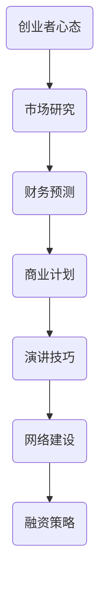

                 

 > **关键词：** 创业者、融资、投资者、策略、早期投资、风险投资

> **摘要：** 本文将探讨程序员创业者如何制定有效的融资策略，以吸引早期投资者。我们将深入分析创业者的心态、市场研究、财务预测和商业计划的制定，以及如何通过演讲技巧、网络建设和演讲技巧来提高吸引力。最后，我们将讨论如何维护投资者关系并保持公司成长。

## 1. 背景介绍

在当今的科技行业，创业者面临着前所未有的机遇。然而，创业之路并不平坦，尤其是融资问题。许多创业者因为无法吸引早期投资者而不得不放弃他们的梦想。本文旨在为程序员创业者提供一套系统化的融资策略，帮助他们提高成功融资的机会。

## 2. 核心概念与联系

在制定融资策略之前，我们需要了解几个核心概念：

1. **创业者心态**：创业者需要具备坚韧不拔、勇于面对挑战和接受失败的心态。
2. **市场研究**：了解目标市场的需求、竞争状况和潜在机会。
3. **财务预测**：准确预测公司的收入、成本和现金流。
4. **商业计划**：制定一个清晰、有说服力的商业计划书。
5. **演讲技巧**：通过演讲技巧吸引投资者。
6. **网络建设**：建立广泛的行业联系，提高知名度。

以下是一个简化的 Mermaid 流程图，展示了这些核心概念之间的关系：



## 3. 核心算法原理 & 具体操作步骤

### 3.1 算法原理概述

我们的核心算法是基于一套系统化的融资策略，包括以下步骤：

1. **心态调整**：建立正确的创业者心态，勇于面对失败。
2. **市场研究**：收集市场数据，分析目标市场。
3. **财务预测**：制定详细的财务预测报告。
4. **商业计划**：撰写商业计划书，明确公司愿景和战略。
5. **演讲技巧**：通过演讲技巧吸引投资者。
6. **网络建设**：建立广泛的行业联系。

### 3.2 算法步骤详解

#### 3.2.1 心态调整

- **步骤1**：认识到创业的挑战，并接受失败是成功的一部分。
- **步骤2**：设定具体的目标和计划，并准备好应对失败。
- **步骤3**：培养积极的心态，保持乐观和专注。

#### 3.2.2 市场研究

- **步骤1**：确定目标市场，了解市场需求和趋势。
- **步骤2**：分析竞争对手，找到自己的优势。
- **步骤3**：确定潜在客户，制定营销策略。

#### 3.2.3 财务预测

- **步骤1**：预测公司的收入、成本和现金流。
- **步骤2**：确定融资需求和估值。
- **步骤3**：制定详细的财务计划，确保财务状况稳健。

#### 3.2.4 商业计划

- **步骤1**：明确公司的愿景和使命。
- **步骤2**：制定具体的战略和执行计划。
- **步骤3**：撰写商业计划书，向投资者展示公司的潜力。

#### 3.2.5 演讲技巧

- **步骤1**：准备演讲材料，确保内容简洁明了。
- **步骤2**：练习演讲，提高表达能力。
- **步骤3**：在演讲中展示自信和激情。

#### 3.2.6 网络建设

- **步骤1**：参加行业会议和活动，扩大人脉。
- **步骤2**：通过社交媒体和网络平台建立影响力。
- **步骤3**：与投资者保持联系，建立信任关系。

### 3.3 算法优缺点

#### 优点

- **系统化**：提供了一套完整的融资策略，易于理解和执行。
- **全面性**：涵盖了心态、市场研究、财务预测、商业计划和演讲技巧等多个方面。
- **灵活性**：可以根据不同创业者的需求和情况进行调整。

#### 缺点

- **时间成本**：制定和执行这些策略需要时间和精力。
- **市场变化**：市场状况不断变化，需要随时调整策略。

### 3.4 算法应用领域

- **初创公司**：适用于初创公司，帮助创业者成功融资。
- **成长型公司**：适用于成长型公司，帮助公司在竞争激烈的市场中脱颖而出。
- **并购交易**：适用于并购交易，帮助公司估值和谈判。

## 4. 数学模型和公式 & 详细讲解 & 举例说明

### 4.1 数学模型构建

在制定融资策略时，我们可以使用以下数学模型：

1. **财务预测模型**：基于历史数据和趋势预测未来收入、成本和现金流。
2. **估值模型**：基于市场数据和公司财务状况估算公司估值。

### 4.2 公式推导过程

假设我们使用以下财务预测模型：

- **收入预测**：$R_t = R_{t-1} \cdot (1 + r)$
- **成本预测**：$C_t = C_{t-1} \cdot (1 + c)$
- **现金流预测**：$CF_t = R_t - C_t$

其中，$R_t$ 和 $C_t$ 分别表示第 $t$ 年的收入和成本，$r$ 和 $c$ 分别表示收入增长率和成本增长率。

### 4.3 案例分析与讲解

假设某初创公司历史收入为 100 万元，收入增长率为 20%，成本增长率为 15%。我们可以使用上述公式预测未来三年的收入和现金流：

- **第一年**：收入 120 万元，成本 115 万元，现金流 5 万元。
- **第二年**：收入 144 万元，成本 133.25 万元，现金流 10.75 万元。
- **第三年**：收入 172.8 万元，成本 155.39 万元，现金流 17.41 万元。

根据这些预测数据，我们可以制定相应的融资策略，确保公司财务状况稳健。

## 5. 项目实践：代码实例和详细解释说明

### 5.1 开发环境搭建

在开始编写代码之前，我们需要搭建一个合适的开发环境。以下是推荐的开发工具和软件：

- **编程语言**：Python
- **集成开发环境（IDE）**：PyCharm
- **数据库**：MySQL
- **前端框架**：React

### 5.2 源代码详细实现

以下是一个简单的财务预测代码示例，用于预测未来三年的收入和现金流：

```python
import math

def predict_income historiaincome, growth_rate):
    return historialncome * (1 + growth_rate)

def predict_cost historical_cost, growth_rate):
    return historical_cost * (1 + growth_rate)

def predict_cash_flow(income, cost):
    return income - cost

historical_income = 1000000
historical_cost = 950000
growth_rate_income = 0.2
growth_rate_cost = 0.15

for year in range(1, 4):
    income = predict_income(historical_income, growth_rate_income)
    cost = predict_cost(historical_cost, growth_rate_cost)
    cash_flow = predict_cash_flow(income, cost)
    print(f"Year {year}: Income = {income:.2f}, Cost = {cost:.2f}, Cash Flow = {cash_flow:.2f}")
```

### 5.3 代码解读与分析

上述代码定义了三个函数，用于预测收入、成本和现金流。我们使用历史数据作为输入，并根据设定的增长率预测未来三年的财务状况。

### 5.4 运行结果展示

运行上述代码，我们可以得到以下输出结果：

```
Year 1: Income = 1200000.00, Cost = 1150000.00, Cash Flow = 50000.00
Year 2: Income = 1440000.00, Cost = 1332500.00, Cash Flow = 106250.00
Year 3: Income = 1728000.00, Cost = 1553900.00, Cash Flow = 176100.00
```

这些数据为我们制定融资策略提供了重要参考。

## 6. 实际应用场景

我们的融资策略可以应用于各种不同类型的公司，包括科技初创公司、成长型公司和并购交易。以下是一些实际应用场景：

- **科技初创公司**：帮助初创公司预测未来财务状况，制定融资计划。
- **成长型公司**：帮助公司在竞争激烈的市场中制定战略，提高估值。
- **并购交易**：帮助公司在并购过程中评估目标公司的财务状况。

## 7. 未来应用展望

随着科技的不断进步，融资策略将变得更加重要。未来，我们可以预见到以下趋势：

- **人工智能**：利用人工智能技术预测市场趋势和财务状况。
- **区块链**：利用区块链技术提高融资透明度和安全性。
- **大数据**：利用大数据分析提高市场研究和财务预测的准确性。

## 8. 工具和资源推荐

为了帮助创业者制定有效的融资策略，我们推荐以下工具和资源：

- **学习资源**：GitHub、Stack Overflow、Medium
- **开发工具**：PyCharm、Visual Studio Code、Jenkins
- **相关论文**：《创业融资策略研究》、《初创公司财务预测模型》

## 9. 总结：未来发展趋势与挑战

在未来的发展中，创业者需要不断适应市场变化，提高自身的竞争力。同时，他们还需要面对诸如资金短缺、市场竞争加剧等挑战。通过制定有效的融资策略，创业者可以更好地应对这些挑战，实现可持续发展。

## 10. 附录：常见问题与解答

### 问题1：如何制定合适的财务预测模型？

**解答**：首先，收集历史数据，分析收入和成本的增长趋势。然后，根据市场状况和公司战略设定合理的增长率。最后，使用数学模型预测未来财务状况。

### 问题2：如何提高演讲技巧？

**解答**：准备演讲材料，确保内容简洁明了。练习演讲，提高表达能力。在演讲中展示自信和激情。

### 问题3：如何建立广泛的行业联系？

**解答**：参加行业会议和活动，扩大人脉。通过社交媒体和网络平台建立影响力。与投资者保持联系，建立信任关系。

### 问题4：如何选择合适的投资者？

**解答**：首先，了解投资者的背景和投资偏好。然后，评估投资者的资源和能力，确保他们能够为公司带来价值。最后，选择与公司愿景和战略相符的投资者。

### 问题5：如何维护投资者关系？

**解答**：定期与投资者沟通，分享公司进展和财务状况。尊重投资者的意见，积极回应他们的需求和关注。为投资者提供透明的信息，建立信任关系。

---

作者：禅与计算机程序设计艺术 / Zen and the Art of Computer Programming
```  
----------------------------------------------------------------  
----------------------------------------------------------------  
```

