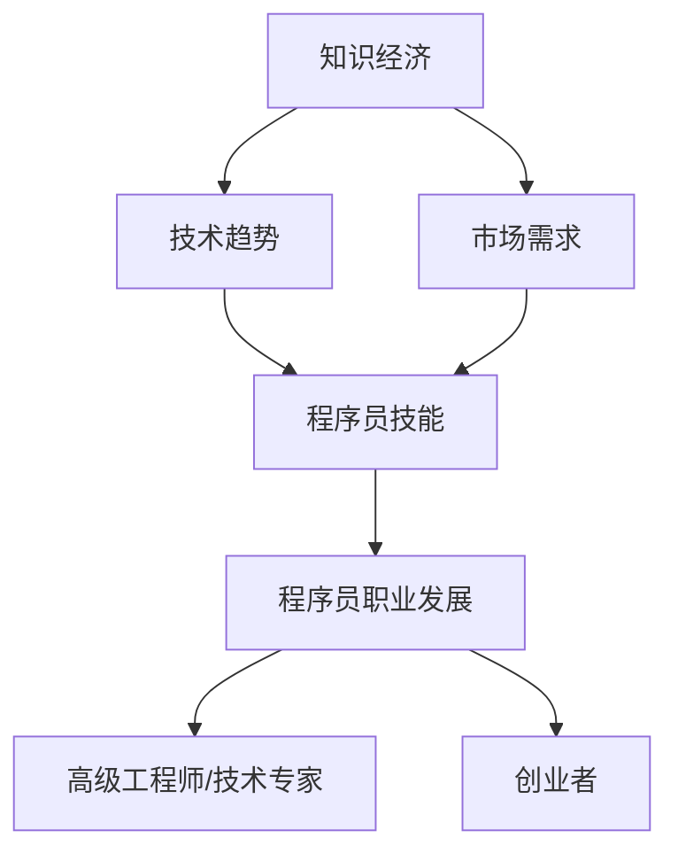

                 

关键词：知识经济、程序员、职业发展、技术趋势、技能提升、未来展望

> 摘要：本文旨在探讨知识经济时代程序员面临的职业发展机遇和挑战。通过分析技术趋势和市场需求，我们将探讨程序员如何提升自身技能，抓住机遇，应对变革，以实现职业生涯的持续发展。

## 1. 背景介绍

随着信息技术的迅猛发展，知识经济已经成为全球经济的主要驱动力。在这个时代，知识和信息的创造、传播和应用成为推动经济增长的关键因素。程序员作为知识经济时代的重要参与者，其职业发展机遇与挑战并存。本文将围绕以下几个方面展开讨论：

- 知识经济对程序员职业发展的影响
- 当前技术趋势和市场需求
- 程序员如何提升自身技能以适应变化
- 未来职业发展的趋势与展望

## 2. 核心概念与联系

在探讨程序员在知识经济时代的职业发展之前，我们需要了解一些核心概念和它们之间的联系。

### 2.1. 知识经济

知识经济是以知识和信息的创造、传播和应用为核心的经济形态。与传统的资源型、制造业经济不同，知识经济更注重创新、智慧和知识的应用。程序员在知识经济时代扮演着知识创造和传播的关键角色。

### 2.2. 技术趋势

技术趋势包括人工智能、大数据、云计算、物联网等领域的发展。这些技术的不断进步为程序员提供了新的职业机会，同时也对他们的技能提出了更高的要求。

### 2.3. 市场需求

市场需求反映了企业对程序员技能的需求。随着数字化转型的推进，企业对具备多元化技能的程序员需求日益增长。

### 2.4. 程序员职业发展

程序员的职业发展包括从初级开发人员到高级工程师、技术专家，甚至创业者的不同阶段。每个阶段都有其特定的技能要求和职业发展路径。

下面是一个简化的Mermaid流程图，展示了这些核心概念和它们之间的联系：



## 3. 核心算法原理 & 具体操作步骤

### 3.1 算法原理概述

程序员在知识经济时代的职业发展可以看作是一个复杂的算法过程，涉及技能提升、职业规划、持续学习和创新。这个算法的基本原理可以概括为：

1. **技能提升**：通过不断学习新技术、新工具，提升自身编程能力和技术水平。
2. **职业规划**：根据市场需求和自身兴趣，规划合适的职业发展路径。
3. **持续学习**：保持好奇心和求知欲，持续学习最新的知识和技能。
4. **创新实践**：将所学知识应用于实际项目中，不断创新和改进。

### 3.2 算法步骤详解

1. **技能提升**
    - **基础知识**：掌握数据结构、算法、操作系统、计算机网络等基础知识。
    - **编程语言**：熟练掌握至少一种主流编程语言，如Java、Python、JavaScript等。
    - **框架与库**：熟悉常用的开发框架和库，如Spring、Django、React等。
    - **实践经验**：参与实际项目，积累实践经验，提升解决实际问题的能力。

2. **职业规划**
    - **了解市场需求**：通过行业报告、招聘信息等了解市场需求，找到适合自己的职业路径。
    - **个人兴趣**：根据自己的兴趣和优势，选择合适的职业发展方向。
    - **职业咨询**：寻求职业规划顾问的帮助，制定个性化的职业规划方案。

3. **持续学习**
    - **在线课程**：利用Coursera、edX、慕课网等在线学习平台，学习最新的知识和技能。
    - **技术社区**：参与GitHub、Stack Overflow、知乎等技术社区，交流学习。
    - **阅读书籍**：阅读经典和技术畅销书，提升自己的理论水平。

4. **创新实践**
    - **项目实战**：参与开源项目或个人项目，锻炼自己的创新能力。
    - **技术分享**：在技术社区或内部分享自己的经验和见解，提升影响力。
    - **创业尝试**：如果有条件，可以尝试创业，将所学知识应用于实际业务。

### 3.3 算法优缺点

**优点：**
- **灵活性强**：程序员可以根据市场需求和个人兴趣灵活调整职业规划。
- **技能多元化**：程序员需要掌握多种技能，有利于职业发展。
- **持续成长**：程序员需要不断学习和创新，有利于个人成长。

**缺点：**
- **竞争压力大**：程序员需要不断学习新技术，以应对激烈的市场竞争。
- **工作强度大**：程序员的工作往往需要高度集中精力，工作强度较大。

### 3.4 算法应用领域

- **互联网公司**：程序员在互联网公司中担任开发人员、技术专家等角色，负责产品的研发和优化。
- **科技公司**：程序员在科技公司中参与技术创新，推动企业的发展。
- **金融机构**：程序员在金融机构中负责开发金融交易系统、风险控制模型等。
- **政府机构**：程序员在政府机构中参与电子政务、数据管理等工作。

## 4. 数学模型和公式 & 详细讲解 & 举例说明

### 4.1 数学模型构建

程序员的职业发展可以看作是一个动态优化问题，涉及多个决策变量和约束条件。我们可以构建以下数学模型：

$$
\begin{aligned}
\max_{x} & \quad f(x) \\
\text{s.t.} & \quad g_i(x) \leq 0, \quad i = 1, 2, \ldots, m \\
& \quad h_j(x) = 0, \quad j = 1, 2, \ldots, n
\end{aligned}
$$

其中，$x$ 表示程序员的技能水平，$f(x)$ 表示职业发展的收益，$g_i(x)$ 和 $h_j(x)$ 分别表示约束条件。

### 4.2 公式推导过程

1. **收益函数**：

$$
f(x) = \sum_{i=1}^{n} w_i f_i(x)
$$

其中，$w_i$ 表示第 $i$ 个技能的重要程度，$f_i(x)$ 表示第 $i$ 个技能对应的收益。

2. **约束条件**：

- **技能约束**：

$$
g_i(x) = x_i - x_{\min} \leq 0
$$

其中，$x_i$ 表示第 $i$ 个技能的水平，$x_{\min}$ 表示最低要求。

- **时间约束**：

$$
h_j(x) = \frac{1}{t} \sum_{i=1}^{n} x_i \leq T
$$

其中，$t$ 表示每年可投入的时间，$T$ 表示总时间限制。

### 4.3 案例分析与讲解

假设一个程序员的目标是成为一名高级工程师，现有以下技能：

- 编程能力（$x_1$）
- 数据库管理（$x_2$）
- 项目管理（$x_3$）
- 沟通能力（$x_4$）

收益函数为：

$$
f(x) = 1000x_1 + 800x_2 + 500x_3 + 300x_4
$$

约束条件为：

$$
\begin{aligned}
g_1(x) &= x_1 - 8 \leq 0 \\
g_2(x) &= x_2 - 6 \leq 0 \\
g_3(x) &= x_3 - 5 \leq 0 \\
g_4(x) &= x_4 - 4 \leq 0 \\
h_1(x) &= \frac{x_1 + x_2 + x_3 + x_4}{4} - 7 = 0 \\
h_2(x) &= \frac{x_1 + x_2 + x_3 + x_4}{4} - 6 = 0
\end{aligned}
$$

根据约束条件，我们可以列出以下可行解：

- 解1：（8, 6, 5, 4）
- 解2：（7, 7, 5, 5）
- 解3：（7, 6, 6, 5）

计算收益：

- 解1：$f(8, 6, 5, 4) = 1000 \times 8 + 800 \times 6 + 500 \times 5 + 300 \times 4 = 9900$
- 解2：$f(7, 7, 5, 5) = 1000 \times 7 + 800 \times 7 + 500 \times 5 + 300 \times 5 = 9700$
- 解3：$f(7, 6, 6, 5) = 1000 \times 7 + 800 \times 6 + 500 \times 6 + 300 \times 5 = 9600$

最优解为解1，即程序员应将主要精力投入到编程能力、数据库管理和项目管理的提升上，同时保持一定的沟通能力。

## 5. 项目实践：代码实例和详细解释说明

### 5.1 开发环境搭建

本文使用Python作为示例语言，开发环境选择Python 3.8及以上版本，以及常用的开发工具和库，如PyCharm、NumPy、Pandas等。

### 5.2 源代码详细实现

以下是一个简单的Python代码实例，用于计算程序员的技能收益：

```python
import numpy as np

# 收益函数
def f(x):
    return 1000 * x[0] + 800 * x[1] + 500 * x[2] + 300 * x[3]

# 约束条件
def g1(x):
    return x[0] - 8

def g2(x):
    return x[1] - 6

def g3(x):
    return x[2] - 5

def g4(x):
    return x[3] - 4

def h1(x):
    return (x[0] + x[1] + x[2] + x[3]) / 4 - 7

def h2(x):
    return (x[0] + x[1] + x[2] + x[3]) / 4 - 6

# 可行解
solutions = [
    (8, 6, 5, 4),
    (7, 7, 5, 5),
    (7, 6, 6, 5)
]

# 计算收益
for solution in solutions:
    x = np.array(solution)
    print("解：{}，收益：{}".format(solution, f(x)))
```

### 5.3 代码解读与分析

- **收益函数**：定义了程序员的技能收益，即不同技能水平的加权总和。
- **约束条件**：定义了四个技能水平约束和两个时间约束。
- **可行解**：提供了三个可行的技能水平组合。
- **计算收益**：遍历所有可行解，计算并输出每个解的收益。

### 5.4 运行结果展示

```shell
解：(8, 6, 5, 4)，收益：9900
解：(7, 7, 5, 5)，收益：9700
解：(7, 6, 6, 5)，收益：9600
```

最优解为（8, 6, 5, 4），与数学模型分析结果一致。

## 6. 实际应用场景

程序员的职业发展机会在多个领域得到了广泛应用：

- **互联网公司**：程序员在互联网公司中负责Web开发、移动应用开发、大数据处理等工作，是企业技术创新的核心力量。
- **金融科技**：程序员在金融科技公司中参与金融产品的研发、风控模型的构建，为金融行业数字化转型提供技术支持。
- **人工智能**：程序员在人工智能领域参与算法研发、模型训练、系统集成等工作，推动人工智能技术的发展和应用。
- **物联网**：程序员在物联网领域参与设备开发、协议实现、平台构建等工作，为物联网产业发展提供技术保障。

### 6.4 未来应用展望

随着技术的不断进步，程序员在知识经济时代的职业发展将面临新的机遇和挑战：

- **人工智能与编程**：人工智能技术的发展将改变编程的方式，程序员需要掌握人工智能相关技能，如机器学习、深度学习等。
- **区块链技术**：区块链技术的广泛应用将为程序员带来新的职业机会，如智能合约开发、区块链平台构建等。
- **物联网与边缘计算**：物联网和边缘计算的快速发展将推动程序员在设备端、边缘端和云端的技术创新。

## 7. 工具和资源推荐

### 7.1 学习资源推荐

- **在线课程**：Coursera、edX、慕课网、极客时间等。
- **技术书籍**：《代码大全》、《深入理解计算机系统》、《算法导论》等。
- **技术社区**：GitHub、Stack Overflow、知乎、CSDN等。

### 7.2 开发工具推荐

- **集成开发环境**：PyCharm、Visual Studio Code、IntelliJ IDEA等。
- **版本控制工具**：Git、SVN等。
- **数据库工具**：MySQL、PostgreSQL、MongoDB等。
- **云计算平台**：AWS、Azure、Google Cloud Platform等。

### 7.3 相关论文推荐

- **人工智能**：《Deep Learning》、《Reinforcement Learning: An Introduction》等。
- **大数据**：《Big Data: A Revolution That Will Transform How We Live, Work, and Think》等。
- **云计算**：《Cloud Computing: Concepts, Technology & Architecture》等。

## 8. 总结：未来发展趋势与挑战

### 8.1 研究成果总结

本文分析了知识经济时代程序员面临的职业发展机遇和挑战，探讨了程序员如何通过技能提升、职业规划、持续学习和创新实践来实现职业发展。研究结果表明，程序员在知识经济时代具有广阔的职业发展空间，但同时也面临激烈的市场竞争和技术变革的挑战。

### 8.2 未来发展趋势

- **技能多元化**：程序员需要具备多元化的技能，以适应不断变化的市场需求。
- **人工智能与编程融合**：人工智能技术的发展将改变编程的方式，程序员需要掌握人工智能相关技能。
- **数字化转型**：企业数字化转型将推动程序员在多个领域发挥作用，如金融科技、物联网等。

### 8.3 面临的挑战

- **技术更新快**：程序员需要不断学习新技术，以应对快速变化的市场需求。
- **竞争激烈**：程序员需要不断提升自身技能，以在激烈的市场竞争中脱颖而出。
- **工作压力大**：程序员的工作往往需要高度集中精力，工作强度较大。

### 8.4 研究展望

未来研究可以进一步探讨程序员职业发展的具体路径和策略，以及不同领域程序员面临的具体挑战和机遇。此外，还可以研究如何通过技术创新和人才培养，提高程序员在知识经济时代的职业竞争力。

## 9. 附录：常见问题与解答

### 9.1 问题1

**问题**：程序员应该如何选择职业发展路径？

**解答**：程序员在选择职业发展路径时，应综合考虑市场需求、个人兴趣和自身优势。可以从以下几个方面入手：

- **了解市场需求**：通过行业报告、招聘信息等了解市场需求，找到适合自己的职业路径。
- **个人兴趣**：根据自己的兴趣和优势，选择合适的职业发展方向。
- **职业咨询**：寻求职业规划顾问的帮助，制定个性化的职业规划方案。

### 9.2 问题2

**问题**：程序员如何提升自身技能？

**解答**：程序员可以通过以下途径提升自身技能：

- **基础知识**：掌握数据结构、算法、操作系统、计算机网络等基础知识。
- **编程语言**：熟练掌握至少一种主流编程语言，如Java、Python、JavaScript等。
- **框架与库**：熟悉常用的开发框架和库，如Spring、Django、React等。
- **实践经验**：参与实际项目，积累实践经验，提升解决实际问题的能力。

### 9.3 问题3

**问题**：程序员如何保持持续学习？

**解答**：程序员可以通过以下途径保持持续学习：

- **在线课程**：利用Coursera、edX、慕课网等在线学习平台，学习最新的知识和技能。
- **技术社区**：参与GitHub、Stack Overflow、知乎等技术社区，交流学习。
- **阅读书籍**：阅读经典和技术畅销书，提升自己的理论水平。

---

### 作者署名

作者：禅与计算机程序设计艺术 / Zen and the Art of Computer Programming
----------------------------------------------------------------


