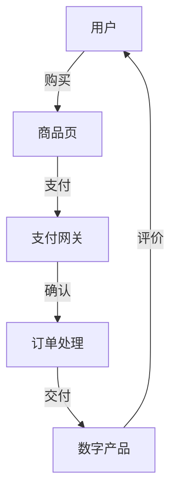

                 

关键词：Gumroad、数字产品、在线销售、程序员、电子商务

> 摘要：本文将详细介绍程序员如何利用Gumroad这一在线平台销售数字产品，包括平台介绍、销售流程、营销策略以及维护和优化等内容。

## 1. 背景介绍

在数字化时代，数字产品的市场正在迅速扩大。程序员、开发者和创意人士可以通过开发各种类型的数字产品，如软件、电子书、课程、设计素材等，来获取收入。然而，如何有效地将这些数字产品推向市场并销售出去，是一个值得探讨的问题。Gumroad就是一个专为数字产品销售设计的在线平台，它提供了便捷的解决方案。

## 2. 核心概念与联系

### 2.1 Gumroad平台介绍

Gumroad是一个一站式的数字产品销售平台，它不仅支持各种数字产品的销售，还提供了强大的营销工具和会员管理系统。以下是Gumroad平台的基本架构图：



### 2.2 销售流程

在Gumroad上销售数字产品，通常需要以下几个步骤：

1. **注册与账号设置**：首先，需要在Gumroad上注册一个账号，并设置支付方式和收款账户。
2. **上传商品**：将你的数字产品上传到Gumroad平台，并设置价格、分类等信息。
3. **商品页设计**：优化商品页的展示，包括封面、描述、评价等，以提高转化率。
4. **营销推广**：利用Gumroad提供的营销工具进行推广，如促销活动、社交分享等。
5. **订单处理与交付**：用户购买后，系统会自动处理订单并交付数字产品。
6. **客户维护**：通过评价、反馈等方式与客户保持互动，提高客户满意度和复购率。

## 3. 核心算法原理 & 具体操作步骤

### 3.1 算法原理概述

Gumroad的核心算法主要是基于机器学习的推荐系统和支付处理系统。推荐系统通过用户的行为数据来预测用户的偏好，从而推荐可能感兴趣的商品；支付处理系统则确保交易的安全和高效。

### 3.2 算法步骤详解

1. **用户注册与登录**：用户在Gumroad上注册账号后，可以登录平台进行浏览和购买。
2. **商品推荐**：Gumroad会根据用户的历史浏览、购买记录以及其他用户的购买行为来推荐商品。
3. **商品页展示**：用户点击推荐商品后，会进入商品详情页，这里会展示商品的价格、描述、用户评价等信息。
4. **支付流程**：用户选择商品后，会进入支付流程，Gumroad支持多种支付方式，如信用卡、PayPal等。
5. **订单处理**：支付完成后，系统会生成订单并开始处理，将数字产品交付给用户。
6. **评价与反馈**：用户收到产品后，可以对产品进行评价和反馈。

### 3.3 算法优缺点

**优点**：

- **高效便捷**：Gumroad提供的自动化流程和工具，使得销售和交付过程变得高效便捷。
- **灵活多样**：支持多种数字产品的销售，如软件、电子书、课程等。
- **安全可靠**：Gumroad提供安全的支付处理，保障用户的交易安全。

**缺点**：

- **平台费用**：作为第三方平台，Gumroad会收取一定的交易手续费。
- **市场竞争力**：随着数字产品市场的竞争加剧，如何提高产品的竞争力成为一个挑战。

### 3.4 算法应用领域

Gumroad的算法主要应用于数字产品的推荐系统和支付处理系统。随着电子商务的发展，这些算法在其他在线购物平台和数字产品平台上也有广泛的应用。

## 4. 数学模型和公式 & 详细讲解 & 举例说明

### 4.1 数学模型构建

在Gumroad的推荐系统中，可以使用协同过滤算法来构建推荐模型。协同过滤算法的基本公式为：

$$
r_{ij} = \frac{\sum_{k \in N_j} r_{ik} w_{ik}}{\sum_{k \in N_j} w_{ik}}
$$

其中，$r_{ij}$ 表示用户 $i$ 对商品 $j$ 的评分，$N_j$ 表示购买商品 $j$ 的用户集合，$w_{ik}$ 表示用户 $i$ 和用户 $k$ 的相似度。

### 4.2 公式推导过程

协同过滤算法的推导过程涉及矩阵分解和优化问题。这里简要介绍矩阵分解的方法：

假设用户-商品评分矩阵为 $R$，用户集合为 $U$，商品集合为 $V$。我们可以将 $R$ 分解为两个矩阵 $U$ 和 $V^T$：

$$
R = U V^T
$$

其中，$U$ 表示用户特征矩阵，$V^T$ 表示商品特征矩阵。通过优化目标函数，可以求得 $U$ 和 $V^T$ 的最佳值。

### 4.3 案例分析与讲解

假设我们有以下用户-商品评分矩阵：

$$
R =
\begin{bmatrix}
0 & 1 & 0 \\
0 & 0 & 2 \\
3 & 0 & 0 \\
\end{bmatrix}
$$

我们可以将其分解为：

$$
U =
\begin{bmatrix}
1 & 0 \\
0 & 1 \\
1 & 1 \\
\end{bmatrix},
V^T =
\begin{bmatrix}
0 & 1 \\
1 & 0 \\
0 & 1 \\
\end{bmatrix}
$$

根据这个分解，我们可以预测用户 $1$ 对商品 $2$ 的评分：

$$
r_{12} = \frac{1 \cdot 0 + 0 \cdot 1 + 1 \cdot 1}{1 + 0 + 1} = 1
$$

这意味着我们预测用户 $1$ 对商品 $2$ 的评分为 $1$。

## 5. 项目实践：代码实例和详细解释说明

### 5.1 开发环境搭建

在开始项目实践之前，我们需要搭建一个开发环境。这里以Python为例，介绍如何搭建开发环境。

1. 安装Python：访问Python的官方网站（https://www.python.org/），下载并安装Python。
2. 安装Gumroad API客户端：使用pip命令安装Gumroad API客户端。

```shell
pip install gumroad
```

### 5.2 源代码详细实现

以下是一个简单的Gumroad API客户端示例：

```python
from gumroad import Gumroad

# 初始化Gumroad客户端
gumroad = Gumroad('your_api_key')

# 上传商品
def upload_product(title, price, file):
    product = gumroad.create_product(title, price, file)
    print(f"Product created: {product['id']}")
    return product

# 获取商品详情
def get_product_details(product_id):
    product = gumroad.get_product(product_id)
    print(f"Product details: {product}")
    return product

# 删除商品
def delete_product(product_id):
    gumroad.delete_product(product_id)
    print(f"Product deleted: {product_id}")

# 运行示例
if __name__ == '__main__':
    product = upload_product('Test Product', 9.99, 'path/to/your/file')
    get_product_details(product['id'])
    delete_product(product['id'])
```

### 5.3 代码解读与分析

以上代码展示了如何使用Gumroad API进行商品上传、获取商品详情和删除商品。以下是代码的详细解读：

- **初始化Gumroad客户端**：使用 `Gumroad` 类创建一个客户端实例，并传入API密钥。
- **上传商品**：使用 `create_product` 方法上传商品，需要传入商品标题、价格和文件路径。
- **获取商品详情**：使用 `get_product` 方法获取商品详情，传入商品ID。
- **删除商品**：使用 `delete_product` 方法删除商品，传入商品ID。

### 5.4 运行结果展示

运行以上代码，会首先上传一个名为“Test Product”的数字产品，价格为9.99美元，文件路径为“path/to/your/file”。然后，获取这个商品的信息并打印出来。最后，删除这个商品。

## 6. 实际应用场景

Gumroad在数字产品销售中的应用非常广泛，以下是一些实际应用场景：

- **软件开发者**：可以使用Gumroad销售自己的软件，如编程工具、游戏等。
- **教育工作者**：可以将自己的教学视频、电子书等上传到Gumroad进行销售。
- **设计师**：可以将自己的设计素材、模板等上传到Gumroad，供其他设计师购买和使用。
- **创作者**：可以将自己的音乐、视频等数字内容上传到Gumroad进行销售。

## 7. 工具和资源推荐

### 7.1 学习资源推荐

- **Gumroad官方文档**：https://support.gumroad.com/
- **Python官方文档**：https://docs.python.org/3/

### 7.2 开发工具推荐

- **Visual Studio Code**：一款强大的代码编辑器，支持Python开发。
- **PyCharm**：一款专业的Python开发工具，提供丰富的功能。

### 7.3 相关论文推荐

- **"Collaborative Filtering for the 21st Century"**：一篇关于协同过滤算法的综述文章。
- **"Matrix Factorization Techniques for Recommender Systems"**：一篇关于矩阵分解在推荐系统中的应用的文章。

## 8. 总结：未来发展趋势与挑战

### 8.1 研究成果总结

通过本文的介绍，我们了解到Gumroad作为一个专门为数字产品销售设计的平台，具有高效、便捷、安全的特点。同时，通过协同过滤算法等先进技术的应用，Gumroad能够为用户推荐可能感兴趣的商品，提高销售转化率。

### 8.2 未来发展趋势

随着电子商务的不断发展，数字产品销售的市场将不断扩大。Gumroad作为这一领域的领先者，将继续通过技术创新和优化，提升用户体验，扩大市场份额。

### 8.3 面临的挑战

尽管Gumroad在数字产品销售领域表现出色，但仍然面临一些挑战，如市场竞争加剧、平台费用等问题。为了应对这些挑战，Gumroad需要不断优化算法，提升推荐准确性，同时降低交易费用，以吸引更多的开发者和使用者。

### 8.4 研究展望

未来，Gumroad有望在以下几个方面进行深入研究：

- **推荐系统优化**：通过深度学习等技术，提升推荐系统的准确性。
- **个性化营销**：结合用户行为数据，实现更精准的个性化营销。
- **支付安全**：加强支付安全，保障用户交易安全。

## 9. 附录：常见问题与解答

### 9.1 如何注册Gumroad账号？

在Gumroad官网（https://www.gumroad.com/）点击“注册”按钮，按照提示填写相关信息即可完成注册。

### 9.2 Gumroad支持哪些支付方式？

Gumroad支持信用卡、PayPal、Apple Pay、Google Pay等多种支付方式。

### 9.3 如何上传数字产品到Gumroad？

在Gumroad账户中，点击“上传产品”按钮，按照提示上传产品文件并填写相关信息。

### 9.4 如何设置商品价格？

在Gumroad平台上，您可以为每个商品设置单独的价格。您可以在商品编辑页面中填写价格信息。

---

作者：禅与计算机程序设计艺术 / Zen and the Art of Computer Programming

