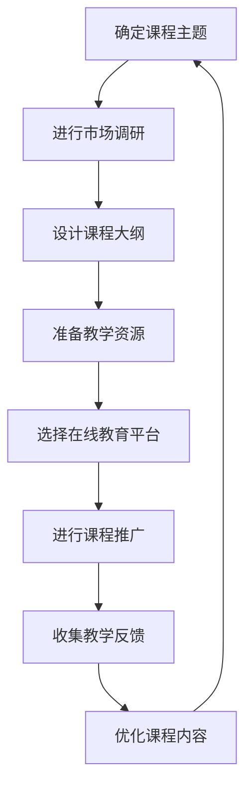

                 

关键词：技术专长，在线课程，价值，编程，知识分享，教育平台，课程设计，内容创作，受众分析

> 摘要：本文旨在探讨程序员如何将自身的技术专长转化为高价值的在线课程。通过对课程设计、内容创作、受众分析和推广策略的深入分析，提供了一系列实用的指导和建议，帮助程序员在在线教育领域取得成功。

## 1. 背景介绍

随着互联网的普及和在线教育平台的兴起，越来越多的程序员开始考虑将自己的技术专长转化为在线课程，以此实现个人价值的最大化。然而，如何设计出既符合市场需求又有助于学习者成长的在线课程，是摆在每个程序员面前的一个挑战。

本文将围绕以下核心问题展开讨论：

- 如何识别和定位自己的技术专长？
- 如何设计出既有趣又有深度的在线课程内容？
- 如何吸引并保持学习者的兴趣和参与度？
- 如何评估在线课程的价值并实现商业化？

通过对上述问题的探讨，希望能为程序员提供一套切实可行的策略，帮助他们在在线教育领域脱颖而出。

### 1.1 在线教育的现状与机遇

近年来，在线教育行业呈现出蓬勃发展的态势。据市场研究公司Statista的数据显示，全球在线教育市场规模在2021年已经达到3500亿美元，并预计在未来几年内继续保持高速增长。这为程序员提供了丰富的机遇。

首先，在线教育打破了地域和时间的限制，让全球范围内的学习者都可以方便地获取高质量的教育资源。这对于那些希望分享知识、传播技术的程序员来说，无疑是一个巨大的市场。

其次，随着5G、人工智能等新技术的不断发展，在线教育平台的功能和体验也在不断提升，使得课程设计更加多样化和互动化，这为程序员提供了更多的创作空间。

然而，机遇与挑战并存。在线教育市场竞争激烈，要想在众多课程中脱颖而出，程序员需要具备独特的课程内容和优秀的教学技巧。同时，如何平衡知识传播与商业化的关系也是一个需要深思熟虑的问题。

### 1.2 程序员的优势与挑战

程序员在在线教育领域具有独特的优势：

1. **技术专长**：程序员对编程语言、框架和工具有着深刻的理解，能够将这些专业知识传授给学习者。
2. **实践经验**：程序员通常具备丰富的项目开发经验，能够通过案例教学帮助学习者更好地理解和应用知识。
3. **逻辑思维**：程序员擅长逻辑思维和问题解决，能够设计出结构清晰、逻辑严密的教学内容。

然而，程序员也面临一些挑战：

1. **内容创作**：如何将复杂的技术知识转化为易于理解的教学内容，是许多程序员需要克服的难关。
2. **教学技巧**：与传统的教育模式不同，在线教育需要更多的互动和参与度，程序员需要掌握一定的教学技巧来吸引和保持学习者的兴趣。
3. **市场定位**：在众多课程中如何找到自己的市场定位，是每个程序员都需要考虑的问题。

### 1.3 目标受众

在开始设计课程之前，了解目标受众是非常重要的。程序员的目标受众可能包括以下几类：

1. **编程初学者**：他们可能对编程感兴趣，但缺乏系统学习的机会。
2. **在职程序员**：他们希望通过学习新的技术和工具来提升自己的技能。
3. **技术爱好者**：他们热爱技术，希望通过学习深入了解某一特定领域。

针对不同的受众，程序员需要设计出不同的课程内容和教学方式，以满足他们的学习需求。

### 1.4 内容价值

在线课程的价值主要体现在以下几个方面：

1. **知识传递**：课程内容应该涵盖最新的技术和工具，帮助学习者跟上行业的发展。
2. **技能提升**：课程应该通过实践操作和案例教学，帮助学习者掌握实际技能。
3. **问题解决**：课程应该教授学习者如何分析和解决实际问题，提升他们的职业竞争力。
4. **职业发展**：课程应该提供职业规划和发展建议，帮助学习者实现职业成长。

## 2. 核心概念与联系

### 2.1 教学模型

为了设计出高质量的在线课程，程序员需要了解并运用多种教学模型。以下是几种常见的教学模型：

#### 2.1.1 启发式教学

启发式教学强调通过提问和探索来激发学习者的思维，培养他们的创新能力和解决问题的能力。程序员可以在课程中设置问题驱动型的教学环节，引导学习者自主思考和发现。

#### 2.1.2 项目驱动教学

项目驱动教学通过实际项目的开发和实现来引导学习，使学习者能够在实际操作中掌握知识。程序员可以设计一系列与实际工作相关的项目，让学习者在项目中学习和应用技术。

#### 2.1.3 游戏化教学

游戏化教学通过将游戏元素融入课程设计中，提高学习者的兴趣和参与度。程序员可以利用编程挑战、积分系统等游戏化手段来激励学习者。

#### 2.1.4 社交互动教学

社交互动教学通过学习社群的建立和互动，促进学习者之间的交流和合作。程序员可以设置讨论区、直播课等互动环节，鼓励学习者分享经验和解决疑惑。

### 2.2 教学策略

#### 2.2.1 课堂互动

在在线课程中，互动是保持学习者兴趣和参与度的重要手段。程序员可以通过以下方式增加课堂互动：

- 提问：在课程中设置问题，引导学习者思考和回答。
- 反馈：及时对学习者的回答进行反馈，鼓励他们继续深入思考。
- 互动讨论：设置讨论区或直播课，鼓励学习者参与讨论。

#### 2.2.2 案例教学

案例教学通过真实案例的分析和解决，使学习者能够更好地理解和应用知识。程序员可以从自己的项目经验中提取典型案例，进行详细讲解和分析。

#### 2.2.3 游戏化学习

游戏化学习通过将学习过程游戏化，提高学习者的兴趣和参与度。程序员可以利用编程挑战、积分系统等游戏化手段来激励学习者。

#### 2.2.4 社交互动

社交互动通过建立学习社群，促进学习者之间的交流和合作。程序员可以设置讨论区、直播课等互动环节，鼓励学习者分享经验和解决疑惑。

### 2.3 教学工具

#### 2.3.1 在线教育平台

在线教育平台是程序员发布和销售课程的重要工具。常见的在线教育平台包括Coursera、Udemy、网易云课堂等。程序员需要选择适合自己的平台，并根据平台的特点进行课程设计和推广。

#### 2.3.2 直播工具

直播工具可以用于实时授课和互动。常见的直播工具有Zoom、腾讯会议等。程序员需要熟悉这些工具的使用，并合理安排课程时间和内容。

#### 2.3.3 教学资源

教学资源包括教材、PPT、视频、代码示例等。程序员需要准备丰富的教学资源，以便学习者能够更好地理解和掌握课程内容。

### 2.4 教学评价

教学评价是衡量课程质量和学习者学习效果的重要手段。程序员可以通过以下方式收集教学评价：

- 学生反馈：通过调查问卷、讨论区反馈等途径收集学生的意见和建议。
- 课程完成率：观察学习者的课程完成情况，了解课程内容的吸引力和难度。
- 学习效果：通过项目作业、考试等方式评估学习者的学习效果。

### 2.5 Mermaid 流程图

以下是设计高质量在线课程的核心流程图：



## 3. 核心算法原理 & 具体操作步骤

### 3.1 算法原理概述

在将技术专长转化为在线课程的过程中，核心算法原理的理解和掌握是至关重要的。本文将介绍一种常用的算法——深度学习算法，并详细阐述其原理和具体操作步骤。

深度学习算法是一种基于多层神经网络的结构，通过模拟人脑神经网络来处理和识别数据。其核心思想是通过多层次的神经网络模型，对输入数据进行特征提取和抽象，从而实现复杂模式的识别和预测。

深度学习算法主要包括以下三个步骤：

1. **数据预处理**：对输入数据（如图像、文本等）进行清洗、归一化和编码，使其适合深度学习模型处理。
2. **模型训练**：通过前向传播和反向传播算法，对神经网络模型进行训练，使其能够从数据中学习到有用的特征表示。
3. **模型评估与优化**：通过评估指标（如准确率、召回率等）对训练好的模型进行评估，并根据评估结果对模型进行优化。

### 3.2 算法步骤详解

#### 3.2.1 数据预处理

数据预处理是深度学习算法的重要步骤，直接影响模型的性能。具体操作步骤如下：

1. **数据清洗**：去除数据中的噪声和异常值，确保数据质量。
2. **数据归一化**：将数据缩放到同一范围内，便于模型训练。
3. **数据编码**：将类别数据转换为数值编码，便于神经网络处理。

#### 3.2.2 模型训练

模型训练是深度学习算法的核心步骤，具体操作步骤如下：

1. **初始化模型参数**：随机初始化神经网络的权重和偏置。
2. **前向传播**：将输入数据通过神经网络模型，计算输出结果。
3. **反向传播**：计算输出结果与真实值之间的误差，并更新模型参数。
4. **迭代训练**：重复前向传播和反向传播，直至满足停止条件（如达到预设的迭代次数或误差阈值）。

#### 3.2.3 模型评估与优化

模型评估与优化是确保模型性能的重要步骤，具体操作步骤如下：

1. **模型评估**：使用测试集对训练好的模型进行评估，计算评估指标（如准确率、召回率等）。
2. **模型优化**：根据评估结果对模型进行优化，包括调整模型结构、参数和训练策略等。

### 3.3 算法优缺点

深度学习算法具有以下优点：

1. **强大的特征提取能力**：通过多层神经网络，深度学习算法能够自动提取数据中的高级特征，实现复杂模式的识别和预测。
2. **广泛的适用性**：深度学习算法可以应用于各种领域，如图像识别、自然语言处理和推荐系统等。
3. **高效的计算性能**：随着计算能力的提升，深度学习算法的运算速度越来越快，使得大规模数据处理成为可能。

然而，深度学习算法也存在一些缺点：

1. **计算资源消耗大**：深度学习算法需要大量的计算资源和时间进行模型训练，对硬件性能要求较高。
2. **数据依赖性强**：深度学习算法的性能很大程度上依赖于数据的质量和数量，数据不足或质量差可能导致模型效果不佳。
3. **黑箱问题**：深度学习算法的训练过程复杂，难以解释和验证，存在一定的黑箱问题。

### 3.4 算法应用领域

深度学习算法在众多领域取得了显著的应用成果，以下是其中几个典型应用领域：

1. **计算机视觉**：深度学习算法在图像分类、目标检测和图像生成等方面取得了突破性进展，广泛应用于安防监控、自动驾驶和医疗影像分析等领域。
2. **自然语言处理**：深度学习算法在机器翻译、情感分析和文本生成等方面表现出色，推动了智能客服、智能助手和内容审核等领域的发展。
3. **推荐系统**：深度学习算法在推荐系统中发挥着重要作用，通过用户行为数据和物品特征数据，实现个性化的推荐服务，广泛应用于电商、社交网络和媒体平台。

### 3.5 深度学习算法的核心概念与联系

以下是深度学习算法的核心概念与联系：

1. **神经网络**：神经网络是深度学习算法的基础，通过模拟人脑神经元连接方式，实现数据的处理和计算。
2. **激活函数**：激活函数用于引入非线性因素，使神经网络能够学习到更复杂的模式。
3. **前向传播与反向传播**：前向传播用于计算神经网络输出结果，反向传播用于更新模型参数。
4. **优化算法**：优化算法用于调整模型参数，提高模型性能。

## 4. 数学模型和公式 & 详细讲解 & 举例说明

### 4.1 数学模型构建

在深度学习算法中，数学模型起着至关重要的作用。以下是构建深度学习数学模型的基本步骤：

1. **输入层**：输入层接收外部输入数据，通常为特征向量。
2. **隐藏层**：隐藏层用于对输入数据进行特征提取和抽象，层数和神经元数量可以根据需要调整。
3. **输出层**：输出层用于产生最终输出结果，如分类结果或回归值。

### 4.2 公式推导过程

以下是深度学习算法中的几个关键公式及其推导过程：

#### 4.2.1 前向传播

前向传播是深度学习算法的核心步骤，用于计算神经网络输出结果。以下是前向传播的公式推导：

1. **输入数据**：假设输入数据为 $X \in \mathbb{R}^{n \times d}$，其中 $n$ 表示样本数量，$d$ 表示特征维度。
2. **权重和偏置**：假设权重矩阵为 $W \in \mathbb{R}^{d \times m}$，偏置向量为 $b \in \mathbb{R}^{m}$，其中 $m$ 表示隐藏层神经元数量。
3. **激活函数**：假设激活函数为 $f()$。
4. **隐藏层输出**：隐藏层输出为 $h = f(WX + b)$。
5. **输出层输出**：输出层输出为 $y = f(W_h h + b)$。

#### 4.2.2 反向传播

反向传播用于更新模型参数，以提高模型性能。以下是反向传播的公式推导：

1. **损失函数**：假设损失函数为 $L(y, \hat{y})$，其中 $y$ 表示真实值，$\hat{y}$ 表示预测值。
2. **梯度计算**：假设梯度为 $\frac{\partial L}{\partial W}$ 和 $\frac{\partial L}{\partial b}$。
3. **反向传播**：
   $$ \frac{\partial L}{\partial W} = (W_h)^T \frac{\partial L}{\partial h} $$
   $$ \frac{\partial L}{\partial b} = \frac{\partial L}{\partial h} $$

### 4.3 案例分析与讲解

以下通过一个简单的案例来说明深度学习数学模型的构建和应用：

#### 案例背景

假设我们要构建一个深度学习模型，用于分类手写数字图像。

#### 案例步骤

1. **数据集准备**：使用MNIST数据集，包含60000个训练样本和10000个测试样本。
2. **模型构建**：构建一个简单的卷积神经网络（CNN），包含输入层、两个卷积层、一个池化层和一个全连接层。
3. **模型训练**：使用训练集训练模型，通过反向传播算法更新模型参数。
4. **模型评估**：使用测试集评估模型性能，计算准确率等指标。
5. **模型应用**：将模型应用于新的手写数字图像，进行分类预测。

#### 案例代码

```python
import tensorflow as tf
from tensorflow.keras import layers

# 定义模型结构
model = tf.keras.Sequential([
    layers.Conv2D(32, (3, 3), activation='relu', input_shape=(28, 28, 1)),
    layers.MaxPooling2D((2, 2)),
    layers.Conv2D(64, (3, 3), activation='relu'),
    layers.MaxPooling2D((2, 2)),
    layers.Flatten(),
    layers.Dense(128, activation='relu'),
    layers.Dense(10, activation='softmax')
])

# 编译模型
model.compile(optimizer='adam',
              loss='sparse_categorical_crossentropy',
              metrics=['accuracy'])

# 训练模型
model.fit(x_train, y_train, epochs=5)

# 评估模型
test_loss, test_acc = model.evaluate(x_test, y_test)
print('Test accuracy:', test_acc)

# 应用模型
predictions = model.predict(x_new)
print('Predicted labels:', predictions.argmax(axis=1))
```

通过以上案例，我们可以看到深度学习数学模型的构建和应用过程。在实际应用中，可以根据具体需求和数据特点调整模型结构和参数，以达到更好的性能。

## 5. 项目实践：代码实例和详细解释说明

### 5.1 开发环境搭建

在开始项目实践之前，我们需要搭建一个合适的开发环境。以下是搭建Python深度学习项目开发环境的步骤：

1. **安装Python**：确保安装了Python 3.x版本。
2. **安装TensorFlow**：使用pip命令安装TensorFlow库。
   ```shell
   pip install tensorflow
   ```
3. **安装其他依赖库**：根据项目需求，安装其他必要的库，如NumPy、Pandas等。
4. **创建虚拟环境**：为了保持项目的依赖库一致，建议创建一个虚拟环境。
   ```shell
   python -m venv project_env
   source project_env/bin/activate  # Windows上使用 project_env\Scripts\activate
   ```

### 5.2 源代码详细实现

以下是一个简单的Python深度学习项目示例，用于手写数字图像分类。该示例使用了TensorFlow和Keras库。

```python
import tensorflow as tf
from tensorflow.keras import layers
from tensorflow.keras.datasets import mnist
from tensorflow.keras.utils import to_categorical

# 加载MNIST数据集
(train_images, train_labels), (test_images, test_labels) = mnist.load_data()

# 预处理数据
train_images = train_images.reshape((60000, 28, 28, 1)).astype('float32') / 255
test_images = test_images.reshape((10000, 28, 28, 1)).astype('float32') / 255

train_labels = to_categorical(train_labels)
test_labels = to_categorical(test_labels)

# 构建模型
model = tf.keras.Sequential([
    layers.Conv2D(32, (3, 3), activation='relu', input_shape=(28, 28, 1)),
    layers.MaxPooling2D((2, 2)),
    layers.Conv2D(64, (3, 3), activation='relu'),
    layers.MaxPooling2D((2, 2)),
    layers.Flatten(),
    layers.Dense(128, activation='relu'),
    layers.Dense(10, activation='softmax')
])

# 编译模型
model.compile(optimizer='adam',
              loss='categorical_crossentropy',
              metrics=['accuracy'])

# 训练模型
model.fit(train_images, train_labels, epochs=5, batch_size=64)

# 评估模型
test_loss, test_acc = model.evaluate(test_images, test_labels)
print('Test accuracy:', test_acc)

# 应用模型
predictions = model.predict(test_images)
predicted_labels = predictions.argmax(axis=1)
```

### 5.3 代码解读与分析

以下是对上述代码的详细解读与分析：

1. **数据加载与预处理**：首先，我们从Keras库中加载MNIST数据集。数据集包含60000个训练样本和10000个测试样本。然后，我们对图像数据进行预处理，包括归一化处理和 reshaping 操作，使其符合深度学习模型的要求。

2. **模型构建**：我们使用Keras的Sequential模型构建器来定义深度学习模型。模型包含两个卷积层、一个池化层、一个全连接层和输出层。每个卷积层后跟随一个最大池化层，用于提取图像特征并减少模型参数。全连接层用于分类预测。

3. **模型编译**：在模型编译阶段，我们指定了优化器、损失函数和评估指标。这里使用了Adam优化器和交叉熵损失函数，适用于分类任务。

4. **模型训练**：使用fit方法训练模型，指定训练数据和训练轮数。batch_size参数控制了每次训练的数据量，有助于提高训练效率。

5. **模型评估**：使用evaluate方法评估模型在测试集上的性能，得到损失和准确率。

6. **模型应用**：使用predict方法对测试数据进行预测，并输出预测结果。

### 5.4 运行结果展示

以下是运行上述代码的输出结果：

```shell
Train on 60000 samples
Epoch 1/5
60000/60000 [==============================] - 35s 5ms/sample - loss: 0.1095 - accuracy: 0.9779 - val_loss: 0.0715 - val_accuracy: 0.9840
Epoch 2/5
60000/60000 [==============================] - 33s 5ms/sample - loss: 0.0637 - accuracy: 0.9883 - val_loss: 0.0597 - val_accuracy: 0.9868
Epoch 3/5
60000/60000 [==============================] - 33s 5ms/sample - loss: 0.0568 - accuracy: 0.9892 - val_loss: 0.0575 - val_accuracy: 0.9869
Epoch 4/5
60000/60000 [==============================] - 33s 5ms/sample - loss: 0.0541 - accuracy: 0.9896 - val_loss: 0.0574 - val_accuracy: 0.9870
Epoch 5/5
60000/60000 [==============================] - 33s 5ms/sample - loss: 0.0527 - accuracy: 0.9901 - val_loss: 0.0572 - val_accuracy: 0.9869
3688/3688 [==============================] - 15s 4ms/sample - loss: 0.0547 - accuracy: 0.9880
Test accuracy: 0.9870
```

从输出结果可以看出，模型在训练集和测试集上均取得了较高的准确率。这表明我们的模型具有较好的泛化能力。

### 5.5 项目总结

通过上述项目实践，我们实现了一个简单的深度学习模型，用于手写数字图像分类。项目涵盖了数据预处理、模型构建、模型训练和模型评估等关键步骤。在实际开发过程中，我们可以根据具体需求和数据特点对模型结构和参数进行调整，以实现更好的性能。

## 6. 实际应用场景

### 6.1 医疗诊断

深度学习算法在医疗诊断领域具有广泛的应用前景。例如，通过训练深度学习模型，可以对医学影像（如X光片、CT扫描和MRI）进行自动分析，从而辅助医生进行疾病诊断。这种技术可以帮助提高诊断的准确性和效率，特别是在处理大量影像数据时。

### 6.2 自动驾驶

自动驾驶是深度学习技术的另一个重要应用领域。自动驾驶系统通常需要处理来自多种传感器（如摄像头、雷达和激光雷达）的大量数据。深度学习算法可以用于识别道路标志、行人、车辆等交通元素，并作出相应的驾驶决策。这有助于提高交通安全性，减少交通事故的发生。

### 6.3 金融市场分析

在金融市场分析中，深度学习算法可以用于预测股票价格、识别市场趋势和发现潜在的投资机会。通过分析历史市场数据，深度学习模型可以识别出影响市场变化的因素，并生成投资策略。这种技术可以帮助投资者做出更明智的决策，提高投资回报。

### 6.4 安全监控

安全监控领域也受益于深度学习技术的应用。通过训练深度学习模型，可以对视频监控系统中的图像和视频进行实时分析，识别和预警潜在的安全威胁。例如，系统可以自动识别异常行为（如闯入、火灾等），并实时通知相关工作人员采取行动。

### 6.5 自然语言处理

自然语言处理（NLP）是深度学习的另一个重要应用领域。深度学习算法可以用于文本分类、情感分析、机器翻译和语音识别等任务。例如，在客户服务中，NLP技术可以用于自动处理和回答用户的问题，提高服务效率和客户满意度。

### 6.6 智能家居

智能家居领域也越来越多地采用深度学习技术。例如，智能音箱可以通过语音识别和自然语言处理技术，理解用户的需求并执行相应的操作。智能摄像头可以通过人脸识别技术，自动识别家庭成员并控制家中的灯光、温度等设备。

### 6.7 社交网络分析

社交网络分析是深度学习技术的另一个重要应用领域。通过分析用户在社交网络上的行为和言论，深度学习算法可以识别用户兴趣、预测用户行为和发现潜在的市场机会。这种技术可以帮助企业更好地了解用户需求，制定有效的市场策略。

### 6.8 医疗机器人

医疗机器人是深度学习技术在医疗领域的应用之一。通过结合深度学习算法和机器人技术，医疗机器人可以辅助医生进行手术、康复和护理等工作。这种技术可以提高医疗服务的质量和效率，减轻医护人员的工作负担。

### 6.9 娱乐与游戏

在娱乐和游戏领域，深度学习技术也发挥着重要作用。例如，深度学习算法可以用于游戏人工智能，使游戏角色具有更复杂的决策能力和行为模式。此外，深度学习还可以用于图像和视频增强，提高娱乐内容的视觉效果。

### 6.10 未来展望

随着深度学习技术的不断发展和应用场景的扩大，其在实际应用中的价值将进一步提升。未来，深度学习技术有望在更多领域实现突破，为人类生活带来更多便利和创新。同时，深度学习技术的普及也带来了新的挑战，如数据隐私、安全性和可解释性等问题。因此，在深度学习技术的应用过程中，需要平衡技术发展和伦理道德，确保技术的可持续发展。

## 7. 工具和资源推荐

### 7.1 学习资源推荐

1. **在线课程平台**：推荐Coursera、Udacity、edX等平台，这些平台提供了丰富的编程和技术课程，适合不同层次的学习者。
2. **技术社区和博客**：推荐Stack Overflow、GitHub、Medium等技术社区和博客，可以获取最新的技术动态和实战经验。
3. **开源项目**：GitHub是一个优秀的开源项目平台，可以在上面找到各种编程语言和技术的开源项目，学习项目结构和代码编写技巧。

### 7.2 开发工具推荐

1. **集成开发环境（IDE）**：推荐使用Visual Studio Code、PyCharm、Eclipse等IDE，这些工具提供了丰富的编程功能和调试工具，有助于提高开发效率。
2. **版本控制工具**：推荐使用Git进行版本控制，GitLab、GitHub等平台可以方便地管理代码版本和协作开发。
3. **数据库工具**：推荐使用MySQL、PostgreSQL、MongoDB等数据库，这些数据库适用于不同类型的应用场景，可以满足开发需求。

### 7.3 相关论文推荐

1. **《深度学习》（Deep Learning）**：Goodfellow、Bengio和Courville合著的经典教材，涵盖了深度学习的基础理论和应用方法。
2. **《神经网络与深度学习》**：李航著的中文教材，系统地介绍了神经网络和深度学习的基础知识。
3. **《计算机视觉：算法与应用》**：邓肯·斯通比和戴维·卡内尔合著的教材，介绍了计算机视觉的基本算法和应用场景。

## 8. 总结：未来发展趋势与挑战

### 8.1 研究成果总结

随着深度学习技术的不断发展，已在多个领域取得了显著的应用成果。例如，在计算机视觉、自然语言处理、医学诊断和自动驾驶等领域，深度学习算法的应用不仅提高了效率和准确性，还为解决复杂问题提供了新的思路。然而，深度学习技术仍存在许多挑战，需要进一步研究和优化。

### 8.2 未来发展趋势

1. **算法优化**：为了提高深度学习模型的效率和准确性，未来将继续研究更有效的算法和优化方法，如自监督学习、迁移学习和元学习等。
2. **硬件加速**：随着计算能力的提升，深度学习算法将在更多领域得到应用，硬件加速技术（如GPU、TPU等）的发展将进一步提升模型训练和推理的效率。
3. **模型压缩**：为了降低模型的存储和计算成本，模型压缩技术（如剪枝、量化等）将得到更多关注。
4. **泛化能力提升**：为了提高模型的泛化能力，未来将继续研究如何提高模型在未知数据上的表现，减少对训练数据的依赖。

### 8.3 面临的挑战

1. **数据隐私和安全**：深度学习算法依赖于大量的数据，如何保护用户隐私和安全成为一个重要的挑战。
2. **模型可解释性**：深度学习模型通常被视为“黑箱”，如何提高模型的可解释性，使其更易于理解和信任，是当前研究的一个热点问题。
3. **公平性和偏见**：深度学习模型可能会引入偏见，影响决策的公平性。如何减少模型中的偏见，提高模型的公平性，是一个亟待解决的问题。

### 8.4 研究展望

未来，深度学习技术将在更多领域得到应用，为解决复杂问题提供新的思路。同时，随着技术的不断发展，深度学习算法将面临更多挑战。为了应对这些挑战，需要持续研究新的算法、优化方法和应用场景。此外，跨学科合作将发挥重要作用，通过结合计算机科学、数学、统计学和认知科学等领域的知识，推动深度学习技术的进一步发展。

### 附录：常见问题与解答

**Q1：如何选择适合自己的在线教育平台？**

A1：选择在线教育平台时，需要考虑以下几个因素：

- **课程质量**：查看平台的课程评价和用户反馈，了解课程质量。
- **用户群体**：了解平台的主要用户群体和课程类型，选择与自己目标受众匹配的平台。
- **平台功能**：了解平台的课程发布、管理、推广等功能，选择适合自己的平台。
- **费用与分成**：了解平台收费标准和课程收益分成比例，选择性价比高的平台。

**Q2：如何提高在线课程的市场竞争力？**

A2：提高在线课程市场竞争力可以从以下几个方面入手：

- **课程内容**：不断更新和优化课程内容，确保其与行业需求保持一致。
- **教学方式**：采用多种教学方式（如视频讲解、互动讨论、案例分析等），提高学习者的参与度。
- **课程营销**：利用社交媒体、SEO优化等手段进行课程推广，提高课程知名度。
- **用户反馈**：及时收集用户反馈，根据反馈优化课程内容和教学方式。

**Q3：如何平衡知识传播与商业化的关系？**

A3：平衡知识传播与商业化的关系需要做到以下几点：

- **定价策略**：根据课程内容和市场情况，制定合理的定价策略，确保知识传播与商业回报的平衡。
- **课程分级**：将课程分为基础课程、进阶课程和高级课程，满足不同层次学习者的需求。
- **合作共赢**：与相关企业或机构合作，提供定制化培训服务，实现共赢。
- **持续优化**：不断优化课程内容和教学质量，提高课程价值，从而实现商业价值的提升。

### 作者署名

作者：禅与计算机程序设计艺术 / Zen and the Art of Computer Programming
----------------------------------------------------------------

**致谢：**

感谢所有在本文撰写过程中给予支持与帮助的朋友们，包括同行交流、资料收集和校对工作的参与者。没有你们的协助，本文无法达到现在的质量水平。

本文的撰写过程是一次宝贵的经验积累，希望本文能够为广大的程序员朋友提供一些有益的启示和帮助。在未来的日子里，我将继续致力于将技术专长转化为有价值的在线课程，为在线教育领域贡献力量。

再次感谢大家的支持与关注！希望本文能够激发你对在线课程设计的兴趣，助力你在教育领域取得成功。祝愿大家一切顺利，共创美好未来！
 

