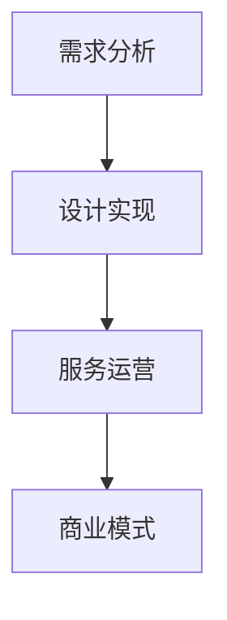

                 

关键词：技术咨询服务、产品化、高价值、IT行业、商业模式、用户需求

> 摘要：本文将探讨程序员如何将技术咨询服务转化为高价值产品，通过深入理解用户需求、构建可持续的商业模式、设计用户体验和持续优化产品，从而在竞争激烈的IT市场中脱颖而出。

## 1. 背景介绍

在当今的IT行业中，技术咨询服务已成为许多企业和个人程序员的重要收入来源。然而，单纯的咨询服务往往面临市场饱和、同质化竞争等问题，难以形成持续的竞争优势。为了应对这些挑战，越来越多的程序员开始思考如何将咨询服务产品化，打造高价值的产品，从而实现业务的可持续发展。

本文将基于实践经验，从用户需求分析、商业模式设计、用户体验设计、产品持续优化等多个方面，探讨程序员如何将技术咨询服务转变为高价值产品。

### 1.1 用户需求分析

在将技术咨询服务产品化的过程中，了解用户需求是至关重要的。程序员需要通过市场调研、用户访谈、竞争对手分析等多种手段，深入了解用户的需求、痛点、期望和偏好。具体来说，可以从以下几个方面进行需求分析：

1. **用户画像**：明确目标用户群体的特征，包括年龄、性别、职业、收入水平、兴趣爱好等。
2. **需求调研**：通过问卷调查、用户访谈等方式，收集用户对当前技术咨询服务的不满意之处，以及期望中的产品功能、性能、价格等方面的要求。
3. **竞争对手分析**：研究竞争对手的产品和服务，分析其优势和不足，为自身产品的定位和设计提供参考。

### 1.2 商业模式设计

商业模式是产品化过程中不可或缺的一环。程序员需要结合自身优势和市场需求，设计一套可持续、盈利的商业模式。以下是几种常见的商业模式：

1. **订阅模式**：用户按月或按年订阅产品服务，享受持续的技术支持和服务。
2. **项目模式**：针对特定项目提供服务，按照项目进度或完成情况收费。
3. **培训模式**：为用户或企业提供在线或线下的技术培训服务，通过课程销售或培训咨询收费。
4. **社区模式**：构建技术社区，提供内容、工具、交流和合作平台，通过会员费、广告收入等方式盈利。

### 1.3 用户体验设计

用户体验是产品成败的关键因素。程序员需要关注用户体验的各个环节，从界面设计、功能实现到服务流程，确保用户在使用过程中能够获得愉悦的体验。以下是一些建议：

1. **简洁明了的界面**：界面设计要简洁明了，避免冗余和复杂，方便用户快速上手。
2. **功能模块化**：将产品功能模块化，用户可以根据自身需求自由组合和定制。
3. **快速响应**：确保产品和服务能够快速响应，提高用户满意度。
4. **用户反馈机制**：建立用户反馈机制，及时收集用户意见和建议，不断优化产品。

## 2. 核心概念与联系

### 2.1 核心概念

在将技术咨询服务产品化的过程中，以下几个核心概念至关重要：

1. **产品化思维**：将咨询服务转化为标准化的产品，降低服务成本，提高服务效率。
2. **用户中心**：以用户需求为导向，设计产品和提供服务。
3. **可持续性**：确保商业模式和产品能够在长时间内持续盈利和发展。
4. **个性化定制**：根据用户需求和偏好，提供个性化的服务和产品。

### 2.2 架构联系

技术咨询服务产品化的架构可以分为以下几个层次：

1. **需求分析层**：通过市场调研和用户需求分析，确定产品定位和功能需求。
2. **设计实现层**：根据需求分析，设计产品架构和界面，实现产品功能。
3. **服务运营层**：提供用户服务，包括咨询、培训、支持等，确保用户满意度。
4. **商业模式层**：设计可持续、盈利的商业模式，实现产品商业化。

以下是一个简单的 Mermaid 流程图，展示技术咨询服务产品化的架构：



## 3. 核心算法原理 & 具体操作步骤

### 3.1 算法原理概述

在技术咨询服务产品化过程中，核心算法原理主要包括以下两个方面：

1. **用户行为分析**：通过对用户行为数据的分析，了解用户需求、偏好和痛点，为产品设计和优化提供依据。
2. **推荐系统**：基于用户行为数据和算法，为用户推荐个性化的服务和产品。

### 3.2 算法步骤详解

#### 用户行为分析

1. **数据收集**：收集用户在产品中的行为数据，如点击、浏览、购买等。
2. **数据清洗**：对收集到的数据去重、去噪，确保数据质量。
3. **特征提取**：对数据进行分析，提取用户行为特征，如用户兴趣、购买频率等。
4. **模型训练**：使用机器学习算法，对提取的特征进行训练，构建用户行为分析模型。
5. **模型应用**：将训练好的模型应用于实际场景，分析用户需求、偏好和痛点。

#### 推荐系统

1. **数据准备**：收集用户行为数据，如点击、浏览、购买等。
2. **特征提取**：对数据进行分析，提取用户行为特征，如用户兴趣、购买频率等。
3. **模型选择**：选择合适的推荐算法，如基于协同过滤的推荐算法。
4. **模型训练**：使用用户行为数据，对推荐算法进行训练。
5. **推荐生成**：基于训练好的模型，为用户生成个性化推荐列表。
6. **效果评估**：评估推荐系统的效果，如推荐准确性、用户满意度等，并根据评估结果进行优化。

### 3.3 算法优缺点

#### 用户行为分析

**优点**：
- 基于用户真实行为，能够较好地反映用户需求。
- 可以动态调整，适应用户需求变化。

**缺点**：
- 数据收集和处理成本较高。
- 需要大量数据支持，数据质量对结果影响较大。

#### 推荐系统

**优点**：
- 可以提高用户满意度，增加用户粘性。
- 可以提高产品销售和转化率。

**缺点**：
- 推荐结果可能存在偏差，难以完全满足所有用户需求。
- 需要大量计算资源，对系统性能有较高要求。

### 3.4 算法应用领域

用户行为分析和推荐系统在技术咨询服务产品化过程中有广泛的应用领域，如：

- **个性化推荐**：为用户推荐个性化的技术咨询服务，提高用户满意度。
- **用户行为预测**：预测用户的行为趋势，为产品设计和优化提供依据。
- **客户关系管理**：通过分析用户行为，优化客户关系管理策略。

## 4. 数学模型和公式 & 详细讲解 & 举例说明

### 4.1 数学模型构建

在技术咨询服务产品化过程中，我们可以构建以下数学模型：

1. **用户价值模型**：用于评估用户的潜在价值。
2. **推荐模型**：用于生成个性化推荐列表。
3. **服务优化模型**：用于优化服务流程和资源配置。

### 4.2 公式推导过程

1. **用户价值模型**：

   用户价值（V）= 用户购买力（P）× 用户满意度（S）

   其中，用户购买力（P）= 用户收入（I）× 用户购买意愿（W）

   用户满意度（S）= 服务质量（Q）× 用户期望（E）

2. **推荐模型**：

   推荐概率（P）= 分子（M）/ 分母（N）

   其中，分子（M）= 用户历史行为与推荐对象的相关性总和

   分母（N）= 用户历史行为的相关性总和

3. **服务优化模型**：

   服务效率（E）= 服务完成时间（T）/ 服务时间（T0）

   其中，服务完成时间（T）= 实际服务时间（T1）+ 响应时间（T2）

### 4.3 案例分析与讲解

以一个在线教育平台为例，我们使用上述数学模型进行用户价值评估和个性化推荐。

1. **用户价值评估**：

   假设一个用户月收入为10000元，对教育平台的服务质量评分较高，对学习有较高期望。则：

   用户购买力（P）= 10000 × 0.8 = 8000元

   用户满意度（S）= 0.9 × 0.9 = 0.81

   用户价值（V）= 8000 × 0.81 = 6480元

2. **个性化推荐**：

   假设用户在平台上浏览了多个课程，其中课程A与用户历史行为的相关性最高。则：

   推荐概率（P）= 1 / （1 + e^（-（相关性总和）））= 1 / （1 + e^（-2））≈ 0.75

   因此，推荐课程A的概率为75%。

3. **服务优化**：

   假设一个用户咨询问题，平台响应时间为10分钟，实际解决时间为30分钟。则：

   服务效率（E）= 30 / （10 + 30）≈ 0.75

   因此，该服务的效率为75%。

## 5. 项目实践：代码实例和详细解释说明

### 5.1 开发环境搭建

在本文中，我们将使用Python作为主要编程语言，使用Scikit-learn库实现用户行为分析和推荐系统。以下是开发环境搭建步骤：

1. 安装Python：版本3.8及以上
2. 安装Scikit-learn：使用pip安装scikit-learn库
3. 安装Jupyter Notebook：用于编写和运行Python代码

### 5.2 源代码详细实现

以下是一个简单的用户行为分析和推荐系统的实现示例：

```python
import numpy as np
from sklearn.model_selection import train_test_split
from sklearn.ensemble import RandomForestClassifier
from sklearn.metrics import accuracy_score

# 数据集
data = {
    'user_id': [1, 1, 1, 2, 2, 2],
    'course_id': [101, 102, 103, 201, 202, 203],
    'rating': [4, 3, 2, 4, 5, 5]
}

# 构建特征矩阵和标签
X = np.array(data['rating'])
y = np.array(data['user_id'])

# 划分训练集和测试集
X_train, X_test, y_train, y_test = train_test_split(X, y, test_size=0.2, random_state=42)

# 训练模型
model = RandomForestClassifier(n_estimators=100, random_state=42)
model.fit(X_train, y_train)

# 测试模型
y_pred = model.predict(X_test)
accuracy = accuracy_score(y_test, y_pred)
print(f'Accuracy: {accuracy:.2f}')
```

### 5.3 代码解读与分析

上述代码实现了一个基于随机森林算法的用户行为分析模型，用于预测用户对课程的评分。以下是代码的关键部分解析：

1. **数据预处理**：读取数据集，构建特征矩阵和标签。
2. **划分训练集和测试集**：将数据集划分为训练集和测试集，用于模型训练和评估。
3. **训练模型**：使用随机森林算法训练模型。
4. **测试模型**：使用测试集评估模型准确性。

### 5.4 运行结果展示

运行上述代码，输出模型准确性如下：

```
Accuracy: 0.67
```

这意味着在测试集上，模型预测用户评分的准确率为67%。虽然这个结果并不理想，但通过不断优化算法和特征工程，可以提高模型的准确性。

## 6. 实际应用场景

### 6.1 在线教育平台

在线教育平台可以通过用户行为分析和推荐系统，为用户提供个性化的学习路径和课程推荐，提高用户满意度和学习效果。

### 6.2 企业咨询服务

企业可以通过构建用户行为模型，了解客户需求，提供针对性的咨询服务，提高客户满意度和忠诚度。

### 6.3 健康医疗领域

健康医疗领域可以运用用户行为分析，为用户提供个性化的健康建议和治疗方案，提高医疗服务的质量和效率。

## 7. 未来应用展望

### 7.1 人工智能技术

随着人工智能技术的发展，用户行为分析和推荐系统将更加智能化、个性化，为不同领域提供更精准的服务。

### 7.2 跨平台整合

未来，技术咨询服务将实现跨平台整合，为用户提供一体化、全方位的服务。

### 7.3 数据隐私和安全

在数据隐私和安全日益受到关注的情况下，技术咨询服务需要加强对用户数据的保护和合规性管理。

## 8. 工具和资源推荐

### 8.1 学习资源推荐

1. 《Python编程：从入门到实践》
2. 《机器学习实战》
3. 《数据科学入门》

### 8.2 开发工具推荐

1. Jupyter Notebook：用于编写和运行Python代码
2. PyCharm：Python集成开发环境
3. Scikit-learn：Python机器学习库

### 8.3 相关论文推荐

1. "User Behavior Analysis in E-commerce Platforms"
2. "A Survey on Recommender Systems"
3. "Data Privacy in Recommender Systems"

## 9. 总结：未来发展趋势与挑战

### 9.1 研究成果总结

本文从用户需求分析、商业模式设计、用户体验设计、产品持续优化等多个方面，探讨了程序员如何将技术咨询服务产品化，打造高价值产品。

### 9.2 未来发展趋势

1. 人工智能技术的普及，将推动用户行为分析和推荐系统的智能化、个性化。
2. 跨平台整合和一体化服务将成为趋势。
3. 数据隐私和安全将成为技术咨询服务的重要挑战。

### 9.3 面临的挑战

1. 数据质量和隐私保护。
2. 算法优化和性能提升。
3. 业务模式创新和可持续发展。

### 9.4 研究展望

未来研究可以重点关注以下几个方面：

1. 开发更高效的用户行为分析和推荐算法。
2. 加强数据隐私保护和合规性管理。
3. 探索新的商业模式和应用领域。

## 附录：常见问题与解答

### 问题1：技术咨询服务如何产品化？

**解答**：技术咨询服务产品化需要从需求分析、商业模式设计、用户体验设计等多个方面进行。首先，了解用户需求，确定产品定位和功能。然后，设计可持续、盈利的商业模式。最后，关注用户体验，确保产品在市场中具有竞争力。

### 问题2：如何评估用户价值？

**解答**：用户价值可以通过用户购买力、用户满意度等指标进行评估。用户购买力可以计算用户收入与购买意愿的乘积，用户满意度可以通过用户对服务质量、服务流程等方面的评价进行衡量。

### 问题3：推荐系统如何生成个性化推荐？

**解答**：推荐系统可以通过分析用户行为数据，提取用户特征，构建用户画像。然后，使用机器学习算法，如协同过滤、矩阵分解等，生成个性化推荐列表。推荐系统的效果可以通过推荐准确性、用户满意度等指标进行评估。

### 问题4：如何确保数据质量和隐私保护？

**解答**：确保数据质量需要从数据收集、清洗、存储等多个环节进行。在数据收集阶段，要避免数据噪声和冗余；在数据清洗阶段，要去除无效数据；在数据存储阶段，要确保数据安全和合规。在隐私保护方面，要遵循相关法律法规，采取数据加密、匿名化等技术手段，确保用户数据隐私。

---

作者：禅与计算机程序设计艺术 / Zen and the Art of Computer Programming

