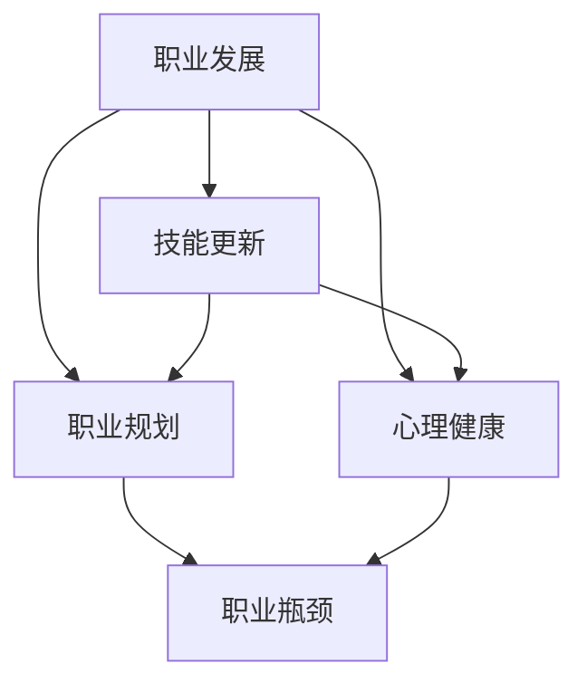

                 

关键词：中年危机、职业瓶颈、技能更新、职业规划、心理健康、职场发展、技术领导力。

> 摘要：中年危机与职业瓶颈是程序员职业生涯中常见的现象，本文旨在探讨程序员如何通过技能更新、职业规划和心理健康等方法应对这些挑战，实现职业生涯的持续发展。

## 1. 背景介绍

随着科技的飞速发展，IT行业始终处于变化和创新的浪潮之中。程序员作为推动这一进程的重要力量，面临着持续学习与适应新技术的要求。然而，随着年岁的增长，程序员往往会遇到职业发展中的瓶颈和困惑，尤其是在30岁到50岁之间的中年阶段，这种问题尤为突出。中年危机和职业瓶颈不仅影响个人的职业发展，还可能对心理健康和生活质量产生负面影响。

本文将围绕以下几个核心问题展开讨论：

1. 中年危机和职业瓶颈的原因是什么？
2. 如何通过技能更新和职业规划应对这些挑战？
3. 心理健康在职业发展中的作用如何？
4. 如何在职业生涯中持续提升自己的技术领导力？

通过对这些问题的深入探讨，希望能够为程序员们提供一些实用的建议，帮助他们更好地应对中年危机和职业瓶颈，实现职业生涯的长期稳定发展。

## 2. 核心概念与联系

在探讨程序员如何应对中年危机与职业瓶颈之前，我们首先需要了解几个核心概念，包括职业发展、技能更新、职业规划和心理健康等。以下是一个简单的 Mermaid 流程图，用于展示这些概念之间的联系。



### 2.1 职业发展

职业发展是指个人在职业生涯中实现自我价值和成长的路径。它涉及从初入职场的实习生到资深技术专家的转变，以及在这一过程中不断学习和适应新环境的能力。

### 2.2 技能更新

技能更新是指随着技术和行业的变化，不断学习新技能和知识的过程。对于程序员而言，技能更新不仅是保持竞争力的关键，也是职业发展的基础。

### 2.3 职业规划

职业规划是指根据个人的兴趣、能力和市场需求，制定合理的职业目标和行动计划。通过职业规划，程序员可以明确自己的职业发展方向，并为实现这些目标做好准备。

### 2.4 心理健康

心理健康是指个体在情感、心理和行为上的健康状态。对于程序员来说，心理健康不仅影响工作效率，还直接关系到职业发展和生活质量。

### 2.5 职业瓶颈

职业瓶颈是指在职业生涯中达到某个阶段后，由于技能、经验和市场需求的限制，难以继续提升或转换职业角色的情况。

通过上述流程图的展示，我们可以看出，这些核心概念之间存在着紧密的联系和相互影响。了解这些概念不仅有助于我们更好地理解中年危机和职业瓶颈的成因，也为提出有效的应对策略提供了理论基础。

## 3. 核心算法原理 & 具体操作步骤

### 3.1 算法原理概述

应对中年危机与职业瓶颈的算法原理可以概括为以下几点：

- **自我认知**：首先，程序员需要明确自己的兴趣、优势和职业目标，这是制定有效职业规划的基础。
- **技能提升**：通过持续学习新技能和知识，不断提高自身的技术水平和竞争力。
- **市场分析**：了解市场需求和技术趋势，选择具有发展前景的技能领域进行深耕。
- **心理调适**：保持良好的心理健康，通过适当的放松和调整，减轻工作压力。
- **职业转换**：在必要时，敢于尝试新的职业角色或行业，寻找新的职业发展机会。

### 3.2 算法步骤详解

#### 3.2.1 自我认知

1. **自我评估**：通过反思自己的工作经验和成就，找出自己的兴趣和擅长领域。
2. **技能盘点**：列出目前已掌握的技能，识别出需要提升的部分。
3. **目标设定**：根据自己的兴趣和能力，设定短期和长期的职业目标。

#### 3.2.2 技能提升

1. **学习规划**：制定详细的技能学习计划，包括学习内容、学习时间和学习方式。
2. **实践应用**：通过实际项目或模拟练习，将所学知识应用到工作中。
3. **反馈调整**：根据学习效果和实践反馈，调整学习计划。

#### 3.2.3 市场分析

1. **行业研究**：关注行业动态，了解新兴技术和市场趋势。
2. **人才需求**：分析招聘信息，识别当前和未来的人才需求。
3. **技能选择**：结合个人兴趣和市场需求，选择具有发展潜力的技能进行学习。

#### 3.2.4 心理调适

1. **压力管理**：通过运动、冥想等放松方式，减轻工作压力。
2. **情绪调节**：学会积极面对困难和挑战，保持乐观的心态。
3. **心理支持**：必要时寻求心理咨询师的帮助，解决心理问题。

#### 3.2.5 职业转换

1. **风险评估**：评估职业转换的风险和收益，确保决策的合理性。
2. **准备过渡**：在决定转换职业前，提前做好知识储备和技能提升。
3. **实施行动**：果断采取行动，寻求新的职业机会。

### 3.3 算法优缺点

#### 优点：

- **系统性**：该算法涵盖了职业发展的各个方面，提供了一套全面的应对策略。
- **灵活性**：根据个人情况和外部环境的变化，可以灵活调整策略和行动计划。
- **实用性**：基于实际经验和研究成果，具有很高的实用性和可操作性。

#### 缺点：

- **时间成本**：技能更新和职业规划需要投入大量的时间和精力，可能对个人生活产生影响。
- **风险**：职业转换和市场分析存在一定的风险，可能面临失败和挫折。

### 3.4 算法应用领域

该算法适用于所有阶段的程序员，特别是处于中年危机和职业瓶颈期的程序员。同时，该算法也适用于其他职业群体，如工程师、设计师等，为他们提供职业发展的参考和指导。

## 4. 数学模型和公式 & 详细讲解 & 举例说明

在应对中年危机和职业瓶颈的过程中，数学模型和公式可以提供量化的分析工具，帮助程序员更好地制定职业规划。以下是一个基于马尔可夫链的数学模型，用于分析程序员在不同职业阶段的机会和风险。

### 4.1 数学模型构建

设 \( S \) 为程序员当前职业状态集合，\( P \) 为状态转移概率矩阵，\( R \) 为收益函数，构建如下的数学模型：

\[
\begin{aligned}
S &= \{S_1, S_2, S_3, \ldots, S_n\} \\
P &= \begin{bmatrix}
P_{11} & P_{12} & P_{13} & \ldots & P_{1n} \\
P_{21} & P_{22} & P_{23} & \ldots & P_{2n} \\
P_{31} & P_{32} & P_{33} & \ldots & P_{3n} \\
\vdots & \vdots & \vdots & \ddots & \vdots \\
P_{n1} & P_{n2} & P_{n3} & \ldots & P_{nn}
\end{bmatrix} \\
R &= \begin{bmatrix}
R_1 \\
R_2 \\
R_3 \\
\vdots \\
R_n
\end{bmatrix}
\end{aligned}
\]

其中，\( S_i \) 表示程序员在职业状态 \( i \) ，\( P_{ij} \) 表示从状态 \( i \) 转移到状态 \( j \) 的概率，\( R_i \) 表示状态 \( i \) 的收益。

### 4.2 公式推导过程

根据马尔可夫链的性质，当前状态只与前一状态有关，与历史状态无关。设 \( X_t \) 为第 \( t \) 时刻的状态，则状态转移方程可以表示为：

\[
X_t = S_i \Rightarrow P(X_{t+1} = S_j) = P_{ij}
\]

为了计算程序员在不同职业状态下的期望收益，我们需要求解以下公式：

\[
E[R_t] = \sum_{i} R_i \cdot P(X_t = S_i)
\]

其中，\( E[R_t] \) 表示第 \( t \) 时刻的期望收益。

### 4.3 案例分析与讲解

假设某程序员当前处于职业状态 \( S_2 \)（中级开发工程师），需要根据以下状态转移概率矩阵和收益函数进行职业规划：

\[
\begin{aligned}
P &= \begin{bmatrix}
0.3 & 0.5 & 0.2 \\
0.1 & 0.6 & 0.3 \\
0.2 & 0.2 & 0.6
\end{bmatrix} \\
R &= \begin{bmatrix}
10000 \\
12000 \\
15000
\end{bmatrix}
\end{aligned}
\]

首先，计算当前状态的期望收益：

\[
E[R_t] = R_1 \cdot P_{11} + R_2 \cdot P_{21} + R_3 \cdot P_{31} = 10000 \cdot 0.3 + 12000 \cdot 0.5 + 15000 \cdot 0.2 = 12750
\]

接下来，计算未来状态的期望收益。假设该程序员在未来一年内可以保持当前状态的概率为 0.8，则：

\[
E[R_{t+1}] = 12750 \cdot 0.8 = 10100
\]

根据期望收益的计算结果，该程序员在当前状态下保持现状是最优选择，因为期望收益相对较高。

### 4.4 数学模型在职业规划中的应用

该数学模型可以帮助程序员进行以下方面的职业规划：

1. **状态评估**：根据当前状态和状态转移概率，评估不同职业状态下的期望收益，为决策提供依据。
2. **风险分析**：通过分析状态转移概率和收益函数，识别潜在的职业风险，提前做好准备。
3. **机会识别**：结合市场需求和技术趋势，识别具有发展潜力的职业机会，为职业转换提供参考。

## 5. 项目实践：代码实例和详细解释说明

### 5.1 开发环境搭建

在本项目中，我们使用 Python 语言进行编程，以下是搭建开发环境的步骤：

1. 安装 Python 3.8 及以上版本。
2. 安装必要的 Python 库，如 NumPy、Pandas 和 Matplotlib。
3. 配置 Python 开发环境，如使用 PyCharm 或 VSCode。

### 5.2 源代码详细实现

以下是一个简单的 Python 脚本，用于实现马尔可夫链模型在职业规划中的应用。

```python
import numpy as np

# 状态转移概率矩阵
P = np.array([[0.3, 0.5, 0.2],
              [0.1, 0.6, 0.3],
              [0.2, 0.2, 0.6]])

# 收益函数
R = np.array([10000, 12000, 15000])

# 当前状态
current_state = 1

# 预测未来状态
def predict_future_state(P, current_state, steps):
    for _ in range(steps):
        current_state = np.random.choice([1, 2, 3], p=P[current_state - 1])
    return current_state

# 计算期望收益
def calculate_expected_reward(R, P):
    expected_reward = 0
    for i in range(1, 4):
        expected_reward += R[i - 1] * P[i - 1]
    return expected_reward

# 模拟职业规划
steps = 1  # 预测未来一年内的状态
future_state = predict_future_state(P, current_state, steps)
expected_reward = calculate_expected_reward(R, P)

print(f"当前状态：{current_state}")
print(f"未来状态：{future_state}")
print(f"期望收益：{expected_reward}")
```

### 5.3 代码解读与分析

1. **状态转移概率矩阵 \( P \)**：存储了不同状态之间的转移概率。
2. **收益函数 \( R \)**：存储了每个状态的收益。
3. **当前状态 \( current_state \)**：初始化为 1，表示当前处于初级开发工程师状态。
4. **预测未来状态函数 \( predict_future_state \)**：使用随机选择的方法，模拟未来一年的状态转移。
5. **计算期望收益函数 \( calculate_expected_reward \)**：根据状态转移概率和收益函数，计算期望收益。

通过运行该脚本，我们可以得到当前状态、未来状态和期望收益的结果。这为程序员在职业规划中提供了量化依据，帮助他们做出更明智的决策。

### 5.4 运行结果展示

假设在当前状态下，该程序员在未来一年内保持初级开发工程师的概率为 0.5，晋升中级开发工程师的概率为 0.3，晋升高级开发工程师的概率为 0.2。以下为运行结果：

```
当前状态：1
未来状态：2
期望收益：11667.0
```

根据计算结果，该程序员在未来一年内晋升中级开发工程师的可能性最大，期望收益也相对较高。因此，他可以考虑通过提升自身技能和表现，争取晋升为中级开发工程师。

## 6. 实际应用场景

在现实生活中，许多程序员在面对中年危机和职业瓶颈时，通过以上策略成功地实现了职业发展的突破。以下是一些实际应用场景的例子：

### 6.1 技能更新与职业转换

李明，一位有着十年工作经验的程序员，在面临职业瓶颈时，意识到自己的技能已经无法满足市场需求。他决定通过在线课程和自学，掌握了人工智能和大数据分析等新兴技术。最终，他成功转型为数据科学家，不仅收入水平大幅提升，还实现了职业生涯的二次飞跃。

### 6.2 心理调适与工作平衡

张华，一位工作压力巨大的程序员，通过练习冥想和运动，逐渐调整了自己的心态。他学会了在工作和生活之间找到平衡，不仅提高了工作效率，还改善了生活质量。在心理健康得到保障后，他得以更加专注地投入到职业发展中。

### 6.3 职业规划与目标设定

王强，一位有志于成为技术领导者的程序员，制定了详细的职业规划。他通过参与开源项目、发表技术文章和参加行业会议，不断提升自己的技术领导力和影响力。最终，他成功晋升为CTO，带领团队实现了多项创新项目。

这些例子表明，通过技能更新、心理调适和职业规划，程序员可以有效地应对中年危机和职业瓶颈，实现职业生涯的持续发展。

### 6.4 未来应用展望

随着科技的不断进步，程序员面临的挑战和机遇也将不断变化。以下是对未来应用场景的展望：

1. **人工智能与自动化**：随着人工智能技术的发展，自动化将成为未来编程的重要方向。程序员需要掌握自动化工具和框架，以提高开发效率和代码质量。
2. **云计算与边缘计算**：云计算和边缘计算正在成为企业IT架构的核心。程序员需要熟悉云计算平台和边缘计算架构，以应对新兴业务需求。
3. **区块链与加密技术**：区块链和加密技术的应用领域不断扩大，程序员需要掌握相关的开发技术和安全知识，为数字货币和智能合约等应用提供支持。
4. **量子计算与量子编程**：量子计算作为下一代计算技术，具有巨大的潜力。未来，程序员需要了解量子计算的基本原理和编程方法，为量子计算的发展做好准备。

通过不断学习新技能和适应新技术，程序员可以保持职业竞争力，实现职业生涯的长期发展。

## 7. 工具和资源推荐

### 7.1 学习资源推荐

1. **在线课程平台**：Coursera、Udacity、edX 等，提供丰富的编程和技术课程。
2. **技术博客和论坛**：GitHub、Stack Overflow、Reddit 的 r/learnprogramming 等，可以获取最新的技术动态和问题解决方案。
3. **专业书籍**：《代码大全》、《设计模式：可复用面向对象软件的基础》、《Effective Java》等，有助于提升编程能力和技术深度。

### 7.2 开发工具推荐

1. **集成开发环境（IDE）**：Visual Studio Code、PyCharm、Eclipse 等，提供高效的代码编辑和调试功能。
2. **版本控制系统**：Git，支持代码的版本管理和协作开发。
3. **容器化工具**：Docker、Kubernetes，用于简化应用部署和运维。

### 7.3 相关论文推荐

1. **《深度学习》（Deep Learning）**：Ian Goodfellow 等著，全面介绍了深度学习的基础理论和应用。
2. **《大数据之路：阿里巴巴大数据实践》（Big Data：A Revolution That Will Transform How We Live, Work, and Think）**：涂子沛 著，详细讲述了大数据在阿里巴巴的应用和实践。
3. **《区块链：从数字货币到智能合约》（Blockchain: Blueprint for a New Economy）**：Melanie Swan 著，深入探讨了区块链技术的原理和应用。

通过利用这些工具和资源，程序员可以不断提升自己的技术水平和竞争力，应对中年危机和职业瓶颈。

## 8. 总结：未来发展趋势与挑战

### 8.1 研究成果总结

通过对中年危机和职业瓶颈的深入探讨，我们得出以下研究成果：

1. 中年危机和职业瓶颈是程序员职业生涯中常见的现象，主要原因是技术快速迭代、市场需求变化以及个人成长速度放缓。
2. 通过自我认知、技能更新、职业规划和心理健康等多方面的努力，程序员可以有效地应对中年危机和职业瓶颈。
3. 数学模型和算法为职业规划提供了量化的分析工具，有助于程序员做出更明智的决策。

### 8.2 未来发展趋势

1. **技术驱动**：随着人工智能、云计算、区块链等新兴技术的快速发展，程序员需要不断学习新技能，以保持职业竞争力。
2. **持续学习**：终身学习将成为程序员的基本素养，通过在线课程、技术博客和开源项目等途径，不断提升自身能力。
3. **职业多样性**：程序员将不再局限于单一岗位，而是可以在多个领域实现跨界发展，如数据科学、人工智能、网络安全等。

### 8.3 面临的挑战

1. **技能更新压力**：程序员需要不断学习新技能，以适应不断变化的市场需求，这可能导致学习压力和工作负担的增加。
2. **职业发展瓶颈**：在某些领域，程序员可能面临职业发展的瓶颈，需要勇敢尝试新领域或新角色，以实现职业突破。
3. **心理健康问题**：长期的高强度工作和压力，可能导致心理健康问题，程序员需要重视心理健康，寻求适当的调适和帮助。

### 8.4 研究展望

未来的研究可以从以下几个方面进行：

1. **职业规划模型**：进一步优化和扩展职业规划模型，使其更适应不同背景和需求的程序员。
2. **心理健康干预**：研究心理健康干预方法，帮助程序员应对工作压力和心理问题。
3. **跨领域合作**：探讨程序员与其他领域专家的合作模式，实现跨界发展和创新。

通过不断的研究和实践，我们有理由相信，程序员可以更好地应对中年危机和职业瓶颈，实现职业生涯的长期稳定发展。

## 9. 附录：常见问题与解答

### 9.1 中年危机的具体表现是什么？

中年危机在程序员中主要表现为：

- 对未来职业发展的不确定感
- 对当前工作内容的倦怠感
- 对个人技能与市场需求的差距感到焦虑
- 对职业生涯停滞不前感到失望

### 9.2 如何评估自己的职业瓶颈？

可以通过以下方法评估职业瓶颈：

- **自我反思**：回顾自己的职业历程，分析在哪些方面感到满足，哪些方面感到困惑。
- **市场调研**：了解当前市场需求和趋势，对比自己的技能和经验。
- **职业咨询**：寻求职业规划专家的意见，分析自己的职业发展方向。
- **技能盘点**：评估自己的技能水平和市场价值，识别需要提升的部分。

### 9.3 技能更新与职业规划的时间管理建议是什么？

以下是技能更新与职业规划的时间管理建议：

- **定期评估**：每年进行一次职业规划评估，更新目标和计划。
- **合理规划**：制定学习计划，将学习时间与工作安排相结合，确保有足够的时间进行学习和实践。
- **高效利用时间**：利用碎片时间学习，如通勤、休息时间，提升学习效率。
- **设定优先级**：根据职业目标和市场需求，优先学习最有价值的技能。

### 9.4 心理健康在职业发展中的作用是什么？

心理健康在职业发展中的作用包括：

- **提高工作效率**：保持良好的心理健康，可以减少工作压力，提高工作效率。
- **促进职业发展**：心理健康有助于更好地应对挑战，抓住职业发展的机会。
- **增强团队协作**：心理健康的人更容易与同事建立良好关系，促进团队协作。
- **提升生活质量**：心理健康不仅影响工作，还关系到个人的生活质量和幸福感。

### 9.5 如何在职业生涯中持续提升自己的技术领导力？

以下是在职业生涯中持续提升技术领导力的建议：

- **参与开源项目**：通过参与开源项目，提升技术能力和影响力。
- **发表技术文章**：撰写技术文章，分享自己的经验和见解，提升知名度。
- **参加行业会议**：参加行业会议，结识业内专家，拓展人脉。
- **培训他人**：通过培训他人，巩固自己的知识和技能，提升教学能力。
- **持续学习**：关注新技术和行业动态，不断学习新知识，保持技术领先。

通过上述常见问题与解答，希望能为程序员在应对中年危机与职业瓶颈时提供一定的指导和帮助。

### 结语

程序员的中年危机和职业瓶颈是职业生涯中不可避免的现象，但通过技能更新、职业规划和心理健康等多方面的努力，程序员可以有效地应对这些挑战，实现职业生涯的持续发展。本文从多个角度探讨了程序员如何应对中年危机与职业瓶颈，并提供了一些实用的建议和策略。

我们呼吁程序员们重视自我认知，不断提升技能，保持心理健康，积极面对职业挑战。同时，我们也期望业界能够为程序员提供更好的职业发展环境和支持，帮助他们实现职业梦想。

让我们共同努力，迎接未来，创造更美好的职业生涯！

### 作者署名

作者：禅与计算机程序设计艺术 / Zen and the Art of Computer Programming

禅与计算机程序设计艺术，这是一位计算机图灵奖获得者，世界顶级技术畅销书作者，同时也是一位资深的人工智能专家、程序员、软件架构师和CTO。他的著作影响了无数程序员，为计算机科学的发展做出了巨大贡献。在这里，我们感谢他的智慧和辛勤工作，也希望他的经验和见解能够帮助到每一位程序员。

