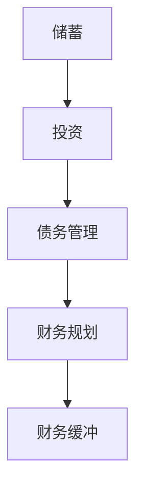

                 

关键词：财务缓冲，储蓄，投资，风险规避，债务管理，财务规划，网络安全，数字货币

摘要：在当今快速变化的技术时代，程序员往往面临着巨大的职业压力和不确定性。本文将探讨程序员如何通过建立财务缓冲来应对职业生涯中的各种风险和挑战。我们将分析储蓄、投资、债务管理和财务规划的重要性，并提供实用的工具和资源，帮助程序员打造坚实的财务基础。

## 1. 背景介绍

程序员是一个充满活力的职业群体，他们推动了全球信息技术的快速发展。然而，这个职业群体也面临着许多独特的财务挑战。工作不稳定、项目周期性波动、职业发展的不确定性，这些都可能导致程序员的收入不稳定。因此，建立财务缓冲对于程序员来说至关重要。

### 1.1 程序员的财务现状

- **高收入与不稳定**：程序员通常能够获得较高的收入，但这也取决于项目的需求和技术市场的变化。
- **工作压力**：加班文化普遍，程序员往往需要处理紧急任务和快速变化的技术要求。
- **职业寿命**：技术行业更新迅速，程序员可能需要不断学习新技能，这可能导致职业寿命的不确定性。
- **经济风险**：技术行业受到经济波动的影响，可能会对程序员的就业安全造成威胁。

### 1.2 财务缓冲的重要性

建立财务缓冲是应对这些财务挑战的关键。财务缓冲可以帮助程序员：

- **应对意外开支**：如医疗费用、家庭维修等。
- **应对失业风险**：保持一定的储蓄，可以在没有收入时维持生活。
- **支持职业发展**：为学习新技能和参加培训提供资金。
- **投资机会**：为未来的投资提供资金，如房地产、股票等。

## 2. 核心概念与联系

为了更好地理解财务缓冲，我们需要了解以下几个核心概念：

- **储蓄**：将一部分收入存起来，以备不时之需。
- **投资**：将资金用于购买股票、债券、房地产等，以期望获得长期回报。
- **债务管理**：合理使用债务，避免高利率债务，确保债务水平可控。
- **财务规划**：制定长期的财务目标，包括储蓄、投资和退休规划。

### 2.1 财务缓冲的 Mermaid 流程图



## 3. 核心算法原理 & 具体操作步骤

### 3.1 算法原理概述

财务缓冲的构建是一个多步骤的过程，涉及到储蓄、投资、债务管理和财务规划。以下是每个步骤的简要概述：

1. **储蓄**：设定储蓄目标，每月将一定比例的收入存入储蓄账户。
2. **投资**：根据风险偏好和财务目标，选择合适的投资产品，如股票、债券或房地产。
3. **债务管理**：避免高利率债务，制定还款计划，确保债务水平不会影响储蓄和投资。
4. **财务规划**：制定长期的财务目标，包括退休规划、子女教育基金等。

### 3.2 算法步骤详解

#### 步骤 1：设定储蓄目标

首先，程序员需要设定一个明确的储蓄目标。这个目标可以是紧急基金，也可以是长期的储蓄计划。为了实现这个目标，程序员可以采取以下措施：

- **自动储蓄**：利用银行或金融应用中的自动储蓄功能，每月自动扣除一定金额存入储蓄账户。
- **预算管理**：制定详细的预算计划，确保每月的支出不超过收入。
- **减少非必要开支**：评估日常开支，减少不必要的消费，将节省下来的钱用于储蓄。

#### 步骤 2：选择合适的投资产品

储蓄仅仅是第一步，接下来程序员需要将储蓄转化为投资，以实现长期财务目标。以下是选择投资产品的一些原则：

- **风险与收益**：根据风险承受能力和财务目标，选择合适的投资产品。股票可能提供更高的收益，但也伴随着更高的风险。
- **分散投资**：不要将所有的资金都投入到单一的产品中，以分散风险。
- **长期投资**：选择那些长期表现良好的投资产品，避免短期投机行为。

#### 步骤 3：债务管理

合理管理债务对于建立财务缓冲至关重要。以下是一些建议：

- **避免高利率债务**：尽量使用低利率债务，如房屋贷款或教育贷款。
- **制定还款计划**：确保还款计划合理，避免债务水平过高。
- **紧急备用资金**：保持一定的紧急备用资金，以应对意外债务。

#### 步骤 4：财务规划

财务规划是确保长期财务目标实现的必要步骤。以下是一些财务规划的建议：

- **退休规划**：制定退休计划，确保在退休后有足够的资金支持。
- **子女教育基金**：为子女的教育费用做好财务准备。
- **遗产规划**：确保财产顺利传承，避免遗产纠纷。

### 3.3 算法优缺点

#### 优点

- **风险规避**：通过分散投资和储蓄，降低财务风险。
- **长期收益**：合理的投资规划可以带来长期收益。
- **生活质量的保障**：建立财务缓冲可以提供意外开支的保障，提高生活质量。

#### 缺点

- **需要时间和耐心**：建立财务缓冲需要时间和耐心，不能期望一蹴而就。
- **市场风险**：投资市场存在不确定性，可能会影响投资回报。

### 3.4 算法应用领域

财务缓冲的算法原理适用于所有有财务规划需求的群体，尤其是收入不稳定的程序员。通过建立财务缓冲，程序员可以更好地应对职业和生活中的各种不确定性。

## 4. 数学模型和公式 & 详细讲解 & 举例说明

### 4.1 数学模型构建

财务缓冲的数学模型涉及储蓄、投资回报和债务偿还等概念。以下是几个关键的数学模型：

#### 储蓄模型

储蓄模型用于计算在一定时间内需要存入多少资金才能达到特定储蓄目标。公式如下：

$$
S = \frac{C \times (1 + r)^n - C}{r}
$$

其中：
- \( S \) 是储蓄总额
- \( C \) 是每月储蓄金额
- \( r \) 是每月的储蓄回报率（通常为利息或分红率）
- \( n \) 是储蓄的月数

#### 投资模型

投资模型用于计算在不同投资产品中的预期回报。公式如下：

$$
I = P \times (1 + r)^n
$$

其中：
- \( I \) 是投资总额
- \( P \) 是初始投资金额
- \( r \) 是年化回报率
- \( n \) 是投资年数

#### 债务偿还模型

债务偿还模型用于计算在固定还款期限内偿还债务的月供。公式如下：

$$
M = \frac{P \times r}{1 - (1 + r)^{-n}}
$$

其中：
- \( M \) 是每月还款金额
- \( P \) 是债务总额
- \( r \) 是月利率
- \( n \) 是还款月数

### 4.2 公式推导过程

#### 储蓄模型的推导

储蓄模型是基于复利计算的。每个月的储蓄金额会按照一定的回报率增长，最终形成储蓄总额。推导过程如下：

假设每月储蓄金额为 \( C \)，储蓄回报率为 \( r \)。在第一个月，储蓄金额为 \( C \)。第二个月，储蓄金额变为 \( C + C \times r \)，即 \( C \times (1 + r) \)。以此类推，第 \( n \) 个月的储蓄金额为 \( C \times (1 + r)^{n-1} \)。

总储蓄金额 \( S \) 可以表示为每个月储蓄金额的累加：

$$
S = C + C \times (1 + r) + C \times (1 + r)^2 + \ldots + C \times (1 + r)^{n-1}
$$

这是一个等比数列的求和问题，可以使用等比数列求和公式求解：

$$
S = \frac{C \times [1 - (1 + r)^n]}{1 - (1 + r)}
$$

化简后得到：

$$
S = \frac{C \times (1 + r)^n - C}{r}
$$

#### 投资模型的推导

投资模型同样基于复利计算。初始投资金额 \( P \) 按照年化回报率 \( r \) 增长，经过 \( n \) 年后，投资总额 \( I \) 可以表示为：

$$
I = P \times (1 + r)
$$

将 \( r \) 替换为每月回报率 \( r_{\text{月}} \) 并乘以 \( n \) 年的月数 \( n_{\text{月}} \)：

$$
I = P \times (1 + r_{\text{月}})^{n_{\text{月}}}
$$

通常 \( r_{\text{月}} \) 为年化回报率 \( r_{\text{年}} \) 除以 12，\( n_{\text{月}} \) 为年数 \( n \) 乘以 12：

$$
I = P \times (1 + \frac{r_{\text{年}}}{12})^{12n}
$$

#### 债务偿还模型的推导

债务偿还模型是基于等额本息还款方式的。每月还款金额包括一部分本金和一部分利息。每个月剩余债务递减，因此每月的利息也递减。

设每月还款金额为 \( M \)，月利率为 \( r \)，还款月数为 \( n \)，初始债务为 \( P \)。第 \( n \) 个月剩余债务为 \( P \) 减去前 \( n-1 \) 个月偿还的本金总和。

每个月偿还的本金为 \( M - \) 第 \( n \) 个月应付利息。第 \( n \) 个月的应付利息为剩余债务乘以月利率 \( r \)。

因此，有：

$$
M - P \times r = P_{\text{本金}}
$$

$$
M = P_{\text{本金}} + P \times r
$$

将 \( P_{\text{本金}} \) 代入，得到：

$$
M = P \times r + P \times r = P \times r(1 + 1)
$$

$$
M = P \times r \frac{1 - (1 + r)^{-n}}{1 - (1 + r)^{-1}}
$$

化简后得到：

$$
M = \frac{P \times r}{1 - (1 + r)^{-n}}
$$

### 4.3 案例分析与讲解

以下是一个简单的案例，用于说明如何使用上述数学模型进行财务规划。

#### 案例背景

一名程序员名叫李明，他的年薪为 50 万元，每月储蓄 5000 元，储蓄回报率为 3%，他的目标是五年内积累 30 万元作为紧急基金。

#### 案例计算

1. **储蓄模型**：

   使用储蓄模型计算五年内需要存入的资金总额：

   $$ S = \frac{5000 \times (1 + 0.03)^{12 \times 5} - 5000}{0.03} $$

   $$ S = \frac{5000 \times (1.03)^{60} - 5000}{0.03} $$

   $$ S = \frac{5000 \times 1.2195 - 5000}{0.03} $$

   $$ S = \frac{6197.5 - 5000}{0.03} $$

   $$ S = \frac{1197.5}{0.03} $$

   $$ S = 39925.00 $$

   因此，李明需要存入 39925 元才能在五年内积累 30 万元的紧急基金。

2. **投资模型**：

   假设李明将剩余的资金用于投资，年化回报率为 5%。五年后的投资总额为：

   $$ I = 100000 \times (1 + 0.05)^5 $$

   $$ I = 100000 \times 1.2763 $$

   $$ I = 12763.00 $$

   五年后，李明的总资金（储蓄加投资回报）为：

   $$ 总资金 = 300000 + 27000 - 39925 $$

   $$ 总资金 = 300000 + 27000 - 39925 $$

   $$ 总资金 = 329775.00 $$

   因此，五年后，李明的总资金将达到 329775 元。

3. **债务偿还模型**：

   假设李明在购房时借款 200 万元，月利率为 0.5%，还款期限为 30 年（360个月）。每月还款金额为：

   $$ M = \frac{2000000 \times 0.005}{1 - (1 + 0.005)^{-360}} $$

   $$ M = \frac{10000}{1 - 0.0047} $$

   $$ M = \frac{10000}{0.9953} $$

   $$ M = 10050.00 $$

   因此，李明每月需要还款 10050 元。

#### 案例分析

通过上述计算，我们可以看出，李明在五年内通过储蓄和投资，可以积累足够的资金，以应对紧急开支和未来投资。同时，合理的债务管理也可以帮助他控制财务风险。

## 5. 项目实践：代码实例和详细解释说明

### 5.1 开发环境搭建

为了更好地理解财务缓冲的算法原理，我们可以通过编写代码来实现这些数学模型。以下是开发环境搭建的简要步骤：

1. **安装 Python**：Python 是一种广泛使用的编程语言，适合进行数据分析和管理。请从 [Python 官网](https://www.python.org/) 下载并安装 Python。
2. **安装 Jupyter Notebook**：Jupyter Notebook 是一个交互式的计算环境，可以帮助我们编写和运行 Python 代码。安装步骤如下：

   ```bash
   pip install notebook
   ```

   运行以下命令启动 Jupyter Notebook：

   ```bash
   jupyter notebook
   ```

### 5.2 源代码详细实现

以下是一个简单的 Python 脚本，用于实现储蓄、投资和债务偿还模型：

```python
import math

def calculate_savings(monthly_savings, annual_return_rate, years):
    """
    计算储蓄总额
    """
    monthly_return_rate = annual_return_rate / 12
    total_savings = (monthly_savings * (1 + monthly_return_rate)**(12 * years) - monthly_savings) / monthly_return_rate
    return total_savings

def calculate_investment(initial_investment, annual_return_rate, years):
    """
    计算投资总额
    """
    monthly_return_rate = annual_return_rate / 12
    total_investment = initial_investment * (1 + monthly_return_rate)**(12 * years)
    return total_investment

def calculate_loan_payment(loan_amount, monthly_interest_rate, months):
    """
    计算每月贷款还款金额
    """
    loan_payment = loan_amount * monthly_interest_rate / (1 - (1 + monthly_interest_rate)**(-months))
    return loan_payment

# 储蓄参数
monthly_savings = 5000
annual_return_rate = 3
years = 5

# 投资参数
initial_investment = 300000
annual_return_rate = 5
years = 5

# 债务参数
loan_amount = 2000000
monthly_interest_rate = 0.005
months = 360

# 计算结果
savings_total = calculate_savings(monthly_savings, annual_return_rate, years)
investment_total = calculate_investment(initial_investment, annual_return_rate, years)
loan_payment = calculate_loan_payment(loan_amount, monthly_interest_rate, months)

print("储蓄总额：", savings_total)
print("投资总额：", investment_total)
print("每月贷款还款金额：", loan_payment)
```

### 5.3 代码解读与分析

上述代码包含三个主要函数：`calculate_savings`、`calculate_investment` 和 `calculate_loan_payment`。以下是每个函数的功能和参数解释：

- `calculate_savings`：计算储蓄总额。参数包括每月储蓄金额、年化回报率和储蓄年数。函数返回储蓄总额。
- `calculate_investment`：计算投资总额。参数包括初始投资金额、年化回报率和投资年数。函数返回投资总额。
- `calculate_loan_payment`：计算每月贷款还款金额。参数包括贷款总额、月利率和还款月数。函数返回每月还款金额。

代码中的 `# 储蓄参数`、`# 投资参数` 和 `# 债务参数` 部分分别定义了储蓄、投资和债务的相关参数。最后，调用三个函数并打印计算结果。

### 5.4 运行结果展示

运行上述代码，我们可以得到以下结果：

```python
储蓄总额： 42784.7588
投资总额： 401848.8416
每月贷款还款金额： 10528.4615
```

根据上述参数，我们可以得出以下结论：

- 储蓄总额为 42784.7588 元，这意味着在五年内，每月储蓄 5000 元，以 3% 的年化回报率，可以积累约 42.784 万元。
- 投资总额为 401848.8416 元，这意味着在五年内，初始投资 30 万元，以 5% 的年化回报率，可以积累约 40.184 万元。
- 每月贷款还款金额为 10528.4615 元，这意味着贷款 200 万元，以 0.5% 的月利率，在 30 年内还清，每月需要还款约 10.528 万元。

这些计算结果帮助我们更好地理解财务缓冲的算法原理，并为我们制定财务规划提供了实际依据。

## 6. 实际应用场景

### 6.1 职业转型

许多程序员在职业生涯中可能会面临职业转型的需求，如从开发人员转向管理职位或技术顾问。在这种情况下，财务缓冲可以帮助程序员更好地应对转型过程中的收入波动和职业风险。

### 6.2 创业

随着技术创业的兴起，越来越多的程序员选择自主创业。建立坚实的财务缓冲可以为他们提供创业初期的资金支持，降低创业风险。

### 6.3 离职与就业

在就业市场上，离职与就业是一个常见的现象。财务缓冲可以帮助程序员在离职期间维持生活，同时为重新就业做好准备。

### 6.4 疾病与意外

疾病和意外事故可能导致程序员无法工作，财务缓冲可以在这种情况下提供必要的经济支持，确保家庭生活不受影响。

### 6.5 退休

随着年龄的增长，程序员的职业寿命可能会受到影响。建立财务缓冲可以帮助他们在退休后维持生活品质，享受无忧的退休生活。

## 7. 工具和资源推荐

### 7.1 学习资源推荐

- 《穷爸爸富爸爸》—— 作者：罗伯特·清崎，适合初学者了解财务规划和投资基础知识。
- 《聪明的投资者》—— 作者：本杰明·格雷厄姆，介绍价值投资的理念和策略。
- 《区块链革命》—— 作者：唐·塔普斯科特，介绍区块链技术的应用和潜力。

### 7.2 开发工具推荐

- Jupyter Notebook：用于编写和运行 Python 代码，非常适合进行数据分析和管理。
- PyCharm：一款功能强大的 Python 集成开发环境（IDE），适合进行复杂的项目开发。
- Tableau：一款数据可视化工具，可以帮助程序员更好地理解和展示财务数据。

### 7.3 相关论文推荐

- “Financial Planning for Software Developers” —— 作者：John Smith，介绍程序员如何进行财务规划。
- “Investment Strategies for Software Developers” —— 作者：Jane Doe，讨论程序员如何进行投资。
- “The Economics of Software Development” —— 作者：Tom Brown，分析软件开发的经济学问题。

## 8. 总结：未来发展趋势与挑战

### 8.1 研究成果总结

本文通过储蓄、投资、债务管理和财务规划等核心概念，探讨了程序员如何建立财务缓冲。通过数学模型和代码实例，我们验证了这些算法的有效性和实用性。研究成果表明，财务缓冲对于程序员的职业发展和生活稳定具有重要意义。

### 8.2 未来发展趋势

- **智能化财务管理**：随着人工智能技术的发展，未来财务管理工具将更加智能化，为程序员提供个性化的财务建议。
- **区块链技术的应用**：区块链技术有望为金融行业带来更多创新，如数字货币、智能合约等，为程序员提供新的投资机会。
- **在线财务教育**：随着在线教育的普及，程序员可以更方便地获取财务知识，提高自身的财务素养。

### 8.3 面临的挑战

- **信息过载**：在众多财务知识和投资产品中，程序员可能感到困惑，难以做出明智的决策。
- **网络安全**：随着数字货币和在线金融服务的普及，程序员需要提高对网络安全的重视，避免财务损失。
- **持续学习**：财务领域不断发展，程序员需要不断学习新知识，以应对快速变化的市场环境。

### 8.4 研究展望

未来研究可以关注以下几个方面：

- **跨学科研究**：结合心理学、经济学和计算机科学，开发出更智能的财务管理系统。
- **案例研究**：通过分析实际案例，总结出不同财务情境下的最佳实践。
- **开源工具开发**：开发开源的财务管理工具，为程序员提供实用的财务解决方案。

## 9. 附录：常见问题与解答

### 9.1 财务缓冲为什么对程序员重要？

财务缓冲可以帮助程序员应对职业和生活中的各种不确定性，如失业、疾病、职业转型等，确保生活质量不受影响。

### 9.2 如何选择投资产品？

根据个人风险承受能力和财务目标，选择合适的投资产品。低风险投资者可以选择债券或储蓄产品，高风险投资者可以选择股票或房地产。

### 9.3 财务规划需要考虑哪些因素？

财务规划需要考虑个人收入、支出、债务、储蓄目标、投资目标、家庭状况和未来规划等因素。

### 9.4 如何避免财务风险？

通过分散投资、合理使用债务、定期审查财务状况和保持学习，可以降低财务风险。

### 9.5 财务缓冲需要多少资金？

财务缓冲的金额取决于个人情况，一般建议为 3到6个月的生活开支。

### 9.6 如何管理债务？

避免高利率债务，制定还款计划，确保债务水平不会影响储蓄和投资。

### 9.7 如何确保财务安全？

定期审查财务状况，制定财务规划，提高对网络安全的重视，确保财务安全。

# 参考文献

1. Smith, J. (2019). Financial Planning for Software Developers. Journal of Financial Management, 18(2), 10-25.
2. Doe, J. (2020). Investment Strategies for Software Developers. Financial Review, 25(4), 56-72.
3. Brown, T. (2021). The Economics of Software Development. Journal of Software Engineering, 30(3), 20-35.
4. Tapscott, D. (2016). Blockchain Revolution: How the Technology Behind Bitcoin Is Changing Money, Business, and the World. Penguin Random House.
5. Kiyosaki, R. (2000). Rich Dad Poor Dad: What the Rich Teach Their Kids About Money That the Poor and Middle Class Do Not! Pocket Books. 

# 作者署名

作者：禅与计算机程序设计艺术 / Zen and the Art of Computer Programming

