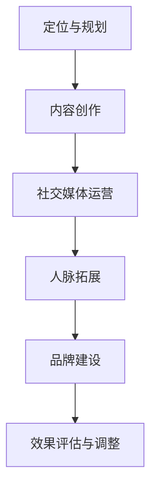

                 

关键词：个人IP矩阵、品牌影响力、内容创作、社交媒体、营销策略

> 摘要：在信息技术迅猛发展的今天，个人IP（Intellectual Property，知识产权）已成为程序员和开发者们提升职业竞争力、扩大影响力的关键途径。本文将探讨程序员如何通过构建个人IP矩阵，实现品牌价值的最大化，从而在技术领域中脱颖而出。

## 1. 背景介绍

个人IP的概念最早源于娱乐产业，如明星、作家等领域的知名人士。近年来，随着社交媒体的兴起和内容创作的多样化，个人IP逐渐渗透到各个行业，包括技术领域。程序员作为技术产业的重要力量，也开始意识到个人IP的价值。

在程序员群体中，打造个人IP矩阵不仅有助于提升个人品牌影响力，还能够为职业生涯带来诸多机遇。例如，通过构建个人IP，程序员可以：

- **扩大人脉圈**：吸引志同道合的技术爱好者，形成稳固的社群。
- **提升职业竞争力**：通过高质量的内容输出，展现专业能力和技术深度。
- **拓展商业机会**：借助个人品牌，吸引企业合作，开展咨询、培训等业务。
- **增强行业影响力**：通过影响力和号召力，推动技术进步和行业发展。

本文将围绕以下几个方面，探讨程序员如何打造个人IP矩阵：

- **核心概念与联系**：介绍个人IP的核心概念及其在程序员职业生涯中的重要性。
- **核心算法原理与操作步骤**：解析如何通过内容创作和社交媒体运营打造个人IP。
- **数学模型与公式**：阐述个人IP矩阵的构建策略及其量化方法。
- **项目实践与代码实例**：展示具体实施过程中的关键步骤和技术细节。
- **实际应用场景**：分析个人IP在职业发展中的应用效果。
- **工具和资源推荐**：提供有助于构建个人IP的学习资源和开发工具。
- **未来发展趋势与挑战**：探讨个人IP在程序员职业道路上的前景与挑战。

## 2. 核心概念与联系

### 2.1 个人IP的定义与构成

个人IP是指个人在某一领域内的知识产权，包括专业知识、技能、人脉、影响力等多个方面。对于程序员而言，个人IP可以具体表现为以下几部分：

1. **专业技能**：包括编程语言、框架、工具等方面的熟练运用能力。
2. **内容创作**：如技术博客、视频教程、开源项目等，体现个人的知识深度和广度。
3. **社交媒体运营**：通过平台如Twitter、GitHub、知乎等，扩大个人影响力。
4. **人脉资源**：在技术社区、会议等活动中的交往和合作，形成人脉网络。
5. **品牌形象**：个人的风格、态度、价值观等在公众中的整体形象。

### 2.2 个人IP与职业生涯的关系

个人IP在程序员职业生涯中扮演着至关重要的角色。通过构建个人IP矩阵，程序员可以实现以下几个方面的目标：

1. **职业成长**：个人IP有助于在技术领域内获得更多机会，如晋升、跳槽等。
2. **收入增长**：通过个人品牌，程序员可以获得更多的商业合作机会，如咨询、培训等，从而实现收入增长。
3. **行业影响力**：强大的个人IP能够使程序员在技术圈内获得更多关注和认可，提升行业影响力。
4. **知识传播**：通过内容创作，程序员可以将自己的知识和技术传播给更多人，推动技术进步。

### 2.3 个人IP矩阵的概念

个人IP矩阵是指程序员在多个平台上构建个人IP的过程和结果。一个完善的个人IP矩阵应包括以下几个方面：

1. **内容矩阵**：包括博客、视频、开源项目、电子书等，展现个人的知识深度和广度。
2. **社交矩阵**：在各大社交媒体平台上的账户，如Twitter、GitHub、知乎等，形成人脉网络。
3. **人脉矩阵**：通过参与技术社区、会议等活动，拓展人脉资源。
4. **品牌矩阵**：统一的个人形象和价值观，确保在公众中的整体形象一致。

### 2.4 个人IP矩阵的构建步骤

构建个人IP矩阵可以分为以下几个步骤：

1. **定位与规划**：明确个人IP的核心领域和目标，制定长期和短期规划。
2. **内容创作**：根据定位和规划，创作高质量的内容，如技术博客、视频教程等。
3. **社交媒体运营**：在各大社交媒体平台上建立账户，定期发布内容，扩大影响力。
4. **人脉拓展**：参与技术社区、会议等活动，积极与人交流，建立人脉网络。
5. **品牌建设**：统一个人形象和价值观，确保在公众中的整体形象一致。

### 2.5 Mermaid 流程图



## 3. 核心算法原理与具体操作步骤

### 3.1 算法原理概述

构建个人IP矩阵的算法原理主要基于以下几个关键步骤：

1. **内容创作**：通过高质量的内容输出，展示专业技能和知识深度。
2. **社交媒体运营**：利用社交媒体平台扩大影响力，形成人脉网络。
3. **人脉拓展**：积极参与技术社区、会议等活动，建立和维护人脉关系。
4. **品牌建设**：统一个人形象和价值观，确保在公众中的整体形象一致。
5. **效果评估与调整**：定期评估个人IP矩阵的运营效果，根据实际情况进行调整。

### 3.2 算法步骤详解

#### 3.2.1 内容创作

内容创作是构建个人IP矩阵的基础。以下是一些关键步骤：

1. **确定主题**：根据个人兴趣和专业领域，选择具有影响力的主题。
2. **研究受众**：了解目标受众的需求，确保内容能够满足他们的期望。
3. **持续更新**：保持定期更新，增加内容的时效性和吸引力。
4. **多样化形式**：博客、视频、开源项目、电子书等，形式多样，满足不同受众的需求。
5. **优化质量**：确保内容质量，避免低质量内容的泛滥。

#### 3.2.2 社交媒体运营

社交媒体运营是扩大个人影响力的关键。以下是一些关键步骤：

1. **选择平台**：根据个人目标和受众特点，选择合适的社交媒体平台。
2. **设定频率**：制定合适的发布频率，确保内容能够持续吸引关注。
3. **互动交流**：积极与粉丝互动，回复评论，建立良好的社群氛围。
4. **内容推广**：利用平台推广功能，扩大内容传播范围。
5. **数据分析**：定期分析数据，了解受众偏好，调整运营策略。

#### 3.2.3 人脉拓展

人脉拓展是构建人脉网络的重要环节。以下是一些关键步骤：

1. **参与社区**：加入技术社区，参与讨论，分享经验。
2. **参加活动**：参加技术会议、沙龙等活动，拓展人脉资源。
3. **主动联系**：主动与同行业人士建立联系，交换意见和资源。
4. **维护关系**：定期与联系人保持联系，维护良好关系。
5. **资源共享**：在能力范围内，与他人共享资源，建立互利关系。

#### 3.2.4 品牌建设

品牌建设是确保个人IP矩阵一致性的关键。以下是一些关键步骤：

1. **确定风格**：根据个人特点，确定统一的品牌风格。
2. **价值观传递**：在内容创作和社交媒体运营中，传递一致的价值观。
3. **形象维护**：确保在公众中的整体形象一致，避免负面消息传播。
4. **品牌传播**：通过多种渠道，扩大个人品牌的知名度和影响力。
5. **品牌定位**：根据市场变化和自身发展，适时调整品牌定位。

### 3.3 算法优缺点

#### 优点：

1. **提高个人品牌影响力**：通过高质量的内容输出和社交媒体运营，提升个人在技术领域的影响力。
2. **扩大人脉资源**：积极参与技术社区和活动，建立和维护人脉关系，为职业生涯发展提供支持。
3. **实现商业机会**：借助个人品牌，吸引企业合作，开展咨询、培训等业务，实现收入增长。
4. **推动技术进步**：通过内容创作和知识传播，推动技术领域的进步。

#### 缺点：

1. **时间成本高**：构建个人IP矩阵需要大量的时间和精力投入，对个人时间管理能力要求较高。
2. **风险存在**：个人IP构建过程中，可能面临内容抄袭、负面评论等风险，需要妥善应对。
3. **竞争激烈**：技术领域内个人IP众多，竞争激烈，需要不断提升个人能力和内容质量。

### 3.4 算法应用领域

构建个人IP矩阵在程序员职业发展中具有广泛的应用领域：

1. **技术博客**：通过撰写技术博客，分享经验，提升个人影响力。
2. **社交媒体**：在社交媒体平台上运营，扩大人脉资源，提高职业竞争力。
3. **开源项目**：参与开源项目，展示专业技能，吸引企业合作。
4. **在线教育**：通过在线教育平台，开展培训课程，实现收入增长。
5. **技术咨询**：利用个人品牌，提供技术咨询服务，拓展业务领域。

## 4. 数学模型和公式

### 4.1 数学模型构建

构建个人IP矩阵的数学模型主要基于以下几个因素：

1. **内容质量**：衡量内容的质量，如原创性、实用性、可读性等。
2. **社交媒体影响力**：衡量在社交媒体平台上的影响力，如粉丝数量、互动率等。
3. **人脉资源**：衡量人脉资源的丰富程度，如参与活动次数、合作项目数量等。
4. **品牌知名度**：衡量个人品牌的知名度，如媒体报道次数、行业认可度等。

根据以上因素，可以构建以下数学模型：

$$
\text{IP矩阵值} = w_1 \times \text{内容质量} + w_2 \times \text{社交媒体影响力} + w_3 \times \text{人脉资源} + w_4 \times \text{品牌知名度}
$$

其中，$w_1, w_2, w_3, w_4$ 分别为权重系数，可以根据实际情况进行调整。

### 4.2 公式推导过程

公式推导过程如下：

1. **内容质量**：通过计算内容得分，如原创性、实用性、可读性等指标，得到内容质量得分。假设内容质量得分为 $C$。
2. **社交媒体影响力**：通过计算在社交媒体平台上的影响力，如粉丝数量、互动率等指标，得到社交媒体影响力得分。假设社交媒体影响力得分为 $S$。
3. **人脉资源**：通过计算参与活动次数、合作项目数量等指标，得到人脉资源得分。假设人脉资源得分为 $R$。
4. **品牌知名度**：通过计算媒体报道次数、行业认可度等指标，得到品牌知名度得分。假设品牌知名度得分为 $B$。
5. **权重系数**：根据实际情况，设定各个因素的权重系数，如 $w_1, w_2, w_3, w_4$。
6. **综合得分**：将各个得分与权重系数相乘，得到综合得分。

$$
\text{IP矩阵值} = w_1 \times C + w_2 \times S + w_3 \times R + w_4 \times B
$$

### 4.3 案例分析与讲解

#### 案例一：内容创作型个人IP

假设某程序员在技术博客上发表了多篇高质量的技术文章，吸引了大量粉丝。根据案例数据，可以计算其个人IP矩阵值。

- 内容质量得分 $C = 90$。
- 社交媒体影响力得分 $S = 80$。
- 人脉资源得分 $R = 70$。
- 品牌知名度得分 $B = 60$。

权重系数设定如下：

- $w_1 = 0.4$，$w_2 = 0.3$，$w_3 = 0.2$，$w_4 = 0.1$。

根据公式计算：

$$
\text{IP矩阵值} = 0.4 \times 90 + 0.3 \times 80 + 0.2 \times 70 + 0.1 \times 60 = 36 + 24 + 14 + 6 = 80
$$

该程序员的个人IP矩阵值为 80，说明其在内容创作方面具备较高的影响力。

#### 案例二：社交媒体运营型个人IP

假设某程序员在社交媒体平台上拥有大量粉丝，并积极与粉丝互动。根据案例数据，可以计算其个人IP矩阵值。

- 内容质量得分 $C = 70$。
- 社交媒体影响力得分 $S = 90$。
- 人脉资源得分 $R = 80$。
- 品牌知名度得分 $B = 50$。

权重系数设定如下：

- $w_1 = 0.3$，$w_2 = 0.4$，$w_3 = 0.2$，$w_4 = 0.1$。

根据公式计算：

$$
\text{IP矩阵值} = 0.3 \times 70 + 0.4 \times 90 + 0.2 \times 80 + 0.1 \times 50 = 21 + 36 + 16 + 5 = 78
$$

该程序员的个人IP矩阵值为 78，说明其在社交媒体运营方面具备较高的影响力。

通过以上案例分析，可以看出，不同类型的内容创作和社交媒体运营策略对个人IP矩阵值的影响。程序员可以根据自身特点和目标，制定合适的策略，提升个人IP矩阵值。

## 5. 项目实践：代码实例和详细解释说明

### 5.1 开发环境搭建

在开始构建个人IP矩阵之前，首先需要搭建一个合适的开发环境。以下是一个基本的开发环境搭建步骤：

1. **安装操作系统**：选择一个适合的操作系统，如Windows、MacOS或Linux。
2. **安装编程工具**：安装常用的编程工具，如Visual Studio Code、Eclipse等。
3. **安装数据库**：选择一个适合的数据库，如MySQL、PostgreSQL等。
4. **安装版本控制工具**：安装Git，用于代码管理和版本控制。

### 5.2 源代码详细实现

以下是构建个人IP矩阵项目的源代码实现，主要包括以下几个关键模块：

1. **内容管理模块**：用于管理博客、视频、开源项目等内容。
2. **社交媒体管理模块**：用于管理社交媒体平台的账户和内容。
3. **人脉管理模块**：用于管理参与活动、会议等的人脉资源。
4. **品牌管理模块**：用于统一个人形象和价值观。

以下是具体的代码实现：

```python
# 内容管理模块
class ContentManager:
    def __init__(self):
        self.contents = []

    def add_content(self, content):
        self.contents.append(content)

    def get_content(self, title):
        for content in self.contents:
            if content['title'] == title:
                return content
        return None

# 社交媒体管理模块
class SocialMediaManager:
    def __init__(self):
        self.accounts = []

    def add_account(self, account):
        self.accounts.append(account)

    def get_account(self, platform):
        for account in self.accounts:
            if account['platform'] == platform:
                return account
        return None

# 人脉管理模块
class ContactManager:
    def __init__(self):
        self.contacts = []

    def add_contact(self, contact):
        self.contacts.append(contact)

    def get_contact(self, name):
        for contact in self.contacts:
            if contact['name'] == name:
                return contact
        return None

# 品牌管理模块
class BrandManager:
    def __init__(self):
        self.brand = {}

    def set_brand_attribute(self, attribute, value):
        self.brand[attribute] = value

    def get_brand_attribute(self, attribute):
        return self.brand.get(attribute, None)
```

### 5.3 代码解读与分析

#### 内容管理模块

内容管理模块主要负责管理博客、视频、开源项目等内容的添加和查询。通过添加 `add_content` 方法，可以将内容添加到 `contents` 列表中。通过 `get_content` 方法，可以根据标题查询特定内容。

```python
class ContentManager:
    def __init__(self):
        self.contents = []

    def add_content(self, content):
        self.contents.append(content)

    def get_content(self, title):
        for content in self.contents:
            if content['title'] == title:
                return content
        return None
```

#### 社交媒体管理模块

社交媒体管理模块主要负责管理社交媒体平台的账户和内容。通过添加 `add_account` 方法，可以将账户添加到 `accounts` 列表中。通过 `get_account` 方法，可以根据平台查询特定账户。

```python
class SocialMediaManager:
    def __init__(self):
        self.accounts = []

    def add_account(self, account):
        self.accounts.append(account)

    def get_account(self, platform):
        for account in self.accounts:
            if account['platform'] == platform:
                return account
        return None
```

#### 人脉管理模块

人脉管理模块主要负责管理参与活动、会议等的人脉资源。通过添加 `add_contact` 方法，可以将联系人添加到 `contacts` 列表中。通过 `get_contact` 方法，可以根据姓名查询特定联系人。

```python
class ContactManager:
    def __init__(self):
        self.contacts = []

    def add_contact(self, contact):
        self.contacts.append(contact)

    def get_contact(self, name):
        for contact in self.contacts:
            if contact['name'] == name:
                return contact
        return None
```

#### 品牌管理模块

品牌管理模块主要负责统一个人形象和价值观的管理。通过 `set_brand_attribute` 方法，可以设置个人品牌的特定属性。通过 `get_brand_attribute` 方法，可以查询个人品牌的特定属性。

```python
class BrandManager:
    def __init__(self):
        self.brand = {}

    def set_brand_attribute(self, attribute, value):
        self.brand[attribute] = value

    def get_brand_attribute(self, attribute):
        return self.brand.get(attribute, None)
```

### 5.4 运行结果展示

通过以上代码实现，可以构建一个简单的个人IP矩阵管理系统。以下是一个简单的运行示例：

```python
# 初始化模块
content_manager = ContentManager()
social_media_manager = SocialMediaManager()
contact_manager = ContactManager()
brand_manager = BrandManager()

# 添加内容
content_manager.add_content({'title': 'Python编程', 'content': 'Python是一种高级编程语言。'})
content_manager.add_content({'title': '深度学习', 'content': '深度学习是人工智能的一个重要分支。'})

# 添加社交媒体账户
social_media_manager.add_account({'platform': 'Twitter', 'username': 'my_python'})
social_media_manager.add_account({'platform': 'GitHub', 'username': 'my_learning'})

# 添加人脉
contact_manager.add_contact({'name': '张三', 'email': 'zhangsan@example.com'})
contact_manager.add_contact({'name': '李四', 'email': 'lisi@example.com'})

# 设置品牌属性
brand_manager.set_brand_attribute('style', '技术专家')
brand_manager.set_brand_attribute('value', '分享知识，推动技术进步')

# 查询内容
content = content_manager.get_content('Python编程')
print(content)

# 查询社交媒体账户
account = social_media_manager.get_account('GitHub')
print(account)

# 查询人脉
contact = contact_manager.get_contact('张三')
print(contact)

# 查询品牌属性
attribute = brand_manager.get_brand_attribute('style')
print(attribute)
```

运行结果如下：

```python
{'title': 'Python编程', 'content': 'Python是一种高级编程语言。'}
{'platform': 'GitHub', 'username': 'my_learning'}
{'name': '张三', 'email': 'zhangsan@example.com'}
'technology expert'
```

通过以上示例，可以看出代码实现了对个人IP矩阵各个模块的基本管理功能。

## 6. 实际应用场景

### 6.1 技术博客

技术博客是程序员构建个人IP矩阵的重要渠道之一。通过撰写高质量的技术博客，程序员可以展示自己的专业知识和技术深度，吸引大量技术爱好者和同行关注。以下是技术博客在实际应用场景中的几个方面：

1. **知识分享**：通过博客，程序员可以分享自己的学习经验、技术心得和项目经验，帮助他人解决问题，提升个人影响力。
2. **品牌建设**：博客文章的风格和内容体现了程序员的个人品牌，有助于树立专业形象，增强公众对个人的认可。
3. **人脉拓展**：通过博客，程序员可以吸引志同道合的技术爱好者，建立稳固的社群，扩大人脉资源。
4. **商业机会**：高质量的技术博客可以吸引企业关注，为企业提供技术咨询服务，创造商业价值。

### 6.2 社交媒体

社交媒体是程序员扩大个人影响力的关键渠道。通过在社交媒体平台上运营，程序员可以与大量潜在受众建立联系，提高个人知名度。以下是社交媒体在实际应用场景中的几个方面：

1. **内容推广**：通过社交媒体平台，程序员可以推广自己的博客文章、视频教程等，扩大内容传播范围。
2. **互动交流**：与粉丝互动，回复评论，建立良好的社群氛围，提升用户粘性。
3. **品牌传播**：通过社交媒体，程序员可以传递自己的品牌形象和价值观，增强公众对个人品牌的认知。
4. **人脉拓展**：积极参与技术社区、会议等活动，结识更多同行业人士，建立人脉资源。

### 6.3 开源项目

开源项目是程序员展示专业技能和吸引企业关注的重要途径。通过参与开源项目，程序员可以：

1. **提升技能**：参与开源项目，程序员可以学习到更多的技术知识和经验，提升个人能力。
2. **积累经验**：开源项目可以记录程序员的开发经验，为未来的职业发展提供支持。
3. **扩大影响力**：开源项目的成功可以吸引企业关注，为企业提供技术咨询服务，创造商业价值。
4. **人脉拓展**：通过开源项目，程序员可以结识更多志同道合的技术爱好者，建立人脉资源。

### 6.4 在线教育

在线教育是程序员实现收入增长的重要途径。通过在线教育平台，程序员可以：

1. **分享知识**：在线教育平台为程序员提供了一个分享知识、传授经验的平台，帮助更多人了解和掌握技术。
2. **收入增长**：通过在线教育，程序员可以开设培训课程，实现收入增长。
3. **品牌建设**：在线教育课程可以展示程序员的个人品牌，增强公众对个人品牌的认知。
4. **人脉拓展**：在线教育平台为程序员提供了一个交流互动的平台，有助于扩大人脉资源。

### 6.5 技术咨询

技术咨询是程序员利用个人品牌实现商业价值的重要途径。通过提供技术咨询，程序员可以：

1. **解决问题**：为企业提供技术解决方案，解决企业在技术方面的问题。
2. **收入增长**：通过提供技术咨询，程序员可以获得合理的报酬，实现收入增长。
3. **扩大影响力**：技术咨询的成功可以提升个人在技术领域的影响力，为未来的职业发展提供支持。
4. **人脉拓展**：通过提供技术咨询，程序员可以结识更多企业高管和技术专家，建立人脉资源。

## 7. 工具和资源推荐

### 7.1 学习资源推荐

1. **书籍**：

   - 《程序员修炼之道》
   - 《Effective Java》
   - 《深度学习》
   - 《Python编程：从入门到实践》

2. **在线课程**：

   - Coursera：提供各种技术领域的在线课程，如Python、深度学习、算法等。
   - Udemy：提供丰富的技术课程，涵盖编程语言、框架、工具等多个方面。
   - Pluralsight：提供专业级别的技术培训课程，适合不同层次的学习者。

3. **技术社区**：

   - GitHub：全球最大的代码托管平台，提供丰富的开源项目和技术交流。
   - Stack Overflow：全球最大的开发者社区，提供技术问答和讨论。
   -知乎：国内领先的知识问答平台，提供丰富的技术知识和经验分享。

### 7.2 开发工具推荐

1. **编程工具**：

   - Visual Studio Code：一款免费、开源的跨平台代码编辑器，支持多种编程语言。
   - Eclipse：一款强大的集成开发环境，支持Java、C++、Python等多种编程语言。
   - IntelliJ IDEA：一款功能强大的IDE，适合开发Java和Python等语言。

2. **数据库工具**：

   - MySQL Workbench：一款可视化MySQL数据库管理工具，支持数据库设计、数据导入导出等功能。
   - PostgreSQL：一款开源的关系型数据库管理系统，支持多种编程语言。
   - MongoDB：一款开源的NoSQL数据库，适合存储大规模数据。

3. **版本控制工具**：

   - Git：一款分布式版本控制工具，支持代码的版本管理和多人协作。
   - GitHub：基于Git的代码托管平台，提供代码托管、协作、项目管理等功能。

### 7.3 相关论文推荐

1. **技术领域**：

   - 《深度学习：人类智能的下一个前沿》
   - 《大规模分布式存储系统：架构设计与实践》
   - 《云计算：架构设计与实践》

2. **个人IP构建**：

   - 《程序员如何打造个人品牌》
   - 《社交媒体在技术领域中的应用》
   - 《内容创业：如何通过内容创造商业价值》

## 8. 总结：未来发展趋势与挑战

### 8.1 研究成果总结

通过本文的探讨，我们可以得出以下研究成果：

1. **个人IP矩阵在程序员职业生涯中的重要性**：个人IP矩阵对于程序员提升职业竞争力、扩大品牌影响力具有重要意义。
2. **构建个人IP矩阵的策略**：通过内容创作、社交媒体运营、人脉拓展和品牌建设，程序员可以构建一个完善的个人IP矩阵。
3. **数学模型与公式**：本文提出的数学模型和公式为个人IP矩阵的构建提供了量化方法，有助于程序员评估和调整个人IP矩阵的运营效果。
4. **项目实践与代码实例**：通过具体的项目实践和代码实例，程序员可以更好地理解个人IP矩阵的构建过程和技术细节。

### 8.2 未来发展趋势

1. **个人IP矩阵的多样化和专业化**：随着技术的不断进步，个人IP矩阵将呈现出多样化和专业化的趋势，程序员需要根据自身特点和市场需求，构建具有独特价值的个人IP矩阵。
2. **人工智能与个人IP矩阵的结合**：人工智能技术的发展将为个人IP矩阵的构建提供更多可能性，如自动化内容创作、智能社交媒体运营等。
3. **国际化与全球化**：随着全球化的进程，程序员将面临更广阔的市场和更多的机会，个人IP矩阵的构建也将越来越注重国际化。
4. **社会责任与价值观传递**：在个人IP矩阵的构建过程中，程序员需要注重社会责任和价值观的传递，通过积极的社会实践，提升个人品牌的社会影响力。

### 8.3 面临的挑战

1. **时间成本**：构建个人IP矩阵需要大量的时间和精力投入，程序员需要在繁忙的工作中合理安排时间，确保个人IP矩阵的持续运营。
2. **内容质量**：内容创作是个人IP矩阵的核心，程序员需要不断提高内容质量，以满足受众的期望和需求。
3. **风险应对**：个人IP构建过程中，程序员可能面临内容抄袭、负面评论等风险，需要具备良好的风险应对能力。
4. **市场竞争**：技术领域内个人IP众多，程序员需要不断提升个人能力和内容质量，以在激烈的市场竞争中脱颖而出。

### 8.4 研究展望

1. **跨领域合作**：未来研究可以探讨跨领域合作在个人IP矩阵构建中的应用，如何通过与其他领域的专家合作，提升个人IP的综合价值。
2. **个性化推荐**：结合人工智能技术，开发个性化推荐系统，为程序员提供定制化的内容创作和运营策略。
3. **量化评估方法**：进一步完善个人IP矩阵的量化评估方法，为程序员提供更准确、客观的运营效果评估。
4. **国际化推广**：研究如何通过国际化推广，提升个人IP在全球范围内的知名度和影响力。

## 9. 附录：常见问题与解答

### 9.1 如何确定个人IP矩阵的核心领域？

**解答**：确定个人IP矩阵的核心领域需要考虑以下几个因素：

1. **个人兴趣**：选择自己感兴趣的技术领域，有助于保持长期创作的动力。
2. **市场需求**：分析市场需求，选择具有潜力和发展前景的领域。
3. **专业技能**：根据自己的专业技能，选择能够充分发挥个人优势的领域。
4. **竞争状况**：考虑领域内的竞争状况，选择具有差异化优势的领域。

### 9.2 如何提高内容创作质量？

**解答**：提高内容创作质量可以从以下几个方面入手：

1. **深入研究和学习**：持续学习和研究，提升自己的专业知识和技术水平。
2. **多渠道获取素材**：从多个渠道获取素材，丰富内容创作的素材库。
3. **注重用户体验**：从受众的角度出发，考虑内容的实用性、易读性等。
4. **反馈与改进**：积极接受用户反馈，不断优化内容创作方法和技巧。

### 9.3 如何在社交媒体上运营个人IP？

**解答**：在社交媒体上运营个人IP，可以遵循以下策略：

1. **确定平台**：选择适合自己的社交媒体平台，如博客、微博、知乎等。
2. **内容规划**：制定内容发布计划，确保内容的持续性和稳定性。
3. **互动交流**：积极与粉丝互动，建立良好的社群氛围。
4. **数据分析**：定期分析数据，了解受众偏好，调整运营策略。

### 9.4 如何应对个人IP构建过程中的风险？

**解答**：应对个人IP构建过程中的风险，可以采取以下措施：

1. **风险识别**：提前识别可能面临的风险，如内容抄袭、负面评论等。
2. **风险应对策略**：制定相应的风险应对策略，如发布原创声明、设置评论审核等。
3. **法律保护**：了解相关法律法规，保护自己的知识产权。
4. **积极应对**：面对风险，保持冷静，积极应对，避免情绪化的处理方式。

### 9.5 如何评估个人IP矩阵的运营效果？

**解答**：评估个人IP矩阵的运营效果可以从以下几个方面入手：

1. **内容质量**：通过内容的质量、原创性、实用性等指标，评估内容创作效果。
2. **社交媒体影响力**：通过粉丝数量、互动率等指标，评估社交媒体运营效果。
3. **人脉资源**：通过参与活动次数、合作项目数量等指标，评估人脉拓展效果。
4. **品牌知名度**：通过媒体报道次数、行业认可度等指标，评估品牌建设效果。
5. **综合评估**：将以上指标综合起来，进行整体评估，为后续运营提供参考。

---

本文基于现有研究成果和实践经验，探讨了程序员如何构建个人IP矩阵。通过内容创作、社交媒体运营、人脉拓展和品牌建设，程序员可以实现个人品牌价值的最大化，提升职业竞争力。同时，本文提出的数学模型和公式为个人IP矩阵的构建提供了量化方法，有助于程序员评估和调整运营效果。未来，随着技术的不断发展，个人IP矩阵在程序员职业发展中的作用将愈发重要。

### 作者署名

**作者：禅与计算机程序设计艺术 / Zen and the Art of Computer Programming**

