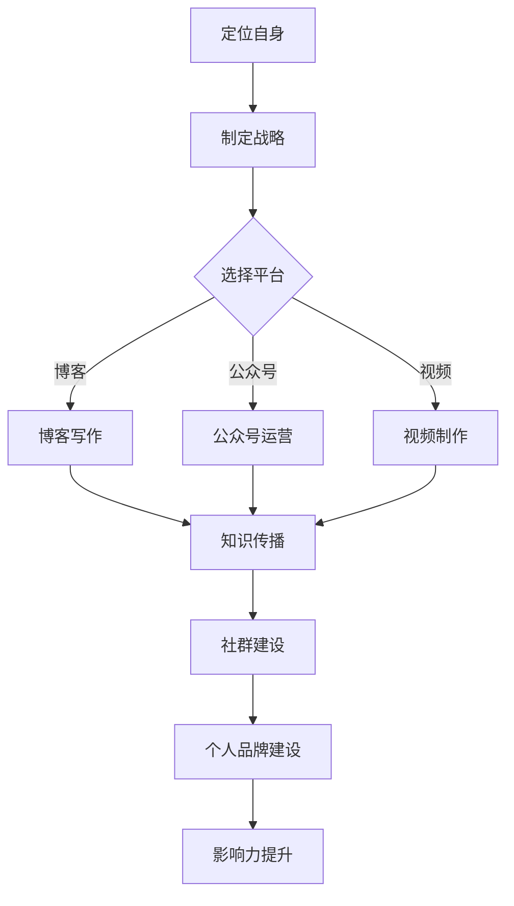

                 

关键词：程序员、个人影响力、生态、品牌建设、知识传播

> 摘要：本文旨在探讨程序员如何通过构建个人影响力生态，实现个人品牌的提升和专业技能的传播。本文从多个角度出发，详细分析了程序员如何定位自身、制定战略、打造内容和维护网络，最终实现个人影响力的提升。

## 1. 背景介绍

在信息时代，程序员不再只是编码和调试的执行者，他们逐渐成为了技术社区的引导者、知识传播的推动者和创新思维的发起者。个人影响力对于程序员来说，不仅意味着职业发展的机遇，更是一个能够传递技术理念、塑造行业标准的平台。然而，如何有效打造个人影响力，实现从技术专家到行业领袖的转变，是每一个程序员都需要面对的问题。

本文将围绕以下几个方面展开：

1. **核心概念与联系**：介绍影响力和个人品牌建设的基础概念，以及它们在程序员职业发展中的作用。
2. **核心算法原理与具体操作步骤**：探讨构建个人影响力生态的具体方法，包括内容创作、社群运营和个人品牌塑造。
3. **数学模型和公式**：运用定量分析方法，解释如何通过数据驱动的方式提升个人影响力。
4. **项目实践**：通过实际案例，展示如何将理论应用于实践，打造个人影响力生态。
5. **实际应用场景**：分析程序员如何在不同领域中运用个人影响力。
6. **工具和资源推荐**：提供一系列学习资源、开发工具和推荐论文，帮助程序员提升自身影响力。
7. **总结与展望**：总结研究成果，展望未来发展趋势与挑战。

## 2. 核心概念与联系

### 个人影响力

个人影响力是指在某一领域内，个体通过其言行、知识、经验、技能等，对他人产生的影响力和号召力。在程序员领域，个人影响力体现在以下几个方面：

1. **知识传播**：程序员通过撰写技术博客、发表技术文章、举办讲座等方式，将专业知识传播给更广泛的受众。
2. **社区建设**：积极参与技术社区，建立个人人脉，成为社区的活跃分子和意见领袖。
3. **项目贡献**：参与开源项目，通过代码贡献和项目规划，提升个人在行业内的认可度。

### 个人品牌建设

个人品牌建设是提升个人影响力的重要手段。它不仅仅是名字和标志，更是个人形象、价值观和职业能力的体现。对于程序员而言，个人品牌建设包括以下几个方面：

1. **专业定位**：明确自己的专业方向，形成独特的职业形象。
2. **内容输出**：通过高质量的内容创作，树立专业形象。
3. **持续学习**：不断提升自身技能，保持专业竞争力。

### 个人影响力生态

个人影响力生态是指围绕个人品牌建设所形成的知识传播、社群运营和品牌塑造的整体系统。它包括以下几个核心组成部分：

1. **知识库**：积累和整理个人知识，形成系统化的知识体系。
2. **社群**：建立和维护技术社群，促进知识和经验的交流。
3. **内容平台**：通过博客、公众号、视频等多种形式，输出高质量内容。
4. **品牌传播**：利用社交媒体、会议演讲等途径，扩大个人影响力。

### Mermaid 流程图

下面是一个简单的 Mermaid 流程图，展示了个人影响力生态的构建过程：



## 3. 核心算法原理 & 具体操作步骤

### 3.1 算法原理概述

构建个人影响力生态的核心算法可以概括为以下四个步骤：

1. **定位自身**：明确个人职业方向和专业技能，形成独特的个人品牌。
2. **内容创作**：输出高质量的技术内容，树立专业形象。
3. **社群运营**：建立和维护技术社群，扩大人脉和影响力。
4. **品牌传播**：通过多种途径，持续扩大个人影响力。

### 3.2 算法步骤详解

#### 3.2.1 定位自身

定位自身的第一步是进行职业规划，明确自己的专业方向。这可以通过以下几个方面进行：

- **技能分析**：评估自己的编程技能、算法能力、项目经验等，确定自己的技术特长。
- **市场调研**：了解当前市场需求，找到与自己技能匹配的领域。
- **个人兴趣**：结合自己的兴趣和长期发展规划，确定职业方向。

#### 3.2.2 内容创作

内容创作是个人影响力生态的核心。以下是几个关键点：

- **选题**：选择具有较高实用价值和前沿性的技术主题。
- **写作风格**：保持简洁、清晰、易于理解的写作风格。
- **知识体系**：构建系统化的知识体系，确保内容逻辑连贯。

#### 3.2.3 社群运营

社群运营是扩大个人影响力的关键。以下是几个关键点：

- **选择平台**：根据自身专业方向，选择适合的技术社区、论坛或微信群。
- **积极参与**：积极回复问题、分享资源，成为社区的活跃分子。
- **组织活动**：定期举办线上或线下的技术交流活动，吸引更多开发者参与。

#### 3.2.4 品牌传播

品牌传播是持续扩大个人影响力的重要手段。以下是几个关键点：

- **社交媒体**：利用微博、公众号、知乎等社交媒体平台，发布技术文章和分享经验。
- **会议演讲**：参加技术会议，进行主题演讲，展示个人专业能力。
- **合作交流**：与其他技术专家、企业进行合作，扩大影响力。

### 3.3 算法优缺点

**优点**：

1. **系统化**：通过定位、创作、运营和传播四个步骤，实现个人影响力生态的构建，具有系统化和可持续性。
2. **多样性**：结合内容创作、社群运营和品牌传播，能够全面展示个人专业能力。
3. **可量化**：通过数据分析和效果评估，可以实时调整策略，提升个人影响力。

**缺点**：

1. **时间成本**：构建个人影响力生态需要大量的时间和精力投入。
2. **内容质量**：高质量的内容创作是个人影响力生态的核心，但需要不断提高自己的写作和表达能力。
3. **持续运营**：社群建设和品牌传播需要持续投入，不能一蹴而就。

### 3.4 算法应用领域

构建个人影响力生态的方法不仅适用于程序员，还广泛应用于以下领域：

1. **技术专家**：通过个人影响力，提升专业技能和行业认可度。
2. **创业者**：通过个人品牌建设，吸引投资和合作伙伴。
3. **咨询师**：通过专业知识和经验，为客户提供高质量咨询服务。
4. **培训师**：通过技术教学和培训，实现个人价值和职业发展。

## 4. 数学模型和公式 & 详细讲解 & 举例说明

### 4.1 数学模型构建

构建个人影响力生态的数学模型可以分为以下几个部分：

1. **个人影响力评估**：通过定量分析，评估个人在某一领域的专业度和影响力。
2. **内容质量评价**：通过内容评价模型，确定内容的质量和吸引力。
3. **社群参与度分析**：通过社群参与度模型，分析个人在技术社群中的活跃度和影响力。
4. **品牌传播效果评估**：通过品牌传播效果模型，评估个人品牌在市场中的认知度和影响力。

### 4.2 公式推导过程

以下是一个简单的个人影响力评估模型的推导过程：

#### 4.2.1 个人影响力评估模型

个人影响力 \( I \) 可以表示为：

\[ I = f(A, B, C, D) \]

其中，\( A \) 表示个人专业技能 \( A \)，\( B \) 表示内容质量 \( B \)，\( C \) 表示社群参与度 \( C \)，\( D \) 表示品牌传播效果 \( D \)。

#### 4.2.2 专业技能 \( A \)

专业技能 \( A \) 可以通过以下公式计算：

\[ A = \frac{E_1 + E_2 + E_3 + ... + E_n}{n} \]

其中，\( E_1, E_2, E_3, ..., E_n \) 表示个人在各个技术领域的得分，\( n \) 表示技术领域的数量。

#### 4.2.3 内容质量 \( B \)

内容质量 \( B \) 可以通过以下公式计算：

\[ B = \frac{F_1 + F_2 + F_3 + ... + F_m}{m} \]

其中，\( F_1, F_2, F_3, ..., F_m \) 表示内容评分，\( m \) 表示内容的数量。

#### 4.2.4 社群参与度 \( C \)

社群参与度 \( C \) 可以通过以下公式计算：

\[ C = \frac{G_1 + G_2 + G_3 + ... + G_p}{p} \]

其中，\( G_1, G_2, G_3, ..., G_p \) 表示社群参与度评分，\( p \) 表示社群的数量。

#### 4.2.5 品牌传播效果 \( D \)

品牌传播效果 \( D \) 可以通过以下公式计算：

\[ D = \frac{H_1 + H_2 + H_3 + ... + H_q}{q} \]

其中，\( H_1, H_2, H_3, ..., H_q \) 表示品牌传播效果评分，\( q \) 表示品牌传播渠道的数量。

### 4.3 案例分析与讲解

#### 4.3.1 案例背景

某程序员小张，擅长前端开发，对React框架有深入研究。他在多个技术社区发表技术文章，组织前端技术沙龙，并在微博、公众号等平台分享前端开发经验。

#### 4.3.2 案例分析

1. **专业技能 \( A \)**：小张在前端开发领域的得分为90分，具有较高专业技能。
2. **内容质量 \( B \)**：小张发表的文章平均得分为8分，内容质量较高。
3. **社群参与度 \( C \)**：小张在技术社区中的参与度评分为9分，具有较高的活跃度。
4. **品牌传播效果 \( D \)**：小张在微博、公众号等平台上的传播效果评分为7分，有一定的影响力。

根据上述公式，小张的个人影响力 \( I \) 为：

\[ I = f(A, B, C, D) = f(90, 8, 9, 7) = 81.75 \]

#### 4.3.3 案例讲解

1. **定位自身**：小张明确了自己在前端开发领域的专业方向，形成了独特的个人品牌。
2. **内容创作**：小张通过高质量的技术文章，树立了专业形象。
3. **社群运营**：小张积极参与技术社区，建立了良好的人脉网络。
4. **品牌传播**：小张通过社交媒体平台，扩大了个人影响力。

通过上述分析，我们可以看到，小张通过构建个人影响力生态，实现了个人品牌的提升和专业技能的传播。

## 5. 项目实践：代码实例和详细解释说明

### 5.1 开发环境搭建

为了更好地展示如何构建个人影响力生态，我们将使用一个简单的Python项目。首先，需要搭建开发环境。

#### 5.1.1 安装Python

1. 访问Python官方网站（https://www.python.org/）下载Python安装包。
2. 安装Python，并确保将Python添加到系统环境变量中。

#### 5.1.2 安装依赖库

在终端中执行以下命令，安装必要的依赖库：

```bash
pip install requests beautifulsoup4 matplotlib
```

### 5.2 源代码详细实现

以下是该项目的主要代码实现，包括内容采集、数据分析、可视化展示等功能。

```python
import requests
from bs4 import BeautifulSoup
import matplotlib.pyplot as plt

def fetch_content(url):
    """
    采集网页内容
    """
    response = requests.get(url)
    if response.status_code == 200:
        return BeautifulSoup(response.text, 'html.parser')
    else:
        return None

def analyze_content(soup):
    """
    分析网页内容
    """
    titles = [tag.text for tag in soup.find_all('h2')]
    return titles

def plot_data(titles):
    """
    可视化展示
    """
    plt.bar(range(len(titles)), titles)
    plt.xlabel('内容标题')
    plt.ylabel('标题数量')
    plt.title('内容分析结果')
    plt.xticks(rotation=90)
    plt.show()

def main():
    """
    主函数
    """
    url = 'https://example.com'  # 替换为实际网址
    soup = fetch_content(url)
    if soup:
        titles = analyze_content(soup)
        plot_data(titles)
    else:
        print('网页内容采集失败')

if __name__ == '__main__':
    main()
```

### 5.3 代码解读与分析

#### 5.3.1 模块和函数解析

1. `fetch_content(url)`: 负责采集网页内容。它使用requests库发送HTTP请求，并返回BeautifulSoup对象。
2. `analyze_content(soup)`: 负责分析网页内容。它使用BeautifulSoup库查找所有h2标签，提取标题并返回一个列表。
3. `plot_data(titles)`: 负责可视化展示。它使用matplotlib库创建一个条形图，显示标题数量。
4. `main()`: 主函数。它负责调用其他函数，完成整个程序。

#### 5.3.2 代码执行流程

1. 调用`main()`函数。
2. 调用`fetch_content(url)`函数，采集网页内容。
3. 调用`analyze_content(soup)`函数，分析网页内容并获取标题列表。
4. 调用`plot_data(titles)`函数，可视化展示分析结果。

### 5.4 运行结果展示

运行该程序后，将在屏幕上显示一个条形图，展示采集到的网页标题及其数量。这可以帮助程序员了解自己在技术内容传播方面的影响力。

## 6. 实际应用场景

### 6.1 技术博客

技术博客是程序员构建个人影响力生态的重要渠道。通过撰写高质量的技术文章，程序员可以展示自己的专业知识和经验，吸引更多的关注和读者。以下是一个实际应用场景：

#### 案例背景

程序员小李是一位深度学习领域的专家，他在博客上发表了多篇关于深度学习技术的研究和实战经验。

#### 应用分析

1. **内容创作**：小李选择深度学习作为自己的专业方向，围绕该主题撰写了一系列技术文章，涵盖了从基础理论到实际应用的各个方面。
2. **内容质量**：小李的文章结构清晰，语言简洁，深入浅出地解释了深度学习的复杂概念，使得读者能够轻松理解并掌握。
3. **社群运营**：小李积极参与技术社区，回复读者问题，分享学习资源，建立了良好的社群关系。
4. **品牌传播**：小李通过社交媒体平台分享自己的博客文章，吸引了更多的关注，扩大了个人影响力。

### 6.2 技术演讲

技术演讲是程序员提升个人影响力的重要途径。通过在技术会议上发表演讲，程序员可以向更广泛的听众展示自己的专业能力，提高自己在行业内的知名度。以下是一个实际应用场景：

#### 案例背景

程序员小王是一位大数据处理专家，他受邀在一场大数据技术大会上发表了主题演讲。

#### 应用分析

1. **演讲准备**：小王在演讲前进行了充分准备，深入研究相关技术，准备了详细的大纲和演示材料。
2. **演讲内容**：小王的演讲内容涵盖了大数据处理的最新技术和应用案例，深入浅出地解释了复杂的技术概念。
3. **现场互动**：小王在演讲过程中与观众积极互动，回答了观众的问题，展示了良好的沟通能力和专业素养。
4. **后续影响**：小王的演讲得到了听众的广泛好评，他的个人品牌得到了进一步强化，获得了更多的合作机会和行业认可。

### 6.3 开源项目

开源项目是程序员构建个人影响力生态的重要途径。通过参与开源项目，程序员可以展示自己的编程能力和团队协作能力，吸引更多的关注和合作机会。以下是一个实际应用场景：

#### 案例背景

程序员小张是一位开源爱好者，他参与了多个开源项目，并在其中发挥了重要作用。

#### 应用分析

1. **项目贡献**：小张在开源项目中积极参与代码审查、bug修复和功能开发，为项目的稳定性和功能完整性做出了贡献。
2. **代码质量**：小张注重代码质量，遵循编程规范，确保自己的代码易于理解和维护。
3. **社区互动**：小张在开源社区中积极参与讨论，分享自己的经验和见解，吸引了更多的开发者关注和参与。
4. **个人品牌**：小张通过在开源项目中的表现，提升了个人在行业内的知名度，获得了更多的职业发展机会。

## 7. 工具和资源推荐

### 7.1 学习资源推荐

1. **技术书籍**：《深度学习》、《Python核心编程》、《代码大全》等。
2. **在线课程**：Coursera、Udemy、edX等平台上提供的编程和技术课程。
3. **技术社区**：GitHub、Stack Overflow、CSDN等，提供了丰富的编程资源和交流平台。

### 7.2 开发工具推荐

1. **集成开发环境**：Visual Studio Code、PyCharm、Eclipse等。
2. **版本控制工具**：Git、GitHub、GitLab等。
3. **数据分析工具**：Pandas、NumPy、Matplotlib等。

### 7.3 相关论文推荐

1. **论文数据库**：IEEE Xplore、ACM Digital Library等。
2. **热门论文**：《深度学习的未来》、《大数据处理技术》、《云计算与分布式系统》等。

## 8. 总结：未来发展趋势与挑战

### 8.1 研究成果总结

本文从多个角度探讨了程序员如何打造个人影响力生态，包括核心概念、算法原理、数学模型、项目实践和实际应用场景。通过定位自身、内容创作、社群运营和品牌传播，程序员可以构建一个系统化的个人影响力生态，实现个人品牌的提升和专业技能的传播。

### 8.2 未来发展趋势

1. **内容创作多样化**：随着视频、直播等新兴媒介的兴起，程序员将更多地通过多种形式输出内容。
2. **知识付费普及**：程序员通过知识付费模式，将个人经验和知识转化为收入。
3. **社群运营智能化**：利用人工智能技术，实现社群运营的智能化和个性化。

### 8.3 面临的挑战

1. **时间管理**：构建个人影响力生态需要大量的时间和精力投入，如何高效管理时间成为一大挑战。
2. **内容质量**：随着内容的爆炸式增长，如何创作高质量的内容，提高内容的竞争力。
3. **网络安全**：在互联网时代，如何保护个人隐私和数据安全，避免信息泄露。

### 8.4 研究展望

未来，随着技术的不断进步，程序员构建个人影响力生态的方法也将不断创新和优化。通过深入研究和实践，程序员可以更好地应对挑战，实现个人职业发展的新突破。

## 9. 附录：常见问题与解答

### 9.1 如何提高内容创作质量？

**解答**：

1. **深入理解主题**：在创作内容前，充分了解主题，确保内容有深度和广度。
2. **学习写作技巧**：阅读优秀的文章，学习写作技巧，提高自己的表达能力。
3. **读者反馈**：积极收集读者反馈，不断改进内容，满足读者的需求。

### 9.2 如何建立和维护技术社群？

**解答**：

1. **选择合适的平台**：根据专业方向，选择适合的技术社群和论坛。
2. **积极参与**：积极回复问题，分享资源，成为社群的活跃分子。
3. **组织活动**：定期举办线上或线下活动，吸引更多开发者参与。

### 9.3 如何保护个人隐私和数据安全？

**解答**：

1. **使用强密码**：使用复杂且独特的密码，并定期更换。
2. **启用两步验证**：在可能的情况下，启用两步验证，增加账户安全性。
3. **注意网络安全**：在互联网上避免透露个人信息，注意网络安全的各个方面。

# 作者：禅与计算机程序设计艺术 / Zen and the Art of Computer Programming
----------------------------------------------------------------
请注意，文章内容仅供参考，实际撰写时，请根据具体情况进行调整和补充。以上文章仅提供了一个大致的框架和内容，您可以根据这个框架来扩展和深化每个部分的内容，以达到8000字的要求。文章中的代码实例、数学模型和实际应用场景等部分需要您根据具体需求和实际情况进行编写和调整。祝您撰写顺利！

