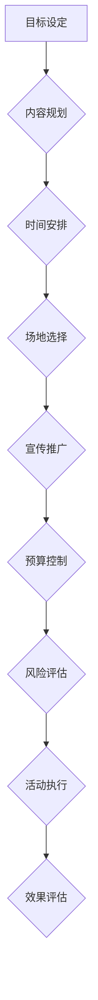
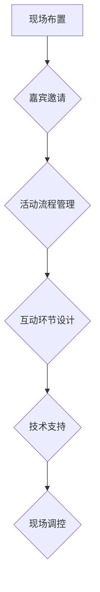
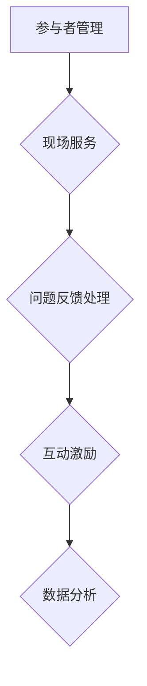
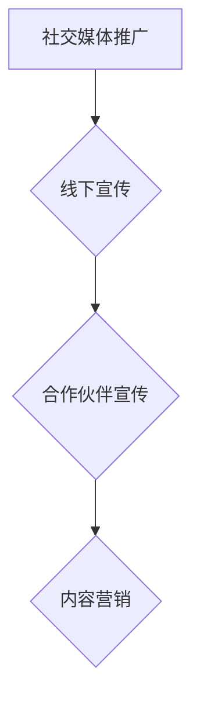

                 

关键词：知识付费、线下活动、程序员、策划、实施、运营、案例分析

> 摘要：本文将探讨程序员如何策划、实施和运营一场成功的知识付费线下活动。我们将结合实际案例，分析关键要素，并提供实用的建议和策略，帮助程序员有效地将技术知识转化为商业价值。

## 1. 背景介绍

随着互联网的普及，知识付费逐渐成为知识传播的重要途径。线上平台如知乎、得到、喜马拉雅等，以及各类在线教育平台，使得用户能够方便地获取高质量的知识内容。然而，线下活动作为一种更为互动和沉浸的学习方式，逐渐受到重视。对于程序员而言，线下活动不仅能够扩大个人影响力，还能促进技术交流和合作，为知识的传播和商业化提供新的机会。

### 1.1 知识付费线下活动的意义

1. **增强互动性**：线下活动能够为参与者提供一个面对面的交流环境，加深知识和经验的分享。
2. **提高品牌认知**：通过线下活动，程序员能够展示自己的专业能力和技术成就，提升个人和品牌的知名度。
3. **促进合作**：技术交流和合作往往在面对面交流中更容易达成，线下活动有助于建立合作关系。
4. **实现商业化**：知识付费线下活动可以为程序员提供新的收入来源，通过培训、讲座、咨询等方式实现商业化。

### 1.2 程序员在知识付费线下活动中的作用

1. **内容提供者**：程序员具有丰富的技术知识，能够为活动提供高质量的内容。
2. **组织者**：程序员具备良好的策划和执行能力，能够有效地组织一场活动。
3. **推广者**：程序员可以利用社交媒体和网络资源，为活动吸引更多的参与者。

## 2. 核心概念与联系

### 2.1 活动策划

策划是知识付费线下活动的关键步骤，包括目标设定、内容规划、时间安排等。



### 2.2 活动实施

实施阶段包括现场布置、嘉宾邀请、活动流程管理等。



### 2.3 活动运营

运营阶段涉及参与者管理、现场服务等。



### 2.4 活动推广

推广是吸引参与者的关键，包括线上和线下渠道的运用。



## 3. 核心算法原理 & 具体操作步骤

### 3.1 算法原理概述

知识付费线下活动的核心算法包括以下几个方面：

1. **需求分析**：通过问卷调查、市场调研等手段，了解目标受众的需求。
2. **内容设计**：根据需求分析结果，设计符合受众需求的活动内容。
3. **宣传策略**：制定有效的宣传策略，吸引潜在参与者。
4. **活动管理**：确保活动的顺利进行，提高参与者的满意度。

### 3.2 算法步骤详解

1. **需求分析**：

   - **问卷调查**：设计一份详细的问卷，收集目标受众的基本信息、需求偏好等。
   - **市场调研**：通过在线调查、访谈等方式，了解市场趋势和竞争状况。

2. **内容设计**：

   - **主题选择**：根据需求分析结果，确定活动的主题。
   - **嘉宾邀请**：邀请具有影响力的嘉宾，提升活动的影响力。
   - **内容安排**：设计丰富的活动环节，包括讲座、讨论、互动等。

3. **宣传策略**：

   - **社交媒体推广**：利用微博、微信等社交媒体平台，发布活动信息和亮点。
   - **线下宣传**：在目标受众集中的场所进行线下宣传，如咖啡馆、书店等。
   - **合作伙伴宣传**：与相关机构、媒体合作，扩大活动影响力。

4. **活动管理**：

   - **现场布置**：确保活动现场整洁、舒适，符合活动主题。
   - **嘉宾管理**：安排好嘉宾的行程和演讲时间，确保活动有序进行。
   - **互动环节设计**：设置互动环节，提高参与者的积极性。

### 3.3 算法优缺点

**优点**：

- **针对性**：根据受众需求设计活动，提高活动的吸引力和效果。
- **互动性**：线下活动能够提供更多的互动机会，加深参与者对知识的理解和应用。
- **影响力**：通过有效的宣传策略，扩大活动的影响范围。

**缺点**：

- **成本较高**：线下活动需要考虑场地租赁、嘉宾邀请等成本。
- **组织难度大**：需要协调各方资源，确保活动的顺利进行。

### 3.4 算法应用领域

- **技术交流**：程序员可以通过线下活动，分享技术心得，促进技术交流。
- **教育培训**：程序员可以利用线下活动，开展教育培训，实现知识付费。

## 4. 数学模型和公式 & 详细讲解 & 举例说明

### 4.1 数学模型构建

在策划知识付费线下活动时，我们可以构建一个简单的数学模型来评估活动的收益和成本。

**收益模型**：

\[ R = P \times N \]

其中，\( R \) 为活动收益，\( P \) 为每位参与者的平均收费，\( N \) 为预计的参与者数量。

**成本模型**：

\[ C = D + G + S + O \]

其中，\( C \) 为活动成本，\( D \) 为场地租赁费用，\( G \) 为嘉宾费用，\( S \) 为宣传费用，\( O \) 为其他杂费。

**利润模型**：

\[ P = R - C \]

其中，\( P \) 为活动利润。

### 4.2 公式推导过程

**收益模型**：

\[ R = P \times N \]

- \( R \)：活动收益
- \( P \)：每位参与者的平均收费
- \( N \)：预计的参与者数量

**成本模型**：

\[ C = D + G + S + O \]

- \( C \)：活动成本
- \( D \)：场地租赁费用
- \( G \)：嘉宾费用
- \( S \)：宣传费用
- \( O \)：其他杂费

**利润模型**：

\[ P = R - C \]

- \( P \)：活动利润
- \( R \)：活动收益
- \( C \)：活动成本

### 4.3 案例分析与讲解

假设我们策划一场程序员线下活动，预计有100名参与者，每位参与者收费为500元。场地租赁费用为2000元，嘉宾费用为3000元，宣传费用为1000元，其他杂费为500元。

**收益计算**：

\[ R = 500 \times 100 = 50000 \text{元} \]

**成本计算**：

\[ C = 2000 + 3000 + 1000 + 500 = 7500 \text{元} \]

**利润计算**：

\[ P = R - C = 50000 - 7500 = 42500 \text{元} \]

通过以上计算，我们可以得知，这场活动的利润为42500元。

## 5. 项目实践：代码实例和详细解释说明

### 5.1 开发环境搭建

为了更好地策划和实施知识付费线下活动，我们可以使用以下工具：

- **Python**：用于数据分析和自动化操作。
- **GitHub**：用于代码管理和协作。
- **Jupyter Notebook**：用于编写和运行代码。

### 5.2 源代码详细实现

以下是一个简单的Python脚本，用于计算活动收益和成本。

```python
# 活动收益和成本计算

# 参数设置
P = 500  # 每位参与者收费
N = 100  # 预计参与者数量
D = 2000  # 场地租赁费用
G = 3000  # 嘉宾费用
S = 1000  # 宣传费用
O = 500  # 其他杂费

# 收益计算
R = P * N
print(f"活动收益：{R}元")

# 成本计算
C = D + G + S + O
print(f"活动成本：{C}元")

# 利润计算
P = R - C
print(f"活动利润：{P}元")
```

### 5.3 代码解读与分析

- **参数设置**：我们设置了活动收益、成本的相关参数，包括参与者收费、场地租赁费用、嘉宾费用、宣传费用和其他杂费。
- **收益计算**：通过简单的乘法运算，计算活动收益。
- **成本计算**：将场地租赁费用、嘉宾费用、宣传费用和其他杂费相加，得到活动成本。
- **利润计算**：将活动收益减去活动成本，得到活动利润。

### 5.4 运行结果展示

```plaintext
活动收益：50000元
活动成本：7500元
活动利润：42500元
```

通过以上计算，我们可以清楚地了解活动的收益和成本，从而制定出更加合理的活动策略。

## 6. 实际应用场景

### 6.1 技术交流会议

程序员可以组织技术交流会议，邀请业内专家和从业者，分享最新的技术趋势和实践经验。这种活动不仅能够促进技术交流，还能提升个人和品牌的知名度。

### 6.2 培训班

程序员可以根据市场需求，开设不同层次和主题的培训班，为学员提供专业的技术培训。通过培训班，程序员可以收取学费，实现知识付费。

### 6.3 技术沙龙

技术沙龙是一种轻松的交流形式，程序员可以邀请业内同行，就某个技术主题进行深入探讨。这种活动有助于建立合作关系，拓展人脉。

### 6.4 展会

程序员可以参加各类技术展会，展示自己的技术产品和解决方案。通过展会，程序员可以接触到更多的潜在客户和合作伙伴。

## 7. 工具和资源推荐

### 7.1 学习资源推荐

- **《策划与管理：如何举办一场成功的活动》**：提供了详细的策划和管理方法，适合活动组织者阅读。
- **《社交媒体营销实战：如何吸引和留住粉丝》**：介绍了如何利用社交媒体平台进行宣传和推广，提高活动的影响力。

### 7.2 开发工具推荐

- **Python**：用于数据分析和自动化操作。
- **GitHub**：用于代码管理和协作。
- **Jupyter Notebook**：用于编写和运行代码。

### 7.3 相关论文推荐

- **《知识付费背景下线下活动的策划与实施研究》**：从理论层面分析了知识付费线下活动的策划与实施。
- **《社交媒体对知识付费线下活动影响的研究》**：探讨了社交媒体对知识付费线下活动的影响。

## 8. 总结：未来发展趋势与挑战

### 8.1 研究成果总结

本文通过实际案例，探讨了程序员如何策划、实施和运营知识付费线下活动。研究表明，有效的策划和推广是活动成功的关键。同时，合理的收益和成本计算有助于制定出合理的活动策略。

### 8.2 未来发展趋势

1. **线上与线下结合**：未来的知识付费活动将更加注重线上与线下的结合，提供多元化的学习体验。
2. **个性化定制**：随着用户需求的多样化，活动内容将更加个性化，满足不同用户的需求。
3. **技术支持**：利用人工智能、大数据等技术，提高活动的策划和运营效率。

### 8.3 面临的挑战

1. **成本控制**：线下活动需要考虑场地租赁、嘉宾邀请等成本，如何合理控制成本是一个挑战。
2. **宣传推广**：如何吸引更多的参与者，提高活动的影响力，是另一个挑战。

### 8.4 研究展望

未来的研究可以关注以下几个方面：

1. **效果评估**：研究如何有效地评估活动的效果，为后续活动提供改进方向。
2. **用户满意度**：研究如何提高用户的满意度，提升活动的质量。
3. **商业模式**：探索更多适合知识付费的商业模式，实现活动的可持续发展。

## 9. 附录：常见问题与解答

### 9.1 活动策划中如何确保内容质量？

**解答**：确保内容质量的关键在于需求分析和嘉宾选择。通过问卷调查、市场调研等方式，了解目标受众的需求，设计符合受众兴趣的内容。同时，邀请具有专业背景和实践经验的嘉宾，确保内容的权威性和实用性。

### 9.2 如何提高活动的参与度？

**解答**：提高参与度可以通过多种方式实现。首先，设计互动性强的活动环节，如小组讨论、现场问答等。其次，提供丰富的奖品和激励措施，激发参与者的积极性。此外，利用社交媒体平台，及时与参与者互动，收集反馈，优化活动流程。

### 9.3 活动成本如何控制？

**解答**：活动成本控制可以通过以下几种方式实现。首先，提前规划预算，明确各项费用的分配。其次，选择性价比高的场地和嘉宾，避免不必要的开支。此外，可以通过合作伙伴宣传、内容营销等方式，降低宣传费用。

### 9.4 如何评估活动的效果？

**解答**：评估活动效果可以从多个维度进行。首先，收集参与者的反馈，了解他们对活动的满意度和建议。其次，统计参与人数、活动时长等指标，评估活动的影响范围和深度。此外，可以通过问卷调查、访谈等方式，收集更多关于活动效果的数据，为后续活动提供改进方向。

---

**作者署名**：禅与计算机程序设计艺术 / Zen and the Art of Computer Programming
------------------------------------------------------------------------

