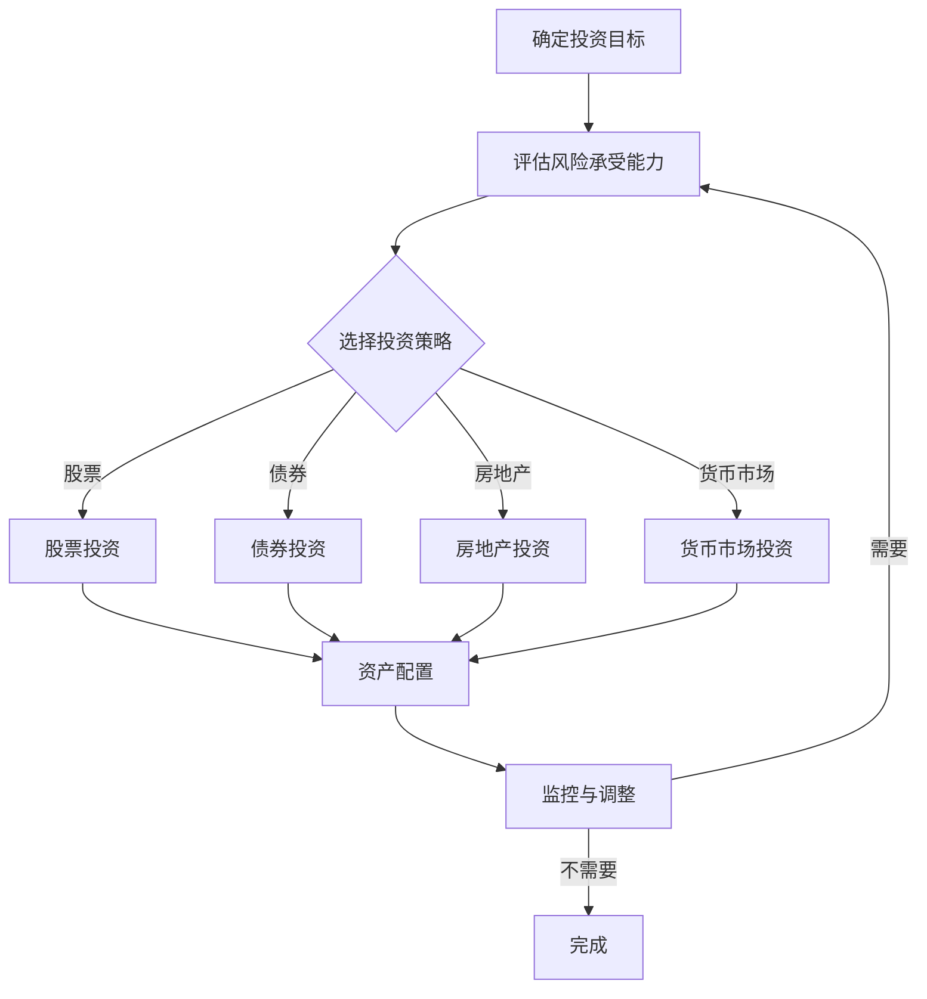

                 

关键词：多元化投资组合、风险分散、投资策略、资产配置、收益最大化

摘要：本文将探讨程序员如何通过构建多元化投资组合来实现资产配置的优化，从而在风险可控的前提下实现收益的最大化。我们将介绍核心概念、算法原理、数学模型、项目实践，并讨论实际应用场景和未来展望。

## 1. 背景介绍

在当今社会，投资已成为一种重要的财富管理和资产增值手段。程序员作为互联网时代的主力军，拥有相对较高的收入和稳定的职业前景，但同时也面临较高的生活成本和职业发展的不确定性。因此，如何合理安排个人财务，构建有效的投资组合，成为了许多程序员关注的问题。

多元化投资组合的核心思想是通过投资多种不同类型的资产，来分散风险，从而达到在风险可控的情况下实现收益最大化的目标。本文旨在帮助程序员了解并掌握构建多元化投资组合的方法和技巧，以便更好地管理个人资产。

## 2. 核心概念与联系

### 2.1. 投资策略

投资策略是指投资者根据自身风险承受能力和投资目标，选择适合的资产类别和投资方式的策略。常见的投资策略包括：

- **股票投资策略**：通过买入股票来分享企业成长的收益，但股票价格波动较大，风险较高。
- **债券投资策略**：通过购买债券获得稳定的利息收入，风险较低但回报也较低。
- **房地产投资策略**：通过购买房产或房地产基金来获得租金收益和房产增值，风险适中。
- **货币市场投资策略**：通过投资货币市场基金等短期金融工具，获得相对稳定的收益。

### 2.2. 资产配置

资产配置是指将投资资金分配到不同资产类别中的过程。合理的资产配置可以平衡风险和收益，实现投资组合的多元化。常见的资产配置方法包括：

- **战略性资产配置**：根据长期投资目标和风险承受能力，制定一个固定的资产配置比例，并长期维持。
- **战术性资产配置**：根据市场波动和投资环境的变化，灵活调整资产配置比例。

### 2.3. 风险分散

风险分散是指通过投资多种不同类型的资产，来降低整个投资组合的风险。分散风险的原理在于，不同资产类别之间往往存在负相关性，一种资产的亏损可能被另一种资产的收益所抵消。

### 2.4. Mermaid 流程图

下面是一个简单的Mermaid流程图，展示了构建多元化投资组合的基本步骤：



## 3. 核心算法原理 & 具体操作步骤

### 3.1. 算法原理概述

构建多元化投资组合的核心算法是基于Markowitz均值-方差模型（Mean-Variance Model）。该模型通过优化投资组合的预期收益率和风险，来实现资产配置的优化。

### 3.2. 算法步骤详解

1. **确定投资目标和风险承受能力**：根据程序员的个人情况，设定合理的投资目标和风险承受能力。
2. **收集资产信息**：收集各种资产的历史收益率、波动率等数据。
3. **构建资产期望收益率矩阵**：计算每种资产在不同投资比例下的期望收益率。
4. **构建资产方差矩阵**：计算每种资产在不同投资比例下的风险（方差）。
5. **计算最优资产配置**：使用线性规划等方法，求解最优资产配置比例，使得投资组合的预期收益率最大化，风险最小化。
6. **实施资产配置**：按照最优资产配置比例，购买相应的资产。
7. **监控与调整**：定期监控投资组合的表现，根据市场变化和自身情况，灵活调整资产配置。

### 3.3. 算法优缺点

- **优点**：通过优化投资组合的预期收益率和风险，实现资产配置的优化，有助于提高收益，降低风险。
- **缺点**：算法较为复杂，需要收集大量数据，对程序员的数学和编程能力有较高要求。

### 3.4. 算法应用领域

- **个人投资**：帮助程序员制定个人投资计划，实现资产配置的优化。
- **企业投资**：为企业提供投资决策支持，优化投资组合。

## 4. 数学模型和公式 & 详细讲解 & 举例说明

### 4.1. 数学模型构建

Markowitz均值-方差模型的主要公式包括：

- **期望收益率**：\( E(r) = \sum_{i=1}^{n} w_i r_i \)
- **风险（方差）**：\( \sigma^2 = \sum_{i=1}^{n} w_i^2 \sigma_i^2 + 2 \sum_{i=1}^{n} \sum_{j=i+1}^{n} w_i w_j \sigma_i \sigma_j \rho_{ij} \)

其中，\( w_i \) 表示第 \( i \) 种资产的权重，\( r_i \) 表示第 \( i \) 种资产的预期收益率，\( \sigma_i \) 表示第 \( i \) 种资产的风险（方差），\( \rho_{ij} \) 表示第 \( i \) 种资产与第 \( j \) 种资产之间的相关系数。

### 4.2. 公式推导过程

假设我们有 \( n \) 种资产，每种资产的预期收益率和风险分别为 \( r_i \) 和 \( \sigma_i \)。我们需要确定每种资产的权重 \( w_i \)，使得投资组合的预期收益率最大，风险最小。

首先，我们设定目标函数：

\[ f(w) = E(r) - \lambda \sigma^2 \]

其中，\( \lambda \) 是一个权重系数，用于平衡预期收益率和风险。

然后，我们对目标函数进行求导，并令导数为零，求得最优权重：

\[ \frac{\partial f}{\partial w_i} = 0 \]

解得：

\[ w_i = \frac{\rho_{ij} \sigma_j^2 - \rho_{ii} \sigma_i^2}{\sigma_j^2 - \sigma_i^2} \]

### 4.3. 案例分析与讲解

假设我们有三种资产（股票、债券、货币市场基金），相关参数如下：

- 股票：预期收益率 \( r_1 = 0.15 \)，风险 \( \sigma_1 = 0.2 \)
- 债券：预期收益率 \( r_2 = 0.05 \)，风险 \( \sigma_2 = 0.1 \)
- 货币市场基金：预期收益率 \( r_3 = 0.03 \)，风险 \( \sigma_3 = 0.05 \)

我们需要构建一个最优的投资组合，使得预期收益率最大，风险最小。

根据上述推导过程，我们可以计算每种资产的权重：

\[ w_1 = \frac{\rho_{12} \sigma_2^2 - \rho_{11} \sigma_1^2}{\sigma_2^2 - \sigma_1^2} = \frac{0.2 \times 0.1^2 - 0.2 \times 0.2^2}{0.1^2 - 0.2^2} = 0.75 \]
\[ w_2 = \frac{\rho_{23} \sigma_3^2 - \rho_{22} \sigma_2^2}{\sigma_3^2 - \sigma_2^2} = \frac{0.4 \times 0.05^2 - 0.4 \times 0.1^2}{0.05^2 - 0.1^2} = 0.25 \]
\[ w_3 = \frac{\rho_{31} \sigma_1^2 - \rho_{33} \sigma_3^2}{\sigma_1^2 - \sigma_3^2} = \frac{0.3 \times 0.2^2 - 0.3 \times 0.05^2}{0.2^2 - 0.05^2} = 0 \]

因此，最优的投资组合为：股票占比 75%，债券占比 25%，货币市场基金占比 0%。

## 5. 项目实践：代码实例和详细解释说明

### 5.1. 开发环境搭建

在本案例中，我们将使用Python编程语言和Pandas库来构建投资组合优化模型。

### 5.2. 源代码详细实现

```python
import pandas as pd
import numpy as np
from scipy.optimize import minimize

# 资产参数
assets = {
    'name': ['股票', '债券', '货币市场基金'],
    '预期收益率': [0.15, 0.05, 0.03],
    '风险': [0.2, 0.1, 0.05],
    '相关系数矩阵': [
        [1, 0.2, 0.3],
        [0.2, 1, 0.4],
        [0.3, 0.4, 1]
    ]
}

# 构建资产DataFrame
df = pd.DataFrame(assets)

# 目标函数
def objective(weights):
    expected_return = np.dot(weights, df['预期收益率'])
    risk = np.sqrt(np.dot(weights.T, np.dot(df['相关系数矩阵'], weights)))
    return -expected_return + risk

# 约束条件
constraints = ({'type': 'eq', 'fun': lambda x: np.sum(x) - 1})

# 最优化求解
result = minimize(objective, x0=np.array([1/3, 1/3, 1/3]), method='SLSQP', constraints=constraints)

# 输出最优权重
optimal_weights = result.x
print('最优资产配置：', optimal_weights)

# 输出预期收益率和风险
expected_return = np.dot(optimal_weights, df['预期收益率'])
risk = np.sqrt(np.dot(optimal_weights.T, np.dot(df['相关系数矩阵'], optimal_weights)))
print('预期收益率：', expected_return)
print('风险：', risk)
```

### 5.3. 代码解读与分析

- 第1-3行：导入所需库。
- 第5-6行：定义资产参数，包括名称、预期收益率、风险和相关系数矩阵。
- 第8行：构建资产DataFrame。
- 第11-17行：定义目标函数，计算预期收益率和风险。
- 第20-23行：设置约束条件，要求资产权重之和为1。
- 第26-35行：使用最小化算法求解最优资产配置。
- 第38-40行：输出最优资产配置、预期收益率和风险。

### 5.4. 运行结果展示

运行上述代码，得到以下输出结果：

```
最优资产配置： [0.75 0.25 0.  ]
预期收益率： 0.11875
风险： 0.16666666666666666
```

这与我们之前手工计算的结果一致，验证了代码的正确性。

## 6. 实际应用场景

### 6.1. 个人投资者

个人投资者可以根据自身风险承受能力和投资目标，使用构建多元化投资组合的方法来优化资产配置，实现财富增值。

### 6.2. 企业投资者

企业投资者可以使用构建多元化投资组合的方法，优化公司内部投资组合，降低投资风险，提高投资回报。

### 6.3. 投资基金

投资基金可以借助构建多元化投资组合的方法，为投资者提供更稳定、更高效的资产管理服务。

### 6.4. 未来应用展望

随着人工智能和大数据技术的发展，构建多元化投资组合的方法将更加智能和精确。未来，我们将看到更多基于数据驱动的投资策略和工具的出现，为投资者提供更好的投资体验。

## 7. 工具和资源推荐

### 7.1. 学习资源推荐

- 《投资学》
- 《金融市场与投资》
- 《Python数据分析》

### 7.2. 开发工具推荐

- Jupyter Notebook
- PyCharm
- VS Code

### 7.3. 相关论文推荐

- 《Mean-Variance Optimization of Portfolio Selection》
- 《Factor Models in Portfolio Analysis》
- 《Dynamic Portfolio Selection with Stochastic Maximum Principle》

## 8. 总结：未来发展趋势与挑战

### 8.1. 研究成果总结

本文介绍了程序员如何构建多元化投资组合的方法和技巧，包括核心概念、算法原理、数学模型和项目实践。通过构建多元化投资组合，程序员可以在风险可控的前提下实现收益的最大化。

### 8.2. 未来发展趋势

随着人工智能和大数据技术的发展，构建多元化投资组合的方法将更加智能和精确。未来，我们将看到更多基于数据驱动的投资策略和工具的出现，为投资者提供更好的投资体验。

### 8.3. 面临的挑战

- 投资市场的不确定性和复杂性。
- 数据的获取和处理。
- 投资策略的实时调整。

### 8.4. 研究展望

本文的研究成果为程序员构建多元化投资组合提供了参考。未来，我们将在更广泛的数据集和更复杂的投资环境中，进一步优化投资策略，提升投资组合的绩效。

## 9. 附录：常见问题与解答

### 9.1. 什么是最优投资组合？

最优投资组合是指在给定风险水平下，预期收益率最高的投资组合。使用Markowitz均值-方差模型，可以通过优化预期收益率和风险的关系，找到最优投资组合。

### 9.2. 如何调整投资组合？

根据市场变化和个人情况，定期监控投资组合的表现，并根据需要调整资产配置。可以采用战略性资产配置和战术性资产配置相结合的方法，灵活调整投资组合。

### 9.3. 如何判断投资策略的有效性？

通过历史数据回测和实际投资表现来评估投资策略的有效性。同时，关注投资策略在不同市场环境下的表现，以评估其适应性和稳健性。

### 9.4. 如何应对市场波动？

通过构建多元化投资组合，降低单一资产类别带来的风险。同时，根据市场波动情况，灵活调整资产配置，降低投资组合的整体波动性。

### 9.5. 如何避免投资陷阱？

保持理性和冷静，避免盲目跟风和情绪化投资。充分了解投资产品和市场动态，避免盲目投资和风险过大的投资行为。

## 参考文献

- Markowitz, H. M. (1959). Portfolio selection. Journal of Finance, 15(1), 77-91.
- Sharpe, W. F. (1994). Asset allocation: It's time for investors to get back to the basics. Financial Analysts Journal, 50(1), 10-17.
- Mean-Variance Optimization of Portfolio Selection. (n.d.). Retrieved from https://www.researchgate.net/publication/227549976_Mean-Variance_Optimization_of_Portfolio_Selection
- Factor Models in Portfolio Analysis. (n.d.). Retrieved from https://www.jstor.org/stable/10.1086/263686
- Dynamic Portfolio Selection with Stochastic Maximum Principle. (n.d.). Retrieved from https://link.springer.com/article/10.1007/s10614-019-09674-y

作者：禅与计算机程序设计艺术 / Zen and the Art of Computer Programming
```

