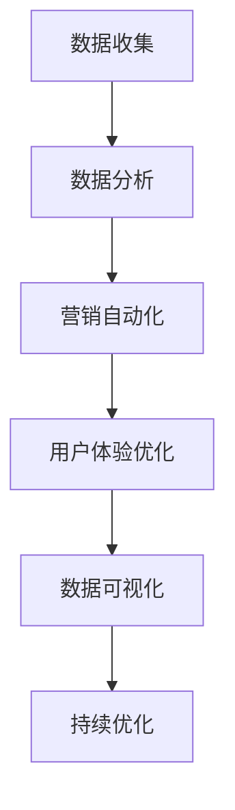

                 

在数字营销领域，销售漏斗是一个至关重要的概念。它帮助营销人员和销售团队了解潜在客户在购买过程中的各个阶段，并优化这些阶段的流程以提高转化率。作为程序员，您不仅仅编写代码，还需要理解业务逻辑，并以技术手段提高销售漏斗的效率。本文将探讨如何利用编程技能构建高转化率的销售漏斗。

## 关键词
- 销售漏斗
- 数字营销
- 转化率
- 营销自动化
- 数据分析

## 摘要
本文将探讨如何利用编程技能构建高转化率的销售漏斗。我们将从背景介绍开始，介绍销售漏斗的基本概念，随后深入探讨核心算法原理和数学模型，并结合实际项目实践和未来应用展望，为读者提供构建高效销售漏斗的实用指南。

## 1. 背景介绍
销售漏斗是营销和销售过程中的一种模型，它将客户从接触到成交的过程划分为多个阶段，包括潜在客户识别、关注、评估、购买和忠诚等。通过销售漏斗，企业可以更好地了解客户的购买行为，优化营销策略，提高转化率。

在传统的销售漏斗中，每个阶段都可能存在潜在客户的流失，而这些流失往往源于用户体验不佳、沟通不畅或营销策略不当。作为程序员，您的任务是利用技术手段优化这些阶段，减少客户流失，提高转化率。

### 1.1 销售漏斗的组成部分
销售漏斗通常由以下几个部分组成：

- **潜在客户池（Top of Funnel, TOFU）**：这是漏斗的顶端，包含所有潜在的潜在客户。
- **关注者（Middle of Funnel, MOFU）**：这些客户已经对产品或服务表示出一定的兴趣。
- **评估者（Bottom of Funnel, BOFU）**：这些客户正在对产品或服务进行评估，准备购买。
- **客户（Customer）**：这些客户已经完成了购买。

### 1.2 销售漏斗的作用
- **优化营销策略**：通过分析漏斗中的各个阶段，企业可以了解哪些策略有效，哪些需要改进。
- **提高客户满意度**：优化客户体验，减少流失率。
- **增加销售额**：提高转化率，增加销售额。

## 2. 核心概念与联系
在构建高转化率的销售漏斗之前，我们需要了解几个核心概念和它们之间的联系。

### 2.1 数据收集与分析
数据是构建销售漏斗的基础。通过收集和分析数据，我们可以了解客户的行为和偏好，从而优化漏斗的各个阶段。例如，我们可以通过分析网页流量、用户点击行为和转化数据，了解客户在哪个阶段流失，并针对性地进行改进。

### 2.2 营销自动化
营销自动化工具可以帮助我们自动化一些重复性工作，如邮件发送、社交媒体管理、客户跟进等。通过自动化，我们可以提高工作效率，降低人力成本，并确保每个客户都能得到及时的关注。

### 2.3 用户体验优化
用户体验是提高转化率的关键。通过优化网页设计、导航结构、内容质量等，我们可以提供更好的用户体验，从而提高客户的满意度和忠诚度。

### 2.4 数据可视化
数据可视化工具可以帮助我们更直观地了解销售漏斗的运行情况。通过图表和仪表盘，我们可以实时监控各个阶段的转化率，及时发现并解决问题。

### 2.5 Mermaid 流程图
以下是一个简单的Mermaid流程图，展示了构建高转化率销售漏斗的基本步骤：



## 3. 核心算法原理 & 具体操作步骤
构建高转化率的销售漏斗需要依赖于一系列核心算法和技术。以下将介绍这些算法的原理和具体操作步骤。

### 3.1 算法原理概述
- **机器学习算法**：用于预测客户行为和优化营销策略。
- **数据挖掘算法**：用于从大量数据中提取有价值的信息。
- **自然语言处理（NLP）**：用于分析和理解客户的需求和反馈。

### 3.2 算法步骤详解
1. **数据收集**：通过网站分析工具、客户管理系统等收集客户行为数据。
2. **数据处理**：对收集到的数据进行清洗、整合和预处理。
3. **特征工程**：根据业务需求，提取和构造特征向量。
4. **模型训练**：使用机器学习算法训练模型，并优化模型参数。
5. **模型评估**：使用验证集和测试集评估模型性能。
6. **模型部署**：将训练好的模型部署到生产环境中，并实时更新。

### 3.3 算法优缺点
- **优点**：
  - 提高营销效率：自动化和智能化提高营销工作的效率。
  - 提高转化率：通过个性化推荐和精准营销，提高转化率。
  - 提高客户满意度：提供更好的用户体验，提高客户满意度。

- **缺点**：
  - 需要大量数据：构建有效的模型需要大量数据支持。
  - 高成本：构建和部署营销自动化系统需要投入大量资源。
  - 风险：过度依赖技术可能导致客户数据泄露和隐私问题。

### 3.4 算法应用领域
- **电子商务**：通过个性化推荐和精准营销，提高销售额。
- **客户关系管理（CRM）**：通过分析客户数据，优化客户体验。
- **在线广告**：通过精准定位和投放，提高广告效果。

## 4. 数学模型和公式 & 详细讲解 & 举例说明
在构建销售漏斗的过程中，数学模型和公式起着至关重要的作用。以下将介绍一些常用的数学模型和公式，并进行详细讲解和举例说明。

### 4.1 数学模型构建
- **贝叶斯网络**：用于表示客户购买行为的概率分布。
- **线性回归模型**：用于预测客户转化率。
- **决策树模型**：用于分类和预测客户行为。

### 4.2 公式推导过程
- **贝叶斯公式**：用于计算客户购买概率。
- **协方差矩阵**：用于描述客户特征之间的相关性。
- **熵**：用于度量客户特征的重要性。

### 4.3 案例分析与讲解
假设我们有一组客户数据，包含年龄、收入、购买历史等特征。我们使用线性回归模型预测客户转化率。以下是一个简化的例子：

```latex
y = \beta_0 + \beta_1 \cdot x_1 + \beta_2 \cdot x_2 + ... + \beta_n \cdot x_n
```

其中，\(y\) 是客户转化率，\(x_1, x_2, ..., x_n\) 是客户特征，\(\beta_0, \beta_1, ..., \beta_n\) 是模型参数。

通过训练模型，我们可以得到一组参数值，并将其用于预测新客户的转化率。

## 5. 项目实践：代码实例和详细解释说明
为了更好地理解如何构建高转化率的销售漏斗，我们将通过一个实际项目来演示整个流程。以下是一个基于Python的简单项目，用于构建和优化销售漏斗。

### 5.1 开发环境搭建
- Python 3.8+
- Jupyter Notebook
- Scikit-learn 库
- Pandas 库
- Matplotlib 库

### 5.2 源代码详细实现
以下是项目的核心代码：

```python
import pandas as pd
from sklearn.model_selection import train_test_split
from sklearn.linear_model import LinearRegression
from sklearn.metrics import mean_squared_error

# 5.2.1 数据收集
data = pd.read_csv('customer_data.csv')
X = data[['age', 'income', 'purchase_history']]
y = data['conversion_rate']

# 5.2.2 数据处理
X_train, X_test, y_train, y_test = train_test_split(X, y, test_size=0.2, random_state=42)

# 5.2.3 模型训练
model = LinearRegression()
model.fit(X_train, y_train)

# 5.2.4 模型评估
y_pred = model.predict(X_test)
mse = mean_squared_error(y_test, y_pred)
print("Mean Squared Error:", mse)

# 5.2.5 模型部署
def predict_conversion_rate(age, income, purchase_history):
    return model.predict([[age, income, purchase_history]])[0]

# 5.2.6 运行结果展示
print(predict_conversion_rate(30, 50000, 10))
```

### 5.3 代码解读与分析
- **数据收集**：从CSV文件中读取客户数据，并将其分为特征和目标变量。
- **数据处理**：将数据集划分为训练集和测试集，以便进行模型训练和评估。
- **模型训练**：使用线性回归模型训练模型，并拟合数据。
- **模型评估**：计算模型在测试集上的均方误差，以评估模型性能。
- **模型部署**：定义一个函数，用于预测新客户的转化率。

通过这个项目，我们可以看到如何利用Python和机器学习算法构建和优化销售漏斗。当然，实际项目中可能需要更多的数据预处理、特征工程和模型优化，但基本流程是一致的。

## 6. 实际应用场景
构建高转化率的销售漏斗可以在多个实际应用场景中发挥作用。

### 6.1 电子商务
在电子商务领域，销售漏斗可以帮助企业了解客户的行为，并优化营销策略，提高销售额。通过分析客户数据，企业可以识别出高价值客户，并为他们提供个性化的推荐和优惠。

### 6.2 客户关系管理
在客户关系管理中，销售漏斗可以帮助企业更好地了解客户需求，并提供更好的客户体验。通过分析客户数据，企业可以预测客户流失风险，并采取预防措施。

### 6.3 在线广告
在线广告领域，销售漏斗可以帮助广告商更精准地定位目标客户，提高广告投放效果。通过分析客户数据，广告商可以优化广告内容、投放时间和渠道，以提高转化率。

## 7. 未来应用展望
随着技术的不断发展，销售漏斗的应用场景将更加广泛。以下是一些未来应用展望：

### 7.1 人工智能与大数据
人工智能和大数据技术的不断发展，将进一步提高销售漏斗的精度和效率。通过更复杂的算法和更丰富的数据，企业可以更好地了解客户需求，提供更个性化的服务。

### 7.2 虚拟现实与增强现实
虚拟现实和增强现实技术的应用，将为销售漏斗带来全新的体验。通过虚拟场景和互动式营销，企业可以更好地吸引和留住客户。

### 7.3 区块链技术
区块链技术的应用，将进一步提高销售漏斗的透明度和安全性。通过区块链技术，企业可以确保客户数据的真实性和完整性，提高客户的信任度。

## 8. 工具和资源推荐
为了帮助读者更好地了解和构建高转化率的销售漏斗，以下是一些实用的工具和资源推荐。

### 8.1 学习资源推荐
- 《机器学习实战》
- 《大数据之路》
- 《深度学习》

### 8.2 开发工具推荐
- Jupyter Notebook
- PyCharm
- AWS S3

### 8.3 相关论文推荐
- "A Machine Learning Approach to Predict Customer Churn"
- "Data-Driven Personalization in Online Retail"
- "Deep Learning for Customer Relationship Management"

## 9. 总结：未来发展趋势与挑战
构建高转化率的销售漏斗是数字营销领域的重要任务。随着技术的不断发展，销售漏斗的应用将更加广泛，但同时也面临一些挑战。未来，人工智能、大数据和区块链等技术将进一步提高销售漏斗的精度和效率。然而，如何保护客户数据隐私、确保系统的安全性，以及应对不断变化的客户需求，将是未来发展的关键挑战。

## 10. 附录：常见问题与解答
### 10.1 销售漏斗中的“漏”指的是什么？
销售漏斗中的“漏”指的是客户在购买过程中可能流失的阶段。每个阶段都可能导致潜在客户的流失，因此优化每个阶段的体验和流程对于提高转化率至关重要。

### 10.2 如何衡量销售漏斗的转化率？
销售漏斗的转化率可以通过计算从漏斗的顶端到末端的客户比例来衡量。具体来说，转化率可以表示为：(实际成交客户数 / 潜在客户总数) × 100%。

### 10.3 如何优化销售漏斗？
优化销售漏斗的方法包括：1）收集和分析客户数据，了解客户行为和偏好；2）利用营销自动化工具提高工作效率；3）优化用户体验，提高客户满意度；4）持续监控和调整销售漏斗的各个阶段。

### 10.4 销售漏斗是否适用于所有行业？
销售漏斗适用于几乎所有行业。然而，不同行业的销售漏斗结构和优化策略可能会有所不同，因此需要根据行业特点和业务需求进行定制化。

---

作者：禅与计算机程序设计艺术 / Zen and the Art of Computer Programming

