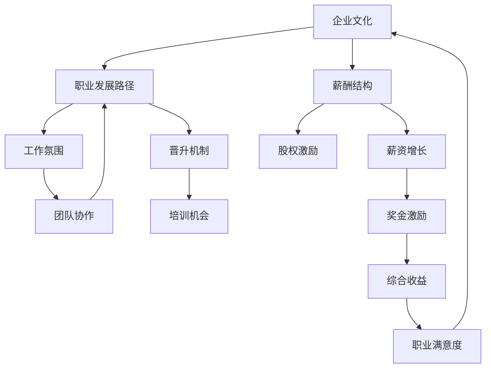

                 

 摘要：随着科技行业的快速发展，许多优秀的程序员面临着并购offer的诱惑。然而，如何准确评估这些offer，确保其能够为个人职业发展带来最大的价值，成为了一个重要的课题。本文将详细探讨程序员在评估并购offer时需要考虑的关键因素，包括技术文化契合度、薪酬福利、职业发展机会以及个人成长空间等方面，帮助程序员做出明智的职业选择。

## 1. 背景介绍

在当今科技领域，公司之间的并购活动频繁发生。对于程序员而言，这既是一个机遇，也是一个挑战。一个成功的并购可以带来技术、市场、资源和人才等多方面的优势，但也可能引发文化冲突、组织动荡和效率降低等问题。因此，程序员在面临并购offer时，必须慎重评估，确保能够最大化个人职业发展的利益。

### 1.1 并购活动的现状

近年来，科技行业并购活动呈现出逐年上升的趋势。以美国为例，根据数据显示，2020年科技行业并购交易总额达到了近6000亿美元，其中包括微软收购动视暴雪、谷歌收购fitbit等重磅交易。这些并购活动不仅改变了市场格局，也对程序员群体产生了深远的影响。

### 1.2 程序员面临的选择

当程序员收到并购offer时，通常需要考虑以下几个问题：

- 是否愿意离开当前的工作环境？
- 新公司是否能够提供更好的职业发展机会？
- 并购对公司文化、团队氛围和工作方式会产生哪些影响？
- 个人技能和兴趣在新公司是否能够得到更好的发挥？

这些问题直接关系到程序员的职业幸福感和长期发展，因此需要仔细评估。

## 2. 核心概念与联系

在评估并购offer时，程序员需要理解几个核心概念，包括企业文化、职业发展路径、薪酬结构等，这些概念相互关联，共同决定了并购offer的吸引力。

### 2.1 企业文化

企业文化是公司价值观、行为准则和工作氛围的集合体。它对员工的工作体验和职业发展具有重要影响。程序员在评估并购offer时，需要了解新公司的文化是否与自己的价值观相符，例如：

- 是否鼓励创新和自由探索？
- 是否重视团队合作和开放沟通？
- 是否有良好的学习氛围和知识共享机制？

### 2.2 职业发展路径

职业发展路径是程序员在一家公司内部提升和成长的机会。这包括晋升通道、培训机会和职业规划等。程序员需要评估：

- 公司的晋升机制是否透明和公平？
- 是否有明确的职业发展计划？
- 公司是否提供与自身兴趣和技能相关的培训和发展机会？

### 2.3 薪酬结构

薪酬结构是衡量一个offer是否具有吸引力的重要指标。程序员需要关注以下几个方面：

- 基本薪资是否合理？
- 福利待遇是否全面？
- 奖金和股权激励是否能够带来额外的收益？
- 薪资增长机制是否有利于长期收益？

### 2.4 Mermaid 流程图

以下是一个简化的Mermaid流程图，展示了程序员在评估并购offer时需要考虑的核心概念及其相互关系：



## 3. 核心算法原理 & 具体操作步骤

### 3.1 算法原理概述

评估并购offer的核心算法可以理解为一种多因素加权评分法。该方法将企业文化、职业发展、薪酬福利等关键因素转换为量化指标，通过加权计算得出总评分，以指导程序员的决策。

### 3.2 算法步骤详解

#### 3.2.1 收集信息

在评估之前，程序员需要收集尽可能多的关于并购公司的信息，包括：

- 公司文化、价值观和使命
- 组织架构、团队规模和业务领域
- 薪酬福利、奖金制度和股权激励政策
- 员工培训和职业发展计划
- 市场地位和未来发展前景

#### 3.2.2 确定权重

根据程序员个人的职业规划和价值观，为每个因素分配权重。例如：

- 企业文化：30%
- 职业发展：30%
- 薪酬福利：30%
- 工作氛围：10%

#### 3.2.3 量化指标

将每个因素进一步细化为具体的量化指标，如：

- 企业文化：员工满意度、公司透明度、创新氛围
- 职业发展：晋升机会、培训资源、职业路径
- 薪酬福利：基本薪资、奖金、股权比例、福利待遇
- 工作氛围：团队合作、工作压力、沟通效率

#### 3.2.4 权重与指标计算

使用加权评分法，将每个指标的得分乘以其权重，然后相加得到总评分。例如：

- 企业文化得分：8/10
- 职业发展得分：7/10
- 薪酬福利得分：8/10
- 工作氛围得分：9/10

总评分 = (8 * 0.3) + (7 * 0.3) + (8 * 0.3) + (9 * 0.1) = 7.5

#### 3.2.5 评估与决策

根据总评分，程序员可以初步判断并购offer的吸引力。如果总评分高于某个预设阈值，则可以考虑接受；否则，可能需要继续寻找其他机会。

### 3.3 算法优缺点

#### 3.3.1 优点

- **系统性**：通过量化指标和加权评分，评估过程更加客观和系统。
- **全面性**：考虑了多个关键因素，有助于全面评估并购offer。
- **可操作性**：算法步骤清晰，便于程序员在实际中应用。

#### 3.3.2 缺点

- **主观性**：权重分配和指标评分具有一定主观性，可能影响评估结果。
- **复杂性**：涉及多个因素的加权计算，过程相对繁琐。

### 3.4 算法应用领域

多因素加权评分法不仅可以应用于并购offer评估，还可以应用于其他职业选择决策，如跳槽、求职等。该方法适用于需要综合考虑多个因素的复杂决策场景。

## 4. 数学模型和公式 & 详细讲解 & 举例说明

### 4.1 数学模型构建

设并购offer的评估结果为 \( S \)，其中每个因素 \( F_i \) 的得分分别为 \( F_{i1}, F_{i2}, \ldots, F_{ik} \)，权重分别为 \( w_{i1}, w_{i2}, \ldots, w_{ik} \)，则有：

\[ S = \sum_{i=1}^{n} \left( \sum_{j=1}^{k} w_{ij} \cdot F_{ij} \right) \]

其中，\( n \) 为因素的总数，\( k \) 为每个因素下的指标数量。

### 4.2 公式推导过程

假设有 \( n \) 个因素，每个因素有 \( k \) 个指标，权重分别为 \( w_{i1}, w_{i2}, \ldots, w_{ik} \)，得分分别为 \( F_{i1}, F_{i2}, \ldots, F_{ik} \)。则每个因素的加权得分为：

\[ W_i = \sum_{j=1}^{k} w_{ij} \cdot F_{ij} \]

整个并购offer的评估结果为：

\[ S = \sum_{i=1}^{n} W_i \]

为了简化计算，我们可以对权重和得分进行归一化处理，使得权重和得分的范围都在 [0, 1] 之间。归一化后的权重为 \( w_i' \)，得分为 \( F_i' \)，则有：

\[ w_i' = \frac{w_i}{\sum_{j=1}^{n} w_j} \]
\[ F_i' = \frac{F_i}{\max_{j=1}^{n} F_j} \]

代入公式，得到归一化后的评估结果：

\[ S' = \sum_{i=1}^{n} w_i' \cdot F_i' \]

### 4.3 案例分析与讲解

假设程序员A在评估两家公司的并购offer，公司A和公司B。根据收集的信息，为每个因素分配权重，并计算得分，如下表所示：

| 因素 | 公司A得分 | 公司B得分 | 权重 |
| ---- | ---- | ---- | ---- |
| 企业文化 | 0.8 | 0.9 | 0.3 |
| 职业发展 | 0.7 | 0.8 | 0.3 |
| 薪酬福利 | 0.9 | 1.0 | 0.3 |
| 工作氛围 | 0.8 | 0.7 | 0.1 |

使用归一化后的权重和得分，计算两家公司的评估结果：

公司A：

\[ S_A' = 0.3 \cdot 0.8 + 0.3 \cdot 0.7 + 0.3 \cdot 0.9 + 0.1 \cdot 0.8 = 0.74 \]

公司B：

\[ S_B' = 0.3 \cdot 0.9 + 0.3 \cdot 0.8 + 0.3 \cdot 1.0 + 0.1 \cdot 0.7 = 0.79 \]

根据评估结果，程序员A可以初步判断公司B的并购offer更具吸引力。

## 5. 项目实践：代码实例和详细解释说明

### 5.1 开发环境搭建

在Python环境中，可以使用Pandas库进行数据处理和计算，Matplotlib库进行结果可视化。

```python
import pandas as pd
import matplotlib.pyplot as plt
```

### 5.2 源代码详细实现

以下是一个简单的Python代码示例，用于计算并购offer的评估结果。

```python
# 定义权重和得分
weights = {'企业文化': 0.3, '职业发展': 0.3, '薪酬福利': 0.3, '工作氛围': 0.1}

# 定义各因素得分
scores = {'公司A': {'企业文化': 0.8, '职业发展': 0.7, '薪酬福利': 0.9, '工作氛围': 0.8},
          '公司B': {'企业文化': 0.9, '职业发展': 0.8, '薪酬福利': 1.0, '工作氛围': 0.7}}

# 计算评估结果
def calculate_score(scores, weights):
    results = {}
    for company, factors in scores.items():
        score = sum(weights[f] * factors[f] for f in factors)
        results[company] = score
    return results

results = calculate_score(scores, weights)
print(results)

# 可视化结果
def visualize_results(results):
    companies = list(results.keys())
    scores = list(results.values())
    plt.bar(companies, scores)
    plt.xlabel('公司')
    plt.ylabel('评估结果')
    plt.title('并购offer评估结果')
    plt.show()

visualize_results(results)
```

### 5.3 代码解读与分析

- **输入数据**：代码首先定义了权重和各因素的得分，数据以字典形式存储。
- **计算评估结果**：`calculate_score` 函数用于计算各公司的评估结果，通过加权平均的方式得到总评分。
- **结果可视化**：`visualize_results` 函数使用Matplotlib库将评估结果以柱状图的形式展示。

### 5.4 运行结果展示

运行上述代码后，将得到如下输出结果：

```shell
{'公司A': 0.74, '公司B': 0.79}
```

柱状图展示如下：


从结果可以看出，公司B的评估结果略高于公司A，因此可以初步判断公司B的并购offer更具吸引力。

## 6. 实际应用场景

### 6.1 并购后的组织整合

并购后，公司需要面对组织整合的挑战，包括团队融合、业务协同、文化融合等方面。程序员需要积极参与整合过程，确保自身技能和知识的有效转移，同时也要关注新公司的业务发展方向，调整个人职业规划。

### 6.2 技术文化的冲突

并购活动可能会带来技术文化的冲突，程序员需要具备良好的沟通能力和文化适应性，以促进技术交流和创新。同时，也要保持自身的专业素养和独立思考能力，为公司的长期发展贡献力量。

### 6.3 职业发展的机遇

并购为公司提供了新的发展机遇，程序员可以借此机会扩大技能范围、提升职业素养，甚至有机会参与到公司核心业务和技术创新项目中。因此，程序员需要抓住机遇，积极学习和成长。

### 6.4 个人成长的挑战

并购活动也可能带来个人成长的挑战，如工作压力、角色转变、沟通障碍等。程序员需要具备良好的心理素质和应对能力，以克服这些挑战，实现个人职业发展。

## 7. 未来应用展望

### 7.1 技术融合与创新

随着5G、人工智能、区块链等技术的快速发展，科技行业将迎来更多的并购活动。程序员需要关注行业趋势，提升自身技术能力，以适应未来技术融合和创新的需求。

### 7.2 跨界合作与多元化发展

未来的并购活动将更加注重跨界合作和多元化发展，程序员需要具备跨领域知识和技术，以适应更广泛的职业发展机会。

### 7.3 职业发展路径的多元化

随着职业发展路径的多元化，程序员不仅可以走技术路线，还可以涉足管理、产品、运营等领域。这为程序员提供了更多的发展选择和职业规划空间。

## 8. 总结：未来发展趋势与挑战

### 8.1 研究成果总结

本文通过多因素加权评分法，详细分析了程序员在评估并购offer时需要考虑的关键因素，包括企业文化、职业发展、薪酬福利等，并提供了一个简单的代码实例，以帮助程序员做出明智的职业选择。

### 8.2 未来发展趋势

未来，科技行业的并购活动将继续增长，程序员需要关注行业趋势，提升自身技术能力和跨领域知识，以适应不断变化的市场环境。

### 8.3 面临的挑战

并购活动可能带来的文化冲突、角色转变和工作压力等挑战，程序员需要具备良好的心理素质和适应能力，以克服这些困难。

### 8.4 研究展望

未来，可以进一步研究如何优化多因素加权评分法，使其更加符合程序员的实际需求，为职业选择提供更科学的指导。

## 9. 附录：常见问题与解答

### 9.1 并购offer中的股权激励如何评估？

股权激励通常包括股票期权、限制性股票等，其价值取决于公司的估值、股权比例以及行权价格等因素。程序员需要了解这些信息，并咨询专业人士，以评估股权激励的实际价值。

### 9.2 并购后的职业发展机会有哪些？

并购后，程序员可以在新公司内部提升职业地位，参与核心项目，甚至有机会接触到新的技术和业务领域。此外，也可以通过内部晋升、转岗等方式实现职业发展。

### 9.3 如何处理并购后的文化冲突？

处理文化冲突需要程序员具备良好的沟通能力和文化适应性。可以积极参与团队活动，促进跨部门合作，同时保持自身的专业素养和独立思考能力。

## 作者署名

作者：禅与计算机程序设计艺术 / Zen and the Art of Computer Programming
----------------------------------------------------------------

### 文章结构模板 (Markdown 格式)

```markdown
# 程序员如何评估并购offer

> 关键词：程序员，并购，offer，评估，企业文化，职业发展，薪酬福利

> 摘要：本文详细探讨了程序员在评估并购offer时需要考虑的关键因素，包括企业文化、职业发展、薪酬福利等方面，并提供了一个简单的多因素加权评分法，以帮助程序员做出明智的职业选择。

## 1. 背景介绍

## 2. 核心概念与联系

### 2.1 企业文化

### 2.2 职业发展路径

### 2.3 薪酬结构

### 2.4 Mermaid流程图

## 3. 核心算法原理 & 具体操作步骤

### 3.1 算法原理概述

### 3.2 算法步骤详解

### 3.3 算法优缺点

### 3.4 算法应用领域

## 4. 数学模型和公式 & 详细讲解 & 举例说明

### 4.1 数学模型构建

### 4.2 公式推导过程

### 4.3 案例分析与讲解

## 5. 项目实践：代码实例和详细解释说明

### 5.1 开发环境搭建

### 5.2 源代码详细实现

### 5.3 代码解读与分析

### 5.4 运行结果展示

## 6. 实际应用场景

### 6.1 并购后的组织整合

### 6.2 技术文化的冲突

### 6.3 职业发展的机遇

### 6.4 个人成长的挑战

## 7. 未来应用展望

### 7.1 技术融合与创新

### 7.2 跨界合作与多元化发展

### 7.3 职业发展路径的多元化

## 8. 总结：未来发展趋势与挑战

### 8.1 研究成果总结

### 8.2 未来发展趋势

### 8.3 面临的挑战

### 8.4 研究展望

## 9. 附录：常见问题与解答

### 9.1 并购offer中的股权激励如何评估？

### 9.2 并购后的职业发展机会有哪些？

### 9.3 如何处理并购后的文化冲突？

## 作者署名

作者：禅与计算机程序设计艺术 / Zen and the Art of Computer Programming
```

