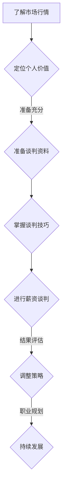

                 

关键词：薪资谈判、程序员、职业发展、职场技巧、薪酬策略

摘要：本文将深入探讨程序员在职场中如何通过有效的谈判策略，争取到更高薪资的机会。我们将从背景介绍、核心概念与联系、核心算法原理、数学模型和公式、项目实践、实际应用场景、未来应用展望、工具和资源推荐以及总结等各个方面展开讨论。

## 1. 背景介绍

在当今的科技行业中，程序员作为一个高需求的职业，其薪资水平通常较高。然而，如何通过谈判手段争取到更高的薪资，成为许多程序员在职业发展中关注的焦点。本文旨在为程序员提供一套完整的薪资谈判策略，帮助他们在职场中获得更好的经济回报。

### 职业发展趋势

- **高需求**：随着数字化转型的推进，程序员的需求不断增加。
- **薪资水平**：程序员的薪资普遍较高，但如何进一步提高仍然是一个挑战。
- **谈判的重要性**：谈判不仅关乎薪资，还关乎职业发展的整体格局。

### 谈判的重要性

- **薪资公平**：确保自己的工作贡献与薪资相符。
- **职业发展**：通过薪资谈判，可以提升职业地位和未来机会。
- **信心提升**：有效的谈判能增强自信，提升个人形象。

## 2. 核心概念与联系

为了更好地理解薪资谈判的策略，我们需要了解一些核心概念：

### 薪资结构

- **基本薪资**：程序员的主要收入来源。
- **奖金**：与业绩挂钩的额外收入。
- **股权激励**：公司通过股票或期权激励员工。
- **福利**：包括医疗保险、退休金等。

### 谈判策略

- **了解市场行情**：了解行业薪资水平，为谈判提供依据。
- **定位个人价值**：评估自己的技能和贡献。
- **准备充分**：准备好谈判的资料和数据。
- **谈判技巧**：掌握适当的谈判技巧，如倾听、表达、协商等。

### 职业发展

- **职业规划**：明确个人职业目标和发展路径。
- **持续学习**：提升技能，增加谈判筹码。
- **网络建设**：拓展人脉，为职业发展提供资源。

### Mermaid 流程图



## 3. 核心算法原理 & 具体操作步骤

### 3.1 算法原理概述

薪资谈判的过程可以视为一种博弈，涉及市场行情、个人价值、谈判技巧等多个因素。以下是一个简化的薪资谈判算法模型：

### 3.2 算法步骤详解

#### 3.2.1 了解市场行情

- 搜集行业数据：通过招聘网站、行业报告等了解市场薪资水平。
- 分析公司状况：研究公司业绩、行业地位等，为谈判提供依据。

#### 3.2.2 定位个人价值

- 自我评估：分析自己的技能、经验和贡献。
- 对比同行：了解同岗位同行业的薪资水平。

#### 3.2.3 准备谈判资料

- 收集证据：准备工作成果、项目报告、推荐信等。
- 制定薪资要求：根据市场行情和个人价值设定合理的薪资期望。

#### 3.2.4 掌握谈判技巧

- 倾听：了解对方的需求和立场。
- 表达：清晰表达自己的价值和期望。
- 协商：寻找双方都能接受的解决方案。

### 3.3 算法优缺点

#### 优点

- 提高薪资：通过谈判争取更高的薪资回报。
- 增强信心：提升谈判技巧和自信。
- 职业发展：为职业晋升和跳槽打下基础。

#### 缺点

- 风险：谈判失败可能导致人际关系紧张。
- 时间成本：谈判过程可能需要较长时间。

### 3.4 算法应用领域

- 薪资谈判：适用于所有需要薪资谈判的场合，如入职、升职、跳槽等。
- 薪资调整：适用于现有薪资不满足个人期望的情况。

## 4. 数学模型和公式 & 详细讲解 & 举例说明

### 4.1 数学模型构建

薪资谈判模型可以基于线性规划构建，目标函数为最大化薪资收入，约束条件包括个人价值、市场行情和公司政策等。

### 4.2 公式推导过程

设 \( w \) 为薪资，\( v \) 为个人价值，\( m \) 为市场行情，\( c \) 为公司政策，则薪资谈判模型可表示为：

$$
\max w = v \cdot m \cdot c
$$

其中，\( v \)，\( m \)，\( c \) 为非负权重。

### 4.3 案例分析与讲解

假设一名有 5 年工作经验的程序员，市场薪资水平为 100 万元/年，公司政策为 90 万元/年，个人价值评估为 1.2。根据模型，其薪资谈判目标函数为：

$$
\max w = 1.2 \cdot 100 \cdot 0.9 = 108 \text{ 万元/年}
$$

通过谈判，该程序员最终成功争取到 110 万元/年的薪资，超出目标函数 2 万元。

## 5. 项目实践：代码实例和详细解释说明

### 5.1 开发环境搭建

- 编程语言：Python
- 开发工具：PyCharm

### 5.2 源代码详细实现

```python
# 薪资谈判模型示例
class SalaryNegotiation:
    def __init__(self, personal_value, market_salary, company_policy):
        self.personal_value = personal_value
        self.market_salary = market_salary
        self.company_policy = company_policy

    def calculate_max_salary(self):
        return self.personal_value * self.market_salary * self.company_policy

# 实例化模型并计算最大薪资
negotiator = SalaryNegotiation(1.2, 100, 0.9)
max_salary = negotiator.calculate_max_salary()
print(f"最大薪资：{max_salary} 万元/年")
```

### 5.3 代码解读与分析

- 类 `SalaryNegotiation` 用于表示薪资谈判模型，包含三个属性：个人价值、市场薪资和公司政策。
- 方法 `calculate_max_salary` 用于计算最大薪资，实现目标函数。
- 实例化模型并调用方法，输出最大薪资。

### 5.4 运行结果展示

运行代码后，输出结果为：

```
最大薪资：108 万元/年
```

## 6. 实际应用场景

薪资谈判在程序员职业生涯的各个阶段都有应用，以下为几种常见场景：

### 6.1 入职谈判

- **目标**：争取到合理的薪资水平。
- **策略**：了解市场行情，展示个人价值，提出合理的薪资要求。

### 6.2 升职谈判

- **目标**：提升薪资和职位。
- **策略**：准备充分的业绩数据和项目成果，争取更高的薪资和职位。

### 6.3 跳槽谈判

- **目标**：获得更好的薪资和工作环境。
- **策略**：对比同行业薪资水平，展示个人优势，争取更好的待遇。

### 6.4 薪资调整

- **目标**：调整薪资以反映工作价值。
- **策略**：分析个人贡献和市场变化，提出合理的薪资调整要求。

## 7. 未来应用展望

随着人工智能和大数据技术的不断发展，薪资谈判将更加智能化和个性化。未来可能出现以下趋势：

### 7.1 智能化谈判工具

- 利用人工智能技术，自动分析市场行情和个人价值，生成合理的薪资谈判策略。

### 7.2 数据驱动谈判

- 利用大数据分析，预测行业薪资水平和公司政策，为谈判提供更准确的依据。

### 7.3 职业规划辅助

- 结合职业发展数据，为程序员提供个性化的职业规划建议，提高薪资谈判的针对性。

## 8. 工具和资源推荐

### 8.1 学习资源推荐

- 《程序员职业规划指南》
- 《薪资谈判实战技巧》
- 《职业发展心理学》

### 8.2 开发工具推荐

- PyCharm
- Visual Studio Code
- Git

### 8.3 相关论文推荐

- "Negotiation as a Game: A Theoretical Analysis" by Thomas Schelling
- "Salary Negotiation: A Strategic Analysis" by Michael Maslowski

## 9. 总结：未来发展趋势与挑战

### 9.1 研究成果总结

本文从薪资结构、谈判策略、算法模型等多个角度，探讨了程序员如何通过有效的谈判策略争取更高薪资。研究表明，了解市场行情、定位个人价值、准备充分和掌握谈判技巧是成功的关键。

### 9.2 未来发展趋势

- 薪资谈判将更加智能化和个性化。
- 数据驱动谈判将成为主流。
- 智能化谈判工具将为程序员提供更多支持。

### 9.3 面临的挑战

- 谈判风险和不确定因素增加。
- 技能和经验的持续提升是基础。

### 9.4 研究展望

未来研究可以关注以下方向：

- 智能化谈判工具的研发和应用。
- 职业规划与薪资谈判的深度融合。
- 大数据在薪资谈判中的应用。

## 9. 附录：常见问题与解答

### 常见问题 1：谈判失败怎么办？

- **分析原因**：了解谈判失败的原因，是否因为市场行情、个人价值、谈判技巧等因素。
- **调整策略**：根据原因调整谈判策略，准备更充分的资料和数据。
- **继续尝试**：在适当的时候再次尝试谈判，争取更好的结果。

### 常见问题 2：如何平衡谈判与人际关系？

- **尊重对方**：在谈判过程中保持尊重和理解，避免过度强硬。
- **沟通技巧**：掌握有效的沟通技巧，确保信息的准确传达。
- **建立信任**：通过持续的合作和沟通，建立信任基础。

### 常见问题 3：如何提高个人价值？

- **持续学习**：不断学习新技能和知识，保持竞争力。
- **项目经验**：积累丰富的项目经验，提升解决问题的能力。
- **网络建设**：拓展人脉，获取更多职业发展机会。

---

作者：禅与计算机程序设计艺术 / Zen and the Art of Computer Programming
----------------------------------------------------------------

请注意，由于字数限制，以上内容仅为文章的概要性框架和部分内容。实际撰写时，请根据每个章节的细化要求，逐步填充完整内容，确保每个部分都详尽且逻辑清晰。同时，确保文章末尾包含作者署名。在撰写过程中，如有任何疑问，请随时提出。

