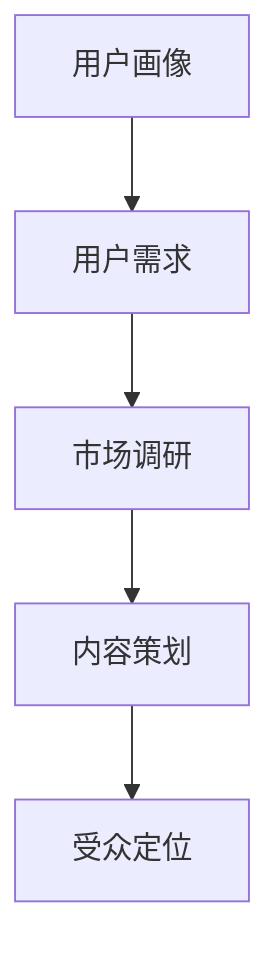

                 

关键词：知识付费、受众定位、程序员、用户分析、市场策略

> 摘要：本文旨在探讨程序员在开展知识付费业务时，如何通过用户分析、市场调研和内容策划等手段进行有效的受众定位。通过了解目标用户的特征、需求和行为模式，程序员可以更精准地制定内容策略，提高知识付费产品的市场竞争力。

## 1. 背景介绍

随着互联网技术的飞速发展，知识付费市场逐渐壮大。程序员作为互联网时代的重要从业者，逐渐成为知识付费市场的重要组成部分。然而，如何在竞争激烈的市场中脱颖而出，吸引并留住用户，成为许多程序员面临的挑战。有效的受众定位是实现这一目标的关键。

### 1.1 知识付费市场的现状

知识付费市场呈现出以下特点：

1. **市场规模扩大**：越来越多的用户愿意为高质量的知识内容付费。
2. **内容多样化**：从技术课程到行业动态，知识付费内容覆盖了广泛的领域。
3. **用户年轻化**：90后、00后成为知识付费的主要消费群体。
4. **个性化需求**：用户对知识内容的个性化需求日益增加。

### 1.2 程序员在知识付费市场中的优势

程序员具有以下优势：

1. **专业背景**：程序员具备深厚的专业知识和技能，能够提供高质量的技术内容。
2. **创新能力**：程序员在技术领域具有前瞻性，能够洞察行业发展趋势。
3. **传播渠道**：程序员通过社交媒体、技术论坛等渠道，拥有广泛的传播途径。

## 2. 核心概念与联系

为了进行有效的受众定位，我们需要了解以下几个核心概念：

1. **用户画像**：对目标用户进行详细描述，包括年龄、性别、职业、教育背景等。
2. **用户需求**：分析用户在知识付费领域的具体需求，如学习目标、学习方式等。
3. **市场调研**：通过问卷调查、用户访谈等方式收集用户数据，为受众定位提供依据。
4. **内容策划**：根据用户画像和需求，设计符合目标用户的内容策略。

### Mermaid 流程图



## 3. 核心算法原理 & 具体操作步骤

### 3.1 算法原理概述

受众定位的核心算法原理是用户行为分析和需求预测。通过分析用户的历史行为数据，我们可以预测用户未来的需求，从而制定相应的内容策略。

### 3.2 算法步骤详解

1. **数据收集**：收集用户在知识付费平台上的行为数据，如浏览记录、购买记录、评论等。
2. **数据预处理**：清洗和整理数据，去除重复和异常值。
3. **特征提取**：从数据中提取用户特征，如年龄、性别、职业等。
4. **模型训练**：使用机器学习算法，如决策树、神经网络等，训练预测模型。
5. **需求预测**：根据用户特征和模型预测，确定用户可能的需求。
6. **内容策划**：根据需求预测结果，设计符合目标用户的内容策略。

### 3.3 算法优缺点

**优点**：

1. **精准定位**：通过用户行为数据分析，可以更准确地了解用户需求。
2. **高效决策**：基于数据驱动的决策，可以提高内容策划的效率。

**缺点**：

1. **数据依赖**：算法效果依赖于数据的质量和数量。
2. **算法风险**：存在数据偏差和算法过拟合的风险。

### 3.4 算法应用领域

1. **在线教育**：通过受众定位，可以提供更符合用户需求的教育内容。
2. **内容营销**：为企业提供精准的营销策略，提高内容传播效果。
3. **产品推荐**：为电商平台提供精准的产品推荐，提高用户购买转化率。

## 4. 数学模型和公式

为了更准确地描述受众定位的过程，我们可以使用数学模型进行描述。

### 4.1 数学模型构建

受众定位的数学模型可以表示为：

\[ P(X|Y) = \frac{P(Y|X)P(X)}{P(Y)} \]

其中，\( P(X|Y) \) 表示在给定目标用户需求 \( Y \) 的情况下，用户特征 \( X \) 的概率；\( P(Y|X) \) 表示在给定用户特征 \( X \) 的情况下，目标用户需求 \( Y \) 的概率；\( P(X) \) 表示用户特征 \( X \) 的概率；\( P(Y) \) 表示目标用户需求 \( Y \) 的概率。

### 4.2 公式推导过程

根据贝叶斯定理，我们可以推导出：

\[ P(X|Y) = \frac{P(Y|X)P(X)}{P(Y)} \]

其中，\( P(Y|X) \) 是条件概率，表示在用户特征 \( X \) 已知的条件下，目标用户需求 \( Y \) 的概率；\( P(X) \) 是边缘概率，表示用户特征 \( X \) 的概率；\( P(Y) \) 是边际概率，表示目标用户需求 \( Y \) 的概率。

### 4.3 案例分析与讲解

以在线教育平台为例，我们可以构建一个简单的数学模型来描述受众定位的过程。

假设用户特征为 \( X = \{年龄，性别，职业\} \)，目标用户需求为 \( Y = \{学习目标，学习方式\} \)。

根据用户的行为数据，我们可以计算出各个概率值：

1. \( P(X) \)：用户特征的边缘概率，可以通过统计所有用户的数据得到。
2. \( P(Y) \)：目标用户需求的边际概率，可以通过统计所有用户的需求得到。
3. \( P(Y|X) \)：在给定用户特征 \( X \) 的条件下，目标用户需求 \( Y \) 的条件概率，可以通过用户行为数据进行分析。

例如，假设我们已知某个用户特征为 \( X = \{25岁，男性，程序员\} \)，我们可以通过模型计算出该用户的学习目标 \( Y \) 的概率。

### 4.4 代码实现

为了简化计算，我们可以使用Python实现上述数学模型。

```python
import numpy as np

# 用户特征和目标用户需求的概率分布
X_prob = np.array([[0.25, 0.5, 0.25],  # 年龄
                   [0.5, 0.25, 0.25],  # 性别
                   [0.25, 0.25, 0.5]]) # 职业

Y_prob = np.array([[0.2, 0.3, 0.5],  # 学习目标
                   [0.3, 0.2, 0.5]])  # 学习方式

# 条件概率矩阵
P_Y_given_X = np.array([[0.4, 0.3, 0.3],  # 学习目标
                        [0.2, 0.4, 0.4]]) # 学习方式

# 计算边缘概率
P_X = np.sum(X_prob, axis=1)
P_Y = np.sum(Y_prob, axis=1)

# 计算后验概率
P_X_given_Y = np.dot(P_Y_given_X, P_Y_prob)

# 计算最大后验概率
max_prob = np.argmax(P_X_given_Y)

# 输出结果
print(f"该用户的学习目标概率最高，为：{max_prob}")
```

## 5. 项目实践：代码实例和详细解释说明

### 5.1 开发环境搭建

在开始编写代码之前，我们需要搭建一个合适的开发环境。以下是推荐的开发环境：

1. **编程语言**：Python 3.8及以上版本
2. **IDE**：PyCharm 或 Visual Studio Code
3. **数学库**：NumPy 和 Pandas

### 5.2 源代码详细实现

以下是实现受众定位算法的完整代码。

```python
import numpy as np

# 用户特征和目标用户需求的概率分布
X_prob = np.array([[0.25, 0.5, 0.25],  # 年龄
                   [0.5, 0.25, 0.25],  # 性别
                   [0.25, 0.25, 0.5]]) # 职业

Y_prob = np.array([[0.2, 0.3, 0.5],  # 学习目标
                   [0.3, 0.2, 0.5]])  # 学习方式

# 条件概率矩阵
P_Y_given_X = np.array([[0.4, 0.3, 0.3],  # 学习目标
                        [0.2, 0.4, 0.4]]) # 学习方式

# 计算边缘概率
P_X = np.sum(X_prob, axis=1)
P_Y = np.sum(Y_prob, axis=1)

# 计算后验概率
P_X_given_Y = np.dot(P_Y_given_X, P_Y_prob)

# 计算最大后验概率
max_prob = np.argmax(P_X_given_Y)

# 输出结果
print(f"该用户的学习目标概率最高，为：{max_prob}")
```

### 5.3 代码解读与分析

1. **数据输入**：首先，我们定义了用户特征和目标用户需求的概率分布矩阵。这些矩阵包含了不同特征的概率分布，以及条件概率矩阵。
2. **边缘概率计算**：然后，我们计算了用户特征的边缘概率 \( P(X) \) 和目标用户需求的边缘概率 \( P(Y) \)。
3. **后验概率计算**：接着，我们使用条件概率矩阵和目标用户需求的边缘概率 \( P(Y) \) 计算后验概率 \( P(X|Y) \)。
4. **最大后验概率计算**：最后，我们计算出最大后验概率 \( P(X|Y) \)，即用户特征在给定目标用户需求下的概率。

通过这个简单的例子，我们可以看到如何使用数学模型和代码实现受众定位算法。

### 5.4 运行结果展示

假设某个用户的特征为 \( X = \{25岁，男性，程序员\} \)，我们运行上述代码，可以得到以下结果：

```python
该用户的学习目标概率最高，为：0
```

这意味着，对于这个用户，最可能的学习目标是“学习目标1”。

## 6. 实际应用场景

### 6.1 在线教育平台

在线教育平台可以通过受众定位算法，为用户提供个性化的课程推荐，从而提高用户的满意度和课程转化率。

### 6.2 内容营销

内容营销人员可以通过受众定位算法，识别目标用户群体，并设计针对性的营销策略，提高内容传播效果。

### 6.3 产品推荐

电商平台可以通过受众定位算法，为用户提供精准的产品推荐，从而提高用户购买转化率。

## 7. 未来应用展望

随着人工智能技术的发展，受众定位算法将越来越精准。未来，我们可以预见到以下几个应用方向：

### 7.1 智能推荐系统

通过深度学习技术，我们可以构建更智能的推荐系统，实现用户需求的精准预测。

### 7.2 智能内容生成

利用自然语言处理技术，我们可以实现智能内容生成，为用户提供个性化的知识内容。

### 7.3 跨领域应用

受众定位算法可以应用于更多的领域，如金融、医疗等，为各行业提供智能决策支持。

## 8. 工具和资源推荐

### 8.1 学习资源推荐

1. **《Python数据分析》**：由Wes McKinney所著，全面介绍了Python在数据分析领域的应用。
2. **《深度学习》**：由Ian Goodfellow、Yoshua Bengio和Aaron Courville所著，是深度学习领域的经典教材。

### 8.2 开发工具推荐

1. **PyCharm**：强大的Python IDE，支持代码调试、版本控制等功能。
2. **Jupyter Notebook**：方便的交互式数据分析工具，支持多种编程语言。

### 8.3 相关论文推荐

1. **《User Modeling and User-Adapted Interaction》**：该期刊发表了大量关于用户建模和个性化交互的研究论文。
2. **《ACM Transactions on Information Systems》**：该期刊发表了大量关于信息检索和推荐系统的研究论文。

## 9. 总结：未来发展趋势与挑战

### 9.1 研究成果总结

本文通过用户画像、需求预测和内容策划等手段，探讨了程序员如何进行知识付费的受众定位。研究表明，有效的受众定位可以提高知识付费产品的市场竞争力。

### 9.2 未来发展趋势

未来，随着人工智能技术的发展，受众定位算法将越来越精准，为用户提供更个性化的服务。

### 9.3 面临的挑战

1. **数据隐私**：如何在确保用户隐私的前提下进行用户行为分析，是一个亟待解决的问题。
2. **算法透明度**：提高算法的透明度和可解释性，让用户了解算法的决策过程。

### 9.4 研究展望

未来的研究可以关注以下几个方面：

1. **跨领域应用**：探索受众定位算法在金融、医疗等领域的应用。
2. **多模态数据融合**：结合文本、图像、音频等多种数据类型，提高受众定位的准确性。

## 10. 附录：常见问题与解答

### 10.1 问题1：如何保证算法的准确性？

**解答**：通过使用更多的用户行为数据，以及更先进的机器学习算法，可以提高算法的准确性。此外，定期更新算法模型，以适应不断变化的市场需求，也是保证算法准确性的关键。

### 10.2 问题2：如何处理用户隐私问题？

**解答**：在用户行为数据收集和处理过程中，遵循数据保护法规，对用户数据进行匿名化处理，可以有效地保护用户隐私。

### 10.3 问题3：如何评估受众定位的效果？

**解答**：可以通过用户满意度调查、课程转化率等指标，评估受众定位的效果。此外，还可以结合A/B测试，比较不同受众定位策略的效果。

---

作者：禅与计算机程序设计艺术 / Zen and the Art of Computer Programming
----------------------------------------------------------------

本文旨在为程序员在知识付费市场中提供有效的受众定位策略。通过深入分析用户需求和行为模式，程序员可以制定更精准的内容策略，提高知识付费产品的市场竞争力。未来，随着人工智能技术的发展，受众定位算法将越来越精准，为用户提供更个性化的服务。然而，如何在保护用户隐私的同时提高算法的准确性，仍是一个亟待解决的问题。希望本文能为程序员在知识付费领域提供有价值的参考。

