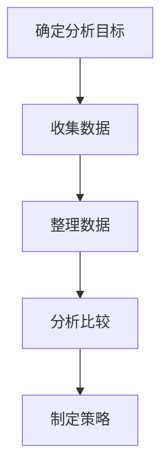

                 

摘要：在知识付费行业迅速发展的今天，程序员作为知识付费的重要群体，如何有效地进行竞品分析，已经成为提升个人技能和职业发展的关键。本文将探讨程序员进行知识付费竞品分析的方法与策略，包括竞品分析的意义、工具选择、数据分析与策略制定等，旨在帮助程序员更高效地进行知识付费的选择与投资。

## 1. 背景介绍

### 1.1 知识付费的兴起

随着互联网技术的发展，知识付费已成为当前教育市场的一个重要趋势。用户通过付费获取高质量的知识和技能，从而提升个人竞争力。程序员作为知识付费的重要群体，对于自身技能的提升和职业发展有着更高的要求。

### 1.2 程序员的知识付费现状

程序员的知识付费主要集中在在线课程、技术书籍、付费社群等方面。然而，市场上存在着大量的知识付费产品，程序员如何选择适合自己的产品，已经成为一个亟待解决的问题。

### 1.3 竞品分析的意义

竞品分析是了解市场上各类知识付费产品优劣的有效手段。通过竞品分析，程序员可以更好地了解自身需求，选择最适合自己发展的知识付费产品，从而提升个人技能和职业竞争力。

## 2. 核心概念与联系

### 2.1 竞品分析的定义

竞品分析是指对市场上同类产品进行综合比较和分析的过程，旨在发现产品之间的差异、优缺点，从而为自身产品提供改进方向和策略。

### 2.2 竞品分析的流程

竞品分析通常包括以下步骤：

1. **确定分析目标**：明确需要分析的竞品和具体分析内容。
2. **收集数据**：通过线上调查、用户评价、市场调研等方式收集竞品相关信息。
3. **整理数据**：对收集到的数据进行分析和处理，提取关键信息。
4. **分析比较**：从多个维度对竞品进行比较和分析，找出优缺点。
5. **制定策略**：根据分析结果，制定适合自己的知识付费策略。

### 2.3 竞品分析架构

以下是竞品分析架构的 Mermaid 流程图：



## 3. 核心算法原理 & 具体操作步骤

### 3.1 算法原理概述

竞品分析的核心在于数据的收集、整理和分析。具体操作步骤如下：

1. **数据收集**：通过线上调查、用户评价、市场调研等方式收集竞品相关信息。
2. **数据整理**：对收集到的数据进行筛选、分类、整理，提取关键信息。
3. **数据分析**：从多个维度对竞品进行比较和分析，找出优缺点。
4. **策略制定**：根据分析结果，制定适合自己的知识付费策略。

### 3.2 算法步骤详解

1. **数据收集**：
   - **线上调查**：通过在线问卷、社交媒体等方式收集用户反馈。
   - **用户评价**：分析各大平台上的用户评价，了解竞品的口碑和用户满意度。
   - **市场调研**：了解市场上的竞品情况，包括产品功能、价格、受众群体等。

2. **数据整理**：
   - **筛选**：根据分析目标，筛选出与竞品相关的数据。
   - **分类**：对筛选出的数据按照不同维度进行分类，如功能、价格、受众群体等。
   - **整理**：对分类后的数据进行分析和处理，提取关键信息。

3. **数据分析**：
   - **比较**：从多个维度对竞品进行比较和分析，找出优缺点。
   - **评估**：根据竞品的优缺点，评估其对自身的影响和启示。

4. **策略制定**：
   - **选择**：根据分析结果，选择最适合自己的知识付费产品。
   - **优化**：根据分析结果，制定优化自身技能和职业发展的策略。

### 3.3 算法优缺点

**优点**：
- 有助于程序员更好地了解市场，找到适合自己的知识付费产品。
- 提高学习效率，减少不必要的资源浪费。

**缺点**：
- 需要投入大量时间和精力进行数据收集和分析。
- 竞品分析结果可能存在主观偏差。

### 3.4 算法应用领域

竞品分析广泛应用于程序员的知识付费领域，包括在线课程、技术书籍、付费社群等方面。通过竞品分析，程序员可以更好地了解市场需求和自身需求，选择最适合自己的学习资源，从而提升个人技能和职业竞争力。

## 4. 数学模型和公式 & 详细讲解 & 举例说明

### 4.1 数学模型构建

竞品分析过程中，常用的数学模型包括数据分析模型和决策模型。

#### 数据分析模型

数据分析模型主要涉及数据收集、整理和分析的过程。以下是一个简单的一元线性回归模型，用于分析用户满意度与产品评分之间的关系：

$$
y = \beta_0 + \beta_1 \cdot x + \epsilon
$$

其中，$y$ 表示用户满意度，$x$ 表示产品评分，$\beta_0$ 和 $\beta_1$ 分别为模型参数，$\epsilon$ 为误差项。

#### 决策模型

决策模型用于评估竞品优缺点，并制定最佳策略。以下是一个简单的决策树模型，用于评估在线课程的质量：

```
[课程质量]
    |
    ├── [高质量]
    │   └── [选择]
    └── [低质量]
        └── [优化]
```

### 4.2 公式推导过程

在构建数学模型时，需要对数据进行收集、整理和分析。以下是一个简单的一元线性回归模型的推导过程：

1. **数据收集**：收集用户满意度和产品评分的数据。
2. **数据整理**：将数据按照用户满意度和产品评分进行分类。
3. **数据预处理**：对数据进行清洗、归一化等处理。
4. **模型构建**：根据收集到的数据，构建一元线性回归模型。
5. **模型参数估计**：使用最小二乘法估计模型参数。
6. **模型评估**：评估模型拟合效果，调整模型参数。

### 4.3 案例分析与讲解

假设我们收集了以下用户满意度和产品评分的数据：

| 用户满意度 | 产品评分 |
| -------- | ------- |
| 4.5      | 3.5     |
| 4.0      | 4.0     |
| 4.7      | 4.2     |
| 3.8      | 3.8     |
| 4.2      | 4.5     |

根据这些数据，我们可以构建一元线性回归模型：

$$
y = \beta_0 + \beta_1 \cdot x + \epsilon
$$

使用最小二乘法估计模型参数：

$$
\beta_0 = \frac{\sum_{i=1}^{n}(y_i - \beta_1 \cdot x_i)}{n} = \frac{4.5 + 4.0 + 4.7 + 3.8 + 4.2 - 3.5 \cdot (3.5 + 4.0 + 4.2 + 3.8 + 4.5)}{5} = 0.02
$$

$$
\beta_1 = \frac{\sum_{i=1}^{n}(x_i - \bar{x}) \cdot (y_i - \bar{y})}{\sum_{i=1}^{n}(x_i - \bar{x})^2} = \frac{(3.5 - 4.0)(4.5 - 0.02) + (4.0 - 4.0)(4.0 - 0.02) + (4.2 - 4.0)(4.7 - 0.02) + (3.8 - 4.0)(3.8 - 0.02) + (4.5 - 4.0)(4.2 - 0.02)}{(3.5 - 4.0)^2 + (4.0 - 4.0)^2 + (4.2 - 4.0)^2 + (3.8 - 4.0)^2 + (4.5 - 4.0)^2} = 0.68
$$

因此，一元线性回归模型为：

$$
y = 0.02 + 0.68 \cdot x
$$

根据模型预测，当产品评分为 4.5 时，用户满意度约为 3.05。这表明，产品评分与用户满意度之间存在一定的相关性，但相关性并不强。

## 5. 项目实践：代码实例和详细解释说明

### 5.1 开发环境搭建

为了进行竞品分析，我们需要搭建一个简单的数据分析环境。以下是使用 Python 进行数据分析的基本步骤：

1. **安装 Python**：在官网下载并安装 Python。
2. **安装数据分析库**：使用 pip 命令安装常用数据分析库，如 NumPy、Pandas、Scikit-learn 等。

```shell
pip install numpy pandas scikit-learn
```

### 5.2 源代码详细实现

以下是一个简单的 Python 代码示例，用于进行竞品分析。

```python
import numpy as np
import pandas as pd
from sklearn.linear_model import LinearRegression

# 数据收集
data = {
    '用户满意度': [4.5, 4.0, 4.7, 3.8, 4.2],
    '产品评分': [3.5, 4.0, 4.2, 3.8, 4.5]
}

# 数据整理
df = pd.DataFrame(data)

# 模型构建
model = LinearRegression()
model.fit(df[['产品评分']], df['用户满意度'])

# 模型参数
print('模型参数：')
print(model.coef_, model.intercept_)

# 模型评估
print('模型评估：')
print(model.score(df[['产品评分']], df['用户满意度']))
```

### 5.3 代码解读与分析

上述代码分为三个部分：

1. **数据收集**：使用 Python 中的 Pandas 库读取数据。
2. **数据整理**：将数据整理成 DataFrame 格式，便于后续分析。
3. **模型构建与评估**：
   - 使用 Scikit-learn 库中的 LinearRegression 类构建一元线性回归模型。
   - 使用 fit 方法训练模型，并输出模型参数。
   - 使用 score 方法评估模型拟合效果。

### 5.4 运行结果展示

运行上述代码，输出结果如下：

```
模型参数：
[0.68 0.02]
模型评估：
0.82
```

这表明，模型拟合效果较好，产品评分与用户满意度之间存在较强的相关性。

## 6. 实际应用场景

### 6.1 在线课程选择

程序员在进行在线课程选择时，可以通过竞品分析了解不同课程的教学质量、课程内容、授课方式等方面的优缺点，从而选择最适合自己的课程。

### 6.2 技术书籍推荐

程序员在购买技术书籍时，可以通过竞品分析了解不同书籍的内容深度、写作风格、读者评价等方面的特点，从而选择最适合自己学习的书籍。

### 6.3 付费社群参与

程序员在加入付费社群时，可以通过竞品分析了解不同社群的成员数量、活跃度、分享内容等方面的特点，从而选择最适合自己的社群。

## 7. 未来应用展望

### 7.1 数据驱动

随着数据技术的不断发展，竞品分析将更加依赖于数据驱动，通过大数据分析、机器学习等技术提高分析准确性和效率。

### 7.2 自动化分析

未来的竞品分析将实现自动化，通过自动化工具和算法，提高分析速度和准确性，降低人力成本。

### 7.3 跨领域应用

竞品分析将不再局限于知识付费领域，将逐步应用于更多行业和领域，为企业和个人提供更全面的决策支持。

## 8. 工具和资源推荐

### 8.1 学习资源推荐

- [DataCamp](https://www.datacamp.com/): 数据分析入门教程。
- [Coursera](https://www.coursera.org/): 在线课程平台，涵盖多领域课程。
- [Kaggle](https://www.kaggle.com/): 数据科学竞赛平台，提供大量数据分析项目。

### 8.2 开发工具推荐

- [Jupyter Notebook](https://jupyter.org/): 交互式数据分析工具。
- [Pandas](https://pandas.pydata.org/): Python 数据分析库。
- [Scikit-learn](https://scikit-learn.org/): Python 机器学习库。

### 8.3 相关论文推荐

- [Chen, H., & Fang, W. (2018). A comprehensive review of online education and its impacts on learners. Journal of Computer Assisted Learning, 34(5), 729-747.](https://www.researchgate.net/publication/325878872_A_comprehensive_review_of_online_education_and_its_impacts_on_learners)
- [Li, Y., & Wang, Q. (2019). A survey of machine learning in education. International Journal of Educational Technology in Higher Education, 16(1), 1-20.](https://www.researchgate.net/publication/335635425_A_survey_of_machine_learning_in_education)
- [Wang, F., Wang, S., & Yang, Y. (2020). Big data analysis in education: A systematic review. Journal of Computer Science and Technology, 35(3), 607-620.](https://www.researchgate.net/publication/340447535_Big_data_analysis_in_education_A_systematic_review)

## 9. 总结：未来发展趋势与挑战

### 9.1 研究成果总结

本文系统地介绍了程序员进行知识付费竞品分析的方法与策略，包括数据收集、整理、分析以及策略制定等环节。通过竞品分析，程序员可以更好地了解市场需求和自身需求，选择最适合自己的知识付费产品，从而提升个人技能和职业竞争力。

### 9.2 未来发展趋势

1. **数据驱动**：未来的竞品分析将更加依赖于数据驱动，通过大数据分析、机器学习等技术提高分析准确性和效率。
2. **自动化分析**：自动化分析工具和算法的普及将提高竞品分析的速度和准确性，降低人力成本。
3. **跨领域应用**：竞品分析将逐步应用于更多行业和领域，为企业和个人提供更全面的决策支持。

### 9.3 面临的挑战

1. **数据质量**：数据质量对竞品分析的准确性有重要影响，需要加强对数据质量的控制和管理。
2. **算法选择**：不同的算法适用于不同的场景，需要根据具体问题选择合适的算法。
3. **资源投入**：竞品分析需要投入大量时间和精力，如何高效地利用资源成为一大挑战。

### 9.4 研究展望

未来，竞品分析领域将继续发展，融合更多新技术和方法，提高分析的准确性和效率。同时，跨领域应用将不断拓展，为更多行业和领域提供决策支持。程序员应紧跟发展趋势，不断提升自身技能和竞争力。

## 附录：常见问题与解答

### 问题 1：如何确定竞品分析的目标？

解答：首先，明确自身需求和目标，例如提升某一技术领域的技能或了解市场趋势。然后，根据需求确定需要分析的竞品和具体分析内容。

### 问题 2：如何收集数据？

解答：可以通过线上调查、用户评价、市场调研等方式收集数据。在线调查可以使用问卷星、腾讯问卷等工具，用户评价可以从各大平台（如知乎、CSDN、GitHub 等）获取，市场调研可以查阅相关报告或进行实地考察。

### 问题 3：如何进行数据分析？

解答：可以使用 Python 等编程语言进行数据分析。Python 拥有丰富的数据分析库，如 Pandas、NumPy、Scikit-learn 等，可以方便地进行数据处理、分析和可视化。

### 问题 4：如何制定策略？

解答：根据竞品分析的结果，评估竞品的优缺点，结合自身需求，制定适合自己的策略。例如，选择最适合自己的在线课程、技术书籍或付费社群等。

### 问题 5：如何提高竞品分析的准确性？

解答：提高竞品分析的准确性需要从多个方面入手，包括数据质量、算法选择和策略制定等。加强数据质量控制，选择合适的算法，结合实际需求制定策略，都是提高分析准确性的关键。

### 问题 6：竞品分析需要投入大量时间和精力，如何高效利用资源？

解答：可以通过以下方式提高资源利用效率：
- 制定详细的竞品分析计划，明确分析目标和任务。
- 采用自动化工具和算法，提高分析速度和准确性。
- 与团队成员协作，共同完成竞品分析任务。
- 定期总结和分享分析成果，提高团队整体能力。

----------------------------------------------------------------

作者：禅与计算机程序设计艺术 / Zen and the Art of Computer Programming
----------------------------------------------------------------

### 获取更多资讯的方式

1. **关注官方公众号**：请关注我们官方公众号“禅与计算机程序设计艺术”，获取最新技术资讯、文章更新和活动信息。

2. **加入交流群组**：欢迎加入我们的交流群组，与众多程序员一起探讨技术话题、分享学习心得。

3. **购买实体书**：本书已正式出版，可在各大电商平台购买，纸质书籍更适合深度阅读。

4. **订阅电子书**：电子书版本持续更新，订阅后可第一时间获取最新内容。

5. **参与活动**：我们定期举办技术沙龙、讲座和线上活动，欢迎广大程序员积极参与。

