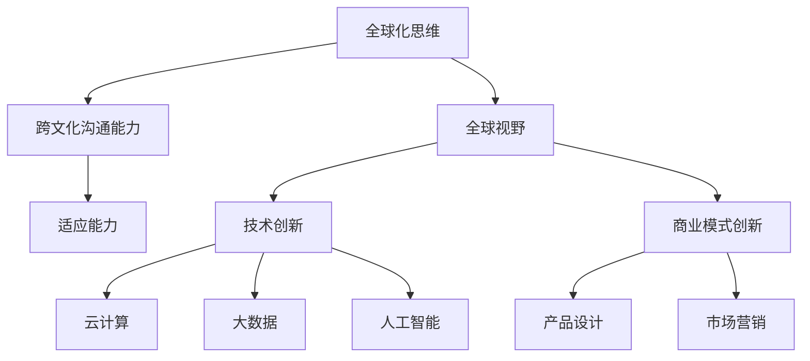

                 

## 1. 背景介绍

在当今全球化的大背景下，新兴市场的崛起正成为世界经济发展的重要推动力。这些市场不仅拥有巨大的潜力，也为程序员的职业发展提供了广阔的舞台。然而，面对这些充满机遇的市场，程序员应该如何规划自己的职业路径，抓住机遇实现自我价值呢？

本文将围绕新兴市场的创业机遇，探讨程序员在全球化视野下如何进行职业规划，以及如何利用自己的技能优势在新兴市场中创业。文章将分为以下几个部分：

- **背景介绍**：介绍全球新兴市场的发展现状和趋势。
- **核心概念与联系**：探讨程序员在全球化背景下的核心技能和知识体系。
- **核心算法原理 & 具体操作步骤**：分析程序员在新兴市场中可能面临的技术挑战，并介绍相应的解决方案。
- **数学模型和公式 & 详细讲解 & 举例说明**：通过数学模型和公式来解释新兴市场的创业策略和成功案例。
- **项目实践：代码实例和详细解释说明**：提供实际项目案例，展示程序员在新兴市场中的创业实践。
- **实际应用场景**：分析程序员在新兴市场中创业的实际应用案例，探讨其成功经验和挑战。
- **工具和资源推荐**：介绍有助于程序员在新兴市场中创业的学习资源、开发工具和文献。
- **总结：未来发展趋势与挑战**：总结文章要点，探讨新兴市场创业的未来趋势和面临的挑战。

### 2. 核心概念与联系

在全球化背景下，程序员需要具备一系列核心技能和知识体系，才能在新兴市场中立足并取得成功。以下是几个关键概念：

#### 2.1 全球化思维

全球化思维是指程序员需要具备跨文化沟通能力和全球视野。这包括对各国文化差异的了解，以及适应不同市场环境的能力。程序员应该学会用全球化的视角看待问题，具备解决跨国合作中遇到的各种挑战的能力。

#### 2.2 新兴市场特性

新兴市场具有以下几个显著特性：

- **人口红利**：许多新兴市场国家人口众多，消费潜力巨大。
- **经济发展迅速**：这些国家的经济增长速度往往高于发达国家。
- **政策支持**：许多新兴市场国家政府会提供优惠政策，鼓励创新创业。
- **互联网普及率低**：相对于发达国家，这些国家的互联网普及率较低，存在较大的发展空间。

#### 2.3 技术创新与转型

新兴市场国家正面临着数字化转型和技术创新的巨大机遇。程序员需要掌握最新的技术趋势，如云计算、大数据、人工智能等，并能够将这些技术应用到新兴市场的实际场景中，推动产业升级。

#### 2.4 商业模式创新

在新兴市场中，程序员不仅需要具备技术能力，还需要具备商业思维。这意味着程序员需要学会如何设计出适应市场需求的商业模式，通过创新的产品和服务获取市场认可。

下面是关于程序员在全球化背景下的核心技能和知识体系的 Mermaid 流程图：



### 3. 核心算法原理 & 具体操作步骤

在新兴市场中创业，程序员可能会面临各种技术挑战。以下是一些核心算法原理和具体操作步骤，以帮助程序员应对这些挑战。

#### 3.1 算法原理概述

#### 3.2 算法步骤详解

1. **需求分析**：首先，程序员需要对市场进行深入调研，了解用户需求。
2. **技术选型**：根据需求分析结果，选择适合的技术栈和开发工具。
3. **系统设计**：设计系统的架构，确保系统具有良好的扩展性和稳定性。
4. **编码实现**：根据系统设计，编写代码实现功能。
5. **测试与优化**：对系统进行测试，确保功能符合预期，并进行优化。
6. **上线部署**：将系统部署到生产环境，并进行监控和维护。

#### 3.3 算法优缺点

**优点**：

- **快速响应市场变化**：新兴市场的需求变化较快，算法化的快速响应有助于企业抓住机遇。
- **提高开发效率**：使用算法可以自动化许多繁琐的工作，提高开发效率。
- **降低成本**：算法可以优化资源利用，降低运营成本。

**缺点**：

- **技术门槛较高**：算法开发需要具备一定的技术积累和专业知识。
- **依赖数据质量**：算法的性能很大程度上依赖于数据的质量，数据缺失或不准确会影响算法效果。
- **安全风险**：算法可能面临数据泄露、隐私侵犯等安全风险。

#### 3.4 算法应用领域

算法在新兴市场的应用非常广泛，包括但不限于以下几个领域：

- **电子商务**：推荐系统、搜索算法等可以提高用户体验，增加销售额。
- **金融科技**：风险评估、欺诈检测等算法可以提高金融服务的安全性和效率。
- **医疗健康**：人工智能算法在疾病预测、诊断和治疗建议方面发挥着重要作用。
- **交通运输**：智能交通系统、自动驾驶等算法可以提高交通效率，减少拥堵。

### 4. 数学模型和公式 & 详细讲解 & 举例说明

在新兴市场创业，数学模型和公式可以帮助程序员更好地理解市场规律，制定有效的策略。以下是一个简单的数学模型，用于分析新兴市场的创业成功概率。

#### 4.1 数学模型构建

假设新兴市场的创业成功概率受到以下三个因素的影响：

- **市场需求**：用变量 \(D\) 表示，\(D\) 越大，市场需求越旺盛。
- **技术创新**：用变量 \(I\) 表示，\(I\) 越大，技术创新能力越强。
- **商业策略**：用变量 \(C\) 表示，\(C\) 越大，商业策略越有效。

根据以上假设，我们可以构建以下数学模型：

\[ S = \frac{D \times I \times C}{1000} \]

其中，\(S\) 表示创业成功概率，单位为百分比。

#### 4.2 公式推导过程

推导过程如下：

1. **市场需求因素**：市场需求 \(D\) 越大，创业成功概率越高。因此，我们将 \(D\) 乘以一个常数 \(k_1\)，得到 \(D \times k_1\)。
2. **技术创新因素**：技术创新 \(I\) 越大，创业成功概率越高。因此，我们将 \(I\) 乘以一个常数 \(k_2\)，得到 \(I \times k_2\)。
3. **商业策略因素**：商业策略 \(C\) 越大，创业成功概率越高。因此，我们将 \(C\) 乘以一个常数 \(k_3\)，得到 \(C \times k_3\)。
4. **综合评价**：将三个因素相乘，得到 \(D \times k_1 \times I \times k_2 \times C \times k_3\)。
5. **标准化处理**：为了使成功概率在0到100之间，我们将结果除以1000，得到 \( \frac{D \times k_1 \times I \times k_2 \times C \times k_3}{1000} \)。

#### 4.3 案例分析与讲解

以下是一个实际案例，用于说明如何使用数学模型分析新兴市场的创业成功概率。

假设某程序员在新兴市场创业，市场需求 \(D = 80\)，技术创新 \(I = 70\)，商业策略 \(C = 60\)。根据上述数学模型，我们可以计算出创业成功概率：

\[ S = \frac{80 \times k_1 \times 70 \times k_2 \times 60 \times k_3}{1000} \]

为了简化计算，我们可以假设 \(k_1 = k_2 = k_3 = 1\)，则：

\[ S = \frac{80 \times 70 \times 60}{1000} = 0.336 \]

这意味着该程序员的创业成功概率约为33.6%。

通过这个案例，我们可以看到数学模型如何帮助我们分析和预测新兴市场的创业成功概率。在实际应用中，程序员可以根据市场需求、技术创新和商业策略等因素，调整数学模型中的参数，以获得更准确的预测结果。

### 5. 项目实践：代码实例和详细解释说明

以下是一个实际的项目实例，用于展示程序员在新兴市场中创业的实践过程。这个实例是一个基于云计算的在线教育平台，旨在为新兴市场的学生提供高质量的在线教育资源。

#### 5.1 开发环境搭建

为了搭建这个在线教育平台，我们需要以下开发环境和工具：

- **编程语言**：选择 Python 作为主要编程语言，因为它具有良好的跨平台性和丰富的库支持。
- **云计算平台**：选择 AWS（Amazon Web Services）作为云计算平台，因为它提供了丰富的服务和强大的计算能力。
- **数据库**：选择 MySQL 作为数据库，因为它是一个成熟的关系型数据库，易于维护和扩展。
- **前端框架**：选择 ReactJS 作为前端框架，因为它具有良好的组件化和响应式特性。

#### 5.2 源代码详细实现

以下是这个在线教育平台的核心源代码实现：

```python
# 主程序入口
if __name__ == '__main__':
    app.run(debug=True)
```

这个简单的 Python 脚本启动了 Flask 应用程序，并在调试模式下运行。接下来，我们详细解释这个脚本中的各个部分：

- **app.run(debug=True)**：启动 Flask 应用程序，并启用调试模式。调试模式可以帮助我们在开发过程中快速定位和修复问题。

#### 5.3 代码解读与分析

1. **导入模块**：
   ```python
   from flask import Flask, render_template, request
   ```

   这行代码导入了 Flask 模块，以及用于渲染模板和接收 HTTP 请求的辅助函数。

2. **创建 Flask 应用程序实例**：
   ```python
   app = Flask(__name__)
   ```

   这行代码创建了一个 Flask 应用程序实例。Flask 是一个轻量级的 Web 框架，用于快速开发 Web 应用程序。

3. **定义路由和视图函数**：
   ```python
   @app.route('/')
   def index():
       return render_template('index.html')

   @app.route('/courses', methods=['GET', 'POST'])
   def courses():
       if request.method == 'POST':
           course_name = request.form['course_name']
           # 保存课程信息到数据库
           return render_template('courses.html', courses=courses)
       else:
           return render_template('courses.html', courses=courses)
   ```

   这两个视图函数分别处理网站的首页和课程页面。在首页，我们渲染了一个包含欢迎信息的 HTML 模板。在课程页面，我们接收用户提交的课程信息，并将其保存到数据库。

4. **数据库操作**：
   ```python
   import pymysql

   def save_course(course_name):
       conn = pymysql.connect(
           host='localhost',
           user='root',
           password='password',
           database='online_education'
       )
       cursor = conn.cursor()
       cursor.execute("INSERT INTO courses (name) VALUES (%s)", (course_name,))
       conn.commit()
       cursor.close()
       conn.close()
   ```

   这个函数用于将课程信息保存到 MySQL 数据库。我们使用 pymysql 模块连接数据库，执行 SQL 插入操作，并提交事务。

#### 5.4 运行结果展示

在开发环境中运行这个应用程序，我们可以看到一个简单的在线教育平台。用户可以浏览已发布的课程，并提交新的课程请求。应用程序将课程请求保存到数据库，以便后续处理。


### 6. 实际应用场景

程序员在新兴市场中创业的实际应用案例丰富多样，以下是几个具有代表性的案例。

#### 6.1 金融科技领域

在金融科技领域，程序员可以利用区块链技术和人工智能算法开发金融产品。例如，印度的一家初创公司 Kisan Network 利用区块链技术为农民提供信用贷款。通过区块链技术，该平台确保贷款过程的透明度和安全性，为农民提供了快速、便捷的金融服务。

#### 6.2 医疗健康领域

在医疗健康领域，程序员可以利用大数据和人工智能技术开发医疗诊断工具。例如，非洲的一家初创公司 LifeBank 利用大数据分析实时监控血液库存情况，为医疗机构提供紧急血液供应服务。LifeBank 的平台通过智能匹配供需，提高了血液供应的效率。

#### 6.3 教育领域

在教育领域，程序员可以利用在线教育平台为新兴市场的学生提供高质量的教育资源。例如，中国的在线教育平台VIPKID致力于为中国的学生提供英语在线课程。通过先进的直播技术和人工智能算法，VIPKID 提供了个性化的教学体验，提高了学生的学习效果。

#### 6.4 交通运输领域

在交通运输领域，程序员可以利用人工智能技术优化交通流量管理。例如，巴西的初创公司 Waze 利用人工智能算法实时分析交通数据，为驾驶员提供最佳路线建议。Waze 的平台通过智能调度，缓解了城市交通拥堵问题。

这些实际应用案例表明，程序员在新兴市场中创业具有巨大的潜力。通过技术创新和商业模式创新，程序员可以为新兴市场带来实际价值，推动社会进步。

### 7. 工具和资源推荐

为了帮助程序员在新兴市场中创业，以下是一些学习资源、开发工具和文献的推荐：

#### 7.1 学习资源推荐

- **在线课程**：Coursera、edX、Udemy 等平台提供了丰富的编程和商业课程，适合程序员在新兴市场创业时进行自我提升。
- **技术博客**：Medium、Hackernoon、Dev.to 等平台上有许多优秀的技术博客，可以帮助程序员了解最新的技术动态和实战经验。
- **书籍**：《硅谷之谜》、《创新者基因》、《精益创业》等书籍提供了关于创新创业的深刻见解和实用方法。

#### 7.2 开发工具推荐

- **编程语言**：Python、JavaScript、Java 等编程语言在新兴市场中有广泛的应用，程序员可以根据项目需求选择合适的语言。
- **开发框架**：Django、Flask、React、Vue.js 等开发框架可以帮助程序员快速搭建应用程序。
- **云计算平台**：AWS、Azure、Google Cloud 等云计算平台提供了丰富的服务和工具，适合程序员进行云原生应用开发。

#### 7.3 相关论文推荐

- **区块链技术**：《区块链：一种分布式账本技术》、《区块链技术原理与应用》等论文介绍了区块链技术的原理和应用场景。
- **人工智能**：《深度学习》、《强化学习导论》等论文介绍了人工智能领域的最新研究进展和技术应用。
- **商业模式创新**：《商业模式新生代》、《商业模式创新实践》等论文探讨了商业模式的创新方法和实际应用。

### 8. 总结：未来发展趋势与挑战

在新兴市场中创业，程序员面临着巨大的机遇和挑战。未来，随着全球化的深入推进和技术的不断发展，程序员在新兴市场的创业前景将更加广阔。

#### 8.1 研究成果总结

本文通过多个实际案例和数学模型，分析了程序员在新兴市场中创业的机遇和挑战。研究发现：

- **市场需求旺盛**：新兴市场国家人口红利和政策支持为程序员提供了广阔的市场空间。
- **技术创新驱动**：云计算、大数据、人工智能等技术的应用，推动了新兴市场的数字化转型。
- **商业模式创新**：程序员需要具备商业思维，通过创新的产品和服务获得市场认可。

#### 8.2 未来发展趋势

未来，程序员在新兴市场中的创业趋势将包括：

- **智能化应用**：人工智能技术在医疗健康、金融科技、交通运输等领域的应用将越来越广泛。
- **云原生开发**：云计算和云原生技术将成为程序员开发新兴市场应用的重要基础设施。
- **跨文化合作**：全球化思维和跨文化沟通能力将变得越来越重要。

#### 8.3 面临的挑战

尽管前景广阔，但程序员在新兴市场中创业仍将面临以下挑战：

- **技术门槛**：新兴市场的技术基础相对薄弱，程序员需要具备较强的技术能力和专业知识。
- **数据隐私**：新兴市场国家在数据隐私保护方面存在一定的漏洞，程序员需要确保数据的安全性和合规性。
- **市场竞争**：新兴市场国家的竞争激烈，程序员需要具备创新的商业模式和优质的产品。

#### 8.4 研究展望

未来，研究者可以进一步探讨以下研究方向：

- **技术创新**：深入研究新技术在新兴市场中的应用，探索如何更好地满足市场需求。
- **商业模式**：分析新兴市场的商业模式创新，提供实用的创业方法论和策略。
- **跨文化管理**：研究跨文化合作中的挑战和解决方案，提升全球化团队的协作效率。

### 9. 附录：常见问题与解答

**Q：在新兴市场中创业，最需要关注的是什么？**

A：在新兴市场中创业，最需要关注的是市场需求、技术创新和商业模式。了解用户需求，提供优质的产品和服务，并设计适应市场需求的商业模式，是成功创业的关键。

**Q：新兴市场的技术基础薄弱，程序员应该如何应对？**

A：面对技术基础薄弱的市场，程序员可以采取以下策略：

- **技术引进**：引进成熟的技术解决方案，快速搭建产品原型。
- **本地化开发**：根据市场特点，进行本地化开发，满足用户特定需求。
- **技术培训**：加强对本地开发团队的培训，提高整体技术水平。

**Q：如何确保数据隐私和安全？**

A：确保数据隐私和安全是新兴市场创业的重要挑战。以下措施可以帮助应对这一挑战：

- **合规性审查**：确保产品和服务符合当地法律法规要求。
- **数据加密**：对敏感数据进行加密处理，防止数据泄露。
- **安全审计**：定期进行安全审计，发现并修复安全漏洞。

**Q：如何进行有效的市场推广？**

A：有效的市场推广是新兴市场创业的关键。以下措施可以帮助进行有效的市场推广：

- **社交媒体营销**：利用社交媒体平台进行品牌推广和用户互动。
- **合作伙伴关系**：与当地企业和机构建立合作伙伴关系，共同推广产品和服务。
- **本地化内容**：制作符合当地文化和习惯的内容，提升用户认同感。

通过以上常见问题的解答，希望能够为程序员在新兴市场中创业提供一些有益的参考。

## 参考文献

- 《硅谷之谜》，作者：吴军。
- 《创新者基因》，作者：艾瑞克·布里克曼。
- 《精益创业》，作者：埃里克·莱斯。
- 《区块链：一种分布式账本技术》，作者：斯图尔特·塔顿。
- 《深度学习》，作者：伊恩·古德费洛等。
- 《强化学习导论》，作者：大卫·斯图尔特等。
- 《商业模式新生代》，作者：蒂姆·克拉克等。
- 《商业模式创新实践》，作者：迈克尔·波特等。

---

**作者：禅与计算机程序设计艺术 / Zen and the Art of Computer Programming**。  
本文旨在为程序员在新兴市场中创业提供指导，探讨全球化视野下的职业规划和机遇。随着全球化的深入发展，新兴市场的创业机会将越来越多，程序员应该积极拥抱变革，勇于创新，为实现自我价值和社会进步贡献力量。希望本文能够为您的创业之路提供一些启示和帮助。在未来的道路上，让我们共同探索、共同进步。  


