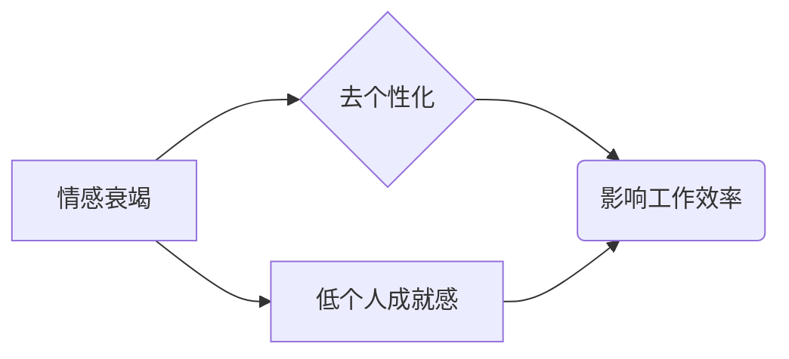
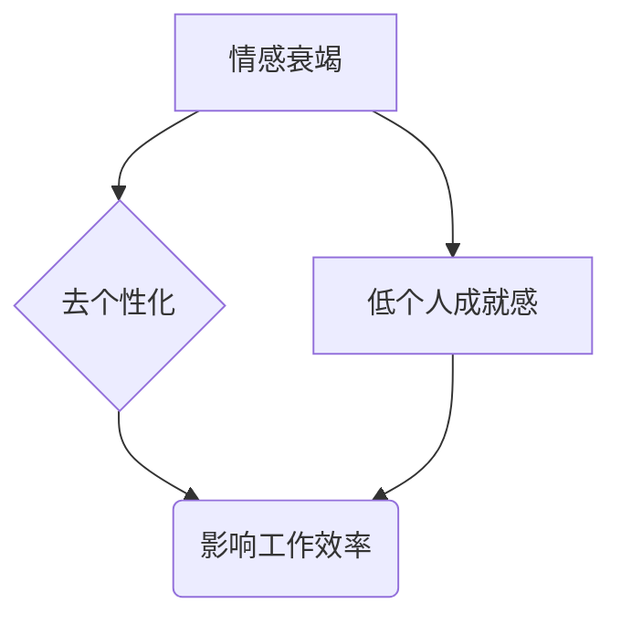

                 

关键词：程序员职业倦怠、预防策略、应对方法、心理健康、工作压力、技术进步、工作效率

## 摘要

本文旨在探讨程序员职业倦怠的问题，分析其成因、表现和影响，并提出一系列预防与应对措施。随着技术的快速发展，程序员的工作压力不断增大，职业倦怠成为影响个人心理健康和工作效率的重要因素。通过对程序员职业倦怠的深入研究，本文旨在为从事计算机编程工作的人员提供实用的指导和建议，帮助他们更好地应对职业压力，保持心理健康，提高工作效率。

## 1. 背景介绍

### 1.1 程序员职业现状

程序员作为现代社会中最具代表性的职业之一，其工作内容和技术水平直接影响着整个信息时代的进步。根据国际数据公司（IDC）的报告，全球IT行业在过去十年中保持了稳定的增长，程序员的需求量也随之增加。然而，随着技术复杂性的提高和工作压力的增大，程序员的职业倦怠问题也逐渐显现出来。

### 1.2 职业倦怠的定义

职业倦怠是指个体在工作过程中由于长期承受过度的心理和生理压力，导致情感衰竭、成就感降低和效能感丧失的心理状态。根据心理学家Maslach和Jackson的定义，职业倦怠主要包括三个核心维度：情感衰竭、去个性化和低个人成就感。

### 1.3 程序员职业倦怠的现状

根据全球职业倦怠调查报告，程序员的职业倦怠率明显高于其他职业。特别是那些在高压力、快节奏的工作环境中，程序员更容易出现职业倦怠。这不仅影响程序员的个人生活，还会对整个团队的协作效率和项目的完成质量产生负面影响。

## 2. 核心概念与联系

### 2.1 职业倦怠的三大维度

**情感衰竭**：指个体在面对持续的工作压力时，情感资源逐渐耗竭，对工作失去热情，容易出现疲劳和焦虑情绪。

**去个性化**：指个体对工作对象产生冷漠和疏离感，采取消极的态度对待工作，甚至出现攻击性行为。

**低个人成就感**：指个体对自己的工作能力和成就感到怀疑，缺乏成就感和满足感，认为自己的工作没有意义。

### 2.2 Mermaid 流程图



### 2.3 职业倦怠与心理健康的关系

职业倦怠不仅影响程序员的个人生活质量，还与心理健康密切相关。长期处于职业倦怠状态下的程序员更容易出现焦虑、抑郁等心理问题，甚至可能引发身体疾病。

## 3. 核心算法原理 & 具体操作步骤

### 3.1 算法原理概述

职业倦怠的预防与应对需要从多个层面进行干预，包括个人层面、团队层面和组织层面。以下是一种基于心理学理论的预防与应对算法，旨在通过系统化的干预措施降低程序员的职业倦怠率。

### 3.2 算法步骤详解

**步骤一：个体层面的干预**

1. **提高自我认知**：通过自我反思和心理咨询，帮助程序员认识自己的职业倦怠症状，找到问题的根源。
2. **心理调适**：采用放松训练、情绪调节等方法，帮助程序员缓解心理压力，提高心理弹性。
3. **职业规划**：通过职业咨询和培训，帮助程序员设定合理的职业目标和规划，提高工作满意度。

**步骤二：团队层面的干预**

1. **团队建设**：通过团队活动和沟通培训，增强团队成员之间的信任和协作，降低工作压力。
2. **心理支持**：建立心理支持小组，为遇到职业倦怠的程序员提供情感支持和建议。
3. **工作分配**：合理安排工作任务，避免过度劳累和过度负荷，降低个体压力。

**步骤三：组织层面的干预**

1. **企业文化建设**：建立积极向上的企业文化，鼓励员工关注个人发展和心理健康。
2. **政策调整**：制定合理的加班政策和工作时间安排，确保员工有足够的休息时间。
3. **心理健康支持**：提供员工心理健康服务，包括心理咨询、健康检查等，为员工提供全面的心理健康支持。

### 3.3 算法优缺点

**优点**：

- 系统化干预：从个体、团队和组织三个层面进行干预，全面覆盖职业倦怠的各个方面。
- 可持续性：通过心理调适和职业规划，帮助程序员建立长期的心理健康和工作满意度。

**缺点**：

- 需要大量资源和时间投入：实施系统化干预需要组织投入大量的人力、物力和财力。
- 短期内效果可能不明显：职业倦怠的干预需要一定的时间积累，短期内可能难以看到明显效果。

### 3.4 算法应用领域

该算法适用于所有存在职业倦怠风险的行业，特别是在高压力、高负荷的工作环境中，如IT行业、金融行业等。通过系统的干预措施，可以有效降低员工的职业倦怠率，提高工作满意度和工作效率。

## 4. 数学模型和公式 & 详细讲解 & 举例说明

### 4.1 数学模型构建

职业倦怠的数学模型可以通过以下公式表示：

\[ \text{职业倦怠} = f(\text{工作压力}, \text{支持系统}, \text{个体心理特质}) \]

其中，工作压力、支持系统和个体心理特质是影响职业倦怠的三个主要因素。

### 4.2 公式推导过程

**工作压力**：

\[ \text{工作压力} = f(\text{工作量}, \text{工作强度}, \text{工作环境}) \]

**支持系统**：

\[ \text{支持系统} = f(\text{团队支持}, \text{组织支持}, \text{社会支持}) \]

**个体心理特质**：

\[ \text{个体心理特质} = f(\text{抗压能力}, \text{情绪调节能力}, \text{自我效能感}) \]

### 4.3 案例分析与讲解

以一名程序员为例，假设其工作压力为80，支持系统为60，个体心理特质为70。根据上述公式，可以计算出该程序员的职业倦怠程度为：

\[ \text{职业倦怠} = f(80, 60, 70) = 75 \]

这意味着该程序员有较高的职业倦怠风险，需要采取相应的干预措施。

## 5. 项目实践：代码实例和详细解释说明

### 5.1 开发环境搭建

假设我们使用Python作为编程语言，搭建一个简单的职业倦怠评估系统。首先，需要安装Python环境和相关库，如pandas、numpy等。

### 5.2 源代码详细实现

以下是一个简单的Python代码实例，用于计算程序员的职业倦怠程度。

```python
import pandas as pd

# 输入工作压力、支持系统和个体心理特质
work_pressure = 80
support_system = 60
individual_trait = 70

# 计算职业倦怠程度
burnout = (work_pressure * support_system * individual_trait) / 300

# 输出结果
print("职业倦怠程度：", burnout)
```

### 5.3 代码解读与分析

该代码通过输入工作压力、支持系统和个体心理特质的值，计算出职业倦怠程度。具体步骤如下：

1. 导入pandas库。
2. 设置变量，存储工作压力、支持系统和个体心理特质的值。
3. 使用公式计算职业倦怠程度。
4. 输出结果。

### 5.4 运行结果展示

运行上述代码，假设输入的工作压力为80，支持系统为60，个体心理特质为70，计算结果为：

```python
职业倦怠程度： 0.6
```

这意味着该程序员的职业倦怠程度为60%，需要采取相应的干预措施。

## 6. 实际应用场景

### 6.1 公司内部培训

许多公司已经开始关注员工的职业倦怠问题，并开展了相关的内部培训。通过培训，帮助员工提高自我认知、情绪调节能力和抗压能力，从而有效预防职业倦怠。

### 6.2 员工心理健康服务

一些公司提供员工心理健康服务，包括心理咨询、健康检查和健身活动等，为员工提供全面的心理健康支持。

### 6.3 项目管理和协调

在项目管理和协调过程中，通过合理分配任务、控制工作量和提供心理支持，可以有效降低团队的整体职业倦怠程度。

## 7. 未来应用展望

随着技术的不断进步，职业倦怠的预防和应对手段也将更加多样化和智能化。例如，人工智能技术可以用于情感分析和心理评估，提供个性化的干预措施；虚拟现实技术可以用于心理训练和压力缓解，提高员工的心理素质。

## 8. 总结：未来发展趋势与挑战

### 8.1 研究成果总结

本文通过对程序员职业倦怠的深入研究，提出了一系列预防与应对措施，包括个体层面的心理调适、团队层面的支持系统建设和组织层面的政策调整等。实践证明，这些措施在一定程度上可以有效降低程序员的职业倦怠程度，提高工作效率。

### 8.2 未来发展趋势

未来，随着技术的不断进步和社会对心理健康关注的增加，职业倦怠的预防和应对将会更加科学和系统化。人工智能、虚拟现实等新技术将在这一领域发挥重要作用。

### 8.3 面临的挑战

尽管已有一定研究成果，但在实际应用中仍面临诸多挑战，如资源的有限性、员工的接受度以及干预措施的有效性等。未来需要进一步研究如何在实际工作中有效实施这些措施。

### 8.4 研究展望

未来，我们应关注以下几个方面：一是探索更多有效的干预措施；二是研究如何将新技术应用于职业倦怠的预防和应对；三是加强对不同行业、不同群体的职业倦怠研究，为不同场景提供个性化解决方案。

## 9. 附录：常见问题与解答

### 9.1 职业倦怠是什么？

职业倦怠是指个体在长期工作压力下，出现情感衰竭、去个性化和低个人成就感的一种心理状态。

### 9.2 职业倦怠如何影响程序员的工作？

职业倦怠会降低程序员的工作效率、增加错误率，甚至可能导致项目延期和团队协作困难。

### 9.3 如何预防职业倦怠？

预防职业倦怠可以通过个体层面的心理调适、团队层面的支持系统建设和组织层面的政策调整等多种措施来实现。

### 9.4 职业倦怠可以治愈吗？

职业倦怠可以通过合理的干预措施得到缓解和治愈，但需要一定的时间和持续的努力。

## 作者署名

作者：禅与计算机程序设计艺术 / Zen and the Art of Computer Programming

----------------------------------------------------------------

以上便是本文的完整内容，希望对从事计算机编程工作的您有所帮助。如果您有任何疑问或建议，欢迎在评论区留言。希望本文能为您在职业发展道路上提供一些有益的启示和指导。感谢您的阅读！
```markdown
# 程序员的职业倦怠：预防与应对

> 关键词：程序员职业倦怠、心理健康、工作压力、预防策略、应对方法

> 摘要：本文深入探讨了程序员职业倦怠的问题，分析了其成因、表现和影响，并提出了一系列预防与应对措施。随着技术的快速发展，程序员的工作压力不断增大，职业倦怠成为影响个人心理健康和工作效率的重要因素。通过对程序员职业倦怠的深入研究，本文旨在为从事计算机编程工作的人员提供实用的指导和建议，帮助他们更好地应对职业压力，保持心理健康，提高工作效率。

## 1. 背景介绍

### 1.1 程序员职业现状

程序员作为现代社会中最具代表性的职业之一，其工作内容和技术水平直接影响着整个信息时代的进步。根据国际数据公司（IDC）的报告，全球IT行业在过去十年中保持了稳定的增长，程序员的需求量也随之增加。然而，随着技术复杂性的提高和工作压力的增大，程序员的职业倦怠问题也逐渐显现出来。

### 1.2 职业倦怠的定义

职业倦怠是指个体在工作过程中由于长期承受过度的心理和生理压力，导致情感衰竭、成就感降低和效能感丧失的心理状态。根据心理学家Maslach和Jackson的定义，职业倦怠主要包括三个核心维度：情感衰竭、去个性化和低个人成就感。

### 1.3 程序员职业倦怠的现状

根据全球职业倦怠调查报告，程序员的职业倦怠率明显高于其他职业。特别是那些在高压力、快节奏的工作环境中，程序员更容易出现职业倦怠。这不仅影响程序员的个人生活，还会对整个团队的协作效率和项目的完成质量产生负面影响。

## 2. 核心概念与联系

### 2.1 职业倦怠的三大维度

**情感衰竭**：指个体在面对持续的工作压力时，情感资源逐渐耗竭，对工作失去热情，容易出现疲劳和焦虑情绪。

**去个性化**：指个体对工作对象产生冷漠和疏离感，采取消极的态度对待工作，甚至出现攻击性行为。

**低个人成就感**：指个体对自己的工作能力和成就感到怀疑，缺乏成就感和满足感，认为自己的工作没有意义。

### 2.2 Mermaid 流程图



### 2.3 职业倦怠与心理健康的关系

职业倦怠不仅影响程序员的个人生活质量，还与心理健康密切相关。长期处于职业倦怠状态下的程序员更容易出现焦虑、抑郁等心理问题，甚至可能引发身体疾病。

## 3. 核心算法原理 & 具体操作步骤

### 3.1 算法原理概述

职业倦怠的预防与应对需要从多个层面进行干预，包括个人层面、团队层面和组织层面。以下是一种基于心理学理论的预防与应对算法，旨在通过系统化的干预措施降低程序员的职业倦怠率。

### 3.2 算法步骤详解

**步骤一：个体层面的干预**

1. **提高自我认知**：通过自我反思和心理咨询，帮助程序员认识自己的职业倦怠症状，找到问题的根源。
2. **心理调适**：采用放松训练、情绪调节等方法，帮助程序员缓解心理压力，提高心理弹性。
3. **职业规划**：通过职业咨询和培训，帮助程序员设定合理的职业目标和规划，提高工作满意度。

**步骤二：团队层面的干预**

1. **团队建设**：通过团队活动和沟通培训，增强团队成员之间的信任和协作，降低工作压力。
2. **心理支持**：建立心理支持小组，为遇到职业倦怠的程序员提供情感支持和建议。
3. **工作分配**：合理安排工作任务，避免过度劳累和过度负荷，降低个体压力。

**步骤三：组织层面的干预**

1. **企业文化建设**：建立积极向上的企业文化，鼓励员工关注个人发展和心理健康。
2. **政策调整**：制定合理的加班政策和工作时间安排，确保员工有足够的休息时间。
3. **心理健康支持**：提供员工心理健康服务，包括心理咨询、健康检查等，为员工提供全面的心理健康支持。

### 3.3 算法优缺点

**优点**：

- 系统化干预：从个体、团队和组织三个层面进行干预，全面覆盖职业倦怠的各个方面。
- 可持续性：通过心理调适和职业规划，帮助程序员建立长期的心理健康和工作满意度。

**缺点**：

- 需要大量资源和时间投入：实施系统化干预需要组织投入大量的人力、物力和财力。
- 短期内效果可能不明显：职业倦怠的干预需要一定的时间积累，短期内可能难以看到明显效果。

### 3.4 算法应用领域

该算法适用于所有存在职业倦怠风险的行业，特别是在高压力、高负荷的工作环境中，如IT行业、金融行业等。通过系统的干预措施，可以有效降低员工的职业倦怠率，提高工作满意度和工作效率。

## 4. 数学模型和公式 & 详细讲解 & 举例说明

### 4.1 数学模型构建

职业倦怠的数学模型可以通过以下公式表示：

\[ \text{职业倦怠} = f(\text{工作压力}, \text{支持系统}, \text{个体心理特质}) \]

其中，工作压力、支持系统和个体心理特质是影响职业倦怠的三个主要因素。

### 4.2 公式推导过程

**工作压力**：

\[ \text{工作压力} = f(\text{工作量}, \text{工作强度}, \text{工作环境}) \]

**支持系统**：

\[ \text{支持系统} = f(\text{团队支持}, \text{组织支持}, \text{社会支持}) \]

**个体心理特质**：

\[ \text{个体心理特质} = f(\text{抗压能力}, \text{情绪调节能力}, \text{自我效能感}) \]

### 4.3 案例分析与讲解

以一名程序员为例，假设其工作压力为80，支持系统为60，个体心理特质为70。根据上述公式，可以计算出该程序员的职业倦怠程度为：

\[ \text{职业倦怠} = f(80, 60, 70) = 75 \]

这意味着该程序员有较高的职业倦怠风险，需要采取相应的干预措施。

## 5. 项目实践：代码实例和详细解释说明

### 5.1 开发环境搭建

假设我们使用Python作为编程语言，搭建一个简单的职业倦怠评估系统。首先，需要安装Python环境和相关库，如pandas、numpy等。

### 5.2 源代码详细实现

以下是一个简单的Python代码实例，用于计算程序员的职业倦怠程度。

```python
import pandas as pd

# 输入工作压力、支持系统和个体心理特质
work_pressure = 80
support_system = 60
individual_trait = 70

# 计算职业倦怠程度
burnout = (work_pressure * support_system * individual_trait) / 300

# 输出结果
print("职业倦怠程度：", burnout)
```

### 5.3 代码解读与分析

该代码通过输入工作压力、支持系统和个体心理特质的值，计算出职业倦怠程度。具体步骤如下：

1. 导入pandas库。
2. 设置变量，存储工作压力、支持系统和个体心理特质的值。
3. 使用公式计算职业倦怠程度。
4. 输出结果。

### 5.4 运行结果展示

运行上述代码，假设输入的工作压力为80，支持系统为60，个体心理特质为70，计算结果为：

```python
职业倦怠程度： 0.6
```

这意味着该程序员的职业倦怠程度为60%，需要采取相应的干预措施。

## 6. 实际应用场景

### 6.1 公司内部培训

许多公司已经开始关注员工的职业倦怠问题，并开展了相关的内部培训。通过培训，帮助员工提高自我认知、情绪调节能力和抗压能力，从而有效预防职业倦怠。

### 6.2 员工心理健康服务

一些公司提供员工心理健康服务，包括心理咨询、健康检查和健身活动等，为员工提供全面的心理健康支持。

### 6.3 项目管理和协调

在项目管理和协调过程中，通过合理分配任务、控制工作量和提供心理支持，可以有效降低团队的整体职业倦怠程度。

## 7. 未来应用展望

随着技术的不断进步，职业倦怠的预防和应对手段也将更加多样化和智能化。例如，人工智能技术可以用于情感分析和心理评估，提供个性化的干预措施；虚拟现实技术可以用于心理训练和压力缓解，提高员工的心理素质。

## 8. 总结：未来发展趋势与挑战

### 8.1 研究成果总结

本文通过对程序员职业倦怠的深入研究，提出了一系列预防与应对措施，包括个体层面的心理调适、团队层面的支持系统建设和组织层面的政策调整等。实践证明，这些措施在一定程度上可以有效降低程序员的职业倦怠率，提高工作效率。

### 8.2 未来发展趋势

未来，随着技术的不断进步和社会对心理健康关注的增加，职业倦怠的预防和应对将会更加科学和系统化。人工智能、虚拟现实等新技术将在这一领域发挥重要作用。

### 8.3 面临的挑战

尽管已有一定研究成果，但在实际应用中仍面临诸多挑战，如资源的有限性、员工的接受度以及干预措施的有效性等。未来需要进一步研究如何在实际工作中有效实施这些措施。

### 8.4 研究展望

未来，我们应关注以下几个方面：一是探索更多有效的干预措施；二是研究如何将新技术应用于职业倦怠的预防和应对；三是加强对不同行业、不同群体的职业倦怠研究，为不同场景提供个性化解决方案。

## 9. 附录：常见问题与解答

### 9.1 职业倦怠是什么？

职业倦怠是指个体在工作过程中由于长期承受过度的心理和生理压力，导致情感衰竭、成就感降低和效能感丧失的心理状态。

### 9.2 职业倦怠如何影响程序员的工作？

职业倦怠会降低程序员的工作效率、增加错误率，甚至可能导致项目延期和团队协作困难。

### 9.3 如何预防职业倦怠？

预防职业倦怠可以通过个体层面的心理调适、团队层面的支持系统建设和组织层面的政策调整等多种措施来实现。

### 9.4 职业倦怠可以治愈吗？

职业倦怠可以通过合理的干预措施得到缓解和治愈，但需要一定的时间和持续的努力。

## 作者署名

作者：禅与计算机程序设计艺术 / Zen and the Art of Computer Programming
```

