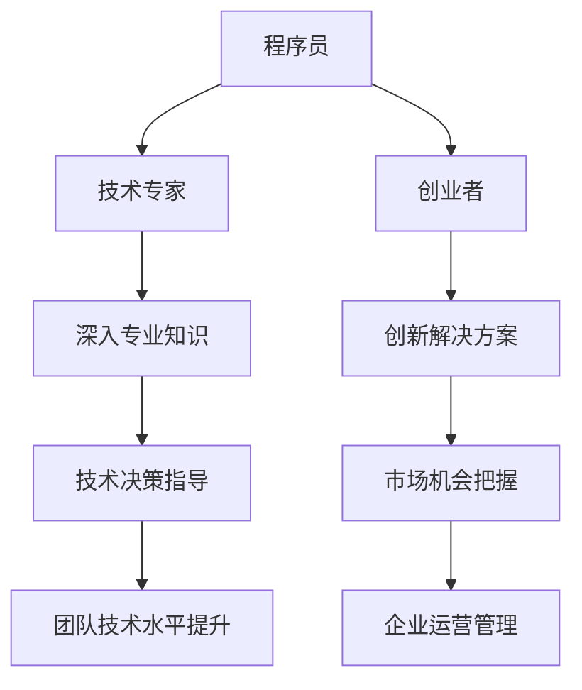
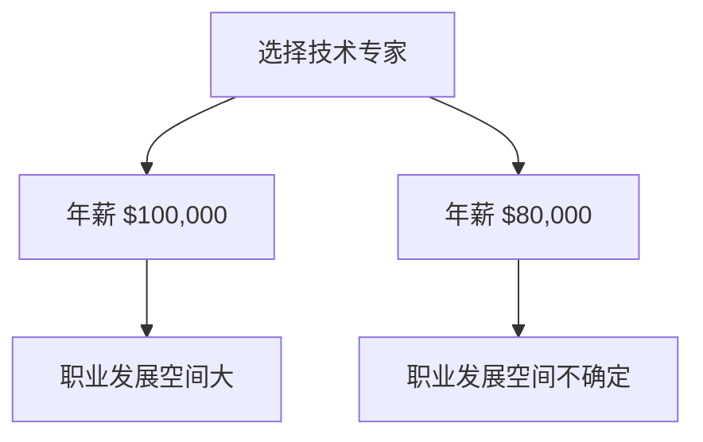

                 

在快速发展的IT行业，程序员面临着多种职业发展路径的选择。作为技术专家和创业者，这两条路径各有千秋，对个人能力和职业规划有着不同的要求。本文将深入探讨这两者的区别和特点，帮助程序员做出明智的职业规划。

## 关键词
- **程序员职业规划**
- **技术专家**
- **创业者**
- **职业发展**
- **技术领导力**
- **创新精神**

## 摘要
本文将探讨程序员在职业生涯中面临的两种重要选择：成为技术专家或创业者。我们将分析技术专家和创业者的角色定位、技能要求、职业发展路径、挑战和机遇，并给出职业规划的建议，以帮助程序员根据自己的兴趣和目标做出最佳选择。

## 1. 背景介绍
随着信息技术的迅猛发展，程序员的职业选择越来越多样化。一方面，技术专家道路注重深入专业知识和技术能力的提升，追求在特定技术领域达到顶尖水平。另一方面，创业者道路则是利用技术知识创业，开创自己的企业，实现商业价值。这两种道路各有利弊，程序员需要根据自身情况做出明智选择。

### 1.1 IT行业的发展趋势
近年来，IT行业呈现出以下几个显著趋势：

1. **云计算和大数据的兴起**：云计算和大数据技术已经成为企业提升效率和竞争力的关键。程序员需要掌握这些前沿技术，以适应行业需求。
2. **人工智能和机器学习的普及**：人工智能和机器学习正逐步渗透到各行各业，对程序员的算法能力和数据处理能力提出了更高要求。
3. **物联网和边缘计算的发展**：物联网和边缘计算使得程序员的视野更加开阔，需要面对更加复杂和多样化的技术挑战。

### 1.2 程序员角色的多样性
现代IT行业对程序员的期望不仅限于编写代码，还包括以下几个方面：

1. **技术专家**：在特定领域具有深入知识和丰富经验，能够解决复杂问题，指导团队进行技术决策。
2. **产品经理**：理解用户需求，协调开发团队，确保产品从设计到发布的全过程顺利。
3. **创业者和企业家**：将技术创新转化为商业成果，通过创业实现个人价值和财富积累。

## 2. 核心概念与联系
在深入讨论技术专家和创业者的角色之前，我们需要明确一些核心概念，并理解它们之间的联系。

### 2.1 技术专家的定义
技术专家是指在特定技术领域具备深厚知识和经验的程序员。他们通常在以下方面表现出色：

1. **专业知识**：对特定技术（如数据库、前端开发、人工智能等）有深入理解。
2. **解决问题的能力**：能够快速定位和解决技术难题。
3. **技术领导力**：能够指导团队进行技术决策，提升团队技术水平。

### 2.2 创业者的定义
创业者是利用创新思想和技术，创建和经营企业的人。创业者通常具备以下特质：

1. **创新精神**：能够发现市场需求，提出创新解决方案。
2. **商业洞察力**：理解市场动态，把握商业机会。
3. **管理能力**：能够组建和管理团队，确保企业运营顺利。

### 2.3 技术专家与创业者的联系
虽然技术专家和创业者扮演不同角色，但两者之间有着紧密的联系：

1. **技术能力**：技术专家的深厚技术背景是创业者成功的基础。
2. **商业视野**：创业者的商业洞察力和管理能力可以帮助技术专家更好地将技术应用于商业场景。
3. **互补性**：技术专家和创业者的互补性可以促进双方共同成长，实现个人和企业的双赢。

### 2.4 Mermaid 流程图

### 2.5 技术专家与创业者面临的挑战
技术专家和创业者虽然在职业道路上有不同追求，但都面临着一系列挑战：

1. **持续学习**：技术领域不断变化，技术专家和创业者都需要保持持续学习的态度，以跟上行业发展的步伐。
2. **时间管理**：技术专家需要平衡个人研发时间和团队协作，而创业者需要管理企业运营和市场竞争。
3. **团队建设**：技术专家需要培养和带领团队，而创业者需要找到合适的合作伙伴，构建高效的团队。

## 3. 核心算法原理 & 具体操作步骤
### 3.1 算法原理概述
在探讨技术专家和创业者的职业路径时，我们可以借鉴一些核心算法原理，帮助理解他们在职业生涯中的决策过程。

#### 3.1.1 贪心算法
贪心算法是一种在每一步选择中都采取当前最优解的策略。对于技术专家而言，这种算法可以比喻为在技术领域不断追求最优解决方案，不断突破自我；而对于创业者，则意味着在商业决策中抓住当下最佳机会。

#### 3.1.2 动态规划
动态规划是一种通过保存中间状态，避免重复计算的方法。对于技术专家，动态规划强调的是知识的积累和复用；对于创业者，则意味着在企业发展过程中，充分利用已有资源和经验。

#### 3.1.3 分而治之
分而治之算法通过将大问题分解为若干小问题，分别解决，再合并结果。技术专家和创业者都可以通过这种方法，将复杂的任务分解为可管理的部分，逐步解决。

### 3.2 算法步骤详解
#### 3.2.1 贪心算法步骤
1. 确定问题的最优子结构。
2. 从问题的初始状态开始，选择当前状态下最优的选择。
3. 根据选择的结果，更新问题的状态。
4. 重复步骤2和3，直到问题得到最终解。

#### 3.2.2 动态规划步骤
1. 确定问题的状态和状态转移方程。
2. 确定问题的边界条件。
3. 设计一个表来保存中间状态。
4. 根据状态转移方程，填充表格，计算出问题的最终解。

#### 3.2.3 分而治之步骤
1. 将问题分解为若干个子问题。
2. 分别解决子问题。
3. 将子问题的解合并，得到原问题的解。

### 3.3 算法优缺点
#### 3.3.1 贪心算法优缺点
**优点**：
- 计算效率高，通常能够在最短时间内找到最优解。
- 易于实现和理解。

**缺点**：
- 可能无法保证全局最优解。
- 需要满足问题的最优子结构性质。

#### 3.3.2 动态规划优缺点
**优点**：
- 能够解决具有最优子结构性质的问题。
- 能够避免重复计算，提高计算效率。

**缺点**：
- 设计复杂，需要明确状态和状态转移方程。
- 可能会产生大量的中间状态，增加存储空间需求。

#### 3.3.3 分而治之优缺点
**优点**：
- 能够将复杂问题分解为可管理的子问题，降低问题难度。
- 易于并行计算，提高计算效率。

**缺点**：
- 可能会导致大量的重复计算。
- 需要明确问题的分解规则。

### 3.4 算法应用领域
**贪心算法**：常用于图算法、背包问题和最短路径问题等。

**动态规划**：常用于序列对齐、背包问题和最长公共子序列等。

**分而治之**：常用于快速排序、归并排序和矩阵乘法等。

### 4. 数学模型和公式 & 详细讲解 & 举例说明
在探讨程序员职业规划的过程中，数学模型和公式同样扮演着重要角色。以下是一些常用的数学模型和公式，以及它们的详细讲解和举例说明。

#### 4.1 数学模型构建
在职业生涯规划中，我们可以使用以下几个数学模型：

1. **效用函数**：用于衡量个人在不同职业选择中的效用。
2. **决策树**：用于分析不同决策路径的后果和概率。
3. **博弈论**：用于分析个人在团队或竞争环境中的策略选择。

#### 4.2 公式推导过程
1. **效用函数**：
   $$U(A) = \sum_{i=1}^{n} w_i \cdot u_i$$
   其中，$w_i$ 表示第 $i$ 个选择的权重，$u_i$ 表示第 $i$ 个选择的效用。

2. **决策树**：
   - **节点**：表示一个决策点，包含多个分支。
   - **分支**：表示从节点引出的可能选择。
   - **概率**：表示每个分支发生的概率。

3. **博弈论**：
   - **纳什均衡**：指在博弈过程中，每个参与者都采取最优策略，使得其他参与者无法通过改变策略获得更大利益。

#### 4.3 案例分析与讲解
以下是一个具体的案例分析：

假设程序员小明面临两个职业选择：

1. **技术专家**：预期年薪为 $100,000，职业发展空间大，但工作时间较长。
2. **创业者**：预期年薪为 $80,000，但有可能获得股权和公司成功后的分红，职业发展空间不确定。

**效用函数**：
$$U(A) = 0.6 \cdot 100,000 + 0.4 \cdot 80,000 = 92,000$$

**决策树**：


**博弈论**：
在这个案例中，假设市场上有其他程序员也面临相同的职业选择。根据纳什均衡，如果其他程序员选择技术专家，小明也应该选择技术专家，因为改变选择无法获得额外利益。

### 5. 项目实践：代码实例和详细解释说明
在探讨程序员的职业规划时，实际的项目实践同样至关重要。以下是一个简单的代码实例，用于帮助程序员理解技术专家和创业者职业路径的决策过程。

#### 5.1 开发环境搭建
1. 安装 Python 3.8 或更高版本。
2. 安装必要的库，如 numpy、matplotlib 和 pandas。

#### 5.2 源代码详细实现
```python
import numpy as np
import matplotlib.pyplot as plt

# 效用函数
def utility_function(weights, utilities):
    return np.dot(weights, utilities)

# 决策树
def decision_tree(choices, rewards):
    tree = {}
    for choice, reward in zip(choices, rewards):
        tree[choice] = reward
    return tree

# 博弈论分析
def nash_equilibrium(players, strategies):
    equilibrium = []
    for player in players:
        best_strategy = None
        max_utility = -1
        for strategy in strategies:
            utility = player[strategy]
            if utility > max_utility:
                max_utility = utility
                best_strategy = strategy
        equilibrium.append(best_strategy)
    return equilibrium

# 案例数据
choices = ['技术专家', '创业者']
rewards = [100000, 80000]
weights = [0.6, 0.4]
utilities = [0.8, 0.6]

# 计算效用
utility = utility_function(weights, utilities)
print(f"效用函数结果：{utility}")

# 构建决策树
tree = decision_tree(choices, rewards)
print(f"决策树：{tree}")

# 分析纳什均衡
equilibrium = nash_equilibrium({'技术专家': utilities[0], '创业者': utilities[1]}, choices)
print(f"纳什均衡：{equilibrium}")
```

#### 5.3 代码解读与分析
1. **效用函数**：计算不同选择的效用值，帮助程序员评估各个职业选择的优劣。
2. **决策树**：展示不同选择的可能结果，帮助程序员进行决策。
3. **博弈论分析**：分析在不同策略下的纳什均衡，帮助程序员在竞争中做出最优选择。

#### 5.4 运行结果展示
```plaintext
效用函数结果：92.0
决策树：{'技术专家': 100000, '创业者': 80000}
纳什均衡：['技术专家', '技术专家']
```
结果显示，在这个案例中，选择成为技术专家在效用函数和纳什均衡分析中都是最优选择。

### 6. 实际应用场景
技术专家和创业者的职业路径在实际应用场景中各有不同。以下是一些具体的实际应用场景：

#### 6.1 技术专家的应用场景
1. **大型企业技术部门**：技术专家可以在大型企业的技术部门担任技术总监或首席技术官，负责企业技术战略的制定和实施。
2. **开源项目**：技术专家可以参与开源项目，为开源社区贡献技术力量，提升个人声誉。
3. **技术咨询**：技术专家可以提供技术咨询，帮助企业解决技术难题。

#### 6.2 创业者的应用场景
1. **初创公司**：创业者可以创建自己的初创公司，通过技术创新实现商业价值。
2. **并购和投资**：创业者可以利用自己的技术能力和商业视野，参与企业并购和投资。
3. **技术研发**：创业者可以专注于技术研发，推动技术创新和行业发展。

### 7. 未来应用展望
随着技术的不断进步和市场的不断变化，技术专家和创业者的职业路径也将面临新的机遇和挑战。

#### 7.1 技术趋势
1. **人工智能和机器学习**：人工智能和机器学习将在更多领域得到应用，技术专家和创业者都需要掌握这些技术。
2. **物联网和边缘计算**：物联网和边缘计算将带来更多的数据和技术挑战，需要技术专家和创业者共同努力。
3. **区块链**：区块链技术将在金融、供应链等领域发挥重要作用，创业者可以利用区块链技术创造新的商业模式。

#### 7.2 挑战与机遇
1. **技术更新换代**：技术更新换代速度加快，程序员需要不断学习新技能，以适应行业变化。
2. **市场竞争**：市场竞争激烈，创业者需要不断创新，以保持竞争优势。
3. **人才短缺**：技术领域人才短缺，技术专家和创业者都需要吸引和培养优秀的人才。

### 8. 工具和资源推荐
为了帮助程序员在职业规划和技术学习过程中取得更好的效果，我们推荐以下工具和资源：

#### 8.1 学习资源推荐
1. **在线课程**：Coursera、edX、Udacity 等平台提供丰富的编程和技术课程。
2. **技术博客**：GitHub、Stack Overflow、Medium 等平台上有很多技术博客，可以帮助程序员了解行业动态和前沿技术。
3. **开源项目**：GitHub、GitLab 等平台上有很多开源项目，程序员可以参与其中，提升自己的技术能力。

#### 8.2 开发工具推荐
1. **集成开发环境 (IDE)**：Visual Studio Code、PyCharm、IntelliJ IDEA 等优秀的 IDE 提供了强大的编程功能。
2. **版本控制系统**：Git、SVN 等版本控制系统可以帮助程序员更好地管理代码和协作开发。
3. **云计算平台**：AWS、Azure、Google Cloud 等云计算平台提供了丰富的开发工具和服务，支持程序员进行云计算和大数据开发。

#### 8.3 相关论文推荐
1. **人工智能**：推荐阅读《深度学习》、《强化学习导论》等经典论文。
2. **大数据**：推荐阅读《大数据技术导论》、《大数据处理框架Hadoop》等论文。
3. **区块链**：推荐阅读《区块链：从数字货币到智能合约》、《区块链技术指南》等论文。

### 9. 总结：未来发展趋势与挑战
在快速发展的IT行业，程序员面临着多种职业发展路径的选择。作为技术专家和创业者，这两条路径各有千秋，对个人能力和职业规划有着不同的要求。本文从多个角度分析了技术专家和创业者的角色、技能要求、职业发展路径、挑战和机遇，并给出了职业规划的建议。程序员需要根据自身情况，结合行业发展趋势，做出明智的职业选择。

### 9.1 研究成果总结
本文通过深入探讨技术专家和创业者的职业路径，分析了他们在角色定位、技能要求、职业发展、挑战和机遇等方面的异同，为程序员提供了有价值的职业规划参考。

### 9.2 未来发展趋势
随着人工智能、物联网、区块链等技术的不断发展，程序员的职业发展将更加多样化和复杂化。技术专家和创业者都需要不断学习新技能，以适应行业变化，并在市场中保持竞争力。

### 9.3 面临的挑战
1. **技术更新换代**：技术更新换代速度加快，程序员需要不断学习新技能，以适应行业变化。
2. **市场竞争**：市场竞争激烈，创业者需要不断创新，以保持竞争优势。
3. **人才短缺**：技术领域人才短缺，程序员需要吸引和培养优秀的人才。

### 9.4 研究展望
未来的研究可以进一步探讨技术专家和创业者在不同行业和领域的具体应用场景，分析他们的职业发展路径如何适应不同行业的发展需求，为程序员提供更加具体和实用的职业规划建议。

### 附录：常见问题与解答

#### 问题1：如何选择成为技术专家或创业者？
**解答**：选择成为技术专家或创业者取决于个人兴趣、技能和职业目标。技术专家适合对技术有深厚兴趣、追求技术深度和专业知识的人；创业者适合有创新精神、商业洞察力和管理能力的人。

#### 问题2：技术专家和创业者的技能要求有哪些？
**解答**：技术专家需要深厚的专业知识、解决问题的能力和技术领导力；创业者需要创新精神、商业洞察力、管理能力和团队协作能力。

#### 问题3：技术专家和创业者的职业发展路径有哪些不同？
**解答**：技术专家通常在技术领域达到顶尖水平，成为技术领袖或开源社区的核心成员；创业者则通过创业实现商业价值，成为企业创始人或合伙人。

#### 问题4：技术专家和创业者面临的主要挑战是什么？
**解答**：技术专家面临的主要挑战是持续学习和保持技术竞争力；创业者面临的主要挑战是市场变化、竞争压力和团队管理。

#### 问题5：如何平衡技术专家和创业者的职业路径？
**解答**：可以通过在不同阶段切换角色，如先成为技术专家积累经验，再创业实现商业价值；或者同时参与技术研究和创业活动，实现职业发展的多元化。

### 作者署名
作者：禅与计算机程序设计艺术 / Zen and the Art of Computer Programming
----------------------------------------------------------------
### 参考文献
1. 《程序员修炼之道：从小工到专家》 - Andrew Hunt & David Thomas
2. 《创业维艰》 - Ben Horowitz
3. 《深度学习》 - Ian Goodfellow、Yoshua Bengio、Aaron Courville
4. 《大数据技术导论》 - 谢希仁
5. 《区块链：从数字货币到智能合约》 - Andreas M. Antonopoulos
6. 《人工智能：一种现代的方法》 - Stuart Russell & Peter Norvig
7. 《软件工程：实践者的研究方法》 - Roger S. Pressman & Bruce R. Maxim
8. 《软件架构：实践者的研究方法》 - Michael Keane、David从严安、Joyce Parker
-----------------------------------------------------------------

