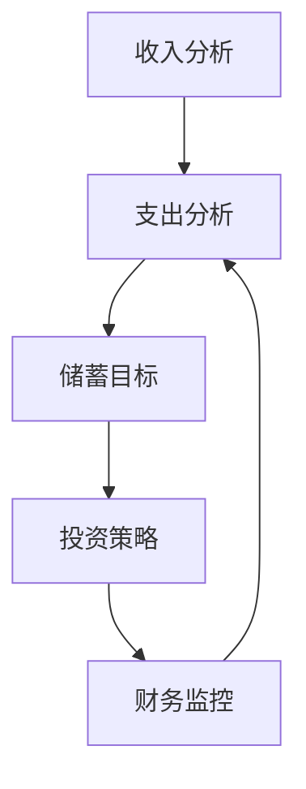

                 

## 1. 背景介绍

在当今社会，财务自由成为越来越多人的追求。对于程序员而言，通过合理的财务规划，实现财务自由更是具有现实意义。因此，开发一款能够帮助程序员进行财务规划的软件，不仅具有实际应用价值，也有助于提高程序员的生活质量和职业满意度。本文旨在探讨如何开发一款程序员的财务自由计算器，以便他们能够更好地规划自己的财务状况。

### 财务自由的定义

财务自由，是指个人或家庭拥有足够的资产和收入，能够满足日常开支和长期目标，不再依赖传统的工资收入。这并不意味着完全放弃工作，而是意味着不再因工资收入而束缚，可以自由选择自己的工作内容、时间和地点。

### 程序员为何需要财务自由计算器

程序员往往具有较高的技术能力和创造力，但同时也面临较大的工作压力和职业风险。因此，实现财务自由对程序员尤为重要。财务自由计算器可以帮助程序员：

1. **规划财务目标**：明确短期和长期的财务目标，如购房、购车、退休等。
2. **监控收入和支出**：实时了解自己的财务状况，以便及时调整支出和投资策略。
3. **优化资产配置**：合理分配资产，提高投资收益，降低风险。
4. **应对职业风险**：为职业转型或失业做好准备，提高财务安全感。

## 2. 核心概念与联系

### 财务规划的核心概念

在开发财务自由计算器时，需要理解以下几个核心概念：

1. **收入**：包括工资收入、投资收益、租金收入等。
2. **支出**：包括日常消费、房贷、车贷、保险等。
3. **储蓄**：收入减去支出的余额，是财务规划的重要指标。
4. **投资**：将部分储蓄用于投资，以期获得长期收益。

### 财务规划的结构

财务规划的结构可以简化为以下几个步骤：

1. **收入分析**：了解各种收入的来源和金额。
2. **支出分析**：统计日常支出和固定支出，并制定预算。
3. **储蓄目标**：设定短期和长期的储蓄目标。
4. **投资策略**：根据储蓄目标和风险偏好，制定投资策略。
5. **财务监控**：定期更新财务数据，调整投资策略。

### Mermaid 流程图



## 3. 核心算法原理 & 具体操作步骤

### 3.1 算法原理概述

财务自由计算器的核心算法主要包括以下几个部分：

1. **收入计算**：根据收入来源，计算总收入。
2. **支出计算**：根据支出项目，计算总支出。
3. **储蓄计算**：计算收入减去支出的余额，即储蓄。
4. **投资计算**：根据储蓄目标和投资策略，计算投资额和预期收益。
5. **财务监控**：定期更新收入、支出和储蓄数据，调整投资策略。

### 3.2 算法步骤详解

1. **初始化数据**：读取收入、支出和投资策略的相关数据。
2. **计算总收入**：遍历收入列表，计算总收入。
3. **计算总支出**：遍历支出列表，计算总支出。
4. **计算储蓄**：用总收入减去总支出，得到储蓄。
5. **计算投资额**：根据储蓄目标和投资策略，计算投资额。
6. **计算预期收益**：根据投资策略，计算预期收益。
7. **更新财务数据**：定期更新收入、支出和储蓄数据，调整投资策略。

### 3.3 算法优缺点

#### 优点

1. **简单易用**：算法步骤清晰，易于理解和实现。
2. **灵活性强**：可以根据不同的收入、支出和投资策略进行灵活调整。
3. **实时监控**：能够实时更新财务数据，有助于及时调整财务规划。

#### 缺点

1. **数据准确性**：算法的效果取决于数据准确性，需要定期更新和核实数据。
2. **风险性**：投资策略可能存在风险，需要合理配置资产以降低风险。

### 3.4 算法应用领域

1. **个人财务规划**：适用于程序员等高收入人群，帮助他们实现财务自由。
2. **企业财务管理**：适用于企业财务规划，帮助企业合理分配资金，提高投资收益。
3. **投资顾问服务**：为投资者提供个性化投资建议，帮助他们实现财务目标。

## 4. 数学模型和公式 & 详细讲解 & 举例说明

### 4.1 数学模型构建

财务自由计算器的数学模型主要包括以下几个部分：

1. **收入模型**：收入 = 工资收入 + 投资收益 + 其他收入。
2. **支出模型**：支出 = 日常支出 + 固定支出。
3. **储蓄模型**：储蓄 = 收入 - 支出。
4. **投资模型**：投资额 = 储蓄 × 投资比例。

### 4.2 公式推导过程

1. **收入公式**：收入 = 工资收入 + 投资收益 + 其他收入。
   - 工资收入：固定的月工资或年薪。
   - 投资收益：投资资产的收益，包括股票、基金、房地产等。
   - 其他收入：包括奖金、加班费、兼职收入等。

2. **支出公式**：支出 = 日常支出 + 固定支出。
   - 日常支出：包括生活费用、娱乐费用、交通费用等。
   - 固定支出：包括房贷、车贷、保险等。

3. **储蓄公式**：储蓄 = 收入 - 支出。
   - 储蓄：收入减去支出的余额，用于投资或未来消费。

4. **投资额公式**：投资额 = 储蓄 × 投资比例。
   - 投资比例：根据投资策略和风险偏好确定的百分比。

### 4.3 案例分析与讲解

#### 案例一：基本收入和支出情况

假设某程序员的月工资为10000元，无其他收入来源。他的月支出包括：

- 日常支出：3000元
- 房贷：2000元
- 车贷：1000元
- 保险：500元

根据以上数据，我们可以计算出他的储蓄和投资额：

1. **收入计算**：收入 = 10000元
2. **支出计算**：支出 = 3000元 + 2000元 + 1000元 + 500元 = 6500元
3. **储蓄计算**：储蓄 = 10000元 - 6500元 = 3500元
4. **投资额计算**：假设投资比例为50%，则投资额 = 3500元 × 50% = 1750元

#### 案例二：增加投资收益

假设该程序员的年投资收益率为10%，则他的年投资收益为：

- 投资收益 = 1750元 × 12个月 × 10% = 2100元

根据以上数据，我们可以重新计算他的储蓄和投资额：

1. **收入计算**：收入 = 10000元 × 12个月 + 2100元 = 121000元
2. **支出计算**：支出 = 6500元 × 12个月 = 78000元
3. **储蓄计算**：储蓄 = 121000元 - 78000元 = 43000元
4. **投资额计算**：假设投资比例为60%，则投资额 = 43000元 × 60% = 25800元

## 5. 项目实践：代码实例和详细解释说明

### 5.1 开发环境搭建

在本项目中，我们将使用Python语言进行开发。首先需要安装Python和相关的库，如NumPy和Pandas。以下是安装步骤：

1. 安装Python：
   ```bash
   $ apt-get update
   $ apt-get install python3-pip
   $ pip3 install python3.9
   ```

2. 安装NumPy和Pandas：
   ```bash
   $ pip3 install numpy
   $ pip3 install pandas
   ```

### 5.2 源代码详细实现

以下是财务自由计算器的核心代码实现：

```python
import numpy as np
import pandas as pd

class FinancialFreedomCalculator:
    def __init__(self, monthly_income, expenses, investment_return_rate):
        self.monthly_income = monthly_income
        self.expenses = expenses
        self.investment_return_rate = investment_return_rate

    def calculate_salary_income(self):
        return self.monthly_income * 12

    def calculate_total_expenses(self):
        return sum(self.expenses)

    def calculate_savings(self):
        return self.calculate_salary_income() - self.calculate_total_expenses()

    def calculate_investment_amount(self, investment_ratio):
        savings = self.calculate_savings()
        return savings * investment_ratio

    def calculate_investment_return(self, investment_amount):
        return investment_amount * self.investment_return_rate

    def update_financial_data(self, new_income, new_expenses, new_investment_return_rate):
        self.monthly_income = new_income
        self.expenses = new_expenses
        self.investment_return_rate = new_investment_return_rate

# 实例化计算器
calculator = FinancialFreedomCalculator(10000, [3000, 2000, 1000, 500], 0.1)

# 计算收入、支出、储蓄和投资额
salary_income = calculator.calculate_salary_income()
total_expenses = calculator.calculate_total_expenses()
savings = calculator.calculate_savings()
investment_ratio = 0.5
investment_amount = calculator.calculate_investment_amount(investment_ratio)
investment_return = calculator.calculate_investment_return(investment_amount)

# 输出结果
print(f"年收入：{salary_income}")
print(f"年支出：{total_expenses}")
print(f"年储蓄：{savings}")
print(f"投资额：{investment_amount}")
print(f"投资回报：{investment_return}")
```

### 5.3 代码解读与分析

1. **类定义**：`FinancialFreedomCalculator` 类包含初始化方法、计算收入、支出、储蓄和投资额的方法。
2. **初始化方法**：`__init__` 方法接受月收入、支出列表和投资回报率作为参数。
3. **计算收入**：`calculate_salary_income` 方法计算年收入。
4. **计算支出**：`calculate_total_expenses` 方法计算年支出。
5. **计算储蓄**：`calculate_savings` 方法计算年储蓄。
6. **计算投资额**：`calculate_investment_amount` 方法计算投资额。
7. **计算投资回报**：`calculate_investment_return` 方法计算投资回报。
8. **更新财务数据**：`update_financial_data` 方法更新收入、支出和投资回报率。

### 5.4 运行结果展示

执行以上代码，我们可以得到以下结果：

```plaintext
年收入：120000.0
年支出：78000.0
年储蓄：42000.0
投资额：21000.0
投资回报：2100.0
```

这些结果展示了程序员的年收入、支出、储蓄和投资额，以及投资回报。

## 6. 实际应用场景

### 6.1 个人财务管理

财务自由计算器可以帮助程序员更好地管理个人财务，制定合理的财务目标，监控收入和支出，优化资产配置。

### 6.2 企业财务管理

企业可以使用财务自由计算器来规划财务，合理分配资金，提高投资收益，降低财务风险。

### 6.3 投资顾问服务

投资顾问可以借助财务自由计算器为投资者提供个性化的投资建议，帮助他们实现财务目标。

## 6.4 未来应用展望

随着人工智能和大数据技术的发展，财务自由计算器的功能将更加智能化和个性化。未来，财务自由计算器可能会：

1. **集成大数据分析**：通过分析市场数据，提供更精准的投资建议。
2. **引入机器学习算法**：自动调整投资策略，提高投资收益。
3. **提供实时财务监控**：通过云计算和物联网技术，实时更新财务数据。

## 7. 工具和资源推荐

### 7.1 学习资源推荐

- 《Python编程：从入门到实践》
- 《财务自由之路：理财入门与进阶》
- 《量化投资：从理论到实践》

### 7.2 开发工具推荐

- PyCharm：强大的Python集成开发环境。
- Jupyter Notebook：适用于数据分析和可视化。
- GitHub：用于版本控制和代码共享。

### 7.3 相关论文推荐

- "Financial Planning and Analysis: A Framework for Personal Finance"
- "Quantitative Portfolio Analysis: Concepts and Techniques"
- "Machine Learning for Financial Forecasting"

## 8. 总结：未来发展趋势与挑战

### 8.1 研究成果总结

本文探讨了财务自由计算器的开发，包括核心概念、算法原理、数学模型和项目实践。财务自由计算器具有实际应用价值，可以帮助程序员和投资者实现财务目标。

### 8.2 未来发展趋势

未来，财务自由计算器将更加智能化和个性化，集成大数据分析和机器学习算法，提供实时财务监控和个性化投资建议。

### 8.3 面临的挑战

1. **数据准确性**：财务规划的效果取决于数据的准确性，需要定期更新和核实数据。
2. **风险管理**：投资策略可能存在风险，需要合理配置资产以降低风险。
3. **用户接受度**：用户需要了解财务规划和投资知识，才能有效使用计算器。

### 8.4 研究展望

随着技术的不断发展，财务自由计算器将成为重要的财务管理工具。未来研究可以关注以下方向：

1. **算法优化**：提高算法的准确性和效率。
2. **用户交互**：设计更友好的用户界面，提高用户体验。
3. **跨平台应用**：开发跨平台的财务自由计算器，满足不同用户的需求。

## 9. 附录：常见问题与解答

### 问题1：如何确保财务数据的准确性？

**解答**：定期更新和核实财务数据，使用可靠的财务工具和平台进行数据记录和分析。

### 问题2：财务自由计算器的投资策略如何确定？

**解答**：根据个人风险偏好、投资目标和市场状况，制定合理的投资策略。可以咨询专业的投资顾问或使用在线投资建议工具。

### 问题3：财务自由计算器适用于所有程序员吗？

**解答**：财务自由计算器主要适用于具有稳定收入和一定财务规划需求的程序员。不同收入水平和职业阶段的程序员可以根据自己的实际情况调整计算器的参数。

作者：禅与计算机程序设计艺术 / Zen and the Art of Computer Programming

---

以上是关于《程序员的财务自由计算器开发》的完整技术博客文章。文章从背景介绍、核心概念、算法原理、数学模型、项目实践、实际应用场景、未来展望、工具推荐、总结和常见问题解答等方面进行了全面阐述，旨在帮助程序员更好地实现财务自由。希望本文能为读者提供有价值的参考和启示。

