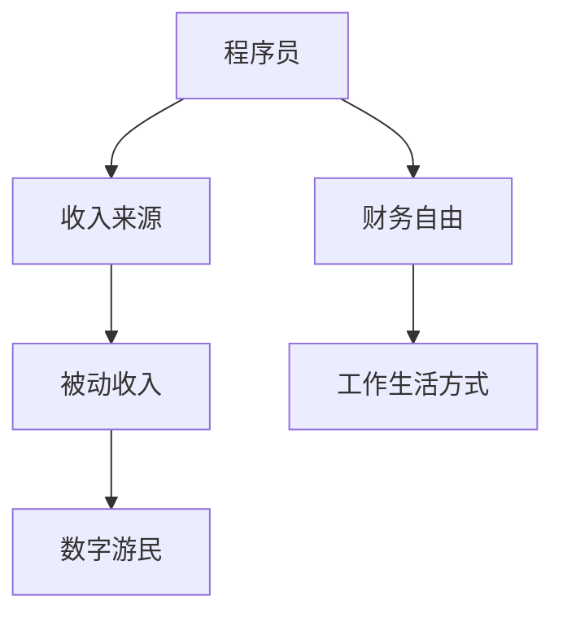

                 

关键词：财务自由，数字游民，程序员，收入来源，被动收入，全球远程工作，工作生活方式

> 摘要：本文旨在探讨程序员如何通过数字游民的生活方式实现财务自由。我们将探讨不同的收入来源，被动收入的构建方法，以及数字游民面临的挑战和解决方案。通过实际案例分析，我们将展示如何在全球远程工作的环境中实现个人财务目标。

## 1. 背景介绍

在当今的数字化时代，程序员作为信息技术领域的核心力量，其职业发展已经不再局限于传统的办公室工作模式。随着远程工作技术的日益成熟，越来越多的程序员选择成为数字游民，即在全球各地远程工作的人群。这种工作方式不仅提供了更大的工作灵活性，还可能带来更高的收入和生活质量。

然而，实现财务自由并非易事，尤其是在竞争激烈的程序员市场中。本文将探讨如何通过合理的财务规划和多样化的收入来源，帮助程序员实现财务自由，并享受数字游民的生活方式。

### 1.1 数字游民的定义和特点

数字游民是指利用现代信息技术，如互联网和远程协作工具，在全球范围内自由选择工作地点的人群。他们的工作通常不需要固定的工作场所，可以通过笔记本电脑和移动设备在任何有网络连接的地方进行。

数字游民的特点包括：

- **灵活的工作时间和地点**：不受传统办公室限制，可以在全球任何地方工作。
- **自我管理**：需要良好的自律和时间管理能力。
- **多样化的工作内容**：可以从事自由职业、远程办公、创业等多种工作形式。
- **高依赖性技术**：需要强大的网络连接、高效的远程协作工具和先进的办公软件。

### 1.2 数字游民的兴起原因

数字游民的兴起主要受到以下几个因素的推动：

- **远程工作技术的进步**：互联网、视频会议、云存储等技术的发展，使得远程工作变得更加可行。
- **全球化的趋势**：全球化的加深使得跨国工作和跨境合作变得常见。
- **自由生活方式的追求**：许多程序员追求自由、灵活的生活方式，数字游民提供了这样的机会。
- **经济压力**：部分地区经济不景气，使得传统就业机会减少，迫使用人单位和员工转向远程工作。

## 2. 核心概念与联系

在探讨如何实现财务自由之前，我们需要了解一些关键概念和它们之间的联系。以下是一个简化的 Mermaid 流程图，用于描述这些核心概念。



### 2.1 程序员

程序员是编写、维护和调试计算机软件的专业人员。他们通过编写代码来实现软件的功能，解决技术问题，并优化系统性能。程序员的技能和经验直接决定了他们的收入水平。

### 2.2 财务自由

财务自由是指个人拥有足够的资产和收入，无需为生活费用而担忧，可以自由地选择工作或生活方式。它通常包括以下要素：

- **足够的储蓄和投资**：有足够的资金用于日常开销和紧急情况。
- **稳定的收入来源**：通过多元化的收入渠道，确保长期财务安全。
- **低负债水平**：减少不必要的债务，尤其是高利息的债务。

### 2.3 收入来源

程序员的收入来源可以多样化，包括：

- **全职工作**：在一家公司或组织中担任全职程序员。
- **自由职业**：为客户提供编程服务，如网站开发、软件开发等。
- **咨询和培训**：为其他程序员提供咨询服务或教授编程课程。
- **自动化和被动收入**：通过编写和销售软件，或者利用互联网平台获得被动收入。

### 2.4 被动收入

被动收入是指不需要持续努力就能产生的收入。对于程序员来说，被动收入可能来源于：

- **销售软件或应用**：编写并销售软件或移动应用。
- **博客或YouTube频道**：通过内容创作和广告获得收入。
- **投资和金融产品**：通过股票、债券、房地产等投资获得回报。

### 2.5 工作生活方式

工作生活方式与财务自由密切相关。数字游民的工作生活方式通常包括：

- **灵活的工作时间**：可以根据个人喜好和需求调整工作时间。
- **远程办公**：不受地理限制，可以在全球任何地方工作。
- **自由职业**：可以根据市场需求和个人兴趣选择项目。

## 3. 核心算法原理 & 具体操作步骤

### 3.1 算法原理概述

要实现财务自由，程序员需要制定一个清晰的财务规划，并采取一系列策略来实现目标。以下是一个简化的算法原理概述：

1. **评估当前财务状况**：了解个人财务状况，包括收入、支出、储蓄和债务。
2. **设定财务目标**：根据个人需求和目标，设定短期和长期财务目标。
3. **多元化收入来源**：通过全职工作、自由职业、投资和自动化收入等多种方式增加收入。
4. **降低开支**：优化支出结构，减少不必要的开支，提高储蓄率。
5. **投资和资产配置**：将储蓄用于投资，包括股票、债券、房地产等。
6. **持续学习和成长**：提升专业技能和知识，提高市场竞争力。
7. **监控和调整**：定期检查财务状况，根据实际情况调整策略。

### 3.2 算法步骤详解

以下是实现财务自由的详细步骤：

#### 3.2.1 评估当前财务状况

- **收入分析**：记录每月收入来源和金额，了解收入构成。
- **支出分析**：记录每月所有支出，包括生活费用、娱乐支出、投资等。
- **储蓄和债务分析**：计算每月储蓄金额，评估债务状况，包括利息和偿还期限。

#### 3.2.2 设定财务目标

- **短期目标**：设定未来1-2年内可以实现的财务目标，如购买新房、旅行等。
- **长期目标**：设定5-10年内的财务目标，如退休规划、财务自由等。

#### 3.2.3 多元化收入来源

- **全职工作**：保持稳定的全职工作，提高收入水平。
- **自由职业**：利用业余时间从事自由职业，增加收入。
- **投资和自动化收入**：购买股票、债券、房地产等，利用互联网平台获得被动收入。

#### 3.2.4 降低开支

- **优化支出结构**：减少不必要的娱乐和奢侈品支出，优先考虑生活必需品。
- **储蓄计划**：制定储蓄计划，每月将一定比例的收入用于储蓄。
- **债务管理**：减少高利息债务，优先偿还债务。

#### 3.2.5 投资和资产配置

- **学习投资知识**：了解投资市场，学习基本的投资原则和策略。
- **制定投资计划**：根据个人风险承受能力，制定合理的投资计划。
- **分散投资**：将资金分散投资于多种资产，降低风险。

#### 3.2.6 持续学习和成长

- **提升技能**：定期学习新的编程语言和技术，保持市场竞争力。
- **扩展人脉**：参与行业活动和社区，结识同行和潜在客户。
- **持续创新**：尝试新的项目和机会，不断开拓新的收入来源。

#### 3.2.7 监控和调整

- **定期检查**：每月或每季度检查一次财务状况，确保目标实现。
- **调整策略**：根据实际情况调整财务规划，应对市场变化和个人需求。

### 3.3 算法优缺点

#### 优点：

- **灵活性高**：可以根据个人情况和市场变化灵活调整策略。
- **适应性强**：能够应对不同阶段和不同市场环境下的财务需求。
- **可持续性**：通过持续学习和成长，不断提升自身能力和市场竞争力。

#### 缺点：

- **初期投入大**：需要一定的资金和时间来学习和投资。
- **风险性高**：投资市场波动大，存在一定的风险。
- **需要自律**：需要良好的自律和时间管理能力，确保长期执行。

### 3.4 算法应用领域

该算法适用于所有追求财务自由的程序员，无论他们是全职员工、自由职业者，还是希望从事投资和创业的程序员。以下是一些具体的应用场景：

- **全职程序员**：通过增加收入、降低开支和投资，实现短期和长期财务目标。
- **自由职业者**：通过拓展客户、提高工作效率和多元化收入来源，实现财务自由。
- **投资者**：通过投资股票、债券和房地产等，实现资产增值和被动收入。

## 4. 数学模型和公式 & 详细讲解 & 举例说明

### 4.1 数学模型构建

为了更好地理解和实现财务自由，我们可以构建一个简单的数学模型，用于计算财务目标所需的时间和资金。

假设：

- 月收入为 $R$ 元
- 月支出为 $E$ 元
- 每月储蓄比例为 $S$ （即每月储蓄金额为 $R \times S$）
- 年化投资回报率为 $R_{inv}$

则财务自由所需的资金 $F$ 可以通过以下公式计算：

$$
F = \frac{E \times 12}{R_{inv} \times S}
$$

### 4.2 公式推导过程

为了推导上述公式，我们可以进行以下步骤：

1. **计算每月储蓄金额**：每月储蓄金额为 $R \times S$。
2. **计算每年储蓄金额**：每年储蓄金额为 $R \times S \times 12$。
3. **计算达到财务自由所需的总资金**：达到财务自由所需的总资金为每月支出乘以投资回报率的倒数，即 $E \times 12 / (R_{inv} \times S)$。
4. **简化公式**：将上述公式简化，得到 $F = \frac{E \times 12}{R_{inv} \times S}$。

### 4.3 案例分析与讲解

假设一个程序员每月收入为 10,000 元，每月支出为 5,000 元，储蓄比例为 50%，年化投资回报率为 5%。

根据上述公式，我们可以计算出达到财务自由所需的总资金：

$$
F = \frac{5,000 \times 12}{0.05 \times 0.5} = \text{120,000 元}
$$

这意味着这个程序员需要储蓄 120,000 元才能实现财务自由。

### 4.4 案例分析：实现财务自由的途径

#### 案例一：增加收入

如果程序员通过提升技能和拓展客户，将月收入提高到 15,000 元，其他条件不变，则实现财务自由所需的总资金将减少：

$$
F = \frac{5,000 \times 12}{0.05 \times 0.5} = \text{60,000 元}
$$

#### 案例二：提高储蓄比例

如果程序员将储蓄比例提高到 70%，其他条件不变，则实现财务自由所需的总资金将减少：

$$
F = \frac{5,000 \times 12}{0.05 \times 0.7} = \text{85,714.29 元}
$$

#### 案例三：提高投资回报率

如果年化投资回报率提高到 8%，其他条件不变，则实现财务自由所需的总资金将减少：

$$
F = \frac{5,000 \times 12}{0.08 \times 0.5} = \text{75,000 元}
$$

通过以上分析，我们可以看到，通过增加收入、提高储蓄比例和提高投资回报率，都可以减少实现财务自由所需的总资金。

## 5. 项目实践：代码实例和详细解释说明

### 5.1 开发环境搭建

为了演示如何实现财务自由，我们将使用 Python 编写一个简单的计算工具。首先，确保您已安装 Python 环境。可以使用以下命令安装 Python：

```bash
pip install python
```

### 5.2 源代码详细实现

以下是一个简单的 Python 脚本，用于计算财务自由所需的总资金。脚本使用我们在前面章节中推导的公式。

```python
# 财务自由计算工具

def calculate_financial_freedom(monthly_expense: float, investment_return_rate: float, savings_rate: float) -> float:
    """
    计算实现财务自由所需的总资金。

    参数：
    monthly_expense：每月支出
    investment_return_rate：年化投资回报率
    savings_rate：储蓄比例

    返回：
    实现财务自由所需的总资金
    """
    monthly_savings = monthly_expense * savings_rate
    annual_savings = monthly_savings * 12
    total_fund = annual_savings / (investment_return_rate * savings_rate)
    return total_fund

if __name__ == "__main__":
    monthly_expense = float(input("请输入每月支出（元）："))
    investment_return_rate = float(input("请输入年化投资回报率（百分比）："))
    savings_rate = float(input("请输入储蓄比例（百分比）："))

    total_fund = calculate_financial_freedom(monthly_expense, investment_return_rate, savings_rate)
    print(f"实现财务自由所需的总资金为：{total_fund:.2f} 元")
```

### 5.3 代码解读与分析

该脚本定义了一个名为 `calculate_financial_freedom` 的函数，用于计算财务自由所需的总资金。函数接受三个参数：每月支出、年化投资回报率和储蓄比例。函数内部首先计算每月储蓄金额，然后计算每年储蓄金额，最后使用公式计算实现财务自由所需的总资金。

在主程序中，我们使用 `input` 函数获取用户输入的参数值，然后调用 `calculate_financial_freedom` 函数计算结果，并打印输出。

### 5.4 运行结果展示

运行上述脚本，根据用户输入的每月支出、年化投资回报率和储蓄比例，脚本将输出实现财务自由所需的总资金。例如：

```bash
请输入每月支出（元）：5000
请输入年化投资回报率（百分比）：5
请输入储蓄比例（百分比）：50
实现财务自由所需的总资金为：120000.00 元
```

通过该计算工具，程序员可以快速估算实现财务自由所需的总资金，并制定相应的财务规划。

## 6. 实际应用场景

### 6.1 自主创业者

自主创业的程序员可以通过开发软件产品、提供技术服务或开设在线课程等方式，实现被动收入。例如，一个专注于数据处理的程序员可以开发一套数据分析工具，并将其作为软件产品出售。此外，他们还可以通过提供定制化的数据处理服务来增加收入。

### 6.2 自由职业者

自由职业者可以通过在平台如 Upwork、Freelancer 上接取项目，实现多样化的收入来源。为了提高收入水平，自由职业者可以专注于某一领域，如前端开发、后端开发或移动应用开发，并不断提升自己的技能和资质。

### 6.3 投资和金融

程序员可以通过学习投资知识，将一部分储蓄用于投资股票、债券和房地产等。此外，他们还可以参与天使投资和创业投资，以获得更高的回报。例如，一个程序员可以投资于某个初创公司，通过其成长获得回报。

### 6.4 教育和培训

拥有丰富编程经验的程序员可以通过开设在线课程或编写技术书籍，分享自己的知识和经验。这种方式不仅可以带来收入，还可以提升个人品牌和市场影响力。例如，一个资深前端开发人员可以编写一本关于前端框架的教程，并通过在线销售获得收入。

## 7. 未来应用展望

### 7.1 自动化和智能技术

随着人工智能和自动化技术的发展，程序员将有更多的机会实现被动收入。例如，通过编写自动化脚本，程序员可以帮助企业自动化日常任务，从而节省时间和人力成本。

### 7.2 区块链技术

区块链技术的兴起为程序员提供了新的应用场景。例如，通过编写智能合约，程序员可以为去中心化应用（DApp）提供技术支持，从而获得收益。

### 7.3 全球远程工作市场的扩展

随着全球远程工作市场的不断发展，程序员将有更多的机会在全球范围内找到工作。这将为实现财务自由提供更多机会，尤其是在新兴市场中。

### 7.4 技术教育和培训

随着技术的快速发展，程序员需要不断学习新的技术和工具。因此，技术教育和培训市场将保持增长，为程序员提供更多收入来源。

## 8. 工具和资源推荐

### 8.1 学习资源推荐

- **在线课程平台**：Coursera、edX、Udemy 等提供丰富的编程和技术课程。
- **技术博客和社区**：GitHub、Stack Overflow、Reddit 等提供技术交流和资源分享。
- **技术书籍**：《代码大全》、《设计模式》等经典技术书籍。

### 8.2 开发工具推荐

- **集成开发环境（IDE）**：Visual Studio Code、Eclipse、IntelliJ IDEA 等。
- **版本控制工具**：Git、GitHub、GitLab 等。
- **远程协作工具**：Slack、Zoom、Trello 等。

### 8.3 相关论文推荐

- **区块链技术**：《比特币：一种点对点的电子现金系统》
- **自动化技术**：《基于人工智能的自动化系统设计与实现》
- **数字游民**：《全球远程工作趋势报告》

## 9. 总结：未来发展趋势与挑战

### 9.1 研究成果总结

本文探讨了程序员如何通过数字游民的生活方式实现财务自由。通过多元化收入来源、降低开支和投资，程序员可以逐步实现财务目标。本文还提供了具体的数学模型和代码实例，帮助程序员估算实现财务自由所需的总资金。

### 9.2 未来发展趋势

随着技术的不断进步和全球远程工作市场的扩展，程序员将有更多的机会实现财务自由。自动化和智能技术的发展将带来更多的被动收入来源，而区块链技术的应用将提供新的投资机会。

### 9.3 面临的挑战

尽管数字游民生活方式为程序员提供了更多机会，但也面临一些挑战。包括自我管理能力、市场竞争力、投资风险等。程序员需要不断提升自己的技能和知识，保持市场竞争力。

### 9.4 研究展望

未来研究可以进一步探讨如何优化财务规划模型，提高财务自由的实现概率。此外，研究还可以关注新兴技术和市场趋势，为程序员提供更多实现财务自由的途径。

## 10. 附录：常见问题与解答

### 10.1 财务自由是否适用于所有程序员？

财务自由的理念适用于所有程序员，无论他们是在职员工、自由职业者，还是自主创业者。关键在于制定合理的财务规划，多元化收入来源，并保持良好的财务习惯。

### 10.2 如何提高储蓄比例？

提高储蓄比例可以通过减少不必要的开支、优化投资组合和增加收入来源来实现。例如，减少娱乐支出，优先考虑生活必需品，购买高回报的投资产品，以及通过自由职业和投资获得额外收入。

### 10.3 如何应对投资风险？

投资风险可以通过分散投资、选择低风险投资产品和定期风险评估来应对。此外，不断学习投资知识，了解市场趋势，可以降低投资风险。

### 10.4 数字游民如何保持自我管理？

数字游民可以通过制定明确的工作计划、设定目标和使用时间管理工具来保持自我管理。例如，使用日程表、任务管理应用和远程协作工具，确保高效地完成工作任务。

### 10.5 如何找到合适的远程工作机会？

可以通过在专业的远程工作平台如 Remote.co、FlexJobs 和 We Work Remotely 上寻找远程工作机会。此外，参加行业活动和网络社区，可以结识潜在的远程工作合作伙伴。

### 10.6 如何处理远程工作中的社交和情感需求？

数字游民可以通过参加线上社交活动、加入在线社区和定期与同事和朋友视频聊天来满足社交和情感需求。此外，考虑定期旅行和参加线下聚会，以保持与外界的社会联系。

## 11. 作者署名

作者：禅与计算机程序设计艺术 / Zen and the Art of Computer Programming

---

通过本文的讨论，我们希望读者能够更好地理解如何通过数字游民的生活方式实现财务自由。财务自由不仅意味着经济上的独立，更是一个追求自由、健康和有意义生活方式的过程。希望每一位程序员都能在这个数字化时代找到自己的财务自由之路。

