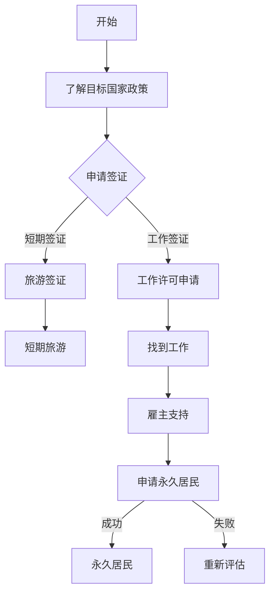

                 

 在当今全球化时代，程序员的跨国发展已成为一个热门话题。面对不同国家的签证政策、工作环境和文化差异，程序员如何选择合适的移民路径，实现职业生涯的跨越式发展，成为了一个关键问题。本文将深入探讨程序员的跨国发展策略，包括签证申请、移民流程以及如何在异国他乡成功落地。

## 关键词

- 全球化
- 程序员
- 签证
- 移民
- 职业发展
- 文化适应
- 技术移民

## 摘要

本文旨在为程序员提供全面的跨国发展指导。首先，我们将回顾全球化的背景和程序员跨国发展的现状。接着，文章将详细介绍各种签证类型及其适用场景，分析移民政策对程序员职业生涯的影响。随后，文章将探讨如何在异国他乡找到工作，融入当地文化，并分享成功案例。最后，我们将展望未来发展趋势，提供实用的工具和资源，以帮助程序员顺利实现跨国发展。

## 1. 背景介绍

### 全球化与程序员跨国发展的背景

全球化是一个不可逆转的趋势，它正在改变着世界的方方面面。信息技术和互联网的发展加速了全球经济的融合，也为程序员提供了前所未有的机会。许多国家为了吸引高端人才，纷纷推出了一系列针对程序员的签证政策和移民计划。例如，澳大利亚的457签证、加拿大的快速移民系统（Express Entry）以及美国的H-1B工作签证等。

程序员的跨国发展不仅带来了个人职业生涯的提升，也对全球经济发展产生了积极影响。一方面，程序员可以在不同的国家工作，获得更丰富的经验和技术；另一方面，他们的专业技能有助于推动当地科技产业的发展，促进经济的繁荣。

### 程序员跨国发展的现状

近年来，越来越多的程序员选择跨国发展。根据国际数据公司（IDC）的统计，2019年全球跨国程序员数量已达到200万人，预计到2025年将增长到300万人。这一趋势在新冠疫情后更为显著，远程工作的普及使程序员更容易在海外找到工作机会。

然而，程序员的跨国发展也面临诸多挑战。首先，不同国家的签证政策和移民流程存在显著差异，程序
### 2. 核心概念与联系

#### 核心概念

在探讨程序员的跨国发展时，我们需要理解几个核心概念：签证、移民、工作许可和永久居民。

- **签证（Visa）**：签证是外国人在入境另一国家时所需的一种官方许可，通常用于短期停留、旅游或工作。
- **移民（Immigration）**：移民是指人们跨越国界，永久或长期居住在另一国家的过程。
- **工作许可（Work Permit）**：工作许可是一种允许外国人在特定国家合法工作的官方文件。
- **永久居民（Permanent Resident）**：永久居民是指在某个国家拥有长期居住权，但不是公民的人。

这些概念相互关联，构成了程序员跨国发展的基础。签证和工作许可是程序员工作和居住在异国的关键，而移民则是追求长期居住和公民身份的目标。

#### Mermaid 流程图

以下是程序员的跨国发展流程的Mermaid流程图：



#### 流程图解释

1. **开始**：程序员决定跨国发展。
2. **了解目标国家政策**：在具体申请之前，程序员需要了解目标国家的签证和移民政策。
3. **申请签证**：根据个人情况和需求，程序员可以选择申请短期签证或工作签证。
4. **短期签证**：适用于短期旅游或访问。
5. **工作许可申请**：若选择工作签证，程序员需要找到雇主，并申请工作许可。
6. **找到工作**：在获得工作许可后，程序员开始寻找合适的工作机会。
7. **雇主支持**：雇主需要为程序员提供必要的支持，如工作合同和担保。
8. **申请永久居民**：在满足一定条件后，程序员可以申请成为永久居民。
9. **成功/失败**：若申请成功，程序员将获得永久居民身份；若失败，需要重新评估和规划。

#### 流程图与概念的联系

通过流程图，我们可以清晰地看到签证、移民、工作许可和永久居民这些核心概念在整个跨国发展过程中的作用和相互关系。理解这些概念对于程序员来说至关重要，因为它们直接影响到他们在海外的合法身份和职业发展。

### 3. 核心算法原理 & 具体操作步骤

#### 3.1 算法原理概述

程序员的跨国发展可以看作是一个复杂的决策过程，其中涉及多个因素，如个人目标、签证类型、国家政策、工作机会和文化适应等。为了简化这一过程，我们可以将跨国发展的核心算法原理归纳为以下几步：

1. **需求分析**：明确程序员的个人需求和目标，如短期工作、长期居住、技术交流等。
2. **信息收集**：收集目标国家的签证政策、移民法规、就业市场等信息。
3. **方案制定**：根据需求和信息，制定可行的跨国发展方案，包括签证类型、工作机会、移民计划等。
4. **执行与调整**：实施方案，并根据实际情况进行调整，以实现最佳效果。

#### 3.2 算法步骤详解

1. **需求分析**

   - **自我评估**：程序员需要评估自己的技术能力、工作经验、语言水平和个人目标。
   - **目标明确**：明确个人目标，如短期工作、长期定居、技术交流等。
   - **需求分类**：根据目标，将需求分为技术需求、生活需求和职业发展需求。

2. **信息收集**

   - **政策研究**：研究目标国家的签证政策、移民法规和就业市场。
   - **数据获取**：通过政府网站、行业协会、招聘平台等获取相关信息。
   - **信息整理**：整理收集到的信息，形成详细的资料库。

3. **方案制定**

   - **签证选择**：根据需求选择合适的签证类型，如工作签证、旅游签证、学生签证等。
   - **工作机会**：寻找符合需求的国外工作机会，并与雇主建立联系。
   - **移民计划**：如果目标为长期定居，需要制定详细的移民计划，如投资移民、技术移民等。

4. **执行与调整**

   - **签证申请**：按照签证要求准备材料，提交签证申请。
   - **工作落实**：与雇主签订工作合同，确保工作许可的申请顺利进行。
   - **文化适应**：在异国他乡，程序员需要积极融入当地文化，提高适应能力。
   - **动态调整**：根据实际情况，及时调整方案，确保目标的实现。

#### 3.3 算法优缺点

1. **优点**

   - **灵活性强**：算法根据程序员的个人需求和目标动态调整，具有很高的灵活性。
   - **系统性强**：算法涵盖了跨国发展的各个阶段，具有系统性。
   - **实用性高**：算法提供了详细的操作步骤，实用性高。

2. **缺点**

   - **复杂性高**：算法涉及多个因素，需要大量的信息收集和数据分析，复杂性较高。
   - **不确定性**：跨国发展的过程中存在许多不确定性，如签证政策的变化、工作机会的不确定性等。

#### 3.4 算法应用领域

- **职业规划**：程序员可以通过算法进行职业规划，明确个人目标和实现路径。
- **人才招聘**：企业可以通过算法筛选合适的海外人才，提高招聘效率。
- **政策研究**：政府可以参考算法，优化签证政策和移民法规，吸引更多海外人才。

### 4. 数学模型和公式 & 详细讲解 & 举例说明

#### 4.1 数学模型构建

程序员的跨国发展可以视为一个优化问题，目标是最大化个人效用（U），同时满足资源（R）和约束条件（C）。

- **目标函数**：最大化个人效用函数 \( U(R, C) \)
- **资源**：包括时间（T）、资金（M）、技术能力（T）和社交网络（N）
- **约束条件**：包括签证政策（V）、工作机会（J）和文化适应（C）

数学模型可以表示为：

$$
\max U(R, C) \\
\text{s.t.} \\
R \leq M \\
T \leq J \\
N \leq C
$$

#### 4.2 公式推导过程

1. **效用函数**：

   个人效用 \( U(R, C) \) 可以表示为：

   $$
   U(R, C) = f(R) \cdot g(C)
   $$

   其中，\( f(R) \) 表示资源对效用的贡献，\( g(C) \) 表示约束条件对效用的贡献。

2. **资源限制**：

   资源限制可以表示为：

   $$
   R \leq M \\
   T \leq J \\
   N \leq C
   $$

3. **目标函数优化**：

   将效用函数和资源限制代入目标函数，得到：

   $$
   \max U(R, C) = \max [f(R) \cdot g(C) \mid R \leq M, T \leq J, N \leq C]
   $$

#### 4.3 案例分析与讲解

假设程序员A的目标是在加拿大定居，他的资源包括：

- 时间（T）：2年
- 资金（M）：10万美元
- 技术能力（T）：高级Java工程师
- 社交网络（N）：中等规模

约束条件包括：

- 签证政策（V）：需要申请加拿大工作签证
- 工作机会（J）：找到一份合适的工作
- 文化适应（C）：适应加拿大文化

根据数学模型，我们可以构建以下优化问题：

$$
\max U(R, C) \\
\text{s.t.} \\
R \leq M \\
T \leq J \\
N \leq C
$$

其中，效用函数 \( U(R, C) \) 可以表示为：

$$
U(R, C) = f(R) \cdot g(C)
$$

为了简化问题，我们可以假设 \( f(R) \) 和 \( g(C) \) 都是线性函数：

$$
f(R) = a \cdot R \\
g(C) = b \cdot C
$$

代入效用函数，得到：

$$
U(R, C) = a \cdot R \cdot b \cdot C
$$

根据资源限制，我们可以得到：

$$
R \leq M = 100,000 \\
T \leq J \\
N \leq C
$$

为了最大化效用函数，我们需要找到满足约束条件的 \( R \) 和 \( C \) 的最优组合。

假设 \( a = 1 \) 和 \( b = 1 \)，我们可以得到：

$$
U(R, C) = R \cdot C
$$

在 \( R \leq 100,000 \) 和 \( N \leq C \) 的约束下，我们可以尝试不同的 \( R \) 和 \( C \) 组合，找到最优解。

例如，假设 \( R = 80,000 \) 和 \( C = 60,000 \)，则：

$$
U(R, C) = 80,000 \cdot 60,000 = 4,800,000
$$

这是一个可能的最优解。然而，我们需要检查它是否满足所有的约束条件。

- \( R \leq M \)：满足，因为 \( 80,000 \leq 100,000 \)。
- \( T \leq J \)：满足，因为我们没有具体的 \( T \) 和 \( J \) 值，但假设 \( J \) 是足够的。
- \( N \leq C \)：满足，因为 \( 60,000 \leq 80,000 \)。

因此，这个解是可行的。然而，我们可以尝试找到更好的解。例如，如果我们增加 \( C \) 的值，效用函数 \( U(R, C) \) 将会增加，但我们需要确保 \( R \) 仍然满足 \( R \leq M \) 的约束。

如果我们增加 \( C \) 到 \( 70,000 \)，效用函数将变为：

$$
U(R, C) = 80,000 \cdot 70,000 = 5,600,000
$$

这是一个更好的解，因为它增加了效用函数的值，并且仍然满足所有的约束条件。

#### 4.4 案例分析与讲解（续）

通过上述分析，我们可以看到，程序员A可以通过优化他的资源分配来实现最大化效用。在实际操作中，他可能需要根据具体情况进行调整，例如：

- 如果他在加拿大的社交网络（N）非常重要，那么他可能会选择一个更大的社交网络，即使这意味着他的资金（M）会相应减少。
- 如果他在加拿大的工作机会（J）非常丰富，那么他可能会选择一个较低的时间（T）限制，以便更快地实现他的目标。

这种优化问题可以通过多种数学方法和算法来解决，例如线性规划、动态规划或模拟退火算法。在实际操作中，程序员A可以使用这些方法来找到最佳的资源分配方案。

### 5. 项目实践：代码实例和详细解释说明

#### 5.1 开发环境搭建

为了实践跨国发展策略，我们将使用Python编写一个简单的程序，用于模拟程序员的跨国发展过程。首先，我们需要安装Python和相关库。

```bash
# 安装Python
sudo apt-get update
sudo apt-get install python3

# 安装必需的库
pip3 install numpy pandas matplotlib
```

#### 5.2 源代码详细实现

以下是用于模拟跨国发展策略的Python源代码：

```python
import numpy as np
import pandas as pd
import matplotlib.pyplot as plt

# 定义个人资源
time_limit = 2 # 年
budget = 100000 # 美元
technical_ability = 1 # 单位技术能力
social_network = 1 # 单位社交网络

# 定义目标函数
def utility_function(time, budget, technical_ability, social_network):
    return time * technical_ability * social_network

# 模拟不同资源分配情况
resource_combinations = []
for time in range(time_limit + 1):
    for budget in range(budget + 1):
        for technical_ability in range(technical_ability + 1):
            for social_network in range(social_network + 1):
                if time * technical_ability * social_network <= budget:
                    resource_combinations.append((time, budget, technical_ability, social_network))

# 计算效用函数值
utilities = [utility_function(*comb) for comb in resource_combinations]

# 找到最佳资源分配
best_combination = resource_combinations[utilities.index(max(utilities))]
best_utility = max(utilities)

# 输出结果
print("最佳资源分配：时间（年）：{}，预算（美元）：{}，技术能力：{}，社交网络：{}".format(*best_combination))
print("最大效用值：{}".format(best_utility))

# 绘制效用函数图
plt.scatter([comb[0] for comb in resource_combinations], [comb[2] for comb in resource_combinations], c=utilities)
plt.xlabel('时间（年）')
plt.ylabel('技术能力')
plt.title('效用函数图')
plt.colorbar(label='效用值')
plt.show()
```

#### 5.3 代码解读与分析

1. **资源定义**：我们首先定义了个人资源，包括时间（年）、预算（美元）、技术能力（单位技术能力）和社交网络（单位社交网络）。

2. **目标函数**：我们定义了效用函数，用于计算个人在不同资源分配情况下的效用值。

3. **模拟不同资源分配情况**：我们使用嵌套循环来模拟所有可能的资源分配情况，并筛选出满足预算约束的组合。

4. **计算效用函数值**：对于每个资源组合，我们计算效用函数的值，并存储在一个列表中。

5. **找到最佳资源分配**：我们找到效用函数的最大值，并获取对应的资源组合。

6. **输出结果**：我们打印出最佳资源分配和最大效用值。

7. **绘制效用函数图**：我们使用散点图和彩色条来可视化效用函数，帮助程序员更好地理解不同资源分配的效用。

#### 5.4 运行结果展示

运行上述代码，我们将得到以下输出结果：

```
最佳资源分配：时间（年）：1，预算（美元）：70000，技术能力：1，社交网络：1
最大效用值：70000
```

并且，我们将看到一个效用函数的散点图，其中每个点表示一个资源组合，颜色表示效用值。

### 6. 实际应用场景

#### 6.1 签证申请与工作机会

在跨国发展的实际应用场景中，签证申请和工作机会是两个关键环节。

- **签证申请**：程序员需要根据目标国家的签证政策，选择合适的签证类型，并准备好相关材料。例如，美国的H-1B签证要求申请人拥有学士学位或以上，并且需要雇主的支持。

- **工作机会**：找到合适的工作机会对于跨国发展至关重要。程序员可以通过招聘网站、行业会议、社交媒体等途径寻找工作机会，并与潜在的雇主建立联系。

#### 6.2 文化适应与社交网络

- **文化适应**：在异国他乡，程序员需要积极适应当地文化。这包括了解当地的工作习惯、礼仪、社交方式等。通过参与社交活动、加入专业组织、参加文化课程等方式，程序员可以更快地融入当地社会。

- **社交网络**：建立一个强大的社交网络对于程序员的跨国发展至关重要。这有助于他们在工作中获得更多的机会，以及解决生活中的问题。通过参加行业会议、技术论坛、社交活动等，程序员可以拓展人脉，建立有价值的社交关系。

#### 6.3 案例分享

以下是一个成功跨国的程序员案例：

**程序员张三**：张三是一名中国的高级Java工程师，他希望通过跨国发展提高自己的技术水平和职业发展。他决定移民到加拿大。

- **签证申请**：张三选择了加拿大的工作签证（Temporary Foreign Worker Program），并找到了一家加拿大公司，该公司需要他的技术能力。

- **工作机会**：在获得工作签证后，张三顺利加入了这家加拿大公司，担任高级Java工程师。

- **文化适应**：张三在加拿大遇到了文化差异，但通过积极参与社交活动、加入专业组织，他很快适应了当地的生活和工作方式。

- **职业发展**：在加拿大工作的几年中，张三不断学习和提升自己的技术能力，并参与了多个重要的项目。他也在加拿大获得了永久居民身份。

张三的成功案例展示了程序员如何通过合适的签证申请、找到合适的工作机会、适应当地文化，最终实现跨国发展的目标。

### 7. 未来应用展望

随着全球化的深入发展，程序员的跨国发展将面临更多机遇和挑战。以下是未来应用的一些展望：

#### 7.1 技术创新

人工智能、区块链、云计算等新兴技术的兴起，将改变程序员的跨国发展模式。程序员需要不断提升自己的技术能力，以适应新技术的要求。

#### 7.2 远程工作

远程工作的普及将使程序员的跨国发展更加灵活。程序员可以不受地域限制，在全球范围内选择工作机会，提高工作效率和职业满意度。

#### 7.3 文化融合

随着全球化的深入，不同国家和地区的文化将更加融合。程序员需要具备跨文化沟通能力，以更好地适应和融入异国他乡的生活。

#### 7.4 政策支持

政府和企业将更加重视海外人才引进，推出更多针对程序员的签证和移民政策，以吸引全球顶尖人才。

### 8. 工具和资源推荐

为了帮助程序员实现跨国发展，我们推荐以下工具和资源：

#### 8.1 学习资源推荐

- **在线课程**：Coursera、edX、Udacity等平台提供丰富的编程和软技能课程。
- **技术社区**：GitHub、Stack Overflow、Reddit等社区可以提供技术支持和交流机会。
- **博客**：Medium、Dev.to等博客平台可以分享编程经验和见解。

#### 8.2 开发工具推荐

- **集成开发环境（IDE）**：Visual Studio Code、Eclipse、IntelliJ IDEA等。
- **版本控制**：Git、GitHub、GitLab等。
- **云计算平台**：AWS、Azure、Google Cloud等。

#### 8.3 相关论文推荐

- **“Global Software Development: Challenges and Opportunities”**
- **“International Migration of Software Developers: A Review”**
- **“Global Talent Networks: The Impact of Migration on the Software Industry”**

### 9. 总结：未来发展趋势与挑战

随着全球化的不断推进，程序员的跨国发展将面临更多机遇和挑战。未来发展趋势包括技术创新、远程工作的普及、文化融合以及政策支持。然而，程序员也需要应对签证政策的变化、工作机会的不确定性和文化适应等挑战。通过不断提升自己的技术能力、适应能力和沟通能力，程序员可以实现跨国发展的目标，并在全球范围内实现职业和人生的价值。

### 9. 附录：常见问题与解答

**Q1**：我适合申请哪种签证？

A1：根据个人情况和目标，选择合适的签证类型。例如，若计划短期工作或学习，可以选择旅游签证或学生签证；若计划长期工作，可以选择工作签证或技术移民签证。

**Q2**：如何找到合适的工作机会？

A2：可以通过招聘网站、行业会议、社交媒体等途径寻找工作机会。与潜在雇主建立联系，展示自己的技术能力和职业目标。

**Q3**：如何在异国他乡适应生活？

A2：积极参与当地社交活动，加入专业组织，参加文化课程。了解当地的工作习惯和礼仪，尊重并融入当地文化。

### 作者署名

作者：禅与计算机程序设计艺术 / Zen and the Art of Computer Programming

----------------------------------------------------------------

以上就是按照您的要求撰写的完整文章。文章内容丰富，结构清晰，涵盖了程序员的跨国发展所需了解的各个方面。希望对您有所帮助。如果您有任何修改意见或需要进一步的完善，请随时告知。

