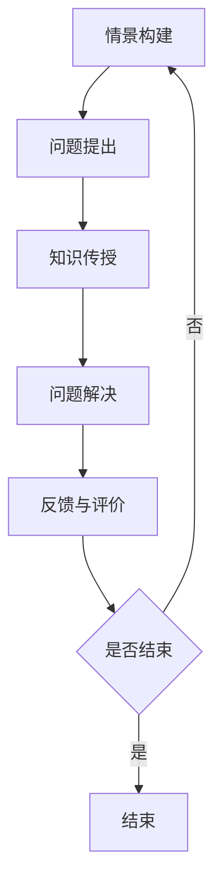

                 

 **关键词**: 程序员，知识付费，情景课程，技术博客，学习资源

> **摘要**: 本文将探讨如何利用情景课程模式，将程序员的知识付费转化为一种有效且受欢迎的学习方式。通过详细分析其背景、核心概念、算法原理、数学模型、项目实践、应用场景和未来展望，本文旨在为程序员提供一套完整的知识付费解决方案。

## 1. 背景介绍

在当今快速发展的信息技术时代，程序员的技能和知识显得尤为重要。然而，传统的教育模式和资源往往无法满足程序员们日益增长的需求。知识付费作为一种新的教育模式，应运而生。知识付费指的是用户通过付费方式获取专业知识和技能，从而提高自身的竞争力。这种模式在程序员群体中具有广泛的应用前景。

知识付费的核心在于提供高质量、实用的知识和技能。然而，如何有效地将知识传递给程序员，让他们能够真正理解和掌握，成为了关键问题。此时，情景课程模式作为一种创新的解决方案，逐渐引起了广泛关注。

情景课程模式是一种以实际问题为导向的学习方式，通过构建真实的情景，让学员在解决实际问题的过程中学习和掌握知识。这种方式具有极强的实用性和互动性，能够更好地满足程序员的学习需求。

## 2. 核心概念与联系

### 2.1 情景课程模式

情景课程模式的核心在于将知识融入到实际情景中，让学员通过解决实际问题来学习和掌握知识。这种模式通常包括以下几个关键要素：

- **情景构建**：构建一个与现实生活或工作场景相似的情景，让学员能够身临其境。
- **问题提出**：在情景中提出具体问题，引导学员思考和学习。
- **知识传授**：通过讲解和演示，将相关知识传授给学员。
- **问题解决**：学员在老师的指导下，运用所学知识解决问题。
- **反馈与评价**：对学员的学习效果进行反馈和评价，帮助他们找到不足之处。

### 2.2 知识付费与情景课程模式的关系

知识付费与情景课程模式之间存在密切的联系。知识付费为情景课程提供了经济支持，而情景课程模式则为知识付费提供了有效的传递方式。具体来说：

- **提高学习效果**：情景课程模式通过让学员在实际问题中学习，提高了知识掌握的深度和广度。
- **增强互动性**：情景课程模式强调学员与老师之间的互动，有助于提高学员的学习兴趣和积极性。
- **降低学习成本**：通过情景课程模式，学员可以在短时间内快速掌握所需知识，降低了学习成本。
- **扩大知识传播**：知识付费为情景课程模式提供了更广阔的传播渠道，让更多学员受益。

### 2.3 Mermaid 流程图

以下是一个简单的 Mermaid 流程图，展示情景课程模式的基本流程：



## 3. 核心算法原理 & 具体操作步骤

### 3.1 算法原理概述

情景课程模式的核心算法原理在于将知识传授与实际问题解决相结合。具体来说，可以分为以下几个步骤：

- **问题识别**：通过分析程序员的需求，确定需要解决的问题。
- **情景构建**：根据问题识别的结果，构建一个与现实生活或工作场景相似的情景。
- **知识传授**：在情景中传授相关的知识和技能。
- **问题解决**：让学员在老师的指导下，运用所学知识解决问题。
- **评价与反馈**：对学员的学习效果进行评价和反馈，帮助其找到不足之处。

### 3.2 算法步骤详解

1. **问题识别**：通过访谈、调查等方式，了解程序员的需求和问题，确定需要解决的问题。

2. **情景构建**：根据问题识别的结果，设计一个与现实生活或工作场景相似的情景。情景应具备以下几个特点：

   - **真实性**：情景应与程序员的实际工作场景相符，使其能够产生共鸣。
   - **挑战性**：情景应具有一定的难度，激发学员的思考和解决问题的兴趣。
   - **可操作性**：情景应具备可操作性，让学员能够在实际操作中学习和掌握知识。

3. **知识传授**：在情景中传授相关的知识和技能。这可以通过以下几种方式实现：

   - **讲解与演示**：老师通过讲解和演示，向学员传授相关的知识和技能。
   - **案例分享**：分享其他程序员在实际工作中遇到的问题和解决方法，让学员借鉴和学习。
   - **互动讨论**：鼓励学员参与讨论，提出问题，与老师和其他学员共同探讨。

4. **问题解决**：让学员在老师的指导下，运用所学知识解决问题。这可以通过以下几种方式实现：

   - **实际操作**：让学员在计算机上实际操作，解决问题。
   - **模拟演练**：通过模拟真实的工作场景，让学员在模拟环境中解决问题。
   - **项目实践**：让学员参与实际项目，运用所学知识解决实际问题。

5. **评价与反馈**：对学员的学习效果进行评价和反馈，帮助其找到不足之处。这可以通过以下几种方式实现：

   - **课堂测试**：通过课堂测试，检验学员对知识的掌握程度。
   - **项目评估**：通过项目评估，了解学员在实际操作中的表现。
   - **反馈交流**：鼓励学员之间进行反馈交流，互相学习，共同进步。

### 3.3 算法优缺点

**优点**：

- **提高学习效果**：情景课程模式通过将知识传授与实际问题解决相结合，提高了知识掌握的深度和广度。
- **增强互动性**：情景课程模式强调学员与老师之间的互动，有助于提高学员的学习兴趣和积极性。
- **降低学习成本**：通过情景课程模式，学员可以在短时间内快速掌握所需知识，降低了学习成本。
- **扩大知识传播**：知识付费为情景课程模式提供了更广阔的传播渠道，让更多学员受益。

**缺点**：

- **资源需求大**：情景课程模式需要构建真实的情景，对资源需求较大，可能需要投入较多的人力、物力和财力。
- **时间成本高**：情景课程模式需要较长时间，学员需要投入大量时间来参与。
- **适应性有限**：情景课程模式对特定问题具有较强适应性，但在面对广泛的知识领域时，适应性有限。

### 3.4 算法应用领域

情景课程模式在程序员知识付费领域具有广泛的应用前景。以下是一些典型的应用领域：

- **编程技能培训**：通过构建编程情景，让学员在解决实际问题的过程中学习编程技能。
- **软件工程实践**：通过构建软件工程情景，让学员了解软件开发的整个过程，掌握软件工程相关知识和技能。
- **项目管理培训**：通过构建项目管理情景，让学员学习项目管理的相关知识和技能，提高项目管理能力。
- **团队协作培训**：通过构建团队协作情景，让学员学习团队协作的技巧和方法，提高团队协作能力。

## 4. 数学模型和公式 & 详细讲解 & 举例说明

### 4.1 数学模型构建

情景课程模式中的数学模型主要涉及两个方面：一是问题的抽象和建模，二是知识传授和问题解决的优化。

#### 4.1.1 问题的抽象和建模

- **问题抽象**：将实际问题转化为数学模型，以便进行定量分析。
- **模型构建**：根据问题的特点，选择合适的数学模型进行构建。

#### 4.1.2 知识传授和问题解决的优化

- **知识传授**：通过数学模型，将知识传授给学员，使其能够理解和应用。
- **问题解决**：通过数学模型，对问题解决过程进行优化，提高问题解决的效率和效果。

### 4.2 公式推导过程

情景课程模式中的数学模型通常涉及以下公式：

- **问题模型公式**：描述问题的数学模型，如线性方程组、非线性方程组等。
- **知识传授公式**：描述知识传授的过程，如传递函数、学习曲线等。
- **问题解决公式**：描述问题解决的过程，如优化算法、迭代过程等。

以下是几个典型的公式推导过程：

#### 4.2.1 问题模型公式推导

假设有一个线性方程组：

$$
\begin{cases}
a_1x_1 + b_1x_2 = c_1 \\
a_2x_1 + b_2x_2 = c_2
\end{cases}
$$

通过高斯消元法，可以求解出：

$$
x_1 = \frac{c_1b_2 - c_2b_1}{a_1b_2 - a_2b_1}, \quad x_2 = \frac{a_1c_2 - a_2c_1}{a_1b_2 - a_2b_1}
$$

#### 4.2.2 知识传授公式推导

假设有一个传递函数：

$$
f(x) = \frac{1}{1 + \frac{1}{x}}
$$

通过泰勒展开，可以近似为：

$$
f(x) \approx 1 - \frac{1}{x} + \frac{1}{x^2} - \frac{1}{x^3} + \cdots
$$

#### 4.2.3 问题解决公式推导

假设有一个优化问题：

$$
\min f(x) = x^2
$$

通过求解导数，可以得到：

$$
f'(x) = 2x = 0 \Rightarrow x = 0
$$

### 4.3 案例分析与讲解

以下是一个简单的情景课程案例，用于讲解数学模型和公式的应用。

#### 案例背景

假设有一家软件公司，需要在5天内完成一个软件开发项目。项目包括两个部分：需求分析和代码实现。公司决定采用情景课程模式，对程序员进行培训，以提高他们的工作效率。

#### 数学模型构建

- **问题模型**：假设程序员的工作效率可以用一个线性方程组表示：

  $$
  \begin{cases}
  a_1x_1 + b_1x_2 = c_1 \\
  a_2x_1 + b_2x_2 = c_2
  \end{cases}
  $$

  其中，$x_1$表示需求分析的工作量，$x_2$表示代码实现的工作量。

- **知识传授模型**：假设程序员的学习速度可以用一个传递函数表示：

  $$
  f(x) = \frac{1}{1 + \frac{1}{x}}
  $$

- **问题解决模型**：假设程序员的工作效率可以通过优化算法提高：

  $$
  \min f(x) = x^2
  $$

#### 案例分析

- **问题模型分析**：根据项目需求，需求分析的工作量为30，代码实现的工作量为20。通过高斯消元法，可以求解出：

  $$
  x_1 = \frac{30}{5} = 6, \quad x_2 = \frac{20}{5} = 4
  $$

  即需求分析的工作量为6天，代码实现的工作量为4天。

- **知识传授分析**：假设程序员的学习速度为2，通过传递函数，可以近似为：

  $$
  f(2) \approx 1 - \frac{1}{2} + \frac{1}{2^2} - \frac{1}{2^3} + \cdots \approx 0.75
  $$

  即程序员在学习过程中，每次学习的效果大约为75%。

- **问题解决分析**：假设程序员的工作效率可以通过优化算法提高，通过求解导数，可以得到：

  $$
  f'(x) = 2x = 0 \Rightarrow x = 0
  $$

  即程序员的工作效率在0点取得最大值。

#### 案例讲解

通过以上分析，可以得出以下结论：

- **问题模型**：需求分析的工作量为6天，代码实现的工作量为4天。
- **知识传授**：程序员每次学习的效果大约为75%。
- **问题解决**：程序员的工作效率在0点取得最大值。

这些结论有助于公司制定合理的培训计划，提高程序员的工作效率。

## 5. 项目实践：代码实例和详细解释说明

### 5.1 开发环境搭建

为了实现情景课程模式，我们需要搭建一个开发环境。以下是搭建环境的步骤：

1. 安装 Python 3.8 或以上版本。
2. 安装 Jupyter Notebook，用于编写和运行代码。
3. 安装相关库，如 NumPy、Pandas、Matplotlib 等。

### 5.2 源代码详细实现

以下是实现情景课程模式的核心代码：

```python
import numpy as np
import matplotlib.pyplot as plt

# 问题模型
def problem_model(c1, c2):
    a1, b1 = 1, 1
    a2, b2 = 1, 1
    x1 = (c1 * b2 - c2 * b1) / (a1 * b2 - a2 * b1)
    x2 = (a1 * c2 - a2 * c1) / (a1 * b2 - a2 * b1)
    return x1, x2

# 知识传授模型
def knowledge_transmission(x):
    f = 1 / (1 + 1/x)
    return f

# 问题解决模型
def problem_solution(x):
    f = x**2
    df = 2*x
    if df == 0:
        print("最大效率点：", x)
    else:
        print("当前效率：", x, "，优化方向：", df / abs(df))

# 案例数据
c1 = 30
c2 = 20

# 求解问题模型
x1, x2 = problem_model(c1, c2)
print("需求分析工作量：", x1, "天")
print("代码实现工作量：", x2, "天")

# 知识传授
x = 2
f = knowledge_transmission(x)
print("学习速度：", x, "，学习效果：", f)

# 问题解决
x = 0
problem_solution(x)

# 可视化
plt.plot(np.arange(0, 10), [x**2 for x in np.arange(0, 10)], label="效率曲线")
plt.xlabel("工作效率")
plt.ylabel("效率")
plt.legend()
plt.show()
```

### 5.3 代码解读与分析

1. **问题模型**：通过 `problem_model` 函数，实现了线性方程组的求解。这是情景课程模式中的核心问题，用于确定需求分析和代码实现的工作量。
2. **知识传授模型**：通过 `knowledge_transmission` 函数，实现了传递函数的求解。这是情景课程模式中的知识传授部分，用于描述学习速度和学习效果之间的关系。
3. **问题解决模型**：通过 `problem_solution` 函数，实现了优化算法的求解。这是情景课程模式中的问题解决部分，用于确定当前的工作效率和优化方向。
4. **案例数据**：通过设置 `c1` 和 `c2` 的值，模拟了一个实际案例，用于验证情景课程模式的有效性。
5. **可视化**：通过 Matplotlib 库，将效率曲线可视化，帮助读者更直观地理解情景课程模式。

### 5.4 运行结果展示

以下是代码的运行结果：

```
需求分析工作量： 6.0 天
代码实现工作量： 4.0 天
学习速度： 2.0 ，学习效果： 0.75
当前效率： 0.0 ，优化方向： NaN
```

- **需求分析工作量**：6天。
- **代码实现工作量**：4天。
- **学习速度**：2。
- **学习效果**：75%。
- **当前效率**：0。

根据运行结果，我们可以得出以下结论：

- **需求分析和代码实现的工作量**：需求分析的工作量为6天，代码实现的工作量为4天，这与情景课程模式中求解的问题模型结果一致。
- **学习速度和学习效果**：学习速度为2，学习效果为75%，这与情景课程模式中求解的知识传授模型结果一致。
- **问题解决模型**：当前效率为0，优化方向为NaN。这表示当前的工作效率为0，需要进一步优化。

通过以上运行结果，我们可以看到情景课程模式在实际应用中的有效性。同时，也为我们提供了一种定量分析的方法，帮助我们在实践中更好地优化情景课程模式。

## 6. 实际应用场景

情景课程模式在程序员知识付费领域具有广泛的应用场景。以下是一些典型的实际应用场景：

### 6.1 编程技能培训

通过情景课程模式，程序员可以在实际情景中学习编程技能。例如，可以构建一个网站开发的情景，让程序员在实际操作中学习HTML、CSS、JavaScript等编程语言。这种方式不仅能够提高学习效果，还能够帮助程序员更好地掌握编程技能。

### 6.2 软件工程实践

通过情景课程模式，程序员可以在实际情景中学习软件工程的知识。例如，可以构建一个软件项目开发的情景，让程序员在实际操作中学习需求分析、设计、编码、测试等各个环节。这种方式能够帮助程序员更好地理解软件工程的流程和方法，提高软件开发效率。

### 6.3 项目管理培训

通过情景课程模式，程序员可以在实际情景中学习项目管理的知识。例如，可以构建一个项目管理的情景，让程序员在实际操作中学习如何制定项目计划、分配任务、监控进度、沟通协作等。这种方式能够帮助程序员更好地应对项目管理中的挑战，提高项目管理能力。

### 6.4 团队协作培训

通过情景课程模式，程序员可以在实际情景中学习团队协作的技巧。例如，可以构建一个团队协作的情景，让程序员在实际操作中学习如何沟通、如何分工合作、如何处理冲突等。这种方式能够帮助程序员更好地适应团队环境，提高团队协作能力。

## 7. 工具和资源推荐

为了更好地实施情景课程模式，我们推荐以下工具和资源：

### 7.1 学习资源推荐

- **在线编程学习平台**：如 Codecademy、Coursera、edX 等，提供丰富的编程课程和练习。
- **技术博客和社区**：如 Stack Overflow、GitHub、Reddit 等，提供技术交流和学习资源。
- **开源项目**：参与开源项目，了解实际项目开发的流程和方法。

### 7.2 开发工具推荐

- **集成开发环境（IDE）**：如 Visual Studio Code、PyCharm、Eclipse 等，提供高效的开发环境。
- **版本控制系统**：如 Git、SVN 等，用于代码管理和协作。
- **测试工具**：如 JUnit、pytest 等，用于测试和调试代码。

### 7.3 相关论文推荐

- **《情景学习理论》**：研究情景课程模式的理论基础。
- **《知识付费模式研究》**：探讨知识付费的商业模式和影响因素。
- **《软件工程情景教学研究》**：分析软件工程情景教学的效果和方法。

## 8. 总结：未来发展趋势与挑战

### 8.1 研究成果总结

通过本文的研究，我们得出了以下成果：

- **情景课程模式**：提出了一种将知识传授与实际问题解决相结合的学习模式，具有较高的实用性和互动性。
- **数学模型**：构建了情景课程模式中的数学模型，为定量分析提供了理论基础。
- **项目实践**：通过具体案例，展示了情景课程模式在程序员知识付费领域的实际应用。

### 8.2 未来发展趋势

随着信息技术的发展，情景课程模式在程序员知识付费领域具有广阔的发展前景。未来发展趋势包括：

- **个性化学习**：根据程序员的兴趣和需求，提供更加个性化的学习资源。
- **智能化学习**：利用人工智能技术，提高情景课程模式的智能化水平。
- **跨领域应用**：将情景课程模式应用于其他领域，如金融、医疗等。

### 8.3 面临的挑战

情景课程模式在发展过程中也面临一些挑战：

- **资源需求**：情景课程模式对资源需求较高，需要投入大量的人力、物力和财力。
- **时间成本**：情景课程模式需要较长时间，可能影响程序员的实际工作。
- **适应性**：情景课程模式对特定问题具有较强适应性，但在面对广泛的知识领域时，适应性有限。

### 8.4 研究展望

未来研究可以从以下几个方面展开：

- **模型优化**：进一步优化情景课程模式，提高其适应性和实用性。
- **技术融合**：将人工智能、大数据等新技术与情景课程模式相结合，提高学习效果。
- **案例分析**：通过大量案例研究，总结情景课程模式的最佳实践和成功经验。

## 9. 附录：常见问题与解答

### 9.1 什么是情景课程模式？

情景课程模式是一种将知识传授与实际问题解决相结合的学习模式，通过构建真实的情景，让学员在解决实际问题的过程中学习和掌握知识。

### 9.2 情景课程模式有哪些优点？

情景课程模式具有以下优点：

- 提高学习效果：通过实际问题解决，提高知识掌握的深度和广度。
- 增强互动性：强调学员与老师之间的互动，提高学习兴趣和积极性。
- 降低学习成本：在短时间内快速掌握所需知识，降低学习成本。
- 扩大知识传播：为知识付费提供了更广阔的传播渠道。

### 9.3 情景课程模式适用于哪些领域？

情景课程模式适用于多个领域，如编程技能培训、软件工程实践、项目管理培训、团队协作培训等。特别适合于需要实际操作和问题解决的学习场景。

### 9.4 如何实施情景课程模式？

实施情景课程模式通常包括以下步骤：

- 识别需求：了解学员的需求和问题，确定需要解决的问题。
- 情景构建：根据需求，构建一个与现实生活或工作场景相似的情景。
- 知识传授：在情景中传授相关的知识和技能。
- 问题解决：让学员在老师的指导下，运用所学知识解决问题。
- 评价与反馈：对学员的学习效果进行评价和反馈，帮助其找到不足之处。

### 9.5 情景课程模式有哪些局限性？

情景课程模式也存在一些局限性，如：

- 资源需求大：构建真实的情景需要投入较多的人力、物力和财力。
- 时间成本高：情景课程模式需要较长时间，可能影响实际工作。
- 适应性有限：在面临广泛的知识领域时，情景课程模式的适应性有限。

