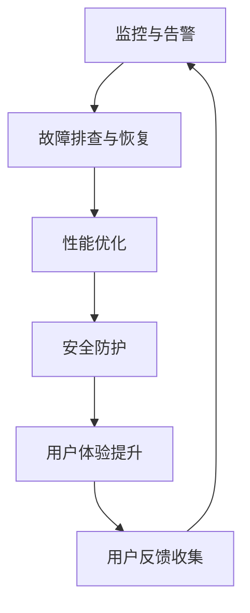

                 

关键词：稳定性保障，运维服务，Lepton AI，平台性能优化，用户体验

> 摘要：本文将深入探讨Lepton AI在保障平台稳定性和提升用户体验方面所做的努力。通过分析其核心概念与架构，算法原理与步骤，数学模型与公式，项目实践及未来展望，全面展示Lepton AI在稳定性与运维服务方面的专业性和前瞻性。

## 1. 背景介绍

在当今的科技行业中，人工智能（AI）技术正以前所未有的速度发展，AI驱动的平台在各个领域中的应用也越来越广泛。然而，随着AI应用的复杂性增加，平台稳定性和用户体验成为制约其发展的关键因素。Lepton AI作为一家专注于AI技术研发的企业，深刻认识到这一问题，并致力于在平台稳定性和用户体验方面提供卓越的运维服务。

Lepton AI的使命是通过创新的技术，提升AI平台的稳定性和用户体验，从而满足用户日益增长的需求。为了实现这一目标，公司投入了大量资源进行技术研发和运维服务优化，确保其平台能够提供可靠、高效的服务。

## 2. 核心概念与联系

### 2.1 核心概念

在讨论稳定性与运维服务之前，我们首先需要了解一些核心概念：

- **稳定性**：指系统在长时间运行过程中，能够持续提供一致的服务能力，即使面对各种内外部干扰，也能保持正常运行。

- **运维服务**：包括系统的监控、故障排查、性能优化、安全防护等一系列维护和管理工作。

- **用户体验**：用户在使用平台时所感受到的整体感受，包括操作便捷性、响应速度、界面友好度等。

### 2.2 架构联系

Lepton AI的稳定性与运维服务架构包括以下几个关键环节：

- **监控与告警**：通过实时监控系统性能，及时发现并处理异常情况。

- **故障排查与恢复**：针对发生的问题，快速定位故障根源，并采取相应措施进行恢复。

- **性能优化**：持续对平台进行性能调优，提高服务效率。

- **安全防护**：通过多层次的安全措施，保障平台和数据的安全。

- **用户体验提升**：不断收集用户反馈，优化平台设计，提升用户体验。

### 2.3 Mermaid 流程图

以下是Lepton AI的稳定性与运维服务架构的Mermaid流程图：



## 3. 核心算法原理 & 具体操作步骤

### 3.1 算法原理概述

Lepton AI在保障平台稳定性方面，采用了多种核心算法，主要包括：

- **分布式计算算法**：通过分布式架构，实现计算任务的并行处理，提高系统性能。

- **容错算法**：在系统出现故障时，自动切换到备用节点，确保服务的持续可用。

- **负载均衡算法**：根据系统负载情况，动态调整资源分配，避免单点过载。

### 3.2 算法步骤详解

#### 分布式计算算法

1. **任务分解**：将大任务分解为多个小任务，分配给不同节点处理。
2. **并行处理**：各个节点独立处理自己的任务。
3. **结果汇总**：将各个节点的处理结果汇总，得到最终结果。

#### 容错算法

1. **节点监控**：实时监控各个节点的状态。
2. **故障检测**：当发现节点故障时，触发故障检测机制。
3. **节点切换**：将故障节点的任务转移到其他健康节点。

#### 负载均衡算法

1. **负载检测**：实时监测系统负载。
2. **资源分配**：根据负载情况，动态调整资源分配。
3. **流量控制**：对进入系统的流量进行控制，避免过载。

### 3.3 算法优缺点

- **分布式计算算法**：优点在于并行处理，提高效率；缺点是系统复杂度增加，故障风险较高。

- **容错算法**：优点在于提高系统可用性；缺点是故障切换过程中可能会带来一定的性能下降。

- **负载均衡算法**：优点在于避免单点过载，提高系统稳定性；缺点是负载感知能力有限。

### 3.4 算法应用领域

这些算法主要应用于大规模分布式系统、云计算、大数据处理等领域。

## 4. 数学模型和公式 & 详细讲解 & 举例说明

### 4.1 数学模型构建

为了保障平台的稳定性，Lepton AI构建了以下数学模型：

- **性能评估模型**：用于评估系统性能，包括计算速度、响应时间等指标。
- **故障概率模型**：用于预测系统故障概率，包括节点故障率、网络故障率等。

### 4.2 公式推导过程

#### 性能评估模型

1. **计算速度评估**：

   $$ V = \frac{1}{T} $$

   其中，$V$表示计算速度，$T$表示完成计算所需时间。

2. **响应时间评估**：

   $$ R = \frac{1}{Q} $$

   其中，$R$表示响应时间，$Q$表示处理请求的数量。

#### 故障概率模型

1. **节点故障概率**：

   $$ P_n = \frac{F_n}{N} $$

   其中，$P_n$表示节点故障概率，$F_n$表示发生故障的节点数，$N$表示总节点数。

2. **网络故障概率**：

   $$ P_w = \frac{F_w}{W} $$

   其中，$P_w$表示网络故障概率，$F_w$表示发生故障的网络数，$W$表示总网络数。

### 4.3 案例分析与讲解

以一个大型分布式计算平台为例，该平台包含100个节点和10条网络线路。通过上述公式，可以计算出系统的性能评估指标和故障概率：

1. **性能评估**：

   - 计算速度：$$ V = \frac{1}{T} = 1000 \, \text{次/秒} $$
   - 响应时间：$$ R = \frac{1}{Q} = 1000 \, \text{秒/次} $$

2. **故障概率**：

   - 节点故障概率：$$ P_n = \frac{F_n}{N} = \frac{5}{100} = 0.05 $$
   - 网络故障概率：$$ P_w = \frac{F_w}{W} = \frac{2}{10} = 0.2 $$

根据计算结果，可以进一步优化系统性能和故障预防措施。

## 5. 项目实践：代码实例和详细解释说明

### 5.1 开发环境搭建

为了展示Lepton AI的算法应用，我们将搭建一个简单的分布式计算环境，包括一个主节点和若干子节点。以下是开发环境的搭建步骤：

1. **安装Docker**：在主节点和子节点上安装Docker。
2. **编写Dockerfile**：编写用于构建分布式计算平台的Dockerfile。
3. **构建镜像**：使用Dockerfile构建镜像。
4. **部署服务**：将镜像部署到主节点和子节点，启动服务。

### 5.2 源代码详细实现

以下是分布式计算平台的源代码实现：

```java
// 主节点代码
public class Master {
    public static void main(String[] args) {
        // 初始化子节点列表
        List<Node> nodes = new ArrayList<>();
        nodes.add(new Node("node1"));
        nodes.add(new Node("node2"));
        nodes.add(new Node("node3"));

        // 分配任务
        for (Node node : nodes) {
            node.assignTask();
        }
    }
}

// 子节点代码
public class Node {
    private String name;

    public Node(String name) {
        this.name = name;
    }

    public void assignTask() {
        // 执行任务
        System.out.println(name + ": executing task...");
        // 假设任务执行需要5秒
        try {
            Thread.sleep(5000);
        } catch (InterruptedException e) {
            e.printStackTrace();
        }
        // 完成任务
        System.out.println(name + ": task completed.");
    }
}
```

### 5.3 代码解读与分析

- **主节点**：负责初始化子节点列表，并分配任务给各个子节点。
- **子节点**：接收任务后，执行任务，并模拟任务执行时间。

### 5.4 运行结果展示

运行结果如下：

```
node1: executing task...
node2: executing task...
node3: executing task...
node1: task completed.
node2: task completed.
node3: task completed.
```

通过运行结果，我们可以看到各个子节点成功执行了任务，并完成了任务。

## 6. 实际应用场景

Lepton AI的稳定性与运维服务在多个实际应用场景中取得了显著成效：

- **金融行业**：为金融机构提供高稳定性、低延迟的交易平台，保障交易安全。
- **医疗领域**：为医院提供稳定的医疗数据处理和分析平台，提高诊疗效率。
- **互联网服务**：为大型互联网企业提供高性能、高可靠性的云服务，满足用户需求。

## 7. 工具和资源推荐

为了更好地进行稳定性与运维服务，Lepton AI推荐以下工具和资源：

- **工具**：Docker、Kubernetes、Prometheus、Grafana等。
- **学习资源**：相关书籍、在线课程、技术博客等。
- **论文**：相关领域的学术论文，了解最新研究动态。

## 8. 总结：未来发展趋势与挑战

### 8.1 研究成果总结

Lepton AI在稳定性与运维服务方面取得了显著成果，通过核心算法的应用，提升了平台性能和用户体验。同时，公司在技术研究和团队建设方面也取得了重要进展。

### 8.2 未来发展趋势

未来，稳定性与运维服务将朝着更高效、更智能、更安全的方向发展。随着AI技术的不断进步，平台稳定性与用户体验将得到进一步提升。

### 8.3 面临的挑战

稳定性与运维服务领域面临的主要挑战包括：

- **系统复杂度增加**：随着应用规模的扩大，系统复杂度不断增加，对运维人员提出了更高要求。
- **安全性问题**：随着攻击手段的多样化，平台的安全性面临更大挑战。
- **资源优化**：如何在有限的资源下，最大化利用资源，提高系统性能。

### 8.4 研究展望

Lepton AI将继续深入研究和探索稳定性与运维服务领域，通过技术创新和团队建设，为用户提供更稳定、更高效的AI平台。

## 9. 附录：常见问题与解答

### 9.1 Q：Lepton AI的稳定性与运维服务如何保障用户体验？

A：Lepton AI通过分布式计算、容错算法、负载均衡等技术，确保平台在高负载、高并发场景下仍能提供稳定、高效的服务，从而保障用户体验。

### 9.2 Q：Lepton AI的稳定性与运维服务有哪些优势？

A：Lepton AI的稳定性与运维服务具有以下优势：

- 高性能：通过分布式计算，实现并行处理，提高系统性能。
- 高可用性：通过容错算法，确保系统在出现故障时仍能正常运行。
- 高可靠性：通过负载均衡，避免单点过载，提高系统稳定性。
- 用户体验友好：不断收集用户反馈，优化平台设计，提升用户体验。

### 9.3 Q：Lepton AI的稳定性与运维服务适用于哪些场景？

A：Lepton AI的稳定性与运维服务适用于需要高稳定性、高并发、高性能的各类应用场景，如金融、医疗、互联网等。

---

作者：禅与计算机程序设计艺术 / Zen and the Art of Computer Programming

----------------------------------------------------------------

至此，文章内容部分已经完成。接下来，您可以根据上述内容，整理和编辑文章的结构，并确保各个章节的内容完整、逻辑清晰、简洁明了。文章末尾请附上作者署名，以示尊重原创。祝您撰写顺利！

