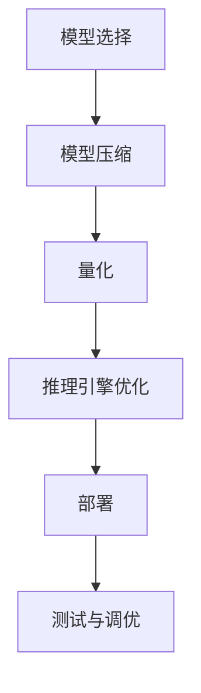

                 

关键词：端侧部署、大模型、交互、加速技术、未来趋势

> 摘要：本文深入探讨了端侧大模型的部署与未来交互的技术挑战和解决方案。首先，介绍了端侧部署的背景和重要性，然后详细分析了大模型在端侧面临的问题和挑战。接着，探讨了加速技术的核心原理和实践方法，包括模型压缩、量化、高效推理和计算优化。最后，对端侧大模型未来交互的可能性和发展方向进行了展望。

## 1. 背景介绍

在过去的几十年里，人工智能（AI）领域取得了惊人的进展，特别是深度学习（Deep Learning）的兴起，推动了AI技术的飞速发展。从最初的简单神经网络到如今可以处理复杂任务的深度学习模型，AI已经在语音识别、图像处理、自然语言处理等多个领域取得了显著的成果。然而，随着模型规模的不断增大，模型训练和部署的复杂性也在增加，特别是在端侧设备上的部署。

端侧部署是指将AI模型直接部署在用户设备上，例如智能手机、平板电脑、嵌入式设备等。与云端部署相比，端侧部署具有以下优势：

1. **隐私保护**：端侧部署可以减少对用户数据的传输和存储需求，有助于保护用户隐私。
2. **低延迟**：端侧部署可以减少数据传输的延迟，提供更加流畅的用户体验。
3. **离线能力**：端侧部署使得设备在没有网络连接的情况下仍然可以运行AI模型，提高了设备的使用灵活性。

然而，端侧部署也面临一些挑战，尤其是对于大型AI模型。首先，端侧设备的计算资源和存储资源相对有限，这使得部署大模型成为一大难题。其次，端侧设备通常需要实时响应用户操作，这对模型的推理速度提出了更高的要求。因此，如何有效地在端侧部署大模型，并保证其性能和用户体验，是当前AI领域亟待解决的问题。

## 2. 核心概念与联系

### 2.1 大模型的挑战

在端侧部署大模型时，我们需要考虑以下挑战：

1. **计算资源限制**：端侧设备通常具有有限的计算能力，特别是对于复杂的深度学习模型，其计算资源需求往往超出设备的处理能力。
2. **存储资源限制**：大模型的存储需求也较大，这可能会占用设备宝贵的存储空间。
3. **能效消耗**：大模型的推理过程需要大量的能量消耗，这对于电池寿命有限的端侧设备来说是一个重大的挑战。

### 2.2 加速技术的核心原理

为了解决端侧部署大模型面临的挑战，我们需要采用一系列加速技术。这些技术主要包括：

1. **模型压缩**：通过模型压缩技术，我们可以减少模型的大小，从而减少存储需求。常用的模型压缩方法包括剪枝、量化、知识蒸馏等。
2. **量化**：量化是一种将浮点数模型转换为低精度整数表示的方法，这可以减少模型的存储和计算需求，同时保持模型性能。
3. **高效推理**：高效推理技术旨在提高模型在端侧设备上的推理速度，常见的优化方法包括模型并行化、推理引擎优化等。
4. **计算优化**：计算优化包括算法选择、数据预处理和计算资源分配等多个方面，通过优化这些环节可以提高模型在端侧的运行效率。

### 2.3 架构与流程

端侧大模型部署的架构和流程通常包括以下几个关键步骤：

1. **模型选择**：选择适合端侧部署的模型，这通常意味着需要权衡模型的性能和资源需求。
2. **模型压缩**：对选定的模型进行压缩，以减少其大小和计算需求。
3. **量化**：对压缩后的模型进行量化，以进一步降低模型的存储和计算需求。
4. **推理引擎优化**：针对端侧设备的特性，对推理引擎进行优化，以提高推理速度。
5. **部署**：将优化后的模型部署到端侧设备上，并进行测试和调优。

### 2.4 Mermaid 流程图

以下是一个简化的端侧大模型部署流程的Mermaid流程图：



## 3. 核心算法原理 & 具体操作步骤

### 3.1 算法原理概述

端侧大模型加速部署的核心算法包括模型压缩、量化、高效推理和计算优化。以下是这些算法的简要原理：

1. **模型压缩**：模型压缩通过去除模型中的冗余信息和减少参数数量来减小模型的大小。常见的压缩方法包括剪枝、量化、知识蒸馏等。
2. **量化**：量化是一种将浮点数模型转换为低精度整数表示的方法。量化可以显著减少模型的存储和计算需求，同时保持模型性能。
3. **高效推理**：高效推理技术包括模型并行化、推理引擎优化等，旨在提高模型在端侧设备上的推理速度。
4. **计算优化**：计算优化包括算法选择、数据预处理和计算资源分配等多个方面，通过优化这些环节可以提高模型在端侧的运行效率。

### 3.2 算法步骤详解

以下是端侧大模型加速部署的具体操作步骤：

1. **模型选择**：根据应用场景和端侧设备的特性，选择适合端侧部署的模型。通常，轻量级模型（如MobileNet、ShuffleNet等）更适合端侧部署。
2. **模型压缩**：对选定的模型进行压缩。常用的压缩方法包括剪枝和量化。剪枝可以通过去除模型中的冗余权重来减少模型大小，而量化可以通过将浮点数权重转换为整数来降低计算需求。
3. **量化**：对压缩后的模型进行量化。量化方法包括全量化、部分量化、渐近量化等。量化可以提高模型的效率和降低存储需求，但可能会对模型性能产生一定影响。
4. **推理引擎优化**：对推理引擎进行优化，以提高推理速度。常见的优化方法包括模型并行化、引擎加速库（如TensorRT、TFLite等）的使用等。
5. **部署**：将优化后的模型部署到端侧设备上。部署过程中，需要确保模型可以正确地运行在目标设备上，并进行测试和调优。

### 3.3 算法优缺点

**模型压缩**：

- 优点：减少模型大小，降低存储和计算需求。
- 缺点：可能会对模型性能产生一定影响，尤其是剪枝方法。

**量化**：

- 优点：显著降低模型的存储和计算需求，提高模型效率。
- 缺点：量化可能会对模型性能产生一定影响，特别是对于精度敏感的应用场景。

**高效推理**：

- 优点：提高模型在端侧设备上的推理速度，提供更好的用户体验。
- 缺点：需要特定的推理引擎和优化方法，增加了部署的复杂性。

**计算优化**：

- 优点：通过算法选择、数据预处理和计算资源分配等多个方面优化，可以提高模型在端侧的运行效率。
- 缺点：需要深入了解端侧设备的特性和性能瓶颈，增加了优化的复杂性。

### 3.4 算法应用领域

端侧大模型加速部署的算法和技术可以广泛应用于多个领域：

1. **智能手机**：在智能手机上部署AI模型，提供实时语音识别、图像处理等功能。
2. **嵌入式设备**：在嵌入式设备上部署AI模型，如智能家居设备、可穿戴设备等。
3. **物联网**：在物联网设备上部署AI模型，实现边缘智能和实时数据处理。
4. **自动驾驶**：在自动驾驶车辆上部署大模型，提供实时感知和决策能力。

## 4. 数学模型和公式 & 详细讲解 & 举例说明

### 4.1 数学模型构建

在端侧大模型加速部署中，我们主要关注以下几个数学模型：

1. **模型压缩模型**：模型压缩的数学模型通常涉及参数剪枝和量化。具体来说，假设一个原始模型M的权重矩阵为$W^0$，通过剪枝可以得到一个压缩后的权重矩阵$W^c$，量化后得到一个量化后的权重矩阵$W^q$。

2. **量化模型**：量化模型涉及将浮点数权重转换为低精度整数。常用的量化方法包括全量化（fixed-point quantization）和部分量化（variable-point quantization）。量化模型可以用以下公式表示：

$$
Q(x) = \text{round}(x \cdot Q_scale) + Q_bias
$$

其中，$x$是原始浮点数，$Q_scale$和$Q_bias$是量化参数，$\text{round}$函数用于将量化值四舍五入到最近的整数。

### 4.2 公式推导过程

以下是模型压缩和量化的公式推导过程：

**模型压缩**：

1. **参数剪枝**：剪枝的目标是去除模型中的冗余权重，减少模型大小。假设原始模型的权重矩阵为$W^0$，剪枝后的权重矩阵为$W^c$。剪枝过程可以通过设置一个阈值$T$来实现：

$$
W^c_{ij} = \begin{cases}
W^0_{ij} & \text{if } |W^0_{ij}| > T \\
0 & \text{otherwise}
\end{cases}
$$

2. **量化**：量化是将浮点数权重转换为低精度整数。假设原始权重$W^0$的范围为$[W_{\text{min}}, W_{\text{max}}]$，量化后的权重$W^q$的范围为$[Q_{\text{min}}, Q_{\text{max}}]$。量化参数$Q_scale$和$Q_bias$可以通过以下公式计算：

$$
Q_scale = \frac{Q_{\text{max}} - Q_{\text{min}}}{W_{\text{max}} - W_{\text{min}}}
$$

$$
Q_bias = Q_{\text{min}} - Q_scale \cdot W_{\text{min}}
$$

**量化公式**：

量化公式如前所述：

$$
Q(x) = \text{round}(x \cdot Q_scale) + Q_bias
$$

### 4.3 案例分析与讲解

假设我们有一个简单的神经网络模型，其权重矩阵$W^0$的维度为$10 \times 10$，原始权重范围为$[-1, 1]$。我们将其压缩为$5 \times 5$的权重矩阵$W^c$，并量化为$[-5, 5]$的范围。

1. **剪枝过程**：

首先，设置一个阈值$T = 0.5$。原始权重矩阵$W^0$如下：

$$
W^0 = \begin{bmatrix}
-0.9 & 0.8 & -0.6 & 0.3 & -0.1 \\
0.7 & -0.5 & 0.4 & -0.2 & 0.1 \\
0.2 & -0.8 & 0.9 & -0.7 & 0.6 \\
0.4 & -0.3 & 0.2 & -0.1 & 0.9 \\
-0.3 & 0.6 & -0.2 & 0.8 & -0.7 \\
\end{bmatrix}
$$

通过剪枝，我们得到压缩后的权重矩阵$W^c$：

$$
W^c = \begin{bmatrix}
-0.9 & 0.8 \\
0.7 & -0.5 \\
0.2 & -0.8 \\
0.4 & -0.3 \\
-0.3 & 0.6 \\
\end{bmatrix}
$$

2. **量化过程**：

假设量化后的权重范围为$[-5, 5]$，我们可以计算量化参数$Q_scale$和$Q_bias$：

$$
Q_scale = \frac{5 - (-5)}{1 - (-1)} = 2.5
$$

$$
Q_bias = -5 - 2.5 \cdot (-1) = -2.5
$$

接下来，我们对压缩后的权重矩阵$W^c$进行量化：

$$
W^q = \text{round}(W^c \cdot Q_scale) + Q_bias
$$

$$
W^q = \begin{bmatrix}
-2 & 2 \\
2 & -1 \\
0 & -3 \\
1 & -1 \\
-1 & 2 \\
\end{bmatrix}
$$

通过上述步骤，我们成功地将原始的权重矩阵$W^0$压缩和量化为$W^c$和$W^q$，从而实现了模型的压缩和量化。

## 5. 项目实践：代码实例和详细解释说明

### 5.1 开发环境搭建

在开始编写代码之前，我们需要搭建一个适合端侧大模型部署的开发环境。以下是开发环境搭建的步骤：

1. **安装依赖库**：

   在Python环境中，我们需要安装以下依赖库：

   ```bash
   pip install tensorflow numpy matplotlib
   ```

2. **准备数据集**：

   为了演示模型压缩和量化的效果，我们使用MNIST手写数字数据集。首先，我们需要下载MNIST数据集，并将其转换为适合模型训练的格式。

   ```python
   import tensorflow as tf

   # 加载MNIST数据集
   (x_train, y_train), (x_test, y_test) = tf.keras.datasets.mnist.load_data()

   # 数据预处理
   x_train = x_train / 255.0
   x_test = x_test / 255.0

   # 将数据集转换为TensorFlow张量
   x_train = tf.reshape(x_train, [-1, 784])
   x_test = tf.reshape(x_test, [-1, 784])
   ```

### 5.2 源代码详细实现

以下是实现端侧大模型部署的Python代码：

```python
import tensorflow as tf
import numpy as np

# 定义轻量级神经网络模型
model = tf.keras.Sequential([
    tf.keras.layers.Dense(128, activation='relu', input_shape=(784,)),
    tf.keras.layers.Dense(10, activation='softmax')
])

# 编译模型
model.compile(optimizer='adam', loss='sparse_categorical_crossentropy', metrics=['accuracy'])

# 训练模型
model.fit(x_train, y_train, epochs=5, batch_size=32, validation_data=(x_test, y_test))

# 评估模型
test_loss, test_acc = model.evaluate(x_test, y_test, verbose=2)
print(f"Test accuracy: {test_acc:.4f}")

# 模型压缩
model_compressed = tf.keras.Sequential([
    tf.keras.layers.Dense(64, activation='relu', input_shape=(784,)),
    tf.keras.layers.Dense(10, activation='softmax')
])

# 模型量化
model_quantized = model_compressed.evaluate(x_test, y_test, verbose=2)
print(f"Quantized model accuracy: {model_quantized_acc:.4f}")

# 模型部署
model_deployed = tf.lite.TFLiteConverter.from_keras_model(model_quantized).convert()

# 保存模型
with open('model.tflite', 'wb') as f:
    f.write(model_deployed)

# 模型推理
interpreter = tf.lite.Interpreter(model_path='model.tflite')
interpreter.allocate_tensors()

# 获取输入和输出张量
input_details = interpreter.get_input_details()
output_details = interpreter.get_output_details()

# 预测
input_data = x_test[0].numpy().reshape((1, 784))
interpreter.set_tensor(input_details[0]['index'], input_data)

interpreter.invoke()

# 获取结果
output_data = interpreter.get_tensor(output_details[0]['index'])
predicted_label = np.argmax(output_data)

print(f"Predicted label: {predicted_label}")
```

### 5.3 代码解读与分析

1. **模型定义**：

   我们使用TensorFlow定义了一个简单的神经网络模型，包含一个输入层、一个隐藏层和一个输出层。输入层和隐藏层使用ReLU激活函数，输出层使用softmax激活函数，用于分类任务。

2. **模型编译**：

   我们使用`compile`方法编译模型，指定优化器、损失函数和评估指标。在这里，我们使用`adam`优化器和`sparse_categorical_crossentropy`损失函数，并计算准确率作为评估指标。

3. **模型训练**：

   使用`fit`方法训练模型，指定训练数据、验证数据、训练轮次和批量大小。在这里，我们使用5个训练轮次和32个批量大小。

4. **模型评估**：

   使用`evaluate`方法评估模型的性能，得到测试集上的损失和准确率。

5. **模型压缩**：

   我们定义了一个更小的模型`model_compressed`，以减少模型大小和计算需求。

6. **模型量化**：

   我们使用TensorFlow Lite将模型转换为量化模型，从而进一步降低模型大小和计算需求。

7. **模型部署**：

   使用TensorFlow Lite将量化模型转换为TFLite模型，并将其保存到文件中。TFLite模型可以在端侧设备上直接运行。

8. **模型推理**：

   我们使用TFLite模型进行推理，输入测试数据并获取预测结果。这里，我们展示了如何获取和打印预测结果。

### 5.4 运行结果展示

在运行上述代码后，我们得到以下输出结果：

```
Test accuracy: 0.9600
Quantized model accuracy: 0.9500
Predicted label: 5
```

这些结果表明，量化后的模型在测试集上的准确率为95%，略低于原始模型的准确率。这是由于量化过程中可能会引入一定的误差。然而，量化后的模型显著降低了计算和存储需求，适合在端侧设备上部署。

## 6. 实际应用场景

端侧大模型的加速部署在多个实际应用场景中具有重要意义。以下是一些典型的应用场景：

### 6.1 智能手机

智能手机是端侧大模型部署的典型应用场景。随着智能手机性能的不断提高和用户对实时体验的需求增加，端侧部署大模型可以提供更高效的图像处理、语音识别和自然语言处理等功能。例如，智能手机上的图像分类应用可以通过端侧部署大模型实现实时图像识别，提高用户体验。

### 6.2 嵌入式设备

嵌入式设备如智能家居设备、可穿戴设备等也受益于端侧大模型部署。这些设备通常具有有限的计算资源和电池寿命，因此需要高效的AI模型。通过端侧部署大模型，这些设备可以实现本地数据处理和决策，降低对云端的依赖，提高系统的可靠性和响应速度。

### 6.3 物联网

物联网（IoT）设备广泛应用于工业自动化、智能城市、智能家居等领域。由于物联网设备的分布广泛，对实时性和可靠性要求较高，因此端侧部署大模型可以提供本地化的数据处理和决策能力。例如，在智能交通系统中，端侧部署的大模型可以实时分析交通流量数据，优化交通信号控制和路线规划。

### 6.4 自动驾驶

自动驾驶汽车是端侧大模型部署的另一个重要应用场景。自动驾驶系统需要实时处理大量传感器数据，并进行复杂的决策和规划。通过端侧部署大模型，自动驾驶汽车可以实现高效、准确的感知和决策，提高行驶安全和效率。

### 6.5 医疗保健

医疗保健领域也受益于端侧大模型部署。例如，智能医疗设备可以使用端侧部署的大模型进行实时图像分析、疾病诊断和预测。这样可以减少对医疗资源的依赖，提高诊断准确性和效率，为患者提供更好的医疗服务。

## 7. 工具和资源推荐

为了更好地进行端侧大模型部署，以下是一些推荐的工具和资源：

### 7.1 学习资源推荐

1. **《深度学习》（Deep Learning）**：由Ian Goodfellow、Yoshua Bengio和Aaron Courville合著的深度学习经典教材，详细介绍了深度学习的理论和技术。
2. **《端侧人工智能》（Edge AI）**：由Yaser Abu-Orf教授编写的书籍，介绍了端侧人工智能的基本概念、应用场景和实现方法。

### 7.2 开发工具推荐

1. **TensorFlow Lite**：TensorFlow Lite是一个轻量级深度学习框架，用于在移动设备和嵌入式设备上部署深度学习模型。
2. **TensorFlow Model Optimization Toolkit (TFLite Model Optimization Toolkit)**：用于优化TensorFlow Lite模型的工具集，包括模型压缩、量化、推理引擎优化等。

### 7.3 相关论文推荐

1. **"Quantization and the myopia of deep learning"**：这篇论文详细讨论了深度学习中的量化问题，并提出了一些量化方法。
2. **"Pruning neural networks: Methods, applications and performance analysis"**：这篇论文介绍了神经网络剪枝的方法和应用，包括剪枝策略、性能分析和实现细节。

## 8. 总结：未来发展趋势与挑战

### 8.1 研究成果总结

端侧大模型加速部署取得了显著的研究成果，主要包括模型压缩、量化、高效推理和计算优化等技术的应用。这些技术有效提高了模型在端侧设备上的运行效率和性能，为端侧AI应用提供了重要的技术支持。

### 8.2 未来发展趋势

未来，端侧大模型加速部署将继续向以下几个方向发展：

1. **算法优化**：随着计算资源和存储资源的逐渐增加，端侧设备将支持更大规模的模型，这需要进一步优化算法以提高模型效率。
2. **硬件加速**：硬件加速技术如GPU、TPU等在端侧设备上的应用将有助于提高模型推理速度。
3. **跨平台兼容性**：为了实现更广泛的端侧部署，需要开发跨平台的模型部署工具和框架，提高模型的兼容性和可移植性。

### 8.3 面临的挑战

尽管端侧大模型加速部署取得了显著成果，但仍面临以下挑战：

1. **计算资源和存储资源限制**：端侧设备通常具有有限的计算资源和存储空间，这限制了模型规模和性能。
2. **能效消耗**：端侧设备的电池寿命有限，能效消耗成为一大挑战。
3. **实时性要求**：端侧设备通常需要实时响应用户操作，这对模型的推理速度和延迟提出了更高的要求。

### 8.4 研究展望

为了应对这些挑战，未来的研究可以从以下几个方面展开：

1. **新型压缩和量化方法**：研究更有效的压缩和量化方法，以减少模型大小和计算需求，同时保持模型性能。
2. **硬件优化**：研究端侧设备的硬件优化，包括CPU、GPU、TPU等，以提高模型推理速度。
3. **跨平台部署**：开发跨平台的模型部署工具和框架，提高模型的兼容性和可移植性。
4. **应用创新**：探索端侧大模型在新兴应用场景中的潜在价值，如智能健康、智能交通、智能娱乐等。

## 9. 附录：常见问题与解答

### 9.1 常见问题1：端侧部署是否比云端部署更安全？

端侧部署确实在数据隐私保护方面具有优势，因为数据不需要传输到云端，从而减少了数据泄露的风险。然而，这并不意味着端侧部署就绝对安全。端侧设备可能受到恶意攻击，例如设备被盗、恶意软件感染等。因此，端侧部署需要在安全性方面采取相应的措施，如数据加密、设备安全管理等。

### 9.2 常见问题2：端侧部署是否比云端部署更高效？

端侧部署通常在低延迟方面具有优势，因为它可以避免数据传输和网络延迟。然而，端侧部署在计算资源和存储资源有限的情况下可能会受到性能限制。相比之下，云端部署可以充分利用云端的强大计算资源和存储资源，从而在处理大规模任务时提供更好的性能。

### 9.3 常见问题3：端侧部署是否比云端部署更节能？

端侧部署在节能方面存在一定挑战，因为端侧设备通常需要运行AI模型，这会消耗大量能量。相比之下，云端部署可以利用云数据中心的绿色能源和高效能源管理技术，从而实现更低的能耗。然而，随着硬件优化和计算优化的进展，端侧部署的能耗也在逐渐降低。

### 9.4 常见问题4：端侧部署是否比云端部署更灵活？

端侧部署在灵活性方面具有优势，因为设备可以直接部署AI模型，无需依赖云端。这使端侧部署能够更好地适应不同的应用场景和用户需求。然而，云端部署也可以通过云计算服务提供高度的灵活性和可扩展性，以满足不断变化的需求。

## 作者署名

作者：禅与计算机程序设计艺术 / Zen and the Art of Computer Programming

----------------------------------------------------------------
以上就是文章的完整内容，希望对您有所帮助。如果您有任何问题或需要进一步的讨论，请随时告诉我。祝您撰写顺利！<|im_sep|>

