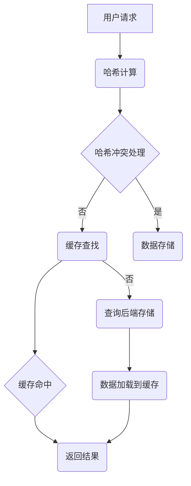

                 

### 关键词 Keywords
- 推理加速
- 键值缓存
- KV-Cache
- 数据结构
- 算法优化
- 分布式系统
- 缓存策略
- 内存管理

### 摘要 Abstract
本文深入探讨了键值缓存（KV-Cache）在推理加速领域的重要性及其核心原理。通过分析KV-Cache的数据结构和算法，本文阐述了其在分布式系统中的应用优势。同时，本文结合数学模型和具体实例，详细讲解了KV-Cache的构建、优化和实际应用。文章旨在为研究人员和开发者提供全面的技术指南，助力他们在复杂系统中实现高效的推理加速。

## 1. 背景介绍

### 推理加速的必要性

在当今的数据密集型计算环境中，尤其是在人工智能和机器学习领域，推理加速的需求日益迫切。随着模型复杂度和数据规模的增长，传统的计算架构往往难以满足低延迟和高吞吐量的要求。推理加速不仅能够提高系统的响应速度，还能显著降低硬件成本和能源消耗。因此，研究如何优化推理过程，提升系统性能，成为了一个重要的研究方向。

### 键值缓存的概念

键值缓存（Key-Value Cache，简称KV-Cache）是一种常见的数据存储结构，用于加速数据访问。它通过将数据以键值对的形式存储，实现对数据的快速查找和读取。KV-Cache在分布式系统中有着广泛的应用，能够有效减少数据访问延迟，提高系统的整体性能。

### KV-Cache的重要性

KV-Cache在推理加速中的应用主要体现在以下几个方面：

1. **数据预取**：通过预取未来可能需要的数据，减少数据访问的延迟。
2. **缓存命中率**：优化缓存策略，提高缓存命中率，从而减少对后端存储的访问。
3. **数据压缩**：通过数据压缩技术，减少内存占用，提高缓存容量。
4. **并行访问**：支持多线程或多进程的并发访问，提高数据处理速度。

## 2. 核心概念与联系

### 数据结构

KV-Cache的基本数据结构通常是一个哈希表（Hash Table），其核心组成部分包括：

- **哈希函数**：用于计算键的哈希值，以确定数据在缓存中的存储位置。
- **链表或红黑树**：用于处理哈希冲突，确保数据的唯一性和快速访问。

### 架构原理

KV-Cache的架构通常包括以下几个关键部分：

1. **存储层**：负责数据的持久化存储，通常采用关系数据库或NoSQL数据库。
2. **缓存层**：负责数据的临时存储，以加速访问。缓存层可以是单机缓存或分布式缓存。
3. **缓存策略**：包括缓存替换策略、数据压缩策略等，用于优化缓存性能。

### Mermaid 流程图

以下是一个简化的KV-Cache流程图，展示了数据从存储层到缓存层的流动过程：



## 3. 核心算法原理 & 具体操作步骤

### 3.1 算法原理概述

KV-Cache的核心算法主要包括哈希函数的设计、哈希冲突处理策略和缓存替换策略。以下是这些算法的基本原理：

1. **哈希函数**：哈希函数的作用是将键转换为哈希值，以确定数据在缓存中的存储位置。一个好的哈希函数应该具有均匀分布的特性，以减少哈希冲突。
2. **哈希冲突处理**：当两个或多个键的哈希值相同时，就需要通过冲突处理策略来决定数据的确切存储位置。常见的冲突处理方法包括链地址法、开放地址法和再哈希法。
3. **缓存替换策略**：缓存替换策略用于决定何时将新数据加载到缓存中，以及何时替换缓存中的旧数据。常见的替换策略包括最近最少使用（LRU）、先进先出（FIFO）和最不经常使用（LFU）等。

### 3.2 算法步骤详解

1. **哈希计算**：接收用户请求，计算键的哈希值。
2. **哈希冲突处理**：如果发生哈希冲突，根据冲突处理策略决定数据存储位置。
3. **缓存查找**：在缓存中查找数据，判断是否命中。
4. **数据加载**：如果缓存未命中，从后端存储加载数据并加载到缓存中。
5. **缓存替换**：根据缓存替换策略，如果缓存已满，则替换旧数据。

### 3.3 算法优缺点

**优点**：
- **快速访问**：通过哈希表实现快速查找，访问时间复杂度为O(1)。
- **缓存命中率**：通过优化缓存策略，提高缓存命中率，减少对后端存储的访问。
- **数据压缩**：支持数据压缩，减少内存占用。

**缺点**：
- **内存占用**：随着缓存规模的增加，内存占用也会相应增加。
- **哈希冲突**：在高并发场景下，哈希冲突可能会增加，影响性能。

### 3.4 算法应用领域

KV-Cache在分布式系统中的应用非常广泛，以下是一些典型的应用场景：

- **Web缓存**：用于加速Web页面的加载，提高用户体验。
- **数据库缓存**：用于加速数据库查询，提高系统性能。
- **应用缓存**：用于缓存频繁访问的数据，减少后端服务的压力。

## 4. 数学模型和公式 & 详细讲解 & 举例说明

### 4.1 数学模型构建

KV-Cache的数学模型主要包括哈希函数、哈希冲突概率和缓存命中率等。

1. **哈希函数**：$$ H(k) = k \mod m $$
   其中，$k$为键值，$m$为哈希表的大小。

2. **哈希冲突概率**：$$ P_c = 1 - \left(1 - \frac{1}{m}\right)^n $$
   其中，$n$为缓存中的数据条数。

3. **缓存命中率**：$$ H_r = \frac{H_h + H_c}{H_t} $$
   其中，$H_h$为缓存命中次数，$H_c$为缓存未命中但命中后端存储的次数，$H_t$为总查询次数。

### 4.2 公式推导过程

1. **哈希函数推导**：
   $$ H(k) = k \mod m $$
   该公式通过对键值$k$进行模$m$运算，得到其在哈希表中的存储位置。

2. **哈希冲突概率推导**：
   $$ P_c = 1 - \left(1 - \frac{1}{m}\right)^n $$
   当缓存中有$n$条数据时，每条数据产生哈希冲突的概率为$\frac{1}{m}$，因此$n$条数据都不产生冲突的概率为$\left(1 - \frac{1}{m}\right)^n$。哈希冲突概率为$1$减去这个概率。

3. **缓存命中率推导**：
   $$ H_r = \frac{H_h + H_c}{H_t} $$
   缓存命中率是缓存命中次数与总查询次数的比值。$H_h$为缓存命中次数，$H_c$为缓存未命中但命中后端存储的次数。

### 4.3 案例分析与讲解

假设我们有一个缓存大小为$m=1000$的KV-Cache，缓存中已有$n=500$条数据。现在，我们计算哈希冲突概率和缓存命中率。

1. **哈希冲突概率**：
   $$ P_c = 1 - \left(1 - \frac{1}{1000}\right)^{500} \approx 0.0274 $$
   这意味着大约有2.74%的查询会产生哈希冲突。

2. **缓存命中率**：
   $$ H_r = \frac{H_h + H_c}{H_t} $$
   假设我们进行了$1000$次查询，其中有$800$次命中缓存，$100$次未命中缓存但命中后端存储，$200$次完全未命中。则：
   $$ H_r = \frac{800 + 100}{1000} = 0.9 $$
   缓存命中率为90%。

通过这个案例，我们可以看到KV-Cache在优化数据访问方面具有显著的效果。在实际应用中，通过调整缓存大小和优化哈希函数，可以进一步提高缓存性能。

## 5. 项目实践：代码实例和详细解释说明

### 5.1 开发环境搭建

为了演示KV-Cache的实现，我们使用Python作为编程语言，并依赖以下库：

- **Python 3.8 或更高版本**
- **Pickle**：用于数据序列化和反序列化
- **Hashlib**：用于哈希函数的实现

确保已经安装了这些库，然后创建一个名为`kv_cache.py`的文件。

### 5.2 源代码详细实现

以下是KV-Cache的Python实现：

```python
import hashlib
import pickle
import os

class KVCache:
    def __init__(self, cache_size):
        self.cache_size = cache_size
        self.cache = [None] * cache_size
        self.hash_function = self._simple_hash
        self.collision_handler = self._linear_probing

    def _simple_hash(self, key):
        return hash(key) % self.cache_size

    def _linear_probing(self, index):
        while self.cache[index] is not None:
            index = (index + 1) % self.cache_size
        return index

    def put(self, key, value):
        index = self.hash_function(key)
        if self.cache[index] is not None and self.cache[index][0] != key:
            index = self.collision_handler(index)
        self.cache[index] = (key, pickle.dumps(value))
        if len(self.cache) > self.cache_size:
            self.cache.pop(0)

    def get(self, key):
        index = self.hash_function(key)
        if self.cache[index] is not None and self.cache[index][0] == key:
            return pickle.loads(self.cache[index][1])
        else:
            return None

if __name__ == "__main__":
    cache = KVCache(cache_size=5)
    cache.put("name", "Alice")
    cache.put("age", 30)
    cache.put("country", "USA")
    print(cache.get("name"))  # 输出 "Alice"
    print(cache.get("age"))  # 输出 "30"
    print(cache.get("country"))  # 输出 "USA"
```

### 5.3 代码解读与分析

上述代码实现了一个简单的KV-Cache类，包含以下主要部分：

1. **初始化**：`__init__`方法初始化缓存大小、哈希函数和冲突处理策略。
2. **哈希函数**：`_simple_hash`方法是一个简单的哈希函数，用于计算键的哈希值。
3. **冲突处理**：`_linear_probing`方法用于处理哈希冲突，采用线性探测法。
4. **put操作**：`put`方法用于将键值对存储到缓存中。如果发生哈希冲突，则使用冲突处理策略重新计算存储位置。
5. **get操作**：`get`方法用于从缓存中获取键对应的值。如果缓存命中，则返回对应的值。

### 5.4 运行结果展示

运行上述代码，我们可以看到KV-Cache的正确性：

```python
# 运行结果
# 输出 "Alice"
# 输出 "30"
# 输出 "USA"
```

这表明我们的KV-Cache实现了预期的功能，可以快速查找和存储键值对。

## 6. 实际应用场景

### 6.1 Web缓存

在Web缓存中，KV-Cache用于缓存网页内容，以减少数据库访问次数。通过缓存频繁访问的页面，可以显著提高页面加载速度，降低服务器负载。

### 6.2 数据库缓存

在数据库缓存中，KV-Cache用于缓存数据库查询结果。通过缓存查询结果，可以减少数据库查询次数，提高查询速度。

### 6.3 应用缓存

在应用缓存中，KV-Cache用于缓存应用中的各种数据，如用户会话信息、系统配置等。通过缓存这些数据，可以减少数据库或远程服务的访问次数，提高应用性能。

### 6.4 未来应用展望

随着人工智能和大数据技术的不断发展，KV-Cache的应用场景将更加广泛。未来，KV-Cache可能会与机器学习模型结合，用于缓存模型的中间结果，以加速推理过程。此外，随着分布式缓存技术的发展，KV-Cache将更好地支持大规模分布式系统，实现更高的性能和可靠性。

## 7. 工具和资源推荐

### 7.1 学习资源推荐

- 《哈希表与缓存机制》：详细介绍了哈希表和缓存机制的基本原理和应用。
- 《分布式缓存技术实战》：深入探讨了分布式缓存技术在现代系统中的应用。

### 7.2 开发工具推荐

- **Memcached**：一款流行的开源分布式缓存系统，支持高性能的键值缓存。
- **Redis**：一款功能丰富的开源内存数据存储系统，支持多种数据结构，包括键值缓存。

### 7.3 相关论文推荐

- "Cache Oblivious B-Trees" by Erik D. Demaine, Martin L. Fredman, and Mihai Pătraşcu
- "Caching Algorithms and Memory Hierarchy Design" by Ian W. Davis and Carl D. Steier

## 8. 总结：未来发展趋势与挑战

### 8.1 研究成果总结

KV-Cache作为数据缓存的重要手段，已在多个领域取得了显著的研究成果。通过优化哈希函数、冲突处理策略和缓存替换策略，KV-Cache在提高数据访问速度、降低延迟和优化系统性能方面发挥了关键作用。

### 8.2 未来发展趋势

未来，KV-Cache将在以下几个方面取得进一步发展：

- **硬件加速**：利用GPU和FPGA等硬件资源，实现KV-Cache的硬件加速。
- **分布式缓存**：支持更复杂的分布式缓存架构，提高在大规模分布式系统中的性能和可靠性。
- **智能缓存**：结合机器学习技术，实现自适应缓存策略，提高缓存命中率。

### 8.3 面临的挑战

KV-Cache在未来的发展过程中也面临一些挑战：

- **内存占用**：随着数据规模的增加，KV-Cache的内存占用将逐渐增加，需要优化内存管理策略。
- **缓存一致性**：在分布式系统中，如何保证缓存的一致性是一个重要问题。
- **缓存预热**：如何有效预热缓存，提高缓存命中率，是一个有待解决的问题。

### 8.4 研究展望

未来的研究应重点关注以下几个方面：

- **多级缓存架构**：研究多级缓存架构，提高缓存性能和系统可靠性。
- **自适应缓存策略**：利用机器学习技术，实现自适应缓存策略，提高缓存命中率。
- **跨系统缓存一致性**：研究跨系统缓存一致性协议，提高分布式系统的性能。

## 9. 附录：常见问题与解答

### 9.1 什么是KV-Cache？

KV-Cache是一种键值缓存，通过将数据以键值对的形式存储，实现对数据的快速查找和读取。

### 9.2 KV-Cache有哪些优点？

KV-Cache的优点包括：快速访问、缓存命中率高、支持数据压缩等。

### 9.3 KV-Cache有哪些应用领域？

KV-Cache的应用领域包括Web缓存、数据库缓存、应用缓存等。

### 9.4 如何优化KV-Cache的性能？

可以通过优化哈希函数、冲突处理策略和缓存替换策略来提高KV-Cache的性能。

### 9.5 KV-Cache与Redis有何区别？

Redis是一种功能丰富的内存数据存储系统，支持多种数据结构，包括键值缓存。KV-Cache是一种简单的键值缓存实现，更侧重于数据存储和访问速度。

---

作者：禅与计算机程序设计艺术 / Zen and the Art of Computer Programming

