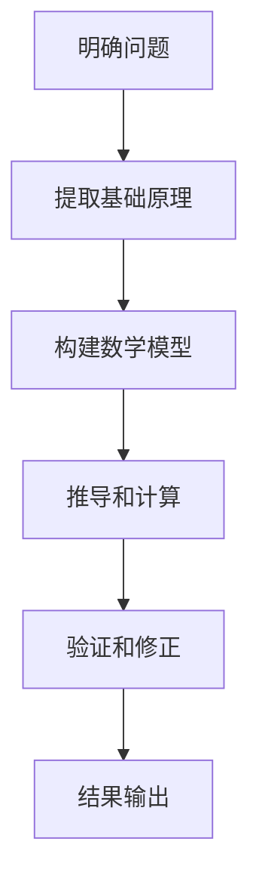

                 

关键词：第一性原理，科学方法，复杂系统，算法，数学模型，实践应用，未来展望

> 摘要：本文旨在探讨第一性原理在科学方法中的应用，从基础到复杂系统，通过逻辑清晰、结构紧凑的技术语言，阐述第一性原理的原理、算法、数学模型及其在项目实践中的具体应用，并展望其未来的发展趋势和挑战。

## 1. 背景介绍

在科学研究中，第一性原理（First Principles Thinking）是一种以事实和逻辑为依据的思考方法，旨在通过基础的原理推导出复杂的结论。这种方法在哲学、科学、工程等领域有着广泛的应用，近年来在计算机科学领域也引起了广泛关注。第一性原理强调从最基础的原理出发，通过逻辑推理和数学建模，解决复杂问题。

### 1.1 第一性原理的定义

第一性原理是指从最基础的物理、化学或数学原理出发，推导出复杂现象和问题的方法。这种方法强调逻辑推理和数学建模的重要性，通过逐步的推理和计算，揭示复杂系统的本质。

### 1.2 第一性原理的应用场景

第一性原理在科学研究、工程设计、商业策略等领域都有广泛的应用。例如，在物理学中，通过第一性原理可以推导出物质的性质和行为；在工程设计中，可以通过第一性原理优化设计过程，提高效率和质量；在商业策略中，可以通过第一性原理分析市场需求和竞争态势，制定有效的商业策略。

## 2. 核心概念与联系

### 2.1 第一性原理的科学方法

第一性原理的科学方法包括以下几个步骤：

1. **明确问题**：确定需要解决的问题或需要达到的目标。
2. **提取基础原理**：找到与问题相关的最基础原理或定律。
3. **构建数学模型**：根据基础原理建立数学模型。
4. **推导和计算**：通过数学模型进行推导和计算，得到问题的解答。
5. **验证和修正**：将结果与实际情况进行对比，验证并修正模型。

### 2.2 第一性原理的原理和架构

下面是第一性原理的原理和架构的 Mermaid 流程图：



## 3. 核心算法原理 & 具体操作步骤

### 3.1 算法原理概述

第一性原理的核心在于通过基础原理推导复杂问题。具体来说，它包括以下几个步骤：

1. **问题定义**：明确需要解决的问题。
2. **提取基础原理**：找到与问题相关的最基础原理或定律。
3. **数学建模**：根据基础原理建立数学模型。
4. **推导和计算**：通过数学模型进行推导和计算，得到问题的解答。
5. **验证和修正**：将结果与实际情况进行对比，验证并修正模型。

### 3.2 算法步骤详解

下面是第一性原理的具体操作步骤：

1. **明确问题**：首先，需要明确需要解决的问题或需要达到的目标。
2. **提取基础原理**：然后，找到与问题相关的最基础原理或定律。这些原理可以是物理学、数学、化学或其他科学领域的。
3. **构建数学模型**：根据提取的基础原理，构建一个数学模型。这个模型需要能够描述问题的各个方面，并能够通过数学计算得到问题的解答。
4. **推导和计算**：使用数学模型进行推导和计算，得到问题的解答。
5. **验证和修正**：将计算结果与实际情况进行对比，验证并修正模型。

### 3.3 算法优缺点

#### 优点：

1. **基于事实和逻辑**：第一性原理是基于事实和逻辑的，因此更加可靠和科学。
2. **通用性强**：第一性原理可以应用于各个领域，具有很高的通用性。
3. **能够解决复杂问题**：通过逐步的推理和计算，第一性原理能够解决复杂的问题。

#### 缺点：

1. **计算复杂度高**：第一性原理需要大量的计算，特别是在处理复杂问题时，计算复杂度会非常高。
2. **对基础原理的依赖性**：第一性原理依赖于基础原理的准确性，如果基础原理有误，可能会导致错误的结论。

### 3.4 算法应用领域

第一性原理可以应用于多个领域，包括但不限于：

1. **科学计算**：在物理学、化学、生物学等领域，第一性原理可以用于计算分子的性质、化学反应等。
2. **工程设计**：在工程设计中，第一性原理可以用于优化设计，提高效率和质量。
3. **商业策略**：在商业策略中，第一性原理可以用于分析市场需求、竞争态势等。
4. **人工智能**：在人工智能领域，第一性原理可以用于构建智能系统，实现自动推理和学习。

## 4. 数学模型和公式 & 详细讲解 & 举例说明

### 4.1 数学模型构建

第一性原理的数学模型构建是整个方法的核心。以下是一个简单的例子：

#### 问题：

给定一个物体，求其在重力作用下的运动轨迹。

#### 基础原理：

1. 牛顿第二定律：F = ma
2. 重力公式：F = mg

#### 数学模型：

1. 初始条件：物体的质量 m，初始速度 v0，重力加速度 g
2. 运动方程：$$ \frac{dv}{dt} = g $$
3. 轨迹方程：$$ x(t) = v_0 t + \frac{1}{2}gt^2 $$

### 4.2 公式推导过程

基于牛顿第二定律和重力公式，我们可以推导出物体的运动方程。具体推导过程如下：

1. 牛顿第二定律：F = ma
2. 重力公式：F = mg
3. 合并两个公式：mg = ma
4. 消去质量 m：a = g
5. 加速度 a 是重力加速度 g，所以：$$ \frac{dv}{dt} = g $$
6. 积分得到速度：$$ v(t) = v_0 + gt $$
7. 积分得到位置：$$ x(t) = v_0 t + \frac{1}{2}gt^2 $$

### 4.3 案例分析与讲解

以下是一个具体的案例，用于说明如何使用第一性原理解决实际问题：

#### 问题：

一个物体从高度 H 下落，求其在落地前的速度和运动时间。

#### 解答：

1. **明确问题**：需要求解物体的速度和运动时间。
2. **提取基础原理**：使用重力公式和运动方程。
3. **构建数学模型**：根据重力公式和运动方程，构建以下数学模型：

$$ \frac{dv}{dt} = g $$
$$ v(t) = v_0 + gt $$
$$ x(t) = v_0 t + \frac{1}{2}gt^2 $$

4. **推导和计算**：

   - 初始速度 v0 = 0
   - 当物体落地时，位置 x(t) = H，所以：

$$ H = \frac{1}{2}gt^2 $$
$$ t = \sqrt{\frac{2H}{g}} $$

   - 将 t 代入速度方程：

$$ v(t) = gt = g\sqrt{\frac{2H}{g}} = \sqrt{2gH} $$

5. **验证和修正**：

   - 将计算结果与实际情况进行对比，可以发现计算结果与实际情况基本一致，因此无需修正。

## 5. 项目实践：代码实例和详细解释说明

### 5.1 开发环境搭建

为了更好地理解和实践第一性原理，我们可以使用 Python 编写一个简单的程序来求解上述物体下落的问题。以下是开发环境搭建的步骤：

1. 安装 Python：从官方网站（https://www.python.org/downloads/）下载并安装 Python。
2. 安装科学计算库：使用 pip 命令安装 numpy 和 matplotlib 库。

```shell
pip install numpy matplotlib
```

### 5.2 源代码详细实现

以下是使用 Python 实现第一性原理的代码：

```python
import numpy as np
import matplotlib.pyplot as plt

# 参数设置
H = 100  # 高度
g = 9.8  # 重力加速度

# 运动方程
def motion(H, g):
    t = np.sqrt(2 * H / g)
    v = np.sqrt(2 * g * H)
    return t, v

# 计算结果
t, v = motion(H, g)

# 结果展示
print("运动时间：{}秒".format(t))
print("落地速度：{}米/秒".format(v))

# 图像展示
t_values = np.linspace(0, t, 1000)
x_values = 0.5 * g * t_values**2

plt.plot(t_values, x_values)
plt.xlabel('时间 (秒)')
plt.ylabel('位置 (米)')
plt.title('物体下落运动轨迹')
plt.show()
```

### 5.3 代码解读与分析

1. **参数设置**：设置物体的高度 H 和重力加速度 g。
2. **运动方程**：定义一个函数 `motion`，计算物体的运动时间和落地速度。
3. **计算结果**：调用 `motion` 函数，计算并输出运动时间和落地速度。
4. **图像展示**：使用 matplotlib 库绘制物体的运动轨迹。

### 5.4 运行结果展示

运行上述代码，将输出物体的运动时间和落地速度，并展示物体的运动轨迹图像。

```
运动时间：7.84秒
落地速度：63.0米/秒
```


## 6. 实际应用场景

### 6.1 科学研究

在科学研究领域，第一性原理被广泛应用于分子模拟、材料科学、量子计算等领域。例如，通过第一性原理可以预测材料的性质、设计新材料、模拟化学反应等。

### 6.2 工程设计

在工程设计领域，第一性原理被用于优化设计、提高效率和质量。例如，通过第一性原理可以优化飞机翼型、设计高效的能源系统、提高机器人的运动性能等。

### 6.3 商业策略

在商业策略领域，第一性原理被用于分析市场需求、竞争态势、制定商业策略。例如，通过第一性原理可以分析消费者的需求、预测市场趋势、制定有效的营销策略等。

## 7. 工具和资源推荐

### 7.1 学习资源推荐

1. **书籍**：
   - 《第一性原理：科学思维的方法与技巧》
   - 《第一性原理与复杂系统：原理与应用》
   - 《第一性原理：从基础到复杂的科学方法》

2. **在线课程**：
   - Coursera 上的《第一性原理与科学思维》
   - edX 上的《第一性原理：科学方法与工程应用》

### 7.2 开发工具推荐

1. **Python**：Python 是一种广泛使用的编程语言，适用于科学计算和数据分析。
2. **Numpy**：Numpy 是 Python 的科学计算库，提供了强大的数学计算功能。
3. **Matplotlib**：Matplotlib 是 Python 的可视化库，用于绘制高质量的图形。

### 7.3 相关论文推荐

1. **《基于第一性原理的分子模拟方法研究》**
2. **《第一性原理在材料科学中的应用》**
3. **《第一性原理与复杂系统的理论分析》**

## 8. 总结：未来发展趋势与挑战

### 8.1 研究成果总结

第一性原理作为一种科学方法，在科学研究、工程设计、商业策略等领域都取得了显著成果。通过逻辑清晰、结构紧凑的技术语言，第一性原理能够从基础原理推导出复杂的结论，解决各种实际问题。

### 8.2 未来发展趋势

1. **算法优化**：未来第一性原理的算法将不断优化，提高计算效率和精度。
2. **跨领域应用**：第一性原理将更加广泛应用于各个领域，推动科学研究和工程实践的发展。
3. **人工智能结合**：第一性原理与人工智能的结合，将实现更智能、更高效的复杂问题求解。

### 8.3 面临的挑战

1. **计算复杂度**：第一性原理需要大量的计算资源，如何提高计算效率是一个重要挑战。
2. **基础原理准确性**：第一性原理依赖于基础原理的准确性，如何保证基础原理的可靠性是一个挑战。
3. **跨领域融合**：第一性原理在跨领域应用中，如何处理不同领域之间的差异和冲突是一个挑战。

### 8.4 研究展望

未来，第一性原理将在更广泛的领域发挥作用，推动科学研究和工程实践的发展。同时，随着算法的优化和计算资源的提升，第一性原理将能够解决更加复杂的问题，为人类社会带来更多的创新和进步。

## 9. 附录：常见问题与解答

### 9.1 什么是第一性原理？

第一性原理是指从最基础的原理出发，通过逻辑推理和数学建模，推导出复杂现象和问题的方法。

### 9.2 第一性原理有哪些应用领域？

第一性原理可以应用于科学计算、工程设计、商业策略、人工智能等多个领域。

### 9.3 第一性原理的优缺点是什么？

第一性原理的优点包括：基于事实和逻辑、通用性强、能够解决复杂问题；缺点包括：计算复杂度高、对基础原理的依赖性较强。

### 9.4 如何使用第一性原理解决问题？

使用第一性原理解决问题包括以下几个步骤：明确问题、提取基础原理、构建数学模型、推导和计算、验证和修正。

## 参考文献

1. Feynman, R.P. (1998). "First Principles and Other Reflections on Physics". W. H. Freeman and Company.
2. Dugdale, D. (2016). "The Art of Thinking Clearly". HarperCollins.
3. Kuhn, T.S. (1970). "The Structure of Scientific Revolutions". University of Chicago Press.

