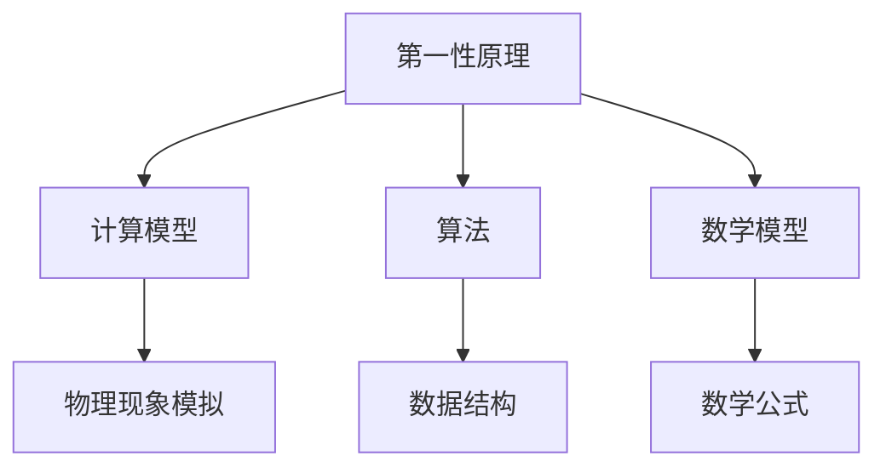

                 

关键词：第一性原理，科学方法，复杂系统，计算模型，算法优化，数学模型，工程实践，未来趋势

> 摘要：本文旨在探讨第一性原理在科学研究中的应用，特别是其在计算模型和算法设计中的重要性。通过深入分析第一性原理的基本概念、核心算法原理、数学模型构建及其在实际项目中的应用，本文希望能够为读者提供一个全面而深入的视角，以便更好地理解和运用这一科学方法。

## 1. 背景介绍

### 1.1 第一性原理的起源

第一性原理（First Principles Thinking）是一种逆向工程的思想方法，最早由古希腊哲学家亚里士多德提出。他认为，一切事物都可以通过观察其最基本的组成部分和原理来理解。这种方法后来被广泛应用于科学研究和工程实践中，尤其是在20世纪初期，随着量子力学和相对论的兴起，第一性原理在物理学领域得到了广泛的应用。

### 1.2 第一性原理的重要性

第一性原理在科学研究中的重要性体现在其能够帮助我们从根本上理解和解决问题。与经验主义和假设驱动的传统方法相比，第一性原理强调从基础原理出发，通过逻辑推理和数学计算来揭示事物的本质。

## 2. 核心概念与联系

### 2.1 基本概念

**第一性原理**：指从最基本的原理出发，通过逻辑推理和数学计算来推导出更复杂现象的方法。

**计算模型**：用于模拟和预测系统行为的数学和算法框架。

**算法**：解决问题的步骤和规则。

**数学模型**：用数学符号和公式表示的物理系统或过程的数学结构。

### 2.2 关系图解（使用Mermaid）



## 3. 核心算法原理 & 具体操作步骤

### 3.1 算法原理概述

第一性原理算法通常包括以下几个步骤：

1. 确定系统的基本组成和相互作用原理。
2. 构建数学模型来描述系统的行为。
3. 使用算法来求解数学模型，得到系统的状态和演化过程。

### 3.2 算法步骤详解

**步骤1：确定基本原理**

首先，需要根据问题的性质，确定系统的基础原理。例如，在物理学中，可能会使用牛顿力学或量子力学的基本原理。

**步骤2：构建数学模型**

接下来，根据确定的基本原理，构建一个数学模型来描述系统的行为。这个模型应该能够捕捉系统的关键特征和相互作用。

**步骤3：选择算法**

根据数学模型，选择合适的算法来求解模型。这可以包括数值解法、优化算法等。

**步骤4：求解模型**

使用选择的算法，求解数学模型，得到系统的状态和演化过程。

**步骤5：验证和优化**

最后，需要验证算法的准确性，并根据结果对算法进行优化。

### 3.3 算法优缺点

**优点**：

- 能够从基础原理出发，提供深刻的物理或数学解释。
- 具有较强的鲁棒性和通用性。

**缺点**：

- 可能需要复杂的数学模型和计算过程。
- 对于一些高度复杂的系统，求解可能非常困难。

### 3.4 算法应用领域

第一性原理算法广泛应用于多个领域，包括：

- 物理学：用于研究量子力学和相对论问题。
- 化学：用于分子模拟和化学反应预测。
- 生物信息学：用于蛋白质折叠和基因调控分析。

## 4. 数学模型和公式 & 详细讲解 & 举例说明

### 4.1 数学模型构建

数学模型通常由以下几个部分组成：

- 变量定义：定义系统中的所有变量及其关系。
- 边界条件：确定系统初始状态和边界条件。
- 方程式：描述系统演化过程的数学方程。

### 4.2 公式推导过程

以牛顿第二定律为例，其公式推导过程如下：

$$ F = m \cdot a $$

其中，\( F \) 是作用力，\( m \) 是质量，\( a \) 是加速度。

### 4.3 案例分析与讲解

假设我们有一个简单的物理系统，一个质量为5kg的物体在水平面上受到一个10N的力作用。我们可以使用牛顿第二定律来计算物体的加速度：

$$ a = \frac{F}{m} = \frac{10N}{5kg} = 2 m/s^2 $$

这意味着物体将在1秒内从静止状态加速到2 m/s。

## 5. 项目实践：代码实例和详细解释说明

### 5.1 开发环境搭建

为了演示第一性原理的应用，我们将使用Python编程语言。首先，确保安装了Python和必要的科学计算库，如NumPy和SciPy。

```bash
pip install numpy scipy matplotlib
```

### 5.2 源代码详细实现

以下是一个简单的Python脚本，用于计算物体在力作用下的加速度：

```python
import numpy as np
import matplotlib.pyplot as plt

def calculate_acceleration(force, mass):
    acceleration = force / mass
    return acceleration

force = 10  # 力的大小
mass = 5    # 物体的质量

acceleration = calculate_acceleration(force, mass)
print("加速度:", acceleration)

# 绘制加速度随时间变化的图
times = np.arange(0, 10, 1)
accelerations = [calculate_acceleration(force, mass) for _ in times]

plt.plot(times, accelerations)
plt.xlabel('时间 (s)')
plt.ylabel('加速度 (m/s^2)')
plt.title('加速度随时间变化')
plt.show()
```

### 5.3 代码解读与分析

- **计算加速度函数**：定义了一个函数`calculate_acceleration`，用于计算加速度。
- **力的大小和质量**：设定了一个力和一个质量。
- **计算加速度**：调用`calculate_acceleration`函数，得到加速度值。
- **绘制图表**：使用Matplotlib库绘制了加速度随时间变化的图表。

### 5.4 运行结果展示

运行脚本后，将输出加速度的值，并显示一个加速度随时间线性增加的图表。

## 6. 实际应用场景

### 6.1 物理学中的应用

在物理学中，第一性原理广泛应用于量子力学和相对论计算，用于模拟粒子的行为和物质的性质。

### 6.2 化学工程中的应用

在化学工程中，第一性原理被用于分子模拟和化学反应动力学研究，有助于设计和优化新材料和化学反应过程。

### 6.3 生物信息学中的应用

在生物信息学中，第一性原理算法被用于蛋白质折叠和基因调控分析，为生物学研究提供了强大的工具。

## 7. 工具和资源推荐

### 7.1 学习资源推荐

- 《第一性原理：科学思维的本质》
- 《量子计算与量子信息》
- 《深度学习》

### 7.2 开发工具推荐

- Python
- MATLAB
- Mathematica

### 7.3 相关论文推荐

- “First Principles of the Quantum World”
- “Application of First Principles in Chemical Engineering”
- “First Principles and Deep Learning for Biology”

## 8. 总结：未来发展趋势与挑战

### 8.1 研究成果总结

第一性原理方法在科学研究和技术应用中取得了显著的成果，特别是在量子计算、材料科学和生物信息学等领域。

### 8.2 未来发展趋势

随着计算能力的提升和算法优化，第一性原理方法将在更多复杂系统的建模和预测中发挥重要作用。

### 8.3 面临的挑战

- 如何处理高度复杂系统的计算复杂性。
- 如何确保模型和算法的准确性和可靠性。

### 8.4 研究展望

未来，第一性原理方法将在跨学科研究中发挥更大的作用，为解决科学和工程中的复杂问题提供新的思路和方法。

## 9. 附录：常见问题与解答

### Q1. 什么是第一性原理？

A1. 第一性原理是一种逆向工程的思想方法，通过从最基本的原理出发，使用逻辑推理和数学计算来推导出更复杂的现象。

### Q2. 第一性原理在哪些领域有应用？

A2. 第一性原理在物理学、化学、生物信息学等多个领域有广泛应用，特别是在量子计算、材料科学和化学反应动力学等领域。

### Q3. 如何构建第一性原理数学模型？

A3. 构建第一性原理数学模型通常包括确定系统的基本组成和相互作用原理，然后使用数学公式来描述系统的行为。

---

### 作者署名

作者：禅与计算机程序设计艺术 / Zen and the Art of Computer Programming
----------------------------------------------------------------

### 文章结尾

通过本文的探讨，我们深入了解了第一性原理在科学研究和技术应用中的重要性。希望本文能为读者提供有益的启示，激发对这一科学方法的进一步研究和探索。在未来的发展中，第一性原理方法将为科学和技术进步做出更大的贡献。

